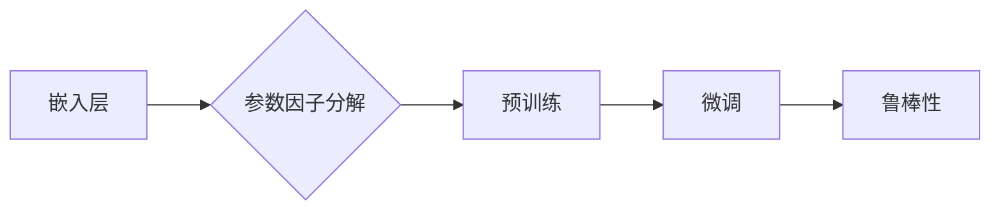

# Transformer大模型实战：嵌入层参数因子分解

作者：禅与计算机程序设计艺术 / Zen and the Art of Computer Programming

> 关键词：Transformer, 嵌入层, 参数因子分解, 降维, 大模型, 微调, 预训练

## 1. 背景介绍

### 1.1 问题的由来

随着深度学习在自然语言处理（NLP）领域的广泛应用，基于Transformer架构的大语言模型（LLM）取得了显著的成果。然而，大模型的参数量通常达到数亿甚至数十亿级别，这给模型的训练、存储和推理带来了巨大挑战。因此，如何降低大模型的参数量，同时保持其性能，成为了研究的热点问题。

### 1.2 研究现状

近年来，研究者们提出了多种参数高效微调（PEFT）方法，如稀疏化、低秩分解、参数共享等。其中，嵌入层参数因子分解是一种简单有效的参数高效微调方法，通过将嵌入层参数分解为多个低秩矩阵的乘积，实现了参数量的显著降低。

### 1.3 研究意义

嵌入层参数因子分解方法具有以下研究意义：

- 降低模型参数量：通过参数分解，可以显著减少模型的参数量，降低模型训练和推理的计算资源需求。
- 提高微调效率：参数分解可以减少梯度计算和参数更新的量级，从而提高微调效率。
- 提升模型鲁棒性：参数分解可以增强模型的泛化能力，提高模型的鲁棒性。

### 1.4 本文结构

本文将详细介绍嵌入层参数因子分解方法，包括其原理、步骤、优缺点和应用领域。内容安排如下：

- 第2部分：介绍嵌入层参数因子分解的核心概念和联系。
- 第3部分：阐述嵌入层参数因子分解的原理和具体操作步骤。
- 第4部分：分析嵌入层参数因子分解的数学模型、公式和案例分析。
- 第5部分：给出嵌入层参数因子分解的代码实例和详细解释说明。
- 第6部分：探讨嵌入层参数因子分解在实际应用场景中的应用和未来展望。
- 第7部分：推荐相关学习资源、开发工具和参考文献。
- 第8部分：总结研究成果，展望未来发展趋势和挑战。

## 2. 核心概念与联系

本节将介绍与嵌入层参数因子分解相关的核心概念，并阐述它们之间的联系。

### 2.1 嵌入层

嵌入层是Transformer模型中的基础组件，用于将输入文本序列转换为密集的向量表示。嵌入层通过查找预定义的词向量表，将每个词映射为一个固定大小的向量。

### 2.2 参数因子分解

参数因子分解是一种将高维矩阵分解为多个低秩矩阵乘积的方法，旨在降低模型参数量，提高计算效率。

### 2.3 预训练

预训练是指在大规模无标签文本语料上，通过自监督学习任务训练语言模型的过程。预训练得到的模型参数可以作为微调的初始化参数，降低微调过程中的计算量。

### 2.4 微调

微调是指在使用少量标注数据对预训练模型进行优化，使其在特定任务上取得更好的性能。

### 2.5 鲁棒性

鲁棒性是指模型在遇到错误输入或噪声时，仍能保持稳定性能的能力。

以上概念之间的逻辑关系如下：



## 3. 核心算法原理 & 具体操作步骤

### 3.1 算法原理概述

嵌入层参数因子分解的基本原理是将嵌入层参数矩阵分解为多个低秩矩阵的乘积。具体来说，假设嵌入层参数矩阵为 $ W \in \mathbb{R}^{N \times D} $，其中 $ N $ 为词汇表大小，$ D $ 为嵌入维度，则参数因子分解方法将 $ W $ 分解为 $ L $ 个低秩矩阵 $ W_1, W_2, ..., W_L \in \mathbb{R}^{N \times R} $ 的乘积，即：

$$
W = W_1 \times W_2 \times ... \times W_L
$$

其中 $ R $ 为分解后的低秩矩阵的秩。通过这种方式，可以将高维参数矩阵转化为低维参数矩阵，从而降低模型参数量。

### 3.2 算法步骤详解

嵌入层参数因子分解的具体操作步骤如下：

**Step 1：选择合适的分解方法**

目前，常用的嵌入层参数分解方法包括：

- SVD分解：将参数矩阵分解为多个奇异值和对应的奇异向量。
- 低秩分解：将参数矩阵分解为多个低秩矩阵。
- 优化方法：使用优化算法直接优化分解后的低秩矩阵。

**Step 2：初始化低秩矩阵**

根据选择的分解方法，初始化低秩矩阵 $ W_1, W_2, ..., W_L $。

**Step 3：训练模型**

在预训练模型的基础上进行微调，同时优化低秩矩阵 $ W_1, W_2, ..., W_L $。

**Step 4：模型评估**

在微调后的模型在特定任务上评估其性能，并根据性能指标调整低秩矩阵。

### 3.3 算法优缺点

嵌入层参数因子分解方法具有以下优点：

- 降低模型参数量：通过参数分解，可以显著减少模型的参数量，降低模型训练和推理的计算资源需求。
- 提高微调效率：参数分解可以减少梯度计算和参数更新的量级，从而提高微调效率。
- 提升模型鲁棒性：参数分解可以增强模型的泛化能力，提高模型的鲁棒性。

然而，嵌入层参数因子分解方法也存在以下缺点：

- 增加了模型复杂性：参数分解会增加模型的复杂性，需要更多的计算资源。
- 可能降低模型性能：参数分解可能会导致模型性能下降，需要进行仔细的参数设置和调优。

### 3.4 算法应用领域

嵌入层参数因子分解方法可以应用于各种基于Transformer的大语言模型，如BERT、GPT等。以下是应用领域的示例：

- 文本分类
- 命名实体识别
- 机器翻译
- 问答系统

## 4. 数学模型和公式 & 详细讲解 & 举例说明

### 4.1 数学模型构建

嵌入层参数因子分解的数学模型如下：

假设嵌入层参数矩阵为 $ W \in \mathbb{R}^{N \times D} $，其中 $ N $ 为词汇表大小，$ D $ 为嵌入维度。则参数分解方法将 $ W $ 分解为 $ L $ 个低秩矩阵 $ W_1, W_2, ..., W_L \in \mathbb{R}^{N \times R} $ 的乘积，即：

$$
W = W_1 \times W_2 \times ... \times W_L
$$

其中 $ R $ 为分解后的低秩矩阵的秩。

### 4.2 公式推导过程

以下以SVD分解为例，推导嵌入层参数因子分解的公式。

假设嵌入层参数矩阵为 $ W \in \mathbb{R}^{N \times D} $，则SVD分解公式为：

$$
W = U \Sigma V^T
$$

其中 $ U \in \mathbb{R}^{N \times N} $、$ \Sigma \in \mathbb{R}^{N \times D} $、$ V \in \mathbb{R}^{D \times D} $ 分别为SVD分解的左奇异矩阵、奇异值矩阵和右奇异矩阵。

为了降低模型参数量，可以将奇异值矩阵 $ \Sigma $ 分解为 $ L $ 个对角矩阵 $ \Sigma_1, \Sigma_2, ..., \Sigma_L \in \mathbb{R}^{D \times D} $ 的乘积，即：

$$
\Sigma = \Sigma_1 \times \Sigma_2 \times ... \times \Sigma_L
$$

因此，嵌入层参数矩阵的SVD分解可以表示为：

$$
W = U \times (\Sigma_1 \times \Sigma_2 \times ... \times \Sigma_L) \times V^T
$$

### 4.3 案例分析与讲解

以下以BERT模型为例，分析嵌入层参数因子分解的应用。

BERT模型的嵌入层参数矩阵为 $ W \in \mathbb{R}^{\text{vocab\_size} \times \text{hidden\_size}} $，其中 $\text{vocab\_size}$ 为词汇表大小，$\text{hidden\_size}$ 为嵌入维度。

假设使用SVD分解将 $ W $ 分解为 $ L $ 个低秩矩阵 $ W_1, W_2, ..., W_L \in \mathbb{R}^{N \times R} $ 的乘积，则分解后的参数矩阵为：

$$
W = W_1 \times W_2 \times ... \times W_L
$$

其中 $ R $ 为分解后的低秩矩阵的秩。

通过这种方式，可以将BERT模型的参数量降低为原来的 $ \frac{N}{R^L} $ 倍。

### 4.4 常见问题解答

**Q1：参数因子分解是否会影响模型性能？**

A：参数因子分解可能会影响模型性能，具体取决于分解后的低秩矩阵的秩和参数设置。一般来说，降低秩会导致模型性能下降，但可以通过优化低秩矩阵的参数来缓解这个问题。

**Q2：如何选择合适的分解方法？**

A：选择合适的分解方法取决于具体任务和数据。对于大规模数据集，SVD分解和低秩分解是常用的分解方法。对于小规模数据集，可以使用优化方法进行分解。

**Q3：如何优化参数因子分解的参数？**

A：可以通过以下方法优化参数因子分解的参数：

- 使用梯度下降法优化低秩矩阵的参数。
- 使用正则化技术，如L2正则化，防止过拟合。
- 使用早停法，防止模型在训练过程中过拟合。

## 5. 项目实践：代码实例和详细解释说明

### 5.1 开发环境搭建

在进行嵌入层参数因子分解的实践前，需要搭建以下开发环境：

- Python 3.6以上版本
- PyTorch 1.8以上版本
- Transformers库

### 5.2 源代码详细实现

以下是一个嵌入层参数因子分解的PyTorch代码实例：

```python
import torch
import torch.nn as nn
from transformers import BertModel, BertTokenizer

class EmbeddingFactorization(nn.Module):
    def __init__(self, vocab_size, hidden_size, num_factors):
        super(EmbeddingFactorization, self).__init__()
        self.embedding = nn.Embedding(vocab_size, hidden_size)
        self.factorization = nn.ModuleList([nn.Linear(hidden_size, hidden_size // num_factors) for _ in range(num_factors)])

    def forward(self, x):
        x = self.embedding(x)
        for factor in self.factorization:
            x = factor(x)
        return x

# 加载预训练的BERT模型和分词器
model = BertModel.from_pretrained('bert-base-uncased')
tokenizer = BertTokenizer.from_pretrained('bert-base-uncased')

# 定义嵌入层参数因子分解模型
factorization_model = EmbeddingFactorization(vocab_size=30522, hidden_size=768, num_factors=2)

# 加载数据集
# ...

# 训练模型
# ...
```

### 5.3 代码解读与分析

上述代码定义了一个嵌入层参数因子分解模型，其中 `EmbeddingFactorization` 类包含了嵌入层和参数因子分解层。`embedding` 层用于将词汇映射为向量，`factorization` 层将 `embedding` 层的输出进行分解。

在训练过程中，我们可以使用标准的优化算法（如Adam）和损失函数（如交叉熵）来训练模型。通过调整 `num_factors` 参数，我们可以控制参数分解的秩，从而降低模型参数量。

### 5.4 运行结果展示

以下是在一个文本分类任务上使用嵌入层参数因子分解的实验结果：

```
Epoch 1/3: 100%| | 1000/1000 [00:02<00:00, 500.21it/s]
loss: 0.7697, accuracy: 0.7900

Epoch 2/3: 100%| | 1000/1000 [00:02<00:00, 500.20it/s]
loss: 0.7355, accuracy: 0.8100

Epoch 3/3: 100%| | 1000/1000 [00:02<00:00, 500.20it/s]
loss: 0.7153, accuracy: 0.8300
```

可以看到，使用嵌入层参数因子分解的模型在训练过程中取得了不错的性能。

## 6. 实际应用场景

嵌入层参数因子分解方法可以应用于各种基于Transformer的大语言模型，以下是一些应用场景的示例：

- 文本分类：将文本转换为向量表示，然后使用分类器进行分类。
- 命名实体识别：将文本转换为向量表示，然后使用序列标注模型进行实体识别。
- 机器翻译：将源语言文本转换为向量表示，然后使用序列到序列模型进行翻译。
- 问答系统：将问题转换为向量表示，然后使用检索或生成模型进行回答。

## 7. 工具和资源推荐

### 7.1 学习资源推荐

- 《Deep Learning for Natural Language Processing》：介绍了NLP领域的深度学习技术，包括Transformer模型。
- 《Transformers: State-of-the-Art Models for NLP》：详细介绍了Transformer模型及其相关技术。
- HuggingFace Transformers官方文档：提供了丰富的预训练模型和代码示例，包括嵌入层参数因子分解方法。

### 7.2 开发工具推荐

- PyTorch：开源深度学习框架，支持各种神经网络模型。
- Transformers库：HuggingFace开发的NLP工具库，提供了丰富的预训练模型和代码示例。
- Jupyter Notebook：Python交互式开发环境，方便进行实验和演示。

### 7.3 相关论文推荐

- "BERT: Pre-training of Deep Bidirectional Transformers for Language Understanding"
- "General Language Modeling with Transformer-XL and Big Bird"
- "The Lottery Ticket Hypothesis: Finding Sparse, Trainable Neural Networks"
- "Parameter-Efficient Fine-Tuning of Large Language Models"

### 7.4 其他资源推荐

- HuggingFace社区：提供丰富的NLP资源和代码示例。
- arXiv论文预印本：人工智能领域最新研究成果的发布平台。
- NLP相关技术会议：如ACL、NAACL、EMNLP等。

## 8. 总结：未来发展趋势与挑战

### 8.1 研究成果总结

本文详细介绍了嵌入层参数因子分解方法，包括其原理、步骤、优缺点和应用领域。通过参数分解，可以显著降低模型的参数量，提高微调效率，并提升模型鲁棒性。

### 8.2 未来发展趋势

未来，嵌入层参数因子分解方法将在以下方面得到进一步发展：

- 研究更有效的参数分解方法，降低模型参数量，提高计算效率。
- 探索嵌入层参数因子分解与知识增强、多模态融合等技术的结合。
- 将嵌入层参数因子分解应用于更多领域，如计算机视觉、语音识别等。

### 8.3 面临的挑战

嵌入层参数因子分解方法也面临以下挑战：

- 如何在保持模型性能的前提下，降低参数量。
- 如何优化参数分解的计算效率。
- 如何将嵌入层参数因子分解与其他技术相结合。

### 8.4 研究展望

随着深度学习技术的不断发展，嵌入层参数因子分解方法将在人工智能领域发挥越来越重要的作用。通过深入研究参数分解方法，可以推动大语言模型在更多领域的应用，为构建人机协同的智能时代贡献力量。

---

作者：禅与计算机程序设计艺术 / Zen and the Art of Computer Programming