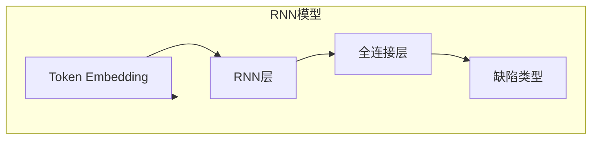

# 基于循环神经网络的静态代码分析

## 1. 背景介绍

### 1.1 问题的由来

随着软件系统的日益复杂化,代码质量问题越来越受到重视。传统的代码审查方式主要依赖人工,不仅效率低下,而且容易出现疏漏。因此,如何利用自动化技术来提高代码质量,确保代码的安全性、可靠性和可维护性,成为当前软件工程领域的一个重要课题。

静态代码分析(Static Code Analysis)作为一种自动化代码质量分析技术,通过对源代码进行语法和语义分析,能够发现潜在的缺陷和漏洞,从而提高代码质量。然而,传统的静态代码分析方法主要基于规则集或模式匹配,存在着一些局限性,比如:

1. **规则集有限**:规则集通常是基于人工总结的经验,难以覆盖所有可能的代码缺陷场景。
2. **上下文敏感性差**:规则匹配往往忽视了代码的上下文语义信息,容易产生误报和漏报。
3. **适应性较差**:对于新的编程语言或框架,需要重新定义规则集,难以快速适应新的技术变革。

为了克服传统静态代码分析方法的缺陷,研究人员开始探索基于机器学习的代码分析新范式,其中以深度学习技术为代表的人工智能方法展现出了巨大的潜力。

### 1.2 研究现状

近年来,深度学习在自然语言处理、图像识别等领域取得了卓越的成就,这为将深度学习应用于代码分析提供了有力支持。代码本质上也是一种特殊的"自然语言",因此可以将代码视为一种序列数据,利用序列建模的深度学习模型(如循环神经网络、transformer等)对其进行分析和理解。

目前,基于深度学习的静态代码分析研究主要集中在以下几个方面:

1. **代码缺陷检测**:通过训练神经网络模型,自动识别代码中的潜在缺陷,如空指针引用、资源泄漏、并发问题等。
2. **代码克隆检测**:发现代码库中的重复代码片段,有助于代码重构和去重。
3. **代码补全和修复**:根据上下文信息,自动补全或修复代码片段。
4. **代码迁移和翻译**:将代码从一种编程语言转换为另一种语言。
5. **代码注释生成**:自动为代码生成相应的注释,提高代码可读性。

在这些应用场景中,循环神经网络(Recurrent Neural Network, RNN)由于其擅长处理序列数据的特点,成为了代码分析任务中常用的深度学习模型。

### 1.3 研究意义

基于循环神经网络的静态代码分析技术,能够有效克服传统方法的局限性,为提高代码质量带来全新的机遇:

1. **高效性**:通过训练神经网络模型,可以自动高效地分析海量代码,大幅提高分析效率。
2. **准确性**:深度学习模型能够从大量数据中自动学习代码模式,提高了分析的精确度和召回率。
3. **上下文敏感**:循环神经网络能够很好地捕捉代码的上下文语义信息,降低了误报和漏报的风险。
4. **通用性**:深度学习模型对于新的编程语言和框架具有较强的适应能力,无需重新定义规则集。
5. **可解释性**:通过可视化技术和注意力机制,可以一定程度上解释神经网络模型的内部工作原理。

总的来说,基于循环神经网络的静态代码分析技术,为实现真正的"智能代码分析"奠定了坚实的基础,对于提高软件质量、降低开发成本、加速软件交付具有重要的现实意义。

### 1.4 本文结构

本文将全面介绍基于循环神经网络的静态代码分析技术,内容安排如下:

1. 背景介绍:阐述研究背景、现状和意义。
2. 核心概念与联系:介绍循环神经网络等核心概念,并与代码分析任务建立联系。
3. 核心算法原理与具体操作步骤:详细讲解算法原理和实现步骤,分析优缺点和应用场景。
4. 数学模型和公式详细讲解与举例说明:构建数学模型,推导公式,并结合案例进行讲解。
5. 项目实践:代码实例和详细解释说明:介绍开发环境搭建、源代码实现细节、代码解读和运行结果展示。
6. 实际应用场景:列举该技术在工业界的实际应用案例,并展望未来应用前景。
7. 工具和资源推荐:推荐相关的学习资源、开发工具、论文等资源。
8. 总结:未来发展趋势与挑战:总结研究成果,分析发展趋势和面临的挑战,并对未来研究方向进行展望。
9. 附录:常见问题与解答:列举一些常见的问题并给出解答。

## 2. 核心概念与联系

在介绍基于循环神经网络的静态代码分析技术之前,我们先来了解一些核心概念,并将其与代码分析任务建立联系。

### 2.1 循环神经网络(RNN)

循环神经网络是一种用于处理序列数据的深度学习模型。与传统的前馈神经网络不同,RNN在隐藏层之间增加了循环连接,使得网络能够捕捉输入序列中的动态时间行为和时序信息。

RNN的核心思想是在每个时间步,利用当前输入和上一时间步的隐藏状态,计算当前时间步的隐藏状态和输出。这种循环结构使得RNN能够很好地处理具有时序关系的数据,如自然语言、语音、视频等。

RNN的数学表达式如下:

$$
h_t = f_W(x_t, h_{t-1})
$$
$$
y_t = g_V(h_t)
$$

其中:
- $x_t$是时间步$t$的输入
- $h_t$是时间步$t$的隐藏状态
- $y_t$是时间步$t$的输出
- $f_W$和$g_V$分别是计算隐藏状态和输出的函数,通常使用非线性激活函数

虽然理论上RNN能够捕捉任意长度的时序信息,但在实践中,由于梯度消失或爆炸的问题,RNN难以很好地学习长期依赖关系。为了解决这个问题,研究人员提出了改进版的RNN模型,如长短期记忆网络(LSTM)和门控循环单元(GRU),它们通过引入门控机制来更好地捕捉长期依赖关系。

### 2.2 代码表示

将代码表示为神经网络可以理解的数值向量是应用深度学习进行代码分析的关键。常见的代码表示方法有:

1. **Token Embedding**:将代码分解为一系列token(如关键字、变量名、函数名等),并为每个token分配一个嵌入向量。
2. **Byte-level Embedding**:将代码视为原始字节序列,并为每个字节分配一个嵌入向量。
3. **AST Embedding**:将代码解析为抽象语法树(AST),并将AST中的节点和边缘表示为向量。

其中,Token Embedding是最常用的代码表示方法,因为它能够很好地保留代码的结构和语义信息。

### 2.3 将RNN应用于代码分析

由于代码本质上是一种序列数据,因此RNN及其变体模型(如LSTM、GRU)非常适合处理代码分析任务。我们可以将代码表示为一系列token embedding,并将其输入到RNN模型中,利用RNN捕捉代码的时序依赖关系。

根据不同的任务目标,我们可以设计不同的网络结构和损失函数。例如,对于代码缺陷检测任务,我们可以在RNN的输出端添加一个分类层,将其训练为二分类或多分类模型;对于代码补全任务,我们可以将RNN训练为生成模型,预测下一个token。

通过大量的代码数据训练,RNN模型能够自动学习代码模式,从而实现智能的代码分析和处理。与传统的规则匹配方法相比,基于RNN的方法具有更强的泛化能力,能够更好地适应新的编程语言和框架。

## 3. 核心算法原理与具体操作步骤

### 3.1 算法原理概述

基于循环神经网络的静态代码分析算法,主要分为以下几个核心步骤:

1. **代码表示**:将代码转换为神经网络可以理解的数值向量表示,常用的方法是Token Embedding。
2. **特征提取**:将代码向量输入到RNN模型中,利用RNN捕捉代码的时序依赖关系,提取代码的高级语义特征。
3. **任务建模**:根据不同的分析任务(如缺陷检测、代码补全等),设计相应的网络结构和损失函数。
4. **模型训练**:使用大量标注的代码数据集训练神经网络模型,通过反向传播算法优化模型参数。
5. **模型评估与应用**:在测试集上评估模型的性能表现,并将训练好的模型应用于实际的代码分析任务中。

该算法的核心思想是利用RNN这种强大的序列建模能力,自动从大量代码数据中学习代码模式和语义信息,从而实现智能化的代码分析。

值得注意的是,除了RNN之外,一些新兴的深度学习模型(如Transformer、图神经网络等)也展现出了在代码分析任务中的潜力。随着算力和数据量的不断提升,深度学习在代码分析领域的应用前景将越来越广阔。

### 3.2 算法步骤详解

我们以代码缺陷检测任务为例,详细介绍基于RNN的静态代码分析算法的具体实现步骤。

#### 3.2.1 数据准备

首先,我们需要准备一个包含大量代码样本及其缺陷标注的数据集。这些代码样本可以来自开源项目、公司内部代码库等。为了提高模型的泛化能力,数据集应当包含多种编程语言、多个应用领域的代码。

对于每个代码样本,我们需要执行以下预处理步骤:

1. **标注缺陷类型**:由专家或工具标注代码中存在的缺陷类型,如空指针引用、资源泄漏、并发问题等。
2. **词元化(Tokenization)**:将代码分解为一系列token,如关键字、变量名、函数名等。
3. **Token Embedding**:为每个token分配一个嵌入向量,作为该token的数值表示。

通过上述步骤,我们可以将原始代码转换为一系列token embedding,作为RNN模型的输入。

#### 3.2.2 模型结构

我们使用一种常见的基于RNN的序列标注模型结构,如下图所示:

具体来说:

1. **输入层**:将代码表示为一系列Token Embedding,作为RNN的输入。
2. **RNN层**:使用LSTM或GRU等RNN变体,捕捉代码的时序依赖关系,提取高级语义特征。
3. **全连接层**:对RNN的输出进行线性变换,为下一层分类做准备。
4. **输出层**:使用Softmax分类层,预测每个token对应的缺陷类型(包括无缺陷类别)。

在训练过程中,我们将使用带标注的代码样本数据,通过反向传播算法优化RNN模型的参数,使得模型能够很好地预测代码缺陷。

#### 3.2.3 模型训练

在模型训练阶段,我们将使用交叉熵损失函数作为优化目标。对于每个代码样本,我们将模型的预测结果与标注的缺陷类型进行比较,计算交叉熵损失,然后通过反向传播算法更新模型参数,使得损失函数最小化