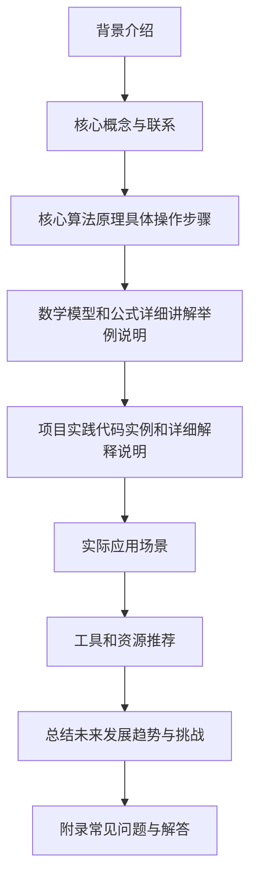
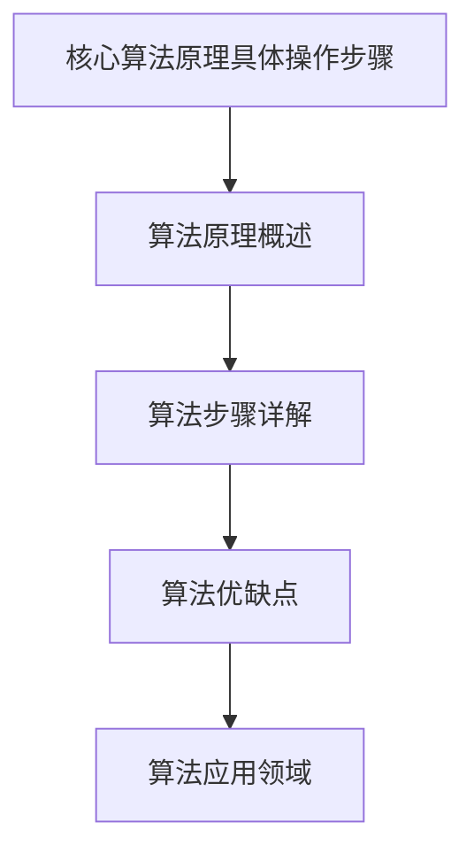

# 物理学中的群论：单纯李代数的线性表示

## 1. 背景介绍

### 1.1 问题的由来

在现代物理学中,群论扮演着至关重要的角色。它不仅为我们提供了一种描述自然界对称性的强有力工具,更为我们揭示了微观世界的奥秘。其中,单纯李代数的线性表示是群论在物理学中应用的核心内容之一。

自从物理学家发现了基本粒子的内在对称性以来,单纯李代数的线性表示就成为了探索这些对称性的关键途径。例如,在量子色动力学(QCD)中,描述强相互作用的基本对称群就是SU(3)群,它是一个特殊单纯李群。通过研究SU(3)群的线性表示,我们可以揭示夸克和胶子的内在结构,从而深入理解强相互作用的本质。

### 1.2 研究现状

目前,单纯李代数的线性表示在粒子物理学、量子场论、固体物理学等多个领域都有广泛的应用。例如,在标准模型中,描述电磁、弱和强相互作用的基本对称群分别是U(1)、SU(2)和SU(3),它们都是单纯李群。通过研究这些群的线性表示,我们可以揭示基本粒子的内禀性质,如电荷、同位旋等。

在凝聚态物理学领域,单纯李代数的线性表示也扮演着重要角色。例如,在研究晶体的对称性时,我们需要利用空间群的概念,而空间群的基础就是单纯李群SO(3)的线性表示。

### 1.3 研究意义

深入研究单纯李代数的线性表示,对于我们全面理解自然界的对称性具有重要意义。它不仅有助于我们揭示微观世界的本质规律,还可以指导我们设计新的实验,探索未知的物理现象。

此外,单纯李代数的线性表示在数学上也具有重要价值。它与表示论、李代数、代数几何等数学分支息息相关,是现代数学的重要组成部分。因此,研究单纯李代数的线性表示,不仅可以推动物理学的发展,也有助于数学理论的完善。

### 1.4 本文结构

本文将全面介绍单纯李代数的线性表示在物理学中的应用。我们将从基本概念出发,逐步深入探讨其核心原理和算法,并结合具体案例进行详细分析。最后,我们将总结未来的发展趋势和面临的挑战,为读者提供一个全面的视角。

文章主要结构如下:

## 2. 核心概念与联系

在深入探讨单纯李代数的线性表示之前,我们需要先了解一些基本概念,为后续内容做好铺垫。

### 2.1 李群和李代数

**李群(Lie Group)**是一种在许多物理理论中扮演重要角色的连续无穷小群。它由一个连续变换组成,可以用一组连续参数来描述。常见的李群有旋转群SO(3)、特殊单位群SU(N)等。

**李代数(Lie Algebra)**是与李群紧密相关的一种代数结构。每个李群都对应一个李代数,两者之间存在着同构关系。李代数由无穷小生成元和它们之间的交换关系(李括号)构成。研究李代数可以帮助我们更好地理解李群的性质。

### 2.2 单纯李代数

单纯李代数是一类特殊的李代数,它们满足某些额外的代数条件。具体来说,单纯李代数的根系统是简单根系统,因此它们没有理想。常见的单纯李代数包括:

- $\mathfrak{su}(n)$:特殊单位李代数
- $\mathfrak{so}(n)$:特殊正交李代数
- $\mathfrak{sp}(n)$:对称李代数

单纯李代数在物理学中扮演着核心角色,因为它们描述了自然界中的基本对称性。例如,标准模型中的基本相互作用就由单纯李代数$\mathfrak{su}(3)\oplus\mathfrak{su}(2)\oplus\mathfrak{u}(1)$来描述。

### 2.3 线性表示

**线性表示(Linear Representation)**是将一个抽象的代数结构(如群或李代数)用矩阵的方式来表示。具体来说,就是找到一个矩阵表示,使得群元素(或李代数元素)的运算对应于矩阵的相应运算。

线性表示不仅能帮助我们直观地理解代数结构的性质,更重要的是,它为我们提供了一种将抽象代数概念应用于实际物理问题的途径。因此,研究单纯李代数的线性表示,就是探索它们如何描述自然界的对称性。

### 2.4 表示理论

**表示理论(Representation Theory)**是一门研究代数结构的线性表示的数学理论。它为我们提供了系统的方法来构造和分类线性表示,并揭示它们之间的内在联系。

在物理学中,表示理论为我们提供了有力的工具来研究基本粒子的性质。例如,通过分析某个单纯李代数的不可约表示,我们可以确定相应粒子的量子数(如电荷、同位旋等)。因此,掌握表示理论对于深入理解单纯李代数的线性表示在物理学中的应用至关重要。

上述概念为我们奠定了基础,接下来我们将深入探讨单纯李代数线性表示的核心算法原理和具体操作步骤。

## 3. 核心算法原理 & 具体操作步骤

研究单纯李代数的线性表示,核心就是构造出它们的矩阵表示。这一过程涉及一系列复杂的数学计算,需要遵循一定的算法原理和操作步骤。

### 3.1 算法原理概述

构造单纯李代数的线性表示,主要依赖于以下几个核心原理:

1. **根系统和赫尔特标量(Cartan Scalar)**

   任何单纯李代数都可以通过它的根系统和赫尔特标量来唯一确定。根系统描述了李代数的代数结构,而赫尔特标量则反映了它的几何性质。因此,首先需要确定给定单纯李代数的根系统和赫尔特标量。

2. **最高根(Highest Root)和最高权重(Highest Weight)**

   在确定了根系统后,我们需要找到最高根和最高权重。最高根对应着李代数中的最大生成元,而最高权重则与不可约表示的"最大"向量相关。它们为构造线性表示奠定了基础。

3. **微扰理论(Perturbation Theory)和递推公式**

   利用微扰理论和一些递推公式,我们可以从最高根和最高权重出发,逐步构造出整个线性表示。这个过程需要大量的代数运算,是算法的核心所在。

4. **代数包裹(Algebraic Covering)**

   对于某些特殊的单纯李代数(如$B_n$、$C_n$和$D_n$族),我们还需要利用代数包裹的技术,将它们的线性表示与其他更简单的李代数(如$A_n$族)的表示联系起来。

上述原理为构造单纯李代数线性表示的算法奠定了理论基础。接下来,我们将详细介绍具体的操作步骤。

### 3.2 算法步骤详解

构造单纯李代数线性表示的算法步骤如下:

1. **确定根系统和赫尔特标量**

   首先,我们需要根据给定的单纯李代数,确定它的根系统和赫尔特标量。这一步通常需要查阅相关的数学文献或使用代数计算软件。

2. **寻找最高根和最高权重**

   在确定了根系统后,我们需要找到最高根和最高权重。最高根可以直接从根系统中读取,而最高权重则需要一些额外的计算。

3. **构造最高权重向量**

   接下来,我们需要构造出与最高权重对应的向量。这通常需要利用一些特殊的矩阵,如Jordan块等。

4. **应用微扰理论和递推公式**

   这是算法的核心步骤。我们需要应用微扰理论和一系列递推公式,从最高权重向量出发,逐步构造出整个线性表示。这个过程涉及大量的代数计算,需要编写相应的程序来实现。

5. **代数包裹(如果需要)**

   对于$B_n$、$C_n$和$D_n$族的单纯李代数,我们还需要利用代数包裹的技术,将它们的线性表示与$A_n$族的表示联系起来。这一步骤需要一些额外的代数运算。

6. **规范化和简化**

   最后,我们需要对构造出的线性表示进行规范化和简化,以得到最终的矩阵表示。这可能需要一些基变换和其他代数技巧。

上述步骤虽然看似简单,但实际操作过程中需要大量的数学计算和编程工作。我们将在后续章节中,结合具体案例,对这些步骤进行更加详细的解释和分析。

### 3.3 算法优缺点

构造单纯李代数线性表示的算法具有以下优缺点:

**优点:**

1. **理论完备性**:该算法建立在坚实的数学基础之上,具有很强的理论完备性。它可以系统地构造出任何单纯李代数的线性表示。

2. **普适性**:算法适用于所有单纯李代数,不受特定代数结构的限制。只要给定根系统和赫尔特标量,就可以应用该算法。

3. **高效性**:利用递推公式和代数包裹技术,算法可以高效地构造出线性表示,避免了直接计算的大量重复工作。

4. **可编程性**:算法的步骤清晰,易于用代码实现。我们可以编写相应的程序来自动化整个过程。

**缺点:**

1. **计算复杂度高**:尽管有递推公式的帮助,但构造过程中仍需要大量的代数计算,计算复杂度较高。

2. **依赖外部条件**:算法需要已知的根系统和赫尔特标量作为输入,这些信息通常需要查阅文献或使用代数计算软件获得。

3. **特殊情况处理**:对于$B_n$、$C_n$和$D_n$族的单纯李代数,需要进行额外的代数包裹处理,增加了算法的复杂性。

4. **规范化困难**:最终得到的线性表示往往需要进一步规范化和简化,这个过程可能比较困难,需要一些技巧性的代数运算。

总的来说,尽管该算法有一定的缺点和局限性,但它仍然是目前构造单纯李代数线性表示最有效和最系统的方法之一。在实际应用中,我们需要权衡算法的优缺点,并结合具体情况进行适当的优化和改进。

### 3.4 算法应用领域

构造单纯李代数线性表示的算法在物理学的多个领域都有重要应用,例如:

1. **粒子物理学**

   在粒子物理学中,标准模型中的基本相互作用由单纯李代数$\mathfrak{su}(3)\oplus\mathfrak{su}(2)\oplus\mathfrak{u}(1)$来描述。研究这些代数的线性表示,有助于我们揭示基本粒子的内禀性质,如电荷、同位