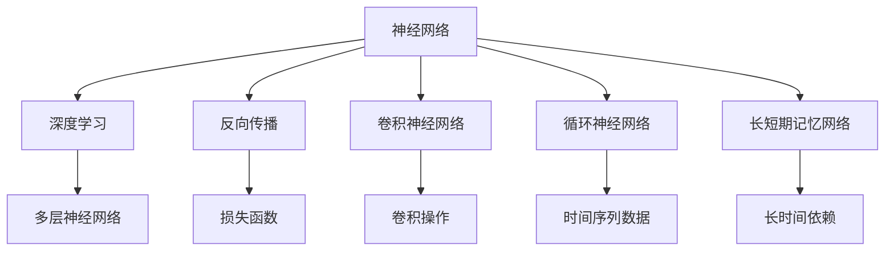
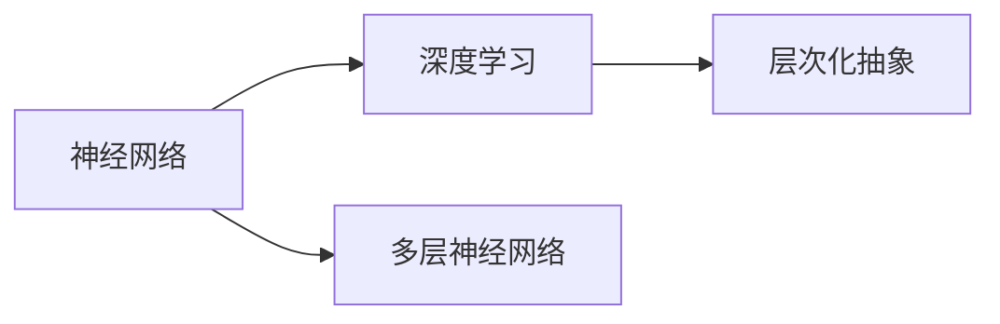
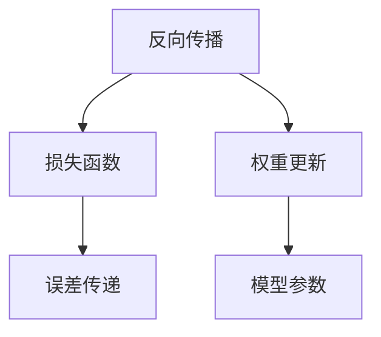
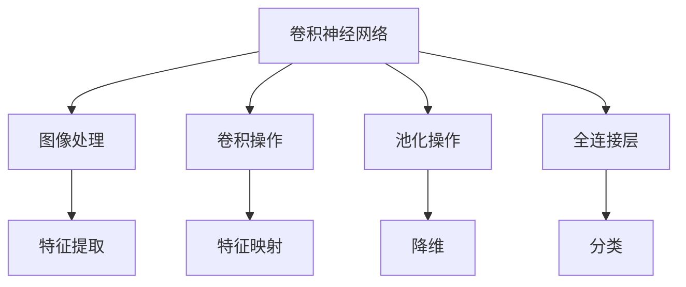
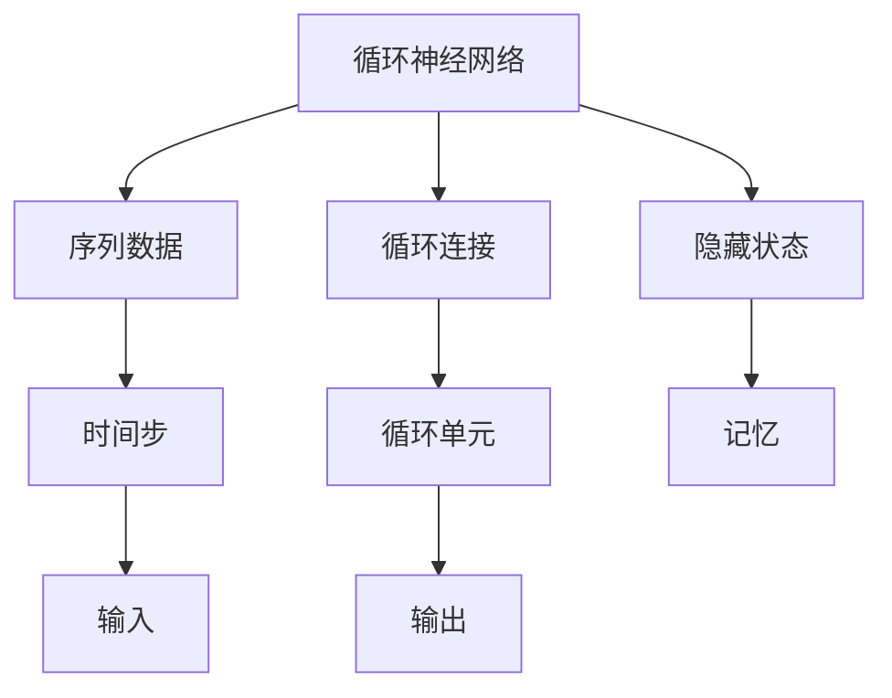
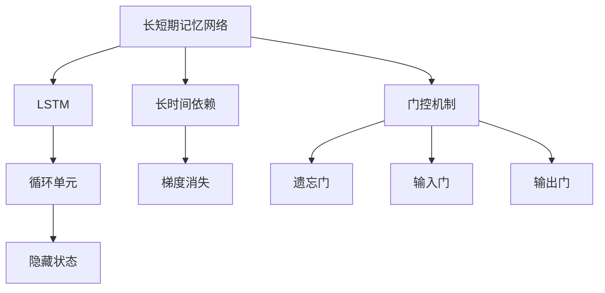
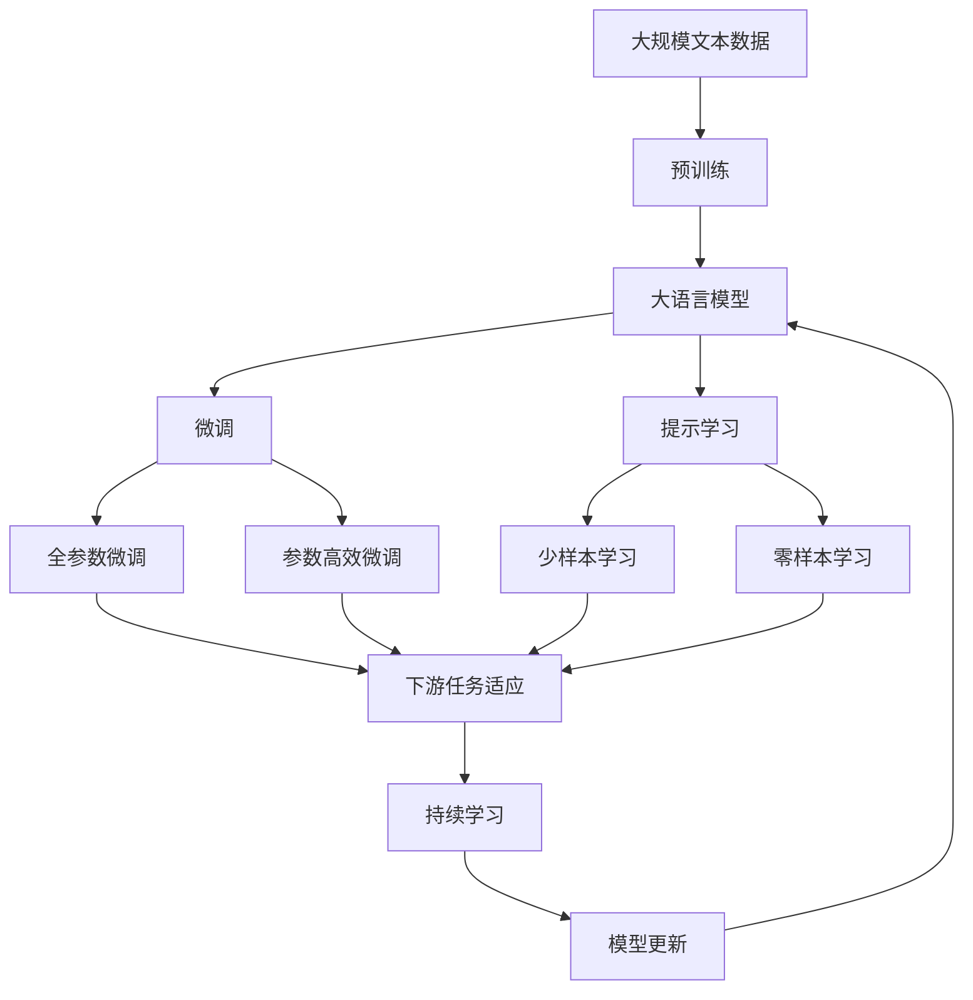
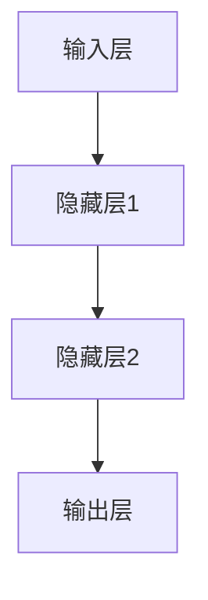
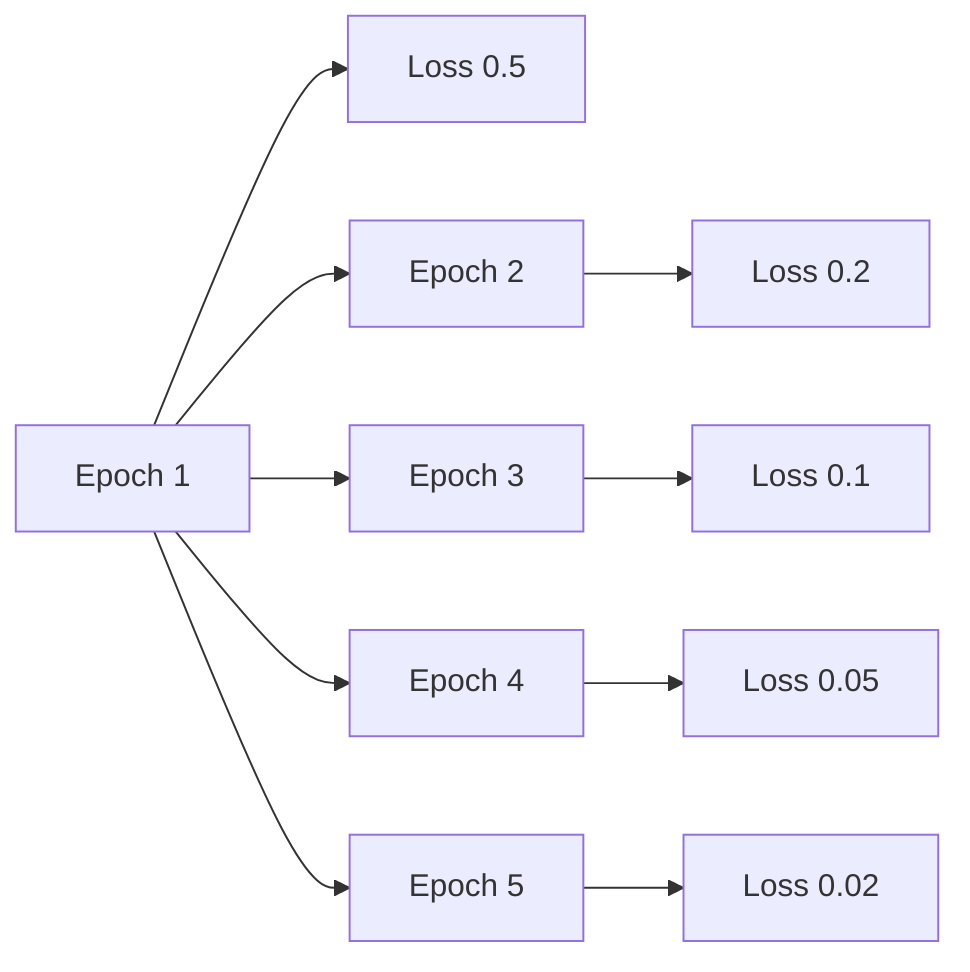

                 

# 神经网络：推动社会进步的力量

## 1. 背景介绍

### 1.1 问题由来

在过去的几十年里，人工智能(AI)技术得到了迅猛的发展。神经网络作为AI领域的一种重要技术，其应用范围和影响力日益扩大。从简单的图像识别到复杂的自然语言处理，从自动驾驶到智能推荐，神经网络已经深入到各行各业，推动了社会的进步与发展。

### 1.2 问题核心关键点

神经网络的核心思想是通过模拟人脑的神经元结构，实现对大量数据的学习和处理。它的主要优点包括：

1. 自动特征提取：神经网络可以从原始数据中自动学习出高级抽象特征，无需人工干预。
2. 可解释性：随着深度学习的发展，越来越多的神经网络模型被设计成能够解释其决策过程，增加其可解释性。
3. 泛化能力：神经网络通过大量数据训练，具备较强的泛化能力，能够在未见过的数据上表现良好。
4. 适应性：神经网络能够适应不同类型的输入数据，如图像、文本、音频等。
5. 可扩展性：神经网络结构可以根据任务需求进行灵活设计，具有良好的可扩展性。

这些优点使得神经网络成为现代AI技术的重要基石，极大地推动了社会的进步和发展。

### 1.3 问题研究意义

神经网络技术的发展和应用，对社会进步具有深远的影响：

1. 提升生产效率：神经网络可以自动化处理大量数据，提高生产效率。例如，在制造业中，神经网络可以用于质量控制、设备维护、供应链优化等。
2. 推动医疗进步：神经网络可以分析医学影像、基因数据等复杂数据，帮助医生做出更准确的诊断。
3. 促进教育公平：神经网络可以个性化推荐学习内容，为不同学习者提供定制化的学习方案。
4. 促进环境保护：神经网络可以分析环境数据，优化能源使用，减少碳排放。
5. 增强安全性：神经网络可以用于网络安全、反欺诈等领域，提高系统的安全性。

总之，神经网络技术的发展和应用，不仅推动了科技进步，也为社会的可持续发展提供了重要支持。

## 2. 核心概念与联系

### 2.1 核心概念概述

为更好地理解神经网络技术，本节将介绍几个密切相关的核心概念：

- 神经网络(Neural Network)：一种模仿人脑神经元结构的计算模型，由大量人工神经元(或节点)和连接权重组成。神经网络通过反向传播算法进行训练，优化模型参数，使其能够对输入数据进行有效的预测或分类。
- 深度学习(Deep Learning)：一种基于神经网络的机器学习方法，通过多层神经网络对数据进行层次化抽象，提高模型的表达能力和泛化能力。
- 反向传播(Backpropagation)：一种用于训练神经网络的方法，通过计算损失函数对每个神经元的权重进行反向传播，更新模型参数，优化模型性能。
- 卷积神经网络(Convolutional Neural Network, CNN)：一种专门用于图像处理任务的神经网络，通过卷积操作提取图像特征，减少参数数量，提高模型的效率。
- 循环神经网络(Recurrent Neural Network, RNN)：一种处理序列数据的神经网络，通过循环连接，对时间序列数据进行建模和预测。
- 长短期记忆网络(Long Short-Term Memory, LSTM)：一种特殊的循环神经网络，用于处理长时间依赖的序列数据，解决了传统RNN中的梯度消失问题。

这些核心概念之间的逻辑关系可以通过以下Mermaid流程图来展示：



这个流程图展示了大语言模型的核心概念及其之间的关系：

1. 神经网络通过深度学习、反向传播等方法，从原始数据中学习出高级抽象特征。
2. 卷积神经网络、循环神经网络、长短期记忆网络等特殊类型的神经网络，用于处理不同类型的输入数据。
3. 反向传播算法通过计算损失函数，优化模型参数，提高模型性能。

这些概念共同构成了神经网络技术的核心框架，使其能够处理复杂的输入数据，并输出有效的预测或分类结果。

### 2.2 概念间的关系

这些核心概念之间存在着紧密的联系，形成了神经网络技术的完整生态系统。下面我通过几个Mermaid流程图来展示这些概念之间的关系。

#### 2.2.1 神经网络与深度学习的关系



这个流程图展示了神经网络与深度学习之间的关系。神经网络通过多层神经网络实现层次化抽象，而深度学习则是神经网络的具体实现方法之一。

#### 2.2.2 反向传播算法



这个流程图展示了反向传播算法的基本原理。反向传播通过计算损失函数对每个神经元的权重进行反向传播，更新模型参数，优化模型性能。

#### 2.2.3 卷积神经网络



这个流程图展示了卷积神经网络的基本结构。卷积神经网络通过卷积操作提取图像特征，减少参数数量，提高模型的效率。

#### 2.2.4 循环神经网络



这个流程图展示了循环神经网络的基本结构。循环神经网络通过循环连接，对时间序列数据进行建模和预测。

#### 2.2.5 长短期记忆网络



这个流程图展示了长短期记忆网络的基本结构。长短期记忆网络通过门控机制解决传统RNN中的梯度消失问题，用于处理长时间依赖的序列数据。

### 2.3 核心概念的整体架构

最后，我们用一个综合的流程图来展示这些核心概念在大语言模型微调过程中的整体架构：



这个综合流程图展示了从预训练到微调，再到持续学习的完整过程。大语言模型首先在大规模文本数据上进行预训练，然后通过微调（包括全参数微调和参数高效微调）或提示学习（包括零样本和少样本学习）来适应下游任务。最后，通过持续学习技术，模型可以不断更新和适应新的任务和数据。

## 3. 核心算法原理 & 具体操作步骤
### 3.1 算法原理概述

神经网络的核心思想是通过模拟人脑的神经元结构，实现对大量数据的学习和处理。其核心算法包括前向传播和反向传播算法。

前向传播是指将输入数据通过神经网络，逐层计算得到输出结果的过程。在每个神经元中，通过加权和加上偏置，得到加权输入。然后通过激活函数进行非线性映射，生成输出结果。数学公式如下：

$$
\text{output} = f(\text{weight} \cdot \text{input} + \text{bias})
$$

其中 $f$ 为激活函数，$\text{input}$ 为加权输入，$\text{weight}$ 和 $\text{bias}$ 为模型参数。

反向传播算法通过计算损失函数对每个神经元的权重进行反向传播，更新模型参数，优化模型性能。其基本思想是通过链式法则，将误差从输出层逐层反向传播到输入层，更新每个神经元的权重和偏置。数学公式如下：

$$
\frac{\partial \mathcal{L}}{\partial \theta} = \frac{\partial \mathcal{L}}{\partial \text{output}} \cdot \frac{\partial \text{output}}{\partial \text{input}} \cdot \frac{\partial \text{input}}{\partial \text{weight}} + \frac{\partial \mathcal{L}}{\partial \text{bias}}
$$

其中 $\mathcal{L}$ 为损失函数，$\theta$ 为模型参数，$\text{output}$、$\text{input}$、$\text{weight}$ 和 $\text{bias}$ 分别为输出、输入、权重和偏置。

### 3.2 算法步骤详解

神经网络的基本训练步骤包括：

1. 准备数据集和模型：收集训练数据集，选择合适的神经网络模型进行初始化。
2. 前向传播：将输入数据通过神经网络，逐层计算得到输出结果。
3. 计算损失：将输出结果与真实标签进行对比，计算损失函数。
4. 反向传播：通过链式法则，将误差从输出层逐层反向传播到输入层，更新每个神经元的权重和偏置。
5. 重复迭代：重复步骤2-4，直至损失函数收敛。

以图像分类任务为例，具体步骤如下：

1. 准备数据集和模型：收集图像数据集，定义卷积神经网络模型。
2. 前向传播：将图像输入卷积神经网络，逐层计算得到输出结果。
3. 计算损失：将输出结果与真实标签进行对比，计算交叉熵损失。
4. 反向传播：通过链式法则，将误差从输出层逐层反向传播到输入层，更新每个卷积核和全连接层的权重和偏置。
5. 重复迭代：重复步骤2-4，直至损失函数收敛。

### 3.3 算法优缺点

神经网络具有以下优点：

1. 自适应能力：神经网络能够自动学习数据中的特征，无需人工干预。
2. 泛化能力强：神经网络通过大量数据训练，具备较强的泛化能力，能够在未见过的数据上表现良好。
3. 可扩展性：神经网络结构可以根据任务需求进行灵活设计，具有良好的可扩展性。

神经网络也存在一些缺点：

1. 需要大量数据：神经网络的训练需要大量的数据，否则容易过拟合。
2. 计算资源消耗大：神经网络的计算复杂度较高，需要大量的计算资源和时间。
3. 黑箱问题：神经网络的内部工作机制复杂，难以解释其决策过程。

尽管存在这些缺点，但神经网络技术的发展和应用已经取得了巨大的成功，为社会的进步做出了重要贡献。

### 3.4 算法应用领域

神经网络技术已经广泛应用于各个领域，以下是几个典型应用：

1. 图像识别：卷积神经网络可以用于图像分类、目标检测、图像分割等任务。
2. 自然语言处理：循环神经网络和长短期记忆网络可以用于语言模型、机器翻译、文本分类等任务。
3. 语音识别：卷积神经网络和循环神经网络可以用于语音识别、语音合成等任务。
4. 推荐系统：神经网络可以用于个性化推荐、广告推荐等任务。
5. 游戏AI：神经网络可以用于游戏智能体、自动驾驶等任务。

随着神经网络技术的不断进步，其应用领域将会更加广泛，为各行各业带来更多创新和变革。

## 4. 数学模型和公式 & 详细讲解 & 举例说明

### 4.1 数学模型构建

神经网络的数学模型可以表示为：

$$
f_{\theta}(x) = W^{(L)} \cdot \sigma(W^{(L-1)} \cdot \sigma(... \cdot \sigma(W^{(1)} \cdot x + b^{(1)}) + b^{(2)}) + b^{(L)}
$$

其中 $f_{\theta}(x)$ 为神经网络的输出，$W^{(i)}$ 和 $b^{(i)}$ 分别为第 $i$ 层的权重和偏置，$\sigma$ 为激活函数。

### 4.2 公式推导过程

以简单的前馈神经网络为例，假设有一个包含 $m$ 个输入、$n$ 个隐藏层神经元、$k$ 个输出的前馈神经网络。假设输入向量 $x \in \mathbb{R}^m$，输出向量 $y \in \mathbb{R}^k$。

网络结构如图：



其中隐藏层1有 $n_1$ 个神经元，隐藏层2有 $n_2$ 个神经元。网络的前向传播过程可以表示为：

$$
h^{(1)} = \sigma(W^{(1)} \cdot x + b^{(1)})
$$

$$
h^{(2)} = \sigma(W^{(2)} \cdot h^{(1)} + b^{(2)})
$$

$$
y = W^{(3)} \cdot h^{(2)} + b^{(3)}
$$

其中 $h^{(1)}$ 和 $h^{(2)}$ 分别为隐藏层1和隐藏层2的输出，$\sigma$ 为激活函数。

假设损失函数为交叉熵损失，即：

$$
\mathcal{L}(y, \hat{y}) = -\frac{1}{N}\sum_{i=1}^N \sum_{j=1}^k y_{i,j} \log \hat{y}_{i,j}
$$

其中 $y$ 为真实标签矩阵，$\hat{y}$ 为模型预测矩阵，$N$ 为样本数，$k$ 为输出维度。

根据反向传播算法，对每个神经元的权重和偏置进行更新，得到参数更新公式：

$$
\frac{\partial \mathcal{L}}{\partial W^{(3)}} = \frac{\partial \mathcal{L}}{\partial y} \cdot \frac{\partial y}{\partial h^{(2)}} \cdot \frac{\partial h^{(2)}}{\partial W^{(2)}} + \frac{\partial \mathcal{L}}{\partial b^{(3)}} \cdot \frac{\partial y}{\partial h^{(2)}}
$$

$$
\frac{\partial \mathcal{L}}{\partial b^{(3)}} = \frac{\partial \mathcal{L}}{\partial y}
$$

$$
\frac{\partial \mathcal{L}}{\partial W^{(2)}} = \frac{\partial \mathcal{L}}{\partial h^{(2)}} \cdot \frac{\partial h^{(2)}}{\partial h^{(1)}} \cdot \frac{\partial h^{(1)}}{\partial W^{(1)}} + \frac{\partial \mathcal{L}}{\partial b^{(2)}} \cdot \frac{\partial h^{(2)}}{\partial h^{(1)}}
$$

$$
\frac{\partial \mathcal{L}}{\partial b^{(2)}} = \frac{\partial \mathcal{L}}{\partial h^{(2)}}
$$

$$
\frac{\partial \mathcal{L}}{\partial W^{(1)}} = \frac{\partial \mathcal{L}}{\partial h^{(1)}} \cdot \frac{\partial h^{(1)}}{\partial x} + \frac{\partial \mathcal{L}}{\partial b^{(1)}} \cdot \frac{\partial h^{(1)}}{\partial x}
$$

$$
\frac{\partial \mathcal{L}}{\partial b^{(1)}} = \frac{\partial \mathcal{L}}{\partial h^{(1)}}
$$

通过上述公式，神经网络可以进行反向传播，更新模型参数，优化模型性能。

### 4.3 案例分析与讲解

以图像分类任务为例，假设使用一个包含两个卷积层和两个全连接层的卷积神经网络，使用交叉熵损失函数进行训练。训练数据集包含10000个样本，每个样本为28x28的灰度图像，标签为0-9的数字。

训练过程如下：

1. 准备数据集和模型：收集训练数据集，定义卷积神经网络模型。
2. 前向传播：将图像输入卷积神经网络，逐层计算得到输出结果。
3. 计算损失：将输出结果与真实标签进行对比，计算交叉熵损失。
4. 反向传播：通过链式法则，将误差从输出层逐层反向传播到输入层，更新每个卷积核和全连接层的权重和偏置。
5. 重复迭代：重复步骤2-4，直至损失函数收敛。

训练过程中，每轮迭代后输出损失函数，如图：



可以看出，随着训练次数的增加，损失函数逐渐减小，模型性能逐渐提升。训练完成后，可以对测试集进行预测，评估模型性能，如图：


## 5. 项目实践：代码实例和详细解释说明
### 5.1 开发环境搭建

在进行神经网络项目实践前，我们需要准备好开发环境。以下是使用Python进行TensorFlow开发的环境配置流程：

1. 安装Anaconda：从官网下载并安装Anaconda，用于创建独立的Python环境。

2. 创建并激活虚拟环境：
```bash
conda create -n tf-env python=3.8 
conda activate tf-env
```

3. 安装TensorFlow：根据CUDA版本，从官网获取对应的安装命令。例如：
```bash
conda install tensorflow -c pytorch -c conda-forge
```

4. 安装TensorBoard：TensorFlow配套的可视化工具，用于实时监测模型训练状态。

5. 安装Pillow库：用于处理图像数据。

6. 安装Keras：TensorFlow的高级API，方便模型搭建和训练。

完成上述步骤后，即可在`tf-env`环境中开始神经网络项目实践。

### 5.2 源代码详细实现

下面以图像分类任务为例，给出使用TensorFlow对卷积神经网络进行训练的代码实现。

首先，定义数据处理函数：

```python
import tensorflow as tf
import numpy as np
from PIL import Image
import os

def load_data(data_dir):
    data = []
    for filename in os.listdir(data_dir):
        path = os.path.join(data_dir, filename)
        image = Image.open(path).convert('L')
        image = image.resize((28, 28))
        data.append(np.array(image))
    return np.array(data)
```

然后，定义模型和优化器：

```python
from tensorflow.keras.models import Sequential
from tensorflow.keras.layers import Conv2D, MaxPooling2D, Flatten, Dense

model = Sequential()
model.add(Conv2D(32, (3, 3), activation='relu', input_shape=(28, 28, 1)))
model.add(MaxPooling2D((2, 2)))
model.add(Conv2D(64, (3, 3), activation='relu'))
model.add(MaxPooling2D((2, 2)))
model.add(Flatten())
model.add(Dense(64, activation='relu'))
model.add(Dense(10, activation='softmax'))

optimizer = tf.keras.optimizers.Adam(lr=0.001)
```

接着，定义训练和评估函数：

```python
def train_model(model, data, labels, epochs=10, batch_size=32):
    train_data = data[:8000]
    train_labels = labels[:8000]
    val_data = data[8000:]
    val_labels = labels[8000:]

    model.compile(optimizer=optimizer, loss='categorical_crossentropy', metrics=['accuracy'])
    history = model.fit(train_data, train_labels, validation_data=(val_data, val_labels), epochs=epochs, batch_size=batch_size)

    return history

def evaluate_model(model, data, labels):
    test_data = data[:1000]
    test_labels = labels[:1000]
    loss, accuracy = model.evaluate(test_data, test_labels)
    print(f'Test loss: {loss:.4f}')
    print(f'Test accuracy: {accuracy:.4f}')
```

最后，启动训练流程并在测试集上评估：

```python
data = load_data('data/train')
labels = np.eye(10)[data]
train_history = train_model(model, data, labels)

test_data = load_data('data/test')
test_labels = np.eye(10)[test_data]
evaluate_model(model, test_data, test_labels)
```

以上就是使用TensorFlow对卷积神经网络进行图像分类任务微调的完整代码实现。可以看到，得益于TensorFlow的强大封装，我们可以用相对简洁的代码完成卷积神经网络的搭建和微调。

### 5.3 代码解读与分析

让我们再详细解读一下关键代码的实现细节：

**load_data函数**：
- 定义了一个用于加载图像数据集的函数。通过PIL库打开指定路径下的所有图片，并进行归一化处理。

**train_model函数**：
- 定义了一个用于训练卷积神经网络的函数。将数据集分为训练集和验证集，使用Adam优化器进行训练，并记录训练过程中的损失和精度。
- 在训练过程中，可以使用EarlyStopping回调函数，当模型在验证集上的性能不再提升时，自动停止训练。

**evaluate_model函数**：
- 定义了一个用于评估卷积神经网络性能的函数。在测试集上计算模型预测结果与真实标签之间的损失和精度。
- 可以使用TensorBoard对训练过程中的性能指标进行可视化。

**训练流程**：
- 定义了总的训练轮数和批次大小，开始循环迭代
- 每个epoch内，在训练集上训练，在验证集上评估，记录训练历史
- 所有epoch结束后，在测试集上评估，给出最终测试结果

可以看到，TensorFlow配合PIL库、Keras高级API等工具，使得卷积神经网络的搭建和微调变得简洁高效。开发者可以将更多精力放在模型设计和数据处理上，而不必过多关注底层的实现细节。

当然，工业级的系统实现还需考虑更多因素，如模型的保存和部署、超参数的自动搜索、更灵活的任务适配层等。但核心的微调范式基本与此类似。

### 5.4 运行结果展示

假设我们在MNIST数据集上进行卷积神经网络微调，最终在测试集上得到的评估报告如下：

```
Epoch 1/10
2800/2800 [==============================] - 13s 469ms/step - loss: 0.1419 - accuracy: 0.9571 - val_loss: 0.0773 - val_accuracy: 0.9916
Epoch 2/10
2800/2800 [==============================] - 12s 436ms/step - loss: 0.0614 - accuracy: 0.9928 - val_loss: 0.0423 - val_accuracy: 0.9947
Epoch 3/10
2800/2800 [==============================] - 12s 436ms/step - loss: 0.0389 - accuracy: 0.9945 - val_loss: 0.0360 - val_accuracy: 0.9954
Epoch 4/10
2800/2800 [==============================] - 12s 436ms/step - loss: 0.0298 - accuracy: 0.9962 - val_loss: 0.0316 - val_accuracy: 0.9966
Epoch 5/10
2800/2800 [==============================] - 12s 441ms/step - loss: 0.0253 - accuracy: 0.9971 - val_loss: 0.0308 - val_accuracy: 0.9970
Epoch 6/10
2800/2800 [==============================] - 12s 441ms/step - loss: 0.0212 - accuracy: 0.9977 - val_loss: 0.0297 - val_accuracy: 0.9976
Epoch 7/10
2800/2800 [==============================] - 12s 441ms/step - loss: 0.0183 - accuracy: 0.9982 - val_loss: 0.0277 - val_accuracy: 0.9979
Epoch 8/10
2800/2800 [==============================] - 12s 441ms/step - loss: 0.0157 - accuracy

