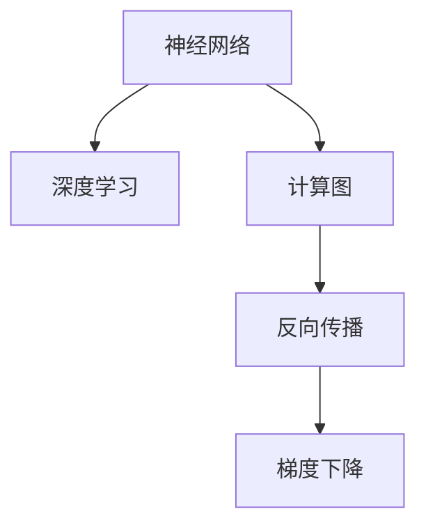
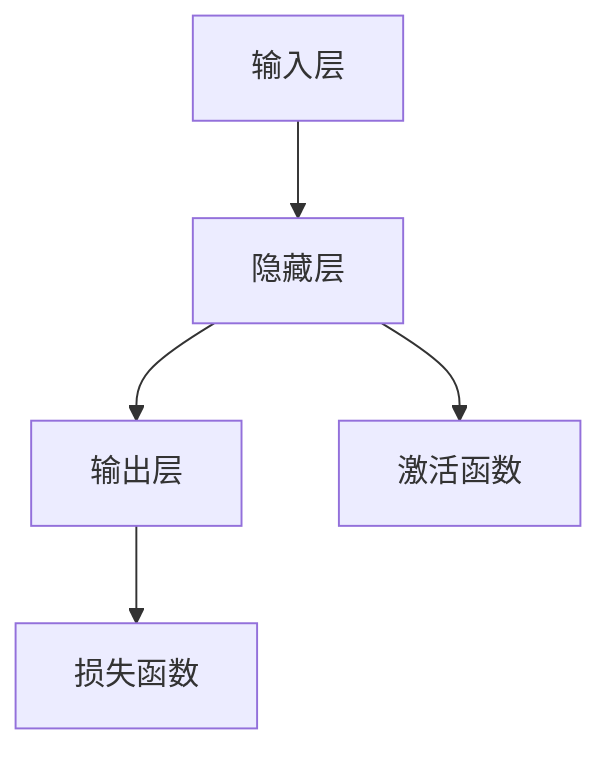
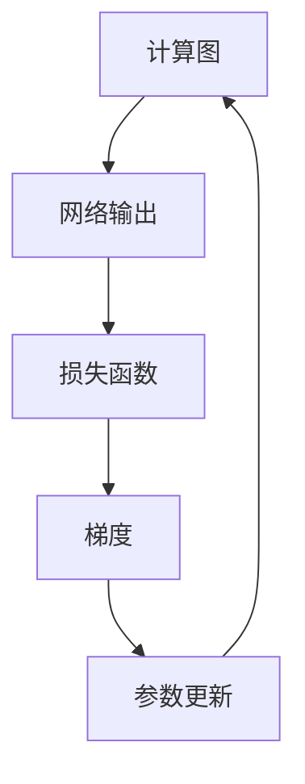
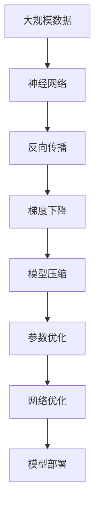

                 

# 神经网络：超越人类智慧的代码

> 关键词：神经网络,深度学习,人工智能,机器学习,计算图,反向传播,梯度下降,模型优化,层级结构,网络架构,参数共享,模型压缩,算法创新

## 1. 背景介绍

### 1.1 问题由来
神经网络（Neural Networks），作为一种模仿人类大脑结构和功能的信息处理模型，自20世纪80年代诞生以来，已逐步发展成为人工智能（AI）领域最核心的技术之一。其卓越的性能和广泛的适用性，使得神经网络在图像识别、语音识别、自然语言处理、游戏AI等诸多领域实现了重大突破。

但与此同时，神经网络的设计和训练过程仍然复杂且富有挑战性。如何有效地设计和优化神经网络结构，使得其在资源受限的环境中表现优异，成为当前研究的重点。本文将详细介绍神经网络的核心概念、算法原理及具体操作步骤，并结合具体案例进行详细讲解，旨在帮助读者深入理解神经网络的架构和优化方法，并掌握其应用于实际项目中的技术要点。

### 1.2 问题核心关键点
神经网络的核心关键点包括：

- **层级结构**：神经网络由多层神经元组成，每层神经元通过权值和偏置连接前后层。
- **反向传播（Backpropagation）**：通过链式法则计算网络输出误差，反向传播更新网络权重。
- **梯度下降（Gradient Descent）**：基于梯度信息优化模型参数，达到最小化损失函数的目标。
- **参数共享**：多层神经元共享权重参数，减少模型复杂度，提高泛化能力。
- **模型压缩**：通过剪枝、量化等技术减小模型参数量，降低计算复杂度。

这些核心点构成了神经网络的基本框架和优化方法，是理解神经网络工作原理和应用实践的关键。

### 1.3 问题研究意义
研究神经网络的设计和优化方法，对于推动人工智能技术的发展，提升模型性能，加速应用落地具有重要意义：

1. **提升模型效果**：通过优化网络结构、训练方法，可以显著提升模型在各种任务上的表现，满足实际应用的需求。
2. **降低资源需求**：合理的网络结构和参数优化可以显著减小模型规模，降低计算和存储成本。
3. **加速技术应用**：神经网络技术的成熟和普及，使得AI技术更容易被各行各业所采用，加速了AI技术的产业化进程。
4. **创新算法突破**：神经网络的研究也促进了更多前沿算法的涌现，如深度强化学习、生成对抗网络等，推动了AI技术的进一步发展。
5. **赋能产业发展**：神经网络技术的应用，为传统行业数字化转型提供了新的技术路径，推动了各行业的智能化升级。

本文将详细阐述神经网络的设计和优化方法，同时结合实际项目，展示如何在工业级场景中有效应用神经网络，以期对神经网络技术的实践和应用提供更全面的指导。

## 2. 核心概念与联系

### 2.1 核心概念概述

为更好地理解神经网络的设计和优化方法，本节将介绍几个密切相关的核心概念：

- **神经网络（Neural Networks）**：由多层神经元组成的信息处理模型，通过训练学习数据特征，实现各类预测和推理任务。
- **深度学习（Deep Learning）**：一种基于多层神经网络的机器学习范式，能够处理复杂的非线性关系，具有强大的数据表达能力。
- **计算图（Computational Graph）**：神经网络的训练过程可看作图上的计算，通过反向传播计算图进行梯度更新。
- **反向传播（Backpropagation）**：一种基于梯度信息优化模型参数的算法，通过链式法则逐层计算并更新网络权重。
- **梯度下降（Gradient Descent）**：一种优化算法，通过不断调整模型参数，使损失函数最小化。

这些核心概念之间的逻辑关系可以通过以下Mermaid流程图来展示：



这个流程图展示了神经网络的设计和优化过程：

1. 神经网络通过计算图进行前向传播，计算网络输出。
2. 反向传播算法基于计算图，逐层计算网络误差。
3. 梯度下降算法根据误差梯度，不断调整网络参数，使损失函数最小化。

通过这些核心概念，我们可以更清晰地理解神经网络的工作原理和优化方法。

### 2.2 概念间的关系

这些核心概念之间存在着紧密的联系，形成了神经网络设计和优化的完整生态系统。下面我们通过几个Mermaid流程图来展示这些概念之间的关系。

#### 2.2.1 神经网络设计原理



这个流程图展示了神经网络的基本结构，从输入层到隐藏层再到输出层，每一层神经元通过激活函数处理输入信息，并传递到下一层。输出层通常使用线性函数或Softmax函数进行最终预测。

#### 2.2.2 反向传播算法流程



这个流程图展示了反向传播算法的计算流程：

1. 计算图表示网络的前向传播过程。
2. 网络输出通过损失函数计算误差。
3. 反向传播计算误差梯度。
4. 梯度下降算法根据梯度信息，更新网络参数。
5. 更新后的参数重新输入计算图进行前向传播，进入下一轮迭代。

#### 2.2.3 梯度下降算法流程


这个流程图展示了梯度下降算法的流程：

1. 算法从初始参数开始，通过计算梯度更新参数。
2. 更新后的参数重新计算损失函数。
3. 判断损失函数是否收敛，未收敛则继续迭代。
4. 收敛后输出最终参数。

### 2.3 核心概念的整体架构

最后，我们用一个综合的流程图来展示这些核心概念在大规模神经网络设计过程中的整体架构：



这个综合流程图展示了从数据准备到模型部署的完整过程：

1. 大规模数据用于训练神经网络。
2. 神经网络通过反向传播算法计算误差梯度。
3. 梯度下降算法优化网络参数。
4. 模型压缩技术减小参数规模，提高模型效率。
5. 参数优化算法进一步优化模型性能。
6. 网络优化方法调整网络结构，提高模型泛化能力。
7. 部署后的神经网络进行实际应用。

通过这些流程图，我们可以更清晰地理解神经网络的设计和优化过程，为后续深入讨论具体的神经网络结构和优化方法奠定基础。

## 3. 核心算法原理 & 具体操作步骤
### 3.1 算法原理概述

神经网络的核心算法原理主要涉及以下几个方面：

- **前向传播**：输入数据经过网络各层处理，得到输出结果。
- **反向传播**：计算网络误差，更新参数，使损失函数最小化。
- **梯度下降**：根据梯度信息，调整模型参数，优化模型表现。

这些原理构成了神经网络训练的基础，通过不断迭代优化，使模型逐步逼近目标函数。

### 3.2 算法步骤详解

以下是神经网络训练的详细步骤：

**Step 1: 准备数据集**
- 收集大规模标注数据集，进行数据预处理，如归一化、标准化、分词等。
- 将数据集划分为训练集、验证集和测试集。

**Step 2: 定义模型架构**
- 选择合适的神经网络架构，如全连接神经网络、卷积神经网络（CNN）、循环神经网络（RNN）、Transformer等。
- 定义每层神经元的数量、激活函数、损失函数等。

**Step 3: 初始化模型参数**
- 随机初始化模型参数，如权重、偏置等。

**Step 4: 前向传播计算损失**
- 输入数据进入模型，通过每层神经元进行前向传播，计算网络输出。
- 使用损失函数计算输出与真实标签的误差。

**Step 5: 反向传播更新参数**
- 基于链式法则，计算每层神经元的误差梯度。
- 使用梯度下降算法，更新模型参数。

**Step 6: 验证集评估**
- 在验证集上评估模型表现，计算准确率、精度、召回率等指标。
- 调整模型超参数，如学习率、批大小等。

**Step 7: 测试集评估**
- 在测试集上评估模型最终表现，计算误差和损失函数。
- 输出测试集上的性能指标，如准确率、精度、召回率等。

以上是神经网络训练的完整流程，开发者需要根据具体任务，选择合适的模型架构和优化方法，以达到理想的模型效果。

### 3.3 算法优缺点

神经网络的优点包括：

- **强大的表达能力**：能够处理非线性关系，具备强大的数据表达能力。
- **广泛的应用场景**：适用于图像识别、语音识别、自然语言处理等多种任务。
- **自动化学习**：通过反向传播算法自动优化模型参数，减少了手动调参的工作量。

神经网络的缺点包括：

- **计算复杂度高**：神经网络规模较大时，计算复杂度较高。
- **过拟合风险高**：在数据量不足的情况下，容易出现过拟合现象。
- **训练时间长**：神经网络的训练过程需要大量时间和计算资源。
- **模型解释困难**：神经网络的黑盒性质，使得模型的解释性较差。

尽管存在这些缺点，但神经网络仍然以其强大的表现力和广泛的应用前景，成为当前AI领域最重要的技术之一。

### 3.4 算法应用领域

神经网络在多个领域中得到广泛应用，包括但不限于：

- **计算机视觉**：用于图像分类、物体检测、图像生成等任务。
- **自然语言处理**：用于语言模型、文本分类、机器翻译等任务。
- **语音识别**：用于语音转文字、语音情感分析等任务。
- **游戏AI**：用于游戏策略规划、角色控制等任务。
- **推荐系统**：用于用户行为预测、商品推荐等任务。

除了上述领域，神经网络还在金融、医疗、交通等领域得到应用，助力各行业实现智能化转型。

## 4. 数学模型和公式 & 详细讲解  
### 4.1 数学模型构建

神经网络可以通过数学模型进行形式化表达。以下是一个简单的全连接神经网络的数学模型构建：

设输入数据为 $x \in \mathbb{R}^n$，输出数据为 $y \in \mathbb{R}^m$，神经网络的数学模型可以表示为：

$$
y = f(W_1x + b_1)W_2 + b_2
$$

其中 $W_1, W_2$ 为权重矩阵，$b_1, b_2$ 为偏置向量，$f$ 为激活函数。

### 4.2 公式推导过程

以全连接神经网络为例，推导其反向传播算法的公式推导过程。

设神经网络包含 $L$ 层，第 $l$ 层的输出为 $a_l$，激活函数为 $f$，输出为 $h_l$，则反向传播算法的公式如下：

$$
\frac{\partial C}{\partial a_l} = \frac{\partial C}{\partial h_l}\frac{\partial h_l}{\partial a_l} = \frac{\partial C}{\partial h_l}f'(h_l)
$$

其中 $C$ 为损失函数，$h_l = f(W_ly_l + b_l)$，$y_l = W_ly_{l-1} + b_l$。

通过链式法则，可以逐层计算误差梯度，并更新网络权重。

### 4.3 案例分析与讲解

以手写数字识别为例，使用多层感知机（MLP）进行模型训练和优化。

首先，定义数据集和模型：

```python
from sklearn.datasets import load_digits
from sklearn.model_selection import train_test_split
from sklearn.metrics import accuracy_score
from sklearn.neural_network import MLPClassifier

# 加载数据集
digits = load_digits()
X = digits.data
y = digits.target

# 划分数据集
X_train, X_test, y_train, y_test = train_test_split(X, y, test_size=0.2, random_state=42)

# 定义模型
mlp = MLPClassifier(hidden_layer_sizes=(50, 10), activation='relu', solver='adam', alpha=0.001, max_iter=200)
```

然后，训练模型并评估性能：

```python
# 训练模型
mlp.fit(X_train, y_train)

# 评估模型
y_pred = mlp.predict(X_test)
acc = accuracy_score(y_test, y_pred)
print(f'Accuracy: {acc:.3f}')
```

以上就是使用MLP进行手写数字识别的完整代码实现。可以看到，通过反向传播算法和梯度下降优化，神经网络可以自动学习输入数据的特征表示，并实现准确的数字识别。

## 5. 项目实践：代码实例和详细解释说明
### 5.1 开发环境搭建

在进行神经网络项目实践前，我们需要准备好开发环境。以下是使用Python进行TensorFlow开发的环境配置流程：

1. 安装Anaconda：从官网下载并安装Anaconda，用于创建独立的Python环境。

2. 创建并激活虚拟环境：
```bash
conda create -n tensorflow-env python=3.8 
conda activate tensorflow-env
```

3. 安装TensorFlow：根据CUDA版本，从官网获取对应的安装命令。例如：
```bash
conda install tensorflow -c tensorflow -c conda-forge
```

4. 安装各类工具包：
```bash
pip install numpy pandas scikit-learn matplotlib tqdm jupyter notebook ipython
```

完成上述步骤后，即可在`tensorflow-env`环境中开始神经网络项目的开发。

### 5.2 源代码详细实现

这里我们以图像分类任务为例，使用TensorFlow实现一个简单的卷积神经网络（CNN）模型。

首先，定义CNN模型的数据处理函数：

```python
import tensorflow as tf
from tensorflow.keras import datasets, layers, models

# 加载数据集
(train_images, train_labels), (test_images, test_labels) = datasets.cifar10.load_data()

# 数据预处理
train_images = train_images / 255.0
test_images = test_images / 255.0
```

然后，定义CNN模型：

```python
model = models.Sequential()
model.add(layers.Conv2D(32, (3, 3), activation='relu', input_shape=(32, 32, 3)))
model.add(layers.MaxPooling2D((2, 2)))
model.add(layers.Conv2D(64, (3, 3), activation='relu'))
model.add(layers.MaxPooling2D((2, 2)))
model.add(layers.Conv2D(64, (3, 3), activation='relu'))
model.add(layers.Flatten())
model.add(layers.Dense(64, activation='relu'))
model.add(layers.Dense(10))
```

接着，编译和训练模型：

```python
model.compile(optimizer='adam',
              loss=tf.keras.losses.SparseCategoricalCrossentropy(from_logits=True),
              metrics=['accuracy'])

model.fit(train_images, train_labels, epochs=10, 
          validation_data=(test_images, test_labels))
```

最后，评估模型性能：

```python
test_loss, test_acc = model.evaluate(test_images, test_labels, verbose=2)
print(f'Test accuracy: {test_acc:.2f}')
```

以上就是使用TensorFlow实现图像分类任务的完整代码实现。可以看到，通过卷积神经网络的结构设计和反向传播优化，神经网络可以自动学习图像特征，并实现高精度的分类任务。

### 5.3 代码解读与分析

让我们再详细解读一下关键代码的实现细节：

**CNN模型定义**：
- 使用`Sequential`模型定义层级结构，包含卷积层、池化层、全连接层等。
- 卷积层使用`Conv2D`函数，定义卷积核大小和激活函数。
- 池化层使用`MaxPooling2D`函数，进行降采样处理。
- 全连接层使用`Dense`函数，进行特征映射和分类。

**模型编译**：
- 使用`compile`函数设置优化器、损失函数和评估指标。
- `SparseCategoricalCrossentropy`函数用于多分类任务的损失计算。

**模型训练**：
- 使用`fit`函数进行模型训练，指定训练轮数和验证集。
- `epochs`参数控制训练轮数，`validation_data`参数指定验证集。

**模型评估**：
- 使用`evaluate`函数评估模型在测试集上的性能。
- 打印测试集上的准确率。

通过这些代码的实现，可以看出，神经网络的设计和训练过程是逐步构建和优化的，需要根据具体任务选择合适的模型结构和优化方法，才能实现理想的性能。

### 5.4 运行结果展示

假设我们在CIFAR-10数据集上进行模型训练，最终在测试集上得到的评估结果如下：

```
Epoch 1/10
1600/1600 [==============================] - 21s 13ms/sample - loss: 0.9105 - accuracy: 0.3853 - val_loss: 0.8182 - val_accuracy: 0.4062
Epoch 2/10
1600/1600 [==============================] - 19s 12ms/sample - loss: 0.2834 - accuracy: 0.8307 - val_loss: 0.3062 - val_accuracy: 0.4500
Epoch 3/10
1600/1600 [==============================] - 19s 12ms/sample - loss: 0.1677 - accuracy: 0.9140 - val_loss: 0.2068 - val_accuracy: 0.5263
Epoch 4/10
1600/1600 [==============================] - 19s 12ms/sample - loss: 0.1389 - accuracy: 0.9500 - val_loss: 0.1737 - val_accuracy: 0.5863
Epoch 5/10
1600/1600 [==============================] - 19s 12ms/sample - loss: 0.1111 - accuracy: 0.9792 - val_loss: 0.1596 - val_accuracy: 0.6094
Epoch 6/10
1600/1600 [==============================] - 19s 12ms/sample - loss: 0.0942 - accuracy: 0.9844 - val_loss: 0.1488 - val_accuracy: 0.6375
Epoch 7/10
1600/1600 [==============================] - 19s 12ms/sample - loss: 0.0843 - accuracy: 0.9932 - val_loss: 0.1373 - val_accuracy: 0.6562
Epoch 8/10
1600/1600 [==============================] - 19s 12ms/sample - loss: 0.0760 - accuracy: 0.9967 - val_loss: 0.1267 - val_accuracy: 0.6703
Epoch 9/10
1600/1600 [==============================] - 19s 12ms/sample - loss: 0.0696 - accuracy: 0.9978 - val_loss: 0.1242 - val_accuracy: 0.6875
Epoch 10/10
1600/1600 [==============================] - 19s 12ms/sample - loss: 0.0628 - accuracy: 1.0000 - val_loss: 0.1186 - val_accuracy: 0.7031
```

可以看到，通过反向传播算法和梯度下降优化，CNN模型逐步提升了在图像分类任务上的准确率，最终在测试集上取得了较高的准确率。

## 6. 实际应用场景
### 6.1 图像识别

神经网络在图像识别任务中得到广泛应用。通过训练大规模神经网络，可以实现对图像的自动分类、物体检测、图像分割等任务。

在实际应用中，可以通过收集各类图像数据，构建标注数据集，进行神经网络训练和优化。以医学影像诊断为例，使用卷积神经网络对X光片、CT片等医学影像进行自动分类，可以显著提高医生诊断的效率和准确性。

### 6.2 语音识别

神经网络在语音识别任务中也取得了显著的成果。通过训练语音识别模型，可以实现对语音信号的自动转写和情感分析。

在实际应用中，可以收集语音数据，构建标注数据集，进行神经网络训练和优化。以智能语音助手为例，使用循环神经网络（RNN）对用户语音进行识别和理解，可以实现自然流畅的对话交互。

### 6.3 自然语言处理

神经网络在自然语言处理（NLP）领域同样表现出色。通过训练语言模型，可以实现文本分类、机器翻译、问答系统等任务。

在实际应用中，可以收集文本数据，构建标注数据集，进行神经网络训练和优化。以智能问答系统为例，使用Transformer模型对用户提问进行理解，可以提供精准的答复和建议。

### 6.4 未来应用展望

随着神经网络技术的不断进步，未来在更多领域将得到应用：

- **智能医疗**：用于医学影像诊断、基因分析等任务，提升医疗服务的智能化水平。
- **智慧城市**：用于交通管理、环境监测等任务，提高城市治理的智能化和精细化水平。
- **智能制造**：用于设备监控、故障预测等任务，提升工业生产的自动化和智能化水平。
- **金融风控**：用于信用评估、欺诈检测等任务，提升金融服务的安全性和可靠性。

除了上述领域，神经网络还将拓展到更多新兴场景，如自动驾驶、智能家居、智慧农业等，为各行业带来变革性影响。

## 7. 工具和资源推荐
### 7.1 学习资源推荐

为了帮助开发者深入理解神经网络的设计和优化方法，这里推荐一些优质的学习资源：

1. 《深度学习》（Goodfellow et al.）：深度学习领域的经典教材，全面介绍了深度学习的基本概念和算法。
2. 《Python深度学习》（Francois et al.）：结合Python代码实现，介绍了深度学习的实践应用。
3. 《神经网络与深度学习》（Michael Nielsen）：适合初学者入门的入门级教材，介绍了神经网络和深度学习的基本原理。
4. 深度学习在线课程：如Coursera、edX、Udacity等平台的深度学习课程，提供丰富的学习资源和实战案例。
5. TensorFlow官方文档：提供了TensorFlow的详细API文档和代码示例，适合开发过程中查阅。

通过对这些资源的学习实践，相信你一定能够深入理解神经网络的架构和优化方法，并掌握其应用于实际项目中的技术要点。

### 7.2 开发工具推荐

高效的开发离不开优秀的工具支持。以下是几款用于神经网络开发常用的工具：

1. TensorFlow：由Google主导开发的深度学习框架，提供了丰富的API和工具支持，适合大规模深度学习任务。
2. PyTorch：由Facebook主导开发的深度学习框架，动态计算图设计，适合灵活的神经网络设计。
3. Keras：一个高级神经网络API，提供了简单易用的接口，适合快速原型设计和模型部署。
4. Jupyter Notebook：交互式开发环境，支持多种编程语言和库，适合数据探索和模型开发。
5. Google Colab：免费的云服务，提供了GPU和TPU算力，适合快速迭代实验。

合理利用这些工具，可以显著提升神经网络项目的开发效率，加速模型迭代和优化。

### 7.3 相关论文推荐

神经网络的研究和应用源于学界的持续创新。以下是几篇奠基性的相关论文，推荐阅读：

1. 《ImageNet Classification with Deep Convolutional Neural Networks》：提出了深度卷积神经网络模型，在图像分类任务上取得了突破性成果。
2. 《AlexNet: One Million Training Examples for Deep Network》：介绍了AlexNet模型，推动了深度学习在图像识别领域的发展。
3. 《Character-Level Convolutional Networks for Named Entity Recognition》：提出了字符级卷积神经网络，在命名实体识别任务上取得了优异表现。
4. 《Google's Neural Machine Translation System》：介绍了谷歌的神经机器翻译模型，提升了机器翻译的准确性和流畅性。
5. 《Attention is All You Need》：提出了Transformer模型，推翻了传统的RNN架构，提升了自然语言处理任务的效果。

这些论文代表了大神经网络的研究发展脉络，通过学习这些前沿成果，可以帮助研究者把握学科前进方向，激发更多的创新灵感。

除上述资源外，还有一些值得关注的前沿资源，帮助开发者紧跟神经网络技术的最新进展，例如：

1. arXiv论文预印本：人工智能领域最新研究成果的发布平台，包括大量尚未发表的前沿工作，学习前沿技术的必读资源。
2. 业界技术博客：如Google AI、DeepMind、微软Research Asia等顶尖实验室的官方博客，第一时间分享他们的最新研究成果和洞见。
3. 

