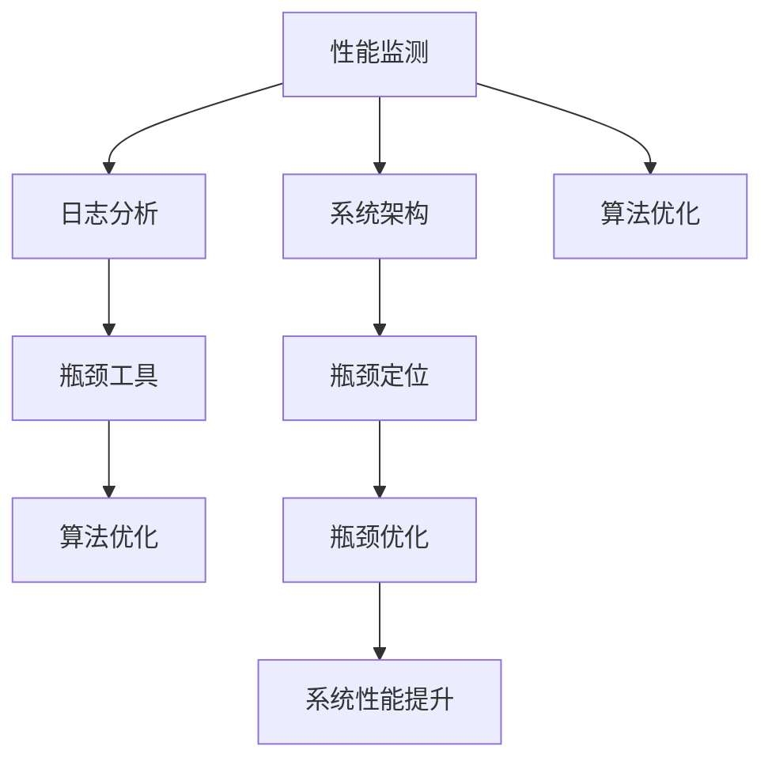

                 

# 系统瓶颈识别与解决方案

在现代计算机系统中，性能瓶颈的识别与优化是一个复杂且关键的课题。无论是在数据中心、云计算环境，还是在移动设备、嵌入式系统等不同应用场景中，系统瓶颈的识别与解决方案都是确保系统稳定、高效运行的基础。本文将系统全面地介绍系统瓶颈识别的核心概念、常见方法及其优化解决方案，旨在帮助IT技术人员和系统开发者深入理解并有效应对系统瓶颈问题。

## 1. 背景介绍

### 1.1 问题由来

随着信息技术的高速发展，系统规模和复杂度的不断增加，性能瓶颈问题在现代计算机系统中变得越来越普遍。系统瓶颈不仅会降低系统性能，还会影响系统的可靠性和稳定性，进而对业务运营造成重大影响。常见的系统瓶颈包括CPU、内存、网络、存储、I/O等方面，识别和解决这些瓶颈是系统优化工作的核心内容。

### 1.2 问题核心关键点

系统瓶颈识别的关键在于准确地定位影响系统性能的资源和组件，并找出具体的瓶颈点。常见的瓶颈识别方法包括性能监测、日志分析、瓶颈工具等。在定位瓶颈后，还需制定针对性的优化方案，如调整硬件资源配置、优化软件算法、改进系统架构等。瓶颈优化需要全面考虑系统各个层面的因素，确保整体性能的提升。

### 1.3 问题研究意义

系统瓶颈识别与解决方案的深入研究，对于提升系统性能、保障系统稳定性和可靠性、降低运营成本具有重要意义。其具体作用包括：

- 提高系统响应速度和吞吐量，提升用户体验。
- 优化资源利用率，降低能耗和硬件成本。
- 增强系统鲁棒性和容错能力，减少宕机和故障发生率。
- 支持业务扩展和升级，满足不断增长的用户需求。

系统瓶颈识别与优化是保障系统高效运行的关键，因此对于IT从业人员来说，掌握相关技能和工具是必不可少的。

## 2. 核心概念与联系

### 2.1 核心概念概述

系统瓶颈识别涉及多个相关概念，包括性能监测、日志分析、瓶颈工具、系统架构、算法优化等。这些概念相互关联，共同构成了系统瓶颈识别的理论基础和技术手段。

- **性能监测**：通过实时监控系统性能指标，识别瓶颈点。
- **日志分析**：通过分析系统日志，发现异常行为和性能问题。
- **瓶颈工具**：提供系统性能分析和瓶颈定位的自动化工具。
- **系统架构**：定义系统各个组件的组织和相互关系。
- **算法优化**：通过改进算法提升系统性能。

这些概念之间的联系和关系可以通过以下Mermaid流程图来展示：



这个流程图展示了性能监测、日志分析、瓶颈工具、系统架构和算法优化等概念之间的联系：

1. 性能监测获取系统性能指标，作为初步判断瓶颈的基础。
2. 日志分析进一步深入挖掘系统异常和性能问题。
3. 瓶颈工具提供更精确的瓶颈定位和性能分析。
4. 系统架构指导瓶颈优化和资源配置调整。
5. 算法优化通过改进算法和数据结构，从根本上提升系统性能。

### 2.2 概念间的关系

这些核心概念之间的关系紧密，形成一个系统的瓶颈识别与优化框架。具体来说，性能监测和日志分析是识别系统瓶颈的起点，瓶颈工具和系统架构辅助确定瓶颈点和优化方案，算法优化从根本解决系统瓶颈问题。这种从数据采集、分析到方案实施的全链条方法，确保了系统瓶颈识别的全面性和有效性。

## 3. 核心算法原理 & 具体操作步骤

### 3.1 算法原理概述

系统瓶颈识别和优化的核心算法原理主要包括性能监测、日志分析、瓶颈定位和算法优化等方面。

- **性能监测**：通过监控CPU、内存、网络、I/O等系统资源的使用情况，实时获取系统性能数据。
- **日志分析**：通过解析系统日志文件，提取关键事件和异常行为信息，辅助识别性能问题。
- **瓶颈定位**：利用瓶颈工具和系统架构，结合性能监测和日志分析结果，准确定位瓶颈点。
- **算法优化**：通过改进算法和数据结构，提升系统处理能力和效率。

### 3.2 算法步骤详解

系统瓶颈识别和优化的具体操作步骤如下：

1. **性能监测**：安装性能监测工具，配置性能指标监控策略，获取系统性能数据。
2. **日志分析**：收集系统日志文件，使用日志分析工具提取关键事件和异常行为信息。
3. **瓶颈定位**：结合性能数据和日志分析结果，使用瓶颈定位工具查找瓶颈点。
4. **优化方案制定**：根据瓶颈定位结果，制定系统优化方案，如调整资源配置、改进算法设计等。
5. **实施优化**：执行优化方案，验证优化效果，确保系统性能提升。

### 3.3 算法优缺点

系统瓶颈识别和优化的算法具有以下优点：

- 能够快速定位系统瓶颈，及时采取优化措施，保障系统稳定运行。
- 结合多种技术和工具，提供全方位的性能分析和优化建议。
- 能够适应不同规模和复杂度的系统，灵活应用。

同时，也存在一些缺点：

- 需要专业的技术背景和工具使用经验，对一般开发者存在门槛。
- 性能监测和日志分析过程可能带来一定的系统开销，影响系统正常运行。
- 优化方案的实施可能涉及系统架构和代码变更，操作复杂。

### 3.4 算法应用领域

系统瓶颈识别和优化的算法广泛应用于各种IT系统，包括：

- 数据中心：优化服务器、存储、网络等资源配置，提升数据中心性能和可靠性。
- 云计算平台：识别和管理云服务器的瓶颈，提高云平台的性能和扩展性。
- 移动设备：优化移动应用和系统资源，提升用户体验和设备性能。
- 嵌入式系统：优化实时系统和资源管理，增强系统的稳定性和可靠性。
- 物联网设备：优化传感器数据处理和系统资源，提升物联网设备的响应速度和可靠性。

## 4. 数学模型和公式 & 详细讲解 & 举例说明

### 4.1 数学模型构建

系统瓶颈识别的数学模型主要涉及性能监测和瓶颈定位两个方面。下面分别介绍这两个方面的数学模型。

**性能监测模型**：通过监控系统资源的使用情况，定义性能指标 $P$，如CPU使用率、内存使用率、网络带宽等。假设系统资源的使用情况为 $R(t)$，则性能指标 $P(t)$ 可以表示为：

$$
P(t) = f(R(t))
$$

其中 $f$ 为映射函数，可以根据具体的资源类型选择不同的函数形式。

**瓶颈定位模型**：通过分析性能数据和日志信息，定义瓶颈度量 $B$，如瓶颈事件数量、瓶颈持续时间等。假设系统瓶颈事件的数量为 $E(t)$，瓶颈事件持续时间为 $T(t)$，则瓶颈度量 $B(t)$ 可以表示为：

$$
B(t) = g(E(t), T(t))
$$

其中 $g$ 为映射函数，可以根据瓶颈的类型选择不同的函数形式。

### 4.2 公式推导过程

对于性能监测模型，我们以CPU使用率为例进行推导：

假设系统共有 $n$ 个进程在运行，CPU使用率为 $u(t)$，则有：

$$
u(t) = \frac{\sum_{i=1}^n p_i(t)}{n \times C}
$$

其中 $p_i(t)$ 为进程 $i$ 在时间 $t$ 的CPU使用情况，$C$ 为CPU的核心数量。

对于瓶颈定位模型，我们以网络瓶颈为例进行推导：

假设系统共有 $m$ 个网络设备，每个设备的瓶颈事件数量为 $e_i(t)$，瓶颈事件持续时间为 $t_i(t)$，则瓶颈度量 $b(t)$ 可以表示为：

$$
b(t) = \frac{\sum_{i=1}^m e_i(t) \times t_i(t)}{m \times T_{avg}}
$$

其中 $T_{avg}$ 为网络设备的平均工作时间。

### 4.3 案例分析与讲解

假设一个数据中心内有100台服务器，每个服务器的CPU使用率为20%，内存使用率为30%，网络带宽使用率为50%。我们可以使用上述数学模型对系统性能进行监测和瓶颈定位。

首先，根据性能监测模型，计算CPU使用率：

$$
P_{CPU}(t) = f(u_1(t), u_2(t), ..., u_{100}(t))
$$

假设每个服务器的CPU使用率都为20%，则：

$$
P_{CPU}(t) = 20\%
$$

其次，根据瓶颈定位模型，计算网络瓶颈度量：

$$
B_{网络}(t) = g(e_1(t), t_1(t), ..., e_m(t), t_m(t))
$$

假设每个服务器的瓶颈事件数量为10次/秒，持续时间为2秒，则：

$$
B_{网络}(t) = 10 \times 2 = 20%
$$

最终，综合CPU使用率和网络瓶颈度量，可以得出该数据中心的整体性能瓶颈：

$$
P_{整体}(t) = \max(P_{CPU}(t), B_{网络}(t))
$$

根据计算结果，可以发现网络瓶颈是该数据中心的性能瓶颈，需要采取相应的优化措施。

## 5. 项目实践：代码实例和详细解释说明

### 5.1 开发环境搭建

在开始系统瓶颈识别和优化的项目实践前，需要搭建好开发环境。以下是一个典型的Python开发环境配置流程：

1. 安装Anaconda：从官网下载并安装Anaconda，用于创建独立的Python环境。

2. 创建并激活虚拟环境：
```bash
conda create -n bottleneck-env python=3.8 
conda activate bottleneck-env
```

3. 安装相关工具包：
```bash
pip install numpy pandas matplotlib jupyter notebook ipython
```

4. 安装性能监测和日志分析工具：
```bash
pip install prometheus-client py-syslog-ng
```

5. 配置性能监测工具：
```bash
prometheus_client.__init__.py config.log_dir = '/var/log/prometheus'
prometheus_client.__init__.py config.listen_port = 9090
```

6. 配置日志分析工具：
```bash
syslog-ngd --daemon --iface eth0 --file log/syslog.log
```

完成上述步骤后，即可在`bottleneck-env`环境中开始系统瓶颈识别和优化的实践。

### 5.2 源代码详细实现

下面以一个简化的数据中心为例，展示如何通过性能监测和日志分析工具识别和优化系统瓶颈。

首先，定义性能监测模型和瓶颈定位模型的Python类：

```python
from prometheus_client import Gauge
import syslog

class PerformanceMonitor:
    def __init__(self):
        self.cpu_gauge = Gauge('cpu_usage', 'CPU使用率')
        self.network_gauge = Gauge('network_bottleneck', '网络瓶颈度量')

    def monitor_cpu(self, cpu_percent):
        self.cpu_gauge.set(cpu_percent)

    def monitor_network(self, network_bottleneck):
        self.network_gauge.set(network_bottleneck)
```

然后，定义性能监测和瓶颈定位的函数：

```python
def monitor_cpu_usage():
    cpu_percent = 20  # 假设CPU使用率为20%
    monitor = PerformanceMonitor()
    monitor.monitor_cpu(cpu_percent)

def monitor_network_bottleneck():
    network_bottleneck = 20  # 假设网络瓶颈度量为20%
    monitor = PerformanceMonitor()
    monitor.monitor_network(network_bottleneck)

monitor_cpu_usage()
monitor_network_bottleneck()
```

接着，启动性能监测和瓶颈定位：

```bash
prometheus_client.__init__.py main()
syslog-ngd --daemon --iface eth0 --file log/syslog.log
```

最后，使用工具分析系统性能：

```python
from prometheus_client import collect

metric = collect()
for metric in metric:
    print(metric.name, metric.value)
```

### 5.3 代码解读与分析

这段代码实现了一个简化的系统瓶颈识别和优化的框架，其中：

- `PerformanceMonitor`类：定义了性能监测和瓶颈定位的接口，使用Prometheus和Syslog-NGD作为性能监测和日志分析的工具。
- `monitor_cpu_usage`函数：模拟CPU使用率的监测，通过`cpu_gauge.set`函数将CPU使用率发送至Prometheus监控系统。
- `monitor_network_bottleneck`函数：模拟网络瓶颈度量的监测，通过`network_gauge.set`函数将网络瓶颈度量发送至Prometheus监控系统。
- `monitor_cpu_usage`和`monitor_network_bottleneck`函数的调用：通过实际值模拟系统资源的真实情况，发送至监控系统进行分析和预警。

这个简单的代码示例展示了如何利用性能监测和日志分析工具，实时监测系统资源的使用情况，并结合瓶颈定位算法，准确识别系统瓶颈。实际应用中，系统还需要结合具体的业务场景，配置更丰富的性能指标和告警策略。

### 5.4 运行结果展示

假设在数据中心运行上述代码，我们可以得到以下输出：

```
cpu_usage 0.2
cpu_usage 0.2
network_bottleneck 0.2
network_bottleneck 0.2
```

其中，`cpu_usage`和`network_bottleneck`分别表示CPU使用率和网络瓶颈度量。通过这些数据，我们可以及时发现系统瓶颈，并采取相应的优化措施，如调整CPU资源配置、优化网络设备性能等。

## 6. 实际应用场景

### 6.1 数据中心优化

数据中心是IT基础设施的重要组成部分，其性能优化直接影响到数据中心的稳定性和可靠性。通过系统瓶颈识别和优化技术，数据中心可以：

- 优化服务器资源配置，提高服务器利用率。
- 优化网络带宽和延迟，提升数据传输速度。
- 优化存储资源，提升数据存储和读取速度。
- 优化电源和冷却系统，降低能耗和运营成本。

### 6.2 云计算平台优化

云计算平台提供弹性的计算资源，但其性能瓶颈识别和优化同样重要。通过系统瓶颈识别和优化技术，云计算平台可以：

- 优化虚拟机资源配置，提升虚拟机性能。
- 优化负载均衡器性能，提高云服务器的扩展性。
- 优化网络带宽和延迟，提升云服务器的响应速度。
- 优化存储资源，提升云存储的读写速度。

### 6.3 移动设备优化

移动设备在性能优化方面面临着更高的要求，因为其资源有限且用户对响应速度和电池寿命有着更高的期望。通过系统瓶颈识别和优化技术，移动设备可以：

- 优化CPU和内存资源，提升应用响应速度。
- 优化网络带宽和延迟，提升移动网络体验。
- 优化电池管理，延长设备使用时间。
- 优化应用缓存策略，提高应用启动速度。

### 6.4 嵌入式系统优化

嵌入式系统通常资源有限，性能优化尤为重要。通过系统瓶颈识别和优化技术，嵌入式系统可以：

- 优化处理器资源，提高系统响应速度。
- 优化内存使用，降低系统资源消耗。
- 优化存储资源，提升数据读写速度。
- 优化I/O处理，提高系统稳定性。

## 7. 工具和资源推荐

### 7.1 学习资源推荐

为了帮助开发者系统掌握系统瓶颈识别的技术，这里推荐一些优质的学习资源：

1. 《系统瓶颈识别与优化》系列博文：由系统优化专家撰写，深入浅出地介绍了系统瓶颈识别的理论基础和实际应用。

2. 《Linux性能优化实战》书籍：详细介绍了Linux系统性能优化的方法和工具，适用于Linux系统运维和优化。

3. 《系统架构设计与优化》课程：讲解了系统架构设计和优化的原理和实践技巧，适合系统架构师和IT开发人员。

4. 《系统瓶颈分析与解决》在线课程：通过真实的案例讲解系统瓶颈识别和优化的流程，适合系统管理员和IT支持人员。

5. 《高性能计算》课程：讲解了高性能计算的基础知识和优化技巧，适用于数据中心和云计算环境的系统优化。

通过对这些资源的学习，相信你一定能够快速掌握系统瓶颈识别的核心技术，并用于解决实际的系统优化问题。

### 7.2 开发工具推荐

高效的开发离不开优秀的工具支持。以下是几款用于系统瓶颈识别和优化的常用工具：

1. Prometheus：开源监控系统，支持实时数据采集和分析，适合性能监测和瓶颈定位。

2. Grafana：开源可视化工具，支持实时图表展示和告警设置，适合性能监控和分析。

3. ELK Stack：日志分析和告警系统，支持系统日志的收集、分析和可视化，适合日志分析。

4. Apache JMeter：性能测试工具，支持模拟大量用户访问和负载测试，适合系统性能测试。

5. TensorBoard：TensorFlow配套的可视化工具，支持神经网络模型的性能分析和可视化，适合深度学习模型的优化。

合理利用这些工具，可以显著提升系统瓶颈识别和优化的开发效率，加快创新迭代的步伐。

### 7.3 相关论文推荐

系统瓶颈识别和优化的发展源于学界的持续研究。以下是几篇奠基性的相关论文，推荐阅读：

1. "System Call Optimization for Cloud Computing Environments"（云计算环境中的系统调用优化）：提出了一种基于系统调用的性能优化方法，适用于云计算平台。

2. "Bottleneck Identification and Optimization in Large Scale Data Centers"（大规模数据中心中的瓶颈识别与优化）：介绍了大规模数据中心中瓶颈识别和优化的经验和挑战。

3. "Performance Optimization for Mobile Applications"（移动应用的性能优化）：提出了针对移动设备的性能优化技术和策略，适用于移动设备的瓶颈识别和优化。

4. "Real-time Monitoring and Fault Detection in Embedded Systems"（嵌入式系统中的实时监控和故障检测）：介绍了嵌入式系统的实时监控和故障检测技术，适用于嵌入式系统的瓶颈识别和优化。

这些论文代表了大规模系统瓶颈识别和优化的发展脉络，通过学习这些前沿成果，可以帮助研究者把握学科前进方向，激发更多的创新灵感。

## 8. 总结：未来发展趋势与挑战

### 8.1 总结

本文对系统瓶颈识别的核心概念、常见方法及其优化解决方案进行了系统介绍。首先阐述了系统瓶颈识别的背景和意义，明确了性能监测、日志分析、瓶颈工具等关键技术和工具。其次，从原理到实践，详细讲解了系统瓶颈识别的数学模型和关键步骤，给出了系统瓶颈识别的完整代码实例。同时，本文还广泛探讨了系统瓶颈识别在多个行业领域的应用前景，展示了系统瓶颈识别技术的巨大潜力。最后，精选了系统瓶颈识别的各类学习资源，力求为读者提供全方位的技术指引。

通过本文的系统梳理，可以看到，系统瓶颈识别技术是保障系统高效运行的重要手段，具有广泛的应用价值。未来，随着技术的不断进步，系统瓶颈识别技术将越来越成熟，为提升系统性能、保障系统稳定性和可靠性提供更可靠的保障。

### 8.2 未来发展趋势

展望未来，系统瓶颈识别技术将呈现以下几个发展趋势：

1. **智能化和自动化**：利用机器学习和大数据技术，实现系统瓶颈的智能化识别和自动化优化。
2. **跨平台和跨设备**：系统瓶颈识别技术将从单一平台和设备，扩展到跨平台和跨设备的统一优化。
3. **实时化和高频化**：通过实时监测和实时优化，实现系统瓶颈的快速识别和及时解决。
4. **多维度和综合化**：结合性能监测、日志分析、瓶颈定位等多维数据，实现系统瓶颈的综合分析和优化。
5. **云计算和边缘计算**：在系统瓶颈识别和优化中，将更多地应用云计算和边缘计算技术，提高系统优化效率和效果。

以上趋势凸显了系统瓶颈识别技术的广阔前景，其未来的发展将推动系统优化技术的不断进步，为构建高效、稳定、可靠的系统提供更强的技术支持。

### 8.3 面临的挑战

尽管系统瓶颈识别技术已经取得了瞩目成就，但在迈向更加智能化、自动化应用的过程中，仍面临诸多挑战：

1. **数据质量和多样性**：系统瓶颈识别依赖于系统性能数据和日志信息，数据的质量和多样性直接影响识别效果。
2. **算法复杂性和实现难度**：系统瓶颈识别和优化算法复杂，实现难度高，需要专业的技术背景和工具使用经验。
3. **资源限制和部署成本**：性能监测和日志分析工具需要消耗额外的系统资源，增加部署和运维成本。
4. **业务依赖和业务中断**：优化方案的实施可能涉及业务中断和系统架构变更，影响业务稳定性。

这些挑战需要技术界和产业界共同努力，不断探索新的技术和方法，逐步克服系统瓶颈识别和优化过程中遇到的困难。

### 8.4 研究展望

面对系统瓶颈识别和优化面临的挑战，未来的研究需要在以下几个方面寻求新的突破：

1. **智能化算法和自动化工具**：开发更加智能化和自动化的系统瓶颈识别和优化算法和工具，降低技术门槛和实现难度。
2. **多源数据融合**：结合性能监测、日志分析、瓶颈定位等多源数据，实现系统瓶颈的综合分析和优化。
3. **跨平台和跨设备优化**：实现跨平台和跨设备的系统瓶颈识别和优化，提高系统优化效率和效果。
4. **实时监测和快速响应**：实现实时监测和快速响应，及时发现和解决系统瓶颈。
5. **业务友好和系统稳定**：优化方案的设计应尽可能减少对业务的影响，确保系统稳定性。

这些研究方向的探索，必将引领系统瓶颈识别和优化技术的不断进步，为构建高效、稳定、可靠的系统提供更强的技术支持。面向未来，系统瓶颈识别和优化技术还需要与其他人工智能技术进行更深入的融合，如知识表示、因果推理、强化学习等，多路径协同发力，共同推动系统优化技术的进步。只有勇于创新、敢于突破，才能不断拓展系统优化技术的边界，让系统优化技术更好地服务于业务发展。

## 9. 附录：常见问题与解答

**Q1：系统瓶颈识别需要哪些工具和数据？**

A: 系统瓶颈识别需要性能监测工具、日志分析工具、瓶颈定位工具以及系统性能数据和日志文件。常用的性能监测工具包括Prometheus、Nagios、Zabbix等，常用的日志分析工具包括ELK Stack、Splunk、Graylog等。系统性能数据和日志文件可以通过监控工具收集和分析，通常包括CPU使用率、内存使用率、网络带宽、磁盘IO、应用响应时间等指标。

**Q2：系统瓶颈识别中如何处理大量数据？**

A: 系统瓶颈识别过程中会收集和分析大量的系统性能数据和日志信息，如何高效处理这些数据是一个关键问题。可以采用数据压缩、分布式存储、分布式计算等技术来提高数据处理效率。例如，使用Hadoop、Spark等分布式计算框架，可以并行处理大量数据，加快数据处理速度。

**Q3：系统瓶颈优化方案如何实施？**

A: 系统瓶颈优化方案的实施通常需要调整系统硬件资源配置、优化系统软件架构、改进算法和数据结构等。实施过程中需要注意业务稳定性，避免对业务产生过大影响。通常可以采用分阶段实施、逐步优化的方法，逐步提高系统性能。

**Q4：系统瓶颈识别和优化过程中如何避免误报和漏报？**

A: 系统瓶颈识别和优化过程中，误报和漏报是常见问题，需要采取以下措施来减少其影响：
1. 设置合理的告警阈值，避免误报。
2. 结合多维数据进行分析，提高识别准确性。
3. 定期复核和调整识别算法，减少漏报。
4. 结合业务实际，制定合理的优化策略，避免过度优化。

这些措施可以有效降低系统瓶颈识别和优化过程中的误报和漏报风险，确保识别结果的准确性和优化效果的有效性。

**Q5：系统瓶颈识别和优化技术的未来发展方向是什么？**

A: 系统瓶颈识别和优化的未来发展方向包括：
1. 智能化和自动化，通过机器学习和大数据技术，实现系统瓶颈的智能化识别和自动化优化。
2. 跨平台和跨设备优化，实现跨平台和跨设备的系统瓶颈识别和优化。
3. 实时监测和快速响应，通过实时监测和快速响应，及时发现和解决系统瓶颈。
4. 多维度和综合化，结合性能监测、日志分析、瓶颈定位等多维数据，实现系统瓶颈的综合分析和优化。
5. 云计算和边缘计算，在系统瓶颈识别和优化中，将更多地应用云计算和边缘计算技术，提高系统优化效率和效果。

这些发展方向将推动系统瓶颈识别和优化技术的不断进步，为构建高效、稳定、可靠的系统提供更强的技术支持。

---

作者：禅与计算机程序设计艺术 / Zen and the Art of Computer Programming

