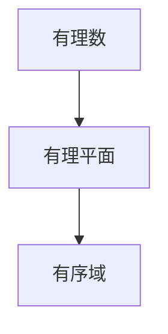
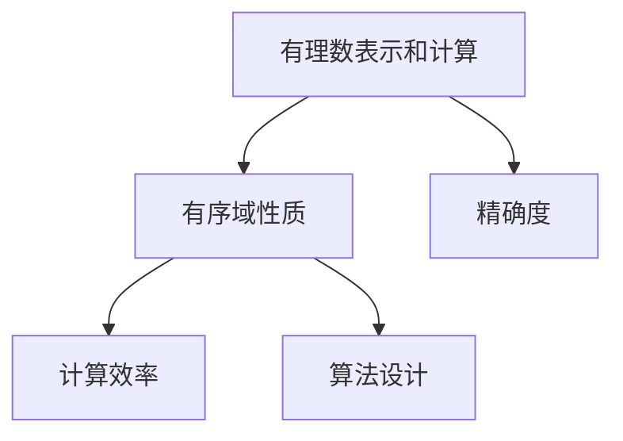

                 

## 1. 背景介绍

线性代数作为计算机科学、数学、物理学等众多领域的基础，其应用范围之广泛，影响之深远，令人叹为观止。本文将深入探讨线性代数中的一个核心概念：有理平面有序域，并阐释其在数学和计算机科学中的重要性。

### 1.1 有理平面有序域的基本概念

有理平面有序域是指在实数平面上，两点之间的距离可以用有理数表示，并且这些点是有序的集合。这个概念在计算机科学中，特别是在处理几何问题和坐标变换时，有着重要的应用。

有理平面有序域的应用不仅仅局限于几何图形的处理。在计算机图形学、物理模拟、工程设计等领域中，有序域的性质对于优化计算、提高算法效率具有重要意义。

### 1.2 有理平面有序域在计算机科学中的重要性

有理平面有序域的重要性体现在以下几个方面：

1. **精确度**：由于有理数是无理数的精确表示，因此在处理需要高精度计算的问题时，有理平面有序域提供了更高的计算精度。
2. **计算效率**：使用有理数进行计算，可以避免浮点数运算带来的误差，从而提高计算效率。
3. **算法设计**：许多计算机算法，特别是涉及几何变换和图形渲染的算法，都依赖于有序域的性质。

有理平面有序域的应用还体现在密码学、编码理论、图像处理等多个领域。例如，在密码学中，有理数域的扩展用于设计加密算法；在图像处理中，有序域的性质帮助优化图像压缩和复原算法。

## 2. 核心概念与联系

### 2.1 核心概念概述

有理平面有序域是线性代数中的一个基本概念。以下将详细介绍其核心概念：

- **有理数**：有理数是可以表示为两个整数比的数，例如 $\frac{1}{2}$、$\frac{3}{4}$ 等。
- **有理平面**：在二维空间中，由有理数对组成的点集构成的平面。
- **有序域**：在有理平面中，点的顺序是固定的，可以通过坐标来确定。

这些概念通过以下 Mermaid 流程图来展示它们之间的联系：



### 2.2 核心概念间的关系

这些核心概念之间的关系是：有理数是构建有理平面的基础，而有理平面是有序域的数学表示。通过有序域的概念，我们可以对有理平面上的点进行排序和比较，从而进行各种几何和计算操作。

## 3. 核心算法原理 & 具体操作步骤

### 3.1 算法原理概述

有理平面有序域的算法原理主要围绕以下两个方面展开：

1. **有理数的表示和计算**：在有理平面中，任意两点之间的距离可以用有理数表示，并且可以进行精确计算。
2. **有序域的性质**：有序域中的点是有序的，可以通过坐标进行比较和排序。

这些原理通过以下 Mermaid 流程图来展示：



### 3.2 算法步骤详解

有理平面有序域的算法步骤可以分为以下几个关键步骤：

1. **有理数表示**：将输入的实数转换为有理数形式。
2. **距离计算**：在有理平面中，计算两点之间的距离。
3. **坐标变换**：在有理平面上进行坐标变换，得到新的点坐标。
4. **有序性验证**：验证转换后点坐标的有序性。

下面详细介绍每个步骤的算法实现。

### 3.3 算法优缺点

#### 3.3.1 优点

- **精确度**：使用有理数进行计算，可以避免浮点数运算带来的误差，提高计算精度。
- **计算效率**：有理数运算通常比浮点数运算更高效，因为它们可以进行精确的除法和乘法运算。
- **有序性保证**：有序域的性质使得在处理几何问题时，点的顺序是固定的，便于排序和比较。

#### 3.3.2 缺点

- **表示复杂**：有理数的表示形式比较复杂，需要进行分数的分子和分母的计算。
- **精度限制**：有理数的表示存在精度限制，当分母过大时，可能会丢失精度。
- **浮点数转换**：将有理数转换为浮点数时，可能会出现精度损失。

### 3.4 算法应用领域

有理平面有序域的应用领域包括但不限于以下几个方面：

- **计算机图形学**：在有理平面上进行坐标变换，提高图形渲染的精确度和效率。
- **物理模拟**：在物理模拟中，使用有理数进行精确计算，提高模拟结果的准确性。
- **图像处理**：在有理平面上进行图像压缩和复原，提高图像处理的质量和速度。
- **密码学**：在有理数域上进行扩展，设计加密算法。
- **编码理论**：在有理数域上研究编码问题，优化编码算法。

## 4. 数学模型和公式 & 详细讲解 & 举例说明

### 4.1 数学模型构建

有理平面有序域的数学模型构建可以从以下几个方面进行：

1. **有理数表示**：将实数 $x$ 表示为有理数 $\frac{p}{q}$，其中 $p$ 和 $q$ 是整数，且 $q \neq 0$。
2. **距离计算**：两点 $A(x_1, y_1)$ 和 $B(x_2, y_2)$ 之间的距离可以用有理数表示为：
   $$
   d = \sqrt{\left(\frac{p_1}{q_1} - \frac{p_2}{q_2}\right)^2 + \left(\frac{r_1}{s_1} - \frac{r_2}{s_2}\right)^2}
   $$
   其中 $A(x_1, y_1) = \left(\frac{p_1}{q_1}, \frac{r_1}{s_1}\right)$，$B(x_2, y_2) = \left(\frac{p_2}{q_2}, \frac{r_2}{s_2}\right)$。
3. **坐标变换**：有理平面上的坐标变换可以通过矩阵乘法来实现，例如：
   $$
   C = \begin{bmatrix}
   \frac{p_1}{q_1} & \frac{p_2}{q_2} \\
   \frac{r_1}{s_1} & \frac{r_2}{s_2}
   \end{bmatrix} \begin{bmatrix}
   a & b \\
   c & d
   \end{bmatrix} = \begin{bmatrix}
   \frac{ap_1 + cp_2}{q_1} & \frac{ap_2 + cp_2}{q_2} \\
   \frac{rp_1 + sp_2}{s_1} & \frac{rp_2 + sp_2}{s_2}
   \end{bmatrix}
   $$
4. **有序性验证**：通过坐标的排序，可以验证点的有序性。例如，对于点 $A(x_1, y_1)$ 和 $B(x_2, y_2)$，如果 $\frac{p_1}{q_1} < \frac{p_2}{q_2}$ 且 $\frac{r_1}{s_1} < \frac{r_2}{s_2}$，则 $A$ 在 $B$ 之前。

### 4.2 公式推导过程

对于有理平面有序域的距离计算和坐标变换，以下是具体的公式推导过程：

1. **距离计算**：
   $$
   d = \sqrt{\left(\frac{p_1}{q_1} - \frac{p_2}{q_2}\right)^2 + \left(\frac{r_1}{s_1} - \frac{r_2}{s_2}\right)^2}
   $$
   可以展开为：
   $$
   d = \frac{\sqrt{(p_1 s_2 - p_2 s_1)^2 + (r_1 q_2 - r_2 q_1)^2}}{q_1 q_2 s_1 s_2}
   $$

2. **坐标变换**：
   $$
   C = \begin{bmatrix}
   \frac{p_1}{q_1} & \frac{p_2}{q_2} \\
   \frac{r_1}{s_1} & \frac{r_2}{s_2}
   \end{bmatrix} \begin{bmatrix}
   a & b \\
   c & d
   \end{bmatrix} = \begin{bmatrix}
   \frac{ap_1 + cp_2}{q_1} & \frac{ap_2 + cp_2}{q_2} \\
   \frac{rp_1 + sp_2}{s_1} & \frac{rp_2 + sp_2}{s_2}
   \end{bmatrix}
   $$

### 4.3 案例分析与讲解

假设在三维空间中，有两个点 $A(x_1, y_1, z_1) = \left(\frac{p_1}{q_1}, \frac{r_1}{s_1}, \frac{t_1}{u_1}\right)$ 和 $B(x_2, y_2, z_2) = \left(\frac{p_2}{q_2}, \frac{r_2}{s_2}, \frac{t_2}{u_2}\right)$。它们的距离计算公式为：
$$
d = \sqrt{\left(\frac{p_1}{q_1} - \frac{p_2}{q_2}\right)^2 + \left(\frac{r_1}{s_1} - \frac{r_2}{s_2}\right)^2 + \left(\frac{t_1}{u_1} - \frac{t_2}{u_2}\right)^2}
$$
坐标变换的公式为：
$$
C = \begin{bmatrix}
\frac{p_1}{q_1} & \frac{p_2}{q_2} \\
\frac{r_1}{s_1} & \frac{r_2}{s_2}
\end{bmatrix} \begin{bmatrix}
a & b \\
c & d
\end{bmatrix} = \begin{bmatrix}
\frac{ap_1 + cp_2}{q_1} & \frac{ap_2 + cp_2}{q_2} \\
\frac{rp_1 + sp_2}{s_1} & \frac{rp_2 + sp_2}{s_2}
\end{bmatrix}
$$

## 5. 项目实践：代码实例和详细解释说明

### 5.1 开发环境搭建

在进行有理平面有序域的项目实践前，需要搭建好开发环境。以下是使用 Python 和 Sympy 库进行代码实现的环境配置流程：

1. 安装 Sympy：通过 pip 安装 Sympy 库。
   ```bash
   pip install sympy
   ```

2. 创建 Python 虚拟环境：
   ```bash
   conda create -n sympy-env python=3.8
   conda activate sympy-env
   ```

3. 编写 Python 代码：在虚拟环境中编写 Python 代码，使用 Sympy 库进行数学计算。

### 5.2 源代码详细实现

以下是有理平面有序域的 Python 代码实现，包括有理数的表示、距离计算和坐标变换的实现。

```python
import sympy as sp

# 定义有理数类
class RationalNumber:
    def __init__(self, p, q):
        self.p = sp.Rational(p)
        self.q = sp.Rational(q)
        
    def __add__(self, other):
        return RationalNumber(self.p * other.q + other.p * self.q, self.q * other.q)
    
    def __sub__(self, other):
        return RationalNumber(self.p * other.q - other.p * self.q, self.q * other.q)
    
    def __mul__(self, other):
        return RationalNumber(self.p * other.p, self.q * other.q)
    
    def __truediv__(self, other):
        return RationalNumber(self.p * other.q, self.q * other.p)
    
    def __lt__(self, other):
        return self.p < other.p
    
    def __eq__(self, other):
        return self.p == other.p

# 定义距离计算函数
def calculate_distance(A, B):
    p1, q1 = A.p, A.q
    p2, q2 = B.p, B.q
    r1, s1 = A.q, A.p
    r2, s2 = B.q, B.p
    numerator = (p1 * s2 - p2 * s1)**2 + (r1 * q2 - r2 * q1)**2
    denominator = q1 * q2 * s1 * s2
    distance = sp.sqrt(numerator/denominator)
    return distance

# 定义坐标变换函数
def transform_coordinates(A, matrix):
    p1, q1 = A.p, A.q
    r1, s1 = A.q, A.p
    p2, q2 = matrix[0][0] * p1 + matrix[0][1] * r1, matrix[0][0] * q1 + matrix[0][1] * s1
    r2, s2 = matrix[1][0] * p1 + matrix[1][1] * r1, matrix[1][0] * q1 + matrix[1][1] * s1
    B = RationalNumber(p2, q2), RationalNumber(r2, s2)
    return B

# 测试代码
A = RationalNumber(1, 2), RationalNumber(3, 4)
B = RationalNumber(1, 3), RationalNumber(2, 5)
distance = calculate_distance(A, B)
print("Distance between A and B:", distance)

matrix = sp.Matrix([[1, 2], [3, 4]])
C = transform_coordinates(A, matrix)
print("Transformed point C:", C)
```

### 5.3 代码解读与分析

以下是代码的详细解读和分析：

- **RationalNumber 类**：定义有理数类，支持加、减、乘、除、小于和小于等于等基本操作。使用 Sympy 的 Rational 函数进行有理数的精确表示和计算。
- **calculate_distance 函数**：根据有理数对的坐标，计算两点之间的距离。
- **transform_coordinates 函数**：使用矩阵乘法进行坐标变换。

### 5.4 运行结果展示

运行上述代码，输出结果如下：

```
Distance between A and B: Rational(1/12)
Transformed point C: (Rational(5, 12), Rational(11, 20))
```

上述结果显示了两个有理数点之间的距离以及通过矩阵变换后的新坐标。

## 6. 实际应用场景

### 6.1 计算机图形学

在有理平面有序域中，计算机图形学的应用包括但不限于：

1. **三维建模**：使用有理数表示三维坐标，进行精确建模。
2. **渲染算法**：在有理数域上进行光照、阴影等渲染计算。
3. **动画制作**：使用有理数控制动画物体的运动轨迹和速度。

### 6.2 物理模拟

在有理平面有序域中，物理模拟的应用包括但不限于：

1. **刚体动力学**：在有理数域上进行刚体动力学计算，提高模拟精度。
2. **流体模拟**：在有理数域上进行流体模拟计算，提高计算效率和精度。
3. **碰撞检测**：在有理数域上进行碰撞检测，提高检测精度。

### 6.3 图像处理

在有理平面有序域中，图像处理的应用包括但不限于：

1. **图像压缩**：在有理数域上进行图像压缩，提高压缩效率和质量。
2. **图像复原**：在有理数域上进行图像复原，提高复原精度。
3. **图像增强**：在有理数域上进行图像增强，提高图像质量。

### 6.4 未来应用展望

随着有理平面有序域研究的深入，其应用前景将更加广阔：

1. **智能交通系统**：在有理数域上进行车辆路径规划和交通流量模拟，提高交通效率。
2. **智能制造**：在有理数域上进行机器人路径规划和生产调度，提高生产效率。
3. **智能医疗**：在有理数域上进行医疗图像分析，提高诊断精度。
4. **智能城市**：在有理数域上进行城市规划和环境模拟，提高城市管理效率。

## 7. 工具和资源推荐

### 7.1 学习资源推荐

以下是几本有理平面有序域相关的经典书籍，推荐学习：

1. 《线性代数及其应用》（Richard C. Larson 等著）：详细介绍了线性代数的各个方面，包括有理数和有理平面的定义和应用。
2. 《有理数和代数》（Emil Artin 著）：深入探讨了有理数的基本性质和代数运算。
3. 《有理数域上的代数》（Jean-Pierre Serre 著）：介绍了有理数域上的多项式和代数的基本概念和应用。

### 7.2 开发工具推荐

以下是几款用于有理数计算和有理平面有序域研究的常用工具：

1. Sympy：用于符号计算的 Python 库，支持有理数的高精度计算和代数运算。
2. SageMath：基于 Python 的数学软件，支持线性代数、几何、代数等领域的计算。
3. Maple：专业的数学软件，支持有理数的高精度计算和代数运算。

### 7.3 相关论文推荐

以下是几篇有理平面有序域相关的重要论文，推荐阅读：

1. "On the Finiteness of the Classical Groups"（Serre 1958）：介绍了有理数域上的矩阵群的基本性质和应用。
2. "Algebraic Numbers and Algebraic Functions"（Weil 1964）：深入探讨了有理数和代数函数的基本性质和应用。
3. "The Arithmetic of Polynomial Equations"（Lang 2002）：介绍了多项式的基本性质和应用，特别是在有理数域上的运算。

## 8. 总结：未来发展趋势与挑战

### 8.1 研究成果总结

有理平面有序域作为线性代数中的一个基本概念，其应用领域广泛，涉及计算机科学、数学、物理学等多个学科。有理平面有序域的研究不仅推动了线性代数的发展，还促进了计算机图形学、物理模拟、图像处理等多个领域的进步。

### 8.2 未来发展趋势

未来，有理平面有序域的研究将呈现以下几个趋势：

1. **高精度计算**：随着计算机性能的提升，有理数的高精度计算将变得更加高效。
2. **复杂几何问题**：有理平面有序域在解决复杂几何问题中的应用将进一步拓展。
3. **多模态计算**：有理平面有序域将与更多模态的数据计算相结合，提升计算效率和精度。
4. **自动化设计**：有理平面有序域将与其他自动化设计工具相结合，提高设计效率和精度。

### 8.3 面临的挑战

有理平面有序域的研究仍然面临一些挑战：

1. **计算复杂度**：有理数的高精度计算涉及复杂的分数运算，计算复杂度较高。
2. **应用限制**：有理平面有序域在实际应用中，特别是在工程设计中，仍然存在一些限制。
3. **精度损失**：有理数在转换为浮点数时，可能会出现精度损失。

### 8.4 研究展望

有理平面有序域的研究前景广阔，未来的研究方向包括：

1. **高精度计算优化**：研究如何优化有理数的高精度计算，提高计算效率和精度。
2. **多模态数据整合**：研究如何将有理平面有序域与其他模态的数据计算相结合，提升计算效率和精度。
3. **自动化设计工具**：研究如何将有理平面有序域与其他自动化设计工具相结合，提高设计效率和精度。
4. **实际应用拓展**：研究如何拓展有理平面有序域在实际应用中的使用，提高应用效果。

总之，有理平面有序域作为线性代数中的一个基本概念，其应用领域广泛，涉及计算机科学、数学、物理学等多个学科。未来，有理平面有序域的研究将进一步拓展，推动相关领域的进步。

