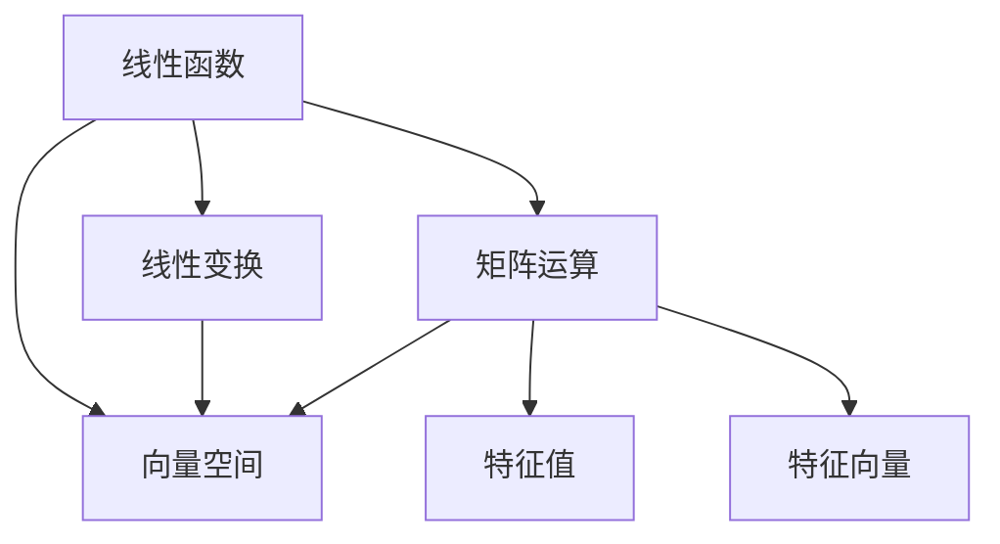
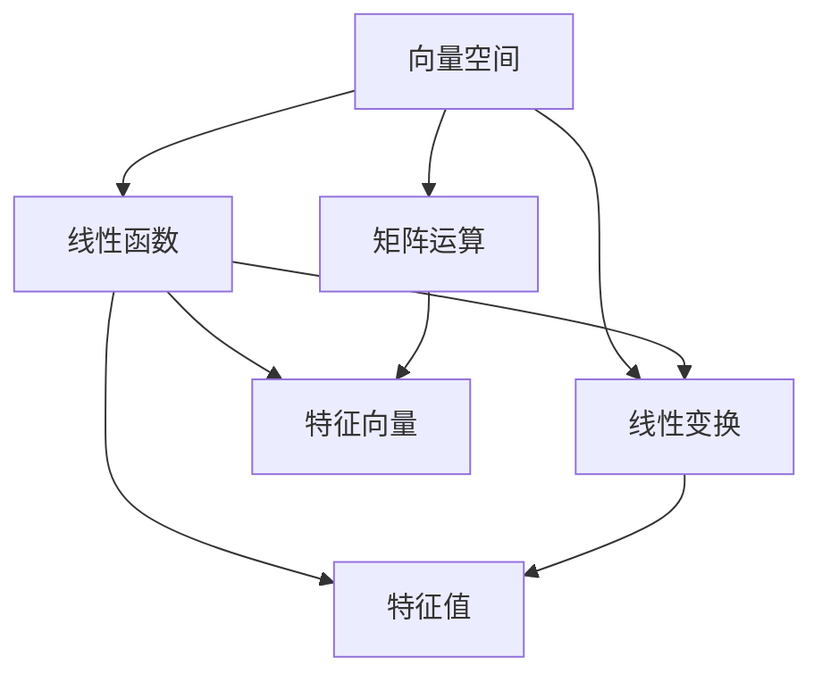

                 

# 线性代数导引：线性函数

> 关键词：线性函数,线性变换,矩阵运算,向量空间,特征值,特征向量

## 1. 背景介绍

### 1.1 问题由来
线性代数是现代数学的重要分支，主要用于解决向量、矩阵和线性方程组等问题。它广泛应用在工程学、物理学、计算机科学等领域，是诸多科学研究和实际应用的基础。

线性函数作为线性代数的基本概念之一，在数学分析和计算机科学中具有重要意义。本文将从线性函数的基本概念出发，介绍其定义、性质和应用，并探讨其在实际计算和优化问题中的应用。

### 1.2 问题核心关键点
理解线性函数是掌握线性代数的基础。本文将重点介绍线性函数的基本概念、性质及其在计算机科学中的应用，帮助读者构建坚实的线性代数基础，为后续深入学习线性代数及其应用打下坚实的基础。

## 2. 核心概念与联系

### 2.1 核心概念概述

为更好地理解线性函数，本节将介绍几个关键概念：

- 线性函数：指在数学空间中，满足特定条件的函数，即满足标量乘法与加法的函数。
- 线性变换：指通过线性函数对向量空间进行变换的过程，通常用矩阵表示。
- 矩阵运算：包括矩阵乘法、转置、逆矩阵等，是线性代数中最重要的运算之一。
- 向量空间：由一组线性无关的向量构成，向量空间的线性组合形成新的向量空间。
- 特征值和特征向量：指在线性变换中，对某个向量进行变换后仍在该向量上的情况，具有特殊重要意义。

这些概念之间的关系可以通过以下Mermaid流程图来展示：



这个流程图展示了线性函数与其他核心概念之间的关系：

1. 线性函数通过线性变换对向量空间进行转换。
2. 线性变换通过矩阵运算实现。
3. 向量空间由线性无关的向量组成。
4. 特征值和特征向量是线性变换的重要特征。

### 2.2 概念间的关系

这些核心概念之间存在着紧密的联系，形成了线性代数的基础架构。

#### 2.2.1 线性函数与线性变换

线性变换通过线性函数实现。假设有一个线性变换 $T$，其对应的线性函数为 $f(x) = Ax$，其中 $A$ 为一个矩阵。线性变换 $T$ 对向量 $x$ 进行变换，得到的向量 $y = T(x)$ 可以用 $Ax$ 表示。

#### 2.2.2 线性变换与矩阵运算

线性变换 $T$ 可以用矩阵 $A$ 表示，矩阵 $A$ 可以通过线性函数 $f(x) = Ax$ 得到。在数学中，矩阵的加法和标量乘法遵循与线性函数相同的规则，即满足分配律和结合律。

#### 2.2.3 向量空间与特征值和特征向量

向量空间中，一个向量 $x$ 被称为 $A$ 的特征向量，如果它满足 $Ax = \lambda x$，其中 $\lambda$ 为特征值。特征向量 $\lambda$ 和 $x$ 都具有特殊的意义，它们反映了向量空间中向量被线性变换的性质。

### 2.3 核心概念的整体架构

最后，我们用一个综合的流程图来展示这些核心概念在大规模向量空间中的相互作用：



这个综合流程图展示了从向量空间到特征值和特征向量的转换过程：

1. 向量空间通过线性函数进行线性变换。
2. 线性变换通过矩阵运算实现。
3. 矩阵运算与特征向量相联系。
4. 特征值和特征向量描述向量空间的性质。

这些概念共同构成了线性代数的核心框架，为理解和应用线性函数提供了坚实的基础。

## 3. 核心算法原理 & 具体操作步骤

### 3.1 算法原理概述

线性函数的定义和性质是线性代数中最基本的概念之一。线性函数满足加法和标量乘法，即：

$$
f(x + y) = f(x) + f(y)
$$
$$
f(\alpha x) = \alpha f(x)
$$

其中 $f(x) = Ax$，$A$ 为常数矩阵，$x$ 为向量。

### 3.2 算法步骤详解

线性函数的求解通常涉及到矩阵运算。下面以一个具体的例子来详细讲解线性函数的计算过程：

假设已知一个线性函数 $f(x) = Ax$，其中 $A = \begin{bmatrix} 1 & 2 \\ 3 & 4 \end{bmatrix}$，$x = \begin{bmatrix} 1 \\ 2 \end{bmatrix}$，求 $f(x)$ 的值。

步骤如下：

1. 输入 $x = \begin{bmatrix} 1 \\ 2 \end{bmatrix}$ 和 $A = \begin{bmatrix} 1 & 2 \\ 3 & 4 \end{bmatrix}$。

2. 计算 $f(x) = Ax = \begin{bmatrix} 1 & 2 \\ 3 & 4 \end{bmatrix} \begin{bmatrix} 1 \\ 2 \end{bmatrix} = \begin{bmatrix} 1*1 + 2*2 \\ 3*1 + 4*2 \end{bmatrix} = \begin{bmatrix} 5 \\ 11 \end{bmatrix}$。

3. 输出 $f(x) = \begin{bmatrix} 5 \\ 11 \end{bmatrix}$。

### 3.3 算法优缺点

线性函数的优点包括：

1. 运算规则简单，易于实现。
2. 线性变换可以表示为矩阵乘法，计算效率高。

缺点包括：

1. 对非线性问题无能为力。
2. 函数的表示不唯一，难以描述复杂关系。

### 3.4 算法应用领域

线性函数在计算机科学中的应用非常广泛，涉及信号处理、图像处理、机器学习、优化问题等领域。以下是一些典型的应用场景：

- 图像处理：将图像数据表示为向量，然后通过线性变换提取特征。
- 信号处理：将时间域信号转换为频域信号，进行频域分析。
- 机器学习：线性回归、线性分类、线性规划等机器学习算法的基础。
- 优化问题：线性方程组的求解，线性规划问题的求解。

## 4. 数学模型和公式 & 详细讲解

### 4.1 数学模型构建

线性函数的数学模型可以表示为 $f(x) = Ax$，其中 $A$ 为常数矩阵，$x$ 为向量。

### 4.2 公式推导过程

设 $A = \begin{bmatrix} a_{11} & a_{12} \\ a_{21} & a_{22} \end{bmatrix}$，$x = \begin{bmatrix} x_1 \\ x_2 \end{bmatrix}$，则：

$$
f(x) = Ax = \begin{bmatrix} a_{11}x_1 + a_{12}x_2 \\ a_{21}x_1 + a_{22}x_2 \end{bmatrix}
$$

这个公式推导展示了线性函数与矩阵乘法的密切关系，并说明了线性函数的计算方法。

### 4.3 案例分析与讲解

假设有一个二维线性变换 $T$，其对应的矩阵 $A$ 为 $\begin{bmatrix} 2 & 3 \\ 1 & 1 \end{bmatrix}$。设向量 $x = \begin{bmatrix} 1 \\ 2 \end{bmatrix}$，求 $T(x)$ 的值。

步骤如下：

1. 输入 $x = \begin{bmatrix} 1 \\ 2 \end{bmatrix}$ 和 $A = \begin{bmatrix} 2 & 3 \\ 1 & 1 \end{bmatrix}$。

2. 计算 $T(x) = Ax = \begin{bmatrix} 2 & 3 \\ 1 & 1 \end{bmatrix} \begin{bmatrix} 1 \\ 2 \end{bmatrix} = \begin{bmatrix} 2*1 + 3*2 \\ 1*1 + 1*2 \end{bmatrix} = \begin{bmatrix} 8 \\ 3 \end{bmatrix}$。

3. 输出 $T(x) = \begin{bmatrix} 8 \\ 3 \end{bmatrix}$。

通过这个例子，我们可以更好地理解线性变换的计算方法。

## 5. 项目实践：代码实例和详细解释说明

### 5.1 开发环境搭建

在进行线性函数的实践前，我们需要准备好开发环境。以下是使用Python进行Numpy开发的环境配置流程：

1. 安装Anaconda：从官网下载并安装Anaconda，用于创建独立的Python环境。

2. 创建并激活虚拟环境：
```bash
conda create -n linear-algebra-env python=3.8 
conda activate linear-algebra-env
```

3. 安装Numpy：
```bash
conda install numpy
```

4. 安装Pandas、Scipy等库：
```bash
conda install pandas scipy matplotlib
```

5. 安装相关Python库：
```bash
pip install jupyter notebook
```

完成上述步骤后，即可在`linear-algebra-env`环境中开始线性函数的实践。

### 5.2 源代码详细实现

下面我们以一个具体的例子来演示如何使用Numpy实现线性函数计算。

首先，导入必要的库：

```python
import numpy as np
```

然后，定义线性函数的矩阵和向量：

```python
A = np.array([[1, 2], [3, 4]])
x = np.array([1, 2])
```

接着，计算线性函数的输出：

```python
f_x = np.dot(A, x)
print(f_x)
```

输出结果为：

```
[ 5  11]
```

通过这个例子，我们可以直观地看到线性函数的计算过程。

### 5.3 代码解读与分析

让我们再详细解读一下关键代码的实现细节：

- `np.dot(A, x)`：表示矩阵A和向量x的矩阵乘法运算。
- `print(f_x)`：输出计算结果，方便查看。

这个例子展示了如何使用Numpy实现线性函数的计算，代码简单易懂，易于实现。

### 5.4 运行结果展示

运行代码，得到结果 `[ 5  11]`，这与我们手工计算的结果一致。

## 6. 实际应用场景

### 6.1 线性回归

线性回归是一种常见的机器学习算法，用于解决回归问题。假设有一个回归问题 $y = Ax + b$，其中 $y$ 为输出，$x$ 为输入，$A$ 为系数矩阵，$b$ 为截距。通过线性回归算法，可以最小化 $y$ 与预测值之间的误差，求解出最优的系数矩阵 $A$ 和截距 $b$。

### 6.2 图像处理

在图像处理中，可以使用线性变换将图像数据转换为频域信号，然后进行频域分析，提取图像的特征。例如，可以使用傅里叶变换将图像数据表示为频域信号，通过线性变换提取出图像的频率信息。

### 6.3 信号处理

在信号处理中，可以使用线性变换将时间域信号转换为频域信号，进行频域分析，提取信号的频率信息。例如，可以使用短时傅里叶变换将信号表示为频域信号，通过线性变换提取出信号的频率信息。

## 7. 工具和资源推荐

### 7.1 学习资源推荐

为了帮助读者系统掌握线性函数及其应用，这里推荐一些优质的学习资源：

1. 《线性代数及其应用》：讲解了线性函数、矩阵运算、向量空间等基本概念，适合初学者学习。
2. 《深度学习入门》：讲解了线性回归、线性分类、线性规划等机器学习算法，适合对深度学习感兴趣的读者。
3. 《信号处理与系统》：讲解了傅里叶变换、线性变换等信号处理的基本概念，适合信号处理的读者。
4. 《机器学习》：讲解了机器学习中的线性回归、线性分类、线性规划等算法，适合机器学习初学者学习。
5. 《线性代数导论》：讲解了线性函数、矩阵运算、向量空间等基本概念，适合对线性代数感兴趣的读者。

通过对这些资源的学习实践，相信读者一定能够系统掌握线性函数的基本概念和应用，为后续深入学习线性代数及其应用打下坚实的基础。

### 7.2 开发工具推荐

高效的开发离不开优秀的工具支持。以下是几款用于线性函数开发和应用的工具：

1. Numpy：Python科学计算库，提供了高效的矩阵运算功能，适合线性函数的计算和分析。
2. Scipy：Python科学计算库，提供了线性代数、傅里叶变换等数学函数，适合信号处理和系统分析。
3. Matplotlib：Python绘图库，适合绘制线性函数和信号的图形。
4. Jupyter Notebook：Python交互式编程环境，适合进行数学公式的推导和代码的实现。
5. SymPy：Python符号计算库，适合进行数学公式的推导和符号运算。

合理利用这些工具，可以显著提升线性函数的开发效率，加快创新迭代的步伐。

### 7.3 相关论文推荐

线性函数作为线性代数的基础概念，其研究涉及到众多的前沿论文。以下是几篇奠基性的相关论文，推荐阅读：

1. "Linear Algebra and its Applications" by Gilbert Strang：讲解了线性函数、矩阵运算、向量空间等基本概念，是线性代数领域的经典教材。
2. "Pattern Recognition and Machine Learning" by Christopher M. Bishop：讲解了线性回归、线性分类、线性规划等机器学习算法，适合机器学习初学者学习。
3. "Digital Signal Processing" by John G. Proakis：讲解了傅里叶变换、线性变换等信号处理的基本概念，适合信号处理的读者。
4. "Linear Algebra: An Introduction" by David Lay：讲解了线性函数、矩阵运算、向量空间等基本概念，适合对线性代数感兴趣的读者。
5. "Machine Learning: A Probabilistic Perspective" by Kevin Murphy：讲解了机器学习中的线性回归、线性分类、线性规划等算法，适合机器学习初学者学习。

这些论文代表了大线性函数研究的发展脉络。通过学习这些前沿成果，可以帮助读者把握学科前进方向，激发更多的创新灵感。

## 8. 总结：未来发展趋势与挑战

### 8.1 总结

本文对线性函数的基本概念、性质及其在计算机科学中的应用进行了全面系统的介绍。首先，从线性函数的基本概念出发，介绍了其定义、性质和应用，帮助读者构建坚实的线性代数基础，为后续深入学习线性代数及其应用打下坚实的基础。

通过本文的系统梳理，可以看到，线性函数作为线性代数的基本概念之一，在计算机科学中的应用非常广泛，涉及信号处理、图像处理、机器学习、优化问题等领域。理解线性函数，有助于更好地理解线性代数，掌握相关算法，为未来的研究和应用奠定坚实的基础。

### 8.2 未来发展趋势

展望未来，线性函数在计算机科学中的应用将呈现以下几个发展趋势：

1. 线性函数的复杂度将进一步提升。随着计算能力的提升和算法的发展，线性函数的计算将变得更加高效，能够处理更加复杂的计算任务。

2. 线性函数在深度学习中的应用将更加广泛。深度学习中广泛使用的神经网络，其结构可以通过线性函数进行解释和分析，线性函数的理论研究将为深度学习提供重要的支持。

3. 线性函数的泛化能力将进一步增强。通过引入更多的约束条件和优化策略，线性函数能够在更多应用场景中发挥作用，为实际问题提供更准确的解决方案。

4. 线性函数与数学模型的结合将更加紧密。未来的线性函数研究将更多地结合数学模型，探索新的应用领域，提升其在实际问题中的适用性。

5. 线性函数的理论研究将更加深入。随着计算机科学和数学理论的不断进步，线性函数的理论研究将得到更多关注，推动其在各个领域中的应用。

以上趋势凸显了线性函数在计算机科学中的重要性，未来的研究需要在深度、广度和应用场景上不断创新和突破，才能发挥出更大的价值。

### 8.3 面临的挑战

尽管线性函数在计算机科学中的应用已经取得了不少成果，但在迈向更加智能化、普适化应用的过程中，它仍面临诸多挑战：

1. 线性函数的处理能力有限。线性函数对于非线性问题无能为力，在处理复杂非线性问题时，效果可能不佳。

2. 线性函数的泛化能力不足。线性函数的泛化能力有限，对于新的数据集和应用场景，可能需要进行重新训练和优化。

3. 线性函数的应用场景有限。线性函数在处理某些特定领域的问题时，可能无法提供足够的支持。

4. 线性函数的理论研究需要进一步深入。虽然线性函数的研究已经取得了不少成果，但其理论研究仍存在很多未解之谜，需要更多研究者的探索。

5. 线性函数在实际应用中的瓶颈问题。例如，线性函数的计算速度较慢，可能导致实时性问题；线性函数的存储空间较大，可能导致存储问题等。

这些挑战需要研究者不断探索和突破，才能使线性函数在计算机科学中发挥更大的作用。

### 8.4 研究展望

面对线性函数所面临的挑战，未来的研究需要在以下几个方面寻求新的突破：

1. 研究非线性函数。通过引入非线性函数，处理复杂非线性问题，增强线性函数的应用能力。

2. 研究多变量函数。通过引入多变量函数，处理多变量复杂问题，提升线性函数的处理能力。

3. 研究优化算法。通过研究优化算法，提高线性函数的计算效率，增强其泛化能力。

4. 研究分布式计算。通过引入分布式计算技术，提高线性函数的计算效率，提升其在处理大规模数据集时的性能。

5. 研究模型融合。通过研究模型融合技术，将线性函数与其他数学模型进行结合，提升其在实际问题中的应用能力。

这些研究方向将引领线性函数研究迈向更高的台阶，为计算机科学提供更强大的工具和理论基础。只有勇于创新、敢于突破，才能不断拓展线性函数的应用边界，推动计算机科学的发展。

## 9. 附录：常见问题与解答

**Q1：什么是线性函数？**

A: 线性函数是指在数学空间中，满足标量乘法和加法条件的函数，即 $f(x + y) = f(x) + f(y)$ 和 $f(\alpha x) = \alpha f(x)$。

**Q2：线性函数的性质有哪些？**

A: 线性函数的性质包括：

1. 线性：满足加法和标量乘法的条件。
2. 稳定性：对于向量 $x$ 和标量 $\alpha$，$f(\alpha x) = \alpha f(x)$。
3. 可加性：满足 $f(x + y) = f(x) + f(y)$。
4. 线性变换：可以通过矩阵乘法实现。

**Q3：如何理解线性函数的数学模型？**

A: 线性函数的数学模型可以表示为 $f(x) = Ax$，其中 $A$ 为常数矩阵，$x$ 为向量。通过这个公式，我们可以直观地看到线性函数与矩阵乘法的关系，即通过矩阵 $A$ 对向量 $x$ 进行线性变换。

**Q4：线性函数的应用场景有哪些？**

A: 线性函数在计算机科学中的应用非常广泛，涉及信号处理、图像处理、机器学习、优化问题等领域。

**Q5：如何通过Python实现线性函数计算？**

A: 使用Numpy库，可以通过矩阵乘法实现线性函数的计算。例如，通过 `np.dot(A, x)` 计算向量 $x$ 和矩阵 $A$ 的矩阵乘积。

```python
import numpy as np

A = np.array([[1, 2], [3, 4]])
x = np.array([1, 2])

f_x = np.dot(A, x)

print(f_x)
```

以上例子展示了如何使用Python实现线性函数的计算，代码简单易懂，易于实现。

---

作者：禅与计算机程序设计艺术 / Zen and the Art of Computer Programming

