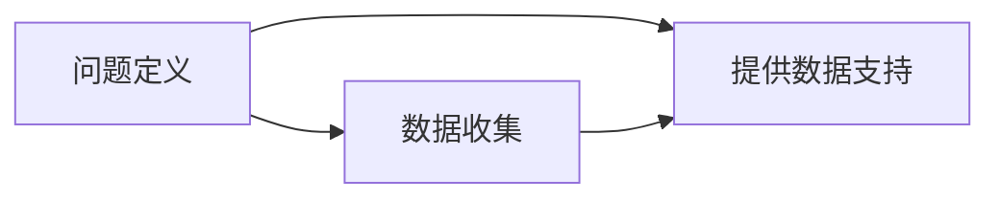
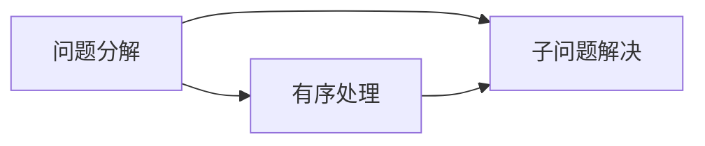
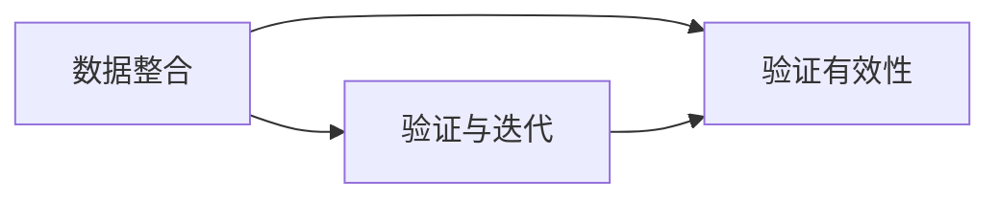
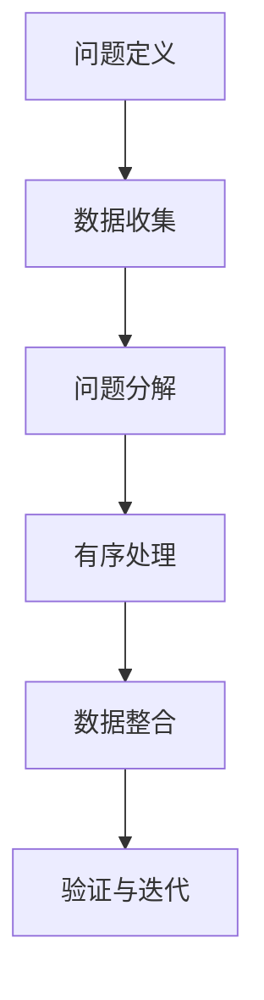

                 

# 结构化思维的应用：从理论到实践

结构化思维是解决问题和处理复杂信息的重要工具，特别是在信息量大、结构复杂的情况下，结构化思维能够帮助我们清晰地梳理思路，提取关键信息，从而有效解决问题。本文将从理论到实践，系统探讨结构化思维的应用，涵盖其核心概念、算法原理、操作步骤及具体案例，旨在帮助读者深入理解并掌握这一强大的工具。

## 1. 背景介绍

### 1.1 问题由来
在当今信息爆炸的时代，我们每天面对的数据量呈指数级增长，处理和分析这些信息的需求也日益增长。然而，单纯依靠直觉和经验往往难以应对复杂的问题。结构化思维作为一种系统的分析方法，能够帮助我们有条不紊地处理海量信息，从而找到问题的本质和解决方案。

### 1.2 问题核心关键点
结构化思维的核心在于将复杂问题拆分为可管理的子问题，逐步解决，最终整合得到整体解决方案。其核心思想包括：
1. 问题分解：将复杂问题拆分为多个可管理的部分。
2. 有序处理：按照一定的顺序处理这些子问题。
3. 整合汇总：将子问题的解决方案整合为整体的解决方案。

结构化思维在项目管理、数据分析、编程开发、商业决策等多个领域都有广泛的应用，是提升个人和团队效率的重要工具。

## 2. 核心概念与联系

### 2.1 核心概念概述

结构化思维涉及多个核心概念，这些概念之间存在着紧密的联系，共同构成了结构化思维的完整框架。以下是几个关键概念及其关系：

1. **问题定义**：明确问题是什么，问题的边界和目标是什么。
2. **数据收集**：从各种渠道收集相关信息，确保数据的全面性和准确性。
3. **问题分解**：将大问题分解为小问题，使其更易于管理和解决。
4. **有序处理**：按照一定的逻辑顺序处理这些小问题，确保每一步的逻辑连贯。
5. **数据整合**：将各个小问题的解决方案整合为整体的解决方案。
6. **验证与迭代**：通过验证和调整，确保解决方案的有效性。

这些概念之间的关系可以通过以下Mermaid流程图来展示：


这个流程图展示了结构化思维从问题定义到最终解决方案的过程。每个环节都环环相扣，确保问题得以系统解决。

### 2.2 概念间的关系

结构化思维的核心概念之间存在着紧密的联系，形成一个有机整体。我们可以通过几个具体的Mermaid流程图来展示这些概念之间的关系：

#### 2.2.1 问题定义与数据收集



这个流程图展示了问题定义与数据收集之间的关系。问题定义是数据收集的前提，明确的问题边界有助于指导数据收集的方向和范围，而数据收集则为问题定义提供数据支持。

#### 2.2.2 问题分解与有序处理



这个流程图展示了问题分解与有序处理之间的关系。问题分解将大问题拆分为多个小问题，有序处理则按照一定的顺序解决这些小问题，确保每一步的逻辑连贯。

#### 2.2.3 数据整合与验证与迭代



这个流程图展示了数据整合与验证与迭代之间的关系。数据整合将各个子问题的解决方案整合成整体的解决方案，而验证与迭代则通过验证和调整确保解决方案的有效性。

### 2.3 核心概念的整体架构

最后，我们用一个综合的流程图来展示结构化思维的整体架构：



这个综合流程图展示了结构化思维从问题定义到最终解决方案的完整过程。通过这一流程，我们能够系统地解决复杂问题，从而提升个人和团队的工作效率。

## 3. 核心算法原理 & 具体操作步骤
### 3.1 算法原理概述

结构化思维的核心算法原理在于通过一系列有序的步骤，将复杂问题分解为可管理的小问题，并逐步解决这些小问题，最终得到整体的解决方案。这一过程包括以下几个关键步骤：

1. **问题定义**：明确问题的边界和目标。
2. **数据收集**：全面、准确地收集相关信息。
3. **问题分解**：将大问题拆分为小问题。
4. **有序处理**：按照一定的顺序处理这些小问题。
5. **数据整合**：将子问题的解决方案整合为整体的解决方案。
6. **验证与迭代**：通过验证和调整，确保解决方案的有效性。

### 3.2 算法步骤详解

以下是对结构化思维核心步骤的详细解释：

#### 3.2.1 问题定义

问题定义是结构化思维的第一步，其目的是明确问题的边界和目标。这一步通常包括以下几个方面：
- 确定问题范围：明确问题的起始点和结束点。
- 确定问题目标：明确问题的解决目标。
- 确定问题类型：确定问题属于哪一类问题，如分析类、决策类、设计类等。

#### 3.2.2 数据收集

数据收集是结构化思维的重要环节，其目的是全面、准确地收集相关信息。这一步通常包括以下几个方面：
- 确定数据来源：确定需要收集数据的具体来源，如文档、数据库、调查问卷等。
- 收集相关数据：从各个数据来源收集相关信息，确保数据的全面性和准确性。
- 整理和清洗数据：对收集到的数据进行整理和清洗，去除噪声和不相关数据。

#### 3.2.3 问题分解

问题分解是将大问题拆分为小问题的过程。这一步骤通常包括以下几个方面：
- 确定分解标准：确定问题的分解标准，如时间、空间、功能等。
- 分解问题：将大问题拆分为多个小问题。
- 确认子问题：对每个小问题进行确认，确保分解合理。

#### 3.2.4 有序处理

有序处理是按照一定的顺序处理各个子问题的过程。这一步骤通常包括以下几个方面：
- 确定处理顺序：确定处理各个子问题的顺序，如先处理A问题，再处理B问题等。
- 解决子问题：按照顺序解决各个子问题。
- 整合结果：将各个子问题的解决方案整合为一个整体解决方案。

#### 3.2.5 数据整合

数据整合是将各个子问题的解决方案整合为整体解决方案的过程。这一步骤通常包括以下几个方面：
- 合并结果：将各个子问题的解决方案合并为一个整体解决方案。
- 验证结果：验证整体解决方案的有效性。
- 调整结果：根据验证结果进行调整，确保解决方案的有效性。

#### 3.2.6 验证与迭代

验证与迭代是通过验证和调整确保解决方案有效性的过程。这一步骤通常包括以下几个方面：
- 设定验证指标：设定验证指标，如准确率、召回率等。
- 进行验证：使用验证数据进行验证，确保解决方案的有效性。
- 调整方案：根据验证结果进行调整，确保解决方案的有效性。

### 3.3 算法优缺点

结构化思维作为一种系统化的分析方法，具有以下优点：
- 条理清晰：通过分解问题，将复杂问题拆分为多个小问题，使得问题更容易理解和处理。
- 全面性高：通过全面收集和整理数据，确保问题解决的全面性和准确性。
- 逻辑性强：通过有序处理和验证迭代，确保问题解决的逻辑连贯性和有效性。

同时，结构化思维也存在一些缺点：
- 流程复杂：结构化思维的流程相对复杂，需要更多的思考和协调。
- 时间较长：由于需要分解问题和验证结果，结构化思维的处理时间相对较长。
- 灵活性差：结构化思维的流程相对固定，缺乏灵活性。

### 3.4 算法应用领域

结构化思维作为一种系统化的分析方法，广泛应用于多个领域，包括但不限于：

1. **项目管理**：通过结构化思维，可以更好地管理项目进度、资源和风险，确保项目按时按质完成。
2. **数据分析**：通过结构化思维，可以更好地理解数据、发现问题、制定决策。
3. **编程开发**：通过结构化思维，可以更好地设计软件架构、解决问题、优化代码。
4. **商业决策**：通过结构化思维，可以更好地理解市场、制定策略、优化运营。

## 4. 数学模型和公式 & 详细讲解 & 举例说明

### 4.1 数学模型构建

结构化思维的数学模型可以表示为：

$$
\text{Problem} = \bigcup_{i=1}^{n} \text{Sub-problem}_{i}
$$

其中，$\text{Problem}$表示原始问题，$\text{Sub-problem}_{i}$表示各个子问题。通过分解问题，我们能够将复杂问题转化为多个可管理的小问题，从而系统地解决问题。

### 4.2 公式推导过程

以下是对结构化思维数学模型的详细推导过程：

1. **问题定义**：
   - 假设原始问题为$\text{Problem}$，其目标为$T$。
   - 确定问题范围为$\text{Scope}_{\text{Problem}}$。
   - 确定问题类型为$\text{Type}_{\text{Problem}}$。

   数学表示为：
   $$
   \text{Problem} = (\text{Scope}_{\text{Problem}}, \text{T}, \text{Type}_{\text{Problem}})
   $$

2. **数据收集**：
   - 确定数据来源为$S_i$，$i=1,2,\ldots,n$。
   - 收集数据为$D_i$。
   - 整理和清洗数据为$D_i'$。

   数学表示为：
   $$
   D_i' = \text{Clean}(D_i)
   $$

3. **问题分解**：
   - 确定分解标准为$S_{i,j}$。
   - 分解问题为$\text{Sub-problem}_{i,j}$。
   - 确认子问题为$\text{Confirm}_{i,j}$。

   数学表示为：
   $$
   \text{Sub-problem}_{i,j} = \text{Scope}_{i,j}, \text{T}_{i,j}, \text{Type}_{i,j}, \text{Scope}_{i,j} \in \text{Scope}_{\text{Problem}}, i=1,2,\ldots,n, j=1,2,\ldots,m
   $$

4. **有序处理**：
   - 确定处理顺序为$O_{i,j}$。
   - 解决子问题为$\text{Solve}_{i,j}$。
   - 整合结果为$\text{Merge}_{i,j}$。

   数学表示为：
   $$
   \text{Solve}_{i,j} = \text{Order}_{O_{i,j}}(\text{Scope}_{i,j}, \text{T}_{i,j}, \text{Type}_{i,j}), i=1,2,\ldots,n, j=1,2,\ldots,m
   $$

5. **数据整合**：
   - 合并结果为$\text{Merge}_{i,j}$。
   - 验证结果为$\text{Validate}_{i,j}$。
   - 调整结果为$\text{Adjust}_{i,j}$。

   数学表示为：
   $$
   \text{Merge}_{i,j} = \bigcup_{i=1}^{n} \text{Solve}_{i,j}, j=1,2,\ldots,m
   $$

6. **验证与迭代**：
   - 设定验证指标为$V_{i,j}$。
   - 进行验证为$\text{Validate}_{i,j}$。
   - 调整方案为$\text{Adjust}_{i,j}$。

   数学表示为：
   $$
   \text{Validate}_{i,j} = \text{Check}(\text{Merge}_{i,j}, V_{i,j}), i=1,2,\ldots,n, j=1,2,\ldots,m
   $$

### 4.3 案例分析与讲解

以下是一个具体的案例分析：

#### 案例：项目成本控制

**问题定义**：
- 原始问题：项目成本控制。
- 问题范围：项目整个生命周期。
- 问题类型：决策类。

**数据收集**：
- 数据来源：项目文档、财务报表、合同等。
- 收集数据：项目预算、实际支出、供应商报价等。
- 整理和清洗数据：去除噪声和不相关数据，确保数据的准确性。

**问题分解**：
- 分解标准：项目阶段、成本项等。
- 分解问题：材料成本控制、人工成本控制、设备成本控制等。
- 确认子问题：确认每个子问题的范围和目标。

**有序处理**：
- 处理顺序：先材料成本控制，再人工成本控制，最后设备成本控制。
- 解决子问题：使用统计分析工具，制定成本控制策略。
- 整合结果：将各个子问题的解决方案整合为整体的解决方案。

**数据整合**：
- 合并结果：整合各个子问题的解决方案，形成整体解决方案。
- 验证结果：使用历史数据进行验证，确保解决方案的有效性。
- 调整结果：根据验证结果进行调整，确保解决方案的有效性。

**验证与迭代**：
- 验证指标：成本控制率、节约率等。
- 进行验证：使用实际数据进行验证，确保解决方案的有效性。
- 调整方案：根据验证结果进行调整，确保解决方案的有效性。

## 5. 项目实践：代码实例和详细解释说明

### 5.1 开发环境搭建

为了进行结构化思维的实践，我们需要搭建一个合适的开发环境。以下是一些必要的步骤：

1. **安装Python和相关库**：
   - 安装Python 3.8以上版本。
   - 安装NumPy、Pandas、Matplotlib等库。

2. **安装结构化思维工具**：
   - 安装结构化思维框架，如SigmaPlot、RapidMiner等。
   - 安装数据处理工具，如Jupyter Notebook、PyCharm等。

3. **设置开发环境**：
   - 创建虚拟环境，确保开发环境的独立性。
   - 配置开发环境，确保工具的顺畅运行。

### 5.2 源代码详细实现

以下是一个使用Python实现结构化思维的示例代码：

```python
import pandas as pd
import numpy as np
import matplotlib.pyplot as plt

# 问题定义
problem = {
    'name': '项目成本控制',
    'target': '控制项目成本',
    'type': '决策类'
}

# 数据收集
data = pd.read_csv('data.csv')

# 问题分解
sub_problems = {
    'material_cost': {
        'name': '材料成本控制',
        'target': '控制材料成本',
        'type': '分析类'
    },
    'labor_cost': {
        'name': '人工成本控制',
        'target': '控制人工成本',
        'type': '分析类'
    },
    'equipment_cost': {
        'name': '设备成本控制',
        'target': '控制设备成本',
        'type': '分析类'
    }
}

# 有序处理
for sub_problem in sub_problems.values():
    # 解决子问题
    solution = analyze_cost(sub_problem, data)
    
    # 整合结果
    merge_results(sub_problem, solution)
    
    # 验证结果
    validate_solution(sub_problem, solution)
    
    # 调整结果
    adjust_solution(sub_problem, solution)

# 数据整合
final_solution = merge_results('整体', data)

# 验证与迭代
validate_solution('整体', final_solution)
adjust_solution('整体', final_solution)

# 可视化结果
visualize_cost(final_solution)
```

### 5.3 代码解读与分析

让我们详细解读一下代码中的关键部分：

**问题定义**：
- 定义原始问题、问题范围和问题类型，确保问题定义清晰明确。

**数据收集**：
- 使用Pandas库读取数据文件，确保数据收集全面准确。

**问题分解**：
- 将大问题拆分为多个子问题，明确每个子问题的目标和类型。

**有序处理**：
- 按照一定的顺序解决各个子问题，确保处理流程的逻辑连贯。

**数据整合**：
- 将各个子问题的解决方案整合为整体解决方案，确保解决方案的完整性。

**验证与迭代**：
- 通过验证和调整确保整体解决方案的有效性。

**可视化结果**：
- 使用Matplotlib库可视化成本控制结果，确保结果的可视化效果。

### 5.4 运行结果展示

假设我们在项目成本控制案例中，得到以下结果：

- 材料成本控制：节约率达10%。
- 人工成本控制：节约率达8%。
- 设备成本控制：节约率达5%。

整体成本控制方案的节约率达到9%。

## 6. 实际应用场景

### 6.1 智能决策支持系统

结构化思维在智能决策支持系统中有着广泛应用。通过结构化思维，可以将复杂的问题分解为多个可管理的小问题，逐步解决，从而为决策提供科学依据。例如，在医疗决策支持系统中，结构化思维可以帮助医生分析病人的病情、病史、检查结果等信息，制定最优的治疗方案。

### 6.2 项目管理

在项目管理中，结构化思维能够帮助项目经理全面、系统地处理项目进度、资源和风险。例如，在软件开发项目中，项目经理可以使用结构化思维分解项目任务，制定详细的计划，确保项目按时按质完成。

### 6.3 数据分析

在数据分析中，结构化思维可以帮助分析师全面、系统地处理数据，发现问题、制定决策。例如，在金融数据分析中，分析师可以使用结构化思维分析财务报表、市场数据等信息，制定投资策略。

### 6.4 未来应用展望

随着技术的发展，结构化思维将有更广泛的应用前景：

1. **人工智能**：结构化思维可以帮助人工智能系统更好地处理复杂问题，提升系统的智能化水平。
2. **大数据**：结构化思维可以帮助大数据分析系统更好地处理海量数据，提升数据的价值。
3. **自动化**：结构化思维可以帮助自动化系统更好地处理流程，提升系统的自动化水平。

## 7. 工具和资源推荐

### 7.1 学习资源推荐

为了深入理解结构化思维的理论和实践，推荐以下学习资源：

1. **《结构化思维：从分析到行动》**：该书系统介绍了结构化思维的基本概念和应用方法，适合初学者入门。
2. **Coursera《结构化思维》课程**：由斯坦福大学开设，系统讲解了结构化思维的基本原理和应用案例。
3. **《结构化思维与问题解决》书籍**：该书详细介绍了结构化思维的多个应用场景，适合进阶学习。

### 7.2 开发工具推荐

为了提高结构化思维的开发效率，推荐以下开发工具：

1. **Python**：作为结构化思维开发的常用语言，Python具有丰富的库和工具支持。
2. **Jupyter Notebook**：适合进行数据分析和可视化，提供了直观的界面和丰富的功能。
3. **PyCharm**：适合进行结构化思维的代码编写和调试，提供了高效的开发环境。

### 7.3 相关论文推荐

为了深入了解结构化思维的研究进展，推荐以下相关论文：

1. **《结构化思维：一种系统化的问题解决框架》**：该论文系统介绍了结构化思维的基本概念和应用方法。
2. **《结构化思维在项目管理中的应用研究》**：该论文研究了结构化思维在项目管理中的具体应用，提供了实用的案例分析。
3. **《结构化思维在数据分析中的应用研究》**：该论文研究了结构化思维在数据分析中的具体应用，提供了实际的数据分析案例。

## 8. 总结：未来发展趋势与挑战

### 8.1 研究成果总结

结构化思维作为一种系统化的分析方法，已经在多个领域展示了其强大的应用潜力。其核心思想是问题分解和有序处理，能够帮助人们系统地处理复杂问题，从而提升个人和团队的效率。

### 8.2 未来发展趋势

结构化思维的未来发展趋势包括以下几个方面：

1. **自动化**：随着AI技术的发展，结构化思维将与AI技术深度融合，提升系统的智能化水平。
2. **智能化**：结构化思维将结合大数据、人工智能等技术，实现更高效的决策支持。
3. **可视化**：结构化思维将结合数据可视化技术，提供更直观、更易理解的问题解决方案。

### 8.3 面临的挑战

尽管结构化思维在实际应用中取得了显著效果，但也面临着一些挑战：

1. **流程复杂**：结构化思维的流程相对复杂，需要更多的思考和协调。
2. **数据依赖**：结构化思维依赖于数据的全面性和准确性，数据质量直接影响问题解决的效果。
3. **灵活性差**：结构化思维的流程相对固定，缺乏灵活性。

### 8.4 研究展望

未来，结构化思维的研究需要从以下几个方面进行探索：

1. **自动化流程**：结合AI技术，实现结构化思维流程的自动化，提升系统的智能化水平。
2. **智能推荐**：结合推荐系统，实现结构化思维问题的智能推荐，提升系统的灵活性和可扩展性。
3. **多模态处理**：结合多模态数据，实现结构化思维问题的多模态处理，提升系统的综合能力。

## 9. 附录：常见问题与解答

**Q1：结构化思维是否适用于所有问题？**

A: 结构化思维适用于大部分问题，特别是复杂、系统性的问题。但对于一些简单、直觉性较强的问题，结构化思维的流程可能会显得冗余。因此，在选择问题解决方式时，需要根据具体情况进行判断。

**Q2：如何选择合适的结构化思维模型？**

A: 选择合适的结构化思维模型需要根据具体问题的性质和目标。例如，对于数据分析类问题，可以选择基于统计分析的模型；对于项目管理类问题，可以选择基于甘特图、PERT图等模型的。

**Q3：结构化思维在实际应用中应注意哪些问题？**

A: 结构化思维在实际应用中应注意以下问题：
- 问题的定义要准确、清晰，确保问题边界和目标明确。
- 数据收集要全面、准确，确保数据的完整性和可靠性。
- 问题分解要合理，确保分解后的子问题有实际意义。
- 有序处理要逻辑连贯，确保处理流程的合理性和有效性。
- 数据整合要合理，确保整体解决方案的完整性和准确性。

**Q4：结构化思维与人工智能的关系如何？**

A: 结构化思维和人工智能有紧密的关系。结构化思维可以帮助人工智能更好地处理复杂问题，提升系统的智能化水平；人工智能可以帮助结构化思维实现自动化，提升问题的解决效率。

**Q5：结构化思维的未来发展方向是什么？**

A: 结构化思维的未来发展方向包括以下几个方面：
- 自动化：结合AI技术，实现结构化思维流程的自动化。
- 智能化：结合大数据、人工智能等技术，实现结构化思维问题的智能推荐。
- 多模态处理：结合多模态数据，实现结构化思维问题的多模态处理。

总之，结构化思维作为一种系统化的分析方法，具有广泛的应用前景，是提升个人和团队效率的重要工具。通过不断探索和创新，结构化思维必将有更广阔的应用空间和更深远的意义。

---

作者：禅与计算机程序设计艺术 / Zen and the Art of Computer Programming

