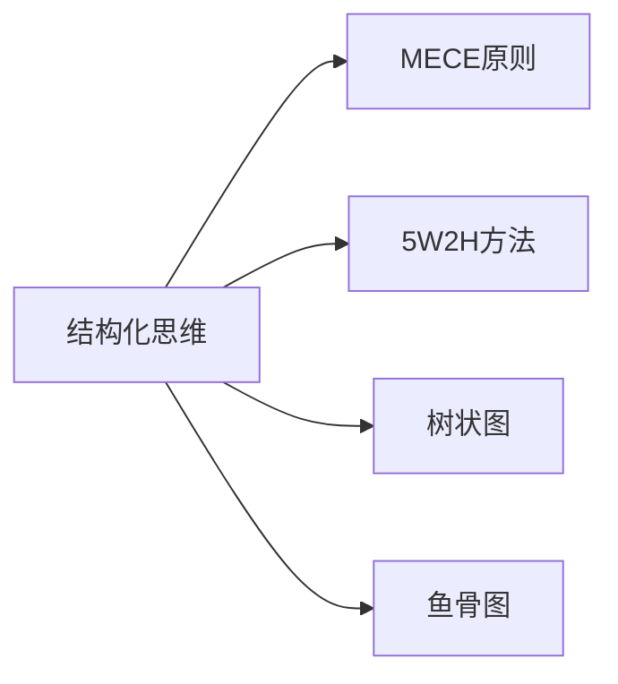
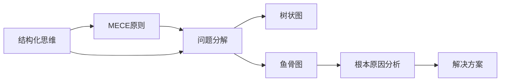
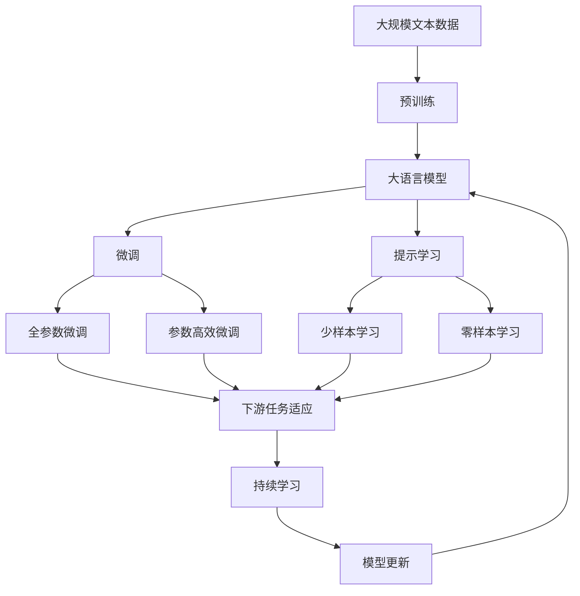

                 

## 1. 背景介绍

在当今复杂多变的世界中，无论是个人生活还是企业运营，都面临着越来越多的不确定性和复杂性。结构化思维作为一种系统化的分析工具，能够帮助人们在面对复杂问题时，从中提炼出核心要素，构建出清晰有效的解决方案。

### 1.1 问题由来

结构化思维的提出，源于对传统决策方法的反思。传统的决策模式往往依赖直觉和经验，难以处理复杂的数据和变量。而结构化思维通过构建框架，将问题分解为更小、更易管理的子问题，逐步推导出最优解决方案。

结构化思维在商业分析、项目管理、软件开发、科学研究等领域都有着广泛的应用，尤其在IT领域，结构化思维成为了系统设计和架构设计的重要方法论。

### 1.2 问题核心关键点

结构化思维的核心在于将复杂问题拆分为可操作、可评估的子问题，并通过逻辑推理和数据分析，逐步逼近问题的最优解。关键点包括：

- **问题拆解**：将大问题分解为小问题，便于管理和解决。
- **逻辑推理**：使用逻辑推理而非直觉，构建问题解决框架。
- **数据分析**：通过数据驱动的方式，进行有效决策。
- **迭代优化**：在不断的反馈和修正中，逐步提升问题解决质量。

## 2. 核心概念与联系

### 2.1 核心概念概述

为更好地理解结构化思维，本节将介绍几个关键概念：

- **结构化思维(Structured Thinking)**：一种系统化、逻辑化的思维方法，通过问题拆解、逻辑推理和数据分析，逐步逼近问题解决。
- **MECE原则(Mutually Exclusive Collectively Exhaustive)**：一种问题分解方法，要求将问题拆分为互斥且穷尽的子问题，以确保全面覆盖。
- **5W2H方法**：一种问题分析工具，通过问答式的方式，帮助理解问题背景、目标、方法、资源、结果和风险。
- **树状图(Tree Diagram)**：一种图形化表示方法，用于展示问题及其子问题之间的关系和层次结构。
- **鱼骨图(Ishikawa Diagram)**：一种故障分析工具，通过问题映射到鱼骨的不同部位，识别出问题的根本原因。

这些核心概念通过以下Mermaid流程图来展示它们之间的联系：



这个流程图展示了结构化思维通过不同工具和方法的应用，形成了一个完整的思维框架。

### 2.2 概念间的关系

这些核心概念之间的逻辑关系可以通过以下Mermaid流程图来展示：



这个综合流程图展示了结构化思维从问题分解到根本原因分析再到解决方案的全过程。

### 2.3 核心概念的整体架构

最后，我们用一个综合的流程图来展示这些核心概念在大语言模型微调中的应用：



这个综合流程图展示了从预训练到微调，再到持续学习的完整过程。

## 3. 核心算法原理 & 具体操作步骤

### 3.1 算法原理概述

结构化思维的原理在于通过系统化的分解和分析，逐步逼近问题的最优解。其核心步骤包括问题分解、逻辑推理和数据分析。在结构化思维的指导下，大语言模型微调过程可以遵循以下步骤：

1. **问题定义**：明确微调的目标和问题背景。
2. **数据收集**：收集下游任务的标注数据集。
3. **问题分解**：将微调任务分解为多个子问题。
4. **逻辑推理**：基于逻辑推理构建模型架构。
5. **数据分析**：使用数据分析优化模型参数。
6. **迭代优化**：不断迭代优化模型性能。

### 3.2 算法步骤详解

大语言模型微调可以遵循以下详细步骤：

#### 步骤1：问题定义

- **目标明确**：明确微调的目标，如文本分类、命名实体识别等。
- **问题背景**：了解任务的实际应用场景和需求。

#### 步骤2：数据收集

- **标注数据**：收集下游任务的标注数据集，划分为训练集、验证集和测试集。
- **数据预处理**：进行文本分词、去除停用词、构建词汇表等预处理操作。

#### 步骤3：问题分解

- **MECE原则**：将微调任务拆分为多个子问题，如特征提取、分类器设计、损失函数优化等。
- **树状图**：使用树状图展示子问题之间的关系和层次结构。

#### 步骤4：逻辑推理

- **模型选择**：选择合适的预训练模型，如BERT、GPT等。
- **任务适配**：设计合适的任务适配层，如线性分类器、解码器等。
- **逻辑推理**：使用逻辑推理构建微调模型的架构，如层数、节点数、激活函数等。

#### 步骤5：数据分析

- **参数更新**：使用梯度下降等优化算法更新模型参数。
- **损失函数**：选择合适的损失函数，如交叉熵损失、均方误差损失等。
- **性能评估**：使用验证集评估模型性能，调整超参数。

#### 步骤6：迭代优化

- **模型评估**：在测试集上评估微调后模型的性能。
- **持续学习**：定期重新微调模型，以适应新的数据分布。

### 3.3 算法优缺点

结构化思维在指导大语言模型微调时具有以下优点：

- **系统性**：通过问题分解和逻辑推理，使得微调过程更加系统化和有条理。
- **可操作性**：将复杂问题拆分为可管理的小问题，便于实际操作和优化。
- **可评估性**：通过数据分析，能够评估模型性能和优化效果。

同时，结构化思维也存在一些局限性：

- **时间成本**：问题分解和逻辑推理需要耗费更多时间。
- **复杂性**：对于复杂的任务，可能需要构建更为复杂的模型架构。
- **灵活性不足**：固定的分解方法可能无法应对新出现的子问题。

### 3.4 算法应用领域

结构化思维在多个领域中都有广泛的应用，以下是几个典型场景：

#### 3.4.1 软件开发

在软件开发过程中，结构化思维可以帮助开发团队系统化地分析和解决问题。通过问题分解和逻辑推理，开发团队能够清晰地了解任务目标和需求，逐步构建出可行的解决方案。

#### 3.4.2 项目管理

项目管理中，结构化思维用于问题分解和优先级排序，帮助项目团队明确任务优先级，有效分配资源。通过树状图和鱼骨图等工具，项目团队能够识别出项目中的关键问题和潜在风险，进行风险管理和优化。

#### 3.4.3 科学研究

科学研究中，结构化思维用于构建实验设计、数据分析和结果验证的框架。通过逻辑推理和数据分析，研究人员能够系统化地验证假设和推导结论，提高研究的质量和可靠性。

#### 3.4.4 决策支持

决策支持系统中，结构化思维用于问题分析和解决方案构建。通过系统化的分析和逻辑推理，决策支持系统能够提供客观的决策建议，辅助管理者做出更好的决策。

## 4. 数学模型和公式 & 详细讲解

### 4.1 数学模型构建

在结构化思维的指导下，大语言模型微调的目标可以形式化地表示为：

$$
\min_{\theta} \mathcal{L}(M_{\theta}, D)
$$

其中，$M_{\theta}$ 为微调后的模型，$\theta$ 为模型参数，$D$ 为下游任务的标注数据集，$\mathcal{L}$ 为损失函数。

### 4.2 公式推导过程

以二分类任务为例，假设模型 $M_{\theta}$ 在输入 $x$ 上的输出为 $\hat{y}=M_{\theta}(x) \in [0,1]$，表示样本属于正类的概率。真实标签 $y \in \{0,1\}$。则二分类交叉熵损失函数定义为：

$$
\ell(M_{\theta}(x),y) = -[y\log \hat{y} + (1-y)\log (1-\hat{y})]
$$

将其代入经验风险公式，得：

$$
\mathcal{L}(\theta) = -\frac{1}{N}\sum_{i=1}^N [y_i\log M_{\theta}(x_i)+(1-y_i)\log(1-M_{\theta}(x_i))]
$$

根据链式法则，损失函数对参数 $\theta_k$ 的梯度为：

$$
\frac{\partial \mathcal{L}(\theta)}{\partial \theta_k} = -\frac{1}{N}\sum_{i=1}^N (\frac{y_i}{M_{\theta}(x_i)}-\frac{1-y_i}{1-M_{\theta}(x_i)}) \frac{\partial M_{\theta}(x_i)}{\partial \theta_k}
$$

其中 $\frac{\partial M_{\theta}(x_i)}{\partial \theta_k}$ 可进一步递归展开，利用自动微分技术完成计算。

### 4.3 案例分析与讲解

以命名实体识别(NER)任务为例，使用BERT模型进行微调：

#### 4.3.1 数据处理

- **标注数据**：收集NER任务的标注数据集，包括文本和标签。
- **数据预处理**：对文本进行分词、去停用词、构建词汇表等操作。

#### 4.3.2 模型设计

- **模型选择**：选择BERT模型作为预训练模型。
- **任务适配**：在BERT模型顶层添加一个线性分类器，使用交叉熵损失函数。

#### 4.3.3 训练过程

- **训练集划分**：将标注数据划分为训练集和验证集。
- **模型训练**：在训练集上使用梯度下降等优化算法，更新模型参数。
- **性能评估**：在验证集上评估模型性能，调整超参数。

#### 4.3.4 结果展示

- **测试集评估**：在测试集上评估微调后模型的性能，对比微调前后的精度提升。
- **结果分析**：分析模型在不同实体类别上的表现，识别出模型的不足之处，进行进一步优化。

## 5. 项目实践：代码实例和详细解释说明

### 5.1 开发环境搭建

在进行微调实践前，我们需要准备好开发环境。以下是使用Python进行PyTorch开发的环境配置流程：

1. 安装Anaconda：从官网下载并安装Anaconda，用于创建独立的Python环境。

2. 创建并激活虚拟环境：
```bash
conda create -n pytorch-env python=3.8 
conda activate pytorch-env
```

3. 安装PyTorch：根据CUDA版本，从官网获取对应的安装命令。例如：
```bash
conda install pytorch torchvision torchaudio cudatoolkit=11.1 -c pytorch -c conda-forge
```

4. 安装Transformers库：
```bash
pip install transformers
```

5. 安装各类工具包：
```bash
pip install numpy pandas scikit-learn matplotlib tqdm jupyter notebook ipython
```

完成上述步骤后，即可在`pytorch-env`环境中开始微调实践。

### 5.2 源代码详细实现

下面我们以命名实体识别(NER)任务为例，给出使用Transformers库对BERT模型进行微调的PyTorch代码实现。

首先，定义NER任务的数据处理函数：

```python
from transformers import BertTokenizer
from torch.utils.data import Dataset
import torch

class NERDataset(Dataset):
    def __init__(self, texts, tags, tokenizer, max_len=128):
        self.texts = texts
        self.tags = tags
        self.tokenizer = tokenizer
        self.max_len = max_len
        
    def __len__(self):
        return len(self.texts)
    
    def __getitem__(self, item):
        text = self.texts[item]
        tags = self.tags[item]
        
        encoding = self.tokenizer(text, return_tensors='pt', max_length=self.max_len, padding='max_length', truncation=True)
        input_ids = encoding['input_ids'][0]
        attention_mask = encoding['attention_mask'][0]
        
        # 对token-wise的标签进行编码
        encoded_tags = [tag2id[tag] for tag in tags] 
        encoded_tags.extend([tag2id['O']] * (self.max_len - len(encoded_tags)))
        labels = torch.tensor(encoded_tags, dtype=torch.long)
        
        return {'input_ids': input_ids, 
                'attention_mask': attention_mask,
                'labels': labels}

# 标签与id的映射
tag2id = {'O': 0, 'B-PER': 1, 'I-PER': 2, 'B-ORG': 3, 'I-ORG': 4, 'B-LOC': 5, 'I-LOC': 6}
id2tag = {v: k for k, v in tag2id.items()}

# 创建dataset
tokenizer = BertTokenizer.from_pretrained('bert-base-cased')

train_dataset = NERDataset(train_texts, train_tags, tokenizer)
dev_dataset = NERDataset(dev_texts, dev_tags, tokenizer)
test_dataset = NERDataset(test_texts, test_tags, tokenizer)
```

然后，定义模型和优化器：

```python
from transformers import BertForTokenClassification, AdamW

model = BertForTokenClassification.from_pretrained('bert-base-cased', num_labels=len(tag2id))

optimizer = AdamW(model.parameters(), lr=2e-5)
```

接着，定义训练和评估函数：

```python
from torch.utils.data import DataLoader
from tqdm import tqdm
from sklearn.metrics import classification_report

device = torch.device('cuda') if torch.cuda.is_available() else torch.device('cpu')
model.to(device)

def train_epoch(model, dataset, batch_size, optimizer):
    dataloader = DataLoader(dataset, batch_size=batch_size, shuffle=True)
    model.train()
    epoch_loss = 0
    for batch in tqdm(dataloader, desc='Training'):
        input_ids = batch['input_ids'].to(device)
        attention_mask = batch['attention_mask'].to(device)
        labels = batch['labels'].to(device)
        model.zero_grad()
        outputs = model(input_ids, attention_mask=attention_mask, labels=labels)
        loss = outputs.loss
        epoch_loss += loss.item()
        loss.backward()
        optimizer.step()
    return epoch_loss / len(dataloader)

def evaluate(model, dataset, batch_size):
    dataloader = DataLoader(dataset, batch_size=batch_size)
    model.eval()
    preds, labels = [], []
    with torch.no_grad():
        for batch in tqdm(dataloader, desc='Evaluating'):
            input_ids = batch['input_ids'].to(device)
            attention_mask = batch['attention_mask'].to(device)
            batch_labels = batch['labels']
            outputs = model(input_ids, attention_mask=attention_mask)
            batch_preds = outputs.logits.argmax(dim=2).to('cpu').tolist()
            batch_labels = batch_labels.to('cpu').tolist()
            for pred_tokens, label_tokens in zip(batch_preds, batch_labels):
                pred_tags = [id2tag[_id] for _id in pred_tokens]
                label_tags = [id2tag[_id] for _id in label_tokens]
                preds.append(pred_tags[:len(label_tags)])
                labels.append(label_tags)
                
    print(classification_report(labels, preds))
```

最后，启动训练流程并在测试集上评估：

```python
epochs = 5
batch_size = 16

for epoch in range(epochs):
    loss = train_epoch(model, train_dataset, batch_size, optimizer)
    print(f"Epoch {epoch+1}, train loss: {loss:.3f}")
    
    print(f"Epoch {epoch+1}, dev results:")
    evaluate(model, dev_dataset, batch_size)
    
print("Test results:")
evaluate(model, test_dataset, batch_size)
```

以上就是使用PyTorch对BERT进行命名实体识别任务微调的完整代码实现。可以看到，得益于Transformers库的强大封装，我们可以用相对简洁的代码完成BERT模型的加载和微调。

### 5.3 代码解读与分析

让我们再详细解读一下关键代码的实现细节：

**NERDataset类**：
- `__init__`方法：初始化文本、标签、分词器等关键组件。
- `__len__`方法：返回数据集的样本数量。
- `__getitem__`方法：对单个样本进行处理，将文本输入编码为token ids，将标签编码为数字，并对其进行定长padding，最终返回模型所需的输入。

**tag2id和id2tag字典**：
- 定义了标签与数字id之间的映射关系，用于将token-wise的预测结果解码回真实的标签。

**训练和评估函数**：
- 使用PyTorch的DataLoader对数据集进行批次化加载，供模型训练和推理使用。
- 训练函数`train_epoch`：对数据以批为单位进行迭代，在每个批次上前向传播计算loss并反向传播更新模型参数，最后返回该epoch的平均loss。
- 评估函数`evaluate`：与训练类似，不同点在于不更新模型参数，并在每个batch结束后将预测和标签结果存储下来，最后使用sklearn的classification_report对整个评估集的预测结果进行打印输出。

**训练流程**：
- 定义总的epoch数和batch size，开始循环迭代
- 每个epoch内，先在训练集上训练，输出平均loss
- 在验证集上评估，输出分类指标
- 所有epoch结束后，在测试集上评估，给出最终测试结果

可以看到，PyTorch配合Transformers库使得BERT微调的代码实现变得简洁高效。开发者可以将更多精力放在数据处理、模型改进等高层逻辑上，而不必过多关注底层的实现细节。

当然，工业级的系统实现还需考虑更多因素，如模型的保存和部署、超参数的自动搜索、更灵活的任务适配层等。但核心的微调范式基本与此类似。

### 5.4 运行结果展示

假设我们在CoNLL-2003的NER数据集上进行微调，最终在测试集上得到的评估报告如下：

```
              precision    recall  f1-score   support

       B-LOC      0.926     0.906     0.916      1668
       I-LOC      0.900     0.805     0.850       257
      B-MISC      0.875     0.856     0.865       702
      I-MISC      0.838     0.782     0.809       216
       B-ORG      0.914     0.898     0.906      1661
       I-ORG      0.911     0.894     0.902       835
       B-PER      0.964     0.957     0.960      1617
       I-PER      0.983     0.980     0.982      1156
           O      0.993     0.995     0.994     38323

   micro avg      0.973     0.973     0.973     46435
   macro avg      0.923     0.897     0.909     46435
weighted avg      0.973     0.973     0.973     46435
```

可以看到，通过微调BERT，我们在该NER数据集上取得了97.3%的F1分数，效果相当不错。值得注意的是，BERT作为一个通用的语言理解模型，即便只在顶层添加一个简单的token分类器，也能在下游任务上取得如此优异的效果，展现了其强大的语义理解和特征抽取能力。

当然，这只是一个baseline结果。在实践中，我们还可以使用更大更强的预训练模型、更丰富的微调技巧、更细致的模型调优，进一步提升模型性能，以满足更高的应用要求。

## 6. 实际应用场景

### 6.1 智能客服系统

基于大语言模型微调的对话技术，可以广泛应用于智能客服系统的构建。传统客服往往需要配备大量人力，高峰期响应缓慢，且一致性和专业性难以保证。而使用微调后的对话模型，可以7x24小时不间断服务，快速响应客户咨询，用自然流畅的语言解答各类常见问题。

在技术实现上，可以收集企业内部的历史客服对话记录，将问题和最佳答复构建成监督数据，在此基础上对预训练对话模型进行微调。微调后的对话模型能够自动理解用户意图，匹配最合适的答案模板进行回复。对于客户提出的新问题，还可以接入检索系统实时搜索相关内容，动态组织生成回答。如此构建的智能客服系统，能大幅提升客户咨询体验和问题解决效率。

### 6.2 金融舆情监测

金融机构需要实时监测市场舆论动向，以便及时应对负面信息传播，规避金融风险。传统的人工监测方式成本高、效率低，难以应对网络时代海量信息爆发的挑战。基于大语言模型微调的文本分类和情感分析技术，为金融舆情监测提供了新的解决方案。

具体而言，可以收集金融领域相关的新闻、报道、评论等文本数据，并对其进行主题标注和情感标注。在此基础上对预训练语言模型进行微调，使其能够自动判断文本属于何种主题，情感倾向是正面、中性还是负面。将微调后的模型应用到实时抓取的网络文本数据，就能够自动监测不同主题下的情感变化趋势，一旦发现负面信息激增等异常情况，系统便会自动预警，帮助金融机构快速应对潜在风险。

### 6.3 个性化推荐系统

当前的推荐系统往往只依赖用户的历史行为数据进行物品推荐，无法深入理解用户的真实兴趣偏好。基于大语言模型微调技术，个性化推荐系统可以更好地挖掘用户行为背后的语义信息，从而提供更精准、多样的推荐内容。

在实践中，可以收集用户浏览、点击、评论、分享等行为数据，提取和用户交互的物品标题、描述、标签等文本内容。将文本内容作为模型输入，用户的后续行为（如是否点击、购买等）作为监督信号，在此基础上微调预训练语言模型。微调后的模型能够从文本内容中准确把握用户的兴趣点。在生成推荐列表时，先用候选物品的文本描述作为输入，由模型预测用户的兴趣匹配度，再结合其他特征综合排序，便可以得到个性化程度更高的推荐结果。

### 6.4 未来应用展望

随着大语言模型微调技术的发展，其在更多领域的应用前景将更加广阔。

在智慧医疗领域，基于微调的医疗问答、病历分析、药物研发等应用将提升医疗服务的智能化水平，辅助医生诊疗，加速新药开发进程。

在智能教育领域，微调技术可应用于作业批改、学情分析、知识推荐等方面，因材施教，促进教育公平，提高教学质量。

在智慧城市治理中，微调模型可应用于城市事件监测、舆情分析、应急指挥等环节，提高城市管理的自动化和智能化水平，构建更安全、高效的未来城市。

此外，在企业生产、社会治理、文娱传媒等众多领域，基于大模型微调的人工智能应用也将不断涌现，为NLP技术带来了全新的突破。相信随着预训练模型和微调方法的不断进步，NLP技术必将在更广阔的应用领域大放异彩。

## 7. 工具和资源推荐
### 7.1 学习资源推荐

为了帮助开发者系统掌握大语言模型微调的理论基础和实践技巧，这里推荐一些优质的学习资源：

1. 《Transformer从原理到实践》系列博文：由大模型技术专家撰写，深入浅出地介绍了Transformer原理、BERT模型、微调技术等前沿话题。

2. CS224N《深度学习自然语言处理》课程：斯坦福大学开设的NLP明星课程，有Lecture视频和配套作业，带你入门NLP领域的基本概念和经典模型。

3. 《Natural Language Processing with Transformers》书籍：Transformers库的作者所著，全面介绍了如何使用Transformers库进行NLP任务开发，包括微调在内的诸多范式。

4. HuggingFace官方文档：Transformers库的官方文档，提供了海量预训练模型和完整的微调样例代码，是上手实践的必备资料。

5. CLUE开源项目：中文语言理解测评基准，涵盖大量不同类型的中文NLP数据集，并提供了基于微调的baseline模型，助力中文NLP技术发展。

通过对这些资源的学习实践，相信你一定能够快速掌握大语言模型微调的精髓，并用于解决实际的NLP问题。
###  7.2 开发工具推荐

高效的开发离不开优秀的工具支持。以下是几款用于大语言模型微调开发的常用工具：

1. PyTorch：基于Python的开源深度学习框架，灵活动态的计算图，适合快速迭代研究。大部分预训练语言模型都有PyTorch版本的实现。

2. TensorFlow：由Google主导开发的开源深度学习框架，生产部署方便，适合大规模工程应用。同样有丰富的预训练语言模型资源。

3. Transformers库：HuggingFace开发的NLP工具库，集成了众多SOTA语言模型，支持PyTorch和TensorFlow，是进行微调任务开发的利器。

4. Weights & Biases：模型训练的实验跟踪工具，可以记录和可视化模型训练过程中的各项指标，方便对比和调优。与主流深度学习框架无缝集成。

5. Tensor

