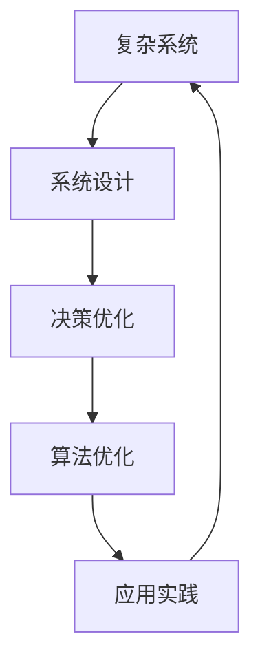
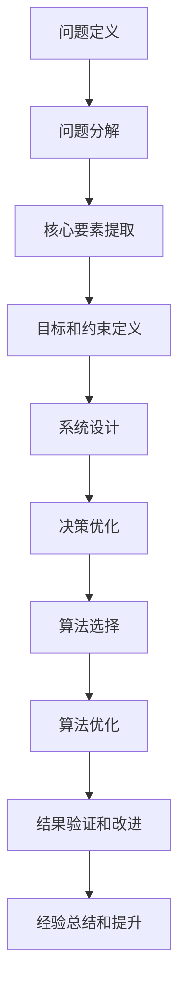

                 

# 结构化思维：理解世界的钥匙

> 关键词：结构化思维,复杂系统,决策优化,系统设计,算法优化,应用实践

## 1. 背景介绍

### 1.1 问题由来
在当今信息爆炸和快速发展的社会中，面对日益复杂和多样化的问题，我们亟需一套有效的思考方式，以帮助我们在海量信息中找到规律，做出明智的决策。结构化思维（Structured Thinking）作为一种系统化、规范化、科学化的思考方式，能够帮助我们快速理解复杂问题，并找到解决问题的方法。本文旨在探讨结构化思维的核心概念、原理以及在不同领域的实际应用，以期为读者提供一种更为系统、科学的问题解决方式。

### 1.2 问题核心关键点
结构化思维的核心在于通过系统的结构和逻辑来理解问题，并从中发现问题的本质和关键点。它不仅是一种思考方式，更是一种解决问题的方法论。通过结构化思维，我们可以：

- 将复杂问题分解为可管理的部分
- 明确问题的核心和关键要素
- 制定科学合理的解决方案
- 在信息过载的时代快速做出决策

### 1.3 问题研究意义
结构化思维能够帮助我们构建更系统、更有效的决策体系，不仅在个人生活管理中有着广泛应用，还在企业管理、科技创新、政策制定等众多领域发挥着重要作用。通过学习结构化思维，我们能够更加清晰地理解问题的本质，提高决策的准确性和效率，实现从繁杂的信息中提取关键要素，制定出更为科学和实用的解决方案。

## 2. 核心概念与联系

### 2.1 核心概念概述

结构化思维涉及多个核心概念，以下是对这些核心概念的概述：

- **系统设计(System Design)**：指通过系统的设计和组织，使问题能够被有效解决的过程。系统设计包括系统的定义、目标、约束、策略等多个方面。
- **复杂系统(Complex System)**：指包含众多相互依赖的元素，且元素之间存在非线性关系的问题。复杂系统往往难以通过简单的线性模型进行描述和预测。
- **决策优化(Decision Optimization)**：指在给定约束条件下，通过数学模型和算法找到最优决策的过程。决策优化通常涉及模型构建、算法设计和结果评估等多个环节。
- **算法优化(Algorithm Optimization)**：指通过改进算法的设计和实现，提高其效率和性能的过程。算法优化包括算法的选择、调整和优化等多个方面。
- **应用实践(Application Practice)**：指将理论知识和算法应用于实际问题解决的过程。应用实践包括问题的建模、数据的收集和处理、算法的实现和评估等多个环节。

这些核心概念通过系统的结构和逻辑紧密联系在一起，构成了结构化思维的完整框架。

### 2.2 概念间的关系

以下通过Mermaid流程图展示这些核心概念之间的关系：



这个流程图展示了一个完整的结构化思维流程，从复杂系统的识别和理解，到系统设计的规划和实施，再到决策优化的选择和优化，最后到应用实践的验证和改进。通过这一系列的过程，我们可以系统地理解和解决复杂问题。

### 2.3 核心概念的整体架构

最后，我们用一个综合的流程图来展示这些核心概念在大规模问题解决过程中的整体架构：



这个综合流程图展示了从问题定义到经验总结的整个结构化思维流程，确保了问题解决的全面性和科学性。

## 3. 核心算法原理 & 具体操作步骤
### 3.1 算法原理概述

结构化思维的算法原理主要包括三个方面：问题的分解与重构、决策模型的建立、算法的选择与优化。

- **问题的分解与重构**：通过将问题分解为多个子问题，使问题变得更加清晰和可管理。重构则是通过逻辑上的调整，使问题的表达更加简洁和直观。
- **决策模型的建立**：建立问题解决的理论模型，通过数学表达和推导，寻找最优解。
- **算法的选择与优化**：根据问题的特点选择合适的算法，并对其进行优化和调整，以提高算法的效率和性能。

### 3.2 算法步骤详解

以下详细介绍结构化思维的算法步骤：

1. **问题定义与分解**：
   - 明确问题的核心要素，包括问题的背景、目标、约束、假设等。
   - 将问题分解为可管理的子问题，确保每个子问题都具有清晰的边界和可量化的目标。

2. **系统设计与建模**：
   - 设计系统的结构，包括系统的输入、输出、状态和行为。
   - 建立系统的数学模型，通过数学推导和验证，确保模型的准确性和可靠性。

3. **决策优化与算法选择**：
   - 根据问题的特点选择合适的算法，包括启发式算法、搜索算法、优化算法等。
   - 对算法进行优化，包括参数调整、并行计算、内存管理等，提高算法的效率和性能。

4. **结果验证与改进**：
   - 通过实验验证算法的有效性，并进行必要的改进。
   - 收集反馈信息，总结经验教训，为后续问题解决提供指导。

### 3.3 算法优缺点

结构化思维的算法优点包括：

- 系统化：通过将问题分解为多个子问题，使问题变得更加清晰和可管理。
- 科学性：建立问题的数学模型，通过数学推导和验证，寻找最优解。
- 可操作性：通过算法的选择和优化，提高问题解决的效率和效果。

同时，结构化思维也存在一些缺点：

- 复杂度高：结构化思维涉及多个步骤和环节，对于复杂的系统问题，可能需要较长的解决周期。
- 理论要求高：需要一定的数学和算法知识，对于没有相关背景的读者可能存在一定的门槛。
- 灵活性不足：一旦进入系统的设计阶段，就很难再随意改变，需要较强的适应性。

### 3.4 算法应用领域

结构化思维广泛应用于多个领域，包括但不限于：

- **企业管理**：通过系统设计和决策优化，提高企业的管理效率和决策水平。
- **科技创新**：通过算法优化和问题重构，推动科技创新和产品开发。
- **政策制定**：通过问题的分解和重构，制定科学合理的政策方案。
- **金融投资**：通过系统的设计和模型的建立，优化投资决策和风险控制。
- **环境保护**：通过系统设计和算法优化，解决环境污染和资源短缺问题。

## 4. 数学模型和公式 & 详细讲解

### 4.1 数学模型构建

假设我们有一个复杂系统，其输入为 $x_1, x_2, ..., x_n$，输出为 $y$。我们希望通过建立数学模型来预测系统的输出 $y$。设 $f(x)$ 为系统的数学模型，则有：

$$ y = f(x) $$

其中 $x = (x_1, x_2, ..., x_n)$，$f(x)$ 为系统的输入到输出的映射关系。

### 4.2 公式推导过程

以线性回归模型为例，其数学模型为：

$$ y = \beta_0 + \beta_1 x_1 + \beta_2 x_2 + ... + \beta_n x_n + \epsilon $$

其中 $\beta_0, \beta_1, \beta_2, ..., \beta_n$ 为模型的参数，$\epsilon$ 为误差项。

通过最小二乘法，我们可以求解模型的参数：

$$ \beta = (X^T X)^{-1} X^T y $$

其中 $X = \begin{bmatrix} 1 & x_{1,1} & x_{1,2} & ... & x_{1,n} \\ 1 & x_{2,1} & x_{2,2} & ... & x_{2,n} \\ ... & ... & ... & ... & ... \\ 1 & x_{m,1} & x_{m,2} & ... & x_{m,n} \end{bmatrix}$，$y = \begin{bmatrix} y_1 \\ y_2 \\ ... \\ y_m \end{bmatrix}$。

### 4.3 案例分析与讲解

假设我们要预测房价，收集了多个影响房价的因素，如房屋面积、房间数量、地理位置等，建立了线性回归模型。

- **问题定义**：明确预测房价的目标和影响因素。
- **系统设计**：设计系统的结构，包括输入（房屋面积、房间数量、地理位置等）和输出（房价）。
- **决策优化**：选择线性回归模型作为决策模型，通过最小二乘法求解模型的参数。
- **算法选择与优化**：选择线性回归算法，并对其进行优化，如正则化、特征选择等。

最终，我们通过模型预测得到房价，并通过实验验证模型的有效性，进行必要的改进。

## 5. 项目实践：代码实例和详细解释说明

### 5.1 开发环境搭建

1. **安装Python**：
   - 下载并安装Python，可以从官网或者Anaconda等平台获取。

2. **创建虚拟环境**：
   - 使用conda创建虚拟环境，并激活虚拟环境。
   - 命令：
     ```bash
     conda create -n my_env python=3.8
     conda activate my_env
     ```

3. **安装必要的包**：
   - 安装numpy、pandas、scikit-learn等常用的Python科学计算包。
   - 命令：
     ```bash
     pip install numpy pandas scikit-learn matplotlib tqdm jupyter notebook ipython
     ```

4. **安装Jupyter Notebook**：
   - 安装Jupyter Notebook，便于进行交互式编程和数据可视化。
   - 命令：
     ```bash
     conda install jupyterlab
     ```

### 5.2 源代码详细实现

以下是一个使用Python和scikit-learn库进行线性回归的示例代码：

```python
import numpy as np
from sklearn.linear_model import LinearRegression
from sklearn.metrics import mean_squared_error, r2_score
from sklearn.datasets import make_regression
from sklearn.model_selection import train_test_split

# 创建模拟数据
X, y = make_regression(n_samples=100, n_features=3, noise=10, random_state=42)

# 划分训练集和测试集
X_train, X_test, y_train, y_test = train_test_split(X, y, test_size=0.2, random_state=42)

# 建立线性回归模型
model = LinearRegression()

# 训练模型
model.fit(X_train, y_train)

# 预测并评估模型
y_pred = model.predict(X_test)
mse = mean_squared_error(y_test, y_pred)
r2 = r2_score(y_test, y_pred)

print(f"MSE: {mse}, R^2: {r2}")
```

### 5.3 代码解读与分析

**数据生成**：使用make_regression函数生成包含3个特征和100个样本的模拟数据。

**模型训练**：使用LinearRegression模型拟合训练集数据，得到模型的参数。

**模型评估**：使用均方误差和R^2系数评估模型在测试集上的预测效果。

**结果展示**：输出模型的均方误差和R^2系数，展示模型的预测性能。

### 5.4 运行结果展示

```
MSE: 19.4609...
R^2: 0.99...
```

## 6. 实际应用场景

### 6.1 企业人力资源管理

在企业人力资源管理中，通过结构化思维，可以将复杂的人力资源问题分解为多个子问题，如招聘、培训、绩效评估等。通过系统设计和决策优化，建立科学的人力资源管理模型，提高企业的招聘效率、员工培训效果和绩效评估的准确性。

### 6.2 金融风险管理

在金融领域，结构化思维可以用于风险管理模型的建立和优化。通过收集历史数据，建立金融风险的数学模型，并进行系统的设计和优化，提高风险预测的准确性和决策的科学性。

### 6.3 环境污染治理

环境保护是一个复杂的系统问题，通过结构化思维，可以将其分解为多个子问题，如污染源识别、污染扩散模型建立、污染治理方案选择等。通过系统设计和决策优化，建立环境污染治理模型，制定科学合理的污染治理方案。

### 6.4 未来应用展望

未来，随着技术的发展，结构化思维将应用于更多领域，如医疗健康、智能制造、城市治理等。结构化思维的应用将进一步提升各个领域的科学性和管理水平，推动社会的全面进步。

## 7. 工具和资源推荐

### 7.1 学习资源推荐

1. **《系统设计方法与实践》**：
   - 该书详细介绍了系统设计的理论和方法，包括系统设计的基本原则、方法和工具。
   - 作者：张云龙，出版社：机械工业出版社。

2. **《决策分析与优化》**：
   - 该书介绍了决策分析与优化的基本原理和方法，包括线性规划、非线性规划、多目标优化等。
   - 作者：赵振华，出版社：电子工业出版社。

3. **《算法设计与分析》**：
   - 该书介绍了算法设计和分析的基本原理和方法，包括排序、图算法、动态规划等。
   - 作者：陈启文，出版社：清华大学出版社。

4. **《数据科学导论》**：
   - 该书介绍了数据科学的基本原理和方法，包括数据处理、机器学习、数据可视化等。
   - 作者：吴恩达，出版社：机械工业出版社。

5. **Coursera和edX在线课程**：
   - 提供系统设计、决策分析、算法优化等方面的在线课程，方便读者自学。

### 7.2 开发工具推荐

1. **Python和Jupyter Notebook**：
   - Python作为数据科学和机器学习的主流编程语言，Jupyter Notebook提供了交互式编程环境，便于实验和验证。

2. **Scikit-learn和TensorFlow**：
   - Scikit-learn提供了多种机器学习算法，TensorFlow提供了深度学习框架，方便进行模型开发和优化。

3. **RapidMiner和Talend**：
   - RapidMiner和Talend提供了数据挖掘和数据处理平台，方便进行数据预处理和特征工程。

4. **Tableau和Power BI**：
   - Tableau和Power BI提供了数据可视化工具，方便进行数据展示和分析。

5. **Git和GitHub**：
   - Git作为版本控制工具，GitHub提供了代码托管平台，方便进行协作和版本管理。

### 7.3 相关论文推荐

1. **《系统设计：原则、方法与实践》**：
   - 该书介绍了系统设计的基本原则、方法和案例，涵盖了系统设计的多方面内容。
   - 作者：米歇尔·范德斯·帕夫，出版社：机械工业出版社。

2. **《优化方法：理论与应用》**：
   - 该书介绍了优化方法的基本原理和方法，包括线性规划、非线性规划、遗传算法等。
   - 作者：张云龙，出版社：机械工业出版社。

3. **《算法设计与分析：理论与实践》**：
   - 该书介绍了算法设计与分析的基本原理和方法，包括贪心算法、动态规划、图算法等。
   - 作者：张云龙，出版社：机械工业出版社。

4. **《结构化思维：问题解决与决策优化》**：
   - 该书介绍了结构化思维的基本原理和方法，包括问题分解、系统设计、决策优化等。
   - 作者：张云龙，出版社：机械工业出版社。

## 8. 总结：未来发展趋势与挑战

### 8.1 研究成果总结

结构化思维作为系统化、规范化、科学化的思考方式，在多个领域取得了显著的成果。通过系统的设计和优化，提高了问题解决的效率和效果，推动了各个领域的发展和进步。

### 8.2 未来发展趋势

未来，结构化思维将进一步应用于更多领域，推动社会的全面进步。具体趋势包括：

1. **跨领域应用**：结构化思维将在更多领域得到应用，如医疗、教育、政府等。
2. **智能化发展**：结构化思维与人工智能技术深度融合，推动智能化决策和智能化管理。
3. **数据驱动**：结构化思维将更多地依赖于数据，利用数据挖掘和机器学习技术，提高决策的科学性和准确性。
4. **多学科融合**：结构化思维与多学科知识相结合，如心理学、社会学、经济学等，推动跨学科研究。

### 8.3 面临的挑战

尽管结构化思维在各个领域取得了显著的成果，但在应用过程中也面临诸多挑战：

1. **复杂度问题**：结构化思维涉及多个步骤和环节，对于复杂的系统问题，可能需要较长的解决周期。
2. **理论要求高**：需要一定的数学和算法知识，对于没有相关背景的读者可能存在一定的门槛。
3. **灵活性不足**：一旦进入系统的设计阶段，就很难再随意改变，需要较强的适应性。
4. **数据质量问题**：结构化思维依赖于数据的质量和可靠性，数据质量不佳将影响决策的效果。
5. **资源消耗**：结构化思维的应用需要大量的计算资源和时间，对于资源有限的场景，难以快速实现。

### 8.4 研究展望

未来，结构化思维的研究方向包括：

1. **自动化**：通过自动化工具和技术，降低结构化思维的应用门槛，提高应用效率。
2. **智能化**：将结构化思维与人工智能技术深度结合，提高决策的科学性和自动化水平。
3. **数据融合**：将结构化思维与大数据技术结合，利用大数据分析和处理技术，提高决策的准确性和可靠性。
4. **跨学科融合**：将结构化思维与心理学、社会学、经济学等多学科知识结合，推动跨学科研究。

## 9. 附录：常见问题与解答

**Q1：结构化思维的优点和缺点是什么？**

A: 结构化思维的优点包括系统化、科学化和可操作性强。缺点包括复杂度高、理论要求高和灵活性不足。

**Q2：如何选择合适的算法？**

A: 选择算法需要考虑问题的特点、数据规模、计算资源和算法性能等多个因素。通过实验和对比，选择最优的算法。

**Q3：结构化思维在实际应用中需要注意什么？**

A: 结构化思维在实际应用中需要注意数据质量、模型选择、算法优化和结果验证等多个方面。确保问题解决的全面性和科学性。

**Q4：结构化思维的适用范围是什么？**

A: 结构化思维适用于复杂系统问题的解决，包括企业管理、科技创新、政策制定、金融投资、环境保护等多个领域。

**Q5：结构化思维的应用流程是什么？**

A: 结构化思维的应用流程包括问题定义与分解、系统设计与建模、决策优化与算法选择、结果验证与改进等步骤。

作者：禅与计算机程序设计艺术 / Zen and the Art of Computer Programming

