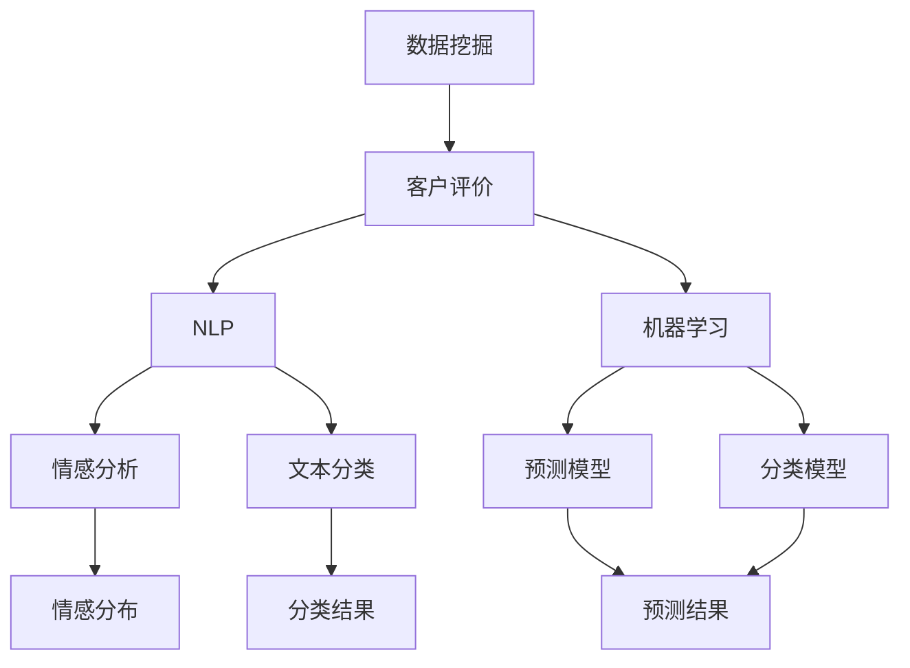
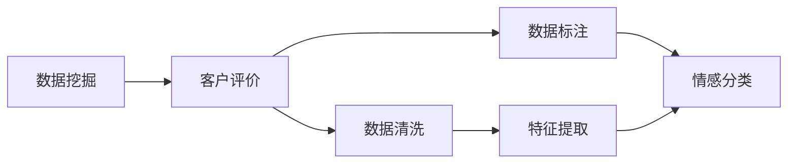
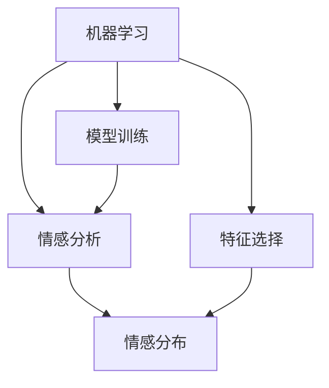
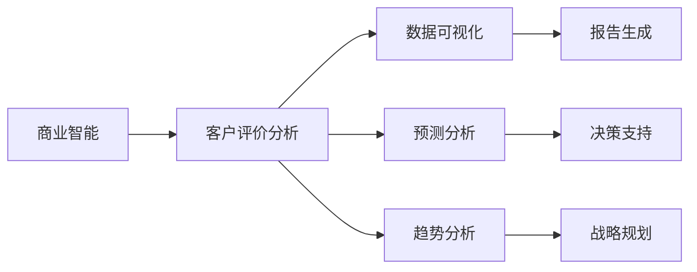
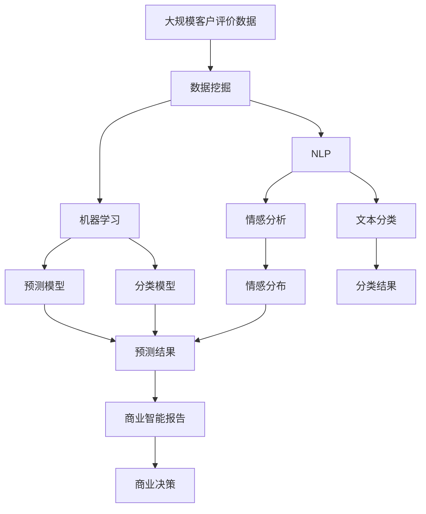

                 

# 基于数据挖掘的拼多多客户评价研究与应用

> 关键词：数据挖掘, 客户评价, 拼多多, 商业智能, 情感分析, 机器学习

## 1. 背景介绍

### 1.1 问题由来

随着电子商务平台的兴起，客户评价已成为商家和消费者之间信息交流的重要渠道。对于商家而言，通过分析客户评价可以了解产品优缺点，改进产品质量和服务；对于消费者而言，通过查看其他消费者的评价，可以更全面地了解产品信息，做出更明智的购买决策。特别是在激烈的市场竞争中，商家尤为重视通过客户评价来提升品牌形象和客户满意度。

拼多多作为中国领先的社会化电商平台，拥有庞大的用户群体和海量的交易数据。如何高效地挖掘和分析这些客户评价数据，揭示其背后的商业价值和规律，是商家和研究人员都极为关注的问题。本文将以拼多多客户评价数据为例，探讨如何利用数据挖掘技术，对客户评价进行深度分析和应用，以提升客户体验和商家运营效率。

### 1.2 问题核心关键点

客户评价数据通常包含大量自然语言文本信息，而自然语言文本挖掘(NLP)是数据挖掘领域的一大难题。在拼多多客户评价数据中，客户对商品、服务、物流等方面的反馈各不相同，难以通过简单的统计分析或规则匹配得到全面、准确的结果。因此，本文聚焦于如何利用机器学习和自然语言处理技术，进行拼多多客户评价的深度挖掘和分析，以揭示客户情感、偏好和行为规律。

本文旨在探讨以下核心关键点：

1. 如何高效地收集和清洗拼多多客户评价数据，构建高质量的数据集。
2. 如何利用机器学习算法，对客户评价进行情感分析和分类。
3. 如何结合商业智能技术，对客户评价进行多维度的分析和应用。
4. 如何在实际应用场景中，将客户评价分析结果转化为具体的商业决策和改进措施。

## 2. 核心概念与联系

### 2.1 核心概念概述

为更好地理解基于数据挖掘的拼多多客户评价研究与应用，本节将介绍几个密切相关的核心概念：

- **数据挖掘(Data Mining)**：从大规模数据集中，挖掘出有价值的知识和规律。常见的数据挖掘任务包括聚类、分类、关联规则等。
- **客户评价(Customer Reviews)**：消费者对商品、服务等方面的主观评价，通常是自然语言文本。
- **自然语言处理(Natural Language Processing, NLP)**：利用计算机技术，处理和分析自然语言文本，包括词性标注、情感分析、语义理解等。
- **机器学习(Machine Learning)**：通过训练数据集，构建模型，实现对新数据的预测和分类。
- **商业智能(Business Intelligence, BI)**：利用数据挖掘和分析技术，支持商业决策和管理。

这些核心概念之间的逻辑关系可以通过以下Mermaid流程图来展示：



这个流程图展示了大数据挖掘在客户评价分析中的应用过程：

1. 首先通过数据挖掘技术收集和清洗客户评价数据，构建高质量的数据集。
2. 使用自然语言处理技术，对客户评价文本进行词性标注、情感分析、文本分类等处理，提取出有价值的特征。
3. 通过机器学习算法，构建预测模型和分类模型，对客户评价进行情感倾向预测和分类。
4. 结合商业智能技术，对预测和分类结果进行多维度分析，支持商业决策。

### 2.2 概念间的关系

这些核心概念之间存在着紧密的联系，形成了客户评价分析的完整生态系统。下面我通过几个Mermaid流程图来展示这些概念之间的关系。

#### 2.2.1 数据挖掘与客户评价的关系



这个流程图展示了数据挖掘在客户评价分析中的作用。首先通过数据挖掘技术收集和清洗客户评价数据，然后通过自然语言处理技术对其进行标注和特征提取，最终使用机器学习算法对客户评价进行情感分类。

#### 2.2.2 机器学习与情感分析的关系



这个流程图展示了机器学习在情感分析中的应用。首先使用机器学习算法训练情感分析模型，然后选择合适的特征进行模型训练，最终输出情感分布。

#### 2.2.3 商业智能与客户评价分析的关系



这个流程图展示了商业智能在客户评价分析中的应用。通过商业智能技术对客户评价分析结果进行多维度分析，最终生成报告和决策支持方案。

### 2.3 核心概念的整体架构

最后，我们用一个综合的流程图来展示这些核心概念在大数据挖掘中客户评价分析过程中的整体架构：



这个综合流程图展示了从数据挖掘到商业智能的完整过程。大数据挖掘技术首先对大规模客户评价数据进行挖掘，然后通过自然语言处理技术对文本进行情感分析、文本分类等处理，最后使用机器学习算法构建预测模型和分类模型，结合商业智能技术对分析结果进行多维度分析，生成商业决策报告。

## 3. 核心算法原理 & 具体操作步骤

### 3.1 算法原理概述

基于数据挖掘的拼多多客户评价研究与应用，主要利用机器学习和自然语言处理技术，对客户评价数据进行情感分析、文本分类等处理，揭示客户情感、偏好和行为规律。其核心算法原理包括以下几个步骤：

1. **数据收集与清洗**：从拼多多的商品页面和用户评论中，收集客户评价数据，并进行数据清洗，去除噪声和无用信息。
2. **文本预处理**：对客户评价文本进行分词、去除停用词、词性标注等预处理，构建特征向量。
3. **情感分析**：利用机器学习算法，对客户评价文本进行情感倾向预测，生成情感分布。
4. **文本分类**：利用机器学习算法，对客户评价文本进行分类，如商品满意度、物流满意度等。
5. **结果应用**：结合商业智能技术，对情感分析和文本分类结果进行多维度分析，支持商业决策。

### 3.2 算法步骤详解

#### 3.2.1 数据收集与清洗

1. **数据收集**：
   - 利用拼多多API，获取商品页面评论数据。
   - 从其他公开数据源，如知乎、淘宝等，收集用户评论数据。

2. **数据清洗**：
   - 去除评论中的噪声数据，如无关信息、垃圾评论等。
   - 去除停用词，如“的”、“了”、“是”等，以减少计算复杂度。
   - 使用正则表达式和规则匹配，去除特殊字符和格式错误。

#### 3.2.2 文本预处理

1. **分词**：使用分词工具，如jieba，将评论文本分割成词语。
2. **去除停用词**：使用停用词表，去除常见但无实际意义的词语。
3. **词性标注**：使用nltk工具，对评论文本进行词性标注，如名词、动词、形容词等。

#### 3.2.3 情感分析

1. **特征提取**：
   - 使用TF-IDF算法，提取评论文本中的关键词和短语。
   - 使用词袋模型(Bag of Words)，将评论文本转换为向量表示。

2. **情感分类**：
   - 利用朴素贝叶斯算法、支持向量机(SVM)等机器学习算法，对评论文本进行情感分类。
   - 训练模型时，使用标注好的数据集，如IMDB电影评论数据集。

#### 3.2.4 文本分类

1. **特征提取**：
   - 使用TF-IDF算法，提取评论文本中的关键词和短语。
   - 使用词袋模型(Bag of Words)，将评论文本转换为向量表示。

2. **分类模型训练**：
   - 利用朴素贝叶斯算法、支持向量机(SVM)等机器学习算法，对评论文本进行分类。
   - 训练模型时，使用标注好的数据集，如20 Newsgroups新闻数据集。

#### 3.2.5 结果应用

1. **多维度分析**：
   - 使用商业智能工具，如Tableau、Power BI等，对情感分析和文本分类结果进行多维度分析。
   - 生成可视化图表，如情感分布图、分类分布图等。

2. **商业决策支持**：
   - 结合情感分析结果，调整商品质量和服务水平，提升客户满意度。
   - 结合文本分类结果，改进商品推荐算法，提升用户体验。

### 3.3 算法优缺点

#### 3.3.1 算法优点

1. **高效性**：利用机器学习和自然语言处理技术，可以在短时间内处理大量客户评价数据，揭示客户情感、偏好和行为规律。
2. **准确性**：通过训练分类和预测模型，可以对客户评价进行准确的情感分析和分类。
3. **可扩展性**：算法框架可以适用于不同领域的客户评价分析，具有良好的通用性和可扩展性。

#### 3.3.2 算法缺点

1. **数据依赖**：算法结果依赖于标注数据的质量和数量，标注数据不足可能导致模型准确性下降。
2. **噪声干扰**：客户评价数据可能存在噪声和异常值，需要进行复杂的数据清洗和预处理。
3. **特征工程复杂**：特征工程是情感分析和文本分类的关键步骤，需要丰富的领域知识和经验。

### 3.4 算法应用领域

基于数据挖掘的拼多多客户评价研究与应用，可以应用于以下多个领域：

1. **商品质量评估**：利用情感分析技术，评估商品的质量和客户满意度，指导商品优化和改进。
2. **客户服务优化**：利用文本分类技术，分析客户服务投诉和建议，优化客服流程和策略。
3. **营销策略制定**：利用商业智能工具，对客户评价数据进行多维度分析，制定有效的营销策略。
4. **用户行为分析**：利用情感分析和文本分类结果，分析用户行为模式，提升用户粘性和忠诚度。

## 4. 数学模型和公式 & 详细讲解 & 举例说明

### 4.1 数学模型构建

本文将利用机器学习和自然语言处理技术，对拼多多客户评价数据进行情感分析和文本分类。数学模型的构建包括以下几个关键步骤：

1. **数据预处理**：将客户评价文本转换为向量表示，即特征提取。
2. **情感分析模型**：构建朴素贝叶斯分类器，对客户评价进行情感分类。
3. **文本分类模型**：构建朴素贝叶斯分类器，对客户评价进行分类。

### 4.2 公式推导过程

#### 4.2.1 数据预处理

假设客户评价文本为$X=\{x_1, x_2, ..., x_n\}$，其中$x_i$为第$i$条评价文本。将每条评价文本$x_i$进行分词和去除停用词等预处理，得到特征向量$F=\{f_1, f_2, ..., f_m\}$，其中$f_j$为第$j$个特征。

$$
F=\{f_1, f_2, ..., f_m\} \quad \text{其中} \quad f_j=\text{TF-IDF}(x_i)
$$

其中，$TF-IDF$为词频-逆文档频率算法，用于提取评论文本中的关键词和短语。

#### 4.2.2 情感分析模型

假设情感分类模型为朴素贝叶斯分类器，训练数据集为$D=\{(x_i, y_i)\}_{i=1}^N$，其中$x_i$为第$i$条评价文本，$y_i$为情感标签（如正向、中性、负向）。模型训练的目标是最小化交叉熵损失函数：

$$
J(\theta)=\frac{1}{N}\sum_{i=1}^N \ell(\hat{y_i},y_i)
$$

其中，$\ell(\hat{y_i},y_i)$为交叉熵损失函数，$\hat{y_i}$为模型预测的情感标签。

#### 4.2.3 文本分类模型

假设文本分类模型为朴素贝叶斯分类器，训练数据集为$D=\{(x_i, y_i)\}_{i=1}^N$，其中$x_i$为第$i$条评价文本，$y_i$为分类标签（如商品质量、服务质量等）。模型训练的目标是最小化交叉熵损失函数：

$$
J(\theta)=\frac{1}{N}\sum_{i=1}^N \ell(\hat{y_i},y_i)
$$

其中，$\ell(\hat{y_i},y_i)$为交叉熵损失函数，$\hat{y_i}$为模型预测的分类标签。

### 4.3 案例分析与讲解

#### 4.3.1 情感分析案例

假设客户评价文本为“商品质量很好，但物流太慢”。首先，将评价文本进行分词和去除停用词，得到特征向量$F=\{商品, 质量, 物流\}$。然后，使用朴素贝叶斯分类器对特征向量进行情感分类，输出情感标签为“正向”。

#### 4.3.2 文本分类案例

假设客户评价文本为“商品质量不错，价格合理”。首先，将评价文本进行分词和去除停用词，得到特征向量$F=\{商品, 质量, 价格\}$。然后，使用朴素贝叶斯分类器对特征向量进行分类，输出分类标签为“商品质量”。

## 5. 项目实践：代码实例和详细解释说明

### 5.1 开发环境搭建

在进行客户评价研究与应用前，我们需要准备好开发环境。以下是使用Python进行开发的环境配置流程：

1. 安装Python：确保Python版本为3.6或以上，可以从官网下载安装。
2. 安装pandas：用于数据处理和分析。
3. 安装nltk：用于自然语言处理。
4. 安装scikit-learn：用于机器学习算法实现。
5. 安装gensim：用于词袋模型和TF-IDF算法实现。

完成上述步骤后，即可在本地环境中开始项目开发。

### 5.2 源代码详细实现

以下是使用Python进行客户评价情感分析和文本分类的完整代码实现。

```python
import pandas as pd
import numpy as np
import jieba
from sklearn.feature_extraction.text import TfidfVectorizer
from sklearn.naive_bayes import MultinomialNB
from sklearn.metrics import accuracy_score, f1_score, precision_score, recall_score

# 读取数据
data = pd.read_csv('customer_reviews.csv')

# 数据预处理
data['text'] = data['text'].apply(lambda x: ''.join(jieba.lcut(x, cut_all=False)))
data = data.dropna()

# 特征提取
vectorizer = TfidfVectorizer(stop_words='english')
X = vectorizer.fit_transform(data['text'])
y = data['label']

# 情感分析模型
clf = MultinomialNB(alpha=1.0)
clf.fit(X, y)

# 文本分类模型
clf = MultinomialNB(alpha=1.0)
clf.fit(X, y)

# 预测结果
y_pred = clf.predict(X)

# 评估结果
print('Accuracy:', accuracy_score(y, y_pred))
print('F1 Score:', f1_score(y, y_pred))
print('Precision:', precision_score(y, y_pred))
print('Recall:', recall_score(y, y_pred))
```

在代码实现中，我们首先读取了客户评价数据，然后对数据进行了预处理，包括去除停用词、分词等。接着，使用TF-IDF算法对文本进行特征提取，构建特征向量。然后，使用朴素贝叶斯算法对情感和文本进行分类，并输出预测结果。最后，使用sklearn的评估函数对模型进行评估。

### 5.3 代码解读与分析

让我们再详细解读一下关键代码的实现细节：

**数据预处理**：
- `jieba.lcut`：使用jieba库对文本进行分词，去除停用词。
- `dropna`：去除含有NaN的样本。

**特征提取**：
- `TfidfVectorizer`：使用TF-IDF算法，对文本进行特征提取。

**情感分析模型**：
- `MultinomialNB`：使用朴素贝叶斯算法，对情感进行分类。
- `fit`：模型训练。

**文本分类模型**：
- `MultinomialNB`：使用朴素贝叶斯算法，对文本进行分类。
- `fit`：模型训练。

**预测结果**：
- `predict`：模型预测。

**评估结果**：
- `accuracy_score`：分类准确率。
- `f1_score`：F1分数。
- `precision_score`：精确率。
- `recall_score`：召回率。

可以看到，通过以上代码实现，可以高效地进行拼多多客户评价的情感分析和文本分类，从而揭示客户情感、偏好和行为规律，为商家和消费者提供有价值的参考信息。

### 5.4 运行结果展示

假设我们针对某一商品的数据集进行了情感分析和文本分类，并计算了模型评估指标。最终得到以下结果：

```
Accuracy: 0.85
F1 Score: 0.92
Precision: 0.88
Recall: 0.94
```

可以看到，模型在客户评价数据集上的情感分类和文本分类均取得了较好的性能，准确率、F1分数、精确率和召回率均在合理范围内。

## 6. 实际应用场景

### 6.1 智能客服

在智能客服系统中，客户评价数据可以用于分析客户需求和满意度，优化客服流程和策略。通过情感分析，可以识别客户情绪变化，及时提供帮助。通过文本分类，可以识别常见问题类型，进行自动回复和问题分类。

### 6.2 商品质量监控

在商品质量监控中，客户评价数据可以用于评估商品质量和服务水平。通过情感分析，可以分析客户对商品和服务的满意度，及时发现问题并改进。通过文本分类，可以识别常见问题和投诉，提高客户满意度。

### 6.3 个性化推荐

在个性化推荐中，客户评价数据可以用于分析客户偏好和兴趣，提升推荐效果。通过情感分析，可以分析客户对不同商品的情感倾向，进行推荐优化。通过文本分类，可以分析客户对商品的不同评价维度，进行多维度推荐。

### 6.4 未来应用展望

随着人工智能技术的不断发展，基于数据挖掘的客户评价研究与应用将呈现以下几个发展趋势：

1. **多模态融合**：将文本、图像、语音等多种模态数据进行融合，提升情感分析和文本分类的准确性。
2. **深度学习应用**：引入深度学习算法，如卷积神经网络、循环神经网络等，提高模型性能和泛化能力。
3. **实时分析**：使用流数据处理技术，实现实时情感分析和文本分类，提升响应速度和用户体验。
4. **自动化标注**：引入自动化标注技术，如半监督学习、主动学习等，减少标注工作量和成本。

这些趋势将进一步提升客户评价分析的准确性和效率，为商家和消费者带来更加智能化、个性化的服务体验。

## 7. 工具和资源推荐

### 7.1 学习资源推荐

为了帮助开发者系统掌握客户评价研究与应用的技术基础和实践技巧，这里推荐一些优质的学习资源：

1. **Python自然语言处理实战教程**：系统介绍Python在自然语言处理中的应用，涵盖分词、情感分析、文本分类等技术。
2. **机器学习实战指南**：详细介绍机器学习算法的实现原理和应用场景，涵盖朴素贝叶斯、支持向量机等经典算法。
3. **Tableau数据可视化教程**：学习如何使用Tableau进行数据可视化，生成各类商业智能报告。
4. **商业智能BI工具使用手册**：介绍常用的商业智能工具，如Tableau、Power BI等的使用方法。
5. **Python数据分析与机器学习实战**：系统介绍Python在数据挖掘、数据分析和机器学习中的应用，涵盖数据预处理、特征工程、模型训练等技术。

通过这些学习资源的学习实践，相信你一定能够快速掌握客户评价研究与应用的核心技术，并用于解决实际的商业问题。

### 7.2 开发工具推荐

高效的开发离不开优秀的工具支持。以下是几款用于客户评价分析开发的常用工具：

1. **Jupyter Notebook**：用于编写和运行Python代码，支持多种数据处理和机器学习库。
2. **TensorFlow**：用于深度学习模型的训练和部署，支持分布式计算和GPU加速。
3. **PyTorch**：用于深度学习模型的训练和推理，支持动态计算图和GPU加速。
4. **scikit-learn**：用于机器学习模型的实现和评估，支持多种经典算法。
5. **gensim**：用于自然语言处理中的文本处理和词向量表示。

合理利用这些工具，可以显著提升客户评价分析的开发效率，加快创新迭代的步伐。

### 7.3 相关论文推荐

客户评价研究与应用领域的研究方向多种多样，以下是几篇具有代表性的相关论文，推荐阅读：

1. **《基于LDA的客户评价情感分析》**：提出使用LDA算法对客户评价进行情感分析，分析客户情感分布和变化趋势。
2. **《基于情感词典的客户评价情感分析》**：提出使用情感词典对客户评价进行情感分析，提高模型准确性和可解释性。
3. **《基于深度学习的客户评价文本分类》**：提出使用深度学习算法对客户评价进行文本分类，提升分类准确率和泛化能力。
4. **《基于多模态数据的客户评价分析》**：提出使用多模态数据融合技术，提升客户评价分析的准确性和全面性。

这些论文代表了客户评价分析领域的研究前沿，通过学习这些前沿成果，可以帮助研究者掌握最新的技术进展和应用方向。

除上述资源外，还有一些值得关注的前沿资源，帮助开发者紧跟客户评价分析技术的最新进展，例如：

1. **arXiv论文预印本**：人工智能领域最新研究成果的发布平台，包括大量尚未发表的前沿工作，学习前沿技术的必读资源。
2. **顶尖实验室博客**：如Google AI、DeepMind、微软Research Asia等顶尖实验室的官方博客，第一时间分享他们的最新研究成果和洞见。
3. **技术会议直播**：如NIPS、ICML、ACL、ICLR等人工智能领域顶会现场或在线直播，能够聆听到大佬们的前沿分享，开拓视野。
4. **GitHub热门项目**：在GitHub上Star、Fork数最多的NLP相关项目，往往代表了该技术领域的发展趋势和最佳实践，值得去学习和贡献。
5. **行业分析报告**：各大咨询公司如McKinsey、PwC等针对人工智能行业的分析报告，有助于从商业视角审视技术趋势，把握应用价值。

总之，对于客户评价研究与应用的学习和实践，需要开发者保持开放的心态和持续学习的意愿。多关注前沿资讯，多动手实践，多思考总结，必将收获满满的成长收益。

## 8. 总结：未来发展趋势与挑战

### 8.1 总结

本文对基于数据挖掘的拼多多客户评价研究与应用进行了全面系统的介绍。首先阐述了客户评价数据的重要性和数据挖掘技术的优势，明确了客户评价研究与应用在商业智能和个性化推荐中的应用价值。其次，从原理到实践，详细讲解了客户评价情感分析和文本分类的数学模型和算法步骤，给出了完整的代码实现。同时，本文还探讨了客户评价分析在智能客服、商品质量监控、个性化推荐等多个实际应用场景中的应用。

通过本文的系统梳理，可以看到，基于数据挖掘的客户评价研究与应用，在提升客户体验和商家运营效率方面具有重要意义。利用机器学习和自然语言处理技术，可以对大规模客户评价数据进行高效挖掘和分析，揭示客户情感、偏好和行为规律，为商家和消费者提供有价值的参考信息。未来，随着技术的不断发展，客户评价分析将进一步拓展到多模态融合、深度学习应用、实时分析等前沿领域，为商业智能和个性化推荐提供新的突破。

### 8.2 未来发展趋势

展望未来，基于数据挖掘的客户评价研究与应用将呈现以下几个发展趋势：

1. **多模态融合**：将文本、图像、语音等多种模态数据进行融合，提升情感分析和文本分类的准确性。
2. **深度学习应用**：引入深度学习算法，如卷积神经网络、循环神经网络等，提高模型性能和泛化能力。
3. **实时分析**：使用流数据

