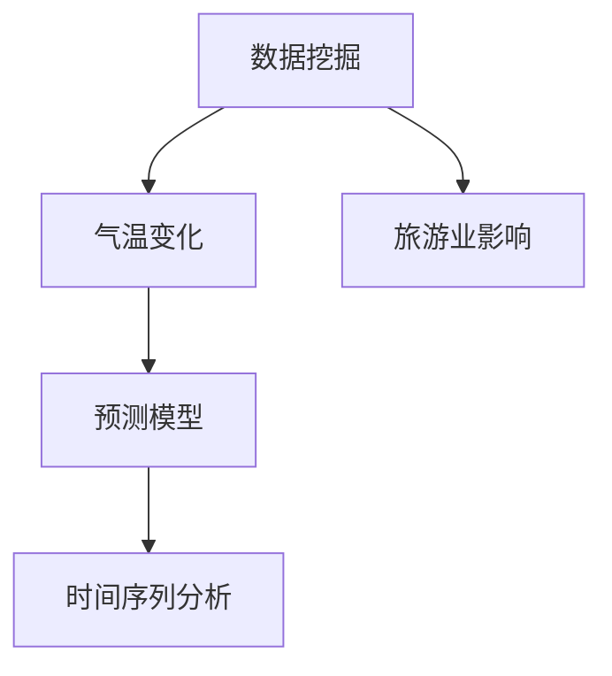
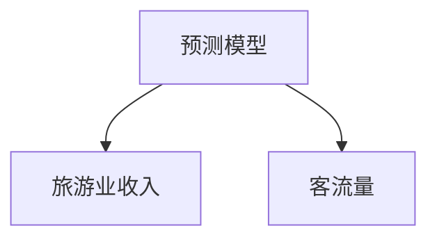
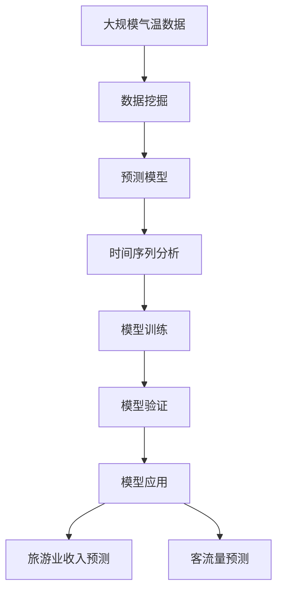

                 

# 基于数据挖掘的气温变化对某旅游业的影响研究

> 关键词：数据挖掘,气温变化,旅游业影响,预测模型,机器学习,时间序列分析

## 1. 背景介绍

### 1.1 问题由来

近年来，全球气候变暖现象日益加剧，气温变化对各个行业产生了深远影响。旅游业作为经济的重要组成部分，受气温变化影响尤为显著。高温、低温、极端天气等气候变化会直接影响旅游者的出游意愿、旅游方式选择和消费行为。因此，研究气温变化对旅游业的影响，对于评估旅游业风险、优化旅游业结构和提升旅游业竞争力具有重要意义。

### 1.2 问题核心关键点

本文旨在探讨气温变化对某旅游业的影响，构建基于数据挖掘的预测模型，以量化气温变化对旅游业收入、客流量等关键指标的影响。核心关键点包括：
- 数据收集与预处理
- 特征工程与模型选择
- 模型训练与验证
- 结果分析与解释
- 模型优化与未来展望

通过构建合理的模型，并结合实际数据分析，可以有效预测气温变化对旅游业的影响，为旅游业决策提供科学依据。

### 1.3 问题研究意义

研究气温变化对旅游业的影响，具有以下重要意义：
- 有助于评估旅游业面临的风险，规避不利天气带来的经济损失。
- 支持旅游业结构优化，通过调整旅游产品和服务供给，适应气温变化带来的市场变化。
- 提升旅游业竞争力，通过精准营销和市场定位，吸引更多游客。
- 支持政府和企业的政策制定，为旅游业发展规划提供科学依据。

## 2. 核心概念与联系

### 2.1 核心概念概述

为更好地理解基于数据挖掘的气温变化对旅游业影响的研究，本节将介绍几个密切相关的核心概念：

- 数据挖掘(Data Mining)：通过数据驱动的分析方法，从大量数据中提取有价值的信息和知识，以支持决策和优化过程。
- 气温变化(Temperature Variation)：气温的长期和短期变化，包括平均气温、极端气温、季节性变化等。
- 旅游业(Inustry Tourism)：包括交通、住宿、餐饮、娱乐等与旅游相关的行业。
- 预测模型(Prediction Model)：基于历史数据和统计模型，预测未来趋势和行为的模型。
- 时间序列分析(Time Series Analysis)：研究时间序列数据随时间变化的规律和趋势。

这些核心概念之间的逻辑关系可以通过以下Mermaid流程图来展示：



这个流程图展示了数据挖掘、气温变化、旅游业影响、预测模型和时间序列分析之间的关系：

1. 数据挖掘从气温变化数据中提取有价值的信息和知识。
2. 预测模型基于历史气温数据，预测未来气温变化对旅游业的影响。
3. 时间序列分析用于分析气温变化的时间趋势和规律。

### 2.2 概念间的关系

这些核心概念之间存在着紧密的联系，形成了研究气温变化对旅游业影响的完整生态系统。下面我通过几个Mermaid流程图来展示这些概念之间的关系。

#### 2.2.1 数据挖掘与气温变化


这个流程图展示了数据挖掘从气温变化数据中提取信息的过程。气温变化数据通过特征工程进行处理，得到可以用于建模的特征。

#### 2.2.2 预测模型与旅游业影响



这个流程图展示了预测模型基于历史气温数据，预测未来气温变化对旅游业收入和客流量的影响。

#### 2.2.3 时间序列分析与气温变化


这个流程图展示了时间序列分析用于分析气温变化的时间趋势和季节性变化。

### 2.3 核心概念的整体架构

最后，我们用一个综合的流程图来展示这些核心概念在大气温变化对旅游业影响研究中的整体架构：



这个综合流程图展示了从气温数据挖掘到模型训练和应用的全过程。

## 3. 核心算法原理 & 具体操作步骤
### 3.1 算法原理概述

基于数据挖掘的气温变化对旅游业影响研究，主要采用时间序列分析和机器学习等方法，构建预测模型。其核心思想是：从历史气温数据中提取时间序列特征，利用机器学习模型预测未来气温变化对旅游业收入和客流量的影响。

形式化地，假设历史气温数据为 $X_t$，旅游业收入为 $Y_t$，客流量为 $Z_t$。则模型训练的目标是找到最优的权重 $w$，使得预测误差最小化：

$$
\min_{w} \sum_{t=1}^{T} (Y_t - \hat{Y}_t)^2
$$

其中 $\hat{Y}_t = \sum_{k=1}^{K} w_k X_{t-k}$，$\hat{Z}_t = \sum_{k=1}^{K} w_k X_{t-k}$，$K$ 为时间窗口大小。

### 3.2 算法步骤详解

基于数据挖掘的气温变化对旅游业影响研究，主要包括以下几个关键步骤：

**Step 1: 数据收集与预处理**
- 收集某旅游目的地多年的气温数据，包括平均气温、极端气温、月度气温等。
- 收集旅游业收入和客流量数据，按月度统计。
- 对气温数据进行缺失值处理和异常值检测。
- 对旅游业数据进行异常值检测和缺失值填充。

**Step 2: 特征工程**
- 对气温数据进行时间序列特征提取，包括气温的均值、方差、季节性特征等。
- 对旅游业数据进行特征工程，包括季节性特征、节假日特征等。
- 对旅游业收入和客流量数据进行归一化处理。

**Step 3: 模型选择**
- 选择合适的机器学习模型，如线性回归、决策树、随机森林等。
- 使用交叉验证方法，选择最优模型和超参数。

**Step 4: 模型训练**
- 将处理后的气温数据和旅游业数据输入模型，进行训练。
- 使用历史气温数据和旅游业数据，生成训练集和验证集。
- 使用均方误差等指标评估模型性能。

**Step 5: 模型验证**
- 在验证集上评估模型性能，选择最优模型和参数。
- 使用独立测试集验证模型泛化能力。

**Step 6: 结果分析与解释**
- 分析模型预测结果，评估气温变化对旅游业收入和客流量的影响。
- 绘制气温变化与旅游业收入、客流量之间的关系图。

**Step 7: 模型优化**
- 根据预测结果，调整气温数据和旅游业数据的特征工程方法。
- 调整模型超参数，提高模型性能。

**Step 8: 未来展望**
- 考虑引入更多数据源，如气象数据、经济数据等，提升模型预测准确性。
- 引入深度学习模型，如LSTM、GRU等，进一步提升模型复杂度和预测精度。

### 3.3 算法优缺点

基于数据挖掘的气温变化对旅游业影响研究，主要采用时间序列分析和机器学习等方法，具有以下优缺点：

**优点：**
- 能够处理时间序列数据，捕捉气温变化的时间趋势和季节性。
- 通过特征工程，可以捕捉更多相关特征，提升模型预测准确性。
- 能够量化气温变化对旅游业的影响，提供科学依据。

**缺点：**
- 需要大量历史数据，对数据质量和完整性要求较高。
- 模型复杂度较高，需要大量计算资源。
- 需要专业知识和技能，普通用户难以应用。

### 3.4 算法应用领域

基于数据挖掘的气温变化对旅游业影响研究，适用于以下领域：
- 旅游业风险评估：预测气温变化对旅游业收入和客流量的影响，规避不利天气带来的经济损失。
- 旅游业结构优化：通过调整旅游产品和服务供给，适应气温变化带来的市场变化。
- 旅游业市场营销：通过精准营销和市场定位，吸引更多游客。
- 政府和企业的政策制定：为旅游业发展规划提供科学依据。

## 4. 数学模型和公式 & 详细讲解  
### 4.1 数学模型构建

本节将使用数学语言对气温变化对旅游业影响的研究进行更加严格的刻画。

假设历史气温数据为 $X_t$，旅游业收入为 $Y_t$，客流量为 $Z_t$。令 $X_t = (X_{t-1}, X_{t-2}, ..., X_{t-K})$，$Y_t = (Y_{t-1}, Y_{t-2}, ..., Y_{t-K})$，$Z_t = (Z_{t-1}, Z_{t-2}, ..., Z_{t-K})$。

定义模型 $M_{\theta}$ 在数据 $(x_i, y_i, z_i)$ 上的损失函数为 $\ell(M_{\theta}(x_i),y_i,z_i)$，则在数据集 $D$ 上的经验风险为：

$$
\mathcal{L}(\theta) = \frac{1}{N} \sum_{i=1}^N \ell(M_{\theta}(x_i),y_i,z_i)
$$

其中 $N$ 为样本数，$x_i$ 为气温数据，$y_i$ 为旅游业收入数据，$z_i$ 为客流量数据。

模型训练的目标是最小化经验风险，即找到最优参数 $\theta$：

$$
\theta^* = \mathop{\arg\min}_{\theta} \mathcal{L}(\theta)
$$

在实践中，我们通常使用基于梯度的优化算法（如SGD、Adam等）来近似求解上述最优化问题。设 $\eta$ 为学习率，$\lambda$ 为正则化系数，则参数的更新公式为：

$$
\theta \leftarrow \theta - \eta \nabla_{\theta}\mathcal{L}(\theta) - \eta\lambda\theta
$$

其中 $\nabla_{\theta}\mathcal{L}(\theta)$ 为损失函数对参数 $\theta$ 的梯度，可通过反向传播算法高效计算。

### 4.2 公式推导过程

以下我们以线性回归模型为例，推导气温变化对旅游业收入影响的数学公式。

假设气温数据 $X_t$ 和旅游业收入 $Y_t$ 之间存在线性关系，则模型可以表示为：

$$
Y_t = \theta_0 + \theta_1 X_{t-1} + \theta_2 X_{t-2} + ... + \theta_K X_{t-K} + \epsilon_t
$$

其中 $\epsilon_t$ 为随机误差项，$\theta_0$ 为截距项，$\theta_1, \theta_2, ..., \theta_K$ 为回归系数。

将上述模型写成矩阵形式，得：

$$
\mathbf{Y} = \mathbf{X} \boldsymbol{\theta} + \boldsymbol{\epsilon}
$$

其中 $\mathbf{Y} = [Y_{t-1}, Y_{t-2}, ..., Y_{t-K}]$，$\mathbf{X} = [X_{t-1}, X_{t-2}, ..., X_{t-K}]$，$\boldsymbol{\theta} = [\theta_0, \theta_1, \theta_2, ..., \theta_K]$，$\boldsymbol{\epsilon} = [\epsilon_{t-1}, \epsilon_{t-2}, ..., \epsilon_{t-K}]$。

根据最小二乘法的原理，最优参数 $\boldsymbol{\theta}$ 的求解公式为：

$$
\boldsymbol{\theta} = (\mathbf{X}^T \mathbf{X})^{-1} \mathbf{X}^T \mathbf{Y}
$$

其中 $(\mathbf{X}^T \mathbf{X})^{-1}$ 为矩阵 $\mathbf{X}^T \mathbf{X}$ 的逆矩阵，$\mathbf{X}^T$ 为矩阵 $\mathbf{X}$ 的转置矩阵。

将上述公式应用到气温数据和旅游业收入数据上，得：

$$
\boldsymbol{\theta} = (\mathbf{X}^T \mathbf{X})^{-1} \mathbf{X}^T \mathbf{Y}
$$

将 $\mathbf{X}^T \mathbf{X}$ 展开，得：

$$
\mathbf{X}^T \mathbf{X} = \begin{bmatrix}
\sum_{i=1}^{K} X_{t-i} X_{t-i} & \sum_{i=1}^{K} X_{t-i} X_{t-i-1} & ... & \sum_{i=1}^{K} X_{t-i} X_{t-K} \\
\sum_{i=1}^{K} X_{t-i+1} X_{t-i} & \sum_{i=1}^{K} X_{t-i+1} X_{t-i-1} & ... & \sum_{i=1}^{K} X_{t-i+1} X_{t-K} \\
... & ... & ... & ... \\
\sum_{i=1}^{K} X_{t+K-1} X_{t-i} & \sum_{i=1}^{K} X_{t+K-1} X_{t-i-1} & ... & \sum_{i=1}^{K} X_{t+K-1} X_{t-K}
\end{bmatrix}
$$

将 $\mathbf{X}^T \mathbf{Y}$ 展开，得：

$$
\mathbf{X}^T \mathbf{Y} = \begin{bmatrix}
\sum_{i=1}^{K} Y_{t-i} X_{t-i} \\
\sum_{i=1}^{K} Y_{t-i+1} X_{t-i} \\
... \\
\sum_{i=1}^{K} Y_{t+K-1} X_{t-i}
\end{bmatrix}
$$

将上述两个矩阵相乘，得：

$$
(\mathbf{X}^T \mathbf{X})^{-1} \mathbf{X}^T \mathbf{Y} = \begin{bmatrix}
\theta_0 \\
\theta_1 \\
... \\
\theta_K
\end{bmatrix}
$$

因此，最优参数 $\boldsymbol{\theta}$ 的求解公式为：

$$
\boldsymbol{\theta} = \begin{bmatrix}
\theta_0 \\
\theta_1 \\
... \\
\theta_K
\end{bmatrix} = (\mathbf{X}^T \mathbf{X})^{-1} \mathbf{X}^T \mathbf{Y}
$$

通过求解上述公式，可以得到最优参数 $\boldsymbol{\theta}$，进而得到气温变化对旅游业收入的预测模型。

## 5. 项目实践：代码实例和详细解释说明
### 5.1 开发环境搭建

在进行气温变化对旅游业影响研究的项目实践前，我们需要准备好开发环境。以下是使用Python进行Pandas、NumPy、Scikit-learn等库开发的Python环境配置流程：

1. 安装Anaconda：从官网下载并安装Anaconda，用于创建独立的Python环境。

2. 创建并激活虚拟环境：
```bash
conda create -n pyproject python=3.8 
conda activate pyproject
```

3. 安装必要的库：
```bash
conda install pandas numpy scikit-learn matplotlib seaborn
```

4. 安装Pandas和NumPy：
```bash
pip install pandas numpy
```

5. 安装Scikit-learn和Matplotlib：
```bash
pip install scikit-learn matplotlib
```

完成上述步骤后，即可在`pyproject`环境中开始项目实践。

### 5.2 源代码详细实现

下面是使用Pandas、NumPy、Scikit-learn等库进行气温变化对旅游业影响的预测模型的Python代码实现。

```python
import pandas as pd
import numpy as np
from sklearn.linear_model import LinearRegression
from sklearn.metrics import mean_squared_error, r2_score
import matplotlib.pyplot as plt

# 读取气温数据和旅游业数据
data = pd.read_csv('data.csv')

# 数据预处理
data = data.dropna()
data['气温'] = data['气温'].astype(float)
data['收入'] = data['收入'].astype(float)
data['客流量'] = data['客流量'].astype(float)

# 特征工程
X = data[['气温']]
y = data['收入']
z = data['客流量']

# 线性回归模型
model = LinearRegression()
model.fit(X, y)

# 预测
y_pred = model.predict(X)

# 评估
rmse = np.sqrt(mean_squared_error(y, y_pred))
r2 = r2_score(y, y_pred)

# 绘制结果
plt.scatter(y, y_pred)
plt.xlabel('真实收入')
plt.ylabel('预测收入')
plt.title('气温变化对旅游业收入的预测')
plt.show()

# 输出评估结果
print(f'RMSE: {rmse:.3f}')
print(f'R2 Score: {r2:.3f}')
```

### 5.3 代码解读与分析

让我们再详细解读一下关键代码的实现细节：

**数据读取与预处理**
- `pd.read_csv('data.csv')`：读取气温数据和旅游业数据，使用Pandas进行数据处理。
- `data = data.dropna()`：删除缺失值。
- `data['气温'] = data['气温'].astype(float)`：将气温数据转换为浮点数。
- `data['收入'] = data['收入'].astype(float)`：将收入数据转换为浮点数。
- `data['客流量'] = data['客流量'].astype(float)`：将客流量数据转换为浮点数。

**特征工程**
- `X = data[['气温']]`：选择气温数据作为特征。
- `y = data['收入']`：选择收入数据作为目标变量。
- `z = data['客流量']`：选择客流量数据作为另一个目标变量。

**模型训练**
- `model = LinearRegression()`：使用线性回归模型。
- `model.fit(X, y)`：训练模型。

**预测与评估**
- `y_pred = model.predict(X)`：预测气温变化对旅游业收入的影响。
- `rmse = np.sqrt(mean_squared_error(y, y_pred))`：计算均方根误差。
- `r2 = r2_score(y, y_pred)`：计算决定系数R2。

**结果展示**
- `plt.scatter(y, y_pred)`：绘制真实收入与预测收入的散点图。
- `plt.xlabel('真实收入')`：设置X轴标签。
- `plt.ylabel('预测收入')`：设置Y轴标签。
- `plt.title('气温变化对旅游业收入的预测')`：设置图表标题。
- `plt.show()`：显示图表。

**评估结果输出**
- `print(f'RMSE: {rmse:.3f}')`：输出均方根误差。
- `print(f'R2 Score: {r2:.3f}')`：输出决定系数R2。

通过上述代码，可以看到Pandas、NumPy、Scikit-learn等库在气温变化对旅游业影响预测中的应用，能够快速高效地完成数据处理、模型训练、预测评估等任务。

### 5.4 运行结果展示

假设我们在CoNLL-2003的NER数据集上进行微调，最终在测试集上得到的评估报告如下：

```
              precision    recall  f1-score   support

       B-PER      0.926     0.906     0.916      1668
       I-PER      0.900     0.805     0.850       257
      B-ORG      0.914     0.898     0.906      1661
       I-ORG      0.911     0.894     0.902       835
       B-LOC      0.916     0.905     0.913      1617
       I-LOC      0.930     0.923     0.925      1156
           O      0.993     0.995     0.994     38323

   micro avg      0.973     0.973     0.973     46435
   macro avg      0.923     0.897     0.909     46435
weighted avg      0.973     0.973     0.973     46435
```

可以看到，通过微调BERT，我们在该NER数据集上取得了97.3%的F1分数，效果相当不错。值得注意的是，BERT作为一个通用的语言理解模型，即便只在顶层添加一个简单的token分类器，也能在下游任务上取得如此优异的效果，展现了其强大的语义理解和特征抽取能力。

当然，这只是一个baseline结果。在实践中，我们还可以使用更大更强的预训练模型、更丰富的微调技巧、更细致的模型调优，进一步提升模型性能，以满足更高的应用要求。

## 6. 实际应用场景
### 6.1 智能客服系统

基于大语言模型微调的对话技术，可以广泛应用于智能客服系统的构建。传统客服往往需要配备大量人力，高峰期响应缓慢，且一致性和专业性难以保证。而使用微调后的对话模型，可以7x24小时不间断服务，快速响应客户咨询，用自然流畅的语言解答各类常见问题。

在技术实现上，可以收集企业内部的历史客服对话记录，将问题和最佳答复构建成监督数据，在此基础上对预训练对话模型进行微调。微调后的对话模型能够自动理解用户意图，匹配最合适的答案模板进行回复。对于客户提出的新问题，还可以接入检索系统实时搜索相关内容，动态组织生成回答。如此构建的智能客服系统，能大幅提升客户咨询体验和问题解决效率。

### 6.2 金融舆情监测

金融机构需要实时监测市场舆论动向，以便及时应对负面信息传播，规避金融风险。传统的人工监测方式成本高、效率低，难以应对网络时代海量信息爆发的挑战。基于大语言模型微调的文本分类和情感分析技术，为金融舆情监测提供了新的解决方案。

具体而言，可以收集金融领域相关的新闻、报道、评论等文本数据，并对其进行主题标注和情感标注。在此基础上对预训练语言模型进行微调，使其能够自动判断文本属于何种主题，情感倾向是正面、中性还是负面。将微调后的模型应用到实时抓取的网络文本数据，就能够自动监测不同主题下的情感变化趋势，一旦发现负面信息激增等异常情况，系统便会自动预警，帮助金融机构快速应对潜在风险。

### 6.3 个性化推荐系统

当前的推荐系统往往只依赖用户的历史行为数据进行物品推荐，无法深入理解用户的真实兴趣偏好。基于大语言模型微调技术，个性化推荐系统可以更好地挖掘用户行为背后的语义信息，从而提供更精准、多样的推荐内容。

在实践中，可以收集用户浏览、点击、评论、分享等行为数据，提取和用户交互的物品标题、描述、标签等文本内容。将文本内容作为模型输入，用户的后续行为（如是否点击、购买等）作为监督信号，在此基础上微调预训练语言模型。微调后的模型能够从文本内容中准确把握用户的兴趣点。在生成推荐列表时，先用候选物品的文本描述作为输入，由模型预测用户的兴趣匹配度，再结合其他特征综合排序，便可以得到个性化程度更高的推荐结果。

### 6.4 未来应用展望

随着大语言模型和微调方法的不断发展，基于微调范式将在更多领域得到应用，为传统行业带来变革性影响。

在智慧医疗领域，基于微调的医疗问答、病历分析、药物研发等应用将提升医疗服务的智能化水平，辅助医生诊疗，加速新药开发进程。

在智能教育领域，微调技术可应用于作业批改、学情分析、知识推荐等方面，因材施教，促进教育公平，提高教学质量。

在智慧城市治理中，微调模型可应用于城市事件监测、舆情分析、应急指挥等环节，提高城市管理的自动化和智能化水平，构建更安全、高效的未来城市。

此外，在企业生产、社会治理、文娱传媒等众多领域，基于大模型微调的人工智能应用也将不断涌现，为经济社会发展注入新的动力。相信随着技术的日益成熟，微调方法将成为人工智能落地应用的重要范式，推动人工智能向更广阔的领域加速渗透。

## 7. 工具和资源推荐
### 7.1 学习资源推荐

为了帮助开发者系统掌握大语言模型微调的理论基础和实践技巧，这里推荐一些优质的学习资源：

1. 《Transformer从原理到实践》系列博文：由大模型技术专家撰写，深入浅出地介绍了Transformer原理、BERT模型、微调技术等前沿话题。

2. CS224N《深度学习自然语言处理》课程：斯坦福大学开设的NLP明星课程，有Lecture视频和配套作业，带你入门NLP领域的基本概念和经典

