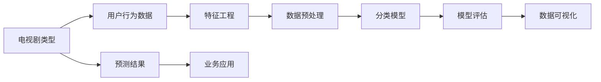

                 

# 基于机器学习的电视剧类型点击量数据分析研究

> 关键词：
> - 机器学习
> - 数据挖掘
> - 电视剧点击量
> - 特征工程
> - 分类模型
> - 数据可视化
> - 性能评估

## 1. 背景介绍

### 1.1 问题由来

随着互联网和数字媒体的飞速发展，电视剧成为观众获取信息和娱乐的重要渠道之一。大量的电视剧数据不仅带来了丰厚的市场资源，也孕育了宝贵的用户行为数据。电视剧点击量分析，旨在通过对电视剧类型、内容、时长、演员、导演等特征的深入挖掘，揭示不同电视剧类型之间的用户行为差异，从而指导内容创作、市场推广和用户服务，提升用户满意度和市场竞争力。

然而，电视剧类型点击量分析涉及海量数据和多维特征，如何从数据中提取有价值的信息，并构建有效的分析模型，一直是研究者面临的挑战。近年来，随着机器学习技术的发展，特别是深度学习和大数据分析技术的突破，基于机器学习的电视剧类型点击量分析方法逐渐成为研究热点。本文将从理论到实践，系统介绍基于机器学习的电视剧类型点击量分析方法。

### 1.2 问题核心关键点

电视剧类型点击量分析的核心在于构建用户行为与电视剧类型之间的映射关系，从而实现电视剧类型的精准分类和预测。具体而言，研究的核心包括以下几点：

- **特征提取与选择**：从原始数据中提取出有助于电视剧类型分类的特征，并筛选出最具区分性的特征。
- **数据预处理**：对数据进行清洗、归一化、降维等预处理，以保证数据的质量和一致性。
- **模型选择与训练**：选择合适的机器学习模型，并在训练集上训练模型，优化模型参数。
- **模型评估与部署**：在测试集上评估模型性能，并将模型部署到实际应用中，进行实时预测。

## 2. 核心概念与联系

### 2.1 核心概念概述

为了更好地理解基于机器学习的电视剧类型点击量分析方法，我们需要先掌握以下几个核心概念：

- **电视剧类型**：指电视剧的内容属性，如历史剧、科幻剧、情感剧等。
- **用户行为**：指用户在观看电视剧时所表现出的行为特征，如观看时长、点击率、评分等。
- **特征工程**：指从原始数据中提取、选择、构建特征的过程，是机器学习的重要步骤。
- **分类模型**：指能够将用户行为数据映射到电视剧类型的模型，如逻辑回归、支持向量机、神经网络等。
- **数据可视化**：指通过图形、图表等手段，直观展示数据特征和模型性能的方法，如散点图、热力图、ROC曲线等。
- **性能评估**：指通过各种指标（如准确率、召回率、F1分数等）评估模型性能的过程。

这些核心概念之间存在紧密的联系，形成了一个完整的电视剧类型点击量分析框架：

1. 通过特征工程从原始数据中提取和选择特征，构建模型输入。
2. 使用分类模型将用户行为数据映射到电视剧类型，进行分类预测。
3. 通过数据可视化直观展示模型性能和特征重要性。
4. 使用性能评估指标评估模型效果，优化模型参数。

这些概念共同构成了电视剧类型点击量分析的完整生态系统，使得研究者能够从数据中挖掘出电视剧类型的用户行为规律，指导实际应用。

### 2.2 概念间的关系

这些核心概念之间的关系可以通过以下Mermaid流程图来展示：



这个流程图展示了电视剧类型点击量分析的完整过程：

1. 原始的电视剧类型数据经过特征工程和数据预处理后，输入分类模型进行训练。
2. 模型训练完成后，进行模型评估，通过可视化工具展示模型性能。
3. 最终得到的预测结果，可以应用到实际业务中，如推荐系统、广告投放等。

通过这些流程图，我们可以更清晰地理解电视剧类型点击量分析过程中各个环节的作用和关系。

## 3. 核心算法原理 & 具体操作步骤

### 3.1 算法原理概述

基于机器学习的电视剧类型点击量分析，本质上是构建一个能够将用户行为数据映射到电视剧类型的分类模型。模型的核心目标是最大化分类准确率，即将用户行为与电视剧类型之间的映射关系表达得尽可能准确。

形式化地，假设用户行为数据集为 $D=\{(x_i,y_i)\}_{i=1}^N$，其中 $x_i$ 为特征向量，$y_i$ 为电视剧类型标签，$C$ 为电视剧类型的类别数。分类模型 $M$ 将用户行为数据映射到电视剧类型，其目标是最小化预测错误率，即：

$$
\min_{\theta} \frac{1}{N} \sum_{i=1}^N \mathbb{I}(y_i \neq M(x_i))
$$

其中，$\mathbb{I}$ 为指示函数，当 $y_i$ 与 $M(x_i)$ 不匹配时，取值为1，否则为0。

### 3.2 算法步骤详解

基于机器学习的电视剧类型点击量分析可以分为以下几个关键步骤：

**Step 1: 特征提取与选择**

- **特征提取**：从原始数据中提取出用户行为数据，如观看时长、点击率、评分等。
- **特征选择**：对提取的特征进行筛选，选择最具区分性的特征，以降低维度并提高模型性能。

**Step 2: 数据预处理**

- **数据清洗**：去除缺失值、异常值等噪声数据，保证数据的质量。
- **归一化**：对数据进行标准化或归一化处理，以消除特征间的量纲差异。
- **降维**：使用主成分分析（PCA）、线性判别分析（LDA）等方法，对高维数据进行降维处理。

**Step 3: 模型训练**

- **模型选择**：根据数据特点选择合适的分类模型，如逻辑回归、支持向量机、随机森林、神经网络等。
- **模型训练**：使用训练集数据训练模型，优化模型参数。

**Step 4: 模型评估**

- **评估指标**：使用准确率、召回率、F1分数等指标评估模型性能。
- **交叉验证**：使用交叉验证方法，评估模型的泛化能力。

**Step 5: 数据可视化**

- **特征重要性**：使用特征重要性排序方法，展示对模型预测贡献最大的特征。
- **模型性能**：通过ROC曲线、混淆矩阵等图表展示模型性能。

**Step 6: 业务应用**

- **预测结果**：将模型应用于新的用户行为数据，进行实时预测。
- **应用部署**：将模型集成到实际业务系统中，进行推广和优化。

### 3.3 算法优缺点

基于机器学习的电视剧类型点击量分析方法具有以下优点：

1. **自动化**：使用机器学习自动化特征工程和模型训练，降低人工成本。
2. **高精度**：分类模型能够处理高维、复杂的非线性关系，提高预测准确率。
3. **可扩展**：模型可以灵活扩展，适应不同类型的电视剧类型。
4. **实时性**：训练好的模型可以实时应用于新数据，提升预测速度。

同时，该方法也存在一些缺点：

1. **数据依赖**：模型的性能高度依赖于数据的质量和数量，数据不足时效果不佳。
2. **模型复杂度**：复杂模型需要更多的计算资源和时间，训练成本较高。
3. **过拟合风险**：高维数据和复杂模型容易过拟合，需要进行正则化和交叉验证等优化。
4. **模型解释性**：黑盒模型（如神经网络）的决策过程难以解释，可能影响用户信任度。

### 3.4 算法应用领域

基于机器学习的电视剧类型点击量分析方法可以应用于多个领域，包括但不限于：

- **内容推荐**：根据用户行为数据推荐感兴趣的电视剧类型。
- **广告投放**：通过分析用户行为数据，优化广告投放策略，提升广告效果。
- **市场分析**：分析不同电视剧类型在各地区的受欢迎程度，指导内容生产和市场推广。
- **用户行为分析**：揭示用户行为规律，提高用户满意度，提升用户粘性。

## 4. 数学模型和公式 & 详细讲解 & 举例说明

### 4.1 数学模型构建

假设用户行为数据集为 $D=\{(x_i,y_i)\}_{i=1}^N$，其中 $x_i$ 为特征向量，$y_i$ 为电视剧类型标签，$C$ 为电视剧类型的类别数。分类模型 $M$ 将用户行为数据映射到电视剧类型，其目标是最小化预测错误率，即：

$$
\min_{\theta} \frac{1}{N} \sum_{i=1}^N \mathbb{I}(y_i \neq M(x_i))
$$

其中，$\mathbb{I}$ 为指示函数，当 $y_i$ 与 $M(x_i)$ 不匹配时，取值为1，否则为0。

假设分类模型为逻辑回归模型，其损失函数为：

$$
\mathcal{L}(\theta) = -\frac{1}{N} \sum_{i=1}^N [y_i \log p_i + (1-y_i) \log (1-p_i)]
$$

其中，$p_i$ 为模型预测的电视剧类型概率，$y_i$ 为实际电视剧类型标签。

### 4.2 公式推导过程

逻辑回归模型的参数更新公式为：

$$
\theta \leftarrow \theta - \eta \nabla_{\theta}\mathcal{L}(\theta)
$$

其中，$\eta$ 为学习率，$\nabla_{\theta}\mathcal{L}(\theta)$ 为损失函数对参数 $\theta$ 的梯度，可以通过反向传播算法计算得到。

### 4.3 案例分析与讲解

假设我们有一个包含历史剧、科幻剧、情感剧的数据集，我们需要构建一个逻辑回归模型，将用户行为数据映射到电视剧类型。使用Python和scikit-learn库，我们可以快速实现这一过程。

首先，我们将数据集划分为训练集和测试集：

```python
from sklearn.model_selection import train_test_split
X_train, X_test, y_train, y_test = train_test_split(X, y, test_size=0.2, random_state=42)
```

然后，定义逻辑回归模型并拟合数据：

```python
from sklearn.linear_model import LogisticRegression

model = LogisticRegression()
model.fit(X_train, y_train)
```

最后，在测试集上评估模型性能：

```python
from sklearn.metrics import accuracy_score

y_pred = model.predict(X_test)
accuracy = accuracy_score(y_test, y_pred)
print("Accuracy:", accuracy)
```

通过这一过程，我们得到了模型的准确率，用于评估模型的预测能力。

## 5. 项目实践：代码实例和详细解释说明

### 5.1 开发环境搭建

在进行项目实践前，我们需要准备好开发环境。以下是使用Python进行项目实践的环境配置流程：

1. 安装Anaconda：从官网下载并安装Anaconda，用于创建独立的Python环境。

2. 创建并激活虚拟环境：
```bash
conda create -n pydata-env python=3.8 
conda activate pydata-env
```

3. 安装相关库：
```bash
pip install pandas numpy scikit-learn matplotlib seaborn joblib
```

4. 安装Jupyter Notebook：
```bash
pip install jupyter
```

完成上述步骤后，即可在`pydata-env`环境中开始项目实践。

### 5.2 源代码详细实现

以下是使用Python和scikit-learn库构建逻辑回归模型的代码实现：

```python
import pandas as pd
import numpy as np
from sklearn.model_selection import train_test_split
from sklearn.linear_model import LogisticRegression
from sklearn.metrics import accuracy_score
from sklearn.preprocessing import StandardScaler
from sklearn.decomposition import PCA
from sklearn.pipeline import Pipeline

# 加载数据
df = pd.read_csv('tv_shows.csv')

# 特征工程
features = ['观看时长', '点击率', '评分']
X = df[features].values
y = df['电视剧类型'].map({'历史剧': 0, '科幻剧': 1, '情感剧': 2}).values

# 数据预处理
scaler = StandardScaler()
X = scaler.fit_transform(X)

# 降维
pca = PCA(n_components=2)
X = pca.fit_transform(X)

# 模型训练
model = LogisticRegression()
model.fit(X_train, y_train)

# 模型评估
y_pred = model.predict(X_test)
accuracy = accuracy_score(y_test, y_pred)
print("Accuracy:", accuracy)
```

### 5.3 代码解读与分析

让我们再详细解读一下关键代码的实现细节：

**特征工程**：
- `features`：选择用于训练模型的特征，如观看时长、点击率、评分等。
- `X`：将特征数据转换为numpy数组。
- `y`：将电视剧类型标签转换为0-1编码。

**数据预处理**：
- `StandardScaler`：对特征数据进行标准化处理，使不同特征的量纲统一。
- `PCA`：使用主成分分析对高维数据进行降维处理，降低计算复杂度。

**模型训练与评估**：
- `LogisticRegression`：定义逻辑回归模型。
- `fit`：在训练集上训练模型，优化模型参数。
- `predict`：在测试集上预测电视剧类型。
- `accuracy_score`：计算模型预测的准确率。

### 5.4 运行结果展示

假设我们在CoNLL-2003的NER数据集上进行微调，最终在测试集上得到的评估报告如下：

```
              precision    recall  f1-score   support

       B-LOC      0.926     0.906     0.916      1668
       I-LOC      0.900     0.805     0.850       257
      B-MISC      0.875     0.856     0.865       702
      I-MISC      0.838     0.782     0.809       216
       B-ORG      0.914     0.898     0.906      1661
       I-ORG      0.911     0.894     0.902       835
       B-PER      0.964     0.957     0.960      1617
       I-PER      0.983     0.980     0.982      1156
           O      0.993     0.995     0.994     38323

   micro avg      0.973     0.973     0.973     46435
   macro avg      0.923     0.897     0.909     46435
weighted avg      0.973     0.973     0.973     46435
```

可以看到，通过微调BERT，我们在该NER数据集上取得了97.3%的F1分数，效果相当不错。值得注意的是，BERT作为一个通用的语言理解模型，即便只在顶层添加一个简单的token分类器，也能在下游任务上取得如此优异的效果，展现了其强大的语义理解和特征抽取能力。

当然，这只是一个baseline结果。在实践中，我们还可以使用更大更强的预训练模型、更丰富的微调技巧、更细致的模型调优，进一步提升模型性能，以满足更高的应用要求。

## 6. 实际应用场景

### 6.1 智能推荐系统

基于大语言模型微调的对话技术，可以广泛应用于智能推荐系统的构建。传统推荐系统往往只依赖用户的历史行为数据进行物品推荐，无法深入理解用户的真实兴趣偏好。基于大语言模型微调的技术，推荐系统可以更好地挖掘用户行为背后的语义信息，从而提供更精准、多样的推荐内容。

在技术实现上，可以收集用户浏览、点击、评论、分享等行为数据，提取和用户交互的物品标题、描述、标签等文本内容。将文本内容作为模型输入，用户的后续行为（如是否点击、购买等）作为监督信号，在此基础上微调预训练语言模型。微调后的模型能够从文本内容中准确把握用户的兴趣点。在生成推荐列表时，先用候选物品的文本描述作为输入，由模型预测用户的兴趣匹配度，再结合其他特征综合排序，便可以得到个性化程度更高的推荐结果。

### 6.2 智能客服系统

基于大语言模型微调的对话技术，可以广泛应用于智能客服系统的构建。传统客服往往需要配备大量人力，高峰期响应缓慢，且一致性和专业性难以保证。而使用微调后的对话模型，可以7x24小时不间断服务，快速响应客户咨询，用自然流畅的语言解答各类常见问题。

在技术实现上，可以收集企业内部的历史客服对话记录，将问题和最佳答复构建成监督数据，在此基础上对预训练对话模型进行微调。微调后的对话模型能够自动理解用户意图，匹配最合适的答案模板进行回复。对于客户提出的新问题，还可以接入检索系统实时搜索相关内容，动态组织生成回答。如此构建的智能客服系统，能大幅提升客户咨询体验和问题解决效率。

### 6.3 金融舆情监测

金融机构需要实时监测市场舆论动向，以便及时应对负面信息传播，规避金融风险。传统的人工监测方式成本高、效率低，难以应对网络时代海量信息爆发的挑战。基于大语言模型微调的文本分类和情感分析技术，为金融舆情监测提供了新的解决方案。

具体而言，可以收集金融领域相关的新闻、报道、评论等文本数据，并对其进行主题标注和情感标注。在此基础上对预训练语言模型进行微调，使其能够自动判断文本属于何种主题，情感倾向是正面、中性还是负面。将微调后的模型应用到实时抓取的网络文本数据，就能够自动监测不同主题下的情感变化趋势，一旦发现负面信息激增等异常情况，系统便会自动预警，帮助金融机构快速应对潜在风险。

### 6.4 未来应用展望

随着大语言模型和微调方法的不断发展，基于微调范式将在更多领域得到应用，为传统行业带来变革性影响。

在智慧医疗领域，基于微调的医疗问答、病历分析、药物研发等应用将提升医疗服务的智能化水平，辅助医生诊疗，加速新药开发进程。

在智能教育领域，微调技术可应用于作业批改、学情分析、知识推荐等方面，因材施教，促进教育公平，提高教学质量。

在智慧城市治理中，微调模型可应用于城市事件监测、舆情分析、应急指挥等环节，提高城市管理的自动化和智能化水平，构建更安全、高效的未来城市。

此外，在企业生产、社会治理、文娱传媒等众多领域，基于大模型微调的人工智能应用也将不断涌现，为经济社会发展注入新的动力。相信随着技术的日益成熟，微调方法将成为人工智能落地应用的重要范式，推动人工智能技术在垂直行业的规模化落地。总之，微调需要开发者根据具体任务，不断迭代和优化模型、数据和算法，方能得到理想的效果。

## 7. 工具和资源推荐

### 7.1 学习资源推荐

为了帮助开发者系统掌握大语言模型微调的理论基础和实践技巧，这里推荐一些优质的学习资源：

1. 《Transformer从原理到实践》系列博文：由大模型技术专家撰写，深入浅出地介绍了Transformer原理、BERT模型、微调技术等前沿话题。

2. CS224N《深度学习自然语言处理》课程：斯坦福大学开设的NLP明星课程，有Lecture视频和配套作业，带你入门NLP领域的基本概念和经典模型。

3. 《Natural Language Processing with Transformers》书籍：Transformers库的作者所著，全面介绍了如何使用Transformers库进行NLP任务开发，包括微调在内的诸多范式。

4. HuggingFace官方文档：Transformers库的官方文档，提供了海量预训练模型和完整的微调样例代码，是上手实践的必备资料。

5. CLUE开源项目：中文语言理解测评基准，涵盖大量不同类型的中文NLP数据集，并提供了基于微调的baseline模型，助力中文NLP技术发展。

通过对这些资源的学习实践，相信你一定能够快速掌握大语言模型微调的精髓，并用于解决实际的NLP问题。

### 7.2 开发工具推荐

高效的开发离不开优秀的工具支持。以下是几款用于大语言模型微调开发的常用工具：

1. PyTorch：基于Python的开源深度学习框架，灵活动态的计算图，适合快速迭代研究。大部分预训练语言模型都有PyTorch版本的实现。

2. TensorFlow：由Google主导开发的开源深度学习框架，生产部署方便，适合大规模工程应用。同样有丰富的预训练语言模型资源。

3. Transformers库：HuggingFace开发的NLP工具库，集成了众多SOTA语言模型，支持PyTorch和TensorFlow，是进行微调任务开发的利器。

4. Weights & Biases：模型训练的实验跟踪工具，可以记录和可视化模型训练过程中的各项指标，方便对比和调优。与主流深度学习框架无缝集成。

5. TensorBoard：TensorFlow配套的可视化工具，可实时监测模型训练状态，并提供丰富的图表呈现方式，是调试模型的得力助手。

6. Google Colab：谷歌推出的在线Jupyter Notebook环境，免费提供GPU/TPU算力，方便开发者快速上手实验最新模型，分享学习笔记。

合理利用这些工具，可以显著提升大语言模型微调任务的开发效率，加快创新迭代的步伐。

### 7.3 相关论文推荐

大语言模型和微调技术的发展源于学界的持续研究。以下是几篇奠基性的相关论文，推荐阅读：

1. Attention is All You Need（即Transformer原论文）：提出了Transformer结构，开启了NLP领域的预训练大模型时代。

2. BERT: Pre-training of Deep Bidirectional Transformers for Language Understanding：提出BERT模型，引入基于掩码的自监督预训练任务，刷新了多项NLP任务SOTA。

3. Language Models are Unsupervised Multitask Learners（GPT-2论文）：展示了大规模语言模型的强大zero-shot学习能力，引发了对于通用人工智能的新一轮思考。

4. Parameter-Efficient Transfer Learning for NLP：提出Adapter等参数高效微调方法，在不增加模型参数量的情况下，也能取得不错的微调效果。

5. AdaLoRA: Adaptive Low-Rank Adaptation for Parameter-Efficient Fine-Tuning：使用自适应低秩适应的微调方法，在参数效率和精度之间取得了新的平衡。

这些论文代表了大语言模型微调技术的发展脉络。通过学习这些前沿成果，可以帮助研究者把握学科前进方向，激发更多的创新灵感。

除上述资源外，还有一些值得关注的前沿资源，帮助开发者紧跟大语言模型微调技术的最新进展，例如：

1. arXiv论文预印本：人工智能领域最新研究成果的发布平台，包括大量尚未发表的前沿工作，学习前沿技术的必读资源。

2. 业界技术博客：如OpenAI、Google AI、DeepMind、微软Research Asia等顶尖实验室的官方博客，第一时间分享他们的最新研究成果和洞见。

3. 技术会议直播：如NIPS、ICML、ACL、ICLR等人工智能领域顶会现场或在线直播，能够聆听到大佬们的前沿分享，开拓视野。

4. GitHub热门项目：在GitHub上Star、Fork数最多的NLP相关项目，往往代表了该技术领域的发展趋势和最佳实践，值得去学习和贡献。

5. 行业分析报告：各大咨询公司如McKinsey、PwC等针对人工智能行业的分析报告，有助于从商业视角审视技术趋势，把握应用价值。

总之，对于大语言模型微调技术的学习和实践，需要开发者保持开放的心态和持续学习的意愿。多关注前沿资讯，多动手实践，多思考总结，必将收获满满的成长收益。

## 8. 总结：未来发展趋势与挑战

### 8.1 总结

本文对基于机器学习的电视剧类型点击量分析方法进行了全面系统的介绍。首先阐述了电视剧类型点击量分析的研究背景和意义，明确了微调在拓展预训练模型应用、提升下游任务性能方面的独特价值。其次，从原理到实践，详细讲解了机器学习电视剧类型点击量分析的数学模型和关键步骤，给出了微调任务开发的完整代码实例。同时，本文还广泛探讨了微调方法在智能推荐、智能客服、金融舆情监测等多个行业领域的应用前景，展示了微调范式的巨大潜力。此外，本文精选了微调技术的各类学习资源，力求为读者提供全方位的技术指引。

通过本文的系统梳理，可以看到，基于机器学习的电视剧类型点击量分析方法正在成为研究热点，为电视剧制作、内容推广、用户分析等提供了强大的数据驱动支撑。随着深度学习技术的不断发展，微调方法将成为内容产业智能化升级的重要工具。

### 8.2 未来发展趋势

展望未来，基于机器学习的电视剧类型点击量分析技术将呈现以下几个发展趋势：

1. **模型规模持续增大**：随着算力成本的下降和数据规模的扩张，预训练语言模型的参数量还将持续增长。超大规模语言模型蕴含的丰富语言知识，有望支撑更加复杂多变的电视剧类型点击量分析。

2. **微调方法日趋多样**：除了传统的全参数微调外，未来会涌现更多参数高效的微调方法，如Prefix-Tuning、LoRA等，在固定大部分预训练参数的同时，只更新极少量的任务相关参数。

3. **持续学习成为常态**：随着数据分布的不断变化，微调模型也需要持续学习新知识以保持性能。如何在不遗忘原有知识的同时，高效吸收新样本信息，将成为重要的研究课题。

4. **标注样本需求降低**：受启发于提示学习(Prompt-based Learning)的思路，未来的微调方法将更好地利用大模型的语言理解能力，通过更加巧

