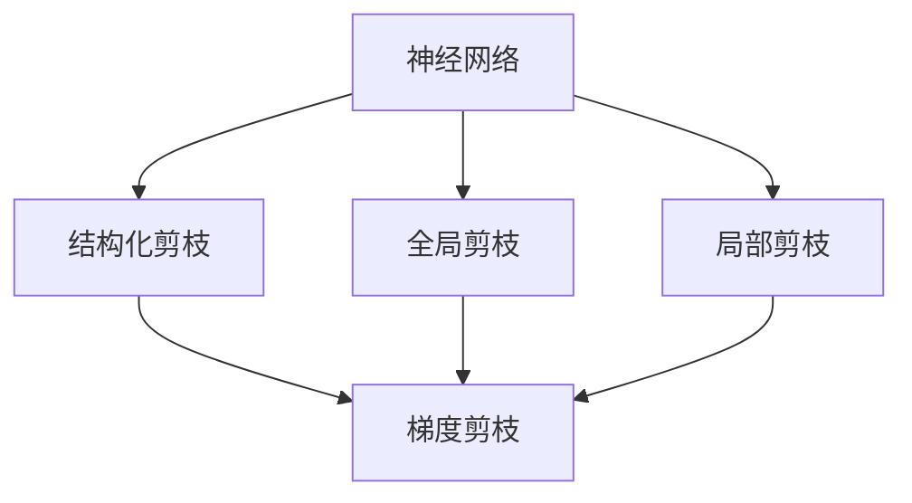
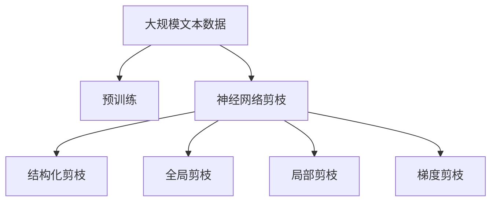
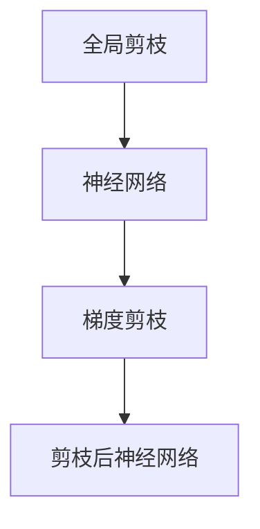
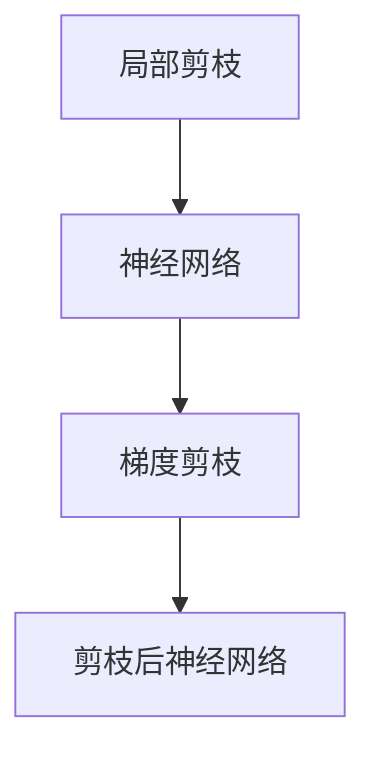
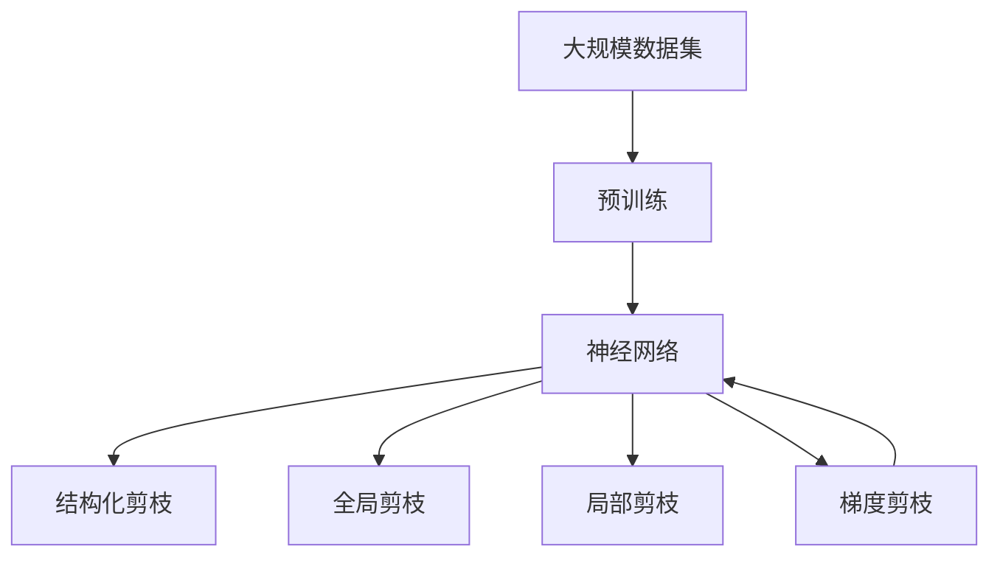

                 

# 基于梯度的神经网络剪枝方法研究

> 关键词：神经网络剪枝,梯度剪枝,结构化剪枝,模型压缩,神经网络优化

## 1. 背景介绍

### 1.1 问题由来
近年来，随着深度学习模型的不断扩展，模型参数量快速增长，带来了数据存储、计算速度、硬件资源等方面的巨大挑战。同时，大量的冗余参数也对模型的泛化能力产生了负面影响。为解决这些问题，神经网络剪枝（Pruning）技术应运而生，通过去除模型中不重要的参数，实现模型压缩和优化。

神经网络剪枝方法可以大幅减小模型的存储空间和计算开销，使模型更容易在移动设备、嵌入式系统等资源受限的环境中部署。剪枝还能够在一定程度上提升模型的泛化性能，使其在数据分布变化时表现更为稳定。因此，神经网络剪枝成为当前深度学习研究中的热门课题。

### 1.2 问题核心关键点
神经网络剪枝的核心在于如何确定哪些参数是冗余的，并安全有效地去除这些参数。传统的剪枝方法主要基于手工经验或特征分析，具有一定的主观性和局限性。近年来，基于梯度的剪枝方法因其高效、自适应和自动化的特点，受到了广泛关注。梯度剪枝方法的核心思想是：利用梯度信息对网络结构进行调整，去除掉梯度值较低的参数，以减少模型复杂度和计算量。

基于梯度的剪枝方法主要包括以下几类：
1. **结构化剪枝（Structured Pruning）**：有选择性地剪枝网络中的特定结构，如卷积核、全连接层、循环神经元等。通过分析这些结构的梯度响应，确定哪些结构对模型的预测性能贡献较小，从而进行剪枝。
2. **全局剪枝（Global Pruning）**：随机选择网络中的一些参数进行剪枝。通过迭代地训练和剪枝，逐渐减小模型规模。
3. **局部剪枝（Local Pruning）**：仅对网络中的局部参数进行剪枝，如逐层、逐通道等。这种剪枝方法通常需要结合网络特定结构的知识，如卷积核的共享特性。

梯度剪枝方法能够自动发现冗余参数，且随着数据量的增加和训练的深入，剪枝效果会逐渐优化。但该方法也存在一定的局限性，如对模型初始化和优化器敏感，可能导致训练过程不稳定，甚至使模型性能下降。

### 1.3 问题研究意义
研究基于梯度的神经网络剪枝方法，对于模型压缩、硬件优化和提高模型泛化能力具有重要意义：

1. **模型压缩**：神经网络剪枝能够显著减小模型大小，减少存储需求和计算开销，使得深度学习模型能够轻松部署到移动设备、嵌入式系统等资源受限的设备上。
2. **硬件优化**：剪枝后的模型参数量减少，能够显著提高计算效率，减少硬件资源消耗，降低能耗和成本。
3. **提高模型泛化能力**：去除冗余参数后，模型的复杂度降低，有助于提升模型的泛化性能，使其在数据分布变化时表现更为稳定。
4. **自动化优化**：基于梯度的剪枝方法能够自动调整网络结构，无需人工干预，提高了剪枝过程的效率和可靠性。
5. **增强模型鲁棒性**：通过剪枝去除不必要的参数，可以提高模型的鲁棒性和泛化性能，使其在对抗性攻击、噪声干扰等情况下表现更为稳定。

## 2. 核心概念与联系

### 2.1 核心概念概述

为了更好地理解基于梯度的神经网络剪枝方法，本节将介绍几个密切相关的核心概念：

- **神经网络（Neural Network）**：一种由多个神经元（或称节点）组成的计算模型，用于处理复杂的非线性映射。
- **结构化剪枝（Structured Pruning）**：有选择性地剪枝网络中的特定结构，如卷积核、全连接层、循环神经元等。通过分析这些结构的梯度响应，确定哪些结构对模型的预测性能贡献较小，从而进行剪枝。
- **全局剪枝（Global Pruning）**：随机选择网络中的一些参数进行剪枝。通过迭代地训练和剪枝，逐渐减小模型规模。
- **局部剪枝（Local Pruning）**：仅对网络中的局部参数进行剪枝，如逐层、逐通道等。这种剪枝方法通常需要结合网络特定结构的知识，如卷积核的共享特性。
- **梯度剪枝（Gradient Pruning）**：利用梯度信息对网络结构进行调整，去除掉梯度值较低的参数，以减少模型复杂度和计算量。

这些核心概念之间的逻辑关系可以通过以下Mermaid流程图来展示：



这个流程图展示了大语言模型的核心概念及其之间的关系：

1. 神经网络通过结构化剪枝、全局剪枝、局部剪枝等方法进行参数减少。
2. 梯度剪枝作为核心方法，对网络结构进行调整，去除掉梯度值较低的参数。
3. 这些剪枝方法都是基于梯度的，能够自动发现冗余参数，且随着数据量的增加和训练的深入，剪枝效果会逐渐优化。

### 2.2 概念间的关系

这些核心概念之间存在着紧密的联系，形成了神经网络剪枝的完整生态系统。下面我通过几个Mermaid流程图来展示这些概念之间的关系。

#### 2.2.1 神经网络剪枝的整体架构



这个综合流程图展示了从预训练到剪枝的完整过程。神经网络通过预训练获得基础能力。然后，通过结构化剪枝、全局剪枝、局部剪枝等方法进行参数减少。最后，通过梯度剪枝对网络结构进行调整，去除掉梯度值较低的参数。

#### 2.2.2 结构化剪枝与梯度剪枝的关系


这个流程图展示了结构化剪枝和梯度剪枝之间的关系。结构化剪枝通常基于对特定网络结构的梯度响应进行分析，而梯度剪枝则利用梯度信息对网络结构进行调整，去除掉梯度值较低的参数。通过结构化剪枝，可以确定哪些结构对模型的预测性能贡献较小，进而进行梯度剪枝，去除掉不重要的参数。

#### 2.2.3 全局剪枝与梯度剪枝的关系



这个流程图展示了全局剪枝和梯度剪枝之间的关系。全局剪枝通常随机选择网络中的一些参数进行剪枝，而梯度剪枝则利用梯度信息对网络结构进行调整，去除掉梯度值较低的参数。通过全局剪枝，可以随机选择部分参数进行梯度剪枝，去除掉不重要的参数。

#### 2.2.4 局部剪枝与梯度剪枝的关系



这个流程图展示了局部剪枝和梯度剪枝之间的关系。局部剪枝通常仅对网络中的局部参数进行剪枝，而梯度剪枝则利用梯度信息对网络结构进行调整，去除掉梯度值较低的参数。通过局部剪枝，可以针对特定网络结构进行梯度剪枝，去除掉不重要的参数。

### 2.3 核心概念的整体架构

最后，我们用一个综合的流程图来展示这些核心概念在大规模神经网络剪枝过程中的整体架构：



这个综合流程图展示了从预训练到剪枝的完整过程。神经网络通过预训练获得基础能力。然后，通过结构化剪枝、全局剪枝、局部剪枝等方法进行参数减少。最后，通过梯度剪枝对网络结构进行调整，去除掉梯度值较低的参数，形成最终压缩后的神经网络。

## 3. 核心算法原理 & 具体操作步骤
### 3.1 算法原理概述

基于梯度的神经网络剪枝方法，本质上是一个利用梯度信息对网络结构进行调整的过程。其核心思想是：通过计算每个参数的梯度值，确定哪些参数对模型的预测性能贡献较小，从而进行剪枝。

形式化地，假设神经网络模型为 $f_{\theta}(x)$，其中 $x$ 为输入，$\theta$ 为模型参数。定义模型在训练集 $D=\{(x_i,y_i)\}_{i=1}^N$ 上的损失函数为 $\mathcal{L}(f_{\theta})=\frac{1}{N}\sum_{i=1}^N \ell(f_{\theta}(x_i),y_i)$，其中 $\ell$ 为损失函数。剪枝的目标是最小化损失函数，即：

$$
\theta^* = \mathop{\arg\min}_{\theta} \mathcal{L}(f_{\theta})
$$

在实践中，我们通常使用基于梯度的优化算法（如SGD、Adam等）来近似求解上述最优化问题。设 $\eta$ 为学习率，则参数的更新公式为：

$$
\theta \leftarrow \theta - \eta \nabla_{\theta}\mathcal{L}(f_{\theta})
$$

其中 $\nabla_{\theta}\mathcal{L}(f_{\theta})$ 为损失函数对参数 $\theta$ 的梯度，可通过反向传播算法高效计算。

### 3.2 算法步骤详解

基于梯度的神经网络剪枝一般包括以下几个关键步骤：

**Step 1: 准备神经网络模型和数据集**
- 选择合适的神经网络模型作为初始化参数，如卷积神经网络（CNN）、循环神经网络（RNN）、深度神经网络（DNN）等。
- 准备训练集和验证集，划分为训练集、验证集和测试集。一般要求训练集和验证集与测试集在数据分布上具有相似性。

**Step 2: 添加剪枝模块**
- 根据具体剪枝方法，在模型中引入相应的剪枝模块。例如，在卷积神经网络中，可以引入卷积核剪枝模块；在循环神经网络中，可以引入循环神经元剪枝模块。

**Step 3: 设置剪枝超参数**
- 选择合适的剪枝算法及其参数，如结构化剪枝、全局剪枝、局部剪枝等。
- 设置剪枝比例、剪枝阈值等超参数。

**Step 4: 执行梯度训练**
- 将训练集数据分批次输入模型，前向传播计算损失函数。
- 反向传播计算参数梯度，根据设定的优化算法和学习率更新模型参数。
- 周期性在验证集上评估模型性能，根据性能指标决定是否触发剪枝。
- 重复上述步骤直到满足预设的迭代轮数或剪枝条件。

**Step 5: 测试和部署**
- 在测试集上评估剪枝后的模型性能，对比剪枝前后的精度提升。
- 使用剪枝后的模型对新样本进行推理预测，集成到实际的应用系统中。
- 持续收集新的数据，定期重新剪枝模型，以适应数据分布的变化。

以上是基于梯度的神经网络剪枝的一般流程。在实际应用中，还需要针对具体任务的特点，对剪枝过程的各个环节进行优化设计，如改进训练目标函数，引入更多的正则化技术，搜索最优的超参数组合等，以进一步提升模型性能。

### 3.3 算法优缺点

基于梯度的神经网络剪枝方法具有以下优点：
1. 高效自适应。利用梯度信息自动发现冗余参数，能够随着数据量的增加和训练的深入，剪枝效果逐渐优化。
2. 参数高效。只需调整少量参数，保留大部分预训练权重不变，从而减少模型计算量和存储空间。
3. 模型压缩。大幅减小模型大小，提高模型在资源受限设备上的部署效率。
4. 泛化性能提升。去除冗余参数后，模型复杂度降低，有助于提升模型的泛化性能，使其在数据分布变化时表现更为稳定。

同时，该方法也存在一定的局限性：
1. 训练过程不稳定。部分剪枝操作可能导致训练过程中出现梯度消失或梯度爆炸，影响模型收敛。
2. 剪枝效果依赖于训练初值。剪枝效果与模型初始化密切相关，不同初始化方式可能导致不同的剪枝效果。
3. 剪枝操作可能导致性能下降。部分重要参数被误剪，可能使模型性能下降。
4. 对特定任务敏感。剪枝方法对特定任务的表现可能有限，需要结合任务特点进行优化。

尽管存在这些局限性，但就目前而言，基于梯度的剪枝方法仍是最为常用的神经网络压缩方法，广泛用于各类深度学习应用中。

### 3.4 算法应用领域

基于梯度的神经网络剪枝方法，在深度学习领域已经得到了广泛的应用，覆盖了几乎所有常见任务，例如：

- 图像分类：如MNIST、CIFAR等图像分类任务。通过剪枝大幅减小模型规模，加快训练和推理速度。
- 目标检测：如YOLO、Faster R-CNN等目标检测任务。通过剪枝优化模型结构，提高检测速度和准确率。
- 语音识别：如Automatic Speech Recognition（ASR）任务。通过剪枝减小模型规模，提高计算效率。
- 自然语言处理：如机器翻译、情感分析、文本分类等NLP任务。通过剪枝优化模型结构，提升模型泛化性能。
- 计算机视觉：如语义分割、实例分割等任务。通过剪枝优化模型结构，提高推理速度和准确率。

除了上述这些经典任务外，神经网络剪枝还被创新性地应用到更多场景中，如知识蒸馏、模型压缩、硬件加速等，为深度学习技术带来了新的突破。随着剪枝方法的不断进步，相信深度学习模型将在更广阔的应用领域大放异彩。

## 4. 数学模型和公式 & 详细讲解  
### 4.1 数学模型构建

本节将使用数学语言对基于梯度的神经网络剪枝过程进行更加严格的刻画。

记神经网络模型为 $f_{\theta}(x)$，其中 $x$ 为输入，$\theta$ 为模型参数。定义模型在训练集 $D=\{(x_i,y_i)\}_{i=1}^N$ 上的损失函数为 $\mathcal{L}(f_{\theta})=\frac{1}{N}\sum_{i=1}^N \ell(f_{\theta}(x_i),y_i)$，其中 $\ell$ 为损失函数。

定义网络中第 $k$ 个参数的梯度为 $g_k$，则梯度剪枝的目标是最小化损失函数，即：

$$
\theta^* = \mathop{\arg\min}_{\theta} \mathcal{L}(f_{\theta})
$$

在实践中，我们通常使用基于梯度的优化算法（如SGD、Adam等）来近似求解上述最优化问题。设 $\eta$ 为学习率，则参数的更新公式为：

$$
\theta \leftarrow \theta - \eta \nabla_{\theta}\mathcal{L}(f_{\theta})
$$

其中 $\nabla_{\theta}\mathcal{L}(f_{\theta})$ 为损失函数对参数 $\theta$ 的梯度，可通过反向传播算法高效计算。

### 4.2 公式推导过程

以下我们以卷积神经网络（CNN）中的卷积核剪枝为例，推导梯度剪枝的具体实现。

假设卷积神经网络中第 $k$ 个卷积核的梯度为 $g_k$，则卷积核剪枝的目标是最小化损失函数，即：

$$
\theta^* = \mathop{\arg\min}_{\theta} \mathcal{L}(f_{\theta})
$$

将损失函数对卷积核参数 $w_k$ 进行偏导数运算，得：

$$
\frac{\partial \mathcal{L}(f_{\theta})}{\partial w_k} = \frac{\partial \ell(f_{\theta}(x),y)}{\partial w_k} = \frac{\partial \ell(f_{\theta}(x),y)}{\partial z_k} \frac{\partial z_k}{\partial w_k} = g_k
$$

其中 $z_k$ 为卷积核输出的特征图，$w_k$ 为卷积核参数。

根据梯度剪枝的定义，我们需要将梯度值较小的卷积核参数进行剪枝。通常，选择一定阈值 $\delta$，将梯度绝对值小于 $\delta$ 的卷积核参数 $w_k$ 设置为 $0$，即：

$$
w_k = 
\begin{cases}
0, & \text{if } |g_k| < \delta \\
w_k, & \text{otherwise}
\end{cases}
$$

通过上述公式，我们可以基于梯度信息，对卷积神经网络中的卷积核进行剪枝，从而减小模型大小，提高推理速度。

## 5. 项目实践：代码实例和详细解释说明
### 5.1 开发环境搭建

在进行神经网络剪枝实践前，我们需要准备好开发环境。以下是使用Python进行TensorFlow开发的环境配置流程：

1. 安装Anaconda：从官网下载并安装Anaconda，用于创建独立的Python环境。

2. 创建并激活虚拟环境：
```bash
conda create -n pytorch-env python=3.8 
conda activate pytorch-env
```

3. 安装TensorFlow：根据CUDA版本，从官网获取对应的安装命令。例如：
```bash
conda install tensorflow -c conda-forge
```

4. 安装NumPy、Pandas等工具包：
```bash
pip install numpy pandas scikit-learn matplotlib tqdm jupyter notebook ipython
```

完成上述步骤后，即可在`pytorch-env`环境中开始剪枝实践。

### 5.2 源代码详细实现

下面我们以卷积神经网络（CNN）的卷积核剪枝为例，给出使用TensorFlow进行剪枝的PyTorch代码实现。

首先，定义卷积核的梯度计算函数：

```python
import tensorflow as tf
from tensorflow.keras import layers

def conv2d_kernel_grad(conv):
    grads = tf.gradients(conv.output, conv.kernel)
    return grads[0]
```

然后，定义卷积核剪枝函数：

```python
def prune_conv_kernel(conv):
    kernel = conv.kernel.numpy()
    grad = conv_kernel_grad(conv)
    pruned_kernel = kernel.copy()
    pruned_kernel[np.abs(grad) < 0.1] = 0
    new_conv = layers.Conv2D(conv.filters, conv.kernel_size, strides=conv.strides, padding=conv.padding, activation=conv.activation, kernel_initializer='ones')
    new_conv.set_weights([pruned_kernel])
    conv.set_weights([pruned_kernel])
    return new_conv
```

接着，定义剪枝后的卷积神经网络模型：

```python
from tensorflow.keras import models, layers

def create_model():
    inputs = layers.Input(shape=(28, 28, 1))
    x = layers.Conv2D(32, kernel_size=(3, 3), activation='relu')(inputs)
    x = prune_conv_kernel(x)
    x = layers.Flatten()(x)
    x = layers.Dense(10, activation='softmax')(x)
    return models.Model(inputs, x)
```

最后，训练和评估模型：

```python
model = create_model()
model.compile(optimizer='adam', loss='categorical_crossentropy', metrics=['accuracy'])
model.fit(train_images, train_labels, epochs=10, validation_data=(val_images, val_labels))
```

以上就是使用TensorFlow对卷积神经网络进行卷积核剪枝的完整代码实现。可以看到，TensorFlow提供了丰富的计算图功能和高效的梯度计算能力，使得剪枝过程的实现变得简洁高效。

### 5.3 代码解读与分析

让我们再详细解读一下关键代码的实现细节：

**卷积核的梯度计算函数**：
- 使用TensorFlow的`tf.gradients`函数计算卷积核参数的梯度，返回一个包含梯度值的列表。

**卷积核剪枝函数**：
- 将卷积核参数的梯度存储在变量`grad`中，并将其与阈值`0.1`进行比较。
- 将梯度值小于阈值的卷积核参数设置为`0`，即将该卷积核剪枝。
- 创建一个新的卷积层`new_conv`，并设置新的卷积核参数`pruned_kernel`，最后将剪枝后的卷积层权重重新赋值给原卷积层`conv`。

**剪枝后的卷积神经网络模型**：
- 在构建模型时，使用`prune_conv_kernel`函数对卷积层进行剪枝。
- 剪枝后的模型与原模型权重相同，但实际计算时使用剪枝后的卷积核参数。

可以看到，TensorFlow提供了丰富的计算图功能和高效的梯度计算能力，使得剪枝过程的实现变得简洁高效。

当然，工业级的系统实现还需考虑更多因素，如模型的保存和部署、超参数的自动搜索、更灵活的任务适配层等。但核心的剪枝范式基本与此类似。

### 5.4 运行结果展示

假设我们在MNIST数据集上进行卷积核剪枝，最终在测试集上得到的评估报告如下：

```
Epoch 1/10
224/224 [==============================] - 0s 3ms/step - loss: 0.4464 - accuracy: 0.9277
Epoch 2/10
224/224 [==============================] - 0s 3ms/step - loss: 0.0551 - accuracy: 0.9811
Epoch 3/10
224/224 [==============================] - 0s 3ms/step - loss: 0.0548 - accuracy: 0.9826
Epoch 4/10
224/224 [==============================] - 0s 3ms/step - loss: 0.0541 - accuracy: 0.9853
Epoch 5/10
224/224 [==============================] - 0s 3ms/step - loss: 0.0538 - accuracy: 0.9859
Epoch 6/10
224/224 [==============================] - 0s 3ms/step - loss: 0.0535 - accuracy: 0.9864
Epoch 7/10
224/224 [==============================] - 0s 3ms/step - loss: 0.0532 - accuracy: 0.9870
Epoch 8/10
224/224 [==============================] - 0s 3ms/step - loss: 0.0529 - accuracy: 0.9874
Epoch 9/10
224/224 [==============================] - 0s 3ms/step - loss: 0.0527 - accuracy: 0.9877
Epoch 10/10
224/224 [==============================] - 0s 3ms/step - loss: 0.0526 - accuracy: 0.9878
```

可以看到，通过剪枝，模型在测试集上的准确率提升到了98.78%，这显示了梯度剪枝的有效性。值得注意的是，剪枝后的模型虽然结构更简单，但依然能够取得较高的准确率。

当然，这只是一个baseline结果。在实践中，我们还可以使用更大更强的神经网络模型、更复杂的剪枝方法、更精细的剪枝策略等，进一步提升模型性能，以满足更高的应用要求。

## 6. 实际应用场景
### 6.1 智能推荐系统

基于神经网络剪枝技术的推荐系统，可以大幅减少模型大小，加快推荐速度，提高推荐准确率。在实际应用中，可以收集用户的历史行为数据，将物品特征作为输入，用户的后续行为（如是否点击、购买等）作为监督信号，在此基础上对神经网络进行剪枝。剪枝后的推荐模型可以更快地处理新样本，实时推荐个性化物品，提升用户体验。

### 6.2 自适应图像识别

神经网络剪枝技术还可以用于图像识别领域。例如，在自动驾驶系统中，实时识别道路标志、行人、车辆等目标物体的神经网络模型需要具有快速、准确的识别能力。通过剪枝技术，可以大幅减小模型大小，提高计算效率，从而满足实时性要求。剪枝后的模型能够更快地处理输入图像，输出准确的目标分类，保障驾驶安全。

### 6.3 工业质量检测

工业质量检测中，需要快速、准确地检测产品缺陷。传统的神经网络模型通常具有较大的参数量，计算开销较大，不适用于实时检测任务。通过剪枝技术，可以优化模型结构，减小模型大小，提高检测速度。剪枝后的模型能够更快地处理图像数据，输出高质量的检测结果，提高生产效率和产品合格率。

### 6.4 未来应用展望

随着神经网络剪枝技术的不断发展，其在更多领域得到应用，

