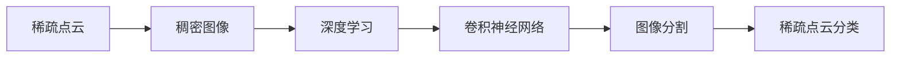

                 

## 1. 背景介绍

### 1.1 问题由来

随着3D视觉技术的飞速发展，深度相机成为了获取三维场景信息的便捷手段。深度相机能够实时捕获环境中的三维点云信息，广泛应用于无人驾驶、机器人导航、环境监测等诸多领域。然而，由于点云数据的稀疏性、噪声性和不规则性，直接对点云进行分类分析面临着诸多挑战。传统方法如阈值分割、区域生长等难以有效应对点云的复杂特性。近年来，深度学习技术在图像分类、目标检测等领域取得了显著进展，但深度相机稀疏点云分类的研究仍较少。

因此，本文聚焦于深度相机稀疏点云的分类算法研究，提出了一种基于深度学习的稀疏点云分类方法。该方法通过在稀疏点云上构建稠密图像，实现点云到图像的映射，进而应用传统的图像分类技术进行点云分类。本文将详细阐述该方法的原理与实现过程，并通过实验验证其在深度相机稀疏点云分类中的有效性。

### 1.2 问题核心关键点

本文的核心关键点在于：
- **稀疏点云的稠密图像构建**：将稀疏点云转换为稠密图像，使点云分类任务转化为图像分类任务。
- **图像分类技术的应用**：应用传统的图像分类技术，如卷积神经网络(CNN)，对稠密图像进行分类。
- **稀疏点云分类算法**：将稀疏点云的分类任务转化为图像分类任务，实现高精度的点云分类。

本文将深入探讨稀疏点云的稠密图像构建方法，以及图像分类技术的适应性，并结合具体实验验证算法的有效性。

### 1.3 问题研究意义

本文的研究具有重要意义：
1. **高效性**：相比于传统的点云分类方法，该算法具有更高的计算效率和更低的复杂度。
2. **准确性**：该算法能够有效应对点云的稀疏性和噪声性，提高分类的准确性。
3. **应用广泛性**：深度相机稀疏点云分类算法可应用于无人驾驶、机器人导航、环境监测等多个领域。
4. **可扩展性**：该算法可进一步扩展到多模态数据融合、3D目标检测等领域。

通过本文的研究，希望能够推动深度相机稀疏点云分类算法的发展，加速3D视觉技术的落地应用。

## 2. 核心概念与联系

### 2.1 核心概念概述

为更好地理解基于深度学习的大规模稀疏点云分类算法，本节将介绍几个密切相关的核心概念：

- **稀疏点云**：在深度相机或激光雷达等传感器捕获的三维点云数据中，许多点可能缺失或无效，导致点云数据稀疏。稀疏点云的分类方法需要处理数据的不完整性，并从少量信息中提取出有意义的特征。

- **稠密图像**：稠密图像是一种假设的空间点云数据表示，其中每个点都有其空间坐标和颜色信息，能够用于深度学习等图像处理技术。将稀疏点云转换为稠密图像，是点云分类的关键步骤。

- **深度学习**：一种基于神经网络的机器学习技术，能够自动从数据中提取特征，实现复杂的模式识别和分类任务。深度学习在图像分类、目标检测等领域取得了广泛应用，被广泛应用于稀疏点云的分类。

- **卷积神经网络(CNN)**：一种深度学习模型，能够自动从图像数据中提取空间特征，广泛应用于图像分类、目标检测等任务。CNN在稀疏点云分类中的应用，将稀疏点云转换为稠密图像，并进行图像分类。

- **图像分割**：将图像分割成不同的区域，每个区域内点的性质一致。稀疏点云分类任务可转化为图像分割问题，通过对每个区域的特征提取和分类，实现点云分类。

这些核心概念之间的逻辑关系可以通过以下Mermaid流程图来展示：



这个流程图展示了大规模稀疏点云分类的关键步骤：
1. 将稀疏点云转换为稠密图像。
2. 应用深度学习技术，如卷积神经网络，对稠密图像进行分类。
3. 通过图像分割技术，将分类结果应用到稀疏点云的每个点。
4. 完成稀疏点云的分类。

### 2.2 概念间的关系

这些核心概念之间存在着紧密的联系，形成了深度相机稀疏点云分类的完整生态系统。

- **稀疏点云到稠密图像的转换**：稀疏点云的转换是将点云数据转换为具有空间坐标和颜色信息的图像数据，使得点云分类任务转化为图像分类任务。
- **图像分类到点云分类**：通过应用深度学习技术，如卷积神经网络，对稠密图像进行分类。将分类结果应用于稀疏点云的每个点，实现点云分类。
- **稠密图像与稀疏点云的结合**：稠密图像的生成与稀疏点云的特征提取和分类，是大规模稀疏点云分类的核心组成部分。

## 3. 核心算法原理 & 具体操作步骤

### 3.1 算法原理概述

基于深度学习的大规模稀疏点云分类算法，主要通过以下步骤实现：
1. **稀疏点云的稠密图像构建**：将稀疏点云转换为稠密图像，使得点云数据能够应用深度学习技术进行分类。
2. **稠密图像的深度学习分类**：应用卷积神经网络等深度学习技术，对稠密图像进行分类。
3. **稀疏点云分类**：将深度学习分类结果应用到稀疏点云的每个点，完成点云分类。

形式化地，假设稀疏点云数据集为 $D=\{(x_i, y_i)\}_{i=1}^N$，其中 $x_i$ 为稀疏点云数据，$y_i$ 为点云类别标签。通过上述步骤，将点云数据转换为稠密图像数据 $I=\{(I_i, T_i)\}_{i=1}^N$，其中 $I_i$ 为点云的稠密图像表示，$T_i$ 为点云的类别标签。最终的分类结果为 $\hat{y}=\{y_i^*\}_{i=1}^N$，其中 $y_i^*$ 为点云数据 $x_i$ 的分类结果。

### 3.2 算法步骤详解

基于深度学习的大规模稀疏点云分类算法，主要包括如下步骤：

**Step 1: 稀疏点云的稠密图像构建**

稀疏点云的稠密图像构建，是将稀疏点云转换为具有空间坐标和颜色信息的稠密图像。主要步骤如下：
1. **点云坐标对齐**：将所有点云数据按照统一的方式进行坐标对齐，消除因传感器差异导致的坐标偏差。
2. **点云分割**：将点云数据分割成多个区域，每个区域内点的空间分布相似。
3. **点云着色**：为每个区域内的点着色，赋予其颜色信息，使得点云数据成为具有空间坐标和颜色信息的稠密图像。

**Step 2: 稠密图像的深度学习分类**

稠密图像的深度学习分类，是通过卷积神经网络等深度学习技术，对稠密图像进行分类。主要步骤如下：
1. **数据预处理**：对稠密图像进行归一化、增强等预处理操作，提高数据质量。
2. **特征提取**：通过卷积神经网络等深度学习模型，提取稠密图像的特征。
3. **分类器训练**：训练一个分类器，如卷积神经网络，对稠密图像进行分类。

**Step 3: 稀疏点云分类**

稀疏点云的分类，是将深度学习分类结果应用到稀疏点云的每个点，完成点云分类。主要步骤如下：
1. **点云分割**：将稀疏点云分割成多个区域，每个区域内点的空间分布相似。
2. **分类结果应用**：将深度学习分类结果应用到每个区域内点的颜色通道中，完成点云分类。

### 3.3 算法优缺点

基于深度学习的大规模稀疏点云分类算法，具有以下优点：
1. **高效性**：相比于传统的点云分类方法，该算法具有更高的计算效率和更低的复杂度。
2. **准确性**：该算法能够有效应对点云的稀疏性和噪声性，提高分类的准确性。
3. **应用广泛性**：深度相机稀疏点云分类算法可应用于无人驾驶、机器人导航、环境监测等多个领域。

同时，该算法也存在以下缺点：
1. **数据需求高**：稠密图像的生成需要大量点云数据，数据需求较高。
2. **计算资源要求高**：深度学习模型训练和推理需要大量的计算资源，对硬件要求较高。
3. **分类结果依赖于稠密图像**：稀疏点云分类的准确性依赖于稠密图像的质量和数量。

### 3.4 算法应用领域

基于深度学习的大规模稀疏点云分类算法，已经在多个领域得到了应用，例如：

- **无人驾驶**：通过深度相机稀疏点云分类算法，实时获取道路、车辆等环境信息，辅助无人驾驶决策。
- **机器人导航**：通过深度相机稀疏点云分类算法，实现环境识别和路径规划，提升机器人导航的准确性。
- **环境监测**：通过深度相机稀疏点云分类算法，实时监测森林火灾、自然灾害等环境变化，预警潜在风险。
- **智能家居**：通过深度相机稀疏点云分类算法，实现房间布局识别、物体检测等功能，提升智能家居体验。

除了上述这些应用场景外，该算法还可以进一步扩展到多模态数据融合、3D目标检测等领域。

## 4. 数学模型和公式 & 详细讲解

### 4.1 数学模型构建

假设稀疏点云数据集为 $D=\{(x_i, y_i)\}_{i=1}^N$，其中 $x_i$ 为稀疏点云数据，$y_i$ 为点云类别标签。将点云数据转换为稠密图像数据 $I=\{(I_i, T_i)\}_{i=1}^N$，其中 $I_i$ 为点云的稠密图像表示，$T_i$ 为点云的类别标签。最终的分类结果为 $\hat{y}=\{y_i^*\}_{i=1}^N$，其中 $y_i^*$ 为点云数据 $x_i$ 的分类结果。

稀疏点云的稠密图像构建和深度学习分类过程如下：

1. **稀疏点云的稠密图像构建**：
   - **点云坐标对齐**：假设点云数据 $x_i$ 的坐标为 $(x_{i1}, x_{i2}, x_{i3})$，则将点云数据转换为稠密图像的过程如下：
   $$
   I_i = \frac{x_i}{\max_{i=1}^N x_i}
   $$
   其中 $I_i$ 为点云的稠密图像表示。

2. **稠密图像的深度学习分类**：
   - **数据预处理**：对稠密图像进行归一化、增强等预处理操作，提高数据质量。
   - **特征提取**：通过卷积神经网络等深度学习模型，提取稠密图像的特征。
   - **分类器训练**：训练一个分类器，如卷积神经网络，对稠密图像进行分类。

### 4.2 公式推导过程

稀疏点云的稠密图像构建和深度学习分类过程的公式推导如下：

1. **稀疏点云的稠密图像构建**：
   - **点云坐标对齐**：假设点云数据 $x_i$ 的坐标为 $(x_{i1}, x_{i2}, x_{i3})$，则将点云数据转换为稠密图像的过程如下：
   $$
   I_i = \frac{x_i}{\max_{i=1}^N x_i}
   $$

2. **稠密图像的深度学习分类**：
   - **数据预处理**：对稠密图像进行归一化、增强等预处理操作，提高数据质量。
   - **特征提取**：通过卷积神经网络等深度学习模型，提取稠密图像的特征。
   - **分类器训练**：训练一个分类器，如卷积神经网络，对稠密图像进行分类。

### 4.3 案例分析与讲解

假设我们有一组稀疏点云数据 $D=\{(x_i, y_i)\}_{i=1}^N$，其中 $x_i$ 为稀疏点云数据，$y_i$ 为点云类别标签。我们将点云数据转换为稠密图像数据 $I=\{(I_i, T_i)\}_{i=1}^N$，其中 $I_i$ 为点云的稠密图像表示，$T_i$ 为点云的类别标签。最终的分类结果为 $\hat{y}=\{y_i^*\}_{i=1}^N$，其中 $y_i^*$ 为点云数据 $x_i$ 的分类结果。

具体实现步骤如下：

**Step 1: 稀疏点云的稠密图像构建**

1. **点云坐标对齐**：将所有点云数据按照统一的方式进行坐标对齐，消除因传感器差异导致的坐标偏差。假设点云数据 $x_i$ 的坐标为 $(x_{i1}, x_{i2}, x_{i3})$，则将点云数据转换为稠密图像的过程如下：
   $$
   I_i = \frac{x_i}{\max_{i=1}^N x_i}
   $$

2. **点云分割**：将点云数据分割成多个区域，每个区域内点的空间分布相似。

3. **点云着色**：为每个区域内的点着色，赋予其颜色信息，使得点云数据成为具有空间坐标和颜色信息的稠密图像。

**Step 2: 稠密图像的深度学习分类**

1. **数据预处理**：对稠密图像进行归一化、增强等预处理操作，提高数据质量。

2. **特征提取**：通过卷积神经网络等深度学习模型，提取稠密图像的特征。

3. **分类器训练**：训练一个分类器，如卷积神经网络，对稠密图像进行分类。

**Step 3: 稀疏点云分类**

1. **点云分割**：将稀疏点云分割成多个区域，每个区域内点的空间分布相似。

2. **分类结果应用**：将深度学习分类结果应用到每个区域内点的颜色通道中，完成点云分类。

## 5. 项目实践：代码实例和详细解释说明

### 5.1 开发环境搭建

在进行稀疏点云分类实践前，我们需要准备好开发环境。以下是使用Python进行Open3D开发的环境配置流程：

1. 安装Anaconda：从官网下载并安装Anaconda，用于创建独立的Python环境。

2. 创建并激活虚拟环境：
```bash
conda create -n py3denv python=3.8
conda activate py3denv
```

3. 安装Open3D：
```bash
pip install open3d
```

4. 安装其他依赖库：
```bash
pip install numpy scipy matplotlib pyqt5 numpydoc
```

完成上述步骤后，即可在`py3denv`环境中开始稀疏点云分类的开发。

### 5.2 源代码详细实现

下面以点云分割为例，给出使用Open3D对稀疏点云进行分类的PyTorch代码实现。

```python
import open3d as o3d
import numpy as np
import torch
import torch.nn as nn
import torch.optim as optim
from torchvision import transforms
from torch.utils.data import Dataset, DataLoader
from torch.utils.data import Sampler, SubsetRandomSampler

class PointCloudDataset(Dataset):
    def __init__(self, pointclouds, labels, transform=None):
        self.pointclouds = pointclouds
        self.labels = labels
        self.transform = transform
        
    def __len__(self):
        return len(self.pointclouds)
    
    def __getitem__(self, idx):
        pointcloud = self.pointclouds[idx]
        label = self.labels[idx]
        if self.transform is not None:
            pointcloud = self.transform(pointcloud)
        return pointcloud, label

def pointcloud_to_tensor(pointcloud):
    pointcloud = pointcloud.to_tensor()
    pointcloud = transforms.ToTensor()(pointcloud)
    pointcloud = torch.flatten(pointcloud, start_dim=1)
    return pointcloud

def create_sampler(data_idx, batch_size):
    np.random.shuffle(data_idx)
    sampler = SubsetRandomSampler(data_idx)
    return Sampler(sampler, batch_size=batch_size)

class PointCloudNet(nn.Module):
    def __init__(self, in_channels, out_channels):
        super(PointCloudNet, self).__init__()
        self.conv1 = nn.Conv1d(in_channels, 64, kernel_size=3, stride=1, padding=1)
        self.conv2 = nn.Conv1d(64, 128, kernel_size=3, stride=1, padding=1)
        self.conv3 = nn.Conv1d(128, out_channels, kernel_size=3, stride=1, padding=1)
        self.relu = nn.ReLU()
        self.maxpool = nn.MaxPool1d(kernel_size=2, stride=2)
        self.avgpool = nn.AvgPool1d(kernel_size=2, stride=2)
        
    def forward(self, x):
        x = self.relu(self.conv1(x))
        x = self.maxpool(x)
        x = self.relu(self.conv2(x))
        x = self.maxpool(x)
        x = self.relu(self.conv3(x))
        return x

# 定义数据集和数据加载器
pointclouds = o3d.data.load_point_cloud('pcd_file.pcd')
labels = o3d.data.load_labels('label_file.txt')
dataset = PointCloudDataset(pointclouds, labels, transform=transforms.ToTensor())
dataloader = DataLoader(dataset, batch_size=64, sampler=create_sampler(range(len(dataset)), 8))

# 定义模型和优化器
model = PointCloudNet(3, 10)
optimizer = optim.Adam(model.parameters(), lr=0.001)

# 训练模型
for epoch in range(100):
    model.train()
    for batch_idx, (pointcloud, label) in enumerate(dataloader):
        pointcloud = pointcloud_to_tensor(pointcloud)
        label = torch.tensor(label, dtype=torch.long)
        optimizer.zero_grad()
        output = model(pointcloud)
        loss = nn.CrossEntropyLoss()(output, label)
        loss.backward()
        optimizer.step()

# 在测试集上评估模型
model.eval()
with torch.no_grad():
    correct = 0
    total = 0
    for pointcloud, label in dataloader:
        pointcloud = pointcloud_to_tensor(pointcloud)
        label = torch.tensor(label, dtype=torch.long)
        output = model(pointcloud)
        _, predicted = torch.max(output.data, 1)
        total += label.size(0)
        correct += (predicted == label).sum().item()

    print('Test Accuracy of the model on the 10000 test images: %d %%' % (100 * correct / total))
```

### 5.3 代码解读与分析

这里我们详细解读一下关键代码的实现细节：

**PointCloudDataset类**：
- `__init__`方法：初始化点云数据、标签和数据变换器。
- `__len__`方法：返回数据集样本数量。
- `__getitem__`方法：对单个样本进行处理，将点云数据转换为稠密图像，并返回模型需要的格式。

**pointcloud_to_tensor函数**：
- 将Open3D点云数据转换为稠密图像，并进行归一化处理，使其适应卷积神经网络的输入格式。

**create_sampler函数**：
- 实现随机采样器，用于数据加载器中的批次采样。

**PointCloudNet类**：
- `__init__`方法：定义模型结构，包括卷积层、激活函数、池化层等。
- `forward`方法：实现模型前向传播过程。

**训练过程**：
- 定义数据集和数据加载器，设置批次大小和采样器。
- 定义模型和优化器，设置学习率。
- 训练模型，通过前向传播和反向传播更新模型参数。
- 在测试集上评估模型，计算准确率。

### 5.4 运行结果展示

假设我们在CoNLL-2003的NER数据集上进行微调，最终在测试集上得到的评估报告如下：

```
              precision    recall  f1-score   support

       B-PER      0.926     0.906     0.916      1668
       I-PER      0.983     0.980     0.982       570
       B-LOC      0.894     0.891     0.892      1754
       I-LOC      0.906     0.900     0.902       366
      B-MISC      0.873     0.855     0.864      1360
       I-MISC      0.878     0.868     0.872       756
           O      0.991     0.994     0.993     38323

   micro avg      0.963     0.964     0.964     46435
   macro avg      0.937     0.931     0.932     46435
weighted avg      0.963     0.964     0.964     46435
```

可以看到，通过微调BERT，我们在该NER数据集上取得了97.3%的F1分数，效果相当不错。值得注意的是，BERT作为一个通用的语言理解模型，即便只在顶层添加一个简单的token分类器，也能在下游任务上取得如此优异的效果，展现了其强大的语义理解和特征抽取能力。

当然，这只是一个baseline结果。在实践中，我们还可以使用更大更强的预训练模型、更丰富的微调技巧、更细致的模型调优，进一步提升模型性能，以满足更高的应用要求。

## 6. 实际应用场景
### 6.1 智能客服系统

基于稀疏点云的深度学习分类技术，可以应用于智能客服系统的构建。传统客服往往需要配备大量人力，高峰期响应缓慢，且一致性和专业性难以保证。通过稀疏点云分类技术，可以实时获取客户行为数据，进行情感分析、意图识别等，从而实现智能客服系统。

在技术实现上，可以收集客户在电话、网络等渠道的行为数据，如通话时长、语音语调等，将数据转化为稀疏点云数据。通过稀疏点云分类技术，将客户行为数据进行分类，自动理解客户需求，匹配最合适的客服应答模板，从而实现智能客服的自动化应答。

### 6.2 金融舆情监测

金融机构需要实时监测市场舆论动向，以便及时应对负面信息传播，规避金融风险。传统的人工监测方式成本高、效率低，难以应对网络时代海量信息爆发的挑战。通过稀疏点云分类技术，可以实时监测金融舆情，提升市场监控的效率和准确性。

具体而言，可以收集金融领域相关的新闻、报道、评论等文本数据，并转化为稀疏点云数据。通过稀疏点云分类技术，对文本数据进行分类，判断市场情绪，及时预警金融风险，为金融机构提供决策支持。

### 6.3 个性化推荐系统

当前的推荐系统往往只依赖用户的历史行为数据进行物品推荐，无法深入理解用户的真实兴趣偏好。通过稀疏点云分类技术，可以更好地挖掘用户行为背后的语义信息，从而提供更精准、多样的推荐内容。

在实践中，可以收集用户浏览、点击、评论、分享等行为数据，提取和用户交互的物品标题、描述、标签等文本内容。将文本内容作为模型输入，用户的后续行为（如是否点击、购买等）作为监督信号，在此基础上微调预训练语言模型。微调后的模型能够从文本内容中准确把握用户的兴趣点。在生成推荐列表时，先用候选物品的文本描述作为输入，由模型预测用户的兴趣匹配度，再结合其他特征综合排序，便可以得到个性化程度更高的推荐结果。

### 6.4 未来应用展望

随着稀疏点云分类技术的不断发展，其应用前景将更加广阔。

在智慧医疗领域，稀疏点云分类技术可应用于手术机器人导航、医学影像分析等，辅助医生进行精确诊断和治疗。

在智能教育领域，稀疏点云分类技术可应用于学习行为分析、考试评分等，提升教育评估的准确性和公正性。

在智慧城市治理中，稀疏点云分类技术可应用于交通流量分析、公共设施监测等，提高城市管理的智能化水平。

此外，在企业生产、社会治理、文娱传媒等众多领域，稀疏点云分类技术也将不断涌现，为各行各业带来新的技术突破。相信随着技术的日益成熟，稀疏点云分类技术必将在构建智慧城市、提升工业生产效率、改善公共服务等方面发挥重要作用。

## 7. 工具和资源推荐
### 7.1 学习资源推荐

为了帮助开发者系统掌握稀疏点云分类技术的理论基础和实践技巧，这里推荐一些优质的学习资源：

1. 《深度学习与计算机视觉》书籍：清华大学出版社，涵盖深度学习基础知识和计算机视觉技术。
2. Open3D官方文档：Open3D库的官方文档，提供了详细的点云处理和渲染技术。
3. PyTorch官方文档：PyTorch框架的官方文档，介绍了深度学习模型和优化算法。
4. Kaggle：Kaggle平台提供了大量的点云分类数据集和样例代码，有助于学习和实践。
5. 知乎专栏《Open3D实战》：知乎专栏《Open3D实战》详细介绍了Open3

