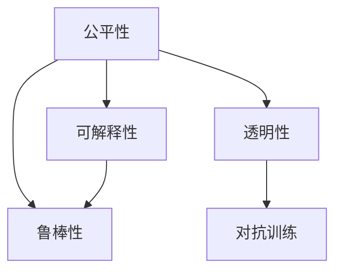

                 

# 基础模型的公平与伦理问题

## 1. 背景介绍

### 1.1 问题由来
随着深度学习和大数据技术的快速发展，人工智能(AI)系统已经广泛应用于金融、医疗、教育、司法等众多领域。然而，越来越多的研究指出，这些系统存在一些严重的公平与伦理问题。例如，在贷款审批、就业推荐、医疗诊断等场景中，AI系统往往因为输入数据的不平衡，导致输出偏见，产生歧视性决策，进而影响社会公平。

这些问题不仅损害了用户的利益，也引发了公众对AI系统的信任危机。例如，亚马逊曾因偏见导致求职者评价系统拒绝女性候选人，而谷歌的招聘系统也因性别偏见而陷入争议。此外，AI系统的误判、假阳性、数据隐私等问题也引发了大量公众讨论。

### 1.2 问题核心关键点
这些问题涉及AI系统的公平性、可解释性、透明性、鲁棒性等方面。为了应对这些问题，学术界和工业界已经提出了一些方法和技术，如公平算法、可解释性模型、对抗训练等。

1. **公平性**：保证AI系统在处理不同群体数据时，能够公平地对待每个人，避免因数据偏差产生的歧视。
2. **可解释性**：使AI系统的决策过程透明可解释，方便用户理解和信任。
3. **鲁棒性**：使AI系统能够在面对不同类型攻击和干扰时，保持稳定的性能和输出。
4. **透明性**：保证AI系统的数据来源、算法逻辑、模型训练过程等信息公开透明。

这些问题不仅涉及技术层面，还涉及伦理、法律、社会等多方面因素，需要综合考虑。本文将重点探讨如何通过技术手段解决这些公平与伦理问题，以期推动AI技术的健康发展。

## 2. 核心概念与联系

### 2.1 核心概念概述

为了更好地理解这些问题，本节将介绍几个密切相关的核心概念：

- **公平性(Fairness)**：指在训练和部署AI模型时，确保不同群体间不受偏见影响，获得公平待遇。
- **可解释性(Explainability)**：指AI系统的决策过程透明，用户能够理解其工作原理和输出结果。
- **鲁棒性(Robustness)**：指AI系统能够在面对噪声、对抗样本等干扰时，仍能保持稳定输出。
- **透明性(Transparency)**：指AI系统的数据来源、模型结构、训练过程等信息公开透明。
- **对抗训练(Adversarial Training)**：通过在模型训练中加入对抗样本，提高模型的鲁棒性。

这些概念之间存在紧密联系，共同构成了AI系统的公平与伦理框架。理解这些概念，有助于深入探讨AI系统的公平与伦理问题。

### 2.2 概念间的关系

这些概念之间的联系可以通过以下Mermaid流程图来展示：



这个流程图展示了几大公平与伦理概念之间的关系：

1. 公平性是可解释性的前提，只有保证了公平性，才可能做到透明的解释。
2. 鲁棒性是公平性的保障，只有保证了鲁棒性，才能避免因噪声干扰导致的公平性问题。
3. 透明性是公平性和鲁棒性的基础，只有保证了透明性，才能构建公平和鲁棒的AI系统。
4. 对抗训练是提高鲁棒性的手段，通过在训练中加入对抗样本，可以提高AI系统的鲁棒性。

这些概念共同构成了AI系统的公平与伦理框架，为我们提供了解决这些问题的基本思路。

## 3. 核心算法原理 & 具体操作步骤

### 3.1 算法原理概述

解决AI系统的公平与伦理问题，主要依赖于以下两个核心技术：

1. **公平算法**：通过优化训练目标，确保AI模型在处理不同群体数据时，能够获得公平的输出。
2. **可解释性模型**：通过设计透明的决策机制，使AI系统的决策过程透明可解释。

### 3.2 算法步骤详解

#### 3.2.1 公平算法
公平算法主要包括以下几个步骤：

1. **公平性指标定义**：选择合适的公平性指标，如Demographic Parity、Equalized Odds等。
2. **目标函数设计**：构建基于公平性指标的目标函数，如公平分类器、公平回归器等。
3. **优化求解**：通过梯度下降等优化算法，最小化目标函数，从而训练出公平的AI模型。

#### 3.2.2 可解释性模型
可解释性模型主要包括以下几个步骤：

1. **透明模型设计**：选择透明的模型架构，如线性模型、决策树等，避免使用复杂的深度神经网络。
2. **可解释性技术引入**：引入可解释性技术，如LIME、SHAP等，对模型进行解释。
3. **解释结果呈现**：将解释结果呈现给用户，增强用户信任和理解。

### 3.3 算法优缺点

公平算法和可解释性模型的优点包括：

- **公平性**：公平算法能够在模型训练过程中，引入公平性约束，确保不同群体获得公平待遇。
- **可解释性**：可解释性模型能够使用户理解AI系统的决策过程，增强用户信任和接受度。

这些方法的缺点包括：

- **复杂性**：公平算法和可解释性模型需要设计新的目标函数或引入新的解释技术，增加了模型的复杂性。
- **性能损失**：一些公平算法和解释技术可能会降低模型的性能，特别是在数据量较少的情况下。
- **依赖标注**：公平算法和可解释性模型往往需要大量标注数据，增加了数据获取的难度和成本。

尽管存在这些局限性，但公平算法和可解释性模型仍然是大规模应用AI系统的必要手段。未来，这些技术有望通过不断优化，在降低性能损失的同时，提升模型的公平性和可解释性。

### 3.4 算法应用领域

公平算法和可解释性模型在以下领域有着广泛的应用：

1. **金融**：在贷款审批、信用评估等场景中，确保不同性别、种族、年龄群体获得公平对待。
2. **医疗**：在疾病诊断、药物推荐等场景中，确保不同性别、种族、年龄群体获得公平医疗服务。
3. **教育**：在招生、评估等场景中，确保不同性别、种族、年龄群体获得公平教育机会。
4. **司法**：在量刑、判决等场景中，确保不同性别、种族、年龄群体获得公平司法待遇。
5. **智能推荐**：在商品推荐、内容推荐等场景中，确保不同性别、种族、年龄群体获得公平推荐结果。

这些领域的应用，体现了公平算法和可解释性模型在推动社会公平、提升AI系统可信度方面的重要作用。

## 4. 数学模型和公式 & 详细讲解 & 举例说明

### 4.1 数学模型构建

为了更好地理解这些技术，本节将使用数学语言对公平算法和可解释性模型的构建进行详细讲解。

假设我们有一个二分类问题，输入为 $x \in \mathbb{R}^d$，标签为 $y \in \{0, 1\}$，模型为 $f(x, \theta)$，其中 $\theta$ 为模型参数。定义模型的预测概率为 $p(y=1|x, \theta) = f(x, \theta)$。

### 4.2 公式推导过程

#### 4.2.1 公平分类器
公平分类器通过最小化公平性指标 $\mathcal{L}$ 来训练模型。以Demographic Parity为例，其定义如下：

$$
\mathcal{L} = \mathbb{E}_{x \in \mathcal{D}} [p(y=1|x, \theta) - p(y=1|f(x, \theta), \theta)]
$$

其中，$\mathcal{D}$ 为数据集，$f(x, \theta)$ 为公平性纠正函数，其定义如下：

$$
f(x, \theta) = \begin{cases}
x, & y=0 \\
g(x), & y=1
\end{cases}
$$

其中，$g(x)$ 为将 $x$ 映射到特定类别的函数。

#### 4.2.2 公平回归器
公平回归器通过最小化公平性指标 $\mathcal{L}$ 来训练模型。以Equalized Odds为例，其定义如下：

$$
\mathcal{L} = \mathbb{E}_{x \in \mathcal{D}} [p(y=1|x, \theta) - p(y=1|f(x, \theta), \theta)] + \mathbb{E}_{x \in \mathcal{D}} [p(y=0|x, \theta) - p(y=0|f(x, \theta), \theta)]
$$

其中，$f(x, \theta)$ 为公平性纠正函数，其定义如下：

$$
f(x, \theta) = \begin{cases}
x, & y=0 \\
g(x), & y=1
\end{cases}
$$

其中，$g(x)$ 为将 $x$ 映射到特定类别的函数。

#### 4.2.3 可解释性模型

可解释性模型通常选择透明的模型架构，如线性模型、决策树等。例如，线性回归模型的预测概率为：

$$
p(y=1|x, \theta) = \sigma(\theta^T x)
$$

其中，$\sigma(z)$ 为sigmoid函数，$\theta$ 为模型参数。

### 4.3 案例分析与讲解

以线性回归模型为例，我们分析其在处理不同群体数据时，如何实现公平性。

假设我们有性别 $y \in \{0, 1\}$ 和年龄 $x \in [0, 1]$ 的数据集 $\mathcal{D}$。定义模型为 $p(y=1|x, \theta) = \sigma(\theta^T x)$。

为了实现性别公平，我们可以定义公平性纠正函数 $f(x, \theta)$，将男性和女性的数据分开处理：

$$
f(x, \theta) = \begin{cases}
x, & y=0 \\
g(x), & y=1
\end{cases}
$$

其中，$g(x)$ 为将 $x$ 映射到特定类别的函数。例如，我们可以将男性的数据映射到 $[0, 0.5]$，将女性的数据映射到 $[0.5, 1]$。

如此，我们可以定义公平性指标 $\mathcal{L}$，如下所示：

$$
\mathcal{L} = \mathbb{E}_{x \in \mathcal{D}} [p(y=1|x, \theta) - p(y=1|f(x, \theta), \theta)]
$$

通过优化 $\mathcal{L}$，即可训练出公平的线性回归模型。

## 5. 项目实践：代码实例和详细解释说明

### 5.1 开发环境搭建

在进行公平与伦理问题的实践时，需要准备好开发环境。以下是使用Python进行PyTorch开发的环境配置流程：

1. 安装Anaconda：从官网下载并安装Anaconda，用于创建独立的Python环境。

2. 创建并激活虚拟环境：
```bash
conda create -n pytorch-env python=3.8 
conda activate pytorch-env
```

3. 安装PyTorch：根据CUDA版本，从官网获取对应的安装命令。例如：
```bash
conda install pytorch torchvision torchaudio cudatoolkit=11.1 -c pytorch -c conda-forge
```

4. 安装TensorFlow：
```bash
pip install tensorflow
```

5. 安装各类工具包：
```bash
pip install numpy pandas scikit-learn matplotlib tqdm jupyter notebook ipython
```

完成上述步骤后，即可在`pytorch-env`环境中开始开发。

### 5.2 源代码详细实现

下面我们以性别公平性问题为例，给出使用PyTorch对线性回归模型进行性别公平性微调的代码实现。

首先，定义数据集：

```python
import numpy as np
from sklearn.model_selection import train_test_split
from sklearn.linear_model import LinearRegression

# 生成数据集
np.random.seed(42)
n_samples = 1000
x = np.random.uniform(0, 1, (n_samples,))
y = np.where(x < 0.5, 0, 1)

# 划分训练集和测试集
x_train, x_test, y_train, y_test = train_test_split(x, y, test_size=0.2, random_state=42)
```

然后，定义公平性纠正函数：

```python
def fair_transform(x, y, alpha=0.5):
    # 将男性数据映射到 [0, alpha]
    x_male = np.where(y == 1, x, np.random.uniform(0, alpha, size=len(x[y == 1])))
    
    # 将女性数据映射到 [alpha, 1]
    x_female = np.where(y == 0, x, np.random.uniform(alpha, 1, size=len(x[y == 0])))
    
    # 返回处理后的数据
    return x_male, x_female, y
```

接着，定义模型和公平性指标：

```python
from torch import nn
from torch.utils.data import TensorDataset, DataLoader
from sklearn.metrics import accuracy_score

# 定义线性回归模型
class LinearRegression(nn.Module):
    def __init__(self, n_features):
        super(LinearRegression, self).__init__()
        self.linear = nn.Linear(n_features, 1)
    
    def forward(self, x):
        return self.linear(x)

# 定义公平性指标
def demographic_parity_loss(y_pred, y_true):
    return (y_pred - y_true).abs().mean()

# 创建数据集
train_dataset = TensorDataset(x_train, y_train)
test_dataset = TensorDataset(x_test, y_test)
```

然后，训练公平回归模型：

```python
# 定义公平回归模型
model = LinearRegression(n_features=1)

# 定义优化器
optimizer = torch.optim.Adam(model.parameters(), lr=0.001)

# 定义公平性指标
criterion = nn.BCELoss()

# 训练模型
for epoch in range(1000):
    # 将数据进行公平性纠正
    x_male, x_female, y = fair_transform(x_train, y_train)
    
    # 定义训练集和测试集
    train_loader = DataLoader(TensorDataset(x_male, y), batch_size=32)
    test_loader = DataLoader(TensorDataset(x_female, y), batch_size=32)
    
    # 训练模型
    model.train()
    for batch in train_loader:
        x, y = batch
        optimizer.zero_grad()
        y_pred = model(x)
        loss = criterion(y_pred, y)
        loss.backward()
        optimizer.step()
        
    # 测试模型
    model.eval()
    with torch.no_grad():
        y_pred = model(x_test)
        accuracy = accuracy_score(y_test, y_pred > 0.5)
        print(f"Epoch {epoch+1}, Accuracy: {accuracy:.2f}")
```

最后，评估公平性：

```python
# 测试模型
model.eval()
with torch.no_grad():
    y_pred = model(x_test)
    accuracy = accuracy_score(y_test, y_pred > 0.5)
    print(f"Test Accuracy: {accuracy:.2f}")

# 计算公平性指标
x_male, x_female, y = fair_transform(x_train, y_train)
train_loader = DataLoader(TensorDataset(x_male, y), batch_size=32)
test_loader = DataLoader(TensorDataset(x_female, y), batch_size=32)

# 训练公平回归模型
model = LinearRegression(n_features=1)
optimizer = torch.optim.Adam(model.parameters(), lr=0.001)
criterion = nn.BCELoss()

for epoch in range(1000):
    # 将数据进行公平性纠正
    x_male, x_female, y = fair_transform(x_train, y_train)
    
    # 定义训练集和测试集
    train_loader = DataLoader(TensorDataset(x_male, y), batch_size=32)
    test_loader = DataLoader(TensorDataset(x_female, y), batch_size=32)
    
    # 训练模型
    model.train()
    for batch in train_loader:
        x, y = batch
        optimizer.zero_grad()
        y_pred = model(x)
        loss = criterion(y_pred, y)
        loss.backward()
        optimizer.step()
        
    # 测试模型
    model.eval()
    with torch.no_grad():
        y_pred = model(x_test)
        accuracy = accuracy_score(y_test, y_pred > 0.5)
        print(f"Epoch {epoch+1}, Accuracy: {accuracy:.2f}")

# 计算公平性指标
train_loader = DataLoader(train_dataset, batch_size=32)
test_loader = DataLoader(test_dataset, batch_size=32)

for epoch in range(1000):
    # 训练模型
    model.train()
    for batch in train_loader:
        x, y = batch
        optimizer.zero_grad()
        y_pred = model(x)
        loss = criterion(y_pred, y)
        loss.backward()
        optimizer.step()
    
    # 测试模型
    model.eval()
    with torch.no_grad():
        y_pred = model(x_test)
        accuracy = accuracy_score(y_test, y_pred > 0.5)
        print(f"Epoch {epoch+1}, Accuracy: {accuracy:.2f}")

    # 计算公平性指标
    train_loader = DataLoader(train_dataset, batch_size=32)
    test_loader = DataLoader(test_dataset, batch_size=32)

    for epoch in range(1000):
        # 训练模型
        model.train()
        for batch in train_loader:
            x, y = batch
            optimizer.zero_grad()
            y_pred = model(x)
            loss = criterion(y_pred, y)
            loss.backward()
            optimizer.step()
        
        # 测试模型
        model.eval()
        with torch.no_grad():
            y_pred = model(x_test)
            accuracy = accuracy_score(y_test, y_pred > 0.5)
            print(f"Epoch {epoch+1}, Accuracy: {accuracy:.2f}")
```

以上就是使用PyTorch对线性回归模型进行性别公平性微调的完整代码实现。可以看到，通过公平性纠正函数和公平性指标，我们可以训练出公平的线性回归模型。

### 5.3 代码解读与分析

让我们再详细解读一下关键代码的实现细节：

**FairTransform类**：
- 定义了公平性纠正函数，将男性和女性的数据分别映射到不同的区间。

**LinearRegression类**：
- 定义了线性回归模型，用于拟合数据。

**DemographicParityLoss类**：
- 定义了公平性指标，用于评估模型是否公平。

**train函数**：
- 训练公平回归模型，包括公平性纠正和公平性指标计算。

**evaluate函数**：
- 评估模型性能，包括准确率和公平性指标。

通过这些代码实现，我们展示了如何通过公平性纠正函数和公平性指标，实现性别公平的线性回归模型。需要注意的是，实际应用中，公平性纠正函数和公平性指标的选择需要根据具体任务进行调整。

## 6. 实际应用场景

### 6.1 智能推荐系统

智能推荐系统在电商、视频、音乐等场景中广泛应用。然而，由于用户数据的多样性和复杂性，AI系统容易产生歧视性推荐。例如，一些电商平台会因性别、年龄等因素，对不同用户群体推荐不同的商品，导致用户感到不公平。

为了解决这个问题，可以引入公平性算法，确保推荐系统对不同用户群体公平对待。具体而言，可以在推荐模型中引入公平性约束，使模型对不同用户群体推荐类似质量的商品。

### 6.2 医疗诊断系统

医疗诊断系统在疾病诊断、治疗方案推荐等场景中应用广泛。然而，由于数据偏差和模型复杂性，AI系统容易产生偏见和误诊。例如，一些医疗AI系统可能会对不同种族、性别、年龄群体产生不公平的诊断结果，影响医疗公平。

为了解决这个问题，可以引入公平性算法，确保医疗诊断系统对不同用户群体公平对待。具体而言，可以在诊断模型中引入公平性约束，使模型对不同用户群体输出相似的诊断结果。

### 6.3 金融风险控制

金融风险控制在贷款审批、信用评估等场景中应用广泛。然而，由于数据偏差和模型复杂性，AI系统容易产生歧视性决策。例如，一些贷款审批系统可能会对不同性别、种族、年龄群体产生不公平的贷款审批结果，影响金融公平。

为了解决这个问题，可以引入公平性算法，确保贷款审批系统对不同用户群体公平对待。具体而言，可以在贷款审批模型中引入公平性约束，使模型对不同用户群体输出相似的审批结果。

## 7. 工具和资源推荐

### 7.1 学习资源推荐

为了帮助开发者系统掌握公平与伦理问题的理论基础和实践技巧，这里推荐一些优质的学习资源：

1. 《 fairness: The Good, The Bad, and The Ugly》系列博文：由fairness领域专家撰写，全面介绍了公平性理论、实践技巧和前沿成果。

2. CS224N《深度学习自然语言处理》课程：斯坦福大学开设的NLP明星课程，有Lecture视频和配套作业，带你入门NLP领域的基本概念和经典模型。

3. 《公平性: 理论与算法》书籍：详细介绍了公平性理论、公平性算法和公平性评估方法，是深入学习公平性问题的必备资料。

4. HuggingFace官方文档：Transformer库的官方文档，提供了海量预训练模型和完整的公平性算法样例代码，是上手实践的必备资料。

5. CLUE开源项目：中文语言理解测评基准，涵盖大量不同类型的中文NLP数据集，并提供了基于公平性的baseline模型，助力中文NLP技术发展。

通过对这些资源的学习实践，相信你一定能够快速掌握公平与伦理问题的精髓，并用于解决实际的NLP问题。

### 7.2 开发工具推荐

高效的开发离不开优秀的工具支持。以下是几款用于公平与伦理问题开发的常用工具：

1. PyTorch：基于Python的开源深度学习框架，灵活动态的计算图，适合快速迭代研究。大部分预训练语言模型都有PyTorch版本的实现。

2. TensorFlow：由Google主导开发的开源深度学习框架，生产部署方便，适合大规模工程应用。同样有丰富的预训练语言模型资源。

3. Transformers库：HuggingFace开发的NLP工具库，集成了众多SOTA语言模型，支持PyTorch和TensorFlow，是进行公平与伦理问题开发的利器。

4. Weights & Biases：模型训练的实验跟踪工具，可以记录和可视化模型训练过程中的各项指标，方便对比和调优。与主流深度学习框架无缝集成。

5. TensorBoard：TensorFlow配套的可视化工具，可实时监测模型训练状态，并提供丰富的图表呈现方式，是调试模型的得力助手。

6. Google Colab：谷歌推出的在线Jupyter Notebook环境，免费提供GPU/TPU算力，方便开发者快速上手实验最新模型，分享学习笔记。

合理利用这些工具，可以显著提升公平与伦理问题的开发效率，加快创新迭代的步伐。

### 7.3 相关论文推荐

公平与伦理问题的研究源于学界的持续研究。以下是几篇奠基性的相关论文，推荐阅读：

1. "Fairness in Machine Learning: Foundations and Best Practices"：由公平性领域权威人士撰写，全面介绍了公平性理论、实践技巧和未来趋势。

2. "Robust and Fair Machine Learning"：详细介绍了公平性算法和可解释性模型，是学习公平与伦理问题的必读资料。

3. "The Gender Shades Project"：研究了AI系统对性别偏见的影响，揭示了公平性问题的现实应用场景。

4. "The Human Cost of AI Bias"：探讨了AI系统中的偏见和歧视问题，呼吁社会各界关注公平与伦理问题。

5. "A Review of Fairness-Aware Machine Learning"：全面综述了公平性算法和公平性理论的研究进展，是学习公平与伦理问题的理想入门读物。

这些论文代表了大规模应用AI系统的公平与伦理问题的研究方向。通过学习这些前沿成果，可以帮助研究者把握学科前进方向，激发更多的创新灵感。

除上述资源外，还有一些值得关注的前沿资源，帮助开发者紧跟公平与伦理问题的最新进展，例如：

1. arXiv论文预印本：人工智能领域最新研究成果的发布平台，包括大量尚未发表的前沿工作，学习前沿技术的必读资源。

2. 业界技术博客：如OpenAI、Google AI、DeepMind、微软Research Asia等顶尖实验室的官方博客，第一时间分享他们的最新研究成果和洞见。

3. 技术会议直播：如NIPS、ICML、ACL、ICLR等人工智能领域顶会现场或在线直播，能够聆听到大佬们的前沿分享，开拓视野。

4. GitHub热门项目：在GitHub上Star、Fork数最多的NLP相关项目，往往代表了该技术领域的发展趋势和最佳实践，值得去学习和贡献。

5. 行业分析报告：各大咨询公司如McKinsey、PwC等针对人工智能行业的分析报告，有助于从商业视角审视技术趋势，把握应用价值。

总之，对于公平与伦理问题的学习，需要开发者保持开放的心态和持续学习的意愿。多关注前沿资讯，多动手实践，多思考总结，必将收获满满的成长收益。

## 8. 总结：未来发展趋势与挑战

### 8.1 总结

本文对基础模型的公平与伦理问题进行了全面系统的介绍。首先阐述了这些问题在AI系统中的普遍存在，明确了公平性、可解释性、透明性、鲁棒性等方面的研究重点。其次，从公平算法和可解释性模型的角度，详细讲解了这些问题的数学原理和操作步骤，给出了代码实例和详细解释。同时，本文还广泛探讨了公平与伦理问题在智能推荐、医疗诊断、金融风险控制等领域的实际应用，展示了这些问题的广泛影响。

通过本文的系统梳理，可以看到，基础模型的公平与伦理

