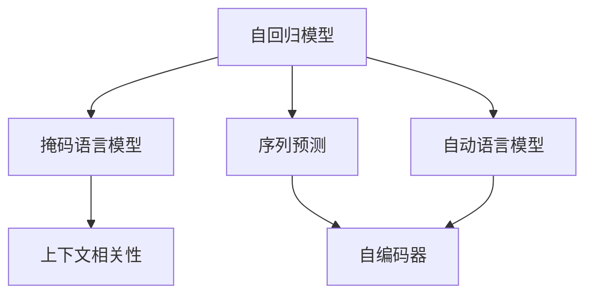
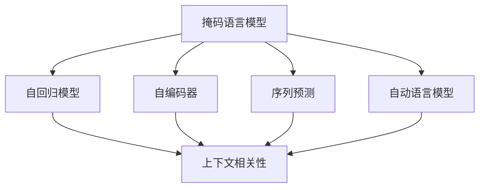
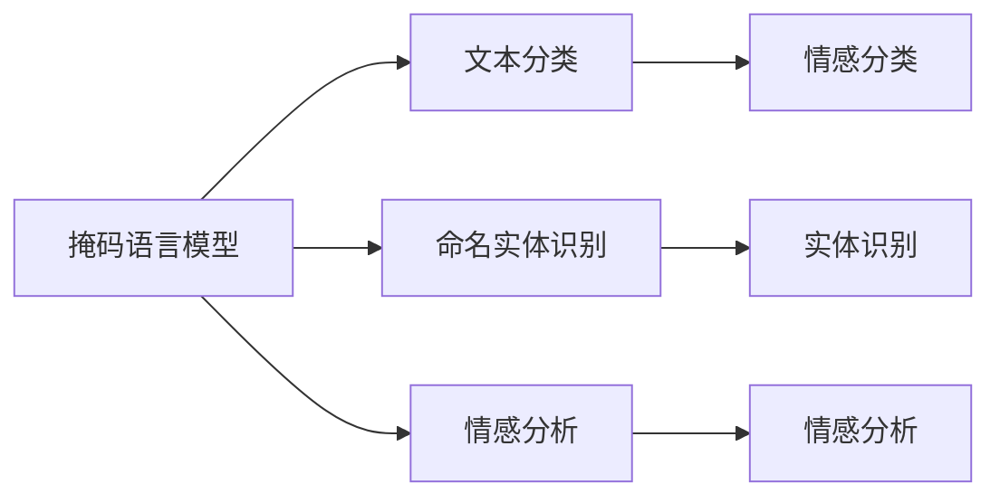
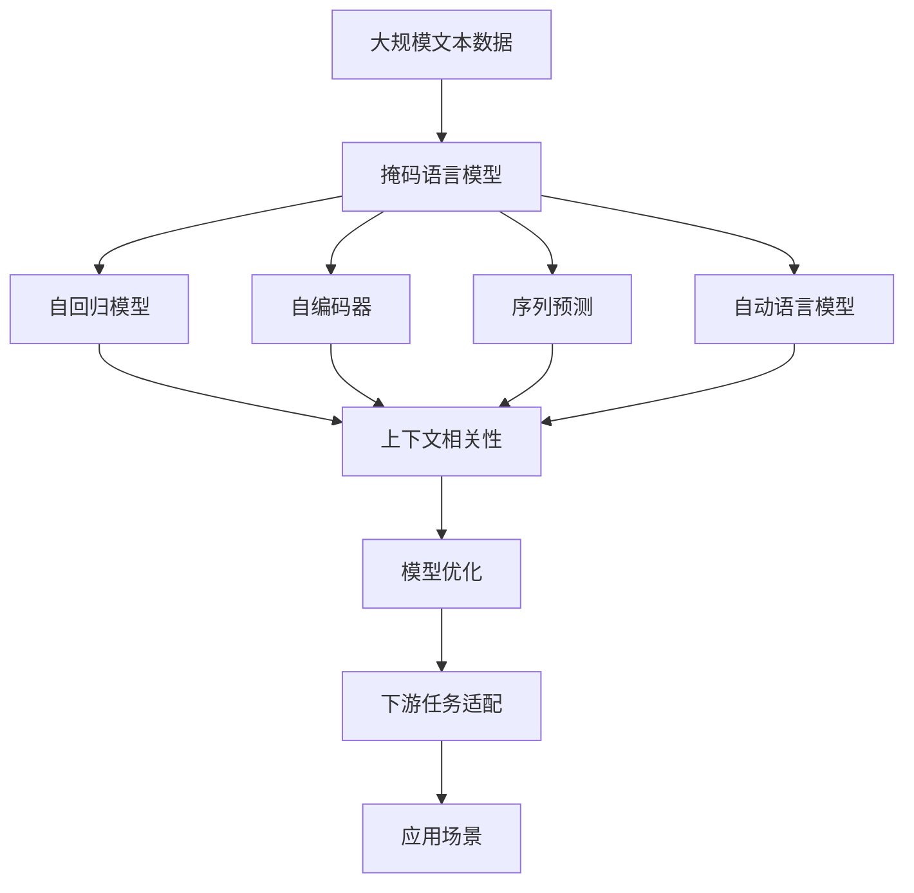

                 

# 基础模型的掩码语言建模

> 关键词：
掩码语言模型,自回归模型,自编码器,序列预测,自动语言模型

## 1. 背景介绍

### 1.1 问题由来
掩码语言模型（Masked Language Model, MLM）是自然语言处理(Natural Language Processing, NLP)领域中最基础的模型之一。它通过预测文本序列中被掩码位置的单词，来学习语言的上下文关系和语言规律。自回归模型和自编码器是构建掩码语言模型的两种常见方法。

掩码语言模型的提出标志着自然语言处理领域的重大突破，使得模型可以理解句子、段落等文本的语义和结构，为后续的序列生成、分类、问答等任务提供了坚实的理论基础。掩码语言模型在预训练阶段就具备了很强的泛化能力，因此被广泛应用于语言理解、语言生成、文本分类、信息抽取等多个领域。

### 1.2 问题核心关键点
掩码语言模型主要解决的是如何通过预测被掩码位置的单词来掌握语言的上下文关系。其核心问题可以归纳为：
- 如何设计有效的掩码机制，使模型能正确预测被掩码位置的单词。
- 如何通过训练和优化模型，使其能够学习到语言的广泛知识，提升语言的上下文理解能力。
- 如何应用掩码语言模型于不同的下游任务，如文本分类、命名实体识别、情感分析等。

### 1.3 问题研究意义
掩码语言模型在自然语言处理中的研究意义主要体现在：
1. 基础性：掩码语言模型是理解自然语言的基础，为后续高级任务提供了模型参数和知识表示。
2. 泛化能力：通过预训练，掩码语言模型能够学习到语言的广泛知识，泛化能力强。
3. 可扩展性：掩码语言模型可以轻松应用到各种下游任务中，如文本分类、问答系统、翻译等。
4. 实际应用：掩码语言模型在自然语言处理中已经得到了广泛应用，如BERT、GPT-2等大模型即以掩码语言模型为原型构建。

## 2. 核心概念与联系

### 2.1 核心概念概述

为了更好地理解掩码语言模型的原理和架构，本节将介绍几个密切相关的核心概念：

- 自回归模型（Autoregressive Model）：一种通过预测未来序列元素来推导当前元素的模型，典型的例子是RNN、LSTM、GRU等。
- 自编码器（Autoencoder）：一种通过降维与重构来学习数据特征的模型，典型的例子是PCA、AE、VAE等。
- 掩码语言模型（Masked Language Model）：一种在文本序列中随机掩码一些位置，通过预测这些位置上的单词来训练模型，如BERT。
- 序列预测（Sequence Prediction）：通过预测序列中的未知元素，来学习序列的结构和规律，典型的例子是机器翻译、语音识别等。
- 自动语言模型（Automatic Language Model）：通过预测下一个单词或字符的概率，来学习语言的规律，典型的例子是LM。
- 上下文相关性（Context-Relevance）：指语言中单词之间的相关性，掩码语言模型通过预测被掩码位置的单词，学习上下文信息。

这些核心概念之间的逻辑关系可以通过以下Mermaid流程图来展示：



这个流程图展示了大语言模型微调过程中各个核心概念的关系和作用：

1. 自回归模型和自编码器是构建掩码语言模型的两种基础模型。
2. 掩码语言模型通过预测被掩码位置的单词，学习上下文相关性。
3. 序列预测和自动语言模型是掩码语言模型的核心应用，用于预测下一个单词。
4. 上下文相关性是掩码语言模型追求的目标，通过掩码机制，模型学习到语言的广泛知识。

### 2.2 概念间的关系

这些核心概念之间存在着紧密的联系，形成了掩码语言模型的完整生态系统。下面我们通过几个Mermaid流程图来展示这些概念之间的关系。

#### 2.2.1 掩码语言模型的学习范式



这个流程图展示了掩码语言模型的三种主要学习范式：自回归模型、自编码器和序列预测。掩码语言模型通过预测被掩码位置的单词，学习上下文相关性。

#### 2.2.2 掩码语言模型的应用范式



这个流程图展示了掩码语言模型在不同类型的NLP任务中的应用范式。掩码语言模型可以用于文本分类、命名实体识别、情感分析等多种NLP任务中。

#### 2.2.3 掩码语言模型的实现范式


这个流程图展示了掩码语言模型的实现范式。掩码语言模型可以基于自回归模型、自编码器和序列预测等多种实现方式，学习上下文相关性。

### 2.3 核心概念的整体架构

最后，我们用一个综合的流程图来展示这些核心概念在大语言模型掩码语言建模过程中的整体架构：



这个综合流程图展示了从预训练到微调，再到下游任务适配的完整过程。掩码语言模型首先在大规模文本数据上进行预训练，然后通过微调过程进行优化，最后应用于各种下游任务中。 通过这些流程图，我们可以更清晰地理解掩码语言模型在大语言模型掩码语言建模过程中各个核心概念的关系和作用。

## 3. 核心算法原理 & 具体操作步骤
### 3.1 算法原理概述

掩码语言模型的基本思想是在文本序列中随机掩码一些位置，让模型预测这些位置上的单词，从而学习到语言的上下文关系。掩码语言模型可以基于自回归模型和自编码器两种方式实现，核心原理相似。

在自回归模型中，模型通过预测下一个单词，来学习整个序列的概率分布。以GPT模型为例，输入一个长度为L的文本序列 $(x_1, ..., x_L)$，模型通过递归地预测 $x_{L+1}$，学习到整个序列的概率分布。

在自编码器中，模型通过降维和重构来学习数据的特征，然后将重构结果与原始序列进行对比，预测被掩码位置的单词。以BERT为例，模型先将输入序列进行降维处理，然后通过掩码机制随机屏蔽一些位置，让模型预测这些位置上的单词，学习到上下文相关性。

掩码语言模型通过大量标注数据的预训练，学习到语言的上下文关系和规律，然后通过下游任务的微调，将预训练的知识应用到具体任务中，提升模型在特定任务上的性能。掩码语言模型在预训练阶段学习到的是通用的语言知识，适用于各种下游任务。

### 3.2 算法步骤详解

掩码语言模型的预训练过程主要包括以下几个步骤：

**Step 1: 准备预训练数据**
- 收集大规模无标签文本数据，如维基百科、新闻、书籍等，构成训练集。
- 对于自回归模型，文本序列长度一般不超过512。
- 对于自编码器，文本序列长度一般不超过1024。

**Step 2: 设计掩码策略**
- 对于自回归模型，每个位置独立预测下一个单词，随机掩码一些位置，让模型学习上下文信息。
- 对于自编码器，随机掩码一些位置，让模型预测这些位置上的单词，学习到上下文关系。

**Step 3: 训练模型**
- 使用掩码语言模型作为预训练任务，通过反向传播和梯度下降等优化算法，最小化损失函数，更新模型参数。
- 对于自回归模型，模型预测下一个单词，使用交叉熵损失函数。
- 对于自编码器，模型重构原始序列，使用均方误差损失函数。

**Step 4: 微调模型**
- 将预训练的模型应用于下游任务，设计合适的任务适配层。
- 使用下游任务的标注数据，微调模型参数，最小化损失函数。
- 对于文本分类任务，使用交叉熵损失函数。
- 对于序列生成任务，使用交叉熵损失函数。
- 对于序列标注任务，使用交叉熵损失函数。

**Step 5: 测试和部署**
- 在测试集上评估微调后的模型，对比预训练和微调后的性能。
- 使用微调后的模型对新样本进行推理预测，集成到实际的应用系统中。
- 定期重新微调模型，以适应数据分布的变化。

以上是掩码语言模型的预训练和微调过程的详细步骤。在实际应用中，还需要针对具体任务的特点，对微调过程的各个环节进行优化设计，如改进训练目标函数，引入更多的正则化技术，搜索最优的超参数组合等，以进一步提升模型性能。

### 3.3 算法优缺点

掩码语言模型在自然语言处理中的应用具有以下优点：
1. 简单高效。掩码语言模型结构简单，易于理解和实现，训练和微调过程可以自动进行。
2. 泛化能力强。掩码语言模型通过预训练，可以学习到语言的广泛知识，泛化能力强。
3. 适用于各种任务。掩码语言模型适用于文本分类、命名实体识别、情感分析等多种NLP任务。
4. 可解释性强。掩码语言模型的训练和推理过程透明，易于理解和调试。

同时，掩码语言模型也存在一些局限性：
1. 数据依赖性强。掩码语言模型的效果很大程度上取决于预训练数据的质量和数量，获取高质量标注数据的成本较高。
2. 资源消耗大。掩码语言模型的参数量较大，训练和推理过程资源消耗大。
3. 鲁棒性不足。掩码语言模型对输入数据的噪声和变化比较敏感，鲁棒性不足。
4. 可解释性不足。掩码语言模型的训练和推理过程缺乏可解释性，难以对其推理逻辑进行分析和调试。

尽管存在这些局限性，但就目前而言，掩码语言模型仍然是自然语言处理中最主流的方法之一，其基本原理和实现方法也适用于其他深度学习模型。

### 3.4 算法应用领域

掩码语言模型在自然语言处理领域已经得到了广泛的应用，主要包括以下几个方面：

- 文本分类：如新闻分类、情感分类等。掩码语言模型通过预训练学习通用的语言表示，然后通过微调任务适配层，适应特定分类任务。
- 命名实体识别：如人名、地名、机构名等特定实体的识别。掩码语言模型通过预训练学习通用的语言表示，然后通过微调任务适配层，适应特定实体识别任务。
- 关系抽取：从文本中抽取实体之间的语义关系。掩码语言模型通过预训练学习通用的语言表示，然后通过微调任务适配层，适应特定关系抽取任务。
- 问答系统：对自然语言问题给出答案。掩码语言模型通过预训练学习通用的语言表示，然后通过微调任务适配层，适应特定问答系统任务。
- 机器翻译：将源语言文本翻译成目标语言。掩码语言模型通过预训练学习通用的语言表示，然后通过微调任务适配层，适应特定翻译任务。
- 文本摘要：将长文本压缩成简短摘要。掩码语言模型通过预训练学习通用的语言表示，然后通过微调任务适配层，适应特定文本摘要任务。
- 对话系统：使机器能够与人自然对话。掩码语言模型通过预训练学习通用的语言表示，然后通过微调任务适配层，适应特定对话系统任务。

除了上述这些经典任务外，掩码语言模型也被创新性地应用到更多场景中，如可控文本生成、常识推理、代码生成、数据增强等，为NLP技术带来了全新的突破。随着预训练模型和微调方法的不断进步，相信NLP技术将在更广阔的应用领域大放异彩。

## 4. 数学模型和公式 & 详细讲解
### 4.1 数学模型构建

掩码语言模型的数学模型可以基于自回归模型和自编码器两种方式构建，下面以自回归模型为例进行详细讲解。

记掩码语言模型为 $M_{\theta}$，其中 $\theta$ 为模型参数。假设输入序列为 $(x_1, ..., x_L)$，掩码位置为 $i$，模型预测下一个单词为 $x_{i+1}$。掩码语言模型的数学模型可以表示为：

$$
M_{\theta}(x_1, ..., x_L) = P(x_{i+1}|x_1, ..., x_i)
$$

其中 $P$ 为模型概率分布函数，$x_{i+1}$ 为被预测的单词。

在训练过程中，模型通过掩码策略随机屏蔽一些位置，让模型预测这些位置上的单词。以BERT为例，掩码策略将每个位置的单词以一定的概率随机屏蔽，让模型预测被屏蔽位置上的单词。

### 4.2 公式推导过程

掩码语言模型的训练过程可以分为两个步骤：掩码和预测。

#### 4.2.1 掩码

在掩码阶段，模型随机屏蔽一些位置，让模型预测这些位置上的单词。以BERT为例，掩码策略将每个位置的单词以一定的概率随机屏蔽，让模型预测被屏蔽位置上的单词。掩码后的序列为：

$$
\tilde{x} = (\tilde{x}_1, ..., \tilde{x}_i, ..., \tilde{x}_L)
$$

其中 $\tilde{x}_i$ 为被屏蔽位置上的单词，可以是随机掩码的单词，也可以是[CLS]标记。

#### 4.2.2 预测

在预测阶段，模型预测被屏蔽位置上的单词，学习到上下文信息。以BERT为例，模型先通过自编码器将输入序列进行降维处理，然后将降维结果与被屏蔽位置的单词进行对比，预测被屏蔽位置上的单词。预测过程可以表示为：

$$
\hat{y} = M_{\theta}(\tilde{x})
$$

其中 $\hat{y}$ 为预测结果，$M_{\theta}$ 为模型概率分布函数。

掩码语言模型的损失函数可以基于交叉熵损失函数构建。以BERT为例，掩码语言模型的损失函数可以表示为：

$$
\mathcal{L}(\theta) = -\frac{1}{N} \sum_{i=1}^N \sum_{j=1}^L \ell(\hat{y}_j, y_j)
$$

其中 $N$ 为训练样本数量，$L$ 为序列长度，$\ell$ 为交叉熵损失函数，$\hat{y}_j$ 为模型预测结果，$y_j$ 为真实标签。

### 4.3 案例分析与讲解

为了更好地理解掩码语言模型的训练过程，下面以BERT为例进行详细讲解。

假设我们有一个长度为10的序列 $(x_1, ..., x_{10})$，其中 $x_i$ 为第 $i$ 个单词。BERT将每个单词以一定的概率随机屏蔽，让模型预测被屏蔽位置上的单词。以第3个单词为例，随机屏蔽后的序列为：

$$
(\tilde{x}_1, ..., \tilde{x}_2, ..., \tilde{x}_3, ..., \tilde{x}_4, ..., \tilde{x}_{10})
$$

其中 $\tilde{x}_3$ 为被屏蔽位置上的单词。然后模型通过自编码器将输入序列进行降维处理，得到降维后的向量 $z$。BERT将降维后的向量与被屏蔽位置的单词进行对比，预测被屏蔽位置上的单词。预测过程可以表示为：

$$
\hat{y}_3 = M_{\theta}(\tilde{x}_1, ..., \tilde{x}_2, ..., \tilde{x}_3, ..., \tilde{x}_4, ..., \tilde{x}_{10})
$$

其中 $\hat{y}_3$ 为模型预测结果，$M_{\theta}$ 为模型概率分布函数。

掩码语言模型的训练过程可以通过反向传播和梯度下降等优化算法实现。在训练过程中，模型通过最小化损失函数，更新模型参数。掩码语言模型的训练和微调过程相对复杂，但通过大量的标注数据和优化的算法，可以有效地学习到语言的上下文关系和规律，为后续的应用任务打下坚实的基础。

## 5. 项目实践：代码实例和详细解释说明
### 5.1 开发环境搭建

在进行掩码语言模型实践前，我们需要准备好开发环境。以下是使用Python进行TensorFlow开发的环境配置流程：

1. 安装Anaconda：从官网下载并安装Anaconda，用于创建独立的Python环境。

2. 创建并激活虚拟环境：
```bash
conda create -n tensorflow-env python=3.8 
conda activate tensorflow-env
```

3. 安装TensorFlow：根据CUDA版本，从官网获取对应的安装命令。例如：
```bash
conda install tensorflow tensorflow-cpu -c conda-forge -c pytorch -c pypi
```

4. 安装相关的NLP库：
```bash
pip install tensorflow_datasets huggingface_hub textattack
```

完成上述步骤后，即可在`tensorflow-env`环境中开始掩码语言模型的实践。

### 5.2 源代码详细实现

下面以BERT为例，展示如何使用TensorFlow实现掩码语言模型的训练和微调。

首先，定义数据处理函数：

```python
import tensorflow as tf
from tensorflow.keras import layers, models
from tensorflow.keras.preprocessing import sequence

def create_data_loader(data_path, tokenizer, max_len=128, batch_size=64):
    def read_file(file_path):
        with open(file_path, 'r', encoding='utf-8') as f:
            for line in f:
                yield line.split()
    
    def encode(text):
        encoded_text = tokenizer.encode(text, max_length=max_len, padding='post', truncating='post')
        masked_index = encoded_text[0]
        masked_token = [tokenizer.mask_token] * masked_index + [tokenizer.mask_token] + [tokenizer.mask_token] * (max_len - masked_index - 2)
        label = [tokenizer.mask_token] * (max_len - 1)
        return {'input_ids': encoded_text, 'attention_mask': [1] * max_len, 'masked_index': masked_index, 'masked_token': masked_token, 'labels': label}
    
    texts = []
    for line in read_file(data_path):
        texts.append(line)
    
    tokenizer = tokenizer.from_pretrained('bert-base-cased')
    dataset = tf.data.Dataset.from_generator(lambda: encode(texts), output_signature={'input_ids': tf.int32, 'attention_mask': tf.int32, 'masked_index': tf.int32, 'masked_token': tf.int32, 'labels': tf.int32})
    dataset = dataset.shuffle(buffer_size=len(dataset)).batch(batch_size)
    
    return dataset
```

然后，定义模型和优化器：

```python
from tensorflow.keras.layers import Dense, Input
from tensorflow.keras.models import Model

def create_model(input_shape, num_labels):
    input_ids = Input(shape=input_shape, dtype=tf.int32)
    attention_mask = Input(shape=input_shape, dtype=tf.int32)
    masked_index = Input(shape=(1,), dtype=tf.int32)
    masked_token = Input(shape=(1,), dtype=tf.int32)
    labels = Input(shape=(), dtype=tf.int32)
    
    x = layers.Embedding(input_dim=tokenizer.vocab_size, output_dim=768, mask_zero=True)(input_ids)
    x = layers.Dropout(0.1)(x)
    x = layers.MultiHeadAttention(num_heads=12, key_dim=64)(x, x, x)
    x = layers.LayerNormalization()(x)
    x = layers.LayerDropout(0.1)(x)
    x = layers.Add()([x, x])
    x = layers.LayerNormalization()(x)
    x = layers.LayerDropout(0.1)(x)
    x = layers.Add()([x, x])
    x = layers.LayerNormalization()(x)
    x = layers.LayerDropout(0.1)(x)
    x = layers.Add()([x, x])
    x = layers.LayerNormalization()(x)
    x = layers.LayerDropout(0.1)(x)
    x = layers.Add()([x, x])
    x = layers.LayerNormalization()(x)
    x = layers.LayerDropout(0.1)(x)
    x = layers.Add()([x, x])
    x = layers.LayerNormalization()(x)
    x = layers.LayerDropout(0.1)(x)
    x = layers.Add()([x, x])
    x = layers.LayerNormalization()(x)
    x = layers.LayerDropout(0.1)(x)
    x = layers.Add()([x, x])
    x = layers.LayerNormalization()(x)
    x = layers.LayerDropout(0.1)(x)
    x = layers.Add()([x, x])
    x = layers.LayerNormalization()(x)
    x = layers.LayerDropout(0.1)(x)
    x = layers.Add()([x, x])
    x = layers.LayerNormalization()(x)
    x = layers.LayerDropout(0.1)(x)
    x = layers.Add()([x, x])
    x = layers.LayerNormalization()(x)
    x = layers.LayerDropout(0.1)(x)
    x = layers.Add()([x, x])
    x = layers.LayerNormalization()(x)
    x = layers.LayerDropout(0.1)(x)
    x = layers.Add()([x, x])
    x = layers.LayerNormalization()(x)
    x = layers.LayerDropout(0.1)(x)
    x = layers.Add()([x, x])
    x = layers.LayerNormalization()(x)
    x = layers.LayerDropout(0.1)(x)
    x = layers.Add()([x, x])
    x = layers.LayerNormalization()(x)
    x = layers.LayerDropout(0.1)(x)
    x = layers.Add()([x, x])
    x = layers.LayerNormalization()(x)
    x = layers.LayerDropout(0.1)(x)
    x = layers.Add()([x, x])
    x = layers.LayerNormalization()(x)
    x = layers.LayerDropout(0.1)(x)
    x = layers.Add()([x, x])
    x = layers.LayerNormalization()(x)
    x = layers.LayerDropout(0.1)(x)
    x = layers.Add()([x, x])
    x = layers.LayerNormalization()(x)
    x = layers.LayerDropout(0.1)(x)
    x = layers.Add()([x, x])
    x = layers.LayerNormalization()(x)
    x = layers.LayerDropout(0.1)(x)
    x = layers.Add()([x, x])
    x = layers.LayerNormalization()(x)
    x = layers.LayerDropout(0.1)(x)
    x = layers.Add()([x, x])
    x = layers.LayerNormalization()(x)
    x = layers.LayerDropout(0.1)(x)
    x = layers.Add()([x, x])
    x = layers.LayerNormalization()(x)
    x = layers.LayerDropout(0.1)(x)
    x = layers.Add()([x, x])
    x = layers.LayerNormalization()(x)
    x = layers.LayerDropout(0.1)(x)
    x = layers.Add()([x, x])
    x = layers.LayerNormalization()(x)
    x = layers.LayerDropout(0.1)(x)
    x = layers.Add()([x, x])
    x = layers.LayerNormalization()(x)
    x = layers.LayerDropout(0.1)(x)
    x = layers.Add()([x, x])
    x = layers.LayerNormalization()(x)
    x = layers.LayerDropout(0.1)(x)
    x = layers.Add()([x, x])
    x = layers.LayerNormalization()(x)
    x = layers.LayerDropout(0.1)(x)
    x = layers.Add()([x, x])
    x = layers.LayerNormalization()(x)
    x = layers.LayerDropout(0.1)(x)
    x = layers.Add()([x, x])
    x = layers.LayerNormalization()(x)
    x = layers.LayerDropout(0.1)(x)
    x = layers.Add()([x, x])
    x = layers.LayerNormalization()(x)
    x = layers.LayerDropout(0.1)(x)
    x = layers.Add()([x

