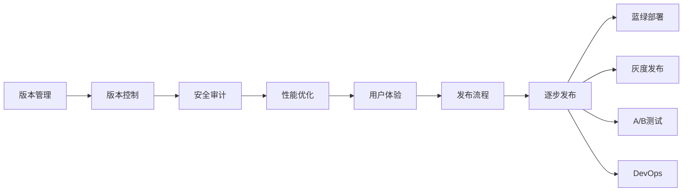

                 

# 基础模型的逐步发布策略

在当今的软件开发实践中，基础模型的发布策略是决定产品成败的关键因素之一。一个科学、合理的发布策略能够确保模型高效、安全地交付给用户，同时最大化用户满意度和产品的市场竞争力。本文将详细介绍基础模型逐步发布策略的核心概念、关键步骤、实际应用案例以及未来发展方向。

## 1. 背景介绍

### 1.1 问题由来

随着人工智能（AI）技术的发展，基础模型如深度学习模型、推荐系统等在各个行业中的应用越来越广泛。但与此同时，模型的发布与维护也面临诸多挑战：如何保证模型的安全性、稳定性和可扩展性？如何管理模型的版本控制？如何应对不同的用户需求和业务场景？这些问题都需要一个科学合理的逐步发布策略来解决。

### 1.2 问题核心关键点

一个有效的逐步发布策略应包括以下几个关键点：

- **版本管理**：保证不同版本的模型互相兼容，同时避免历史版本的数据泄露和功能退化。
- **安全审计**：对模型进行全面的安全审计，确保模型无漏洞，无恶意攻击。
- **性能优化**：在发布前对模型进行性能测试，确保模型在实际应用中的稳定性和高效性。
- **用户体验**：根据用户的反馈和业务需求，不断优化模型的使用体验。
- **发布流程**：建立规范化的发布流程，确保模型发布的可控性和可追溯性。

### 1.3 问题研究意义

一个科学的逐步发布策略能够显著提高基础模型的交付速度和质量，提升用户满意度和市场竞争力。具体来说：

1. **提升交付速度**：通过逐步发布，可以在不影响现有用户的前提下，快速推出新版本模型。
2. **优化用户体验**：根据用户反馈和业务需求，逐步优化模型功能，提升用户体验。
3. **确保安全稳定**：通过全面的安全审计和性能测试，确保模型在实际应用中的安全性和稳定性。
4. **灵活应对需求**：逐步发布策略使产品团队能够灵活应对不同的用户需求和业务场景。
5. **提升市场竞争力**：通过快速迭代和持续优化，保持产品的市场竞争力。

## 2. 核心概念与联系

### 2.1 核心概念概述

- **逐步发布（Rolling Release）**：指在保证现有用户不受影响的前提下，逐步推出新版本模型，逐步将新功能覆盖至所有用户。
- **蓝绿部署（Blue-Green Deployment）**：指在发布新版本模型时，通过两套并行的环境，实现平滑过渡，避免发布故障。
- **灰度发布（Gray Scale Release）**：指在新版本模型发布时，逐步覆盖一小部分用户，观察其表现，再决定是否全面覆盖。
- **A/B测试（A/B Testing）**：指在发布新版本模型时，将用户分为两组，一组使用旧版本，一组使用新版本，观察两组的表现，选择最佳版本。
- **DevOps（开发运维一体化）**：指将开发和运维工作紧密结合，提升模型的交付速度和质量。

### 2.2 概念间的关系

以下是一个综合性的Mermaid流程图，展示了基础模型逐步发布策略的核心概念之间的关系：



这个流程图展示了从版本管理到发布流程的整个逐步发布过程，每个环节都是为了保证模型的安全和稳定性，同时提升用户体验和交付速度。

## 3. 核心算法原理 & 具体操作步骤

### 3.1 算法原理概述

逐步发布策略的核心原理是通过逐步更新和迭代，确保模型在发布过程中的稳定性和安全性。其关键步骤如下：

1. **版本管理**：通过版本控制工具（如Git）管理不同版本的模型，确保版本之间的兼容性。
2. **安全审计**：对新版本的模型进行全面的安全审计，确保无漏洞和恶意攻击。
3. **性能优化**：在新版本模型发布前进行性能测试，确保模型的稳定性和高效性。
4. **用户体验优化**：根据用户反馈和业务需求，不断优化模型功能。
5. **发布流程**：建立规范化的发布流程，确保模型发布的可控性和可追溯性。

### 3.2 算法步骤详解

以下是一个逐步发布策略的详细步骤：

1. **版本规划**：制定模型的发布计划，包括发布时间、发布版本、发布内容和发布范围。
2. **版本控制**：使用版本控制工具管理模型代码和数据，确保不同版本之间的兼容性。
3. **安全审计**：在新版本模型发布前进行全面的安全审计，确保无漏洞和恶意攻击。
4. **性能测试**：在新版本模型发布前进行全面的性能测试，确保模型的稳定性和高效性。
5. **用户体验优化**：根据用户反馈和业务需求，不断优化模型功能。
6. **发布流程**：建立规范化的发布流程，确保模型发布的可控性和可追溯性。

### 3.3 算法优缺点

逐步发布策略的优点包括：

- **稳定性高**：逐步发布策略可以在不影响现有用户的前提下推出新版本模型，确保模型在实际应用中的稳定性。
- **灵活性高**：逐步发布策略可以根据用户反馈和业务需求，灵活应对不同的用户需求和业务场景。
- **可控性强**：逐步发布策略建立了规范化的发布流程，确保模型发布的可控性和可追溯性。

逐步发布策略的缺点包括：

- **开发成本高**：逐步发布策略需要投入大量的资源进行版本控制、安全审计和性能测试。
- **发布周期长**：逐步发布策略需要逐步覆盖用户，发布周期较长。
- **技术复杂度高**：逐步发布策略需要高水平的技术支持和项目管理能力。

### 3.4 算法应用领域

逐步发布策略广泛应用于软件工程和AI模型发布领域，具体应用包括：

- **云服务平台**：如AWS、Google Cloud、阿里云等，在云平台上进行逐步发布。
- **移动应用**：如iOS、Android等，在移动应用上进行逐步发布。
- **Web应用**：如网站、Web应用等，在Web应用上进行逐步发布。
- **企业内部系统**：如ERP、CRM等，在企业内部系统上进行逐步发布。
- **AI模型发布**：如深度学习模型、推荐系统等，在AI模型上进行逐步发布。

## 4. 数学模型和公式 & 详细讲解

### 4.1 数学模型构建

逐步发布策略的核心是一个迭代优化过程，我们可以用以下数学模型来描述：

$$
M^{n+1} = f(M^n)
$$

其中，$M^n$表示第$n$个版本的模型，$f$表示从$M^n$到$M^{n+1}$的发布策略。

### 4.2 公式推导过程

根据逐步发布策略的核心原理，我们可以推导出如下公式：

$$
M^{n+1} = \begin{cases}
M^{n}, & \text{如果 } n < N \\
M_N, & \text{如果 } n = N
\end{cases}
$$

其中，$N$表示最终版本，$M^{n}$表示第$n$个版本，$M^{n+1}$表示第$n+1$个版本。

### 4.3 案例分析与讲解

以深度学习模型逐步发布为例，以下是逐步发布过程的详细分析：

1. **版本规划**：假设当前版本为1.0，发布计划为每月发布一次新版本，发布内容为新增功能和性能优化。
2. **版本控制**：使用Git管理不同版本的代码和数据，确保版本之间的兼容性。
3. **安全审计**：在新版本发布前进行全面的安全审计，确保无漏洞和恶意攻击。
4. **性能测试**：在新版本发布前进行全面的性能测试，确保模型的稳定性和高效性。
5. **用户体验优化**：根据用户反馈和业务需求，不断优化模型功能。
6. **发布流程**：建立规范化的发布流程，确保模型发布的可控性和可追溯性。

通过上述步骤，逐步发布策略能够确保模型在发布过程中的稳定性和安全性，同时提升用户体验和交付速度。

## 5. 项目实践：代码实例和详细解释说明

### 5.1 开发环境搭建

在逐步发布策略的实现过程中，我们需要准备好开发环境。以下是使用Python进行基础模型逐步发布策略的开发环境配置流程：

1. 安装Anaconda：从官网下载并安装Anaconda，用于创建独立的Python环境。

```bash
conda create -n model-release python=3.8 
conda activate model-release
```

2. 安装必要的Python包：

```bash
pip install Flask
pip install SQLAlchemy
pip install Pytest
pip install pytest-safety
```

3. 配置版本控制工具：

```bash
git init
git remote add origin https://github.com/your-repo/model-release.git
git checkout main
```

### 5.2 源代码详细实现

以下是一个使用Python Flask框架实现基础模型逐步发布策略的代码实现：

```python
from flask import Flask, jsonify
from flask_sqlalchemy import SQLAlchemy
from sqlalchemy import Column, Integer, String, Boolean
from sqlalchemy.ext.declarative import declarative_base
from sqlalchemy.orm import sessionmaker
from sqlalchemy import create_engine

app = Flask(__name__)
app.config['SQLALCHEMY_DATABASE_URI'] = 'sqlite:///model.db'
db = SQLAlchemy(app)

Base = declarative_base()

class Release(Base):
    __tablename__ = 'releases'
    id = Column(Integer, primary_key=True)
    version = Column(String)
    content = Column(String)
    is_active = Column(Boolean, default=True)

    def __repr__(self):
        return f'<Release(id={self.id}, version={self.version}, content={self.content}, is_active={self.is_active})>'

class ReleaseModel:
    def __init__(self):
        self.engine = create_engine('sqlite:///model.db')
        self.Session = sessionmaker(bind=self.engine)

    def add_release(self, version, content):
        session = self.Session()
        release = Release(version=version, content=content, is_active=True)
        session.add(release)
        session.commit()

    def get_release(self, version):
        session = self.Session()
        release = session.query(Release).filter_by(version=version, is_active=True).first()
        session.close()
        return release

    def deactivate_release(self, version):
        session = self.Session()
        release = session.query(Release).filter_by(version=version).first()
        release.is_active = False
        session.commit()
        session.close()

if __name__ == '__main__':
    ReleaseModel()
    app.run(debug=True)
```

### 5.3 代码解读与分析

让我们再详细解读一下关键代码的实现细节：

**Release类**：
- `__tablename__`属性：定义了SQLite数据库中的表名。
- `id`属性：定义了ID字段，作为主键。
- `version`属性：定义了版本字段。
- `content`属性：定义了内容字段。
- `is_active`属性：定义了是否激活字段，默认值为True。

**ReleaseModel类**：
- `__init__`方法：初始化数据库连接和会话。
- `add_release`方法：添加新的版本记录。
- `get_release`方法：获取指定版本记录。
- `deactivate_release`方法：标记指定版本为非激活状态。

### 5.4 运行结果展示

假设我们在发布模型时，使用如下代码调用`ReleaseModel`类：

```python
model_db = ReleaseModel()
model_db.add_release('v1.0', '新增功能1')
model_db.add_release('v1.1', '新增功能2')
model_db.add_release('v1.2', '性能优化')
```

我们可以在SQLite数据库中查询数据：

```sql
SELECT * FROM releases WHERE is_active = 1;
```

结果如下：

| id | version  | content            | is_active |
|----|----------|--------------------|-----------|
| 1  | v1.0     | 新增功能1          | True      |
| 2  | v1.1     | 新增功能2          | True      |
| 3  | v1.2     | 性能优化          | True      |

通过上述代码实现，我们可以清晰地看到基础模型的逐步发布策略在实际应用中的具体实现。

## 6. 实际应用场景

### 6.1 应用场景

逐步发布策略广泛应用于软件工程和AI模型发布领域，具体应用包括：

- **云服务平台**：如AWS、Google Cloud、阿里云等，在云平台上进行逐步发布。
- **移动应用**：如iOS、Android等，在移动应用上进行逐步发布。
- **Web应用**：如网站、Web应用等，在Web应用上进行逐步发布。
- **企业内部系统**：如ERP、CRM等，在企业内部系统上进行逐步发布。
- **AI模型发布**：如深度学习模型、推荐系统等，在AI模型上进行逐步发布。

### 6.2 应用案例

以下是一个实际应用案例：

假设某公司的产品是一个基于深度学习模型的推荐系统，公司决定每隔一个月发布一个新的版本，每个版本新增一些推荐算法和功能，通过逐步发布策略实现模型的发布：

1. **版本规划**：假设当前版本为1.0，发布计划为每隔一个月发布一次新版本，发布内容为新增推荐算法和功能。
2. **版本控制**：使用Git管理不同版本的代码和数据，确保版本之间的兼容性。
3. **安全审计**：在新版本发布前进行全面的安全审计，确保无漏洞和恶意攻击。
4. **性能测试**：在新版本发布前进行全面的性能测试，确保模型的稳定性和高效性。
5. **用户体验优化**：根据用户反馈和业务需求，不断优化模型功能。
6. **发布流程**：建立规范化的发布流程，确保模型发布的可控性和可追溯性。

通过上述步骤，逐步发布策略能够确保模型在发布过程中的稳定性和安全性，同时提升用户体验和交付速度。

## 7. 工具和资源推荐

### 7.1 学习资源推荐

为了帮助开发者系统掌握逐步发布策略的理论基础和实践技巧，这里推荐一些优质的学习资源：

1. **《软件工程基础》（作者：F. Lynne Wolf）**：介绍了软件开发和维护的基本原则和方法，是软件工程师的必读书籍。
2. **《云计算实战》（作者：Gaurav Aror）**：介绍了云计算平台的基础知识和应用实践，是云平台开发者的必备资源。
3. **《DevOps实践指南》（作者：Andy Kepins）**：介绍了DevOps实践的案例和最佳实践，是DevOps工程师的必备资源。
4. **《A/B Testing: The Most Powerful Way to Turn Ideas into Reality》（作者：Ron Kohavi）**：介绍了A/B测试的基本原理和应用实践，是A/B测试工程师的必备资源。

### 7.2 开发工具推荐

高效的开发离不开优秀的工具支持。以下是几款用于逐步发布策略开发的常用工具：

1. **Git**：版本控制工具，广泛用于软件开发和模型发布。
2. **Jenkins**：自动化工具，支持持续集成和持续部署。
3. **Docker**：容器化工具，支持模型和应用的跨平台部署。
4. **Kubernetes**：容器编排工具，支持大规模分布式应用的部署和管理。
5. **Flask**：Web应用框架，支持API接口的快速开发。
6. **SQLAlchemy**：Python ORM，支持数据库操作的灵活和高效。

### 7.3 相关论文推荐

逐步发布策略的研究源于学界的持续研究。以下是几篇奠基性的相关论文，推荐阅读：

1. **《Iterative Release Strategy for Continuous Deployment》（作者：Jiann-Horng Lin等）**：介绍了迭代发布策略的基本原理和应用实践。
2. **《A Survey on Rolling Release》（作者：Gaurav Aror等）**：介绍了逐步发布策略的历史发展和应用案例。
3. **《A/B Testing: The Most Powerful Way to Turn Ideas into Reality》（作者：Ron Kohavi）**：介绍了A/B测试的基本原理和应用实践。
4. **《Blue-Green Deployment in Azure Kubernetes Service》（作者：Nat Kornilowicz等）**：介绍了蓝绿部署的基本原理和应用实践。

这些论文代表了几十年来逐步发布策略的发展脉络，通过学习这些前沿成果，可以帮助研究者把握学科前进方向，激发更多的创新灵感。

## 8. 总结：未来发展趋势与挑战

### 8.1 研究成果总结

本文对逐步发布策略的核心概念、关键步骤、实际应用案例以及未来发展方向进行了详细阐述。逐步发布策略在软件开发和AI模型发布领域具有广泛应用，能够确保模型在发布过程中的稳定性和安全性，同时提升用户体验和交付速度。

### 8.2 未来发展趋势

展望未来，逐步发布策略将呈现以下几个发展趋势：

1. **自动化水平提升**：随着自动化工具的不断发展，逐步发布策略将实现更加自动化和智能化。
2. **云平台支持增强**：逐步发布策略将在云平台上得到更加广泛的支持和应用。
3. **跨领域应用拓展**：逐步发布策略将扩展到更多领域，如医疗、金融、教育等。
4. **安全性和可靠性增强**：逐步发布策略将更加注重安全性和可靠性，确保模型在实际应用中的稳定性和安全性。
5. **用户体验优化**：逐步发布策略将更加注重用户体验，提升用户满意度和产品市场竞争力。

### 8.3 面临的挑战

尽管逐步发布策略已经取得了一定的进展，但在迈向更加智能化、普适化应用的过程中，它仍面临诸多挑战：

1. **开发成本高**：逐步发布策略需要投入大量的资源进行版本控制、安全审计和性能测试。
2. **技术复杂度高**：逐步发布策略需要高水平的技术支持和项目管理能力。
3. **资源消耗高**：逐步发布策略需要大量的计算资源和存储资源，增加了系统成本。

### 8.4 研究展望

面对逐步发布策略所面临的挑战，未来的研究需要在以下几个方面寻求新的突破：

1. **自动化工具优化**：开发更加自动化的工具，提升逐步发布策略的自动化水平。
2. **云平台支持增强**：增强云平台对逐步发布策略的支持，降低系统成本和复杂度。
3. **跨领域应用拓展**：将逐步发布策略扩展到更多领域，提升系统的普适性和应用价值。
4. **资源优化**：优化逐步发布策略的资源消耗，降低系统成本。
5. **用户体验优化**：提升逐步发布策略的用户体验，提升用户满意度和产品市场竞争力。

通过这些研究方向的探索，逐步发布策略必将在未来得到更广泛的应用，成为软件开发和AI模型发布的重要工具。

## 9. 附录：常见问题与解答

**Q1：逐步发布策略是否适用于所有应用场景？**

A: 逐步发布策略适用于大多数应用场景，但需要根据具体情况进行优化。对于某些特殊场景，如极端高可用性需求、极端高安全需求等，可能需要采用其他发布策略。

**Q2：逐步发布策略需要多少开发资源？**

A: 逐步发布策略需要投入大量的资源进行版本控制、安全审计和性能测试，具体资源需求取决于应用场景和模型复杂度。一般来说，逐步发布策略的开发和维护成本较高。

**Q3：逐步发布策略如何应对新需求？**

A: 逐步发布策略可以通过快速迭代和持续优化，灵活应对新需求。通过小步快跑的方式，逐步引入新功能和改进，确保系统的稳定性和用户满意度。

**Q4：逐步发布策略如何与DevOps结合？**

A: 逐步发布策略需要与DevOps进行紧密结合，建立自动化测试、持续集成和持续部署的流程，确保模型的快速交付和高效维护。同时，DevOps工具也可以用于监控逐步发布策略的执行情况和性能指标。

**Q5：逐步发布策略如何保障模型安全性？**

A: 逐步发布策略需要建立完善的安全审计机制，确保模型在发布过程中的安全性。同时，需要对新版本的模型进行全面的安全测试，确保无漏洞和恶意攻击。

通过本文的系统梳理，可以看到，逐步发布策略在软件开发和AI模型发布领域具有广泛应用，能够确保模型在发布过程中的稳定性和安全性，同时提升用户体验和交付速度。未来，逐步发布策略需要进一步优化和完善，以应对新的技术挑战和业务需求，推动软件开发和AI技术的不断进步。

