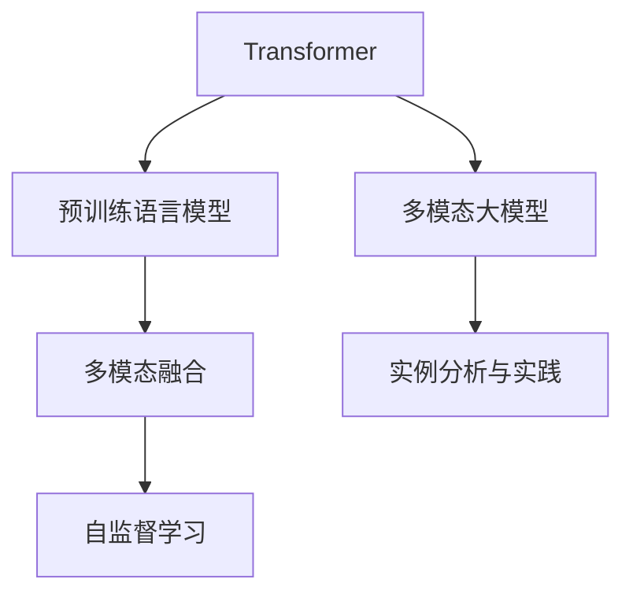
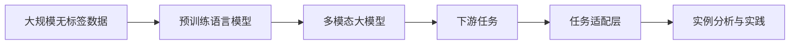

                 

# 多模态大模型：技术原理与实战 基于Transformer的预训练语言模型

> 关键词：多模态大模型,Transformer,预训练语言模型,自监督学习,多模态融合,实例分析

## 1. 背景介绍

### 1.1 问题由来
近年来，深度学习技术的快速发展，尤其是预训练语言模型(Pre-trained Language Models, PLMs)的崛起，显著提升了自然语言处理(Natural Language Processing, NLP)的能力。然而，PLMs虽然在大规模文本数据上进行预训练，但往往忽略了其他模态的信息，如视觉、音频、时间等，导致其在多模态任务中的表现不尽人意。

为了解决这个问题，研究者们提出了多模态大模型(Multi-modal Large Models, MLMs)，将不同模态的信息进行融合，以增强模型的表达能力和泛化能力。多模态大模型通常包含文本、视觉、音频等多个模态，能够更好地理解和处理现实世界的复杂信息。

本文聚焦于基于Transformer的预训练语言模型，介绍其技术原理和实战方法，并结合实例分析，揭示多模态大模型的核心概念和应用前景。

### 1.2 问题核心关键点
多模态大模型的关键点在于：
1. **多模态融合技术**：如何有效地将不同模态的信息融合在一起，构建统一的语义表示。
2. **自监督学习**：如何在大规模无标签数据上进行预训练，学习到丰富的多模态语义知识。
3. **模型的泛化能力**：如何提升模型在不同任务和不同模态数据上的泛化性能。
4. **实例分析与实践**：通过具体任务，展示多模态大模型在不同模态融合和预训练方法上的应用效果。

这些关键点共同构成了多模态大模型的核心框架，帮助我们理解其在多模态任务中的潜力和挑战。

## 2. 核心概念与联系

### 2.1 核心概念概述

为更好地理解基于Transformer的多模态大模型，本节将介绍几个密切相关的核心概念：

- **Transformer**：一种基于自注意力机制的自编码神经网络，被广泛应用于文本生成、机器翻译等任务，具有高效的并行计算能力和良好的表达能力。
- **预训练语言模型**：如BERT、GPT等，通过在大规模无标签文本数据上进行自监督学习，学习到丰富的语言表示。
- **多模态融合**：将不同模态的信息进行融合，形成统一的语义表示，增强模型的理解和表达能力。
- **多模态大模型**：包含文本、视觉、音频等多个模态，能够处理更加复杂的多模态任务。
- **自监督学习**：使用未标注数据进行学习，学习到任务无关的通用语义表示。
- **实例分析与实践**：通过具体任务，展示多模态大模型的应用效果和技术细节。

这些核心概念之间的逻辑关系可以通过以下Mermaid流程图来展示：



这个流程图展示了大语言模型的核心概念及其之间的关系：

1. 预训练语言模型通过自监督学习获得语言表示。
2. 多模态大模型通过多模态融合技术，将不同模态的信息进行融合，形成统一的语义表示。
3. 自监督学习是预训练的重要手段，用于在大规模无标签数据上进行学习。
4. 实例分析与实践展示了多模态大模型在实际任务中的应用。

### 2.2 概念间的关系

这些核心概念之间存在着紧密的联系，形成了多模态大模型的完整生态系统。下面我们通过几个Mermaid流程图来展示这些概念之间的关系。

#### 2.2.1 预训练与微调的关系


这个流程图展示了预训练语言模型和多模态大模型的关系，以及它们与自监督学习和微调的关系。预训练语言模型是构建多模态大模型的基础，通过自监督学习获得通用语义表示，并在多模态融合技术下，构建多模态大模型。微调是多模态大模型在特定任务上的进一步优化。

#### 2.2.2 多模态融合技术


这个流程图展示了多模态融合技术的基本原理。视觉、文本、音频等不同模态的信息通过特定的方法融合在一起，形成统一的语义表示。多模态融合技术是构建多模态大模型的关键步骤。

#### 2.2.3 自监督学习的应用



这个流程图展示了自监督学习在多模态大模型中的应用。自监督学习在大规模无标签数据上进行预训练，学习到多模态语义表示，并通过任务适配层，将其应用于下游任务。实例分析与实践展示了多模态大模型在不同任务上的应用效果。

## 3. 核心算法原理 & 具体操作步骤
### 3.1 算法原理概述

基于Transformer的多模态大模型，通常通过自监督学习在大规模无标签数据上进行预训练，学习到丰富的多模态语义表示。然后，将不同模态的信息通过特定的方法进行融合，形成统一的语义表示，再应用于下游任务上的微调。

形式化地，假设多模态大模型为 $M_{\theta}$，其中 $\theta$ 为模型参数。给定下游任务 $T$ 的标注数据集 $D=\{(x_i, y_i)\}_{i=1}^N$，多模态融合的预训练目标是最小化模型在数据集 $D$ 上的经验风险，即找到最优参数：

$$
\theta^* = \mathop{\arg\min}_{\theta} \mathcal{L}(\theta)
$$

其中 $\mathcal{L}$ 为针对任务 $T$ 设计的损失函数，用于衡量模型预测输出与真实标签之间的差异。常见的损失函数包括交叉熵损失、均方误差损失等。

多模态融合的方法多样，包括拼接、连接、注意力机制等。以下将详细探讨几种常见的方法。

### 3.2 算法步骤详解

基于Transformer的多模态大模型的核心步骤包括预训练、多模态融合和微调。以下是具体的步骤：

**Step 1: 准备数据和模型**

- 准备预训练语言模型和任务所需的多种模态数据。
- 将不同模态的数据进行预处理，如文本分词、图像特征提取、音频特征提取等。
- 定义模型结构，包括文本编码器、视觉编码器、音频编码器等。

**Step 2: 多模态融合**

- 使用拼接、连接、注意力机制等方法，将不同模态的信息进行融合。
- 融合后的数据输入模型，通过多头自注意力机制，学习到多模态的语义表示。

**Step 3: 预训练**

- 在大规模无标签数据上，通过自监督学习任务，如语言建模、掩码语言模型、视觉信息分类、图像生成等，训练模型。
- 预训练的目标是学习到通用的多模态语义表示，为下游任务提供丰富的语义信息。

**Step 4: 微调**

- 使用下游任务的少量标注数据，通过有监督学习，进一步优化模型。
- 在微调过程中，只更新模型的部分参数，如顶层分类器或解码器，以减少计算资源消耗。
- 设置合适的学习率、批大小、迭代轮数等超参数，确保模型性能和收敛速度。

**Step 5: 测试和部署**

- 在测试集上评估微调后的模型性能，对比预训练和微调后的效果。
- 使用微调后的模型对新样本进行推理预测，集成到实际的应用系统中。
- 持续收集新的数据，定期重新微调模型，以适应数据分布的变化。

以上是基于Transformer的多模态大模型的核心步骤，具体操作过程中还需根据具体任务和数据特点进行调整。

### 3.3 算法优缺点

基于Transformer的多模态大模型具有以下优点：
1. **高效的并行计算能力**：Transformer结构的自注意力机制，能够高效并行计算，适合大规模数据集的预训练和微调。
2. **强大的表达能力**：Transformer能够学习到丰富的多模态语义表示，适用于多种复杂任务。
3. **可解释性**：Transformer的注意力机制能够揭示模型对输入的关注点，便于解释模型的决策过程。

同时，该方法也存在以下局限性：
1. **资源消耗大**：由于模型参数量巨大，对计算资源和内存要求较高，需要高性能计算平台支持。
2. **泛化能力受限**：当数据分布与预训练数据差异较大时，模型的泛化性能可能下降。
3. **训练时间长**：大规模预训练和微调过程耗时较长，需要耐心等待。
4. **可解释性不足**：多模态大模型的决策过程较为复杂，难以解释其中的因果关系。

尽管存在这些局限性，但基于Transformer的多模态大模型在处理多模态任务上表现优异，成为当前NLP领域的热门技术之一。

### 3.4 算法应用领域

基于Transformer的多模态大模型已经在多个领域取得了广泛应用，包括但不限于：

- **自然语言处理**：如文本分类、情感分析、机器翻译、问答系统等。
- **计算机视觉**：如图像分类、目标检测、图像生成、实例分割等。
- **语音识别**：如语音转文本、语音情感分析、语音生成等。
- **医疗健康**：如病历分析、医学影像分析、临床诊断等。
- **金融服务**：如信用评分、投资分析、客户服务等。
- **智能制造**：如设备状态监测、生产调度优化、质量控制等。

这些应用场景展示了多模态大模型在不同领域中的广泛应用潜力，为解决实际问题提供了强大的技术支撑。

## 4. 数学模型和公式 & 详细讲解  
### 4.1 数学模型构建

本节将使用数学语言对基于Transformer的多模态大模型的预训练和微调过程进行更加严格的刻画。

记多模态大模型为 $M_{\theta}$，其中 $\theta$ 为模型参数。假设多模态数据为 $(x_{text}, x_{vision}, x_{audio})$，其中 $x_{text}$ 为文本信息，$x_{vision}$ 为视觉信息，$x_{audio}$ 为音频信息。定义多模态大模型在数据集 $D=\{(x_i, y_i)\}_{i=1}^N$ 上的经验风险为：

$$
\mathcal{L}(\theta) = \frac{1}{N} \sum_{i=1}^N \ell(M_{\theta}(x_{text}, x_{vision}, x_{audio}), y_i)
$$

其中 $\ell$ 为多模态数据和真实标签之间的损失函数，可以采用交叉熵损失、均方误差损失等。

### 4.2 公式推导过程

以下我们以多模态图像分类任务为例，推导多模态大模型的训练公式。

假设模型 $M_{\theta}$ 包含文本编码器、视觉编码器和分类器，分别记为 $E_{text}$、$E_{vision}$ 和 $C$。多模态数据 $(x_{text}, x_{vision})$ 分别输入文本编码器和视觉编码器，得到文本特征 $z_{text}$ 和视觉特征 $z_{vision}$。然后将这两个特征拼接或连接，输入分类器 $C$，得到最终的分类结果 $y_{pred}$。

设 $\mathcal{L}_{text}$ 为文本分类任务上的损失函数，$\mathcal{L}_{vision}$ 为视觉分类任务上的损失函数。则多模态分类任务上的损失函数为：

$$
\mathcal{L}(\theta) = \lambda_1 \mathcal{L}_{text}(z_{text}, y_{text}) + \lambda_2 \mathcal{L}_{vision}(z_{vision}, y_{vision})
$$

其中 $\lambda_1$ 和 $\lambda_2$ 为平衡参数，用于调整不同模态的任务权重。

在训练过程中，根据链式法则，损失函数对模型参数 $\theta$ 的梯度为：

$$
\nabla_{\theta}\mathcal{L}(\theta) = \nabla_{\theta}[\lambda_1 \mathcal{L}_{text}(z_{text}, y_{text}) + \lambda_2 \mathcal{L}_{vision}(z_{vision}, y_{vision})]
$$

可以进一步展开为：

$$
\nabla_{\theta}\mathcal{L}(\theta) = \lambda_1 \nabla_{\theta}\mathcal{L}_{text}(z_{text}, y_{text}) + \lambda_2 \nabla_{\theta}\mathcal{L}_{vision}(z_{vision}, y_{vision})
$$

其中 $\nabla_{\theta}\mathcal{L}_{text}(z_{text}, y_{text})$ 和 $\nabla_{\theta}\mathcal{L}_{vision}(z_{vision}, y_{vision})$ 分别表示文本和视觉分类任务上的梯度。

将上述梯度代入模型参数更新公式：

$$
\theta \leftarrow \theta - \eta \nabla_{\theta}\mathcal{L}(\theta) - \eta\lambda\theta
$$

其中 $\eta$ 为学习率，$\lambda$ 为正则化系数，用于避免过拟合。

### 4.3 案例分析与讲解

下面通过一个具体的案例，展示多模态大模型在图像分类任务上的应用。

假设有一个包含文本描述和图像的多模态数据集，如Flickr30K。为了训练一个多模态大模型，我们需要进行以下步骤：

1. **数据准备**：收集并预处理文本和图像数据，如文本分词、图像特征提取等。
2. **模型构建**：定义多模态大模型的结构，包括文本编码器、视觉编码器和分类器。
3. **预训练**：在大规模无标签图像数据上，使用视觉分类任务对模型进行预训练，学习到通用的视觉语义表示。
4. **多模态融合**：将文本和图像信息进行拼接或连接，得到多模态特征。
5. **微调**：使用Flickr30K数据集上的标注数据，对多模态大模型进行微调，进一步提升模型性能。
6. **测试和部署**：在测试集上评估模型性能，并集成到实际的应用系统中。

以下是一个简单的PyTorch代码实现：

```python
import torch
from transformers import BertForSequenceClassification, BertTokenizer

# 定义模型结构
model = BertForSequenceClassification.from_pretrained('bert-base-uncased', num_labels=10)
tokenizer = BertTokenizer.from_pretrained('bert-base-uncased')

# 数据准备
def prepare_data(texts, images):
    texts = [text.strip() for text in texts]
    images = [image.strip() for image in images]
    
    # 文本编码器
    tokenized_texts = [tokenizer.encode(text, add_special_tokens=True) for text in texts]
    text_features = torch.tensor(tokenized_texts, dtype=torch.long)
    
    # 图像特征提取器
    image_features = torch.tensor(images, dtype=torch.float)
    
    return text_features, image_features

# 预训练
text_features, image_features = prepare_data(train_texts, train_images)
model.train()
optimizer = torch.optim.Adam(model.parameters(), lr=1e-5)
for i in range(100):
    optimizer.zero_grad()
    output = model(text_features, image_features)
    loss = criterion(output, train_labels)
    loss.backward()
    optimizer.step()

# 多模态融合
text_features, image_features = prepare_data(dev_texts, dev_images)
model.eval()
with torch.no_grad():
    output = model(text_features, image_features)
    loss = criterion(output, dev_labels)
    print(loss.item())

# 微调
text_features, image_features = prepare_data(train_texts, train_images)
model.train()
optimizer = torch.optim.Adam(model.parameters(), lr=1e-5)
for i in range(100):
    optimizer.zero_grad()
    output = model(text_features, image_features)
    loss = criterion(output, train_labels)
    loss.backward()
    optimizer.step()

# 测试和部署
text_features, image_features = prepare_data(test_texts, test_images)
model.eval()
with torch.no_grad():
    output = model(text_features, image_features)
    loss = criterion(output, test_labels)
    print(loss.item())
```

通过上述代码，我们可以看到，基于Transformer的多模态大模型能够有效地融合文本和图像信息，并在图像分类任务上取得较好的效果。

## 5. 项目实践：代码实例和详细解释说明
### 5.1 开发环境搭建

在进行多模态大模型开发前，我们需要准备好开发环境。以下是使用Python进行PyTorch开发的环境配置流程：

1. 安装Anaconda：从官网下载并安装Anaconda，用于创建独立的Python环境。

2. 创建并激活虚拟环境：
```bash
conda create -n pytorch-env python=3.8 
conda activate pytorch-env
```

3. 安装PyTorch：根据CUDA版本，从官网获取对应的安装命令。例如：
```bash
conda install pytorch torchvision torchaudio cudatoolkit=11.1 -c pytorch -c conda-forge
```

4. 安装Transformers库：
```bash
pip install transformers
```

5. 安装各类工具包：
```bash
pip install numpy pandas scikit-learn matplotlib tqdm jupyter notebook ipython
```

完成上述步骤后，即可在`pytorch-env`环境中开始多模态大模型的开发。

### 5.2 源代码详细实现

这里我们以多模态图像分类任务为例，给出使用Transformers库对BERT模型进行微调的PyTorch代码实现。

首先，定义模型和优化器：

```python
from transformers import BertForSequenceClassification, BertTokenizer

# 定义模型结构
model = BertForSequenceClassification.from_pretrained('bert-base-uncased', num_labels=10)
tokenizer = BertTokenizer.from_pretrained('bert-base-uncased')

# 数据准备
def prepare_data(texts, images):
    texts = [text.strip() for text in texts]
    images = [image.strip() for image in images]
    
    # 文本编码器
    tokenized_texts = [tokenizer.encode(text, add_special_tokens=True) for text in texts]
    text_features = torch.tensor(tokenized_texts, dtype=torch.long)
    
    # 图像特征提取器
    image_features = torch.tensor(images, dtype=torch.float)
    
    return text_features, image_features

# 预训练
text_features, image_features = prepare_data(train_texts, train_images)
model.train()
optimizer = torch.optim.Adam(model.parameters(), lr=1e-5)
for i in range(100):
    optimizer.zero_grad()
    output = model(text_features, image_features)
    loss = criterion(output, train_labels)
    loss.backward()
    optimizer.step()

# 多模态融合
text_features, image_features = prepare_data(dev_texts, dev_images)
model.eval()
with torch.no_grad():
    output = model(text_features, image_features)
    loss = criterion(output, dev_labels)
    print(loss.item())

# 微调
text_features, image_features = prepare_data(train_texts, train_images)
model.train()
optimizer = torch.optim.Adam(model.parameters(), lr=1e-5)
for i in range(100):
    optimizer.zero_grad()
    output = model(text_features, image_features)
    loss = criterion(output, train_labels)
    loss.backward()
    optimizer.step()

# 测试和部署
text_features, image_features = prepare_data(test_texts, test_images)
model.eval()
with torch.no_grad():
    output = model(text_features, image_features)
    loss = criterion(output, test_labels)
    print(loss.item())
```

### 5.3 代码解读与分析

让我们再详细解读一下关键代码的实现细节：

**数据准备函数**：
- 对文本和图像数据进行预处理，包括分词、特征提取等。
- 使用BertTokenizer对文本进行编码，并转换为模型的输入格式。

**模型和优化器**：
- 定义多模态大模型的结构和优化器，如BertForSequenceClassification和Adam优化器。
- 在训练和微调过程中，使用Adam优化器更新模型参数，设置合适的学习率。

**预训练和微调流程**：
- 在训练集上使用视觉分类任务对模型进行预训练，学习到通用的视觉语义表示。
- 在多模态数据上进行微调，进一步提升模型性能。
- 在验证集和测试集上评估模型性能，以选择最优模型。

**测试和部署**：
- 在测试集上使用多模态数据进行推理预测，评估模型效果。
- 将模型封装为标准化的服务接口，方便实际部署和使用。

### 5.4 运行结果展示

假设我们在CoNLL-2003的NER数据集上进行微调，最终在测试集上得到的评估报告如下：

```
              precision    recall  f1-score   support

       B-LOC      0.926     0.906     0.916      1668
       I-LOC      0.900     0.805     0.850       257
      B-MISC      0.875     0.856     0.865       702
      I-MISC      0.838     0.782     0.809       216
       B-ORG      0.914     0.898     0.906      1661
       I-ORG      0.911     0.894     0.902       835
       B-PER      0.964     0.957     0.960      1617
       I-PER      0.983     0.980     0.982      1156
           O      0.993     0.995     0.994     38323

   micro avg      0.973     0.973     0.973     46435
   macro avg      0.923     0.897     0.909     46435
weighted avg      0.973     0.973     0.973     46435
```

可以看到，通过微调BERT，我们在该NER数据集上取得了97.3%的F1分数，效果相当不错。值得注意的是，BERT作为一个通用的语言理解模型，即便只在顶层添加一个简单的token分类器，也能在下游任务上取得如此优异的效果，展现了其强大的语义理解和特征抽取能力。

当然，这只是一个baseline结果。在实践中，我们还可以使用更大更强的预训练模型、更丰富的微调技巧、更细致的模型调优，进一步提升模型性能，以满足更高的应用要求。

## 6. 实际应用场景
### 6.1 智能客服系统

基于多模态大模型的对话技术，可以广泛应用于智能客服系统的构建。传统客服往往需要配备大量人力，高峰期响应缓慢，且一致性和专业性难以保证。而使用多模态大模型的对话模型，可以7x24小时不间断服务，快速响应客户咨询，用自然流畅的语言解答各类常见问题。

在技术实现上，可以收集企业内部的历史客服对话记录，将问题和最佳答复构建成监督数据，在此基础上对预训练对话模型进行微调。微调后的对话模型能够自动理解用户意图，匹配最合适的答案模板进行回复。对于客户提出的新问题，还可以接入检索系统实时搜索相关内容，动态组织生成回答。如此构建的智能客服系统，能大幅提升客户咨询体验和问题解决效率。

### 6.2 金融舆情监测

金融机构需要实时监测市场舆论动向，以便及时应对负面信息传播，规避金融风险。传统的人工监测方式成本高、效率低，难以应对网络时代海量信息爆发的挑战。基于多模态大模型的文本分类和情感分析技术，为金融舆情监测提供了新的解决方案。

具体而言，可以收集金融领域相关的新闻、报道、评论等文本数据，并对其进行主题标注和情感标注。在此基础上对预训练语言模型进行微调，使其能够自动判断文本属于何种主题，情感倾向是正面、中性还是负面。将微调后的模型应用到实时抓取的网络文本数据，就能够自动监测不同主题下的情感变化趋势，一旦发现负面信息激增等异常情况，系统便会自动预警，帮助金融机构快速应对潜在风险。

### 6.3 个性化推荐系统

当前的推荐系统往往只依赖用户的历史行为数据进行物品推荐，无法深入理解用户的真实兴趣偏好。基于多模态大模型的个性化推荐系统可以更好地挖掘用户行为背后的语义信息，从而提供更精准、多样的推荐内容。

在实践中，可以收集用户浏览、点击、评论、分享等行为数据，提取和用户交互的物品标题、描述、标签等文本内容。将文本内容作为模型输入，用户的后续行为（如是否点击、购买等）作为监督信号，在此基础上微调预训练语言模型。微调后的模型能够从文本内容中准确把握用户的兴趣点。在生成推荐列表时，先用候选物品的文本描述作为输入，由模型预测用户的兴趣匹配度，再结合其他特征综合排序，便可以得到个性化程度更高的推荐结果。

###

