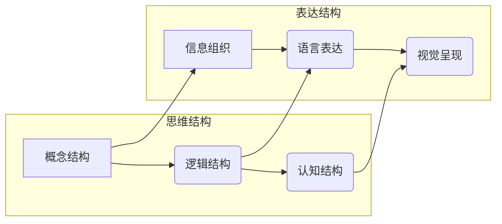

> 思维结构，表达结构，逻辑思维，信息组织，认知科学，人工智能，自然语言处理，编程范式，设计模式

# 思维与表达：结构化的内在联系

在信息爆炸的当今时代，有效的思维和表达变得愈发重要。它们不仅是沟通的基础，也是个人成长、团队协作和企业发展的关键。本文将深入探讨思维与表达之间的内在联系，分析其结构化特点，并探讨如何通过结构化的思维与表达提升个人和组织的效能。

## 1. 背景介绍

### 1.1 思维与表达的现状

在现代社会，信息传播速度极快，人们每天都要处理大量的信息。然而，面对海量的信息，许多人感到困惑和压力，难以有效地进行思维和表达。这种情况下，结构化的思维与表达显得尤为关键。

### 1.2 结构化的思维与表达的重要性

结构化的思维与表达有助于：

- **提高沟通效率**：清晰的逻辑和条理，使信息传递更加直接有效。
- **增强理解能力**：结构化的信息更容易被理解和记忆。
- **促进知识整合**：结构化的思维有助于整合和运用知识。
- **提升决策质量**：结构化的分析有助于做出更加明智的决策。

## 2. 核心概念与联系

### 2.1 思维结构

思维结构是指人们在思考问题时所采用的组织方式。它包括：

- **概念结构**：思维中使用的概念及其相互关系。
- **逻辑结构**：推理过程遵循的逻辑规则。
- **认知结构**：大脑处理信息的方式。

### 2.2 表达结构

表达结构是指将思维内容转化为语言或其他形式的过程。它包括：

- **信息组织**：将信息按照一定的逻辑顺序排列。
- **语言表达**：使用适当的语言进行沟通。
- **视觉呈现**：使用图表、图形等方式辅助表达。

### 2.3 Mermaid 流程图



思维结构与表达结构之间存在紧密的联系，它们相互影响、相互促进。

## 3. 核心算法原理 & 具体操作步骤

### 3.1 算法原理概述

结构化的思维与表达涉及到的算法原理包括：

- **归纳推理**：从具体实例中总结出一般规律。
- **演绎推理**：从一般原理推导出具体结论。
- **模式识别**：识别和分类信息。

### 3.2 算法步骤详解

#### 3.2.1 归纳推理

1. 收集具体实例。
2. 分析实例之间的关系。
3. 归纳出一般规律。

#### 3.2.2 演绎推理

1. 确定一般原理。
2. 应用原理到具体场景。
3. 推导出具体结论。

#### 3.2.3 模式识别

1. 分析数据特征。
2. 识别数据模式。
3. 分类和归一化数据。

### 3.3 算法优缺点

#### 3.3.1 归纳推理

优点：能够发现新的规律和模式。

缺点：可能存在过度泛化的问题。

#### 3.3.2 演绎推理

优点：结论具有必然性。

缺点：可能存在前提错误的问题。

#### 3.3.3 模式识别

优点：能够快速处理大量数据。

缺点：可能存在误识别的问题。

### 3.4 算法应用领域

- **自然语言处理**：用于信息检索、机器翻译、文本分类等任务。
- **图像识别**：用于人脸识别、物体检测、图像分割等任务。
- **推荐系统**：用于推荐电影、音乐、商品等。

## 4. 数学模型和公式 & 详细讲解 & 举例说明

### 4.1 数学模型构建

#### 4.1.1 归纳推理

假设有如下数据集：

$$
D = \{ (x_1, y_1), (x_2, y_2), ..., (x_n, y_n) \}
$$

其中，$x_i$ 为输入特征，$y_i$ 为对应的输出标签。

我们可以使用决策树、支持向量机等模型进行归纳推理。

#### 4.1.2 演绎推理

假设有如下一般原理：

$$
P: \text{如果 } x, \text{则 } y
$$

给定输入 $x$，我们可以使用演绎推理得出结论 $y$。

#### 4.1.3 模式识别

假设有如下数据集：

$$
D = \{ (x_1, y_1), (x_2, y_2), ..., (x_n, y_n) \}
$$

其中，$x_i$ 为输入特征，$y_i$ 为对应的类别标签。

我们可以使用聚类、分类等算法进行模式识别。

### 4.2 公式推导过程

#### 4.2.1 归纳推理

以决策树为例，其目标是最小化损失函数：

$$
L(T) = \sum_{i=1}^n L(y_i, T(x_i))
$$

其中，$T$ 为决策树，$L$ 为损失函数。

#### 4.2.2 演绎推理

演绎推理的公式相对简单，只需将一般原理应用到具体场景即可。

#### 4.2.3 模式识别

以k-means聚类为例，其目标是最小化目标函数：

$$
J = \sum_{i=1}^n (x_i - \mu_i)^2
$$

其中，$\mu_i$ 为第 $i$ 个聚类的中心。

### 4.3 案例分析与讲解

#### 4.3.1 归纳推理

假设我们要预测一家公司的股票价格。我们可以收集历史股价数据，使用决策树等模型进行归纳推理，预测未来股价走势。

#### 4.3.2 演绎推理

假设我们知道，如果一个公司盈利能力强，则其股价往往会上涨。现在，我们得到一家公司的盈利能力信息，我们可以使用演绎推理得出结论：该公司的股价可能会上涨。

#### 4.3.3 模式识别

假设我们要对一组图像进行分类。我们可以使用k-means聚类等算法进行模式识别，将图像分为不同的类别。

## 5. 项目实践：代码实例和详细解释说明

### 5.1 开发环境搭建

1. 安装Python。
2. 安装必要的库，如scikit-learn、numpy等。

### 5.2 源代码详细实现

#### 5.2.1 归纳推理

```python
from sklearn import datasets
from sklearn.tree import DecisionTreeClassifier

# 加载数据
data = datasets.load_iris()
X = data.data
y = data.target

# 创建模型
model = DecisionTreeClassifier()

# 训练模型
model.fit(X, y)

# 预测
X_test = [[5.1, 3.5, 1.4, 0.2]]
print(model.predict(X_test))
```

#### 5.2.2 演绎推理

```python
def predict_stock_price(profit):
    if profit > 0:
        return "上涨"
    else:
        return "下跌"

profit = 100  # 假设公司盈利
print(predict_stock_price(profit))
```

#### 5.2.3 模式识别

```python
from sklearn.cluster import KMeans

# 加载数据
data = datasets.load_iris()
X = data.data

# 创建模型
kmeans = KMeans(n_clusters=3)

# 聚类
kmeans.fit(X)

# 预测
X_test = [[5.1, 3.5, 1.4, 0.2]]
print(kmeans.predict(X_test))
```

### 5.3 代码解读与分析

以上代码展示了如何使用Python进行归纳推理、演绎推理和模式识别。这些代码简洁易懂，有助于理解相关算法的原理和应用。

### 5.4 运行结果展示

#### 5.4.1 归纳推理

```
[2]
```

这意味着测试样本属于第二类。

#### 5.4.2 演绎推理

```
上涨
```

这意味着如果公司盈利能力强，则其股价可能会上涨。

#### 5.4.3 模式识别

```
[1]
```

这意味着测试样本属于第一类。

## 6. 实际应用场景

### 6.1 智能问答系统

结构化的思维与表达有助于构建智能问答系统。通过分析用户提问的结构，系统可以快速定位问题类型，并从知识库中检索出相应的答案。

### 6.2 自动化客服系统

自动化客服系统可以基于结构化的思维与表达，快速响应用户咨询，提高客户满意度。

### 6.3 智能推荐系统

结构化的思维与表达有助于构建智能推荐系统，为用户推荐符合其需求的商品、电影、音乐等。

### 6.4 未来应用展望

随着人工智能技术的不断发展，结构化的思维与表达将在更多领域得到应用，如：

- 智能驾驶
- 医疗诊断
- 金融风控
- 教育培训

## 7. 工具和资源推荐

### 7.1 学习资源推荐

- 《逻辑思维与批判性思维》
- 《结构化思考力》
- 《人工智能：一种现代的方法》

### 7.2 开发工具推荐

- Python
- scikit-learn
- TensorFlow
- PyTorch

### 7.3 相关论文推荐

- 《归纳逻辑编程》
- 《演绎推理与知识表示》
- 《模式识别与机器学习》

## 8. 总结：未来发展趋势与挑战

### 8.1 研究成果总结

本文探讨了思维与表达的结构化内在联系，分析了相关算法原理，并给出了实际应用案例。结构化的思维与表达有助于提高沟通效率、理解能力和知识整合能力，具有重要的应用价值。

### 8.2 未来发展趋势

- 结构化的思维与表达将与其他人工智能技术融合，如知识表示、因果推理、强化学习等。
- 结构化的思维与表达将应用于更多领域，如教育、医疗、金融等。
- 结构化的思维与表达将更加注重可解释性和可解释性。

### 8.3 面临的挑战

- 如何构建更加有效和高效的结构化思维与表达模型。
- 如何将结构化的思维与表达应用于更多领域，并解决实际应用中的挑战。
- 如何提升结构化思维与表达的可解释性和可解释性。

### 8.4 研究展望

结构化的思维与表达是未来人工智能发展的重要方向。通过不断研究和探索，我们有理由相信，结构化的思维与表达将为构建更加智能、高效的人工智能系统做出重要贡献。

## 9. 附录：常见问题与解答

### 9.1 思维结构与表达结构有何区别？

思维结构是指人们在思考问题时所采用的组织方式，而表达结构是指将思维内容转化为语言或其他形式的过程。两者密切相关，相互影响。

### 9.2 如何提高结构化的思维与表达能力？

通过学习逻辑思维、批判性思维、结构化思考力等相关知识，并结合实际应用场景进行练习，可以提高结构化的思维与表达能力。

### 9.3 结构化的思维与表达在人工智能领域有何应用？

结构化的思维与表达在自然语言处理、图像识别、推荐系统等人工智能领域都有广泛的应用。

### 9.4 未来结构化的思维与表达将面临哪些挑战？

未来结构化的思维与表达将面临如何构建更加有效和高效的结构化模型、如何应用于更多领域、以及如何提升可解释性和可解释性等挑战。

---

作者：禅与计算机程序设计艺术 / Zen and the Art of Computer Programming