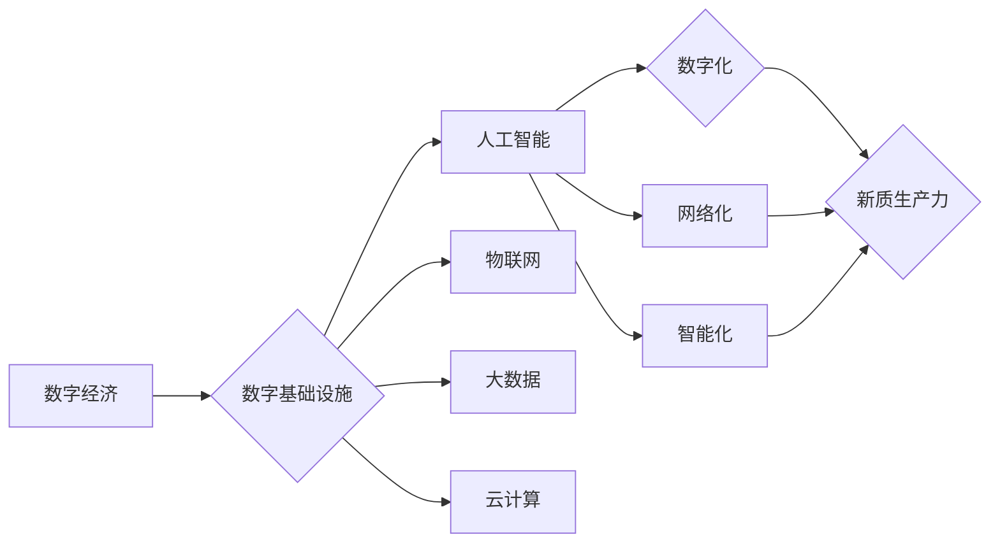

# 数字中国战略与新质生产力的结合点

> 关键词：数字中国，新质生产力，数字经济，人工智能，物联网，大数据，云计算，5G，融合创新

## 1. 背景介绍

在新时代背景下，中国提出了“数字中国”战略，旨在通过数字技术的创新应用，推动经济社会高质量发展。这一战略的实施，将为我国带来新的发展机遇，并促进新质生产力的形成。本文将探讨数字中国战略与新质生产力的结合点，分析其核心概念、原理、操作步骤、应用场景，并展望未来发展趋势与挑战。

### 1.1 数字中国战略的提出

数字中国战略是中国政府为应对新科技革命和产业变革而提出的国家战略。该战略的核心目标是：

- 推动数字经济发展，实现数字经济与实体经济的深度融合。
- 构建数字基础设施，提升信息通信技术基础设施水平。
- 释放数据要素价值，培育发展数据要素市场。
- 促进数字技术创新，提升国家创新能力。
- 加强网络安全保障，维护国家网络安全。

### 1.2 新质生产力的形成

新质生产力是指在新时代背景下，以数字化、网络化、智能化为主要特征的生产力。新质生产力的形成，将带来以下变化：

- 生产方式变革：从传统的劳动密集型、资本密集型向知识密集型转变。
- 产业形态升级：新兴产业蓬勃发展，传统产业转型升级。
- 价值创造方式变革：从要素驱动向创新驱动转变。
- 经济增长动力变革：从投资驱动向创新驱动转变。

### 1.3 数字中国战略与新质生产力的结合点

数字中国战略与新质生产力的结合点主要体现在以下几个方面：

- 数字基础设施建设：为新质生产力提供坚实的物质基础。
- 数据要素市场培育：为新质生产力提供数据资源。
- 数字技术创新：为新质生产力提供技术支撑。
- 产业融合创新：促进新质生产力的形成和发展。

## 2. 核心概念与联系

### 2.1 核心概念原理

数字中国战略的核心概念包括：

- 数字经济：以数据资源为关键要素，以现代信息网络为主要载体，以信息通信技术的有效使用为重要推动力，促进经济结构优化升级的新经济形态。
- 人工智能：模拟、延伸和扩展人的智能的理论、方法、技术及应用系统。
- 物联网：通过信息传感设备，按照约定的协议，将任何物体与网络相连接，进行信息交换和通信，以实现智能化识别、定位、跟踪、监控和管理的一种网络。
- 大数据：从各种各样类型的数据中，快速获得有价值信息的方法。
- 云计算：通过网络提供可伸缩的、便捷的、按需的、廉价的IT基础设施服务。

新质生产力的核心概念包括：

- 数字化：将实体信息转化为数字信息的过程。
- 网络化：通过网络连接，实现信息共享和协同工作。
- 智能化：利用人工智能技术，实现自动化、智能化的生产和管理。

### 2.2 核心概念架构

以下为数字中国战略与新质生产力的核心概念架构图：



## 3. 核心算法原理 & 具体操作步骤

### 3.1 算法原理概述

数字中国战略与新质生产力的结合，需要依托一系列算法和技术。以下列举几个关键算法原理：

- 人工智能算法：如深度学习、强化学习、自然语言处理等。
- 物联网协议：如MQTT、CoAP等。
- 大数据处理算法：如MapReduce、Spark等。
- 云计算技术：如虚拟化、容器化、微服务等。

### 3.2 算法步骤详解

以下以人工智能算法为例，介绍其具体操作步骤：

1. 数据收集：收集相关领域的训练数据。
2. 数据预处理：对收集到的数据进行清洗、标注、归一化等处理。
3. 模型选择：选择合适的机器学习模型。
4. 模型训练：使用训练数据对模型进行训练。
5. 模型评估：使用验证数据对模型性能进行评估。
6. 模型部署：将训练好的模型部署到实际应用场景。

### 3.3 算法优缺点

人工智能算法的优点：

- 强大的数据处理和分析能力。
- 自主学习和适应能力。
- 广泛的应用领域。

人工智能算法的缺点：

- 计算资源消耗大。
- 模型可解释性差。
- 需要大量的标注数据。

### 3.4 算法应用领域

人工智能算法在数字中国战略和新质生产力中的应用领域包括：

- 智能制造：如产品质量检测、生产过程优化等。
- 智能交通：如智能驾驶、智能交通信号控制等。
- 智能医疗：如疾病诊断、药物研发等。
- 智能家居：如智能安防、家电控制等。

## 4. 数学模型和公式 & 详细讲解 & 举例说明

### 4.1 数学模型构建

以下以神经网络为例，介绍其数学模型构建方法：

- 神经网络由多个神经元组成，每个神经元包含一个非线性激活函数和多个权重。
- 神经网络的输出通过加权求和得到。

### 4.2 公式推导过程

设神经网络包含 $L$ 层，第 $l$ 层的输入为 $x_l$，输出为 $y_l$，激活函数为 $\sigma$，则有：

$$
y_l = \sigma(W_{l-1}x_l + b_{l-1}) 
$$

其中，$W_{l-1}$ 为第 $l-1$ 层的权重，$b_{l-1}$ 为第 $l-1$ 层的偏置。

### 4.3 案例分析与讲解

以下以图像分类任务为例，介绍神经网络的应用：

- 数据集：使用ImageNet数据集。
- 模型：使用ResNet50作为基础模型。
- 损失函数：使用交叉熵损失函数。
- 优化器：使用Adam优化器。
- 训练过程：在CIFAR-10数据集上进行训练。

## 5. 项目实践：代码实例和详细解释说明

### 5.1 开发环境搭建

以下是使用Python和TensorFlow搭建开发环境的基本步骤：

1. 安装Anaconda：从官网下载并安装Anaconda。
2. 创建虚拟环境：`conda create -n tensorflow-env python=3.7`
3. 激活虚拟环境：`conda activate tensorflow-env`
4. 安装TensorFlow：`pip install tensorflow`

### 5.2 源代码详细实现

以下为使用TensorFlow实现图像分类任务的代码示例：

```python
import tensorflow as tf
from tensorflow.keras.datasets import cifar10
from tensorflow.keras.models import Sequential
from tensorflow.keras.layers import Dense, Flatten, Conv2D, MaxPooling2D
from tensorflow.keras.optimizers import Adam

# 加载数据
(x_train, y_train), (x_test, y_test) = cifar10.load_data()

# 数据预处理
x_train = x_train.astype('float32') / 255.0
x_test = x_test.astype('float32') / 255.0
y_train = tf.keras.utils.to_categorical(y_train, 10)
y_test = tf.keras.utils.to_categorical(y_test, 10)

# 构建模型
model = Sequential()
model.add(Conv2D(32, (3, 3), activation='relu', input_shape=(32, 32, 3)))
model.add(MaxPooling2D((2, 2)))
model.add(Conv2D(64, (3, 3), activation='relu'))
model.add(MaxPooling2D((2, 2)))
model.add(Conv2D(64, (3, 3), activation='relu'))
model.add(Flatten())
model.add(Dense(64, activation='relu'))
model.add(Dense(10, activation='softmax'))

# 编译模型
model.compile(optimizer=Adam(), loss='categorical_crossentropy', metrics=['accuracy'])

# 训练模型
model.fit(x_train, y_train, batch_size=32, epochs=10, validation_split=0.1)

# 评估模型
test_loss, test_acc = model.evaluate(x_test, y_test)
print('Test accuracy:', test_acc)
```

### 5.3 代码解读与分析

以上代码展示了使用TensorFlow和Keras实现图像分类任务的基本流程：

- 加载数据：使用CIFAR-10数据集进行训练和测试。
- 数据预处理：将数据转换为浮点数，并归一化到[0, 1]区间。
- 构建模型：使用卷积神经网络进行图像分类。
- 编译模型：设置优化器、损失函数和评估指标。
- 训练模型：使用训练数据训练模型，并进行验证。
- 评估模型：使用测试数据评估模型性能。

## 6. 实际应用场景

### 6.1 智能制造

在智能制造领域，数字中国战略和新质生产力发挥着重要作用。以下列举几个典型应用场景：

- 智能生产：通过传感器和控制系统，实时监测生产线状态，实现自动化生产。
- 智能检测：利用图像识别、机器学习等技术，对产品质量进行实时检测。
- 智能维护：通过预测性维护，提前发现设备故障，减少停机时间。

### 6.2 智能交通

在智能交通领域，数字中国战略和新质生产力同样具有重要应用价值。以下列举几个典型应用场景：

- 智能驾驶：利用计算机视觉、传感器、人工智能等技术，实现自动驾驶。
- 智能交通信号控制：根据交通流量和路况，实现智能化的交通信号控制。
- 智能停车：利用物联网、大数据等技术，实现智能化的停车管理。

### 6.3 智能医疗

在智能医疗领域，数字中国战略和新质生产力为医疗行业带来了革命性的变革。以下列举几个典型应用场景：

- 疾病诊断：利用人工智能技术，辅助医生进行疾病诊断。
- 药物研发：利用虚拟现实、大数据等技术，加速新药研发进程。
- 智能健康管理：利用可穿戴设备、健康管理应用等，实现个性化的健康管理。

## 7. 工具和资源推荐

### 7.1 学习资源推荐

以下是学习数字中国战略和新质生产力的学习资源推荐：

- 《人工智能：一种现代的方法》：经典的人工智能教材，适合初学者入门。
- 《深度学习》：介绍深度学习的基本原理和应用，适合有一定基础的读者。
- 《大数据时代》：探讨大数据对社会、经济、政治等方面的影响。
- 《智能时代》：探讨人工智能时代的社会变革。

### 7.2 开发工具推荐

以下是数字中国战略和新质生产力开发工具推荐：

- TensorFlow：开源的机器学习框架，适用于各种深度学习任务。
- PyTorch：开源的机器学习框架，具有灵活的动态计算图。
- Keras：基于Theano和TensorFlow的开源机器学习库，易于使用。
- OpenCV：开源的计算机视觉库，提供了丰富的图像处理和计算机视觉算法。
- Hadoop：开源的大数据处理框架，适用于大规模数据集的处理。

### 7.3 相关论文推荐

以下是数字中国战略和新质生产力相关论文推荐：

- 《深度学习》：Goodfellow et al. (2016)
- 《人工智能：一种现代的方法》：Stuart Russell and Peter Norvig (2020)
- 《大数据时代》：Seth Grimes (2013)
- 《智能时代》：吴军 (2017)

## 8. 总结：未来发展趋势与挑战

### 8.1 研究成果总结

数字中国战略与新质生产力的结合，为我国经济社会发展带来了新的机遇。通过人工智能、物联网、大数据、云计算等数字技术的创新应用，我国经济社会发展将实现新的突破。

### 8.2 未来发展趋势

未来，数字中国战略与新质生产力的结合将呈现以下发展趋势：

- 数字基础设施更加完善，覆盖范围更广。
- 数字经济规模不断扩大，与实体经济深度融合。
- 人工智能技术不断进步，应用领域不断拓展。
- 物联网设备数量持续增长，应用场景不断丰富。
- 大数据技术深入发展，数据要素市场逐步完善。

### 8.3 面临的挑战

在数字中国战略与新质生产力的发展过程中，我国也面临着以下挑战：

- 数字鸿沟：城乡、区域之间数字发展不平衡。
- 数据安全：数据泄露、隐私侵犯等问题日益突出。
- 技术人才：高素质数字人才短缺。
- 法律法规：数字经济发展需要相应的法律法规支撑。

### 8.4 研究展望

面对未来挑战，我国应采取以下措施：

- 加大数字基础设施建设力度，缩小城乡、区域数字鸿沟。
- 加强数据安全和个人隐私保护，建立完善的数据安全法规。
- 加快培养数字人才，提升全民数字素养。
- 完善数字经济发展法规，营造良好的数字经济发展环境。

相信在政府、企业、高校和社会各界的共同努力下，数字中国战略与新质生产力必将为我国经济社会发展注入新的活力，实现高质量发展。

## 9. 附录：常见问题与解答

**Q1：什么是数字中国战略？**

A：数字中国战略是中国政府为应对新科技革命和产业变革而提出的国家战略，旨在通过数字技术的创新应用，推动经济社会高质量发展。

**Q2：新质生产力的特征是什么？**

A：新质生产力是指在新时代背景下，以数字化、网络化、智能化为主要特征的生产力。

**Q3：数字中国战略与新质生产力的结合点有哪些？**

A：数字中国战略与新质生产力的结合点主要体现在数字基础设施建设、数据要素市场培育、数字技术创新、产业融合创新等方面。

**Q4：人工智能在数字中国战略和新质生产力中扮演什么角色？**

A：人工智能是数字中国战略和新质生产力的核心驱动力之一，能够为经济社会发展提供强大的技术支撑。

**Q5：如何应对数字中国战略和新质生产力发展中的挑战？**

A：应对数字中国战略和新质生产力发展中的挑战，需要政府、企业、高校和社会各界共同努力，加大投入，完善法规，提升全民数字素养。

---

作者：禅与计算机程序设计艺术 / Zen and the Art of Computer Programming