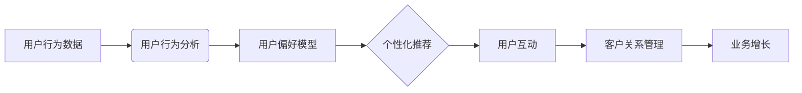

# 数据驱动的最佳实践: Booking.com的发展秘籍

> 关键词：数据驱动，Booking.com，机器学习，预测建模，用户行为分析，个性化推荐，客户关系管理，业务增长

## 1. 背景介绍

在当今的商业环境中，数据已经成为企业决策的关键驱动力。Booking.com，作为全球领先的在线酒店预订平台，其成功在很大程度上归功于其数据驱动的方法和最佳实践。本文将深入探讨Booking.com如何利用数据来驱动业务增长，以及其背后的核心概念和操作步骤。

### 1.1 问题的由来

随着互联网和电子商务的兴起，数据已经成为企业竞争的核心资产。Booking.com面临着不断变化的用户需求、竞争压力和全球市场的复杂性。为了保持领先地位，Booking.com必须利用数据来优化决策过程，提高运营效率，并为客户提供卓越的服务。

### 1.2 研究现状

Booking.com的数据驱动方法涵盖了多个方面，包括用户行为分析、预测建模、个性化推荐、客户关系管理等。这些方法不仅帮助Booking.com提升了用户体验，还显著增加了收入和市场份额。

### 1.3 研究意义

本文旨在分享Booking.com的数据驱动最佳实践，为其他企业提供可借鉴的经验。通过分析Booking.com的成功案例，我们可以了解如何利用数据来驱动业务增长，并在竞争激烈的市场中取得优势。

### 1.4 本文结构

本文将分为以下几个部分：
- 核心概念与联系
- 核心算法原理 & 具体操作步骤
- 数学模型和公式 & 详细讲解 & 举例说明
- 项目实践：代码实例和详细解释说明
- 实际应用场景
- 工具和资源推荐
- 总结：未来发展趋势与挑战
- 附录：常见问题与解答

## 2. 核心概念与联系

### 2.1 核心概念

- **用户行为分析**：通过收集和分析用户在网站上的行为数据，了解用户偏好和需求。
- **预测建模**：使用机器学习算法预测未来事件或趋势。
- **个性化推荐**：根据用户行为和偏好，为用户提供个性化的内容或服务。
- **客户关系管理**：通过数据分析来提高客户满意度和忠诚度。

### 2.2 架构的 Mermaid 流程图



## 3. 核心算法原理 & 具体操作步骤

### 3.1 算法原理概述

Booking.com的数据驱动方法基于以下核心算法原理：

- **聚类算法**：用于将用户行为数据分组，以便更好地理解用户群体。
- **分类算法**：用于预测用户行为，如预订概率、客户流失风险等。
- **关联规则学习**：用于发现用户行为之间的关联性，如用户可能同时预订酒店和机票。

### 3.2 算法步骤详解

1. **数据收集**：从网站日志、用户反馈和第三方数据源收集数据。
2. **数据预处理**：清洗和整合数据，以便进行分析。
3. **特征工程**：创建有助于模型学习的特征。
4. **模型训练**：使用机器学习算法训练模型。
5. **模型评估**：评估模型的性能。
6. **模型部署**：将模型应用于实际业务场景。

### 3.3 算法优缺点

**优点**：
- 提高决策质量
- 优化运营效率
- 增强用户体验
- 提升客户满意度

**缺点**：
- 数据质量要求高
- 模型训练成本高
- 需要专业数据科学家

### 3.4 算法应用领域

- 用户行为分析
- 预测建模
- 个性化推荐
- 客户关系管理
- 营销活动优化

## 4. 数学模型和公式 & 详细讲解 & 举例说明

### 4.1 数学模型构建

在Booking.com，常用的数学模型包括：

- **逻辑回归**：用于预测二元分类事件，如用户是否会预订。
- **决策树**：用于分类和回归任务，易于理解和解释。
- **随机森林**：结合了决策树的优点，能够处理复杂数据。

### 4.2 公式推导过程

以逻辑回归为例，其损失函数为：

$$
L(\theta) = -\frac{1}{m} \sum_{i=1}^{m} [y^{(i)} \log(\hat{h}_{\theta}(x^{(i)})) + (1 - y^{(i)}) \log(1 - \hat{h}_{\theta}(x^{(i)}))]
$$

其中，$\theta$ 为模型参数，$m$ 为样本数量，$y^{(i)}$ 为真实标签，$\hat{h}_{\theta}(x^{(i)})$ 为模型预测的概率。

### 4.3 案例分析与讲解

假设Booking.com想要预测用户是否会预订酒店。他们收集了以下特征：

- 用户年龄
- 用户性别
- 用户预订历史
- 酒店价格
- 酒店评分

使用逻辑回归模型进行训练，最终得到的模型能够预测用户预订酒店的概率。

## 5. 项目实践：代码实例和详细解释说明

### 5.1 开发环境搭建

为了进行项目实践，我们需要以下开发环境：

- Python
- Jupyter Notebook
- scikit-learn
- pandas
- matplotlib

### 5.2 源代码详细实现

以下是一个简单的逻辑回归模型实现：

```python
from sklearn.linear_model import LogisticRegression

# 加载数据
X = df[['年龄', '性别', '预订历史', '价格', '评分']]
y = df['预订']

# 创建逻辑回归模型
model = LogisticRegression()

# 训练模型
model.fit(X, y)

# 预测
predictions = model.predict(X)
```

### 5.3 代码解读与分析

这段代码使用scikit-learn库中的逻辑回归模型进行训练和预测。我们首先加载了包含用户特征和预订标签的数据集，然后创建了一个逻辑回归模型，接着使用训练数据对其进行训练，最后使用训练好的模型对新的数据进行预测。

### 5.4 运行结果展示

通过运行上述代码，我们可以得到每个用户的预订概率。这些概率可以用于个性化推荐或营销活动。

## 6. 实际应用场景

Booking.com利用数据驱动的方法在以下场景中取得了成功：

- **个性化推荐**：根据用户行为和偏好，推荐相关的酒店。
- **价格优化**：根据供需情况和用户行为，动态调整酒店价格。
- **客户关系管理**：通过数据分析识别高价值客户，并提供定制化的服务。
- **营销活动**：根据用户行为和偏好，设计有效的营销活动。

## 7. 工具和资源推荐

### 7.1 学习资源推荐

- 《Python数据科学手册》
- 《机器学习实战》
- 《数据科学入门》
- Coursera上的数据科学和机器学习课程

### 7.2 开发工具推荐

- Jupyter Notebook
- scikit-learn
- pandas
- matplotlib
- TensorFlow
- PyTorch

### 7.3 相关论文推荐

- "Online Learning for Large Scale Recommendation Systems" by John Langford and Lihong Li
- "Matrix Factorization Techniques for Recommender Systems" by Yehuda Koren
- "A Probabilistic Framework for User Modeling and Profile Tracing in Collaborative Filtering" by Charu Aggarwal and Charles A. Clarke

## 8. 总结：未来发展趋势与挑战

### 8.1 研究成果总结

本文介绍了Booking.com的数据驱动最佳实践，包括用户行为分析、预测建模、个性化推荐和客户关系管理。通过分析Booking.com的成功案例，我们了解了如何利用数据来驱动业务增长。

### 8.2 未来发展趋势

- **自动化和智能化**：数据分析和机器学习技术将更加自动化和智能化，降低对专业知识的依赖。
- **多模态数据分析**：结合文本、图像和视频等多模态数据，提供更全面的分析。
- **边缘计算**：在边缘设备上进行分析和决策，提高实时性和响应速度。

### 8.3 面临的挑战

- **数据质量**：确保数据的质量和可靠性是数据驱动的关键。
- **数据隐私**：保护用户数据隐私是企业和政府的共同责任。
- **算法偏见**：确保算法的公平性和无偏见性。

### 8.4 研究展望

未来，数据驱动的方法将在更多行业中得到应用，推动企业创新和业务增长。

## 9. 附录：常见问题与解答

**Q1：数据驱动的方法是否适用于所有企业？**

A：数据驱动的方法适用于所有行业和企业，但需要根据企业的具体情况和资源进行定制。

**Q2：如何确保数据的质量？**

A：确保数据质量的关键是数据清洗、数据整合和数据监控。

**Q3：如何处理数据隐私问题？**

A：遵守数据保护法规，使用匿名化和加密技术保护用户数据。

**Q4：如何确保算法的公平性？**

A：通过数据采样、偏差检测和模型解释等技术确保算法的公平性。

**Q5：数据驱动的方法需要哪些技术？**

A：数据驱动的方法需要Python、机器学习、数据分析和数据库等技术。

作者：禅与计算机程序设计艺术 / Zen and the Art of Computer Programming