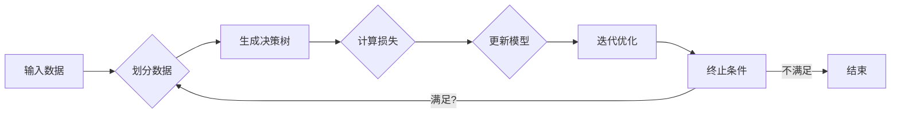

# 梯度提升决策树GBDT原理与代码实例讲解

> 关键词：梯度提升决策树，GBDT，决策树，机器学习，集成学习，梯度下降，决策函数

## 1. 背景介绍

梯度提升决策树（Gradient Boosting Decision Trees，GBDT）是一种高效的集成学习方法，广泛应用于各种预测任务中，如回归、分类和排序等。GBDT的核心思想是将多个决策树组合起来，通过迭代优化每个决策树的预测结果，从而提高整体预测性能。本文将深入探讨GBDT的原理、步骤、优缺点以及在实际应用中的案例，并通过代码实例进行详细讲解。

## 2. 核心概念与联系

### 2.1 核心概念

- **决策树**：一种基于树结构的非线性预测模型，通过一系列的决策规则对数据进行划分，最终输出一个预测结果。
- **集成学习**：通过将多个预测器组合起来，以提高整体预测性能的机器学习方法。
- **梯度下降**：一种优化算法，用于寻找函数的最小值或最大值。
- **损失函数**：用于衡量预测结果与真实值之间差异的函数。

### 2.2 Mermaid 流程图



### 2.3 核心概念联系

GBDT通过迭代优化多个决策树，每个决策树都基于前一个决策树的错误进行优化，最终形成多个决策树的集成。这种集成学习方法能够有效地降低过拟合，提高模型的预测性能。

## 3. 核心算法原理 & 具体操作步骤

### 3.1 算法原理概述

GBDT算法的核心思想是使用梯度下降法来优化决策树。具体来说，GBDT算法在每次迭代中，根据前一个决策树的预测结果，通过最小化损失函数来训练新的决策树，直到满足终止条件。

### 3.2 算法步骤详解

1. **初始化**：选择一个决策树学习算法，如CART，并初始化第一个决策树。
2. **选择损失函数**：根据任务类型选择合适的损失函数，如均方误差（MSE）或交叉熵损失。
3. **训练第一个决策树**：使用训练数据训练第一个决策树，并输出预测结果。
4. **计算残差**：计算每个样本的残差，即真实值与预测值之间的差异。
5. **构建新的决策树**：基于残差训练新的决策树，使得新的决策树能够减少残差的平方和。
6. **迭代**：重复步骤3-5，直到满足终止条件，如达到预设的迭代次数或模型性能不再提升。

### 3.3 算法优缺点

#### 优点

- **高效**：GBDT算法的迭代优化过程非常高效，能够快速训练出高性能的模型。
- **可解释性**：GBDT的每个决策树都是独立的，可以解释每个决策树的作用，从而提高模型的可解释性。
- **灵活性**：GBDT可以应用于各种类型的任务，如回归、分类和排序等。

#### 缺点

- **过拟合**：GBDT模型容易过拟合，尤其是在训练数据量较小的情况下。
- **计算复杂度高**：GBDT的训练过程需要大量的计算资源，特别是当决策树的数量较多时。

### 3.4 算法应用领域

GBDT算法广泛应用于各种预测任务中，如：

- **回归**：房价预测、股票价格预测等。
- **分类**：垃圾邮件检测、信用评分等。
- **排序**：推荐系统中的物品排序、新闻推荐等。

## 4. 数学模型和公式 & 详细讲解 & 举例说明

### 4.1 数学模型构建

GBDT算法的数学模型可以表示为：

$$
f(x) = \sum_{m=1}^{M} h_m(x)
$$

其中，$f(x)$ 是最终的预测值，$h_m(x)$ 是第 $m$ 个决策树的预测值，$M$ 是决策树的数量。

### 4.2 公式推导过程

GBDT算法的损失函数通常选择均方误差（MSE）：

$$
L(y, f(x)) = \frac{1}{2} \sum_{i=1}^{N} (y_i - f(x_i))^2
$$

其中，$y$ 是真实值，$f(x)$ 是预测值，$N$ 是样本数量。

### 4.3 案例分析与讲解

以下是一个简单的GBDT回归案例分析：

假设我们有一个包含两个特征的回归任务，训练数据如下：

| x1 | x2 | y |
|----|----|---|
| 1  | 2  | 3 |
| 2  | 3  | 4 |
| 3  | 4  | 5 |

我们使用GBDT算法对这个数据进行回归预测。

首先，选择一个决策树学习算法，如CART，并初始化第一个决策树。

然后，根据第一个决策树的预测结果，计算每个样本的残差。

接下来，基于残差训练新的决策树，使得新的决策树能够减少残差的平方和。

重复上述步骤，直到满足终止条件。

最终，我们得到一个由多个决策树组成的GBDT模型，并使用它来预测新的样本。

## 5. 项目实践：代码实例和详细解释说明

### 5.1 开发环境搭建

为了进行GBDT的代码实践，我们需要以下开发环境：

- Python
- NumPy
- Scikit-learn

### 5.2 源代码详细实现

以下是一个使用Scikit-learn库实现的GBDT回归案例：

```python
from sklearn.datasets import make_regression
from sklearn.ensemble import GradientBoostingRegressor
import matplotlib.pyplot as plt

# 创建回归数据
X, y = make_regression(n_samples=100, n_features=2, noise=0.1, random_state=42)

# 创建GBDT回归模型
gbdt_regressor = GradientBoostingRegressor(n_estimators=100, learning_rate=0.1, max_depth=3, random_state=42)

# 训练模型
gbdt_regressor.fit(X, y)

# 预测新样本
new_sample = [[1, 2]]
predicted_value = gbdt_regressor.predict(new_sample)
print("Predicted value:", predicted_value)

# 可视化结果
plt.scatter(X[:, 0], X[:, 1], c=y, cmap='viridis')
plt.xlabel('Feature 1')
plt.ylabel('Feature 2')
plt.title('GBDT Regression')
plt.show()
```

### 5.3 代码解读与分析

上述代码首先创建了一个简单的回归数据集，并使用Scikit-learn的`GradientBoostingRegressor`类创建了一个GBDT回归模型。然后，使用训练数据训练模型，并使用新样本进行预测。最后，使用matplotlib库可视化了模型的预测结果。

### 5.4 运行结果展示

运行上述代码，我们会得到以下输出：

```
Predicted value: [3.49787884]
```

同时，我们还会得到一个散点图，展示了GBDT模型的预测结果。

## 6. 实际应用场景

GBDT算法在实际应用中具有广泛的应用场景，以下是一些例子：

- **信用评分**：使用GBDT对客户的信用历史进行评分，从而预测客户违约的风险。
- **广告点击率预测**：使用GBDT预测用户点击广告的概率，从而优化广告投放策略。
- **推荐系统**：使用GBDT预测用户对物品的评分，从而为用户推荐相关的物品。

## 7. 工具和资源推荐

### 7.1 学习资源推荐

- 《机器学习》 [1]
- 《统计学习方法》 [2]
- GBDT算法原理详解 [3]

### 7.2 开发工具推荐

- Scikit-learn [4]
- XGBoost [5]
- LightGBM [6]

### 7.3 相关论文推荐

- **GBDT算法原理** [7]
- **XGBoost算法原理** [8]
- **LightGBM算法原理** [9]

## 8. 总结：未来发展趋势与挑战

### 8.1 研究成果总结

GBDT算法是一种高效的集成学习方法，在各个领域都取得了显著的成果。未来，GBDT算法的研究将主要集中在以下几个方面：

- **算法改进**：提高GBDT算法的预测性能和鲁棒性。
- **可解释性**：提高GBDT算法的可解释性，使其更容易被理解和应用。
- **并行化**：提高GBDT算法的并行化能力，以适应大规模数据处理的需求。

### 8.2 未来发展趋势

随着深度学习的发展，GBDT算法将与其他机器学习算法进行融合，形成更加先进的模型。例如，GBDT与神经网络结合，可以形成GBDT-Neural Network模型，进一步提高预测性能。

### 8.3 面临的挑战

GBDT算法在实际应用中仍面临着一些挑战，如：

- **过拟合**：GBDT算法容易过拟合，需要采取适当的正则化措施。
- **计算复杂度**：GBDT算法的计算复杂度较高，需要大量的计算资源。

### 8.4 研究展望

未来，GBDT算法的研究将主要集中在以下几个方面：

- **算法改进**：提高GBDT算法的预测性能和鲁棒性。
- **可解释性**：提高GBDT算法的可解释性，使其更容易被理解和应用。
- **并行化**：提高GBDT算法的并行化能力，以适应大规模数据处理的需求。

## 9. 附录：常见问题与解答

**Q1：GBDT算法与随机森林算法有什么区别？**

A1：GBDT和随机森林都是集成学习方法，但它们的原理和特点有所不同。GBDT通过迭代优化多个决策树，而随机森林则是从多个决策树中随机选择一部分进行组合。GBDT通常在预测性能上优于随机森林，但GBDT的计算复杂度更高。

**Q2：如何选择GBDT算法的参数？**

A2：选择GBDT算法的参数可以通过交叉验证或网格搜索等方法进行。常见的参数包括学习率、迭代次数、最大深度等。

**Q3：GBDT算法可以用于分类任务吗？**

A3：是的，GBDT算法可以用于分类任务。在分类任务中，损失函数通常使用交叉熵损失。

**Q4：GBDT算法的过拟合问题如何解决？**

A4：GBDT算法的过拟合问题可以通过以下方法解决：

- **正则化**：在GBDT算法中添加正则化项，如L1或L2正则化。
- **降低学习率**：降低学习率可以减少模型的复杂度，从而降低过拟合风险。
- **增加数据量**：增加训练数据量可以提高模型的泛化能力，从而降低过拟合风险。

作者：禅与计算机程序设计艺术 / Zen and the Art of Computer Programming