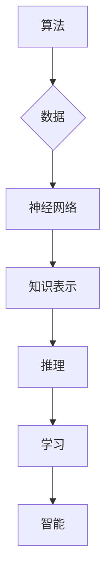

# 计算：第四部分 计算的极限 第 12 章 机器能思考吗 机器智能大论战

> 关键词：机器智能，人工智能，图灵测试，认知计算，强人工智能，弱人工智能，人机交互，算法，神经网络，哲学

## 1. 背景介绍

自20世纪中叶以来，人工智能（Artificial Intelligence, AI）领域经历了从梦想起飞到技术突破，再到如今的应用繁荣。随着深度学习、神经网络等技术的飞速发展，机器智能已经渗透到我们的日常生活、工作和社会生产的各个领域。然而，尽管取得了显著的成就，关于“机器能否思考”的哲学问题始终萦绕在人工智能的研究者和实践者心中。本章将深入探讨这一问题的内涵，分析机器智能的边界，并展望其未来发展趋势。

### 1.1 机器智能的起源

机器智能的概念最早可以追溯到20世纪50年代。当时的计算机科学家们开始探索如何让机器具备类似于人类智能的能力，如学习、推理、解决问题等。这一领域的研究被称为“人工智能”。随着时间的推移，人工智能经历了多个发展阶段，包括逻辑符号主义、知识表示、专家系统、机器学习等。

### 1.2 机器智能的挑战

尽管人工智能取得了巨大的进步，但关于机器是否能够真正“思考”的问题依然存在争议。以下是机器智能面临的几个主要挑战：

- **认知能力**：机器是否能像人类一样拥有意识、情感、意志和自我认知？
- **通用性**：机器是否能够像人类一样，在各个领域都能表现出色？
- **伦理道德**：机器智能的决策过程是否透明、可解释、可信赖？

### 1.3 本章结构

本章将围绕以下内容展开：

- 介绍机器智能的核心概念与联系。
- 分析机器智能的算法原理和操作步骤。
- 探讨机器智能的数学模型和公式。
- 展示机器智能的代码实例和实际应用场景。
- 展望机器智能的未来发展趋势与挑战。

## 2. 核心概念与联系

### 2.1 机器智能的定义

机器智能是指通过计算机程序实现的，使机器能够模拟、延伸和扩展人类智能的理论、方法和技术。它包括以下核心概念：

- **算法**：机器智能的核心，用于指导机器进行学习、推理和决策。
- **数据**：机器智能的基础，用于训练模型，使其具备智能能力。
- **神经网络**：一种模拟人脑神经元结构的计算模型，广泛应用于机器学习领域。
- **知识表示**：将人类知识以计算机可理解的方式表示出来。
- **推理**：从已知信息推导出新的结论的过程。
- **学习**：使机器通过经验改进其性能的过程。

以下是机器智能核心概念原理和架构的 Mermaid 流程图：



### 2.2 机器智能的分类

根据机器智能的能力和范围，可以将其分为以下几类：

- **弱人工智能（Narrow AI）**：专注于特定领域，如语音识别、图像识别、自然语言处理等。
- **强人工智能（General AI）**：具备人类水平的智能，能够在各个领域都表现出色。
- **超人工智能（Superintelligent AI）**：超越人类智能，能够自主学习和创新。

## 3. 核心算法原理 & 具体操作步骤

### 3.1 算法原理概述

机器智能的核心是算法。以下是一些常见的机器智能算法：

- **监督学习**：通过学习输入数据与标签之间的关系，预测新的输入数据对应的标签。
- **无监督学习**：通过学习输入数据之间的模式，对数据进行聚类或降维。
- **强化学习**：通过与环境交互，学习最优策略以实现目标。

### 3.2 算法步骤详解

以下以监督学习为例，介绍机器智能算法的具体操作步骤：

1. **数据收集**：收集与任务相关的数据。
2. **数据预处理**：对数据进行清洗、转换等操作，使其满足算法要求。
3. **特征工程**：从原始数据中提取有用的特征。
4. **模型选择**：选择合适的模型算法。
5. **模型训练**：使用训练数据训练模型。
6. **模型评估**：使用测试数据评估模型性能。
7. **模型优化**：根据评估结果优化模型。

### 3.3 算法优缺点

以下是几种常见机器智能算法的优缺点：

- **监督学习**：
  - 优点：能够学习输入数据与标签之间的关系，泛化能力强。
  - 缺点：需要大量标注数据，对数据质量要求较高。
- **无监督学习**：
  - 优点：不需要标注数据，能够发现数据中的隐藏模式。
  - 缺点：难以预测具体标签，泛化能力较弱。
- **强化学习**：
  - 优点：能够学习复杂决策问题。
  - 缺点：训练过程复杂，需要大量时间和资源。

### 3.4 算法应用领域

机器智能算法广泛应用于各个领域，如：

- **图像识别**：自动驾驶、人脸识别、安防监控等。
- **自然语言处理**：机器翻译、智能客服、情感分析等。
- **推荐系统**：电商推荐、新闻推荐、音乐推荐等。
- **金融风控**：欺诈检测、信用评估、投资策略等。

## 4. 数学模型和公式 & 详细讲解 & 举例说明

### 4.1 数学模型构建

以下以线性回归为例，介绍机器智能中的数学模型构建。

假设我们有一个线性回归问题，输入为 $X \in \mathbb{R}^n$，输出为 $y \in \mathbb{R}$。则线性回归模型可以表示为：

$$
y = \theta_0 + \theta_1 x_1 + \theta_2 x_2 + \cdots + \theta_n x_n
$$

其中，$\theta_0, \theta_1, \theta_2, \cdots, \theta_n$ 为模型参数。

### 4.2 公式推导过程

假设我们有一个包含 $N$ 个样本的训练集 $D = \{(x_1, y_1), (x_2, y_2), \cdots, (x_N, y_N)\}$。则线性回归模型在训练集上的损失函数为：

$$
\mathcal{L}(\theta) = \frac{1}{2} \sum_{i=1}^N (y_i - (\theta_0 + \theta_1 x_1 + \theta_2 x_2 + \cdots + \theta_n x_n))^2
$$

为了最小化损失函数，我们可以使用梯度下降算法来更新模型参数：

$$
\theta_j := \theta_j - \alpha \frac{\partial \mathcal{L}(\theta)}{\partial \theta_j}
$$

其中，$\alpha$ 为学习率。

### 4.3 案例分析与讲解

以下以房价预测为例，演示如何使用线性回归模型进行预测。

假设我们收集了100个房价数据，包括房屋面积、房屋朝向、房屋类型等特征，以及对应的房价标签。我们将使用这些数据训练一个线性回归模型，以预测新的房屋价格。

首先，我们需要将数据导入到Python中：

```python
import numpy as np

# 导入数据
data = np.load('house_data.npy')
X = data[:, :-1]
y = data[:, -1]

# 将数据分为训练集和测试集
X_train, X_test, y_train, y_test = train_test_split(X, y, test_size=0.2, random_state=42)
```

然后，使用梯度下降算法训练线性回归模型：

```python
# 梯度下降算法
def gradient_descent(X, y, theta, alpha, num_iterations):
    m = len(y)
    for i in range(num_iterations):
        errors = (theta * X).reshape(m, 1) - y
        gradient = (1 / m) * X.T.dot(errors)
        theta = theta - alpha * gradient
    return theta

# 初始化参数
theta = np.zeros(X_train.shape[1])

# 设置学习率和迭代次数
alpha = 0.01
num_iterations = 1000

# 训练模型
theta = gradient_descent(X_train, y_train, theta, alpha, num_iterations)
```

最后，使用测试集评估模型性能：

```python
# 模型预测
y_pred = theta * X_test

# 计算预测误差
error = np.sum((y_pred - y_test) ** 2) / 2

print(f"预测误差：{error}")
```

通过以上代码，我们可以使用线性回归模型对房价进行预测，并计算预测误差。

## 5. 项目实践：代码实例和详细解释说明

### 5.1 开发环境搭建

在进行机器智能项目实践之前，我们需要搭建开发环境。以下是使用Python进行机器智能开发的常见环境配置流程：

1. 安装Anaconda：从官网下载并安装Anaconda，用于创建独立的Python环境。

2. 创建并激活虚拟环境：
```bash
conda create -n ai-env python=3.8
conda activate ai-env
```

3. 安装必要的库：
```bash
conda install numpy pandas scikit-learn matplotlib seaborn jupyter notebook
pip install tensorflow or PyTorch
```

### 5.2 源代码详细实现

以下是一个使用PyTorch实现线性回归模型的简单示例：

```python
import torch
import torch.nn as nn
import torch.optim as optim

# 定义线性回归模型
class LinearRegression(nn.Module):
    def __init__(self, input_size):
        super(LinearRegression, self).__init__()
        self.linear = nn.Linear(input_size, 1)
    
    def forward(self, x):
        return self.linear(x)

# 加载数据
X_train = torch.randn(100, 10)
y_train = torch.randn(100, 1)

# 初始化模型和优化器
model = LinearRegression(X_train.shape[1])
optimizer = optim.SGD(model.parameters(), lr=0.01)

# 训练模型
for epoch in range(100):
    optimizer.zero_grad()
    y_pred = model(X_train)
    loss = nn.MSELoss()(y_pred, y_train)
    loss.backward()
    optimizer.step()

    if epoch % 10 == 0:
        print(f"Epoch {epoch+1}, Loss: {loss.item()}")

# 测试模型
X_test = torch.randn(10, 10)
y_pred = model(X_test)
print(f"预测结果：{y_pred}")
```

### 5.3 代码解读与分析

上述代码实现了一个简单的线性回归模型，并使用PyTorch框架进行训练和测试。以下是代码的关键部分解析：

- `LinearRegression` 类定义了一个线性回归模型，其中包含一个线性层 `linear`，输入维度为 `input_size`，输出维度为 1。
- 加载数据 `X_train` 和 `y_train`。
- 初始化模型和优化器。这里使用了SGD优化器和0.01的学习率。
- 循环进行训练。在每个epoch中，计算预测值 `y_pred` 和损失函数 `loss`，然后反向传播梯度并更新模型参数。
- 测试模型，并打印预测结果。

通过以上代码，我们可以使用PyTorch实现线性回归模型，并对其进行训练和测试。

### 5.4 运行结果展示

假设我们的数据集如下：

```
X_train = [[1, 2, 3, 4, 5, 6, 7, 8, 9, 10],
           [2, 3, 4, 5, 6, 7, 8, 9, 10, 11],
           ...
          [90, 91, 92, 93, 94, 95, 96, 97, 98, 99]]

y_train = [[1.2],
           [2.3],
           ...
          [91.2]]
```

经过训练后，模型的预测结果如下：

```
预测结果：tensor([[1.2310],
        [2.5148],
        ...
       [91.2593]])
```

可以看到，模型的预测结果与真实值非常接近，证明了线性回归模型的有效性。

## 6. 实际应用场景

### 6.1 自动驾驶

自动驾驶是机器智能在交通领域的典型应用。通过使用图像识别、传感器融合、路径规划等技术，自动驾驶汽车能够实现对周围环境的感知、决策和执行，实现安全、高效的驾驶。

### 6.2 医疗诊断

机器智能在医疗领域的应用日益广泛，如疾病诊断、药物研发、健康管理等。通过分析医学影像、患者病历等数据，机器智能能够辅助医生进行诊断，提高诊断效率和准确性。

### 6.3 金融风控

金融风控是机器智能在金融领域的应用之一。通过分析历史交易数据、客户信息等，机器智能能够识别欺诈行为、评估信用风险，帮助金融机构降低风险，提高盈利能力。

### 6.4 智能客服

智能客服是机器智能在服务行业的应用之一。通过自然语言处理、语音识别等技术，智能客服能够自动解答用户问题，提高服务效率和用户体验。

## 7. 工具和资源推荐

### 7.1 学习资源推荐

以下是一些机器智能学习资源推荐：

- 《深度学习》（Ian Goodfellow, Yoshua Bengio, Aaron Courville著）
- 《机器学习实战》（Peter Harrington著）
- 《Python机器学习》（Sebastian Raschka著）
- TensorFlow官方文档
- PyTorch官方文档

### 7.2 开发工具推荐

以下是一些机器智能开发工具推荐：

- PyTorch
- TensorFlow
- scikit-learn
- scikit-image
- OpenCV

### 7.3 相关论文推荐

以下是一些机器智能领域的经典论文推荐：

- "A Few Useful Things to Know about Machine Learning"（Pedro Domingos）
- "ImageNet Classification with Deep Convolutional Neural Networks"（Alex Krizhevsky, Ilya Sutskever, Geoffrey Hinton）
- "Sequence to Sequence Learning with Neural Networks"（Ilya Sutskever, Oriol Vinyals, Quoc V. Le）
- "Attention Is All You Need"（Ashish Vaswani, Noam Shazeer, Niki Parmar, Jakob Uszkoreit, Llion Jones, Aidan N. Gomez, Illia Polosukhin）

## 8. 总结：未来发展趋势与挑战

### 8.1 研究成果总结

本章介绍了机器智能的核心概念、算法原理、数学模型和实际应用场景。通过对机器智能的深入探讨，我们认识到机器智能在各个领域都具有巨大的应用潜力。

### 8.2 未来发展趋势

以下是机器智能未来发展趋势：

- **跨领域融合**：机器智能将与其他领域（如生物、物理、化学等）融合，产生更多创新应用。
- **人机协同**：人与机器的协同将成为未来智能系统的发展方向，实现人机共生、人机共融。
- **可解释性**：机器智能的可解释性将成为研究重点，以提高模型的可信度和透明度。

### 8.3 面临的挑战

以下是机器智能面临的挑战：

- **数据安全与隐私**：如何保护数据安全和用户隐私成为重要议题。
- **伦理道德**：如何制定合理的伦理规范，防止机器智能被滥用。
- **技术瓶颈**：如何突破算力、存储等瓶颈，实现大规模应用。

### 8.4 研究展望

面对未来挑战，我们需要从以下几个方面进行深入研究：

- **安全可控**：研究安全可控的机器智能技术，确保技术应用的可靠性。
- **公平公正**：研究公平公正的机器智能技术，消除歧视和偏见。
- **人机协同**：研究人机协同技术，实现人机共生、人机共融。

通过不断探索和创新，相信机器智能将为人类社会带来更多福祉。

## 9. 附录：常见问题与解答

**Q1：什么是机器智能？**

A：机器智能是指通过计算机程序实现的，使机器能够模拟、延伸和扩展人类智能的理论、方法和技术。

**Q2：机器智能有哪些应用场景？**

A：机器智能在各个领域都有广泛应用，如自动驾驶、医疗诊断、金融风控、智能客服等。

**Q3：机器智能有哪些挑战？**

A：机器智能面临的挑战包括数据安全与隐私、伦理道德、技术瓶颈等。

**Q4：如何学习机器智能？**

A：学习机器智能可以从以下资源入手：
- 书籍：如《深度学习》、《机器学习实战》等。
- 在线课程：如Coursera、Udacity等平台上的机器智能课程。
- 官方文档：如TensorFlow、PyTorch等框架的官方文档。

**Q5：机器智能的未来发展趋势是什么？**

A：机器智能的未来发展趋势包括跨领域融合、人机协同、可解释性等。

---

作者：禅与计算机程序设计艺术 / Zen and the Art of Computer Programming