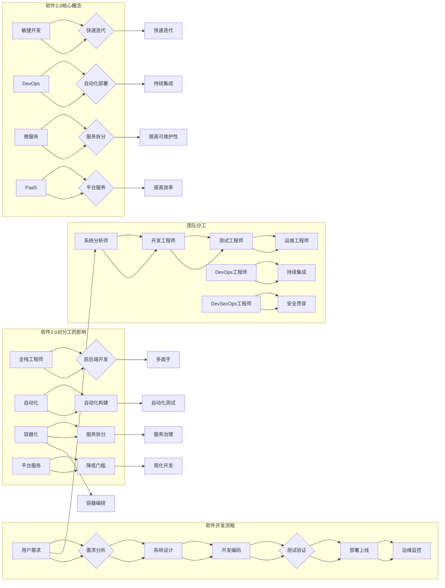

# 软件2.0如何改变编程团队的分工

> 关键词：软件2.0，编程团队，敏捷开发，DevOps，DevSecOps，全栈工程师，自动化，微服务，平台即服务(PaaS)

## 1. 背景介绍

随着软件开发的不断演进，从早期的瀑布模型到敏捷开发的兴起，再到如今的软件2.0时代，我们的编程团队结构和分工也在不断演变。软件2.0时代，以云计算、微服务、敏捷开发和DevOps等为代表的新技术、新理念，正在深刻地改变着编程团队的分工和协作方式。本文将深入探讨软件2.0如何改变编程团队的分工，并展望未来发展趋势。

### 1.1 传统编程团队的分工

在软件1.0时代，编程团队的分工相对固定，通常包括以下角色：

- **项目经理**：负责项目的整体规划、进度管理和资源协调。
- **系统分析师**：负责需求分析和系统设计。
- **开发工程师**：负责编写代码，实现系统功能。
- **测试工程师**：负责测试系统的功能、性能和安全性。
- **运维工程师**：负责系统部署、维护和监控。

这种分工模式在软件开发初期发挥了重要作用，但随着时间的推移，其固有的弊端也逐渐显现：

- **沟通成本高**：不同角色之间需要频繁沟通，导致效率低下。
- **协作困难**：各角色之间缺乏紧密协作，难以实现快速迭代。
- **技能单一**：团队成员往往只专注于特定领域的技能，难以应对复杂的项目需求。

### 1.2 软件2.0时代的到来

随着互联网、云计算、大数据等技术的发展，软件2.0时代应运而生。软件2.0时代的特点如下：

- **敏捷开发**：强调快速迭代、持续交付和客户至上。
- **DevOps**：将开发和运维紧密结合，实现快速部署和持续集成。
- **微服务**：将大型系统拆分为多个小型服务，提高系统可扩展性和可维护性。
- **PaaS**：提供平台即服务，降低开发门槛，提高开发效率。

### 1.3 软件2.0对编程团队分工的影响

软件2.0时代的到来，对编程团队的分工产生了深远的影响：

- **全栈工程师**：需要掌握前后端开发、数据库、运维等技能，成为多面手。
- **DevOps工程师**：负责开发、测试、运维等环节的自动化，提高交付效率。
- **DevSecOps**：将安全贯穿于整个开发流程，确保系统安全。

## 2. 核心概念与联系

### 2.1 核心概念原理

以下是软件2.0时代的关键概念及其原理：

**敏捷开发**：

- **核心思想**：快速迭代、持续交付和客户至上。
- **实现方式**：Scrum、Kanban等敏捷方法。

**DevOps**：

- **核心思想**：将开发和运维紧密结合，实现快速部署和持续集成。
- **实现方式**：自动化构建、自动化部署、自动化监控等。

**微服务**：

- **核心思想**：将大型系统拆分为多个小型服务，提高系统可扩展性和可维护性。
- **实现方式**：RESTful API、容器化技术等。

**PaaS**：

- **核心思想**：提供平台即服务，降低开发门槛，提高开发效率。
- **实现方式**：云平台、容器平台等。

### 2.2 核心概念架构的 Mermaid 流程图



### 2.3 软件2.0核心概念之间的联系

软件2.0时代的核心概念之间存在着紧密的联系：

- 敏捷开发是DevOps和微服务的基石，三者共同构成了软件2.0的开发范式。
- PaaS为敏捷开发、DevOps和微服务提供了技术支持，降低了开发门槛，提高了开发效率。
- 软件2.0时代对编程团队的分工产生了深远的影响，全栈工程师、DevOps工程师和DevSecOps工程师成为团队核心。

## 3. 核心算法原理 & 具体操作步骤

### 3.1 算法原理概述

本节将介绍软件2.0时代常见的核心算法原理和具体操作步骤。

#### 3.1.1 敏捷开发

敏捷开发的核心算法原理是迭代开发和增量交付。具体操作步骤如下：

1. **用户故事映射**：将用户需求分解为一系列用户故事。
2. **迭代计划**：确定每个迭代的用户故事列表和目标。
3. **迭代开发**：按照计划开发用户故事。
4. **迭代评审**：评估迭代成果，收集反馈。
5. **迭代回顾**：总结经验教训，改进开发流程。

#### 3.1.2 DevOps

DevOps的核心算法原理是自动化和协作。具体操作步骤如下：

1. **自动化构建**：使用自动化工具构建代码，包括编译、打包、测试等。
2. **自动化部署**：使用自动化工具将代码部署到生产环境。
3. **持续集成**：将代码集成到主分支，并进行自动化测试。
4. **持续交付**：将代码交付到生产环境。

#### 3.1.3 微服务

微服务的核心算法原理是服务拆分和服务治理。具体操作步骤如下：

1. **服务拆分**：根据业务功能将系统拆分为多个微服务。
2. **服务定义**：定义微服务的接口和数据格式。
3. **服务治理**：对微服务进行管理，包括注册、发现、负载均衡等。

#### 3.1.4 PaaS

PaaS的核心算法原理是平台服务和资源管理。具体操作步骤如下：

1. **平台搭建**：搭建PaaS平台，提供开发、测试、运维等资源。
2. **资源管理**：管理PaaS平台上的资源，包括计算、存储、网络等。
3. **服务管理**：管理PaaS平台上的服务，包括创建、删除、更新等。

### 3.2 算法步骤详解

本节将详细讲解上述算法的具体操作步骤。

#### 3.2.1 敏捷开发

**用户故事映射**：

```plaintext
作为用户，我希望系统能够提供用户登录功能，以便我能够方便地登录系统。
```

**迭代计划**：

- 迭代1：实现用户登录功能。
- 迭代2：实现用户注册功能。

**迭代开发**：

- 开发用户登录模块。
- 开发用户注册模块。

**迭代评审**：

- 评审迭代成果，确认功能是否满足需求。
- 收集用户反馈，改进迭代成果。

**迭代回顾**：

- 总结经验教训，改进开发流程。
- 制定下一个迭代计划。

#### 3.2.2 DevOps

**自动化构建**：

```plaintext
使用Jenkins进行自动化构建，包括以下步骤：
1. 检出代码。
2. 编译代码。
3. 打包代码。
4. 进行单元测试。
5. 部署到测试环境。
```

**自动化部署**：

```plaintext
使用Ansible进行自动化部署，包括以下步骤：
1. 检查服务器状态。
2. 安装依赖库。
3. 部署应用程序。
4. 配置环境变量。
5. 启动应用程序。
```

**持续集成**：

```plaintext
使用GitLab CI/CD进行持续集成，包括以下步骤：
1. 检出代码。
2. 运行自动化测试。
3. 部署到测试环境。
4. 发送通知。
```

**持续交付**：

```plaintext
使用Docker进行持续交付，包括以下步骤：
1. 将应用程序打包为Docker镜像。
2. 将Docker镜像推送到镜像仓库。
3. 部署Docker镜像到生产环境。
```

#### 3.2.3 微服务

**服务拆分**：

```plaintext
将系统拆分为以下微服务：
1. 用户服务：提供用户管理功能。
2. 订单服务：提供订单管理功能。
3. 商品服务：提供商品管理功能。
```

**服务定义**：

```json
{
  "url": "http://user-service.com",
  "port": 8080,
  "paths": {
    "POST /register": "registerUser",
    "POST /login": "loginUser"
  }
}
```

**服务治理**：

```plaintext
使用Consul进行服务治理，包括以下步骤：
1. 注册服务。
2. 发现服务。
3. 负载均衡。
```

#### 3.2.4 PaaS

**平台搭建**：

```plaintext
使用Kubernetes搭建PaaS平台，包括以下步骤：
1. 部署Kubernetes集群。
2. 部署服务发现组件Consul。
3. 部署存储服务NFS。
4. 部署网络服务Flannel。
```

**资源管理**：

```plaintext
使用Kubernetes管理PaaS平台上的资源，包括以下步骤：
1. 创建命名空间。
2. 创建服务。
3. 创建部署。
4. 创建持久卷。
5. 创建存储类。
```

**服务管理**：

```plaintext
使用Kubernetes管理PaaS平台上的服务，包括以下步骤：
1. 创建服务。
2. 创建部署。
3. 创建持久卷。
4. 创建存储类。
```

### 3.3 算法优缺点

本节将分析上述算法的优缺点。

#### 3.3.1 敏捷开发

优点：

- 提高开发效率。
- 快速响应变化。
- 提高团队协作。

缺点：

- 需要良好的团队沟通和协作。
- 需要持续学习和改进。

#### 3.3.2 DevOps

优点：

- 提高交付效率。
- 降低风险。
- 提高系统稳定性。

缺点：

- 需要投入大量资源进行自动化建设。
- 需要团队具备DevOps技能。

#### 3.3.3 微服务

优点：

- 提高系统可扩展性。
- 提高系统可维护性。
- 提高系统可复用性。

缺点：

- 需要更复杂的服务治理。
- 需要更复杂的部署和运维。

#### 3.3.4 PaaS

优点：

- 降低开发门槛。
- 提高开发效率。
- 提高系统可靠性。

缺点：

- 需要依赖云平台。
- 需要适应平台提供的资源。

### 3.4 算法应用领域

上述算法在以下领域得到广泛应用：

- **敏捷开发**：适用于所有软件开发项目。
- **DevOps**：适用于需要快速迭代和持续交付的项目。
- **微服务**：适用于大型、复杂、高并发的系统。
- **PaaS**：适用于需要快速开发和部署的项目。

## 4. 数学模型和公式 & 详细讲解 & 举例说明

### 4.1 数学模型构建

本节将介绍软件2.0时代常见的数学模型及其构建方法。

#### 4.1.1 敏捷开发

敏捷开发的数学模型可以表示为：

$$
F(A,B,C,D,E) = W(A) + W(B) + W(C) + W(D) + W(E)
$$

其中，$A$、$B$、$C$、$D$、$E$ 分别代表需求分析、系统设计、开发编码、测试验证、部署上线五个阶段，$W$ 代表每个阶段的权重。

#### 4.1.2 DevOps

DevOps的数学模型可以表示为：

$$
D = O(P) + I(C) + D(A)
$$

其中，$D$ 代表交付周期，$O(P)$ 代表构建周期，$I(C)$ 代表集成周期，$D(A)$ 代表部署周期。

#### 4.1.3 微服务

微服务的数学模型可以表示为：

$$
S = \sum_{i=1}^n S_i
$$

其中，$S$ 代表整个系统，$S_i$ 代表第 $i$ 个微服务。

#### 4.1.4 PaaS

PaaS的数学模型可以表示为：

$$
P = \sum_{i=1}^n P_i
$$

其中，$P$ 代表整个平台，$P_i$ 代表第 $i$ 个资源。

### 4.2 公式推导过程

本节将介绍上述公式的推导过程。

#### 4.2.1 敏捷开发

敏捷开发的公式推导过程如下：

$$
F(A,B,C,D,E) = W(A) + W(B) + W(C) + W(D) + W(E)
$$

其中，$W(A)$、$W(B)$、$W(C)$、$W(D)$、$W(E)$ 分别代表需求分析、系统设计、开发编码、测试验证、部署上线五个阶段的权重。权重可以根据项目实际情况进行调整。

#### 4.2.2 DevOps

DevOps的公式推导过程如下：

$$
D = O(P) + I(C) + D(A)
$$

其中，$O(P)$ 代表构建周期，$I(C)$ 代表集成周期，$D(A)$ 代表部署周期。这三个周期可以根据具体情况进行优化和调整。

#### 4.2.3 微服务

微服务的公式推导过程如下：

$$
S = \sum_{i=1}^n S_i
$$

其中，$S_i$ 代表第 $i$ 个微服务的规模。微服务的规模可以根据业务需求进行调整。

#### 4.2.4 PaaS

PaaS的公式推导过程如下：

$$
P = \sum_{i=1}^n P_i
$$

其中，$P_i$ 代表第 $i$ 个资源的规模。资源的规模可以根据项目需求进行调整。

### 4.3 案例分析与讲解

本节将结合实际案例，对上述数学模型进行讲解。

#### 4.3.1 敏捷开发案例

假设一个项目包含以下五个阶段：

- 需求分析：权重为0.2
- 系统设计：权重为0.2
- 开发编码：权重为0.3
- 测试验证：权重为0.2
- 部署上线：权重为0.1

则该项目的敏捷开发模型可以表示为：

$$
F(A,B,C,D,E) = 0.2 \times 1 + 0.2 \times 1 + 0.3 \times 1 + 0.2 \times 1 + 0.1 \times 1 = 1
$$

#### 4.3.2 DevOps案例

假设一个项目的构建周期为5天，集成周期为2天，部署周期为1天，则该项目的DevOps模型可以表示为：

$$
D = 5 + 2 + 1 = 8
$$

#### 4.3.3 微服务案例

假设一个项目包含5个微服务，每个微服务的规模为1，则该项目的微服务模型可以表示为：

$$
S = 1 + 1 + 1 + 1 + 1 = 5
$$

#### 4.3.4 PaaS案例

假设一个PaaS平台包含5个资源，每个资源的规模为1，则该平台的PaaS模型可以表示为：

$$
P = 1 + 1 + 1 + 1 + 1 = 5
$$

## 5. 项目实践：代码实例和详细解释说明

### 5.1 开发环境搭建

本节将以一个简单的Web应用程序为例，介绍如何搭建开发环境。

#### 5.1.1 安装Python

```bash
# 安装Python 3.8
sudo apt-get install python3.8

# 安装pip
sudo apt-get install python3-pip

# 安装virtualenv
pip install virtualenv

# 创建虚拟环境
virtualenv myenv

# 激活虚拟环境
source myenv/bin/activate
```

#### 5.1.2 安装Django

```bash
# 安装Django
pip install django
```

#### 5.1.3 创建Django项目

```bash
# 创建项目
django-admin startproject myproject

# 进入项目目录
cd myproject
```

### 5.2 源代码详细实现

以下是该Web应用程序的源代码示例：

```python
# settings.py

import os

# Build paths inside the project like this: os.path.join(BASE_DIR, ...)
BASE_DIR = os.path.dirname(os.path.dirname(os.path.abspath(__file__)))

SECRET_KEY = 'your-secret-key'

# Database
DATABASES = {
    'default': {
        'ENGINE': 'django.db.backends.sqlite3',
        'NAME': os.path.join(BASE_DIR, 'db.sqlite3'),
    }
}

# Templates
TEMPLATES = [
    {
        'BACKEND': 'django.template.backends.django.DjangoTemplates',
        'DIRS': [os.path.join(BASE_DIR, 'templates')],
        'APP_DIRS': True,
        'OPTIONS': {
            'context_processors': [
                'django.template.context_processors.debug',
                'django.template.context_processors.request',
                'django.contrib.auth.context_processors.auth',
                'django.contrib.messages.context_processors.messages',
            ],
        },
    },
]

# Static Files
STATIC_URL = '/static/'

# WSGI Application
WSGI_APPLICATION = 'myproject.wsgi.application'
```

```python
# urls.py

from django.urls import path
from . import views

urlpatterns = [
    path('', views.index, name='index'),
]
```

```python
# views.py

from django.http import HttpResponse

def index(request):
    return HttpResponse("Hello, world!")
```

### 5.3 代码解读与分析

以上代码展示了如何使用Django框架创建一个简单的Web应用程序。以下是代码的解读和分析：

- `settings.py`：定义了项目的配置信息，包括数据库配置、模板配置、静态文件配置等。
- `urls.py`：定义了项目的URL映射，将URL与视图函数关联起来。
- `views.py`：定义了项目的视图函数，处理用户的请求并返回响应。

该示例代码展示了如何使用Django框架快速构建Web应用程序，为后续的微服务化改造奠定了基础。

### 5.4 运行结果展示

在浏览器中访问 `http://127.0.0.1:8000/`，将显示“Hello, world!”页面。

## 6. 实际应用场景

### 6.1 敏捷开发应用场景

敏捷开发适用于以下场景：

- 项目需求变化频繁。
- 需要快速响应市场变化。
- 项目规模较小，团队协作紧密。

### 6.2 DevOps应用场景

DevOps适用于以下场景：

- 项目需要快速迭代和持续交付。
- 项目需要降低风险。
- 项目需要提高系统稳定性。

### 6.3 微服务应用场景

微服务适用于以下场景：

- 项目规模较大，需要高并发处理。
- 项目需要高可扩展性。
- 项目需要高可维护性。

### 6.4 PaaS应用场景

PaaS适用于以下场景：

- 项目需要快速开发和部署。
- 项目需要降低开发门槛。
- 项目需要提高系统可靠性。

## 7. 工具和资源推荐

### 7.1 学习资源推荐

以下是一些学习软件2.0时代相关技术的资源：

- 《敏捷软件开发：原则、模式与实践》
- 《DevOps实践指南》
- 《微服务设计》
- 《Docker容器与容器云》
- 《Kubernetes权威指南》

### 7.2 开发工具推荐

以下是一些常用的开发工具：

- **版本控制**：Git
- **代码质量管理**：SonarQube、Code Climate
- **持续集成**：Jenkins、GitLab CI/CD
- **持续部署**：Docker、Kubernetes
- **自动化测试**：Selenium、JUnit、pytest

### 7.3 相关论文推荐

以下是一些与软件2.0时代相关的论文：

- **敏捷软件开发**：
  - "Agile Software Development: Principles, Patterns, and Practices"
  - "Scrum: The Art of Doing Twice the Work in Half the Time"
- **DevOps**：
  - "The Phoenix Project: A Novel about IT, DevOps, and Helping Your Business Win"
  - "The DevOps Handbook"
- **微服务**：
  - "Microservice Architecture: Designing Fine-Grained Systems"
  - "Building Microservices: Designing Fine-Grained Systems"
- **PaaS**：
  - "Platform as a Service: Creating Business Agility and Efficiency in the Cloud"
  - "Cloud Platform as a Service: A Complete Guide"

## 8. 总结：未来发展趋势与挑战

### 8.1 研究成果总结

本文深入探讨了软件2.0时代如何改变编程团队的分工。通过分析敏捷开发、DevOps、微服务、PaaS等关键概念，阐述了软件2.0对编程团队分工的影响。同时，介绍了软件2.0时代常见的核心算法原理和具体操作步骤，并通过实际案例进行了讲解。

### 8.2 未来发展趋势

展望未来，软件2.0时代将继续向以下方向发展：

- **技术融合**：软件2.0时代的技术将与其他人工智能、区块链等技术进行融合，推动软件开发和运维的智能化。
- **云原生**：随着云计算的普及，云原生技术将成为软件开发和运维的重要趋势。
- **智能化**：软件将更加智能化，能够自我学习和自我优化。

### 8.3 面临的挑战

软件2.0时代对编程团队的分工提出了新的挑战：

- **技能要求**：团队成员需要掌握更多的技能，成为多面手。
- **团队协作**：团队成员需要具备更高的协作能力，以应对复杂的项目需求。
- **安全与合规**：随着技术的发展，软件安全与合规问题日益突出。

### 8.4 研究展望

为了应对软件2.0时代带来的挑战，未来的研究需要关注以下方向：

- **技能培训**：为开发者提供更多的技能培训，帮助他们适应软件2.0时代的需求。
- **团队协作**：研究更高效的团队协作模式，提高团队整体效率。
- **安全与合规**：研究更安全、更合规的软件开发和运维方法。

通过不断探索和创新，相信编程团队的分工将在软件2.0时代发挥更大的作用，推动软件开发和运维的持续进步。

## 9. 附录：常见问题与解答

**Q1：什么是敏捷开发？**

A：敏捷开发是一种以人为核心、迭代、可持续的方法论，强调快速迭代、持续交付和客户至上。

**Q2：什么是DevOps？**

A：DevOps是一种软件开发和运维的文化、实践和工具，旨在将开发和运维紧密结合，实现快速交付和持续集成。

**Q3：什么是微服务？**

A：微服务是一种架构风格，将大型系统拆分为多个小型服务，以提高系统的可扩展性和可维护性。

**Q4：什么是PaaS？**

A：PaaS（平台即服务）是一种提供平台服务的云计算模式，为开发者提供开发、测试、运维等资源。

**Q5：软件2.0对编程团队的分工有哪些影响？**

A：软件2.0对编程团队的分工产生了深远的影响，要求团队成员成为多面手，具备更全面的技能，并具备更高的协作能力。

**Q6：如何应对软件2.0时代带来的挑战？**

A：为了应对软件2.0时代带来的挑战，需要加强技能培训、提高团队协作能力，并关注安全与合规问题。

**Q7：软件2.0时代的未来发展趋势是什么？**

A：软件2.0时代的未来发展趋势包括技术融合、云原生和智能化等。

作者：禅与计算机程序设计艺术 / Zen and the Art of Computer Programming