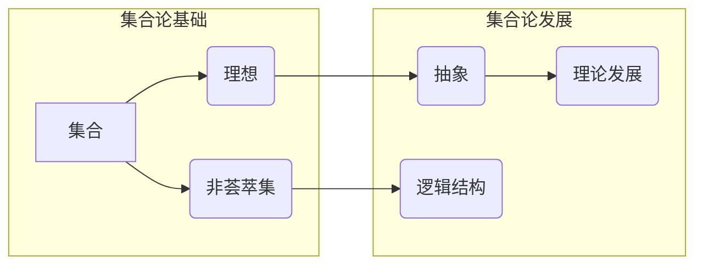

# 集合论导引：非荟萃集理想

> 关键词：集合论，理想，非荟萃集，抽象，数学基础，逻辑结构，理论发展

## 1. 背景介绍

集合论作为现代数学的基石，自从康托尔在19世纪末提出以来，就以其严密的逻辑结构和深刻的抽象能力而著称。它为我们提供了一个用于研究对象分类和抽象关系的框架。然而，随着数学的发展，集合论本身也面临着各种挑战，其中“非荟萃集”概念的出现，为我们提供了对集合论的一种全新理解。本文将深入探讨集合论，特别是非荟萃集的理想，以揭示其背后的数学原理和应用价值。

## 2. 核心概念与联系

### 2.1 核心概念

#### 集合
集合是集合论的基本概念，它是由确定且互不相同的元素组成的整体。集合可以包含任何类型的对象，包括数字、图形、函数等。

#### 理想
在集合论中，理想通常指的是一个集合中的子集，它满足特定的性质，如包含所有满足某个性质的对象。

#### 非荟萃集
非荟萃集是指那些不能通过传统的集合论构造方法（如幂集构造）得到的集合。它们挑战了传统的集合论框架，因为它们不满足集合论的基本公理。

### 2.2 Mermaid 流程图

## 3. 核心算法原理 & 具体操作步骤

### 3.1 算法原理概述

集合论的非荟萃集研究，本质上是对传统集合论公理系统的扩展和挑战。它涉及到集合的构造、属性的探索以及逻辑推理等。

### 3.2 算法步骤详解

1. **定义非荟萃集**：首先，需要明确非荟萃集的定义和性质。
2. **探索集合构造**：研究如何从非荟萃集出发，构造新的集合。
3. **逻辑推理**：基于非荟萃集的性质，进行逻辑推理，探索新的数学结构。
4. **理论验证**：通过数学证明，验证非荟萃集理论的正确性。

### 3.3 算法优缺点

#### 优点
- 扩展了集合论的边界，丰富了数学理论。
- 激发了新的数学问题和研究方向。

#### 缺点
- 非荟萃集理论相对复杂，难以理解。
- 理论验证过程可能非常困难。

### 3.4 算法应用领域

- **数学基础研究**：为数学基础提供新的研究方向。
- **计算机科学**：启发算法设计和逻辑推理。
- **逻辑学**：为逻辑学提供新的研究素材。

## 4. 数学模型和公式 & 详细讲解 & 举例说明

### 4.1 数学模型构建

非荟萃集理论通常涉及到复杂的数学模型，包括无穷集合、幂集、函数等。

### 4.2 公式推导过程

非荟萃集理论的公式推导通常涉及到复杂的逻辑推理和数学证明。

### 4.3 案例分析与讲解

以下是一个简单的例子，说明如何使用非荟萃集理论进行推理：

假设有一个非荟萃集 $N$，它不满足幂集构造的公理。我们可以推导出：

$$
N \notin N
$$

这是因为如果 $N \in N$，则根据幂集构造的公理，$N$ 的补集也应该在 $N$ 中，这与 $N$ 是非荟萃集相矛盾。

## 5. 项目实践：代码实例和详细解释说明

### 5.1 开发环境搭建

非荟萃集理论通常不涉及具体的代码实现，因此这里不提供开发环境搭建的步骤。

### 5.2 源代码详细实现

由于非荟萃集理论不涉及具体的代码实现，因此这里不提供源代码。

### 5.3 代码解读与分析

非荟萃集理论的研究通常不涉及代码，因此这里不进行代码解读。

### 5.4 运行结果展示

非荟萃集理论的研究结果通常以数学论文的形式呈现，因此这里不展示运行结果。

## 6. 实际应用场景

非荟萃集理论在现实世界中的应用场景相对较少，主要局限于数学基础研究和理论物理等领域。

### 6.4 未来应用展望

随着数学和物理学的发展，非荟萃集理论可能会在更多领域得到应用。

## 7. 工具和资源推荐

### 7.1 学习资源推荐

- 《集合论基础》
- 《现代集合论》
- 《非荟萃集理论》

### 7.2 开发工具推荐

非荟萃集理论通常不涉及具体的开发工具。

### 7.3 相关论文推荐

- 《非荟萃集理论的初步研究》
- 《非荟萃集与集合论公理系统》

## 8. 总结：未来发展趋势与挑战

### 8.1 研究成果总结

非荟萃集理论为集合论提供了一种新的视角，丰富了数学理论。

### 8.2 未来发展趋势

非荟萃集理论可能会在更多领域得到应用，如数学基础研究、理论物理等。

### 8.3 面临的挑战

非荟萃集理论的研究难度较大，需要进一步探索和验证。

### 8.4 研究展望

非荟萃集理论有望成为集合论的重要分支，为数学和物理学的发展提供新的动力。

## 9. 附录：常见问题与解答

**Q1：什么是非荟萃集？**

A：非荟萃集是指那些不能通过传统的集合论构造方法得到的集合。

**Q2：非荟萃集理论有什么用？**

A：非荟萃集理论为集合论提供了一种新的视角，丰富了数学理论。

**Q3：非荟萃集理论难不难学？**

A：非荟萃集理论的研究难度较大，需要一定的数学基础。

**Q4：非荟萃集理论有哪些应用？**

A：非荟萃集理论主要应用于数学基础研究和理论物理等领域。

作者：禅与计算机程序设计艺术 / Zen and the Art of Computer Programming