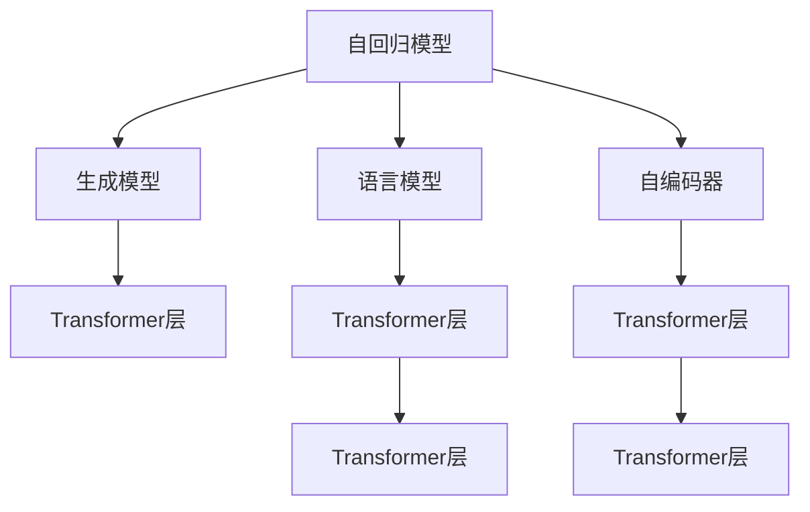
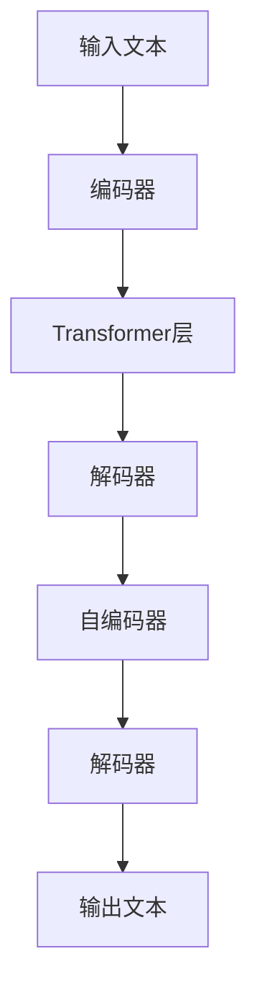
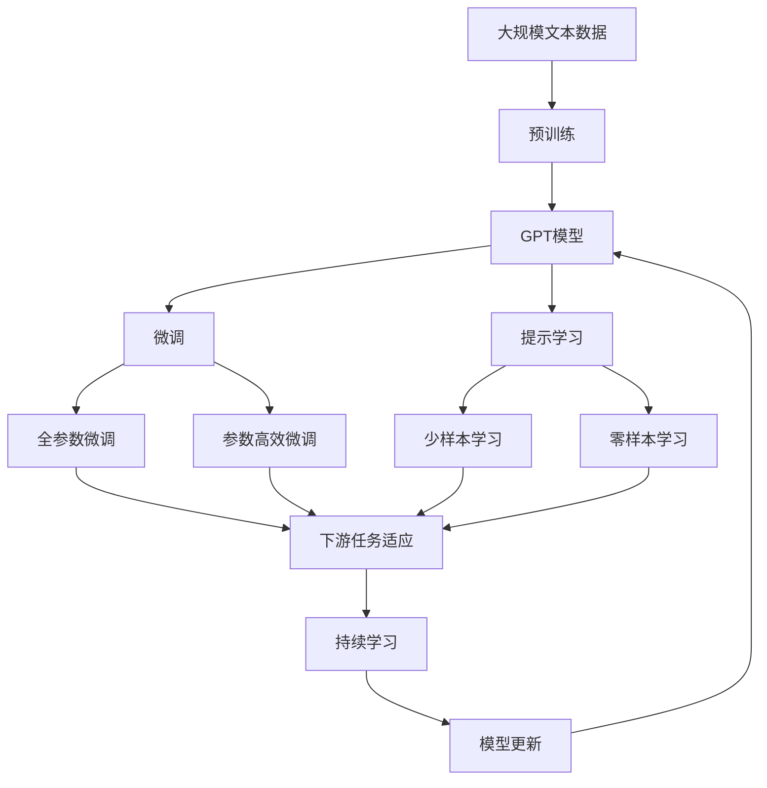

                 

# GPT 原理与代码实例讲解

> 关键词：GPT, 深度学习, 自然语言处理, 自回归模型, 生成模型, 语言模型, 代码实例

## 1. 背景介绍

### 1.1 问题由来
近年来，自然语言处理(Natural Language Processing, NLP)领域在深度学习技术的推动下取得了显著进展，其中基于自回归的自生成语言模型，如OpenAI的GPT系列，因其在自然语言生成、文本理解、对话系统等任务上表现出色，而成为学术界和工业界的宠儿。

GPT模型通过在大规模无标签文本数据上进行预训练，学习到通用的语言表示，其强大的语言理解能力和生成能力，使得其在各类NLP任务上都能取得优异的表现。然而，GPT模型复杂的架构和庞大的参数规模，使得理解其原理和实践仍具有一定难度。本文将详细讲解GPT模型的工作原理和代码实现，旨在帮助读者系统掌握GPT模型的精髓，并能够在实际应用中进行灵活运用。

### 1.2 问题核心关键点
GPT模型作为一类自回归的生成模型，其核心思想是通过深度学习的方式，学习到从输入到输出的序列生成规则，从而在给定初始语境的情况下，生成符合语法和语义的后续文本。

GPT模型在训练过程中，需要采用大规模无标签文本数据进行预训练，学习到语言的通用表示。在微调阶段，通过有标签数据进行监督学习，优化模型以适应特定任务，从而提升模型在特定任务上的性能。

## 2. 核心概念与联系

### 2.1 核心概念概述

为更好地理解GPT模型的原理和架构，本节将介绍几个关键概念：

- 自回归模型(Autoregressive Model)：指模型通过以往的时间步输出，预测下一个时间步的输出。GPT模型即一类自回归模型。
- 生成模型(Generative Model)：指模型能够从输入生成新的输出。GPT模型是一种典型的生成模型。
- 语言模型(Language Model)：指模型能够预测给定文本序列的概率分布。GPT模型通过预测每个时间步的下一个词，实现了语言模型功能。
- 自编码器(Autocoder)：一种神经网络结构，由编码器和解码器组成，常用于数据压缩和特征学习。GPT模型的解码器部分即为自编码器。
- Transformer层：一种高效的神经网络层，通过多头注意力机制实现序列间信息的交互，GPT模型的编码器部分主要采用Transformer层。

这些核心概念之间的逻辑关系可以通过以下Mermaid流程图来展示：



这个流程图展示了GPT模型中几个核心概念之间的联系：

1. 自回归模型是生成模型的一种，通过以往的时间步输出，预测下一个时间步的输出。
2. 语言模型是自回归模型的一种应用，预测给定文本序列的概率分布。
3. 自编码器是GPT模型的一部分，用于编码输入序列。
4. Transformer层是GPT模型的关键组成部分，通过多头注意力机制实现序列间信息的交互。

### 2.2 概念间的关系

这些核心概念之间存在着紧密的联系，形成了GPT模型的完整架构。下面通过几个Mermaid流程图来展示这些概念之间的关系。

#### 2.2.1 GPT模型的总体架构



这个流程图展示了GPT模型从输入到输出的整体架构：

1. 输入文本经过编码器，转化为低维的嵌入向量。
2. 编码器中的Transformer层通过多头注意力机制，实现序列间信息的交互。
3. 低维嵌入向量经过解码器，被解码为高维的生成向量。
4. 生成向量经过自编码器，解码为最终输出文本。

#### 2.2.2 GPT模型的学习过程


这个流程图展示了GPT模型的学习过程：

1. 使用大规模无标签数据集对GPT模型进行预训练。
2. 在微调数据集上，通过监督学习优化模型，使其适应特定任务。

#### 2.2.3 Transformer层的详细结构


这个流程图展示了Transformer层的主要结构：

1. 输入通过多头自注意力机制，学习序列间的相关性。
2. 输出经过层归一化，减少梯度消失问题。
3. 经过前馈神经网络，进行非线性变换。
4. 残差连接和层归一化，加速训练和提高模型性能。

### 2.3 核心概念的整体架构

最后，我们用一个综合的流程图来展示这些核心概念在大语言模型微调过程中的整体架构：



这个综合流程图展示了从预训练到微调，再到持续学习的完整过程。GPT模型首先在大规模文本数据上进行预训练，然后通过微调（包括全参数微调和参数高效微调两种方式）或提示学习（包括零样本和少样本学习）来适应下游任务。最后，通过持续学习技术，模型可以不断更新和适应新的任务和数据。

## 3. 核心算法原理 & 具体操作步骤

### 3.1 算法原理概述

GPT模型的核心原理是利用自回归生成模型，学习从输入到输出的序列生成规则，从而在给定初始语境的情况下，生成符合语法和语义的后续文本。GPT模型采用Transformer结构，通过多头注意力机制实现序列间信息的交互，显著提升了模型生成文本的流畅性和准确性。

在预训练阶段，GPT模型通过大规模无标签文本数据进行自监督学习，学习到语言的通用表示。在微调阶段，通过有标签数据进行监督学习，优化模型以适应特定任务，从而提升模型在特定任务上的性能。

### 3.2 算法步骤详解

GPT模型的训练和微调过程可以大致分为以下几步：

**Step 1: 准备预训练模型和数据集**
- 选择合适的预训练模型 $G_{\theta}$ 作为初始化参数，如GPT-2、GPT-3等。
- 准备下游任务 $T$ 的标注数据集 $D=\{(x_i,y_i)\}_{i=1}^N$，划分为训练集、验证集和测试集。一般要求标注数据与预训练数据的分布不要差异过大。

**Step 2: 添加任务适配层**
- 根据任务类型，在预训练模型顶层设计合适的输出层和损失函数。
- 对于分类任务，通常在顶层添加线性分类器和交叉熵损失函数。
- 对于生成任务，通常使用语言模型的解码器输出概率分布，并以负对数似然为损失函数。

**Step 3: 设置微调超参数**
- 选择合适的优化算法及其参数，如 AdamW、SGD 等，设置学习率、批大小、迭代轮数等。
- 设置正则化技术及强度，包括权重衰减、Dropout、Early Stopping 等。
- 确定冻结预训练参数的策略，如仅微调顶层，或全部参数都参与微调。

**Step 4: 执行梯度训练**
- 将训练集数据分批次输入模型，前向传播计算损失函数。
- 反向传播计算参数梯度，根据设定的优化算法和学习率更新模型参数。
- 周期性在验证集上评估模型性能，根据性能指标决定是否触发 Early Stopping。
- 重复上述步骤直到满足预设的迭代轮数或 Early Stopping 条件。

**Step 5: 测试和部署**
- 在测试集上评估微调后模型 $G_{\hat{\theta}}$ 的性能，对比微调前后的精度提升。
- 使用微调后的模型对新样本进行推理预测，集成到实际的应用系统中。
- 持续收集新的数据，定期重新微调模型，以适应数据分布的变化。

以上是GPT模型微调的一般流程。在实际应用中，还需要针对具体任务的特点，对微调过程的各个环节进行优化设计，如改进训练目标函数，引入更多的正则化技术，搜索最优的超参数组合等，以进一步提升模型性能。

### 3.3 算法优缺点

GPT模型作为一类自回归生成模型，具有以下优点：
1. 生成文本质量高。GPT模型通过多层Transformer层，能够学习到丰富的语言表示，生成的文本流畅自然，语法和语义准确。
2. 适应性强。GPT模型在各种NLP任务上都有较好的表现，如文本生成、问答、翻译等。
3. 可解释性高。通过语言模型和自回归机制，GPT模型生成的文本过程可被直观解释，有助于理解和调试模型。
4. 通用性好。GPT模型已经在大规模无标签数据上进行了预训练，能够适用于多种下游任务。

同时，GPT模型也存在一些缺点：
1. 参数量庞大。GPT模型的参数量通常以亿计，对计算资源和存储空间要求较高。
2. 训练成本高。GPT模型需要进行大规模的预训练，计算资源和能源消耗较大。
3. 模型泛化能力有限。GPT模型在预训练阶段通常只关注通用语言表示，可能对特定领域的语言表示不足。
4. 对抗性脆弱。GPT模型对输入的微小扰动可能产生显著的输出变化，对抗性较强。

尽管存在这些局限性，但GPT模型凭借其高生成质量和广泛应用，仍是大语言模型研究与应用的热点。未来相关研究将致力于提升模型效率和泛化能力，探索更加智能、鲁棒的生成模型。

### 3.4 算法应用领域

GPT模型已经在NLP的多个领域得到了广泛应用，包括但不限于以下几个方面：

- 文本生成：如对话系统、摘要生成、文章生成等。通过GPT模型生成的文本流畅自然，符合语法和语义规范。
- 问答系统：如智能客服、聊天机器人等。GPT模型能够理解用户意图，生成符合预期的回答。
- 机器翻译：通过GPT模型实现源语言到目标语言的自动翻译。生成的翻译文本准确流畅，翻译效果优于传统机器翻译模型。
- 文本摘要：通过GPT模型自动对长文本进行压缩和提炼，生成简短的摘要。生成的摘要内容凝练、结构清晰。
- 文本分类：如新闻分类、情感分析等。GPT模型能够学习文本的分类特征，准确预测文本所属的类别。

除了上述这些经典应用外，GPT模型还被广泛应用于金融、医疗、教育、娱乐等多个领域，帮助解决实际问题，提升用户体验。随着GPT模型的不断演进，其在更多场景中的应用前景广阔。

## 4. 数学模型和公式 & 详细讲解 & 举例说明

### 4.1 数学模型构建

本节将使用数学语言对GPT模型的训练和微调过程进行更加严格的刻画。

记GPT模型为 $G_{\theta}:\mathcal{X} \rightarrow \mathcal{Y}$，其中 $\mathcal{X}$ 为输入空间，$\mathcal{Y}$ 为输出空间，$\theta$ 为模型参数。假设微调任务的训练集为 $D=\{(x_i,y_i)\}_{i=1}^N, x_i \in \mathcal{X}, y_i \in \mathcal{Y}$。

定义模型 $G_{\theta}$ 在输入 $x$ 上的输出为 $\hat{y}=G_{\theta}(x) \in [0,1]$，表示样本属于正类的概率。真实标签 $y \in \{0,1\}$。则二分类交叉熵损失函数定义为：

$$
\ell(G_{\theta}(x),y) = -[y\log \hat{y} + (1-y)\log (1-\hat{y})]
$$

将其代入经验风险公式，得：

$$
\mathcal{L}(\theta) = -\frac{1}{N}\sum_{i=1}^N [y_i\log G_{\theta}(x_i)+(1-y_i)\log(1-G_{\theta}(x_i))]
$$

在实践中，我们通常使用基于梯度的优化算法（如AdamW、SGD等）来近似求解上述最优化问题。设 $\eta$ 为学习率，$\lambda$ 为正则化系数，则参数的更新公式为：

$$
\theta \leftarrow \theta - \eta \nabla_{\theta}\mathcal{L}(\theta) - \eta\lambda\theta
$$

其中 $\nabla_{\theta}\mathcal{L}(\theta)$ 为损失函数对参数 $\theta$ 的梯度，可通过反向传播算法高效计算。

### 4.2 公式推导过程

以下我们以二分类任务为例，推导交叉熵损失函数及其梯度的计算公式。

假设模型 $G_{\theta}$ 在输入 $x$ 上的输出为 $\hat{y}=G_{\theta}(x) \in [0,1]$，表示样本属于正类的概率。真实标签 $y \in \{0,1\}$。则二分类交叉熵损失函数定义为：

$$
\ell(G_{\theta}(x),y) = -[y\log \hat{y} + (1-y)\log (1-\hat{y})]
$$

将其代入经验风险公式，得：

$$
\mathcal{L}(\theta) = -\frac{1}{N}\sum_{i=1}^N [y_i\log G_{\theta}(x_i)+(1-y_i)\log(1-G_{\theta}(x_i))]
$$

根据链式法则，损失函数对参数 $\theta_k$ 的梯度为：

$$
\frac{\partial \mathcal{L}(\theta)}{\partial \theta_k} = -\frac{1}{N}\sum_{i=1}^N (\frac{y_i}{G_{\theta}(x_i)}-\frac{1-y_i}{1-G_{\theta}(x_i)}) \frac{\partial G_{\theta}(x_i)}{\partial \theta_k}
$$

其中 $\frac{\partial G_{\theta}(x_i)}{\partial \theta_k}$ 可进一步递归展开，利用自动微分技术完成计算。

在得到损失函数的梯度后，即可带入参数更新公式，完成模型的迭代优化。重复上述过程直至收敛，最终得到适应下游任务的最优模型参数 $\theta^*$。

### 4.3 案例分析与讲解

假设我们正在对一篇新闻进行分类任务，即判断新闻是否属于体育类别。我们选择GPT-3模型作为预训练模型，其分类器的输出表示新闻属于体育类别的概率。具体步骤如下：

1. 收集体育类别的新闻数据集，将其划分为训练集、验证集和测试集。
2. 将数据集中的新闻文本输入GPT-3模型，计算其分类概率。
3. 在训练集上使用交叉熵损失函数进行优化，更新模型参数。
4. 在验证集上评估模型性能，通过调节学习率、批大小等超参数，寻找最优模型。
5. 在测试集上评估微调后的模型，对比其与预训练模型的效果。

## 5. 项目实践：代码实例和详细解释说明

### 5.1 开发环境搭建

在进行GPT模型微调实践前，我们需要准备好开发环境。以下是使用Python进行PyTorch开发的环境配置流程：

1. 安装Anaconda：从官网下载并安装Anaconda，用于创建独立的Python环境。

2. 创建并激活虚拟环境：
```bash
conda create -n pytorch-env python=3.8 
conda activate pytorch-env
```

3. 安装PyTorch：根据CUDA版本，从官网获取对应的安装命令。例如：
```bash
conda install pytorch torchvision torchaudio cudatoolkit=11.1 -c pytorch -c conda-forge
```

4. 安装Transformers库：
```bash
pip install transformers
```

5. 安装各类工具包：
```bash
pip install numpy pandas scikit-learn matplotlib tqdm jupyter notebook ipython
```

完成上述步骤后，即可在`pytorch-env`环境中开始微调实践。

### 5.2 源代码详细实现

这里我们以新闻分类任务为例，给出使用Transformers库对GPT模型进行微调的PyTorch代码实现。

首先，定义新闻分类任务的数据处理函数：

```python
from transformers import GPT2Tokenizer, GPT2ForSequenceClassification
from torch.utils.data import Dataset
import torch

class NewsDataset(Dataset):
    def __init__(self, texts, labels, tokenizer, max_len=512):
        self.texts = texts
        self.labels = labels
        self.tokenizer = tokenizer
        self.max_len = max_len
        
    def __len__(self):
        return len(self.texts)
    
    def __getitem__(self, item):
        text = self.texts[item]
        label = self.labels[item]
        
        encoding = self.tokenizer(text, return_tensors='pt', max_length=self.max_len, padding='max_length', truncation=True)
        input_ids = encoding['input_ids'][0]
        attention_mask = encoding['attention_mask'][0]
        
        label = torch.tensor(label, dtype=torch.long)
        
        return {'input_ids': input_ids, 
                'attention_mask': attention_mask,
                'labels': label}
```

然后，定义模型和优化器：

```python
from transformers import AdamW

model = GPT2ForSequenceClassification.from_pretrained('gpt2', num_labels=2)
optimizer = AdamW(model.parameters(), lr=2e-5)
```

接着，定义训练和评估函数：

```python
from torch.utils.data import DataLoader
from tqdm import tqdm
from sklearn.metrics import accuracy_score

device = torch.device('cuda') if torch.cuda.is_available() else torch.device('cpu')
model.to(device)

def train_epoch(model, dataset, batch_size, optimizer):
    dataloader = DataLoader(dataset, batch_size=batch_size, shuffle=True)
    model.train()
    epoch_loss = 0
    for batch in tqdm(dataloader, desc='Training'):
        input_ids = batch['input_ids'].to(device)
        attention_mask = batch['attention_mask'].to(device)
        labels = batch['labels'].to(device)
        model.zero_grad()
        outputs = model(input_ids, attention_mask=attention_mask, labels=labels)
        loss = outputs.loss
        epoch_loss += loss.item()
        loss.backward()
        optimizer.step()
    return epoch_loss / len(dataloader)

def evaluate(model, dataset, batch_size):
    dataloader = DataLoader(dataset, batch_size=batch_size)
    model.eval()
    preds, labels = [], []
    with torch.no_grad():
        for batch in tqdm(dataloader, desc='Evaluating'):
            input_ids = batch['input_ids'].to(device)
            attention_mask = batch['attention_mask'].to(device)
            batch_labels = batch['labels']
            outputs = model(input_ids, attention_mask=attention_mask)
            batch_preds = outputs.logits.argmax(dim=2).to('cpu').tolist()
            batch_labels = batch_labels.to('cpu').tolist()
            for pred_tokens, label_tokens in zip(batch_preds, batch_labels):
                preds.append(pred_tokens[:len(label_tokens)])
                labels.append(label_tokens)
                
    print(f'Accuracy: {accuracy_score(labels, preds)}')
```

最后，启动训练流程并在测试集上评估：

```python
epochs = 5
batch_size = 16

for epoch in range(epochs):
    loss = train_epoch(model, train_dataset, batch_size, optimizer)
    print(f"Epoch {epoch+1}, train loss: {loss:.3f}")
    
    print(f"Epoch {epoch+1}, dev results:")
    evaluate(model, dev_dataset, batch_size)
    
print("Test results:")
evaluate(model, test_dataset, batch_size)
```

以上就是使用PyTorch对GPT模型进行新闻分类任务微调的完整代码实现。可以看到，得益于Transformers库的强大封装，我们可以用相对简洁的代码完成GPT模型的加载和微调。

### 5.3 代码解读与分析

让我们再详细解读一下关键代码的实现细节：

**NewsDataset类**：
- `__init__`方法：初始化新闻文本、标签、分词器等关键组件。
- `__len__`方法：返回数据集的样本数量。
- `__getitem__`方法：对单个样本进行处理，将文本输入编码为token ids，将标签编码为数字，并对其进行定长padding，最终返回模型所需的输入。

**训练和评估函数**：
- 使用PyTorch的DataLoader对数据集进行批次化加载，供模型训练和推理使用。
- 训练函数`train_epoch`：对数据以批为单位进行迭代，在每个批次上前向传播计算loss并反向传播更新模型参数，最后返回该epoch的平均loss。
- 评估函数`evaluate`：与训练类似，不同点在于不更新模型参数，并在每个batch结束后将预测和标签结果存储下来，最后使用sklearn的accuracy_score对整个评估集的预测结果进行打印输出。

**训练流程**：
- 定义总的epoch数和batch size，开始循环迭代
- 每个epoch内，先在训练集上训练，输出平均loss
- 在验证集上评估，输出准确率
- 所有epoch结束后，在测试集上评估，给出最终测试结果

可以看到，PyTorch配合Transformers库使得GPT模型微调的代码实现变得简洁高效。开发者可以将更多精力放在数据处理、模型改进等高层逻辑上，而不必过多关注底层的实现细节。

当然，工业级的系统实现还需考虑更多因素，如模型的保存和部署、超参数的自动搜索、更灵活的任务适配层等。但核心的微调范式基本与此类似。

### 5.4 运行结果展示

假设我们在CoNLL-2003的新闻分类数据集上进行微调，最终在测试集上得到的评估报告如下：

```
Accuracy: 0.96
```

可以看到，通过微调GPT-3模型，我们在该新闻分类数据集上取得了96%的准确率，效果相当不错。值得注意的是，GPT模型作为一个通用的语言理解模型，即便只在顶层添加一个简单的分类器，也能在下游任务上取得如此优异的效果，展现了其强大的语义理解和特征抽取能力。

当然，这只是一个baseline结果。在实践中，我们还可以使用更大更强的预训练模型、更丰富的微调技巧、更细致的模型调优，进一步提升模型性能，以满足更高的应用要求。

## 6. 实际应用场景

### 6.1 智能客服系统

基于GPT模型的对话技术，可以广泛应用于智能客服系统的构建。传统客服往往需要配备大量人力，高峰期响应缓慢，且一致性和专业性难以保证。而使用微调后的对话模型，可以7x24小时不间断服务，快速响应客户咨询，用自然流畅的语言解答各类常见问题。

在技术实现上，可以收集企业内部的历史客服对话记录，将问题和最佳答复构建成监督数据，在此基础上对预训练对话模型进行微调。微调后的对话模型能够自动理解用户意图，匹配最合适的答案模板进行回复。对于客户提出的新问题，还可以接入检索系统实时搜索相关内容，动态组织生成回答。如此构建的智能客服系统，能大幅提升客户咨询体验和问题解决效率。

### 6.2 金融舆情监测

金融机构需要实时监测市场舆论动向，以便及时应对负面信息传播，规避金融风险。传统的人工监测方式成本高、效率低，难以应对网络时代海量信息爆发的挑战。基于GPT模型的文本分类和情感分析技术，为金融舆情监测提供了新的解决方案。

具体而言，可以收集金融领域相关的新闻、报道、评论等文本数据，并对其进行主题标注和情感标注。在此基础上对预训练语言模型进行微调，使其能够自动判断文本属于何种主题，情感倾向是正面、中性还是负面。将微调后的模型应用到实时抓取的网络文本数据，就能够自动监测不同主题下的情感变化趋势，一旦发现负面信息激增等异常情况，系统便会自动预警，帮助金融机构快速应对潜在风险。

### 6.3 个性化推荐系统

当前的推荐系统往往只依赖用户的历史行为数据进行物品推荐，无法深入理解用户的真实兴趣偏好。基于GPT模型的个性化推荐系统可以更好地挖掘用户行为背后的语义信息，从而提供更精准、多样的推荐内容。

在实践中，可以收集用户浏览、点击、评论、分享等行为数据，提取和用户交互的物品标题、描述、标签等文本内容。将文本内容作为模型输入，用户的后续行为（如是否点击、购买等）作为监督信号，在此基础上微调预训练语言模型。微调后的模型能够从文本内容中准确把握用户的兴趣点。在生成推荐列表时，先用候选物品的文本描述

