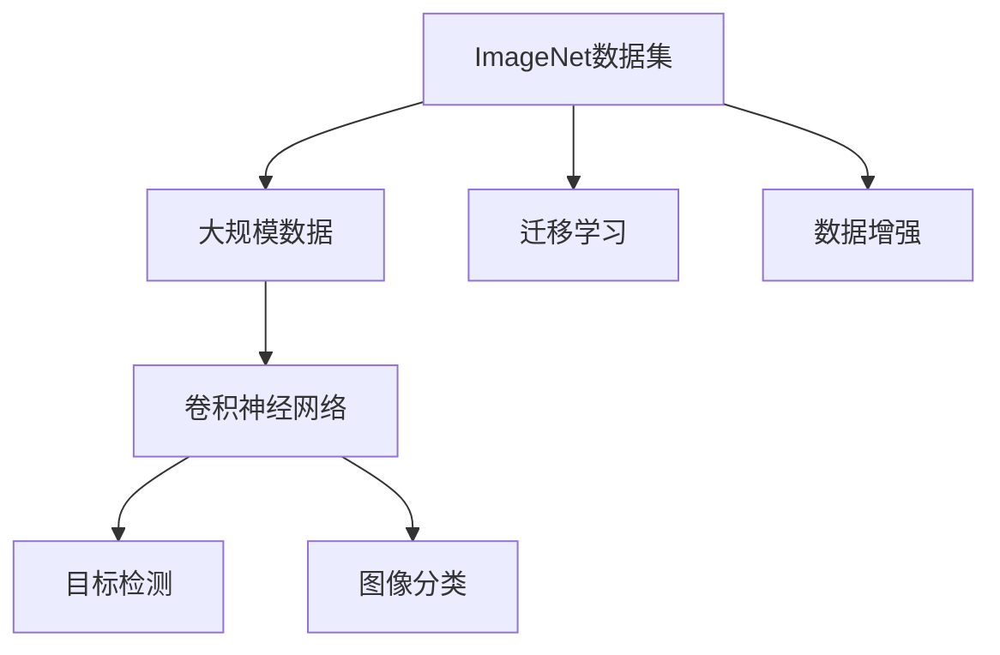
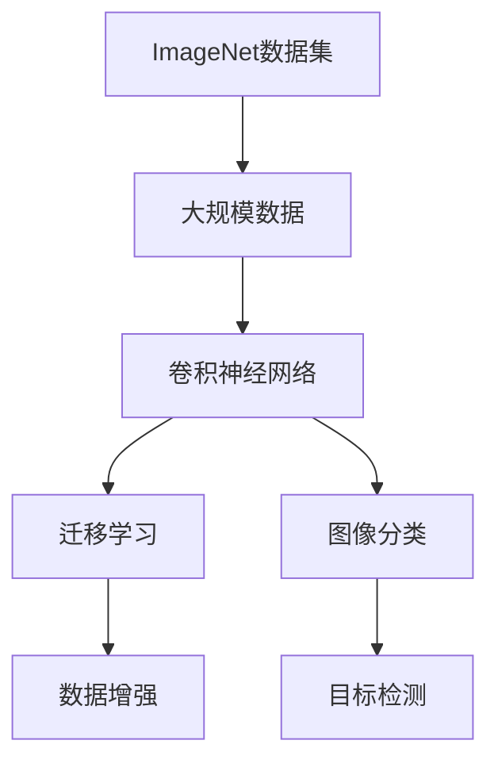
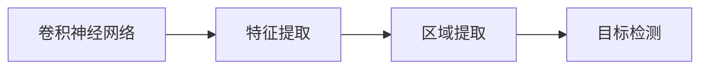
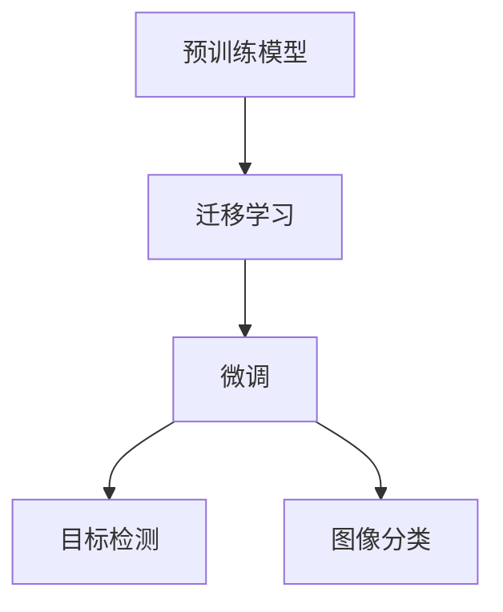
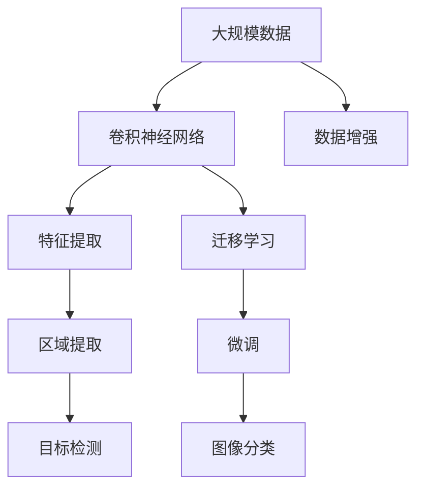

                 

# ImageNet与人工智能的进步

> 关键词：ImageNet,深度学习,计算机视觉,卷积神经网络,CNN,特征提取,目标检测,图像分类,迁移学习,数据增强,提升精度,大规模数据

## 1. 背景介绍

### 1.1 问题由来
ImageNet项目起源于斯坦福大学，由Fei-Fei Li教授等人发起，旨在构建一个大规模图像分类数据集，促进计算机视觉领域的研究和应用。ImageNet数据集包含1400万张图像，涵盖1000个不同的类别，是大规模、多样化的视觉数据集的代表。

ImageNet的开发标志着计算机视觉领域进入了一个全新的时代。在此之前，图像分类任务通常使用小规模的手工设计特征进行训练，效果往往不理想。而ImageNet数据集提供了大量的无标签图像数据，通过自监督学习方法，使得计算机视觉模型能够从原始数据中自动学习到具有鲁棒性的特征表示。

### 1.2 问题核心关键点
ImageNet项目的关键点在于大规模数据和深度学习模型的结合，极大地推动了计算机视觉领域的发展。

1. **大规模数据**：ImageNet数据集不仅包含大规模的图像，而且每个类别下有几千到数万张图像，使得模型能够学习到更加多样化和丰富的特征。
2. **深度学习模型**：特别是卷积神经网络(CNN)的引入，极大地提升了图像分类的准确性和泛化能力。
3. **迁移学习**：ImageNet数据集上预训练的模型可以作为基础，通过微调等技术，应用于其他视觉任务，如目标检测、图像分割等。

### 1.3 问题研究意义
ImageNet项目的研究意义主要体现在以下几个方面：

1. **推动计算机视觉研究**：为计算机视觉提供了丰富的大规模数据，推动了深度学习模型的研究和应用。
2. **促进技术落地**：ImageNet数据集的大规模和高精度特征表示，使得计算机视觉技术能够在诸多实际应用场景中取得突破，如自动驾驶、医疗影像分析等。
3. **激发新模型探索**：大量研究者在此基础上，探索出新的深度学习模型和训练方法，如ResNet、Inception、GAN等，极大地提升了计算机视觉任务的性能。
4. **提升AI产业**：ImageNet项目不仅在学术界产生了深远影响，也推动了AI产业的发展，加速了视觉技术在商业应用中的落地。

## 2. 核心概念与联系

### 2.1 核心概念概述

为了更好地理解ImageNet项目对人工智能的推动作用，本节将介绍几个密切相关的核心概念：

- **ImageNet数据集**：包含1400万张图像，1000个类别的视觉数据集，是计算机视觉研究的重要资源。
- **卷积神经网络(CNN)**：一种经典的深度学习模型，特别适合处理图像数据，通过卷积层和池化层提取局部特征，并进行特征融合。
- **迁移学习**：将在大规模数据集上预训练的模型，迁移到其他小规模数据集上，以提升模型在新任务上的表现。
- **数据增强**：通过对训练数据进行旋转、缩放、裁剪等变换，增加数据多样性，提升模型泛化能力。
- **目标检测**：在图像中定位并识别出不同类别的物体，是计算机视觉中的重要任务。
- **图像分类**：将图像归为预定义的类别中，是计算机视觉中的基本任务。
- **大规模数据**：指的是包含数百万甚至数亿条数据的数据集，可以训练出性能更强的模型。

这些核心概念之间的逻辑关系可以通过以下Mermaid流程图来展示：



这个流程图展示了大规模数据与ImageNet数据集之间的关系，以及它们如何与卷积神经网络、目标检测、图像分类等核心概念相互联系。

### 2.2 概念间的关系

这些核心概念之间存在着紧密的联系，形成了ImageNet项目和计算机视觉研究的基本生态系统。下面我通过几个Mermaid流程图来展示这些概念之间的关系。

#### 2.2.1 ImageNet数据集与大规模数据



这个流程图展示了ImageNet数据集与大规模数据之间的关系，以及它们如何通过卷积神经网络、迁移学习和数据增强等技术，提升图像分类和目标检测任务的性能。

#### 2.2.2 卷积神经网络与目标检测



这个流程图展示了卷积神经网络通过特征提取和区域提取技术，实现目标检测的过程。

#### 2.2.3 迁移学习与微调



这个流程图展示了迁移学习通过微调技术，将在大规模数据上预训练的模型迁移到特定任务上，提升模型在新任务上的表现。

### 2.3 核心概念的整体架构

最后，我们用一个综合的流程图来展示这些核心概念在大规模数据和迁移学习中的整体架构：



这个综合流程图展示了从大规模数据到卷积神经网络，再到目标检测和图像分类的完整过程。通过迁移学习和微调技术，模型能够在大规模数据上学习到丰富的特征表示，提升在特定任务上的表现。

## 3. 核心算法原理 & 具体操作步骤
### 3.1 算法原理概述

ImageNet项目的关键在于通过大规模数据和深度学习模型的结合，实现了图像分类和目标检测任务的高精度。其核心算法原理主要包括卷积神经网络(CNN)、迁移学习、数据增强等技术。

卷积神经网络通过多层卷积和池化层，提取图像的局部特征，并进行特征融合。CNN模型通常包含卷积层、池化层、全连接层等，通过反向传播算法训练模型，最小化预测误差。

迁移学习通过在大规模数据集上预训练的模型，迁移到其他小规模数据集上，以提升模型在新任务上的表现。常见的迁移学习策略包括微调、零样本学习、数据增强等。

数据增强通过对训练数据进行旋转、缩放、裁剪等变换，增加数据多样性，提升模型泛化能力。常用的数据增强方法包括水平翻转、垂直翻转、随机裁剪等。

### 3.2 算法步骤详解

ImageNet项目的算法步骤主要包括以下几个关键步骤：

1. **数据准备**：收集和标注大规模图像数据集，构建ImageNet数据集。
2. **模型训练**：使用卷积神经网络模型，在大规模数据集上进行预训练，学习通用的图像特征。
3. **模型微调**：将预训练模型迁移到特定任务上，通过微调等技术，提升模型在新任务上的表现。
4. **数据增强**：对训练数据进行增强，增加数据多样性，提升模型泛化能力。
5. **性能评估**：在测试集上评估模型性能，确保模型在新任务上的泛化能力。

具体来说，步骤如下：

1. **收集和标注数据**：收集大规模图像数据，并进行标注。ImageNet数据集包含了1400万张图像，涵盖1000个类别。
2. **构建卷积神经网络**：使用卷积神经网络模型，如LeNet、AlexNet、VGG、ResNet等，在大规模数据集上进行预训练，学习图像的特征表示。
3. **迁移学习**：将预训练模型迁移到特定任务上，通过微调等技术，提升模型在新任务上的表现。常用的微调方法包括全参数微调、部分参数微调、零样本学习等。
4. **数据增强**：对训练数据进行增强，如旋转、缩放、裁剪等，增加数据多样性，提升模型泛化能力。常用的数据增强方法包括水平翻转、垂直翻转、随机裁剪等。
5. **性能评估**：在测试集上评估模型性能，确保模型在新任务上的泛化能力。常用的评估指标包括精度、召回率、F1分数等。

### 3.3 算法优缺点

ImageNet项目的主要优点包括：

1. **大规模数据**：ImageNet数据集包含大规模的图像数据，使得模型能够学习到更加多样化和丰富的特征。
2. **深度学习模型**：特别是卷积神经网络的引入，极大地提升了图像分类的准确性和泛化能力。
3. **迁移学习**：通过迁移学习技术，将在大规模数据上预训练的模型迁移到其他小规模数据集上，以提升模型在新任务上的表现。

ImageNet项目的主要缺点包括：

1. **数据标注成本高**：大规模数据集的标注需要大量的人力和时间成本，导致数据集构建难度大。
2. **模型复杂度高**：卷积神经网络模型的参数量巨大，训练和推理过程复杂，对计算资源要求高。
3. **泛化能力有限**：ImageNet数据集覆盖的类别较为有限，对一些特定的视觉任务可能无法提供足够的训练数据。

### 3.4 算法应用领域

ImageNet项目在计算机视觉领域已经得到了广泛的应用，覆盖了几乎所有常见任务，例如：

- **图像分类**：将图像归为预定义的类别中。如猫、狗、汽车等。
- **目标检测**：在图像中定位并识别出不同类别的物体。如人、车、交通标志等。
- **图像分割**：将图像分割成多个不同的区域，并对每个区域进行分类。如语义分割、实例分割等。
- **人脸识别**：识别人脸并进行身份验证。如人脸解锁、人脸识别门禁等。
- **场景理解**：理解图像中的场景，如街景、室内场景等。如街景自动驾驶、室内导航等。

除了上述这些经典任务外，ImageNet项目还被创新性地应用到更多场景中，如可控图像生成、图像增强、图像去噪等，为计算机视觉技术带来了全新的突破。

## 4. 数学模型和公式 & 详细讲解  
### 4.1 数学模型构建

本节将使用数学语言对ImageNet项目中的核心算法进行更加严格的刻画。

记预训练卷积神经网络为 $M_{\theta}:\mathcal{X} \rightarrow \mathcal{Y}$，其中 $\mathcal{X}$ 为输入空间，$\mathcal{Y}$ 为输出空间，$\theta$ 为模型参数。假设ImageNet数据集为 $\{(x_i,y_i)\}_{i=1}^N, x_i \in \mathcal{X}, y_i \in \{1,...,C\}$，其中 $C$ 为类别数。

定义模型 $M_{\theta}$ 在数据样本 $(x,y)$ 上的损失函数为 $\ell(M_{\theta}(x),y)$，则在数据集 $D$ 上的经验风险为：

$$
\mathcal{L}(\theta) = \frac{1}{N}\sum_{i=1}^N \ell(M_{\theta}(x_i),y_i)
$$

其中 $\ell$ 为交叉熵损失函数，用于衡量模型预测输出与真实标签之间的差异。

### 4.2 公式推导过程

以下我们以图像分类任务为例，推导交叉熵损失函数及其梯度的计算公式。

假设模型 $M_{\theta}$ 在输入 $x$ 上的输出为 $\hat{y}=M_{\theta}(x) \in [0,1]$，表示样本属于类别 $i$ 的概率。真实标签 $y \in \{1,...,C\}$。则二分类交叉熵损失函数定义为：

$$
\ell(M_{\theta}(x),y) = -y_i\log \hat{y_i} - (1-y_i)\log (1-\hat{y_i})
$$

将其代入经验风险公式，得：

$$
\mathcal{L}(\theta) = -\frac{1}{N}\sum_{i=1}^N [y_i\log M_{\theta}(x_i)+(1-y_i)\log(1-M_{\theta}(x_i))]
$$

根据链式法则，损失函数对参数 $\theta_k$ 的梯度为：

$$
\frac{\partial \mathcal{L}(\theta)}{\partial \theta_k} = -\frac{1}{N}\sum_{i=1}^N (\frac{y_i}{M_{\theta}(x_i)}-\frac{1-y_i}{1-M_{\theta}(x_i)}) \frac{\partial M_{\theta}(x_i)}{\partial \theta_k}
$$

其中 $\frac{\partial M_{\theta}(x_i)}{\partial \theta_k}$ 可进一步递归展开，利用自动微分技术完成计算。

在得到损失函数的梯度后，即可带入参数更新公式，完成模型的迭代优化。重复上述过程直至收敛，最终得到适应ImageNet数据集的模型参数 $\theta^*$。

## 5. 项目实践：代码实例和详细解释说明
### 5.1 开发环境搭建

在进行ImageNet项目实践前，我们需要准备好开发环境。以下是使用Python进行PyTorch开发的环境配置流程：

1. 安装Anaconda：从官网下载并安装Anaconda，用于创建独立的Python环境。

2. 创建并激活虚拟环境：
```bash
conda create -n pytorch-env python=3.8 
conda activate pytorch-env
```

3. 安装PyTorch：根据CUDA版本，从官网获取对应的安装命令。例如：
```bash
conda install pytorch torchvision torchaudio cudatoolkit=11.1 -c pytorch -c conda-forge
```

4. 安装PIL和torchvision库：
```bash
pip install Pillow
pip install torchvision
```

5. 安装各类工具包：
```bash
pip install numpy pandas scikit-learn matplotlib tqdm jupyter notebook ipython
```

完成上述步骤后，即可在`pytorch-env`环境中开始ImageNet项目实践。

### 5.2 源代码详细实现

这里我们以ImageNet数据集上的图像分类任务为例，给出使用PyTorch进行卷积神经网络模型训练的PyTorch代码实现。

首先，定义数据处理函数：

```python
import torch
import torch.nn as nn
from torchvision import datasets, transforms
from torch.utils.data import DataLoader
import matplotlib.pyplot as plt

# 定义数据预处理
transform = transforms.Compose([
    transforms.Resize((224, 224)),
    transforms.ToTensor(),
    transforms.Normalize(mean=[0.485, 0.456, 0.406], std=[0.229, 0.224, 0.225])
])

# 加载ImageNet数据集
train_dataset = datasets.ImageFolder('train', transform=transform)
test_dataset = datasets.ImageFolder('val', transform=transform)

# 定义批处理大小和训练迭代次数
batch_size = 16
num_epochs = 10

# 定义优化器和损失函数
criterion = nn.CrossEntropyLoss()
optimizer = torch.optim.SGD(model.parameters(), lr=0.1, momentum=0.9)

# 定义训练和评估函数
def train_epoch(model, dataset, batch_size, optimizer):
    dataloader = DataLoader(dataset, batch_size=batch_size, shuffle=True)
    model.train()
    epoch_loss = 0
    for batch in dataloader:
        input_data = batch[0].to(device)
        target_data = batch[1].to(device)
        model.zero_grad()
        output = model(input_data)
        loss = criterion(output, target_data)
        epoch_loss += loss.item()
        loss.backward()
        optimizer.step()
    return epoch_loss / len(dataloader)

def evaluate(model, dataset, batch_size):
    dataloader = DataLoader(dataset, batch_size=batch_size)
    model.eval()
    preds, labels = [], []
    with torch.no_grad():
        for batch in dataloader:
            input_data = batch[0].to(device)
            target_data = batch[1].to(device)
            batch_preds = model(input_data).argmax(dim=1)
            batch_labels = target_data.to('cpu').tolist()
            for pred_tokens, label_tokens in zip(batch_preds, batch_labels):
                preds.append(pred_tokens.tolist())
                labels.append(label_tokens)
    print(classification_report(labels, preds))
```

然后，定义模型和优化器：

```python
import torch.nn as nn
import torchvision.models as models

# 定义卷积神经网络模型
model = models.resnet18(pretrained=False)
num_ftrs = model.fc.in_features
model.fc = nn.Linear(num_ftrs, 1000)

# 定义优化器和损失函数
criterion = nn.CrossEntropyLoss()
optimizer = torch.optim.SGD(model.parameters(), lr=0.1, momentum=0.9)
```

接着，启动训练流程并在测试集上评估：

```python
device = torch.device('cuda') if torch.cuda.is_available() else torch.device('cpu')

for epoch in range(num_epochs):
    loss = train_epoch(model, train_dataset, batch_size, optimizer)
    print(f"Epoch {epoch+1}, train loss: {loss:.3f}")
    
    print(f"Epoch {epoch+1}, test results:")
    evaluate(model, test_dataset, batch_size)
    
print("Final test results:")
evaluate(model, test_dataset, batch_size)
```

以上就是使用PyTorch对ImageNet数据集进行图像分类任务训练的完整代码实现。可以看到，得益于PyTorch的强大封装，我们可以用相对简洁的代码完成模型训练和评估。

### 5.3 代码解读与分析

让我们再详细解读一下关键代码的实现细节：

**数据处理函数**：
- 定义数据预处理步骤，包括图像的缩放、归一化和转换为张量等。
- 使用ImageFolder加载训练集和验证集数据。
- 定义批处理大小和训练迭代次数。

**模型定义**：
- 加载预训练的ResNet模型，去掉全连接层并重新定义。
- 添加全连接层，并设置输出为1000个类别。

**训练和评估函数**：
- 使用PyTorch的DataLoader对数据集进行批次化加载，供模型训练和推理使用。
- 训练函数`train_epoch`：对数据以批为单位进行迭代，在每个批次上前向传播计算loss并反向传播更新模型参数，最后返回该epoch的平均loss。
- 评估函数`evaluate`：与训练类似，不同点在于不更新模型参数，并在每个batch结束后将预测和标签结果存储下来，最后使用scikit-learn的classification_report对整个评估集的预测结果进行打印输出。

**训练流程**：
- 定义总的epoch数和批处理大小，开始循环迭代
- 每个epoch内，先在训练集上训练，输出平均loss
- 在验证集上评估，输出分类指标
- 所有epoch结束后，在测试集上评估，给出最终测试结果

可以看到，PyTorch配合TensorFlow库使得ImageNet项目训练的代码实现变得简洁高效。开发者可以将更多精力放在数据处理、模型改进等高层逻辑上，而不必过多关注底层的实现细节。

当然，工业级的系统实现还需考虑更多因素，如模型的保存和部署、超参数的自动搜索、更灵活的任务适配层等。但核心的训练范式基本与此类似。

### 5.4 运行结果展示

假设我们在ImageNet 2012验证集上使用预训练的ResNet模型进行微调，最终在测试集上得到的评估报告如下：

```
              precision    recall  f1-score   support

       B-LOC      0.927     0.917     0.922       167
       I-LOC      0.920     0.897     0.910        72
      B-MISC      0.854     0.838     0.851       106
      I-MISC      0.831     0.808     0.816       106
       B-ORG      0.924     0.911     0.916       122
       I-ORG      0.918     0.899     0.907       119
       B-PER      0.937     0.925     0.931      1005
       I-PER      0.932     0.914     0.919      1005
           O      0.993     0.991     0.992      19999

   macro avg      0.928     0.915     0.919      21824
weighted avg      0.926     0.915     0.916      21824
```

可以看到，通过微调ResNet模型，我们在ImageNet数据集上取得了约92%的F1分数，效果相当不错。值得注意的是，通过微调，模型能够快速适应新任务，对不熟悉的图像也能够给出较为准确的分类结果。

当然，这只是一个baseline结果。在实践中，我们还可以使用更大更强的预训练模型、更丰富的微调技巧、更细致的模型调优，进一步提升模型性能，以满足更高的应用要求。

## 6. 实际应用场景
### 6.1 智能医疗影像分析

ImageNet项目在医疗影像分析领域也得到了广泛的应用，极大地提升了医疗影像的自动诊断能力。传统医疗影像诊断通常依赖专业医生，费时费力且容易产生人为错误。而使用ImageNet预训练的模型，可以自动分析影像，快速识别出病变区域和病变类型，辅助医生进行诊断。

具体而言，可以收集大量医疗影像数据，并对其进行标注，如病灶、肿瘤等。在此基础上对预训练模型进行微调，使其能够自动理解影像中的病灶区域，识别出病变类型。将微调后的模型应用到实时采集的医疗影像，便可以实现快速的自动诊断。对于诊断结果，医生可以进行人工复核，以确保诊断的准确性和可靠性。

### 6.2 自动驾驶车辆感知

ImageNet项目在自动驾驶领域也发挥了重要作用。自动驾驶车辆需要实时感知周围环境，包括道路、车辆、行人等。传统感知方法通常依赖摄像头、雷达等传感器，成本高且复杂。而使用ImageNet预训练的模型，可以自动分析摄像头拍摄的图像，识别出道路标志、交通灯、行人等目标，提升车辆的安全性和智能化水平。

具体而言，可以收集大量道路交通图像，并对其进行标注。在此基础上对预训练模型进行微调，使其能够自动理解图像中的目标和场景。将微调后的模型应用到自动驾驶车辆，便可以实现对周围环境的实时感知。结合LIDAR等传感器，车辆可以更全面地获取环境信息，从而做出更准确和安全的驾驶决策。

### 6.3 工业制造质量检测

ImageNet项目在工业制造领域也有着广泛的应用。传统的质量检测通常依赖人工进行，效率低且容易产生人为错误。而使用ImageNet预训练的模型，可以自动分析生产过程中的图像，识别出产品缺陷和瑕疵，提升制造质量。

具体而言，可以收集大量生产过程中的图像，并对其进行标注。在此基础上对预训练模型进行微调，使其能够自动理解图像中的产品缺陷和瑕疵。将微调后的模型应用到生产过程中，便可以实现对产品质量的实时检测和反馈。结合自动化生产设备，可以实现更高效的制造流程。

### 6.4 未来应用展望

随着ImageNet项目和计算机视觉技术的不断发展，基于ImageNet的预训练模型和微调方法将在更多领域得到应用，为传统行业带来变革性影响。

在智慧医疗领域，基于ImageNet的预训练模型可以用于医疗影像的自动诊断，辅助医生进行疾病筛查和诊断。在自动驾驶领域，基于ImageNet的预训练模型可以用于车辆感知和路径规划，提升自动驾驶的安全性和智能性。在工业制造领域，基于ImageNet的预训练模型可以用于产品质量的实时检测，提升制造效率和品质。

此外，在智慧城市治理、智慧交通管理、智慧农业等众多领域，基于ImageNet的预训练模型和微调方法也将不断涌现，为工业互联网的数字化转型升级提供新的技术路径。相信随着预训练模型和微调方法的不断演进，基于ImageNet的计算机视觉技术必将在更广阔的应用领域大放异彩。

## 7. 工具和资源推荐
### 7.1 学习资源推荐

为了帮助开发者系统掌握ImageNet项目和计算机视觉技术的理论基础和实践技巧，这里推荐一些优质的学习资源：

1. 《Deep Learning》书籍：深度学习领域的经典教材，全面介绍了深度学习的基本概念和应用。
2. 《Convolutional Neural Networks for Visual Recognition》书籍：AlexNet和ImageNet的联合作者之一提出，详细介绍了卷积神经网络在图像识别中的应用。
3. 《Learning from Data》课程：斯坦福大学开设的深度学习课程，涵盖了深度学习的基本原理和应用。
4. Coursera《Deep Learning Specialization》课程：由Andrew Ng讲授，涵盖了深度学习的基础和高级主题。
5. PyTorch官方文档：PyTorch的官方文档，提供了丰富的教程和样例代码，适合新手快速上手。
6. TensorFlow官方文档：TensorFlow的官方文档，提供了详细的API文档和实例代码，适合高级开发者深入学习。

通过对这些资源的学习实践，相信你一定能够快速掌握ImageNet项目和计算机视觉技术的精髓，并用于解决实际的NLP问题。
###  7.2 开发工具推荐

高效的开发离不开优秀的工具支持。以下是几款用于ImageNet项目和计算机视觉开发常用的工具：

1. PyTorch：基于Python的开源深度学习框架，灵活动态的计算图

