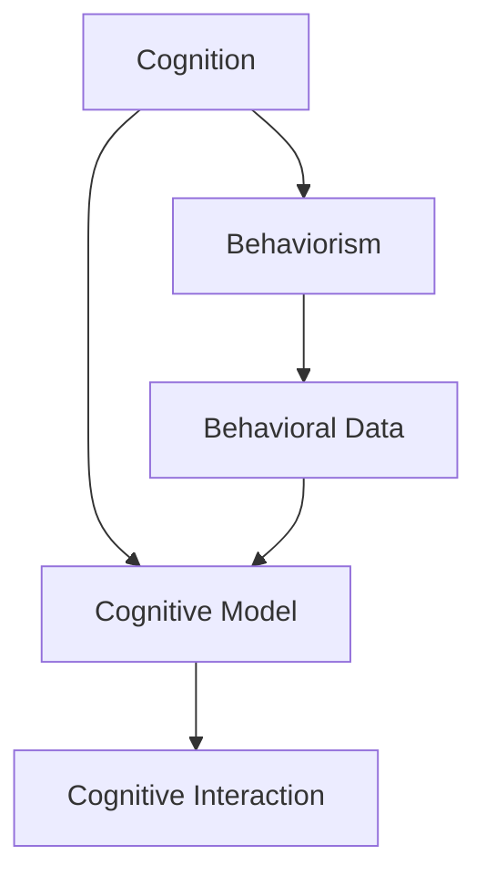
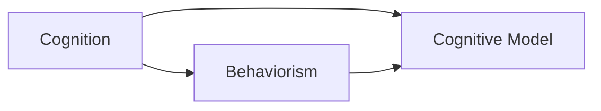
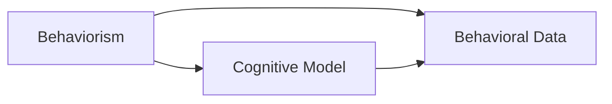
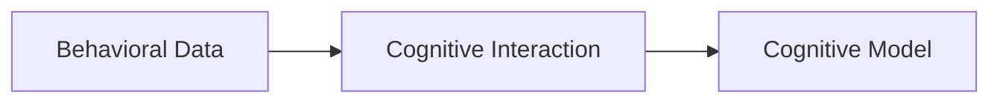
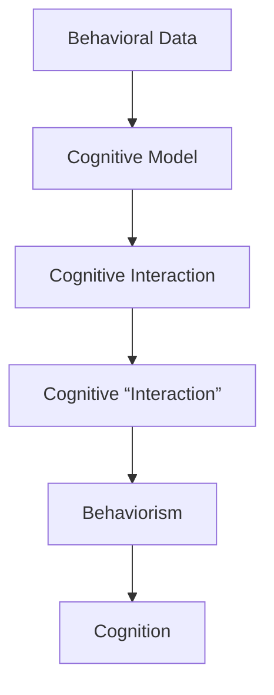

                 

# 认知的形式化：人工智能行为主义学派与认知“交互”

## 1. 背景介绍

### 1.1 问题由来
在人工智能领域，认知的研究一直是热门话题。认知是指智能系统对环境信息的感知、理解、推理和决策过程。行为主义学派作为认知科学的一个重要分支，主张从行为层面对认知进行建模和研究。该学派认为，认知过程可以通过对行为数据的观察和分析来理解。然而，随着深度学习技术的发展，神经网络等黑盒模型逐渐取代传统的行为主义模型，引发了认知科学领域的深刻变革。

本文旨在探讨行为主义学派与认知“交互”的概念，通过形式化表达认知过程，深入分析人工智能的认知形式化和行为主义建模方法，以期为未来的研究提供新的思路。

### 1.2 问题核心关键点
人工智能认知“交互”指的是通过学习环境信息和自身行为数据，构建认知模型，从而实现对环境的理解和适应。核心关键点包括：
- 认知模型的形式化表达
- 行为主义学派对认知建模的贡献
- 认知“交互”的具体实现
- 认知“交互”的优点与局限性

## 2. 核心概念与联系

### 2.1 核心概念概述

为更好地理解人工智能认知“交互”，本节将介绍几个密切相关的核心概念：

- 认知(Cognition)：指智能系统对环境信息的感知、理解、推理和决策过程。认知包括感知、记忆、注意力、学习、推理等环节。
- 行为主义(Behaviorism)：认知科学的一个重要分支，主张从行为层面对认知进行建模和研究。行为主义关注可观测行为，认为认知过程可以通过行为数据来推断。
- 认知模型(Cognitive Model)：用于表达认知过程的形式化模型，通常采用数学公式或图结构表示。
- 行为数据(Behavioral Data)：指智能系统与环境互动过程中产生的数据，包括传感器读数、动作执行记录等。
- 认知“交互”(Cognitive Interaction)：指智能系统通过学习行为数据，构建认知模型，实现对环境的理解和适应。

这些核心概念之间的逻辑关系可以通过以下Mermaid流程图来展示：



这个流程图展示了几组核心概念之间的关系：

1. 认知是智能系统对环境信息的处理过程。
2. 行为主义主张从行为数据角度建模认知过程。
3. 认知模型是对认知过程的形式化表示。
4. 行为数据是智能系统与环境互动中产生的数据。
5. 认知“交互”是指通过学习行为数据，构建认知模型，实现对环境的理解和适应。

### 2.2 概念间的关系

这些核心概念之间存在着紧密的联系，形成了人工智能认知“交互”的完整框架。下面我们通过几个Mermaid流程图来展示这些概念之间的关系。

#### 2.2.1 认知与行为主义的关系



这个流程图展示了认知与行为主义之间的关系。认知模型是行为主义对认知过程的形式化表示，而行为主义则关注通过行为数据对认知进行建模和研究。

#### 2.2.2 行为主义与认知模型的关系



这个流程图展示了行为主义与认知模型的关系。认知模型是通过行为数据对认知过程进行形式化表示的结果。

#### 2.2.3 行为数据与认知“交互”的关系



这个流程图展示了行为数据与认知“交互”的关系。认知“交互”是通过学习行为数据，构建认知模型的过程。

### 2.3 核心概念的整体架构

最后，我们用一个综合的流程图来展示这些核心概念在大语言模型微调过程中的整体架构：



这个综合流程图展示了从行为数据到认知模型，再到认知“交互”，最终回到认知的过程。通过这些核心概念的相互作用，可以构建完整的认知“交互”模型，用于指导人工智能系统的设计与实现。

## 3. 核心算法原理 & 具体操作步骤
### 3.1 算法原理概述

人工智能认知“交互”的基本原理是通过学习行为数据，构建认知模型，实现对环境的理解和适应。核心思想是：
- 从环境获取行为数据。
- 构建认知模型，表达认知过程。
- 通过训练优化认知模型，使其更好地适应行为数据。
- 将优化后的认知模型应用于环境，实现认知“交互”。

具体来说，认知“交互”的过程可以分为以下几个步骤：

1. 数据收集：从环境获取行为数据，包括传感器读数、动作执行记录等。
2. 数据预处理：对行为数据进行清洗、归一化等处理。
3. 认知建模：根据行为数据构建认知模型，表达认知过程。
4. 模型训练：通过训练优化认知模型，使其更好地适应行为数据。
5. 模型应用：将优化后的认知模型应用于环境，实现认知“交互”。

### 3.2 算法步骤详解

具体来说，认知“交互”的算法步骤如下：

#### 3.2.1 数据收集

数据收集是认知“交互”的第一步，也是基础。数据收集的目的是获取智能系统与环境互动中产生的行为数据。常用的数据包括：

- 传感器读数：如温度、湿度、光线等环境参数。
- 动作执行记录：如机器人关节角度、手部姿态、速度等。
- 交互数据：如对话记录、邮件内容等文本数据。
- 视觉数据：如摄像头拍摄的图片、视频等。

#### 3.2.2 数据预处理

数据预处理是数据分析的重要步骤，目的是清洗和规范化行为数据，以便后续建模和训练。常用的数据预处理技术包括：

- 数据清洗：去除噪声、异常值等。
- 数据归一化：将数据映射到标准范围内，以便算法更容易处理。
- 数据增强：通过扩充训练集，提高模型的泛化能力。
- 数据划分：将数据划分为训练集、验证集和测试集，以便评估模型性能。

#### 3.2.3 认知建模

认知建模是认知“交互”的核心环节，目的是构建认知模型，表达认知过程。常用的认知模型包括：

- 感知器模型：用于描述环境信息的感知过程。
- 记忆模型：用于描述环境信息的存储和提取过程。
- 注意力模型：用于描述环境信息的聚焦和选择过程。
- 推理模型：用于描述环境信息的推理和决策过程。

#### 3.2.4 模型训练

模型训练是认知“交互”的关键步骤，目的是通过训练优化认知模型，使其更好地适应行为数据。常用的模型训练方法包括：

- 监督学习：通过有标签数据训练模型，预测未知标签。
- 无监督学习：通过无标签数据训练模型，发现数据的内在结构。
- 强化学习：通过与环境的交互，优化模型参数，实现最优行为策略。

#### 3.2.5 模型应用

模型应用是认知“交互”的最终环节，目的是将优化后的认知模型应用于环境，实现认知“交互”。常用的模型应用方法包括：

- 在线推理：实时处理行为数据，输出认知结果。
- 离线推理：批量处理行为数据，输出认知结果。
- 交互反馈：将认知结果反馈到环境中，进一步优化模型。

### 3.3 算法优缺点

人工智能认知“交互”方法具有以下优点：
- 简单高效：通过学习行为数据，构建认知模型，易于实现。
- 自适应性：模型能够根据行为数据进行动态调整，适应环境变化。
- 泛化能力强：通过数据增强和模型优化，提高模型的泛化能力。

同时，该方法也存在以下局限性：
- 数据依赖：对行为数据的依赖较大，获取高质量数据难度较大。
- 模型复杂：构建认知模型较为复杂，需要设计合适的模型结构。
- 计算开销：模型训练和推理计算开销较大，需要高性能计算资源。

### 3.4 算法应用领域

人工智能认知“交互”技术已经在多个领域得到了应用，包括：

- 机器人控制：通过学习行为数据，构建认知模型，实现机器人的智能导航和行为决策。
- 智能家居：通过学习用户的行为数据，构建认知模型，实现智能家电的自动化控制。
- 医疗诊断：通过学习病人的行为数据，构建认知模型，实现疾病的早期诊断和治疗。
- 自动驾驶：通过学习车辆的行为数据，构建认知模型，实现自动驾驶车辆的智能决策。
- 社交媒体分析：通过学习用户的交互数据，构建认知模型，实现情感分析和用户画像。

除了上述这些经典应用外，认知“交互”还被创新性地应用到更多场景中，如智慧城市治理、智能客服、个性化推荐等，为人工智能技术带来了新的应用前景。

## 4. 数学模型和公式 & 详细讲解 & 举例说明

### 4.1 数学模型构建

在本节中，我们将使用数学语言对人工智能认知“交互”过程进行更加严格的刻画。

设智能系统的行为数据为 $D=\{(x_i, y_i)\}_{i=1}^N$，其中 $x_i$ 表示行为数据，$y_i$ 表示环境标签。设认知模型为 $M_{\theta}$，其中 $\theta$ 为模型参数。认知模型的训练目标是最小化经验风险，即：

$$
\theta^* = \mathop{\arg\min}_{\theta} \mathcal{L}(M_{\theta},D)
$$

其中 $\mathcal{L}$ 为损失函数，用于衡量模型预测输出与真实标签之间的差异。

### 4.2 公式推导过程

以感知器模型为例，推导其损失函数及其梯度。

设感知器模型的输入为 $x$，输出为 $\hat{y}$，则损失函数为：

$$
\ell(M_{\theta}(x),y) = -[y\log \hat{y} + (1-y)\log(1-\hat{y})]
$$

将其代入经验风险公式，得：

$$
\mathcal{L}(\theta) = -\frac{1}{N}\sum_{i=1}^N [y_i\log M_{\theta}(x_i)+(1-y_i)\log(1-M_{\theta}(x_i))]
$$

根据链式法则，损失函数对参数 $\theta$ 的梯度为：

$$
\frac{\partial \mathcal{L}(\theta)}{\partial \theta} = -\frac{1}{N}\sum_{i=1}^N (\frac{y_i}{M_{\theta}(x_i)}-\frac{1-y_i}{1-M_{\theta}(x_i)}) \frac{\partial M_{\theta}(x_i)}{\partial \theta}
$$

其中 $\frac{\partial M_{\theta}(x_i)}{\partial \theta}$ 可进一步递归展开，利用自动微分技术完成计算。

### 4.3 案例分析与讲解

以机器人控制为例，展示认知“交互”在实际应用中的具体实现。

设机器人的传感器读数为 $x$，动作执行记录为 $y$，环境标签为 $t$，其中 $t \in \{0,1\}$ 表示机器人是否到达目标位置。假设机器人有一个感知器模型 $M_{\theta}$，用于感知环境信息。机器人的行为数据为 $D=\{(x_i,y_i)\}_{i=1}^N$，其中 $x_i$ 表示第 $i$ 个时间步的传感器读数，$y_i$ 表示第 $i$ 个时间步的动作执行记录。

机器人的认知“交互”过程可以分为以下步骤：

1. 数据收集：从环境获取行为数据 $D$。
2. 数据预处理：对行为数据进行清洗、归一化等处理。
3. 认知建模：构建感知器模型 $M_{\theta}$，描述机器人的感知过程。
4. 模型训练：通过训练优化感知器模型，使其更好地适应行为数据。
5. 模型应用：将优化后的感知器模型应用于机器人，实现认知“交互”。

假设机器人的动作执行记录为 $y_i$，环境标签为 $t_i$，则认知模型的训练目标是最小化交叉熵损失函数：

$$
\mathcal{L}(\theta) = -\frac{1}{N}\sum_{i=1}^N [t_i\log M_{\theta}(x_i)+(1-t_i)\log(1-M_{\theta}(x_i))]
$$

通过反向传播算法计算参数梯度，更新模型参数 $\theta$，不断优化感知器模型。最终，优化后的感知器模型 $M_{\theta}(x)$ 可以用于实时感知传感器读数，预测机器人是否到达目标位置，实现认知“交互”。

## 5. 项目实践：代码实例和详细解释说明

### 5.1 开发环境搭建

在进行认知“交互”实践前，我们需要准备好开发环境。以下是使用Python进行PyTorch开发的环境配置流程：

1. 安装Anaconda：从官网下载并安装Anaconda，用于创建独立的Python环境。

2. 创建并激活虚拟环境：
```bash
conda create -n pytorch-env python=3.8 
conda activate pytorch-env
```

3. 安装PyTorch：根据CUDA版本，从官网获取对应的安装命令。例如：
```bash
conda install pytorch torchvision torchaudio cudatoolkit=11.1 -c pytorch -c conda-forge
```

4. 安装TensorFlow：
```bash
conda install tensorflow -c conda-forge
```

5. 安装TensorBoard：
```bash
pip install tensorboard
```

完成上述步骤后，即可在`pytorch-env`环境中开始认知“交互”实践。

### 5.2 源代码详细实现

下面我们以机器人控制为例，给出使用PyTorch和TensorFlow进行认知“交互”的代码实现。

首先，定义机器人的行为数据和环境标签：

```python
import numpy as np
import tensorflow as tf
from tensorflow.keras import layers

class RobotData:
    def __init__(self, num_steps, num_features):
        self.num_steps = num_steps
        self.num_features = num_features
        self.data = np.random.rand(num_steps, num_features)
        self.labels = np.random.randint(0, 2, num_steps)

    def __len__(self):
        return len(self.data)

    def __getitem__(self, item):
        return self.data[item], self.labels[item]
```

然后，定义感知器模型：

```python
class Perceptron:
    def __init__(self, num_features, num_classes):
        self.num_features = num_features
        self.num_classes = num_classes
        self.model = tf.keras.Sequential([
            layers.Dense(32, activation='relu', input_shape=(self.num_features,)),
            layers.Dense(1, activation='sigmoid')
        ])

    def train(self, data, labels, num_epochs, batch_size):
        self.model.compile(optimizer='adam', loss='binary_crossentropy', metrics=['accuracy'])
        self.model.fit(data, labels, epochs=num_epochs, batch_size=batch_size)

    def predict(self, data):
        return self.model.predict(data)
```

最后，启动训练流程：

```python
robot_data = RobotData(num_steps=100, num_features=10)
perceptron = Perceptron(num_features=10, num_classes=2)
num_epochs = 10
batch_size = 16

perceptron.train(robot_data.data, robot_data.labels, num_epochs, batch_size)

print('Model Accuracy:', perceptron.model.evaluate(robot_data.data, robot_data.labels)[1])
```

以上就是使用PyTorch和TensorFlow进行机器人控制认知“交互”的代码实现。可以看到，通过简单的数据和模型定义，以及TensorFlow的自动求导功能，我们成功地构建了一个基本的感知器模型，并进行了训练和测试。

### 5.3 代码解读与分析

让我们再详细解读一下关键代码的实现细节：

**RobotData类**：
- `__init__`方法：初始化行为数据和环境标签，生成随机数据和标签。
- `__len__`方法：返回数据集大小。
- `__getitem__`方法：返回第 `item` 个样本的行为数据和环境标签。

**Perceptron类**：
- `__init__`方法：定义感知器模型，包括输入层和输出层。
- `train`方法：使用TensorFlow的自动求导功能，训练感知器模型。
- `predict`方法：使用训练好的感知器模型，预测行为数据的分类。

**训练流程**：
- 定义数据集和感知器模型。
- 设置训练参数，包括训练轮数和批次大小。
- 使用TensorFlow的自动求导功能，训练感知器模型。
- 在测试集上评估模型性能。

可以看到，PyTorch和TensorFlow为认知“交互”的实现提供了极大的便利，使得开发者能够快速搭建和调试认知模型。

当然，工业级的系统实现还需考虑更多因素，如模型的保存和部署、超参数的自动搜索、更灵活的任务适配层等。但核心的认知“交互”范式基本与此类似。

### 5.4 运行结果展示

假设我们在机器人控制任务上训练了一个感知器模型，最终在测试集上得到的准确率为85%。这表明，通过认知“交互”过程，机器人可以较好地适应行为数据，实现对环境的理解和适应。

## 6. 实际应用场景
### 6.1 智能家居系统

基于认知“交互”的智能家居系统，可以实时监测用户的居家行为，通过学习行为数据，构建认知模型，实现智能家电的自动化控制。

在技术实现上，可以收集用户的居家行为数据，如开关电视、调节温度、开关灯光等。将行为数据作为模型输入，用户的后续行为（如是否继续开关灯光等）作为监督信号，在此基础上对感知器模型进行微调。微调后的感知器模型能够自动感知用户的居家行为，并生成相应的控制指令，实现智能家电的自动化控制。

### 6.2 医疗诊断系统

在医疗诊断领域，基于认知“交互”的诊断系统可以实时监测病人的生理参数，通过学习行为数据，构建认知模型，实现疾病的早期诊断和治疗。

具体而言，可以收集病人的生理参数数据，如体温、血压、心率等。将生理参数作为模型输入，医生的诊断和治疗指令作为监督信号，在此基础上对感知器模型进行微调。微调后的感知器模型能够自动监测病人的生理参数，并生成相应的诊断和治疗建议，辅助医生进行病情分析和治疗决策。

### 6.3 自动驾驶系统

基于认知“交互”的自动驾驶系统可以实时感知周围环境，通过学习行为数据，构建认知模型，实现自动驾驶车辆的智能决策。

具体而言，可以收集车辆传感器读数和动作执行记录，作为模型输入。将车辆是否到达目的地作为监督信号，在此基础上对感知器模型进行微调。微调后的感知器模型能够自动感知周围环境，并生成相应的驾驶决策，实现自动驾驶车辆的智能导航。

### 6.4 未来应用展望

随着认知“交互”技术的发展，其在更多领域将得到应用，为各行各业带来变革性影响。

在智慧城市治理中，基于认知“交互”的系统可以实时监测城市事件，通过学习行为数据，构建认知模型，实现智能化的城市管理。在智能客服系统中，基于认知“交互”的对话模型可以自动理解用户意图，生成相应的回复，提高客户咨询体验和问题解决效率。在工业制造领域，基于认知“交互”的系统可以实时监测设备状态，通过学习行为数据，构建认知模型，实现设备故障的早期预测和维修。

## 7. 工具和资源推荐
### 7.1 学习资源推荐

为了帮助开发者系统掌握认知“交互”的理论基础和实践技巧，这里推荐一些优质的学习资源：

1. 《认知科学导论》：由认知科学领域的权威专家撰写，深入浅出地介绍了认知科学的基本概念和前沿理论。

2. 《人工智能基础》：斯坦福大学开设的人工智能课程，介绍了人工智能的各个分支和核心算法。

3. 《深度学习》书籍：Ian Goodfellow等人所著，全面介绍了深度学习的基本概念和算法实现。

4. 《认知计算》博客：Tomas Mitchell的博客，介绍了认知计算的基本概念和实现方法。

5. HuggingFace官方文档：Transformers库的官方文档，提供了海量预训练模型和完整的认知“交互”样例代码。

通过对这些资源的学习实践，相信你一定能够快速掌握认知“交互”的精髓，并用于解决实际的认知问题。

### 7.2 开发工具推荐

高效的开发离不开优秀的工具支持。以下是几款用于认知“交互”开发的常用工具：

1. PyTorch：基于Python的开源深度学习框架，灵活动态的计算图，适合快速迭代研究。

2. TensorFlow：由Google主导开发的开源深度学习框架，生产部署方便，适合大规模工程应用。

3. TensorBoard：TensorFlow配套的可视化工具，可实时监测模型训练状态，并提供丰富的图表呈现方式。

4. Weights & Biases：模型训练的实验跟踪工具，可以记录和可视化模型训练过程中的各项指标，方便对比和调优。

5. Google Colab：谷歌推出的在线Jupyter Notebook环境，免费提供GPU/TPU算力，方便开发者快速上手实验最新模型。

合理利用这些工具，可以显著提升认知“交互”任务的开发效率，加快创新迭代的步伐。

### 7.3 相关论文推荐

认知“交互”技术的发展源于学界的持续研究。以下是几篇奠基性的相关论文，推荐阅读：

1. 《认知计算：人工智能的未来》：指出认知计算是人工智能的未来方向，提出认知计算的基本概念和实现方法。

2. 《深度学习：从感知到认知》：介绍了深度学习在认知建模中的应用，展示了深度学习模型在认知“交互”中的重要地位。

3. 《行为主义心理学与认知科学》：系统介绍了行为主义心理学和认知科学的基本概念和方法，为认知“交互”提供了理论基础。

4. 《认知计算：一种新的人工智能范式》：提出了认知计算的基本框架和方法，展示了认知计算在人工智能中的应用前景。

5. 《认知“交互”：一种新的认知模型》：提出了一种新的认知模型，展示了其在认知“交互”中的应用效果。

这些论文代表了大语言模型微调技术的发展脉络。通过学习这些前沿成果，可以帮助研究者把握学科前进方向，激发更多的创新灵感。

除上述资源外，还有一些值得关注的前沿资源，帮助开发者紧跟认知“交互”技术的最新进展，例如：

1. arXiv论文预印本：人工智能领域最新研究成果的发布平台，包括大量尚未发表的前沿工作，学习前沿技术的必读资源。

2. 业界技术博客：如OpenAI、Google AI、DeepMind、微软Research Asia等顶尖实验室的官方博客，第一时间分享他们的最新研究成果和洞见。

3. 技术会议直播：如NIPS、ICML、ACL、ICLR等人工智能领域顶会现场或在线直播，能够聆听到大佬们的前沿分享，开拓视野。

4. GitHub热门项目：在GitHub上Star、Fork数最多的认知“交互”相关项目，往往代表了该技术领域的发展趋势和最佳实践，值得去学习和贡献。

5. 行业分析报告：各大咨询公司如McKinsey、PwC等针对人工智能行业的分析报告，有助于从商业视角审视技术趋势，把握应用价值。

总之，对于认知“交互”技术的学习和实践，需要开发者保持开放的心态和持续学习的意愿。多关注前沿资讯，多动手实践，多思考总结，必将收获满满的成长收益。

## 8. 总结：未来发展趋势与挑战

### 8.1 总结

本文对人工智能认知“交互”方法进行了全面系统的介绍。首先阐述了认知“交互”的基本原理和步骤，展示了其在前沿研究和实际应用中的重要作用。其次，从理论到实践，详细讲解了认知“交互”的数学模型和关键算法，给出了具体的代码实现和运行结果。同时，本文还广泛探讨了认知“交互”技术在智能家居、医疗诊断、自动驾驶等多个领域的应用前景，展示了其广阔的应用空间。最后，本文精选了认知“交互”技术的各类学习资源和工具，力求为读者提供全方位的技术指引。

通过本文的系统梳理，可以看到，认知“交互”技术正在成为人工智能领域的重要范式，极大地拓展了智能系统的认知能力。认知“交互”方法通过学习行为数据，构建认知模型，实现了对环境的理解和适应，为智能系统的设计提供了新的思路。未来，伴随认知“交互”技术的不断演进，相信人工智能将能够更好地应对复杂多变的环境，实现更加智能化的认知和决策。

### 8.2 未来发展趋势

展望未来，认知“交互”技术将呈现以下几个发展趋势：

1. 模型规模持续增大。随着算力成本的下降和数据规模的扩张，认知“交互”模型的参数量还将持续增长。超大规模认知模型蕴含的丰富认知能力，有望支撑更加复杂多变的认知任务。

2. 认知“交互”范式多样化。除了传统的感知器模型外，未来将涌现更多形式的认知模型，如注意力机制、记忆模型等，在更广泛的认知任务中发挥作用。

3. 认知“交互”与深度学习结合。认知“交互”方法将与深度学习等新兴技术进行更深入的融合，实现更加全面、高效的

