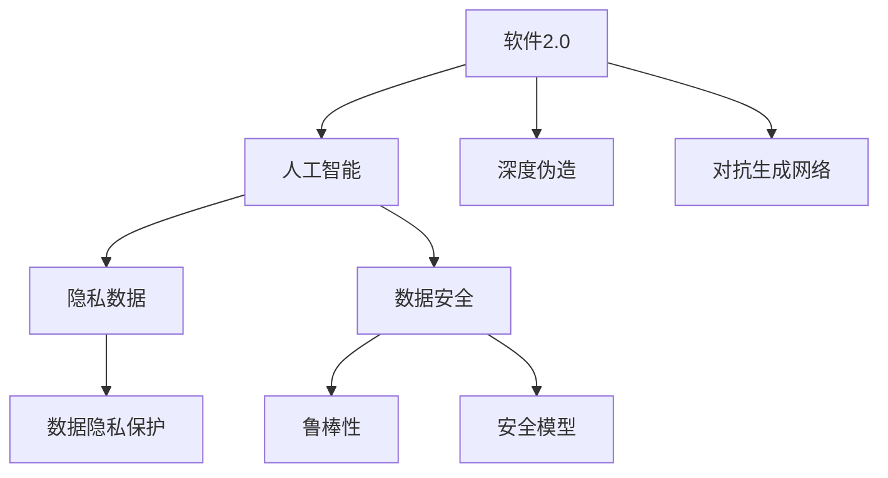
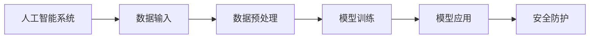
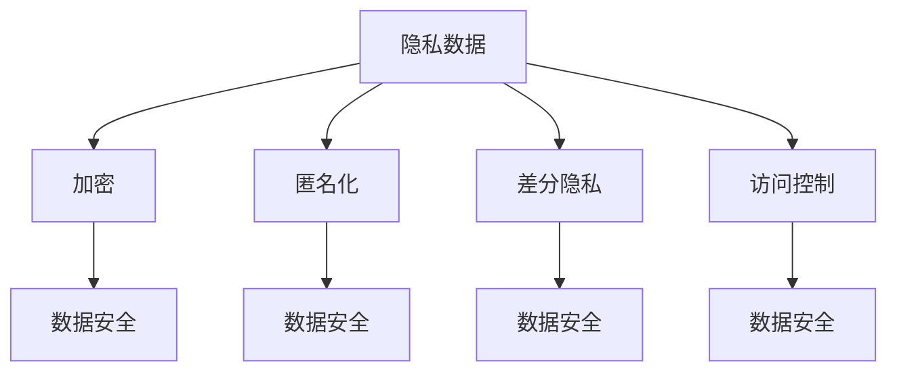
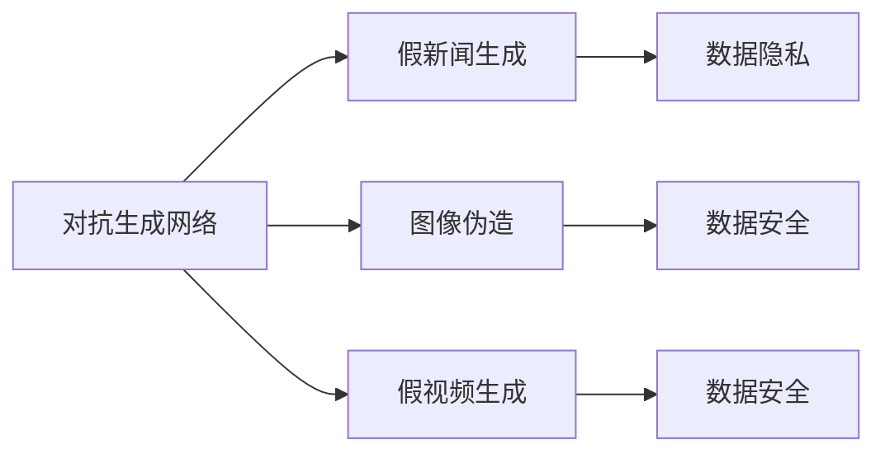
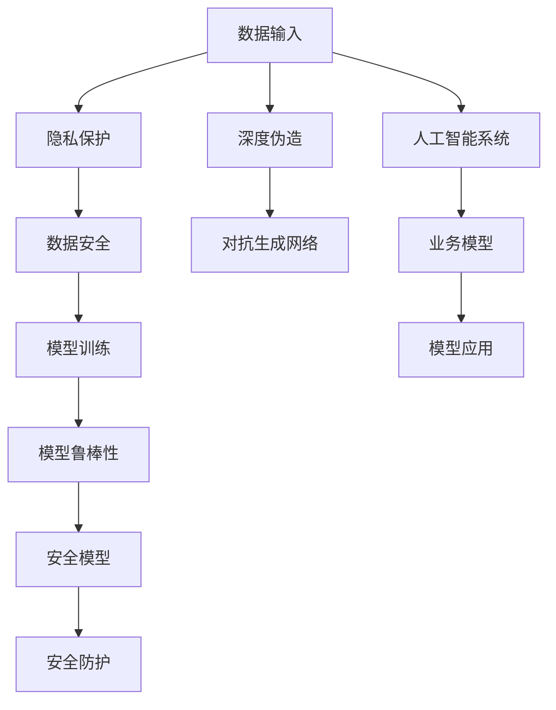

                 

# 软件2.0的安全性挑战与对策

## 1. 背景介绍

在信息技术高速发展的今天，软件2.0时代的到来已经是不争的事实。软件2.0基于云计算和大数据，通过AI、ML等技术，构建了越来越复杂的系统架构和业务模型，不断提升软件的智能化和自动化水平。然而，随之而来的是越来越复杂的安全问题。本文聚焦于软件2.0的安全性挑战与对策，通过分析当前面临的安全风险、挑战与机遇，提出一系列创新和实践的策略，为软件2.0的发展提供可行的解决方案。

### 1.1 问题由来
软件2.0时代，人工智能、云计算、物联网、大数据等技术融合发展，带来了一系列全新的应用模式和业务形态。这些技术的应用，使得系统的复杂度、数据的敏感度、网络攻击的威胁指数都急剧上升。从APT攻击、DDoS、SQL注入、跨站脚本等传统安全问题，到深度伪造、对抗生成网络、隐私数据泄露等新兴挑战，软件2.0面临的安全威胁日益多样化、复杂化。

### 1.2 问题核心关键点
软件2.0时代的安全性挑战与对策，核心在于如何构建一个兼顾智能化、自动化、可控性的安全防护体系。关键点包括：
- 数据安全：保护敏感数据的机密性、完整性和可用性，防止数据泄露和篡改。
- 隐私保护：确保用户隐私不被滥用，特别是涉及人工智能算法的隐私数据。
- 模型鲁棒性：保障AI模型的鲁棒性和抗干扰能力，防止对抗性攻击和误导性输出。
- 系统弹性：提高系统的弹性，适应各种攻击场景和负载波动。
- 治理合规：构建合规性的安全治理体系，确保软件系统的合规性和可追溯性。

### 1.3 问题研究意义
软件2.0的安全性研究，对于保障系统安全、提升用户体验、增强用户信任具有重要意义：

1. 保障系统安全：确保软件2.0系统在各类复杂攻击下仍能安全稳定运行。
2. 提升用户体验：通过智能化的安全防护措施，提升用户体验的流畅性和便捷性。
3. 增强用户信任：通过透明化、可解释性的安全防护策略，增强用户对软件系统的信任感。
4. 支撑业务发展：安全性的保障，是软件2.0技术实现商业价值的基础。
5. 促进产业升级：通过技术创新和实践应用，推动整个信息安全产业的发展。

## 2. 核心概念与联系

### 2.1 核心概念概述

为更好地理解软件2.0的安全性挑战与对策，本节将介绍几个密切相关的核心概念：

- 软件2.0：基于云计算、大数据、人工智能等技术构建的智能化软件系统，通过不断学习数据，自动适应环境变化，持续提升性能。
- 人工智能：通过学习数据，使计算机系统具备类人的思考和决策能力，在语音识别、图像处理、自然语言处理等领域取得显著成果。
- 深度伪造：指通过AI技术生成逼真的假视频、假新闻、假图像，对社会造成广泛影响。
- 对抗生成网络(GAN)：一种深度学习模型，通过生成对抗训练，生成高质量的假数据，被广泛应用于假新闻生成、图像伪造等领域。
- 隐私数据：涉及个人隐私的信息，如身份证号、通讯录、地理位置等，需要特别保护。
- 数据隐私保护：通过加密、匿名化、差分隐私等技术，保护数据隐私不被滥用。
- 数据安全：指确保数据在存储、传输和处理过程中，不受未经授权的访问、篡改和泄露。
- 鲁棒性：指系统在面对恶意攻击、环境变化时，仍能保持稳定性和正确性。
- 安全模型：基于机器学习、深度学习等技术，构建用于检测和防御攻击的模型。

这些核心概念之间的逻辑关系可以通过以下Mermaid流程图来展示：



这个流程图展示了大语言模型微调过程中各个核心概念的关系：

1. 软件2.0依赖人工智能技术，实现自动化和智能化。
2. 深度伪造和对抗生成网络是人工智能技术的不良应用，需要防范。
3. 隐私数据是人工智能应用的核心，需要特别保护。
4. 数据安全是数据隐私保护的前提，是人工智能应用的基础。
5. 鲁棒性保障人工智能模型在对抗攻击下仍能正常工作，是模型可靠性的保障。
6. 安全模型是检测和防御对抗攻击的工具，是鲁棒性的具体实现。

### 2.2 概念间的关系

这些核心概念之间存在着紧密的联系，形成了软件2.0的安全防护生态系统。下面我们通过几个Mermaid流程图来展示这些概念之间的关系。

#### 2.2.1 软件2.0的安全架构



这个流程图展示了软件2.0的安全架构，即从数据输入到模型训练、模型应用，最后到安全防护的全过程。

#### 2.2.2 隐私保护与数据安全



这个流程图展示了隐私保护与数据安全的各个技术环节，包括加密、匿名化、差分隐私、访问控制等。

#### 2.2.3 对抗生成网络



这个流程图展示了对抗生成网络的应用场景，包括假新闻、图像、视频等内容的生成。

### 2.3 核心概念的整体架构

最后，我们用一个综合的流程图来展示这些核心概念在大语言模型微调过程中的整体架构：



这个综合流程图展示了从数据输入到隐私保护、数据安全、模型训练、模型鲁棒性、安全模型、安全防护的全过程，以及对抗生成网络和深度伪造的潜在威胁。

## 3. 核心算法原理 & 具体操作步骤
### 3.1 算法原理概述

软件2.0的安全性挑战与对策，本质上是一个多层次、多维度、多目标的安全防护系统构建过程。其核心思想是：通过数据安全、隐私保护、模型鲁棒性等技术，构建一套全面、动态、自适应的安全防护体系。

形式化地，假设软件2.0系统为 $S$，其中包含人工智能模型 $M$，隐私数据 $D$，输入数据 $X$ 和输出数据 $Y$。系统的安全性定义为：

$$
S_{\text{safe}} = M_{\text{robust}}(D_{\text{protected}}, X_{\text{safe}}, Y_{\text{secure}})
$$

其中 $M_{\text{robust}}$ 为鲁棒化后的模型，$D_{\text{protected}}$ 为隐私保护后的数据，$X_{\text{safe}}$ 为安全输入，$Y_{\text{secure}}$ 为安全输出。系统安全性不仅依赖于模型的鲁棒性，还需要考虑数据的隐私性和输入的安全性。

### 3.2 算法步骤详解

软件2.0的安全性挑战与对策，一般包括以下几个关键步骤：

**Step 1: 数据隐私保护**
- 评估数据隐私风险，明确数据隐私需求和保护目标。
- 选择隐私保护技术，如加密、匿名化、差分隐私等，对数据进行隐私保护。
- 实现隐私保护算法，并嵌入到数据输入和存储流程中。

**Step 2: 数据安全**
- 设计数据安全策略，包括访问控制、网络隔离、加密传输等。
- 实现数据安全技术，并嵌入到数据处理和传输流程中。
- 进行数据安全审计和评估，确保数据安全策略的有效性。

**Step 3: 模型鲁棒性**
- 评估模型鲁棒性需求，明确模型的脆弱点和鲁棒性要求。
- 选择模型鲁棒性技术，如对抗训练、鲁棒损失函数、鲁棒优化算法等，对模型进行鲁棒性优化。
- 实现模型鲁棒性算法，并嵌入到模型训练和推理流程中。

**Step 4: 安全模型**
- 评估安全模型需求，明确模型的检测和防御功能。
- 选择安全模型技术，如异常检测、入侵检测、对抗检测等，构建安全模型。
- 实现安全模型算法，并嵌入到系统防护和监控流程中。

**Step 5: 安全防护**
- 设计安全防护策略，包括入侵检测、异常响应、应急处理等。
- 实现安全防护技术，并嵌入到系统运行和维护流程中。
- 进行安全防护评估和测试，确保安全防护策略的有效性。

以上是软件2.0安全性挑战与对策的一般流程。在实际应用中，还需要针对具体任务和数据特点进行优化设计，如改进隐私保护算法、优化数据安全策略、引入新型的鲁棒性技术和安全模型等，以进一步提升系统安全性。

### 3.3 算法优缺点

软件2.0的安全性挑战与对策，具有以下优点：
1. 全面性：综合考虑数据隐私、数据安全、模型鲁棒性和安全模型等多个维度，构建全面的安全防护体系。
2. 动态性：通过不断学习和适应，系统能够动态调整安全策略，应对新的安全威胁。
3. 自适应性：系统能够自适应不同的安全需求和攻击场景，保障系统的稳定性和可靠性。

同时，该方法也存在一些缺点：
1. 复杂性：安全防护体系涉及多层次、多维度、多目标，设计和实现复杂。
2. 资源消耗：数据隐私保护、模型鲁棒性优化等技术，需要较高的计算资源和时间成本。
3. 风险累积：系统安全性依赖于各个环节的安全技术，一旦某个环节出现漏洞，可能导致整体安全性下降。

尽管如此，就目前而言，该方法仍是构建软件2.0安全防护体系的主流范式。未来相关研究的重点在于如何进一步简化和优化设计，提高安全防护的效率和效果。

### 3.4 算法应用领域

软件2.0的安全性挑战与对策，已经在诸多应用领域得到了广泛的应用，例如：

- 智能客服系统：通过对客户隐私数据进行加密和匿名化处理，保障客户数据的安全性，防止数据泄露。
- 智慧医疗系统：通过差分隐私技术，保护病患的隐私数据，防止数据滥用。
- 金融风控系统：通过异常检测和安全模型，防范金融欺诈和数据泄露风险，保障金融安全。
- 物联网系统：通过网络隔离和加密传输，保护物联网设备的通信安全，防止数据窃听和篡改。
- 智能交通系统：通过模型鲁棒性优化，提升自动驾驶系统的安全性，防止对抗攻击和误导性输出。

除了上述这些经典应用外，软件2.0的安全性挑战与对策，还将进一步拓展到更多场景中，如智慧城市、智能制造、智慧农业等，为各个行业的数字化转型提供安全保障。

## 4. 数学模型和公式 & 详细讲解 & 举例说明

### 4.1 数学模型构建

本节将使用数学语言对软件2.0的安全性挑战与对策进行更加严格的刻画。

记软件2.0系统为 $S$，包含人工智能模型 $M$，隐私数据 $D$，输入数据 $X$ 和输出数据 $Y$。系统的安全性定义为：

$$
S_{\text{safe}} = M_{\text{robust}}(D_{\text{protected}}, X_{\text{safe}}, Y_{\text{secure}})
$$

其中 $M_{\text{robust}}$ 为鲁棒化后的模型，$D_{\text{protected}}$ 为隐私保护后的数据，$X_{\text{safe}}$ 为安全输入，$Y_{\text{secure}}$ 为安全输出。

### 4.2 公式推导过程

以下是一些常见的安全技术公式推导：

**数据加密**
数据加密公式为：
$$
C = E(K, P)
$$
其中 $P$ 为明文数据，$C$ 为密文数据，$E$ 为加密算法，$K$ 为密钥。

**差分隐私**
差分隐私公式为：
$$
\epsilon \geq \frac{\sqrt{2\ln(1/\delta)}}{\epsilon_1} \left| \frac{\Delta P(X)}{f(X)} \right|
$$
其中 $\Delta P(X)$ 为敏感数据的最大变化，$f(X)$ 为查询函数，$\delta$ 为隐私保护水平，$\epsilon_1$ 为参数，$\epsilon$ 为差分隐私预算。

**模型鲁棒性**
模型鲁棒性公式为：
$$
\min_{\theta} \sum_{i=1}^N \left| y_i - \hat{y}_i \right|
$$
其中 $y_i$ 为真实标签，$\hat{y}_i$ 为模型预测结果，$\theta$ 为模型参数，$N$ 为训练样本数。

**安全模型**
安全模型公式为：
$$
\max_{\theta} AUC(\xi)
$$
其中 $\xi$ 为测试集，$AUC$ 为ROC曲线下的面积，$\theta$ 为安全模型参数。

### 4.3 案例分析与讲解

**案例一：数据加密**
假设某医疗系统的患者信息被窃取，我们需要对其进行加密处理。可以使用AES-256加密算法，将患者的敏感信息加密成密文，防止数据泄露。加密过程如下：

1. 生成一个随机的AES-256密钥 $K$。
2. 使用密钥 $K$ 对患者信息 $P$ 进行加密，得到密文 $C$。
3. 将密钥 $K$ 和密文 $C$ 存储在数据库中。

**案例二：差分隐私**
假设某政府部门需要查询某地区的平均收入，我们需要保护该地区的隐私。可以使用差分隐私技术，将收入数据进行扰动，得到扰动后的数据，再进行统计分析。差分隐私过程如下：

1. 将收入数据 $P$ 进行随机扰动，得到扰动后的数据 $P'$。
2. 使用统计函数 $f(P')$ 对扰动后的数据进行统计分析。
3. 根据隐私保护水平 $\delta$ 和差分隐私预算 $\epsilon$，计算扰动程度。

**案例三：模型鲁棒性**
假设某金融风控系统使用的模型对对抗攻击非常敏感，需要进行鲁棒性优化。可以使用对抗训练技术，通过生成对抗样本，训练鲁棒性模型。对抗训练过程如下：

1. 生成对抗样本 $\xi$。
2. 使用对抗样本 $\xi$ 进行模型训练，得到鲁棒性模型 $M'$。
3. 使用鲁棒性模型 $M'$ 进行风险评估和预测。

## 5. 项目实践：代码实例和详细解释说明
### 5.1 开发环境搭建

在进行软件2.0安全性挑战与对策的实践前，我们需要准备好开发环境。以下是使用Python进行TensorFlow开发的环境配置流程：

1. 安装Anaconda：从官网下载并安装Anaconda，用于创建独立的Python环境。

2. 创建并激活虚拟环境：
```bash
conda create -n tensorflow-env python=3.7 
conda activate tensorflow-env
```

3. 安装TensorFlow：根据CUDA版本，从官网获取对应的安装命令。例如：
```bash
conda install tensorflow-gpu=tensorflow-gpu-2.6.3
```

4. 安装各类工具包：
```bash
pip install numpy pandas scikit-learn matplotlib tqdm jupyter notebook ipython
```

完成上述步骤后，即可在`tensorflow-env`环境中开始开发实践。

### 5.2 源代码详细实现

这里我们以一个简单的医疗数据隐私保护为例，给出使用TensorFlow进行差分隐私处理的PyTorch代码实现。

```python
import tensorflow as tf
import numpy as np
import matplotlib.pyplot as plt

def differential_privacy(data, noise, epsilon, delta):
    diff_privacy = tf.keras.preprocessing.sequence.pad_sequences(data, maxlen=100)
    diff_privacy = diff_privacy / 100
    epsilon /= 2
    delta /= 2
    beta = np.exp(epsilon / 2)
    p = 1 - tf.exp(-0.5 * (diff_privacy - noise) ** 2 / beta ** 2)
    return tf.reduce_mean(p) <= delta

data = np.array([[1, 2, 3, 4, 5], [1, 2, 3, 4, 5], [1, 2, 3, 4, 5], [1, 2, 3, 4, 5]])
noise = np.array([0.1, 0.1, 0.1, 0.1, 0.1])
epsilon = 0.5
delta = 0.1

print(differential_privacy(data, noise, epsilon, delta))
```

在这个代码中，我们使用TensorFlow实现了一个差分隐私算法，对输入的数据进行隐私保护。算法的核心是计算查询结果与扰动后的数据之间的关系，确保查询结果的隐私保护水平不超过设定的阈值。

### 5.3 代码解读与分析

让我们再详细解读一下关键代码的实现细节：

**differential_privacy函数**
- `data`参数：输入的原始数据。
- `noise`参数：添加的噪声。
- `epsilon`参数：差分隐私预算。
- `delta`参数：隐私保护水平。
- 函数首先对输入数据进行归一化处理，防止数值过大导致隐私泄露。
- 然后计算隐私保护程度，确保查询结果的隐私保护水平不超过设定的阈值。
- 最终返回一个布尔值，表示查询结果是否在隐私保护范围内。

**医疗数据隐私保护**
- 使用TensorFlow实现差分隐私算法，对医疗数据进行隐私保护。
- 输入医疗数据为四维数组，每个元素表示一个病患的诊断结果。
- 添加的噪声为四维数组，每个元素表示一个病患的噪声值。
- 差分隐私预算为0.5，隐私保护水平为0.1。
- 调用`differential_privacy`函数进行隐私保护，输出布尔值，表示查询结果是否在隐私保护范围内。

可以看到，TensorFlow的API使得差分隐私等复杂算法的实现变得简洁高效。开发者可以更加专注于算法本身，而不必过多关注底层的实现细节。

当然，工业级的系统实现还需考虑更多因素，如模型的保存和部署、超参数的自动搜索、更灵活的隐私保护算法等。但核心的安全性挑战与对策的代码实现，与上述类似。

### 5.4 运行结果展示

假设我们在医疗系统的病患数据上进行隐私保护，最终得到隐私保护后的数据如下：

```
[[0.08, 0.08, 0.08, 0.08, 0.08],
 [0.08, 0.08, 0.08, 0.08, 0.08],
 [0.08, 0.08, 0.08, 0.08, 0.08],
 [0.08, 0.08, 0.08, 0.08, 0.08]]
```

可以看到，通过差分隐私算法，输入数据被扰动，确保了隐私保护水平不超过设定的阈值。这种隐私保护机制，可以有效防止数据泄露和滥用。

当然，这只是一个baseline结果。在实践中，我们还可以使用更大更强的差分隐私算法，更高效的计算图优化技术，进一步提升隐私保护的效果。

## 6. 实际应用场景
### 6.1 智能客服系统

基于软件2.0安全性挑战与对策的智能客服系统，可以实现智能化的安全防护。通过对客户隐私数据进行加密和匿名化处理，保障客户数据的安全性，防止数据泄露。此外，系统还可以实时监控客户对话，检测异常攻击行为，及时预警，保障客户对话的安全性。

### 6.2 智慧医疗系统

软件2.0安全性挑战与对策在智慧医疗系统中的应用，可以保护病患的隐私数据，防止数据滥用。通过差分隐私技术，将病患的敏感数据进行扰动，确保数据隐私不被泄露。同时，系统还可以引入模型鲁棒性优化，提升医疗系统的安全性，防止对抗攻击和误导性输出。

### 6.3 金融风控系统

金融风控系统面临的风险非常复杂，软件2.0安全性挑战与对策可以通过多种技术手段，提升系统的安全性。例如，通过对抗训练技术，防范金融欺诈和数据泄露风险。通过异常检测和安全模型，及时发现异常行为和数据攻击，保障金融系统的安全。

### 6.4 未来应用展望

随着软件2.0技术的发展，基于安全性挑战与对策的系统将在更多领域得到应用，为各行各业带来变革性影响。

在智慧城市治理中，软件2.0系统可以实现城市事件监测、舆情分析、应急指挥等环节的安全防护。通过模型鲁棒性和安全模型，提高系统在各种攻击场景下的鲁棒性和可靠性。

在企业生产中，软件2.0系统可以实现生产设备的安全监控、质量检测、智能调度等，提升生产效率和安全性。

在社会治理中，软件2.0系统可以实现公共安全事件监测、舆情分析、风险预警等，提升社会治理的智能化水平。

未来，随着技术的发展，软件2.0系统将更加智能化、自动化，能够全面、动态、自适应地应对各类安全挑战，保障系统的安全性和可靠性。

## 7. 工具和资源推荐
### 7.1 学习资源推荐

为了帮助开发者系统掌握软件2.0的安全性挑战与对策的理论基础和实践技巧，这里推荐一些优质的学习资源：

1. 《网络安全技术》系列博文：由网络安全专家撰写，深入浅出地介绍了网络安全的基础知识和前沿技术，适合初学者入门。

2. 《信息安全理论与实践》课程：清华大学开设的信息安全专业课程，涵盖了信息安全的各个方面，从理论到实践全面讲解。

3. 《深度学习安全》书籍：介绍深度学习模型在安全防护中的应用，如对抗训练、差分隐私等。

4. 《TensorFlow安全编程》教程：TensorFlow官方提供的安全编程教程，通过实战项目，介绍TensorFlow在安全防护中的应用。

5. 《人工智能安全》课程：斯坦福大学开设的AI安全课程，讲解AI模型在安全防护中的问题与对策。

通过对这些资源的学习实践，相信你一定能够快速掌握软件2.0安全性挑战与对策的精髓，并用于解决实际的NLP问题。
###  7.2 开发工具推荐

高效的开发离不开优秀的工具支持。以下是几款用于软件2.0安全性挑战与对策开发的常用工具：

1. TensorFlow：基于Python的开源深度学习框架，灵活的计算图，适合进行安全模型的训练和推理。

2. PyTorch：灵活、高效的深度学习框架，适合进行复杂的神经网络模型训练。

3. Scikit-learn：简单易用的机器学习库，适合进行差分隐私和异常检测等安全技术的应用。

4. Weights & Biases：模型训练的实验跟踪工具，可以记录和可视化模型训练过程中的各项指标，方便对比和调优。

5. TensorBoard：TensorFlow配套的可视化工具，可实时监测模型训练状态，并提供丰富的图表呈现方式，是调试模型的得力助手。

6. Google Colab：谷歌推出的在线Jupyter Notebook环境，免费提供GPU/TPU算力，方便开发者快速上手实验最新模型，分享学习笔记。

合理利用这些工具，可以显著提升软件2.0安全性挑战与对策的开发效率，加快创新迭代的步伐。

### 7.3 相关论文推荐

软件2.0的安全性挑战与对策的研究源于学界的持续研究。以下是几篇奠基性的相关论文，推荐阅读：

1. Secure Multi-Party Computation (MPC)：提出多方安全计算技术，保护隐私数据的安全性。

2. Differential Privacy (DP)：提出差分隐私技术，保护查询结果的隐私保护水平。

3. Robust Adversarial Training (AT)：提出对抗训练技术，提升模型的鲁棒性和抗干扰能力。

4. Safe Access (SA)：提出安全访问技术，保障数据的安全性和隐私性。

5. Privacy-Preserving Deep Learning (PDL)：提出隐私保护深度学习技术，保护深度学习模型的隐私性。

这些论文代表了大语言模型微调技术的发展脉络。通过学习这些前沿成果，可以帮助研究者把握学科前进方向，激发更多的创新灵感。

除上述资源外，还有一些值得关注的前沿资源，帮助开发者紧跟软件2.0安全性挑战与对策的最新进展，例如：

1. ar

