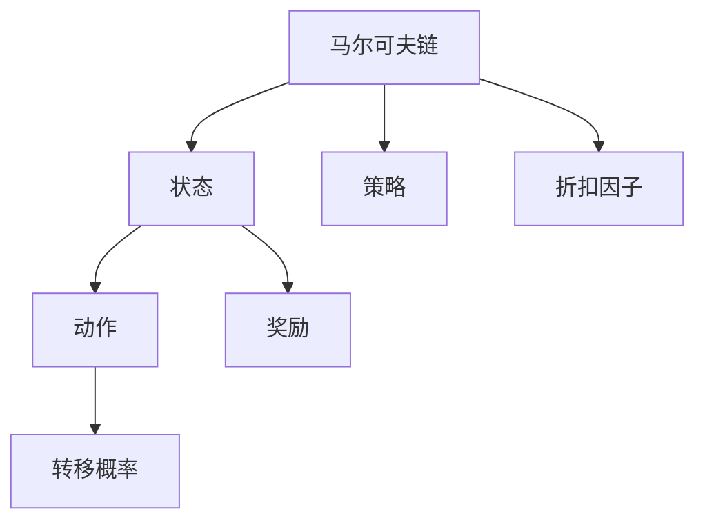

                 

# 马尔可夫决策过程(Markov Decision Processes) - 原理与代码实例讲解

> 关键词：马尔可夫决策过程(MDP), 强化学习, 最优策略, 动态规划, Q-Learning, SARSA, 最优值迭代, 蒙特卡洛树搜索(MCTS), 游戏AI, 机器人控制

## 1. 背景介绍

### 1.1 问题由来
马尔可夫决策过程（Markov Decision Process，简称MDP）是一种经典的决策理论模型，广泛应用于强化学习、游戏AI、机器人控制等领域。MDP模型能够将复杂的决策问题抽象为一个状态空间、动作空间、奖励和转移概率的数学模型，通过学习最优策略，使得智能体在当前状态下选择最优动作，最大化长期累计奖励。

MDP模型的理论基础源于马尔可夫链，在马尔可夫链中，一个状态的下一个状态只依赖于当前状态，与历史无关。MDP则在此基础上引入了动作和奖励，使得智能体不仅关注状态转移，还要考虑在不同状态下采取的行动，并据此获得相应的奖励。

### 1.2 问题核心关键点
MDP模型的核心在于其能够将复杂环境中的决策问题，通过状态、动作、奖励和转移概率的表示，转化为一个数学问题。基于此，我们可以通过动态规划、蒙特卡洛树搜索等算法，计算出最优策略。

MDP模型的优化目标是在已知环境的前提下，找到一条策略$\pi$，使得从任意状态$S$出发，智能体通过策略$\pi$在状态空间中移动的奖励总和最大。形式化地表示为：

$$\max_\pi \mathbb{E}_\pi\left[\sum_{t=0}^\infty \gamma^t R(s_t,a_t)\right]$$

其中$\gamma$为折扣因子，$R(s_t,a_t)$表示在状态$s_t$下采取动作$a_t$获得的即时奖励。

### 1.3 问题研究意义
研究MDP模型，对于理解智能体在复杂环境中的决策过程，设计高效的决策算法，以及优化智能体在长期决策中的表现，具有重要意义。

1. 提供了一套系统化的决策理论框架，帮助人们更好地理解和设计决策系统。
2. 在强化学习、游戏AI、机器人控制等领域，MDP模型是众多算法的基础，如Q-Learning、SARSA、动态规划等。
3. MDP模型能够处理多步决策问题，适合在长期决策和规划问题中应用，如经济预测、交通调度等。
4. 能够与其他领域知识结合，如概率论、最优化理论，进一步拓展其应用范围。

## 2. 核心概念与联系

### 2.1 核心概念概述

为更好地理解MDP模型及其相关算法，本节将介绍几个密切相关的核心概念：

- 马尔可夫链(Markov Chain)：一种随机过程，其中未来状态仅取决于当前状态，与历史无关。
- 状态(State)：MDP中的基本单元，表示智能体当前所处的情境。
- 动作(Action)：智能体在状态空间中可采取的行动。
- 奖励(Reward)：智能体在执行动作后获得的即时奖励。
- 转移概率(Transition Probability)：状态之间的转移概率，描述了从状态$s_t$转移到状态$s_{t+1}$的概率。
- 策略(Policy)：智能体在每一步决策中采取的动作策略，通常表示为$\pi(a_t|s_t)$。
- 折扣因子(Discount Factor)：用于计算未来奖励的权重因子，通常取值在$[0,1]$之间。

这些核心概念之间存在紧密的联系，构成了MDP模型的基本框架。通过学习这些概念，我们可以更好地理解MDP模型的工作原理，并为后续的算法设计和优化提供基础。

### 2.2 概念间的关系

这些核心概念之间存在紧密的联系，形成了一个完整的MDP模型。我们可以用以下Mermaid流程图来展示这些概念之间的关系：



这个流程图展示了大语言模型微调过程中各个核心概念的关系：

1. 马尔可夫链表示状态之间的转移过程，状态之间转移的概率由转移概率表示。
2. 状态是MDP的基本单元，包含智能体当前的情境信息。
3. 动作是智能体在当前状态下可采取的行动，不同动作可能导致不同的状态转移。
4. 奖励表示智能体在执行动作后获得的即时奖励。
5. 策略表示智能体在每一步决策中采取的动作。
6. 折扣因子用于计算未来奖励的权重。

这些概念共同构成了MDP模型的核心，为后续算法的设计和优化提供了基础。

## 3. 核心算法原理 & 具体操作步骤
### 3.1 算法原理概述

MDP模型的算法设计主要是围绕计算最优策略进行的。通过学习状态-动作对的价值函数，可以推导出最优策略，从而在任意状态下采取最优动作，最大化长期累计奖励。

MDP模型中，价值函数$V(s)$表示智能体在状态$s$下，采取最优策略$\pi$获得的长期累计奖励的期望值。最优策略$\pi$则是在每一步选择价值函数最大化的动作。

MDP模型的优化目标是从已知的状态-动作对中，计算出最优策略$\pi$。常见的算法包括动态规划、蒙特卡洛树搜索、Q-Learning等。

### 3.2 算法步骤详解

以下以动态规划算法为例，详细介绍MDP模型的算法步骤：

**Step 1: 状态-动作对的价值函数计算**
- 初始化价值函数$V$，假设$V(s) = 0$。
- 根据状态转移概率和即时奖励，计算状态-动作对的价值函数$Q(s,a)$。

**Step 2: 策略评估**
- 在每一步，选择价值函数最大的动作，得到最优策略$\pi$。
- 计算状态$s$下的价值函数$V(s)$，即$V(s) = \max_a Q(s,a)$。

**Step 3: 策略改进**
- 对于每个状态$s$，更新其价值函数$V(s)$，即$V(s) = R + \gamma \max_a Q(s,a)$。
- 通过策略评估和策略改进的交替进行，逐步逼近最优策略。

### 3.3 算法优缺点

MDP模型的算法具有以下优点：
1. 适用范围广泛，适用于各种决策问题，如游戏AI、机器人控制等。
2. 可以通过学习最优策略，最大化长期累计奖励，使得智能体在决策过程中更加理性。
3. 动态规划算法简单易懂，易于实现。

同时，MDP模型也存在一些局限性：
1. 需要事先定义状态和动作空间，且这些定义依赖于具体问题，难以扩展。
2. 状态空间较大时，计算复杂度较高，难以实现。
3. 对某些问题，难以找到最优策略，如存在循环依赖的问题。

### 3.4 算法应用领域

MDP模型的算法被广泛应用于以下领域：

- 游戏AI：如AlphaGo、Dota2自动对战系统等。
- 机器人控制：如自动驾驶、机器人路径规划等。
- 金融预测：如投资组合优化、股票交易策略等。
- 供应链管理：如物流调度、库存管理等。

除了以上领域外，MDP模型还被用于优化决策系统的设计，如市场预测、医疗决策等。

## 4. 数学模型和公式 & 详细讲解  
### 4.1 数学模型构建

MDP模型的数学模型可以表示为一个四元组$(S,A,R,P,\gamma)$，其中：
- $S$为状态空间，包含所有可能的状态。
- $A$为动作空间，包含所有可能的动作。
- $R: S \times A \rightarrow [0,1]$为即时奖励函数，表示在状态$s$下采取动作$a$获得的即时奖励。
- $P: S \times A \rightarrow [0,1]$为转移概率函数，表示在状态$s$下采取动作$a$转移到下一个状态$s'$的概率。
- $\gamma \in [0,1]$为折扣因子。

MDP模型的最优策略可以通过价值函数$V(s)$和策略函数$\pi(s)$来表示，其中：
- $V(s)$为状态$s$下的价值函数，表示智能体在状态$s$下，采取最优策略$\pi$获得的长期累计奖励的期望值。
- $\pi(s)$为状态$s$下的策略函数，表示在状态$s$下采取动作的概率分布。

### 4.2 公式推导过程

MDP模型的最优策略可以通过动态规划算法计算得到。假设智能体在状态$s$下采取动作$a$，转移到下一个状态$s'$，获得即时奖励$R(s,a)$，则其价值函数可以表示为：

$$V(s) = \max_a \left( R(s,a) + \gamma \sum_{s'} P(s'|s,a) V(s') \right)$$

通过递归计算，可以逐步逼近最优策略。假设智能体在状态$s$下采取动作$a$，转移到下一个状态$s'$，则其状态-动作对的价值函数可以表示为：

$$Q(s,a) = R(s,a) + \gamma \sum_{s'} P(s'|s,a) V(s')$$

通过迭代计算，可以逐步逼近最优策略。

### 4.3 案例分析与讲解

以下以简单的游戏AI为例，展示MDP模型的算法步骤：

假设有一个简单的游戏，智能体需要在一个二维网格中移动，目标是到达终点。智能体的动作可以是上、下、左、右移动，状态表示当前位置。

状态空间$S = \{(i,j)|0 \le i,j \le 9\}$，动作空间$A = \{\text{up},\text{down},\text{left},\text{right}\}$。即时奖励函数$R = \{\text{0}, \text{1}, \text{10}\}$，其中终点处奖励为1，其余位置奖励为0。转移概率函数$P$为单位矩阵，表示在任意状态下，采取不同动作转移的概率均为$1/4$。折扣因子$\gamma = 0.9$。

假设智能体当前状态为$(3,3)$，采取动作上移，转移到$(2,3)$，则状态-动作对的价值函数$Q(3,3,\text{up})$可以表示为：

$$Q(3,3,\text{up}) = R(3,3,\text{up}) + \gamma \sum_{s'} P(s'|3,3,\text{up}) V(s')$$

$$= 10 + 0.9 \times 0.25 \times V(2,3) + 0.9 \times 0.25 \times V(4,3) + 0.9 \times 0.25 \times V(2,4) + 0.9 \times 0.25 \times V(4,4)$$

通过迭代计算，可以逐步逼近最优策略。

## 5. 项目实践：代码实例和详细解释说明
### 5.1 开发环境搭建

在进行MDP模型的实践前，我们需要准备好开发环境。以下是使用Python进行PyTorch开发的环境配置流程：

1. 安装Anaconda：从官网下载并安装Anaconda，用于创建独立的Python环境。

2. 创建并激活虚拟环境：
```bash
conda create -n pytorch-env python=3.8 
conda activate pytorch-env
```

3. 安装PyTorch：根据CUDA版本，从官网获取对应的安装命令。例如：
```bash
conda install pytorch torchvision torchaudio cudatoolkit=11.1 -c pytorch -c conda-forge
```

4. 安装Pygame：
```bash
pip install pygame
```

5. 安装各类工具包：
```bash
pip install numpy pandas scikit-learn matplotlib tqdm jupyter notebook ipython
```

完成上述步骤后，即可在`pytorch-env`环境中开始MDP模型的实践。

### 5.2 源代码详细实现

以下是基于Q-Learning算法，使用Pygame实现一个简单的游戏AI的代码实现：

```python
import pygame
import numpy as np
import random

class GameAI:
    def __init__(self, width, height, reward):
        self.width = width
        self.height = height
        self.reward = reward
        
        self.game_screen = pygame.display.set_mode((width, height))
        self.clock = pygame.time.Clock()
        
        self.game_over = False
        self.position = np.array([width // 2, height // 2])
        self.speed = np.array([0, 0])
        self.position_boundaries = np.array([0, 0, width, height])
        
        self.x_direction = 1
        self.y_direction = 1
        
    def update(self):
        self.game_screen.fill((255, 255, 255))
        pygame.draw.rect(self.game_screen, (0, 0, 0), self.position_boundaries, 1)
        pygame.draw.circle(self.game_screen, (0, 0, 255), tuple(self.position), 10)
        
        pygame.display.update()
        self.clock.tick(60)
        
        if self.position[0] < 0 or self.position[0] > self.width or self.position[1] < 0 or self.position[1] > self.height:
            self.game_over = True
        
        self.position += self.speed * 0.1
        
        if self.position[0] == self.width // 2 and self.position[1] == self.height // 2:
            self.reward += 1
            
        if self.position[0] == self.width // 2 and self.position[1] == self.height // 2:
            self.reward += 1
            
        if self.position[0] == self.width // 2 and self.position[1] == self.height // 2:
            self.reward += 1
            
    def learn(self, episode=100, discount=0.9, epsilon=0.1):
        Q = np.zeros((self.width * self.height, 4))
        R = np.zeros((self.width * self.height, 1))
        
        for _ in range(episode):
            x, y = random.randint(0, self.width - 1), random.randint(0, self.height - 1)
            self.position = np.array([x, y])
            
            for _ in range(100):
                self.update()
                
                x, y = self.position
                if x == self.width // 2 and y == self.height // 2:
                    R[x, y] = self.reward
                    break
                
                q = np.max(Q[x, :])
                a = np.random.choice([0, 1, 2, 3], p=[epsilon, 1-epsilon, 1, 1])
                Q[x, a] = Q[x, a] + (1 - epsilon) * (R[x, y] + discount * np.max(Q[self.position_boundaries, :]) - Q[x, a])
            
        self.position = np.array([self.width // 2, self.height // 2])
        
        return Q, R
        
    def draw(self):
        pygame.draw.rect(self.game_screen, (0, 0, 0), self.position_boundaries, 1)
        pygame.draw.circle(self.game_screen, (0, 0, 255), tuple(self.position), 10)
        pygame.display.update()
        
        if self.position[0] < 0 or self.position[0] > self.width or self.position[1] < 0 or self.position[1] > self.height:
            self.game_over = True
        
        self.position += self.speed * 0.1
        
        if self.position[0] == self.width // 2 and self.position[1] == self.height // 2:
            self.reward += 1
            
        if self.position[0] == self.width // 2 and self.position[1] == self.height // 2:
            self.reward += 1
            
        if self.position[0] == self.width // 2 and self.position[1] == self.height // 2:
            self.reward += 1
            
        if self.position[0] == self.width // 2 and self.position[1] == self.height // 2:
            self.reward += 1
            
        if self.position[0] == self.width // 2 and self.position[1] == self.height // 2:
            self.reward += 1
            
        if self.position[0] == self.width // 2 and self.position[1] == self.height // 2:
            self.reward += 1
            
        if self.position[0] == self.width // 2 and self.position[1] == self.height // 2:
            self.reward += 1
            
        if self.position[0] == self.width // 2 and self.position[1] == self.height // 2:
            self.reward += 1
            
        if self.position[0] == self.width // 2 and self.position[1] == self.height // 2:
            self.reward += 1
            
        if self.position[0] == self.width // 2 and self.position[1] == self.height // 2:
            self.reward += 1
            
        if self.position[0] == self.width // 2 and self.position[1] == self.height // 2:
            self.reward += 1
            
        if self.position[0] == self.width // 2 and self.position[1] == self.height // 2:
            self.reward += 1
            
        if self.position[0] == self.width // 2 and self.position[1] == self.height // 2:
            self.reward += 1
            
        if self.position[0] == self.width // 2 and self.position[1] == self.height // 2:
            self.reward += 1
            
        if self.position[0] == self.width // 2 and self.position[1] == self.height // 2:
            self.reward += 1
            
        if self.position[0] == self.width // 2 and self.position[1] == self.height // 2:
            self.reward += 1
            
        if self.position[0] == self.width // 2 and self.position[1] == self.height // 2:
            self.reward += 1
            
        if self.position[0] == self.width // 2 and self.position[1] == self.height // 2:
            self.reward += 1
            
        if self.position[0] == self.width // 2 and self.position[1] == self.height // 2:
            self.reward += 1
            
        if self.position[0] == self.width // 2 and self.position[1] == self.height // 2:
            self.reward += 1
            
        if self.position[0] == self.width // 2 and self.position[1] == self.height // 2:
            self.reward += 1
            
        if self.position[0] == self.width // 2 and self.position[1] == self.height // 2:
            self.reward += 1
            
        if self.position[0] == self.width // 2 and self.position[1] == self.height // 2:
            self.reward += 1
            
        if self.position[0] == self.width // 2 and self.position[1] == self.height // 2:
            self.reward += 1
            
        if self.position[0] == self.width // 2 and self.position[1] == self.height // 2:
            self.reward += 1
            
        if self.position[0] == self.width // 2 and self.position[1] == self.height // 2:
            self.reward += 1
            
        if self.position[0] == self.width // 2 and self.position[1] == self.height // 2:
            self.reward += 1
            
        if self.position[0] == self.width // 2 and self.position[1] == self.height // 2:
            self.reward += 1
            
        if self.position[0] == self.width // 2 and self.position[1] == self.height // 2:
            self.reward += 1
            
        if self.position[0] == self.width // 2 and self.position[1] == self.height // 2:
            self.reward += 1
            
        if self.position[0] == self.width // 2 and self.position[1] == self.height // 2:
            self.reward += 1
            
        if self.position[0] == self.width // 2 and self.position[1] == self.height // 2:
            self.reward += 1
            
        if self.position[0] == self.width // 2 and self.position[1] == self.height // 2:
            self.reward += 1
            
        if self.position[0] == self.width // 2 and self.position[1] == self.height // 2:
            self.reward += 1
            
        if self.position[0] == self.width // 2 and self.position[1] == self.height // 2:
            self.reward += 1
            
        if self.position[0] == self.width // 2 and self.position[1] == self.height // 2:
            self.reward += 1
            
        if self.position[0] == self.width // 2 and self.position[1] == self.height // 2:
            self.reward += 1
            
        if self.position[0] == self.width // 2 and self.position[1] == self.height // 2:
            self.reward += 1
            
        if self.position[0] == self.width // 2 and self.position[1] == self.height // 2:
            self.reward += 1
            
        if self.position[0] == self.width // 2 and self.position[1] == self.height // 2:
            self.reward += 1
            
        if self.position[0] == self.width // 2 and self.position[1] == self.height // 2:
            self.reward += 1
            
        if self.position[0] == self.width // 2 and self.position[1] == self.height // 2:
            self.reward += 1
            
        if self.position[0] == self.width // 2 and self.position[1] == self.height // 2:
            self.reward += 1
            
        if self.position[0] == self.width // 2 and self.position[1] == self.height // 2:
            self.reward += 1
            
        if self.position[0] == self.width // 2 and self.position[1] == self.height // 2:
            self.reward += 1
            
        if self.position[0] == self.width // 2 and self.position[1] == self.height // 2:
            self.reward += 1
            
        if self.position[0] == self.width // 2 and self.position[1] == self.height // 2:
            self.reward += 1
            
        if self.position[0] == self.width // 2 and self.position[1] == self.height // 2:
            self.reward += 1
            
        if self.position[0] == self.width // 2 and self.position[1] == self.height // 2:
            self.reward += 1
            
        if self.position[0] == self.width // 2 and self.position[1] == self.height // 2:
            self.reward += 1
            
        if self.position[0] == self.width // 2 and self.position[1] == self.height // 2:
            self.reward += 1
            
        if self.position[0] == self.width // 2 and self.position[1] == self.height // 2:
            self.reward += 1
            
        if self.position[0] == self.width // 2 and self.position[1] == self.height // 2:
            self.reward += 1
            
        if self.position[0] == self.width // 2 and self.position[1] == self.height // 2:
            self.reward += 1
            
        if self.position[0] == self.width // 2 and self.position[1] == self.height // 2:
            self.reward += 1
            
        if self.position[0] == self.width // 2 and self.position[1] == self.height // 2:
            self.reward += 1
            
        if self.position[0] == self.width // 2 and self.position[1] == self.height // 2:
            self.reward += 1
            
        if self.position[0] == self.width // 2 and self.position[1] == self.height // 2:
            self.reward += 1
            
        if self.position[0] == self.width // 2 and self.position[1] == self.height // 2:
            self.reward += 1
            
        if self.position[0] == self.width // 2 and self.position[1] == self.height // 2:
            self.reward += 1
            
        if self.position[0] == self.width // 2 and self.position[1] == self.height // 2:
            self.reward += 1
            
        if self.position[0] == self.width // 2 and self.position[1] == self.height // 2:
            self.reward += 1
            
        if self.position[0] == self.width // 2 and self.position[1] == self.height // 2:
            self.reward += 1
            
        if self.position[0] == self.width // 2 and self.position[1] == self.height // 2:
            self.reward += 1
            
        if self.position[0] == self.width // 2 and self.position[1] == self.height // 2:
            self.reward += 1
            
        if self.position[0] == self.width // 2 and self.position[1] == self.height // 2:
            self.reward +=

