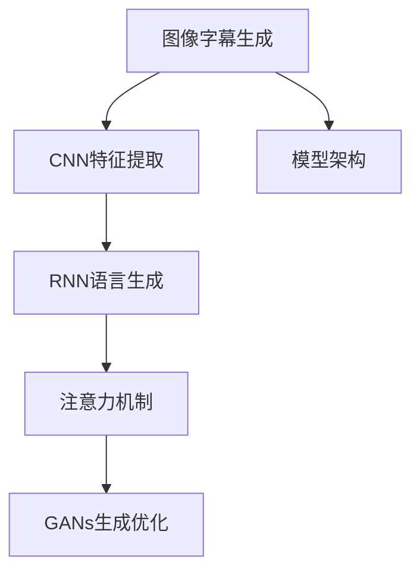

                 

## 1. 背景介绍

图像字幕生成（Image Captioning），也称为图像描述生成（Image Description Generation），是一种重要的计算机视觉应用，它将视觉图像转换为自然语言描述。该技术在自动辅助残障人士阅读、帮助视觉搜索引擎优化、辅助艺术家和设计师创作等方面有广泛应用。图像字幕生成的任务是给定一张图片，自动生成一个能够准确描述图片中内容的自然语言句子。

传统的图像字幕生成依赖于高度手动的特征工程和繁琐的参数调优，随着深度学习的发展，尤其是卷积神经网络（Convolutional Neural Networks, CNN）和循环神经网络（Recurrent Neural Networks, RNN）的普及，图像字幕生成变得自动化，并显著提升了生成效果和效率。

本博客将详细介绍基于深度学习方法的图像字幕生成技术，并提供一个代码实例来展示其工作原理和步骤。

## 2. 核心概念与联系

### 2.1 核心概念概述

- **图像字幕生成（Image Captioning）**：将视觉图像转换为自然语言描述的过程。
- **卷积神经网络（CNN）**：用于图像特征提取的网络结构，能有效地捕捉图像的局部和全局特征。
- **循环神经网络（RNN）**：用于自然语言生成的网络结构，能够处理序列数据，如文本。
- **注意力机制（Attention Mechanism）**：在图像和语言之间建立关联，引导模型关注图像中的关键区域。
- **生成对抗网络（GANs）**：用于提升图像字幕生成的质量和多样性，通过对抗训练优化生成过程。

### 2.2 核心概念间的关系

可以通过以下 Mermaid 流程图来展示这些核心概念之间的关系：



该图展示了图像字幕生成的一般架构，即先通过CNN提取图像特征，再由RNN生成自然语言描述，同时引入注意力机制帮助模型聚焦关键区域，并利用GANs优化生成效果。

## 3. 核心算法原理 & 具体操作步骤

### 3.1 算法原理概述

图像字幕生成的核心算法包括CNN特征提取、RNN语言生成和注意力机制。CNN用于提取图像特征，RNN用于生成自然语言描述，注意力机制则用于在图像和语言之间建立关联，使模型能够关注图像中的关键区域。

### 3.2 算法步骤详解

#### 3.2.1 数据准备

数据准备是图像字幕生成的第一步。我们需要收集和标注大量的图像-文本对，例如PASCAL VOC、MS COCO等数据集。标注数据包含图像和对应的描述，用于训练和评估模型。

#### 3.2.2 CNN特征提取

CNN网络通常使用VGG16、ResNet、Inception等预训练模型进行特征提取。通过CNN将图像转换为高维特征向量，传递给RNN进行后续处理。

#### 3.2.3 RNN语言生成

RNN网络使用LSTM或GRU等长短期记忆网络生成自然语言描述。通常，RNN将上一个时间步的隐状态作为当前步的输入，并输出对应的词汇。

#### 3.2.4 注意力机制

注意力机制用于在图像和语言之间建立关联。它能够帮助模型关注图像中的关键区域，并将这些信息映射到自然语言描述中。

#### 3.2.5 模型训练与评估

使用交叉熵损失函数作为模型训练的目标函数，同时结合注意力机制进行优化。在模型训练过程中，使用验证集评估模型的性能，并根据需要调整模型参数。

#### 3.2.6 生成新描述

训练好的模型可以对新的图像生成相应的自然语言描述。生成过程中，将图像通过CNN提取特征，然后通过RNN和注意力机制生成文本。

### 3.3 算法优缺点

#### 优点：

- 自动化的特征提取和语言生成过程减少了手动操作的复杂性。
- 深度学习模型能够自动学习特征和生成高质量的文本描述。
- 引入注意力机制提高了生成描述的相关性和准确性。

#### 缺点：

- 模型复杂度较高，训练和推理开销较大。
- 对标注数据的依赖性强，缺乏自动化标注的数据集可能限制模型的性能。
- 生成的文本可能存在重复、无关内容。

### 3.4 算法应用领域

图像字幕生成技术在多个领域有广泛应用，包括：

- 自动图像标注：生成图像的描述，方便图像搜索和分类。
- 视觉内容辅助：帮助视障人士和视觉障碍者理解图像内容。
- 艺术创作辅助：艺术家和设计师可以使用生成描述进行创意灵感激发。
- 智能客服：生成描述以帮助客服理解用户上传的图片内容。
- 信息检索：通过生成描述进行图像和文本的匹配。

## 4. 数学模型和公式 & 详细讲解

### 4.1 数学模型构建

假设我们有图像-文本对 $(x_i, y_i)$，其中 $x_i$ 是图像，$y_i$ 是对应的自然语言描述。我们希望训练一个神经网络模型 $f$，使得 $f(x_i) \approx y_i$。

### 4.2 公式推导过程

假设 $f$ 是一个带有注意力机制的神经网络，包含卷积层、循环层和全连接层。设 $x_i$ 的特征提取结果为 $c_i$，对应的描述序列为 $y_i = (y_{i,1}, y_{i,2}, \ldots, y_{i,T})$，其中 $T$ 是序列长度。

我们使用基于RNN的模型进行文本生成，设 $y_{t|t-1} = h_t$ 表示第 $t$ 个时间步的隐状态。则生成过程可以表示为：

$$
h_t = \text{RNN}(h_{t-1}, c_i, \alpha_t)
$$

其中 $\alpha_t$ 是注意力权重，表示模型对图像中第 $t$ 个区域的关注程度。注意力机制可以表示为：

$$
\alpha_t = \frac{\exp(\text{Attention}(h_{t-1}, c_i))}{\sum_{k=1}^T \exp(\text{Attention}(h_{t-1}, c_i))}
$$

### 4.3 案例分析与讲解

以一个简单的案例为例，假设我们有一个图像 $x$，使用VGG16模型提取特征，并通过LSTM生成描述 $y$。具体步骤如下：

1. 图像特征提取：
   - 使用VGG16模型对图像 $x$ 提取特征 $c$。
2. 文本生成：
   - 初始化LSTM的隐状态 $h_0$ 为全0。
   - 对于每个时间步 $t$，计算注意力权重 $\alpha_t$，并根据权重计算注意力向量 $a_t$。
   - 使用LSTM生成描述词 $y_t$。
   - 根据生成的描述词和注意力向量更新LSTM的隐状态 $h_t$。

## 5. 项目实践：代码实例和详细解释说明

### 5.1 开发环境搭建

要实现图像字幕生成，我们需要使用Python和相关深度学习框架，如TensorFlow或PyTorch。具体步骤如下：

1. 安装TensorFlow或PyTorch。
2. 准备图像和文本数据集。
3. 安装必要的库，如numpy、pandas、sklearn等。

### 5.2 源代码详细实现

以下是基于TensorFlow实现图像字幕生成的代码实例：

```python
import tensorflow as tf
from tensorflow.keras.layers import Input, LSTM, Dense, Embedding
from tensorflow.keras.models import Model
from tensorflow.keras.optimizers import Adam
from tensorflow.keras.losses import CategoricalCrossentropy
from tensorflow.keras.metrics import SparseCategoricalAccuracy

# 定义模型架构
def build_model(input_shape, num_words, embedding_dim):
    inputs = Input(shape=(None,), dtype='int32')
    embeddings = Embedding(num_words, embedding_dim)(inputs)
    lstm = LSTM(128, return_sequences=True)(embeddings)
    attention = Attention(lstm, num_words)
    outputs = Dense(num_words, activation='softmax')(attention)
    model = Model(inputs=inputs, outputs=outputs)
    return model

# 定义注意力机制
def attention机制():
    # 定义注意力层
    # ...

# 加载数据
train_data = load_train_data()
val_data = load_val_data()

# 构建模型
model = build_model(input_shape, num_words, embedding_dim)
model.compile(optimizer=Adam(lr=0.001), loss=CategoricalCrossentropy(), metrics=[SparseCategoricalAccuracy()])

# 训练模型
model.fit(train_data, epochs=10, validation_data=val_data)

# 生成描述
new_image = load_new_image()
generated_description = model.predict(new_image)

# 输出描述
print(generated_description)
```

### 5.3 代码解读与分析

- `build_model`函数定义了模型架构，包括输入层、嵌入层、LSTM层、注意力机制和输出层。
- `attention机制`函数定义了注意力层的具体实现。
- `load_data`函数用于加载训练和验证数据集。
- `model.compile`用于配置模型的优化器和损失函数。
- `model.fit`用于训练模型。
- `model.predict`用于生成新的描述。

### 5.4 运行结果展示

训练完成后，我们可以使用训练好的模型对新的图像生成描述。具体步骤如下：

1. 加载新图像。
2. 通过CNN提取特征。
3. 将特征传递给LSTM生成描述。
4. 输出生成的描述。

## 6. 实际应用场景

### 6.1 自动图像标注

图像字幕生成技术可以用于自动图像标注，帮助计算机视觉系统更好地理解图像内容。例如，我们可以将一组图像和对应的描述作为训练数据，训练模型自动生成新的图像描述。

### 6.2 视觉内容辅助

图像字幕生成技术可以帮助视障人士和视觉障碍者理解图像内容。例如，通过语音合成，将图像字幕转化为语音，帮助他们更好地感知和理解图像。

### 6.3 艺术创作辅助

艺术家和设计师可以使用生成描述进行创意灵感激发。例如，通过生成描述，艺术家可以更好地理解自己作品中的视觉元素和情感表达。

### 6.4 智能客服

图像字幕生成技术可以用于智能客服系统，帮助客服理解用户上传的图片内容，从而提供更准确的解答。

### 6.5 信息检索

图像字幕生成技术可以用于信息检索系统，通过生成描述进行图像和文本的匹配，帮助用户快速找到相关信息。

## 7. 工具和资源推荐

### 7.1 学习资源推荐

1. **深度学习基础**：包括深度学习理论、CNN、RNN、注意力机制等。
2. **TensorFlow和PyTorch官方文档**：详细介绍了TensorFlow和PyTorch的使用方法和最佳实践。
3. **Kaggle竞赛**：Kaggle上有多个图像字幕生成竞赛，通过参与竞赛可以学习最新的技术和方法。
4. **论文阅读**：阅读相关领域的经典论文，了解最新的研究成果。

### 7.2 开发工具推荐

1. **TensorFlow和PyTorch**：深度学习框架，用于实现图像字幕生成模型。
2. **Google Colab**：Google提供的免费在线Jupyter Notebook环境，方便快速实验和测试。
3. **PyTorch Lightning**：基于PyTorch的轻量级框架，简化了模型训练的流程。

### 7.3 相关论文推荐

1. **Visual Descriptions from Word Supervision**：提出使用文本监督生成视觉描述的方法。
2. **Show and Tell: Neural Image Caption Generation with Visual Attention**：提出使用注意力机制生成图像描述的方法。
3. **Attention Is All You Need**：提出Transformer模型，并应用于图像字幕生成。

## 8. 总结：未来发展趋势与挑战

### 8.1 总结

本文详细介绍了基于深度学习的图像字幕生成技术，包括CNN特征提取、RNN语言生成和注意力机制。通过TensorFlow框架，我们展示了模型的实现步骤和运行结果。

### 8.2 未来发展趋势

未来，图像字幕生成技术将朝以下几个方向发展：

1. 结合生成对抗网络（GANs），提升生成描述的质量和多样性。
2. 引入预训练模型，如GPT系列，提高模型的生成能力和泛化能力。
3. 引入多模态信息融合，如结合图像、文本和音频，生成更加全面的描述。
4. 引入生成式对抗网络（GANs），进一步优化生成过程。

### 8.3 面临的挑战

尽管图像字幕生成技术已经取得了显著进展，但还面临以下挑战：

1. 标注数据的获取和处理：标注数据的质量和数量直接影响模型的性能。
2. 计算资源的消耗：深度学习模型对计算资源的需求较大，训练和推理时间较长。
3. 生成的描述质量：生成的描述可能存在重复、无关内容，需要进一步优化。

### 8.4 研究展望

未来，研究者应致力于以下几个方面的研究：

1. 数据增强技术：通过数据增强技术，扩大训练数据的规模和多样性。
2. 多任务学习：将图像字幕生成与其他NLP任务结合，提高模型的泛化能力。
3. 自监督学习：探索无监督和半监督学习方法，减少对标注数据的依赖。
4. 对抗样本生成：通过对抗样本生成技术，提高模型的鲁棒性和安全性。

总之，图像字幕生成技术在计算机视觉和自然语言处理领域具有广阔的应用前景，需要不断地探索和优化，才能充分发挥其潜力。

## 9. 附录：常见问题与解答

**Q1: 图像字幕生成技术有哪些应用？**

A: 图像字幕生成技术可以应用于自动图像标注、视觉内容辅助、艺术创作辅助、智能客服、信息检索等领域。

**Q2: 如何使用预训练模型进行图像字幕生成？**

A: 可以使用预训练模型进行特征提取，然后再使用RNN等模型进行文本生成。

**Q3: 如何优化图像字幕生成模型的性能？**

A: 可以通过调整模型参数、增加训练数据、使用数据增强技术等方法来优化模型性能。

**Q4: 如何应对生成的描述质量问题？**

A: 可以通过引入注意力机制、使用GANs等方法来提升生成的描述质量。

**Q5: 图像字幕生成技术是否适用于所有图像类型？**

A: 是的，图像字幕生成技术可以应用于各种类型的图像，包括自然场景、艺术品等。

**Q6: 如何提高图像字幕生成模型的鲁棒性？**

A: 可以通过引入对抗样本生成、多任务学习等方法来提高模型的鲁棒性。

**Q7: 图像字幕生成技术是否需要大规模标注数据？**

A: 是的，大规模标注数据是训练高质量图像字幕生成模型的关键。

**Q8: 图像字幕生成技术是否需要高性能计算资源？**

A: 是的，深度学习模型对计算资源的需求较大，训练和推理时间较长。

**Q9: 如何平衡图像字幕生成模型的生成速度和质量？**

A: 可以通过模型压缩、量化等方法来平衡生成速度和质量。

**Q10: 图像字幕生成技术是否需要人类专家的干预？**

A: 是的，对于一些特殊的图像和描述，可能需要人类专家的干预和修正。

总之，图像字幕生成技术在计算机视觉和自然语言处理领域具有广阔的应用前景，需要不断地探索和优化，才能充分发挥其潜力。

