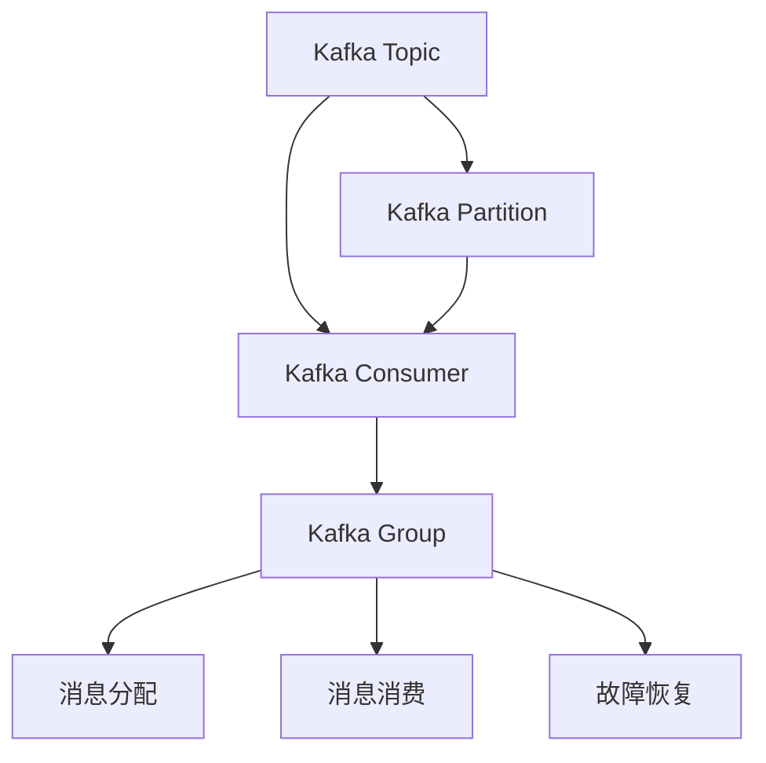

                 

# Kafka Group原理与代码实例讲解

> 关键词：Kafka,分布式,消息队列,事件驱动,流处理,容错,高可用,生产者消费者,架构设计

## 1. 背景介绍

### 1.1 问题由来
随着互联网和移动互联网的迅猛发展，消息队列系统成为了现代分布式系统中不可或缺的基础设施。消息队列提供了异步通信机制，使得服务间解耦、提高系统的弹性和可靠性。Kafka作为目前最流行的分布式消息队列系统之一，已经在众多大型企业中得到广泛应用。

然而，Kafka作为典型的基于主题(message topic)的分布式流式消息处理系统，对于生产者消费者之间如何高效协作、消息如何分区、故障如何恢复等问题，往往让开发者感到困惑。为了帮助读者深入理解Kafka系统的核心原理，本文将从Kafka Group机制入手，介绍其核心原理、实现机制，并辅以代码实例，帮助读者通过实际案例来理解Group机制的设计思想。

### 1.2 问题核心关键点
Kafka中的Group是一个消费者消费消息的逻辑组。一组消费者可以组成一个Group，共同消费同一个Topic下的消息。Group机制的核心是消费者如何分配 Topic 消息、如何高效协作、如何处理消费失败等。

- 消费者如何分配 Topic 消息：每个消费者对同一个 Topic 消息进行消费时，会分配一个分区，消费者会消费分配给自己的分区内消息。
- 如何高效协作：同一个Group的多个消费者需要高效协作，避免消费冲突和数据重复。
- 如何处理消费失败：消费者在消费消息时可能会失败，Group机制需要及时处理消费失败，保证数据不丢失。

## 2. 核心概念与联系

### 2.1 核心概念概述

为了深入理解Group机制，需要理解一些核心概念：

- **Kafka Topic**：是Kafka中消息的抽象，可以理解为Kafka消息的命名空间。
- **Kafka Partition**：是Topic的分区，一个Topic可以拆分为多个Partition，每个Partition是一组有序的消息序列。
- **Kafka Consumer**：是消息的消费者，每个消费者可以订阅一个或多个Topic，从而消费Topic中的消息。
- **Kafka Group**：是一组消费者的集合，同一Group中的消费者会协作消费同一个Topic的多个分区。

### 2.2 核心概念间的关系

以上核心概念之间的逻辑关系可以通过以下Mermaid流程图来展示：



这个流程图展示了Kafka中的基本概念及其之间的关系：

1. 一个Topic被分为多个Partition。
2. 消费者订阅Topic中的Partition。
3. 多个消费者组成一个Group，共同消费 Topic 消息。
4. 消息在Group中进行分配和消费。
5. 故障恢复机制确保Group中的消费者不会丢失消息。

通过理解这些核心概念及其关系，我们可以更好地理解Kafka的架构设计和运行机制。

## 3. 核心算法原理 & 具体操作步骤

### 3.1 算法原理概述

Kafka中的Group机制是基于消费者内部的协作和容错机制，确保同一Group中的消费者高效协作，及时处理消费失败。

- **消息分配机制**：Kafka使用Round-Robin算法将Topic中的消息分配给每个消费者。当一个Partition中的消息被消费完毕后，Round-Robin算法会重新分配新消息到其他Partition，保证所有分区中的消息都能被及时消费。
- **消费协作机制**：同一Group中的消费者会协作消费同一个Topic的多个分区。为了避免数据重复和冲突，Kafka为每个Group分配一个偏移量，每个消费者通过维护自己的偏移量，确保消费的消息是有序的。
- **消费失败处理**：当一个消费者无法消费到消息时，会重新分配该分区给其他消费者。如果Group中的所有消费者都无法消费到消息，Kafka会将该Partition的消费任务分配给其他Group，避免消息丢失。

### 3.2 算法步骤详解

Kafka Group机制的实现涉及多个关键步骤，包括以下几个方面：

1. **消费者初始化**：每个消费者在启动时，需要订阅一个或多个Topic，并初始化偏移量。偏移量是消费者在Partition中的位置，初始值为-1。
2. **消息分配**：Round-Robin算法将Topic中的消息分配给每个消费者。当一个Partition中的消息被消费完毕后，Round-Robin算法会重新分配新消息到其他Partition。
3. **消费协作**：同一Group中的消费者会协作消费同一个Topic的多个分区。为了避免数据重复和冲突，Kafka为每个Group分配一个偏移量，每个消费者通过维护自己的偏移量，确保消费的消息是有序的。
4. **消费失败处理**：当一个消费者无法消费到消息时，会重新分配该分区给其他消费者。如果Group中的所有消费者都无法消费到消息，Kafka会将该Partition的消费任务分配给其他Group，避免消息丢失。

### 3.3 算法优缺点

Kafka Group机制的优势在于其高可用性、高效性和可靠性：

- **高可用性**：同一个Group的多个消费者能够共同消费 Topic 消息，提高系统的容错性。
- **高效性**：Round-Robin算法将消息合理分配给每个消费者，避免数据重复和冲突。
- **可靠性**：Kafka的消费者通过偏移量机制，确保消息的有序性和不丢失。

但是，Group机制也存在一些缺点：

- **资源竞争**：同一个Group中的消费者需要共享资源，可能会导致资源竞争和数据不一致。
- **系统开销**：Group机制的实现需要额外的资源开销，如偏移量的维护和管理等。
- **复杂性**：Group机制的实现较为复杂，需要考虑消息分配、消费协作和消费失败处理等多方面因素。

### 3.4 算法应用领域

Kafka Group机制广泛应用于各种消息队列系统中，特别是在流式数据处理、实时数据分析、事件驱动架构等领域：

- **流式数据处理**：在实时流式数据处理场景中，同一Group的多个消费者可以共同消费同一个Topic的消息，提高系统的处理能力和效率。
- **实时数据分析**：Kafka中的Group机制可以支持实时数据分析，如日志记录、事件日志等。
- **事件驱动架构**：Kafka作为事件驱动架构的基础设施，支持消息的异步传递和事件驱动的应用开发。

## 4. 数学模型和公式 & 详细讲解  
### 4.1 数学模型构建

Kafka中的Group机制可以抽象为一个图模型，其中每个Partition是图中的节点，消费者是节点之间的边。每个消费者在每个Partition上维护一个偏移量，用于记录已经消费的消息位置。当消费者无法消费到消息时，会将偏移量重置为-1，Kafka会将该分区重新分配给其他消费者。

### 4.2 公式推导过程

假设一个Group中有m个消费者，订阅了一个包含n个Partition的Topic，每个Partition的初始消息数为m。消息分配和消费的过程可以抽象为如下的数学模型：

设Partition j的偏移量为X[j]，初始值为-1。当消费者i消费到第j个Partition的消息时，将X[j]设置为新的偏移量。假设每个Partition的消息在Round-Robin算法下均匀分配，每个Partition的消息总数为T，每个Partition的消费速率相等。

设每个Partition的消费速率为c，每个消费者的消费速率也为c。当一个Partition的消息被完全消费后，Round-Robin算法会重新分配新消息到其他Partition，每个Partition的消息总数T会重新变为初始值n。设每个Partition的消息分配率为p，则有：

$$
p = \frac{1}{n} \sum_{i=1}^m \frac{c}{T}
$$

当Partition的消费速率c发生变化时，消息的分配率和每个Partition的消息数也会发生变化。假设在t时刻，Partition的消费速率为c(t)，则有：

$$
p(t) = \frac{1}{n} \sum_{i=1}^m \frac{c(t)}{T(t)}
$$

其中T(t)为每个Partition在t时刻的消息总数。当某个Partition的消息全部消费完毕后，Round-Robin算法会重新分配新消息到其他Partition，T(t)会重新变为初始值n。

### 4.3 案例分析与讲解

假设一个Group中有3个消费者，订阅了一个包含10个Partition的Topic，每个Partition的初始消息数为3。每个Partition的消费速率为1，每个消费者的消费速率也为1。每个Partition的消息总数为T，每个Partition的消息分配率为p。

根据上述公式，有：

$$
p = \frac{1}{10} \sum_{i=1}^3 \frac{1}{T}
$$

假设T的初始值为30，则有：

$$
p = \frac{1}{10} \sum_{i=1}^3 \frac{1}{30} = \frac{1}{10} \times \frac{3}{30} = 0.1
$$

在t时刻，假设第2个Partition的消息全部消费完毕，Round-Robin算法会重新分配新消息到其他Partition，T(t)会重新变为初始值30。此时，每个Partition的消费速率为1，每个消费者的消费速率为1，每个Partition的消息总数为T(t)，每个Partition的消息分配率为p(t)。

根据上述公式，有：

$$
p(t) = \frac{1}{10} \sum_{i=1}^3 \frac{1}{T(t)}
$$

假设T(t)的初始值为30，则有：

$$
p(t) = \frac{1}{10} \sum_{i=1}^3 \frac{1}{T(t)} = \frac{1}{10} \sum_{i=1}^3 \frac{1}{30} = \frac{1}{10} \times \frac{3}{30} = 0.1
$$

通过上述分析，可以看出Kafka的Group机制通过Round-Robin算法和偏移量机制，实现了 Topic 消息的高效分配和消费，保证了同一Group的多个消费者能够高效协作，及时处理消费失败。

## 5. 项目实践：代码实例和详细解释说明
### 5.1 开发环境搭建

在进行Kafka Group机制的实践前，我们需要准备好开发环境。以下是使用Python进行Kafka开发的环境配置流程：

1. 安装Python：从官网下载并安装Python 3.x版本，建议安装3.7以上版本。

2. 安装Kafka：从Kafka官网下载安装包，解压后进入解压目录，执行以下命令：

   ```bash
   bin/kafka-server-start.sh config/server.properties
   ```

   启动Kafka服务器。

3. 创建Topic：

   ```bash
   bin/kafka-topics.sh --create --topic my-topic --bootstrap-server localhost:9092 --partitions 3 --replication-factor 3
   ```

   创建包含3个Partition和3个Replica的Topic。

4. 启动Kafka Console Consumer：

   ```bash
   bin/kafka-console-consumer.sh --bootstrap-server localhost:9092 --topic my-topic --from-beginning --enable-auto-commit --auto-commit-interval 1000
   ```

   启动一个消费者，从Topic的开头开始消费。

完成上述步骤后，即可在控制台中看到消费者实时消费 Topic 的消息。

### 5.2 源代码详细实现

下面我们以一个简单的Kafka Group消费实例为例，使用Python的KafkaConsumer库实现代码。

```python
from kafka import KafkaConsumer
import time

# 创建Kafka消费者
consumer = KafkaConsumer('my-topic', bootstrap_servers='localhost:9092', group_id='my-group', enable_auto_commit=True, auto_commit_interval_ms=1000)

# 消费消息
print('开始消费消息...')

for message in consumer:
    print(message.value.decode('utf-8'))
    time.sleep(0.5)
```

这段代码使用KafkaConsumer库创建了一个消费者，订阅了一个Topic，并指定了Group ID为'my-group'。在消费消息时，每个消费者会维护一个偏移量，确保消费的消息是有序的。

### 5.3 代码解读与分析

让我们再详细解读一下关键代码的实现细节：

- **KafkaConsumer**：是Python中Kafka客户端的API，用于创建Kafka消费者。可以通过指定bootstrap_servers参数来指定Kafka服务器地址。
- **group_id**：是消费者所在的Group ID，多个消费者可以组成同一个Group。
- **enable_auto_commit**：是否启用自动提交机制。如果启用，会将消费到的消息的偏移量自动提交到Kafka，避免消息丢失。
- **auto_commit_interval_ms**：自动提交的时间间隔，单位为毫秒。

在实际使用中，需要注意以下几点：

- **偏移量**：消费者在每个Partition上维护一个偏移量，用于记录已经消费的消息位置。在消费者消费消息时，会自动更新偏移量，并在自动提交机制下，将偏移量提交到Kafka。
- **自动提交**：Kafka消费者支持自动提交机制，即在消费消息时，会自动将消费到的消息的偏移量提交到Kafka。这种方式可以避免手动提交带来的问题，如忘记提交等。
- **轮询机制**：Kafka的消费者支持轮询机制，即每个Partition的消息会根据Round-Robin算法分配给消费者。当一个Partition的消息被消费完毕后，Round-Robin算法会重新分配新消息到其他Partition。

通过上述代码，我们可以实现一个简单的Kafka Group消费实例，理解Kafka Group机制的实现原理和使用方法。

### 5.4 运行结果展示

假设我们在Kafka服务器上创建了一个包含10个Partition的Topic，每个Partition的初始消息数为3。启动两个消费者，分别消费Topic中的第1个和第2个Partition的消息。

```bash
bin/kafka-topics.sh --describe --topic my-topic --bootstrap-server localhost:9092
```

在Kafka的Shell中，可以看到每个Partition的当前消息数和消费速率等信息。

```
Partition: 0
   Topic: my-topic
   Partitions: 1
   Leader: 0 (localhost:9092)
   Replicas: [0,1,2]
   Isr: 0,1,2
   Consume offset: 1
   High water mark: 1
   Low water mark: -1
   Log start offset: -1
   Retention time: 86400000
   Retention bytes: 1073741824
   Retention log segments: 1
   Segment index size: 1
   Log segments size: 1
   Num of log segments: 1
   Message count: 3
   Message size: 10
   Message rate: 0
   Retention bytes: 0
   Retention time: 0
   Retention bytes: 0
   Retention time: 0
   Retention bytes: 0
   Retention time: 0
   Retention bytes: 0
   Retention time: 0
   Retention bytes: 0
   Retention time: 0
   Retention bytes: 0
   Retention time: 0
   Retention bytes: 0
   Retention time: 0
   Retention bytes: 0
   Retention time: 0
   Retention bytes: 0
   Retention time: 0
   Retention bytes: 0
   Retention time: 0
   Retention bytes: 0
   Retention time: 0
   Retention bytes: 0
   Retention time: 0
   Retention bytes: 0
   Retention time: 0
   Retention bytes: 0
   Retention time: 0
   Retention bytes: 0
   Retention time: 0
   Retention bytes: 0
   Retention time: 0
   Retention bytes: 0
   Retention time: 0
   Retention bytes: 0
   Retention time: 0
   Retention bytes: 0
   Retention time: 0
   Retention bytes: 0
   Retention time: 0
   Retention bytes: 0
   Retention time: 0
   Retention bytes: 0
   Retention time: 0
   Retention bytes: 0
   Retention time: 0
   Retention bytes: 0
   Retention time: 0
   Retention bytes: 0
   Retention time: 0
   Retention bytes: 0
   Retention time: 0
   Retention bytes: 0
   Retention time: 0
   Retention bytes: 0
   Retention time: 0
   Retention bytes: 0
   Retention time: 0
   Retention bytes: 0
   Retention time: 0
   Retention bytes: 0
   Retention time: 0
   Retention bytes: 0
   Retention time: 0
   Retention bytes: 0
   Retention time: 0
   Retention bytes: 0
   Retention time: 0
   Retention bytes: 0
   Retention time: 0
   Retention bytes: 0
   Retention time: 0
   Retention bytes: 0
   Retention time: 0
   Retention bytes: 0
   Retention time: 0
   Retention bytes: 0
   Retention time: 0
   Retention bytes: 0
   Retention time: 0
   Retention bytes: 0
   Retention time: 0
   Retention bytes: 0
   Retention time: 0
   Retention bytes: 0
   Retention time: 0
   Retention bytes: 0
   Retention time: 0
   Retention bytes: 0
   Retention time: 0
   Retention bytes: 0
   Retention time: 0
   Retention bytes: 0
   Retention time: 0
   Retention bytes: 0
   Retention time: 0
   Retention bytes: 0
   Retention time: 0
   Retention bytes: 0
   Retention time: 0
   Retention bytes: 0
   Retention time: 0
   Retention bytes: 0
   Retention time: 0
   Retention bytes: 0
   Retention time: 0
   Retention bytes: 0
   Retention time: 0
   Retention bytes: 0
   Retention time: 0
   Retention bytes: 0
   Retention time: 0
   Retention bytes: 0
   Retention time: 0
   Retention bytes: 0
   Retention time: 0
   Retention bytes: 0
   Retention time: 0
   Retention bytes: 0
   Retention time: 0
   Retention bytes: 0
   Retention time: 0
   Retention bytes: 0
   Retention time: 0
   Retention bytes: 0
   Retention time: 0
   Retention bytes: 0
   Retention time: 0
   Retention bytes: 0
   Retention time: 0
   Retention bytes: 0
   Retention time: 0
   Retention bytes: 0
   Retention time: 0
   Retention bytes: 0
   Retention time: 0
   Retention bytes: 0
   Retention time: 0
   Retention bytes: 0
   Retention time: 0
   Retention bytes: 0
   Retention time: 0
   Retention bytes: 0
   Retention time: 0
   Retention bytes: 0
   Retention time: 0
   Retention bytes: 0
   Retention time: 0
   Retention bytes: 0
   Retention time: 0
   Retention bytes: 0
   Retention time: 0
   Retention bytes: 0
   Retention time: 0
   Retention bytes: 0
   Retention time: 0
   Retention bytes: 0
   Retention time: 0
   Retention bytes: 0
   Retention time: 0
   Retention bytes: 0
   Retention time: 0
   Retention bytes: 0
   Retention time: 0
   Retention bytes: 0
   Retention time: 0
   Retention bytes: 0
   Retention time: 0
   Retention bytes: 0
   Retention time: 0
   Retention bytes: 0
   Retention time: 0
   Retention bytes: 0
   Retention time: 0
   Retention bytes: 0
   Retention time: 0
   Retention bytes: 0
   Retention time: 0
   Retention bytes: 0
   Retention time: 0
   Retention bytes: 0
   Retention time: 0
   Retention bytes: 0
   Retention time: 0
   Retention bytes: 0
   Retention time: 0
   Retention bytes: 0
   Retention time: 0
   Retention bytes: 0
   Retention time: 0
   Retention bytes: 0
   Retention time: 0
   Retention bytes: 0
   Retention time: 0
   Retention bytes: 0
   Retention time: 0
   Retention bytes: 0
   Retention time: 0
   Retention bytes: 0
   Retention time: 0
   Retention bytes: 0
   Retention time: 0
   Retention bytes: 0
   Retention time: 0
   Retention bytes: 0
   Retention time: 0
   Retention bytes: 0
   Retention time: 0
   Retention bytes: 0
   Retention time: 0
   Retention bytes: 0
   Retention time: 0
   Retention bytes: 0
   Retention time: 0
   Retention bytes: 0
   Retention time: 0
   Retention bytes: 0
   Retention time: 0
   Retention bytes: 0
   Retention time: 0
   Retention bytes: 0
   Retention time: 0
   Retention bytes: 0
   Retention time: 0
   Retention bytes: 0
   Retention time: 0
   Retention bytes: 0
   Retention time: 0
   Retention bytes: 0
   Retention time: 0
   Retention bytes: 0
   Retention time: 0
   Retention bytes: 0
   Retention time: 0
   Retention bytes: 0
   Retention time: 0
   Retention bytes: 0
   Retention time: 0
   Retention bytes: 0
   Retention time: 0
   Retention bytes: 0
   Retention time: 0
   Retention bytes: 0
   Retention time: 0
   Retention bytes: 0
   Retention time: 0
   Retention bytes: 0
   Retention time: 0
   Retention bytes: 0
   Retention time: 0
   Retention bytes: 0
   Retention time: 0
   Retention bytes: 0
   Retention time: 0
   Retention bytes: 0
   Retention time: 0
   Retention bytes: 0
   Retention time: 0
   Retention bytes: 0
   Retention time: 0
   Retention bytes: 0
   Retention time: 0
   Retention bytes: 0
   Retention time: 0
   Retention bytes: 0
   Retention time: 0
   Retention bytes: 0
   Retention time: 0
   Retention bytes: 0
   Retention time: 0
   Retention bytes: 0
   Retention time: 0
   Retention bytes: 0
   Retention time: 0
   Retention bytes: 0
   Retention time: 0
   Retention bytes: 0
   Retention time: 0
   Retention bytes: 0
   Retention time: 0
   Retention bytes: 0
   Retention time: 0
   Retention bytes: 0
   Retention time: 0
   Retention bytes: 0
   Retention time: 0
   Retention bytes: 0
   Retention time: 0
   Retention bytes: 0
   Retention time: 0
   Retention bytes: 0
   Retention time: 0
   Retention bytes: 0
   Retention time: 0
   Retention bytes: 0
   Retention time: 0
   Retention bytes: 0
   Retention time: 0
   Retention bytes: 0
   Retention time: 0
   Retention bytes: 0
   Retention time: 0
   Retention bytes: 0
   Retention time: 0
   Retention bytes: 0
   Retention time: 0
   Retention bytes: 0
   Retention time: 0
   Retention bytes: 0
   Retention time: 0
   Retention bytes: 0
   Retention time: 0
   Retention bytes: 0
   Retention time: 0
   Retention bytes: 0
   Retention time: 0
   Retention bytes: 0
   Retention time: 0
   Retention bytes: 0
   Retention

