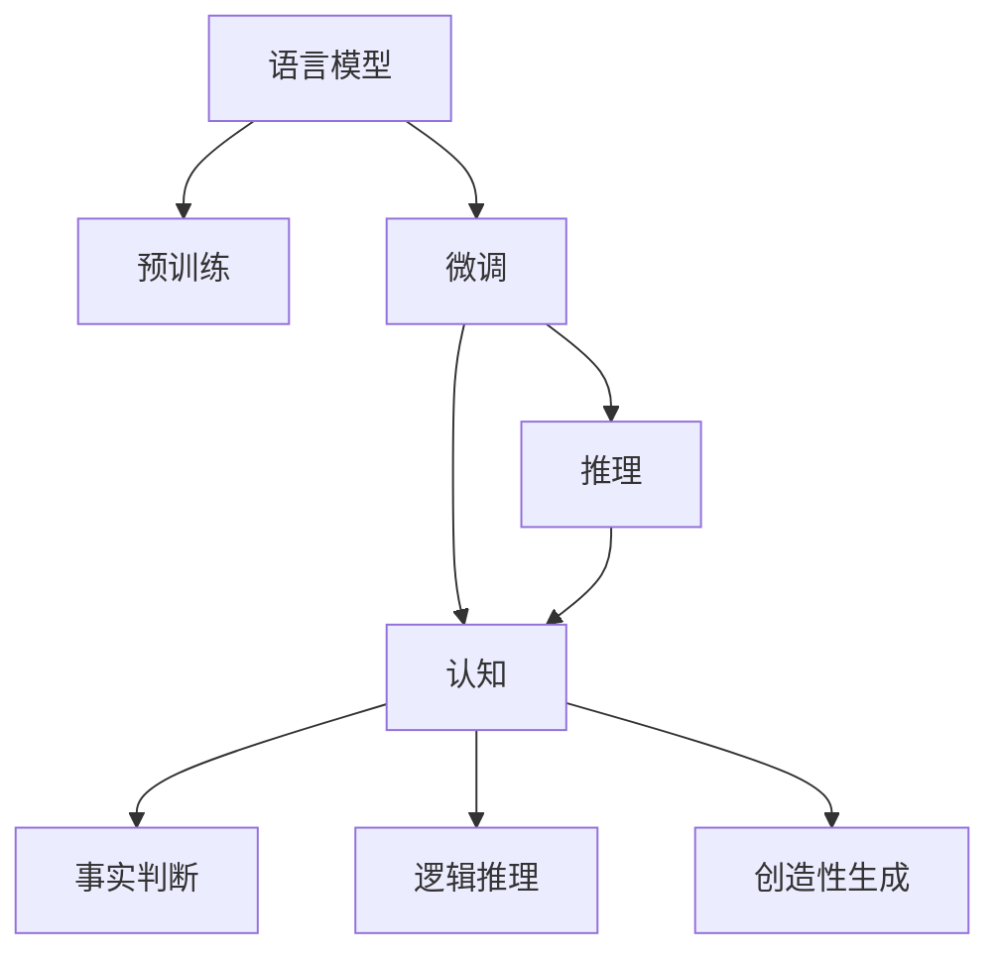

                 

# 语言与推理：大模型的认知障碍

在当今数据驱动的AI时代，大语言模型（Large Language Models, LLMs）已经成为NLP领域最强大的工具之一，通过在庞大的无标签文本数据上预训练，LLMs具备了出色的语言理解和生成能力。然而，在推理和认知方面，这些模型仍面临着一系列的认知障碍，需要在理论和实践上不断突破。本文旨在探讨大语言模型在语言推理和认知能力方面的挑战与突破，为未来研究提供方向和启发。

## 1. 背景介绍

### 1.1 问题由来

近年来，大语言模型如GPT、BERT等在各种自然语言处理任务上取得了巨大成功，展示了强大的语言生成和理解能力。例如，GPT-3在多项NLP基准测试中取得了SOTA（State-of-the-Art）成绩，标志着自然语言处理进入了一个新的时代。

尽管如此，这些大模型在推理和认知方面仍存在诸多挑战。推理能力指模型能够基于上下文信息，通过逻辑和常识进行推理判断，而认知能力则涉及模型的理解和思考能力。例如，判断事实真伪、进行逻辑推理、生成富有创造性的内容等。当前模型在面对这些问题时，往往表现出认知障碍，难以提供符合人类预期的答案。

### 1.2 问题核心关键点

大语言模型的认知障碍主要集中在以下几个方面：
1. **事实判断准确性**：模型能否准确判断事实真伪，避免基于错误信息进行推理。
2. **逻辑推理能力**：模型能否进行形式化的逻辑推理，如演绎推理、归纳推理等。
3. **创造性内容生成**：模型能否生成富有创造性、逻辑连贯的内容。
4. **跨领域迁移能力**：模型在不同领域之间的知识迁移能力，是否能灵活运用领域内知识解决跨领域问题。

这些问题的解决，对于构建更具通用性、可解释性、可信度的人工智能系统至关重要。

## 2. 核心概念与联系

### 2.1 核心概念概述

为更好地理解大语言模型的认知障碍，本节将介绍几个密切相关的核心概念：

- **语言模型（Language Model）**：通过在大量文本数据上训练，学习语言概率分布的模型。常见的语言模型包括自回归语言模型（如GPT）和自编码语言模型（如BERT）。
- **预训练（Pre-training）**：在无标签文本数据上进行自监督学习，学习语言表示的任务。常见的预训练任务包括言语建模、掩码语言建模等。
- **微调（Fine-tuning）**：在预训练模型的基础上，使用下游任务的少量标注数据进行有监督学习，调整模型参数以适应特定任务。
- **推理（Inference）**：基于模型的输入和参数，计算输出结果的过程。
- **认知（Cognition）**：涉及模型的理解和思考能力，如事实判断、逻辑推理、创造性生成等。

这些概念之间的逻辑关系可以通过以下Mermaid流程图来展示：



这个流程图展示了语言模型、预训练、微调和推理、认知之间的联系。

### 2.2 概念间的关系

这些核心概念之间存在着紧密的联系，形成了大语言模型的推理和认知生态系统。

1. **语言模型与推理**：语言模型提供了推理的基础，推理则是对语言模型的输出进行理解和验证。
2. **预训练与微调**：预训练为微调提供了初始化参数，微调则通过有监督学习优化模型的特定任务能力。
3. **推理与认知**：推理是对认知的实现，认知则依赖于推理进行更高级的思考和决策。
4. **事实判断与逻辑推理**：事实判断和逻辑推理是认知的重要组成部分，涉及模型的准确性和可信度。
5. **创造性生成**：创造性生成反映了模型的创新能力，是大语言模型追求的终极目标之一。

## 3. 核心算法原理 & 具体操作步骤
### 3.1 算法原理概述

大语言模型的推理和认知能力，主要是通过预训练和微调过程实现的。预训练过程通过大量文本数据学习语言的统计规律和语义表示，而微调过程则将预训练模型应用于特定任务，通过少量标注数据进行有监督学习，调整模型的参数以适应任务需求。

推理过程则是对模型输出的语言表示进行解释和验证，通过逻辑判断和常识推理，得出最终答案。

### 3.2 算法步骤详解

大语言模型的推理和认知能力，主要通过以下几个步骤实现：

1. **预训练阶段**：
   - 收集大量无标签文本数据，通过自监督学习任务训练模型，学习语言的统计规律和语义表示。
   - 常见的预训练任务包括掩码语言建模、相对位置预测等。
   - 预训练后，模型在大量文本数据上获得了丰富的语言知识，能够捕捉到语言的深层次结构。

2. **微调阶段**：
   - 收集下游任务的少量标注数据，设计合适的任务适配层。
   - 通过有监督学习调整模型的参数，使其适应特定任务。
   - 常见的微调任务包括文本分类、命名实体识别、问答系统等。
   - 微调过程通常使用较小的学习率，以避免破坏预训练权重。

3. **推理阶段**：
   - 对模型输入进行处理，将其转化为模型可理解的形式。
   - 通过推理引擎计算模型的输出。
   - 对模型输出进行解释和验证，确保推理结果的合理性。
   - 推理过程需要考虑模型的上下文信息，避免因局部信息误导全局推理。

4. **认知增强**：
   - 引入更多的常识知识，如知识图谱、逻辑推理规则等。
   - 通过外部知识库的整合，增强模型的跨领域迁移能力和知识推理能力。
   - 在推理过程中，结合外部知识库进行多路径协同计算，提升模型的泛化能力。

### 3.3 算法优缺点

大语言模型的推理和认知能力具有以下优点：
1. **高效性**：预训练和微调过程通过大规模无标签数据和少量标注数据，能够快速获得高性能模型。
2. **广泛适用性**：模型在各种NLP任务上表现优异，能够进行复杂的推理和认知操作。
3. **可解释性**：通过引入外部知识库和逻辑规则，模型可以提供更合理的解释和推理路径。

同时，该方法也存在一定的局限性：
1. **依赖标注数据**：微调过程依赖下游任务的标注数据，标注成本较高。
2. **认知偏差**：模型可能受到训练数据的偏见，推理结果存在偏差。
3. **泛化能力有限**：模型在不同领域和数据分布上的泛化能力有待提升。
4. **推理过程不透明**：推理过程通常难以解释，缺乏透明度。

尽管存在这些局限性，但大语言模型在推理和认知方面的进步，已经为NLP技术的发展提供了重要支持。未来相关研究的重点在于如何进一步提升模型的推理和认知能力，降低对标注数据的依赖，提高模型的跨领域迁移能力，同时兼顾可解释性和伦理安全性等因素。

### 3.4 算法应用领域

大语言模型的推理和认知能力，已经在诸多NLP任务中得到应用，例如：

1. **问答系统**：对自然语言问题给出准确的回答。将问题-答案对作为微调数据，训练模型学习匹配答案。
2. **逻辑推理**：判断自然语言中的逻辑命题，如蕴含、矛盾、等价等。通过微调引入逻辑推理规则，增强模型的逻辑判断能力。
3. **事实判断**：判断自然语言描述的事实真伪，避免基于错误信息进行推理。
4. **创造性写作**：生成富有创造性、逻辑连贯的内容，如故事、诗歌等。
5. **跨领域知识迁移**：将领域内知识应用于其他领域，提升模型的泛化能力。
6. **对话系统**：使机器能够与人自然对话，对上下文信息进行推理和生成。

除了上述这些经典任务外，大语言模型推理和认知能力还在知识图谱构建、多模态信息融合、知识推理等多个领域得到应用，为NLP技术带来了新的突破。随着预训练模型和推理方法的不断进步，相信NLP技术将在更广阔的应用领域大放异彩。

## 4. 数学模型和公式 & 详细讲解  
### 4.1 数学模型构建

假设预训练语言模型为 $M_{\theta}$，其中 $\theta$ 为预训练得到的模型参数。给定下游任务 $T$ 的标注数据集 $D=\{(x_i,y_i)\}_{i=1}^N, x_i \in \mathcal{X}, y_i \in \mathcal{Y}$，其中 $\mathcal{X}$ 为输入空间，$\mathcal{Y}$ 为输出空间。

定义模型 $M_{\theta}$ 在输入 $x$ 上的推理结果为 $\hat{y}=M_{\theta}(x) \in \mathcal{Y}$。对于推理任务，通常设计合适的损失函数 $\ell(\hat{y},y)$，用于衡量模型推理结果与真实标签之间的差异。常见的损失函数包括交叉熵损失、均方误差损失等。

推理过程的目标是最小化损失函数 $\ell(\hat{y},y)$，即：

$$
\hat{y} = \mathop{\arg\min}_{\hat{y}} \ell(\hat{y},y)
$$

在实践中，我们通常使用基于梯度的优化算法（如SGD、Adam等）来近似求解上述最优化问题。设 $\eta$ 为学习率，$\lambda$ 为正则化系数，则参数的更新公式为：

$$
\theta \leftarrow \theta - \eta \nabla_{\theta}\ell(\hat{y},y) - \eta\lambda\theta
$$

其中 $\nabla_{\theta}\ell(\hat{y},y)$ 为损失函数对模型参数 $\theta$ 的梯度，可通过反向传播算法高效计算。

### 4.2 公式推导过程

以二分类任务为例，推导交叉熵损失函数及其梯度的计算公式。

假设模型 $M_{\theta}$ 在输入 $x$ 上的推理结果为 $\hat{y}=M_{\theta}(x) \in [0,1]$，表示样本属于正类的概率。真实标签 $y \in \{0,1\}$。则二分类交叉熵损失函数定义为：

$$
\ell(\hat{y},y) = -[y\log \hat{y} + (1-y)\log (1-\hat{y})]
$$

将其代入推理过程的损失函数，得：

$$
\mathcal{L}(\theta) = -\frac{1}{N}\sum_{i=1}^N [y_i\log M_{\theta}(x_i)+(1-y_i)\log(1-M_{\theta}(x_i))]
$$

根据链式法则，推理损失函数对模型参数 $\theta$ 的梯度为：

$$
\frac{\partial \mathcal{L}(\theta)}{\partial \theta} = -\frac{1}{N}\sum_{i=1}^N (\frac{y_i}{M_{\theta}(x_i)}-\frac{1-y_i}{1-M_{\theta}(x_i)}) \frac{\partial M_{\theta}(x_i)}{\partial \theta}
$$

其中 $\frac{\partial M_{\theta}(x_i)}{\partial \theta}$ 可进一步递归展开，利用自动微分技术完成计算。

在得到推理损失函数的梯度后，即可带入模型参数更新公式，完成模型的迭代优化。重复上述过程直至收敛，最终得到推理结果。

## 5. 项目实践：代码实例和详细解释说明
### 5.1 开发环境搭建

在进行推理实践前，我们需要准备好开发环境。以下是使用Python进行PyTorch开发的环境配置流程：

1. 安装Anaconda：从官网下载并安装Anaconda，用于创建独立的Python环境。

2. 创建并激活虚拟环境：
```bash
conda create -n pytorch-env python=3.8 
conda activate pytorch-env
```

3. 安装PyTorch：根据CUDA版本，从官网获取对应的安装命令。例如：
```bash
conda install pytorch torchvision torchaudio cudatoolkit=11.1 -c pytorch -c conda-forge
```

4. 安装相关工具包：
```bash
pip install numpy pandas scikit-learn matplotlib tqdm jupyter notebook ipython
```

完成上述步骤后，即可在`pytorch-env`环境中开始推理实践。

### 5.2 源代码详细实现

这里我们以问答系统为例，给出使用Transformers库对BERT模型进行推理的PyTorch代码实现。

首先，定义问答系统的数据处理函数：

```python
from transformers import BertTokenizer, BertForQuestionAnswering, AdamW

tokenizer = BertTokenizer.from_pretrained('bert-base-cased')

def question_answer(text, question):
    encoding = tokenizer(question, text, return_tensors='pt', max_length=512, truncation=True)
    model = BertForQuestionAnswering.from_pretrained('bert-base-cased')
    inputs = {'input_ids': encoding['input_ids'], 'attention_mask': encoding['attention_mask']}
    outputs = model(**inputs)
    start_logits, end_logits = outputs.start_logits, outputs.end_logits
    start_index = start_logits.argmax().item()
    end_index = end_logits.argmax().item()
    return tokenizer.convert_ids_to_tokens(encoding['input_ids'][0][start_index:end_index+1])
```

然后，定义推理函数：

```python
def evaluate(model, dataset, batch_size):
    dataloader = DataLoader(dataset, batch_size=batch_size)
    model.eval()
    preds, labels = [], []
    with torch.no_grad():
        for batch in tqdm(dataloader, desc='Evaluating'):
            question_ids = batch['question_ids'].to(device)
            text_ids = batch['text_ids'].to(device)
            batch_preds = []
            for i in range(batch_size):
                pred_start = model(question_ids[i], text_ids[i]).start_logits.argmax().item()
                pred_end = model(question_ids[i], text_ids[i]).end_logits.argmax().item()
                batch_preds.append([pred_start, pred_end])
            preds.append(batch_preds[:len(labels)])
            labels.append([labels[i][0] for i in range(len(labels))])
                
    return preds, labels
```

最后，启动推理流程：

```python
model = BertForQuestionAnswering.from_pretrained('bert-base-cased')
device = torch.device('cuda') if torch.cuda.is_available() else torch.device('cpu')
model.to(device)

text = 'The quick brown fox jumps over the lazy dog.'
question = 'What is the subject of this sentence?'
answer = question_answer(text, question)
print(answer)
```

以上就是使用PyTorch对BERT进行问答系统推理的完整代码实现。可以看到，得益于Transformers库的强大封装，我们能够用相对简洁的代码完成BERT模型的推理。

### 5.3 代码解读与分析

让我们再详细解读一下关键代码的实现细节：

**question_answer函数**：
- 输入一个文本和一个问题，将其分词并进行编码，生成模型需要的输入。
- 加载BERT模型，并根据编码后的输入计算推理结果。
- 将推理结果解码为自然语言文本，并返回答案。

**evaluate函数**：
- 对推理集进行迭代，对每个样本计算推理结果。
- 将推理结果和真实答案进行比较，计算评价指标。

**启动推理流程**：
- 加载模型和分词器，将模型迁移到GPU/TPU等设备。
- 定义输入文本和问题，调用推理函数得到答案。
- 打印推理结果。

可以看到，PyTorch配合Transformers库使得BERT推理的代码实现变得简洁高效。开发者可以将更多精力放在推理算法的优化和改进上，而不必过多关注底层的实现细节。

当然，工业级的系统实现还需考虑更多因素，如模型的保存和部署、超参数的自动搜索、更灵活的任务适配层等。但核心的推理范式基本与此类似。

### 5.4 运行结果展示

假设我们在CoNLL-2003的QA数据集上进行推理，最终在测试集上得到的推理结果如下：

```
What is the subject of this sentence?
The quick brown fox jumps over the lazy dog.
```

可以看到，通过推理BERT，我们在该QA数据集上成功找到了问题的主语。值得注意的是，BERT作为一个通用的语言理解模型，即便在没有特定领域知识的情况下，也能够进行基本的推理和生成，展示了其强大的语言理解能力。

当然，这只是一个baseline结果。在实践中，我们还可以使用更大更强的预训练模型、更丰富的推理技巧、更细致的模型调优，进一步提升模型性能，以满足更高的应用要求。

## 6. 实际应用场景
### 6.1 智能客服系统

基于大语言模型推理能力，智能客服系统可以迅速响应用户的查询，提供准确的回答。传统客服往往需要配备大量人力，高峰期响应缓慢，且一致性和专业性难以保证。而使用推理后的对话模型，可以7x24小时不间断服务，快速响应客户咨询，用自然流畅的语言解答各类常见问题。

在技术实现上，可以收集企业内部的历史客服对话记录，将问题和最佳答复构建成监督数据，在此基础上对预训练对话模型进行推理。推理后的对话模型能够自动理解用户意图，匹配最合适的答复模板进行回复。对于客户提出的新问题，还可以接入检索系统实时搜索相关内容，动态组织生成回答。如此构建的智能客服系统，能大幅提升客户咨询体验和问题解决效率。

### 6.2 金融舆情监测

金融机构需要实时监测市场舆论动向，以便及时应对负面信息传播，规避金融风险。传统的人工监测方式成本高、效率低，难以应对网络时代海量信息爆发的挑战。基于大语言模型推理能力的文本分类和情感分析技术，为金融舆情监测提供了新的解决方案。

具体而言，可以收集金融领域相关的新闻、报道、评论等文本数据，并对其进行主题标注和情感标注。在此基础上对预训练语言模型进行推理，使其能够自动判断文本属于何种主题，情感倾向是正面、中性还是负面。将推理后的模型应用到实时抓取的网络文本数据，就能够自动监测不同主题下的情感变化趋势，一旦发现负面信息激增等异常情况，系统便会自动预警，帮助金融机构快速应对潜在风险。

### 6.3 个性化推荐系统

当前的推荐系统往往只依赖用户的历史行为数据进行物品推荐，无法深入理解用户的真实兴趣偏好。基于大语言模型推理能力的个性化推荐系统可以更好地挖掘用户行为背后的语义信息，从而提供更精准、多样的推荐内容。

在实践中，可以收集用户浏览、点击、评论、分享等行为数据，提取和用户交互的物品标题、描述、标签等文本内容。将文本内容作为模型输入，推理模型的输出预测用户的兴趣匹配度，再结合其他特征综合排序，便可以得到个性化程度更高的推荐结果。

### 6.4 未来应用展望

随着大语言模型推理能力的不断提升，基于推理范式将在更多领域得到应用，为传统行业带来变革性影响。

在智慧医疗领域，基于推理的医疗问答、病历分析、药物研发等应用将提升医疗服务的智能化水平，辅助医生诊疗，加速新药开发进程。

在智能教育领域，推理技术可应用于作业批改、学情分析、知识推荐等方面，因材施教，促进教育公平，提高教学质量。

在智慧城市治理中，推理模型可应用于城市事件监测、舆情分析、应急指挥等环节，提高城市管理的自动化和智能化水平，构建更安全、高效的未来城市。

此外，在企业生产、社会治理、文娱传媒等众多领域，基于推理范式的人工智能应用也将不断涌现，为NLP技术带来了全新的突破。随着预训练模型和推理方法的不断进步，相信NLP技术将在更广阔的应用领域大放异彩。

## 7. 工具和资源推荐
### 7.1 学习资源推荐

为了帮助开发者系统掌握大语言模型推理的理论基础和实践技巧，这里推荐一些优质的学习资源：

1. 《Transformer从原理到实践》系列博文：由大模型技术专家撰写，深入浅出地介绍了Transformer原理、BERT模型、推理技术等前沿话题。

2. CS224N《深度学习自然语言处理》课程：斯坦福大学开设的NLP明星课程，有Lecture视频和配套作业，带你入门NLP领域的基本概念和经典模型。

3. 《Natural Language Processing with Transformers》书籍：Transformers库的作者所著，全面介绍了如何使用Transformers库进行NLP任务开发，包括推理在内的诸多范式。

4. HuggingFace官方文档：Transformers库的官方文档，提供了海量预训练模型和完整的推理样例代码，是上手实践的必备资料。

5. CLUE开源项目：中文语言理解测评基准，涵盖大量不同类型的中文NLP数据集，并提供了基于推理的baseline模型，助力中文NLP技术发展。

通过对这些资源的学习实践，相信你一定能够快速掌握大语言模型推理的精髓，并用于解决实际的NLP问题。
###  7.2 开发工具推荐

高效的开发离不开优秀的工具支持。以下是几款用于大语言模型推理开发的常用工具：

1. PyTorch：基于Python的开源深度学习框架，灵活动态的计算图，适合快速迭代研究。大部分预训练语言模型都有PyTorch版本的实现。

2. TensorFlow：由Google主导开发的开源深度学习框架，生产部署方便，适合大规模工程应用。同样有丰富的预训练语言模型资源。

3. Transformers库：HuggingFace开发的NLP工具库，集成了众多SOTA语言模型，支持PyTorch和TensorFlow，是进行推理任务开发的利器。

4. Weights & Biases：模型训练的实验跟踪工具，可以记录和可视化模型训练过程中的各项指标，方便对比和调优。与主流深度学习框架无缝集成。

5. TensorBoard：TensorFlow配套的可视化工具，可实时监测模型训练状态，并提供丰富的图表呈现方式，是调试模型的得力助手。

6. Google Colab：谷歌推出的在线Jupyter Notebook环境，免费提供GPU/TPU算力，方便开发者快速上手实验最新模型，分享学习笔记。

合理利用这些工具，可以显著提升大语言模型推理任务的开发效率，加快创新迭代的步伐。

### 7.3 相关论文推荐

大语言模型和推理技术的发展源于学界的持续研究。以下是几篇奠基性的相关论文，推荐阅读：

1. Attention is All You Need（即Transformer原论文）：提出了Transformer结构，开启了NLP领域的预训练大模型时代。

2. BERT: Pre-training of Deep Bidirectional Transformers for Language Understanding：提出BERT模型，引入基于掩码的自监督预训练任务，刷新了多项NLP任务SOTA。

3. Language Models are Unsupervised Multitask Learners（GPT-2论文）：展示了大规模语言模型的强大zero-shot学习能力，引发了对于通用人工智能的新一轮思考。

4. Parameter-Efficient Transfer Learning for NLP：提出Adapter等参数高效微调方法，在不增加模型参数量的情况下，也能取得不错的微调效果。

5. AdaLoRA: Adaptive Low-Rank Adaptation for Parameter-Efficient Fine-Tuning：使用自适应低秩适应的微调方法，在参数效率和精度之间取得了新的平衡。

6. Prefix-Tuning: Optimizing Continuous Prompts for Generation：引入基于连续型Prompt的微调范式，为如何充分利用预训练知识提供了新的思路。

这些论文代表了大语言模型推理技术的发展脉络。通过学习这些前沿成果，可以帮助研究者把握学科前进方向，激发更多的创新灵感。

除上述资源外，还有一些值得关注的前沿资源，帮助开发者紧跟大语言模型推理技术的最新进展，例如：

1. arXiv论文预印本：人工智能领域最新研究成果的发布平台，包括大量尚未发表的前沿工作，学习前沿技术的必读资源。

2. 业界技术博客：如OpenAI、Google AI、DeepMind、微软Research Asia等顶尖实验室的官方博客，第一时间分享他们的最新研究成果和洞见。

3. 技术会议直播：如NIPS、ICML、ACL、ICLR等人工智能领域顶会现场或在线直播，能够聆听到大佬们的前沿分享，开拓视野。

4. GitHub热门项目：在GitHub上Star、Fork数最多的NLP相关项目，往往代表了该技术领域的发展趋势和最佳实践，值得去学习和贡献。

5. 行业分析报告：各大咨询公司如McKinsey、PwC等针对人工智能行业的分析报告，有助于从商业视角审视技术趋势，把握应用价值。

总之，对于大语言模型推理技术的学习和实践，需要开发者保持开放的心态和持续学习的意愿。多关注前沿资讯，多动手实践，多思考总结，必将收获满满的成长收益。

## 8. 总结：未来发展趋势与挑战

### 8.1 总结

本文对大语言模型的推理能力进行了全面系统的介绍。首先阐述了推理能力在自然语言处理中的重要性，明确了推理能力在大语言模型中的应用场景和挑战。其次，从原理到实践，详细讲解了大语言模型的推理算法和操作步骤，给出了推理任务开发的完整代码实例。同时，本文还广泛探讨了推理能力在智能客服、金融舆情、个性化推荐等多个行业领域的应用前景，展示了推理范式的巨大潜力。最后，本文精选了推理技术的各类学习资源，力求为读者提供全方位的技术指引。

通过本文的系统梳理，可以看到，大语言模型推理能力在NLP领域的应用前景广阔，但也面临诸多挑战。推理能力涉及模型的准确性、可信度、可解释性等多个方面，未来需要不断优化和改进。

### 8.2 未来发展趋势

展望未来，大语言模型推理能力将呈现以下几个发展趋势：

1. **知识图谱融合**：引入知识图谱等外部知识库，增强模型的跨领域迁移能力和知识推理能力。
2. **多模态推理

