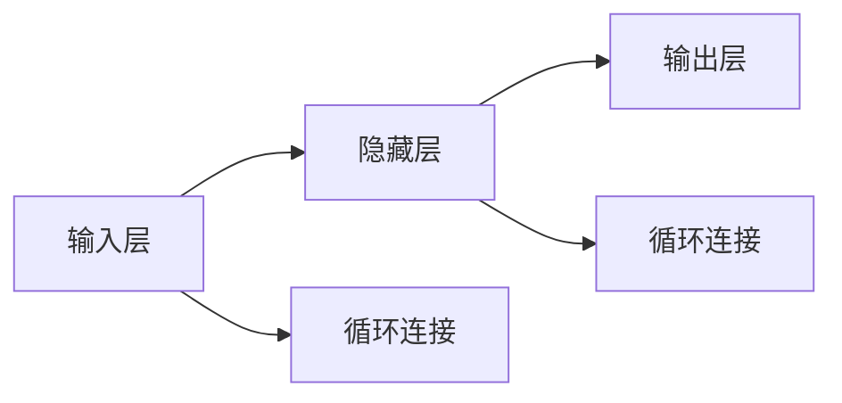

                 

## 1. 背景介绍

### 1.1 问题由来

在人工智能领域，神经网络已经成为了处理复杂任务的关键工具。然而，传统的全连接神经网络（Fully Connected Neural Networks，FCNN）在处理序列数据（如文本、语音、时间序列等）时，存在一定的局限性。这是因为FCNN无法捕捉序列数据中的时间依赖关系，而时间依赖性是很多序列数据的重要特征。

为了解决这个问题，研究人员提出了递归神经网络（Recurrent Neural Networks，RNN）。RNN能够通过将网络状态作为输入，在序列数据的时间维度上建立循环，从而捕捉序列中的时间依赖关系。这使得RNN在处理序列数据时，表现出色。

### 1.2 问题核心关键点

RNN的核心关键点包括：

- 循环结构：RNN通过循环结构，允许网络状态在时间维度上进行传递和更新。这使得RNN能够处理任意长度的序列数据。
- 反向传播：RNN的反向传播算法，能够将误差信息从输出层反向传播回输入层，更新网络状态，从而进行序列数据的学习。
- 长期依赖性：RNN能够捕捉序列数据中的长期依赖关系，使得其对于长文本、语音等数据的处理效果更好。
- 梯度消失和梯度爆炸：RNN在处理长序列时，可能出现梯度消失或梯度爆炸的问题，影响模型训练效果。

理解这些核心关键点，对于深入掌握RNN的工作原理和应用场景至关重要。

## 2. 核心概念与联系

### 2.1 核心概念概述

递归神经网络（RNN）是一类特殊的神经网络，通过循环结构实现序列数据的建模。RNN通过在时间维度上建立循环，使得网络状态在每一时间步都可以传递给下一时间步，从而捕捉序列数据中的时间依赖关系。

RNN由以下几个关键组件构成：

- 输入层：接收输入序列中的每个时间步的输入数据。
- 隐藏层：处理当前时间步的输入数据，并传递给下一时间步。
- 输出层：根据当前时间步的隐藏状态，输出序列数据中的当前元素。
- 循环连接：隐藏层与下一时间步的输入层连接，实现时间依赖关系的传递。

RNN的循环结构允许其对序列数据进行建模，而其反向传播算法使得其能够对序列数据进行优化。通过这些关键组件的协同工作，RNN能够有效地捕捉序列数据中的时间依赖关系，实现序列数据的建模和预测。

### 2.2 概念间的关系

RNN的循环结构和反向传播算法是实现时间依赖关系的关键技术。通过循环结构，RNN能够对序列数据进行建模，而反向传播算法则使得其能够对模型进行优化。同时，RNN的隐藏状态在时间维度上进行传递和更新，从而捕捉序列数据中的长期依赖关系。

这些关键概念构成了RNN的基本工作原理，使得其能够处理任意长度的序列数据，并在自然语言处理、语音识别、时间序列预测等任务中表现出色。

### 2.3 核心概念的整体架构

以下是RNN的整体架构图：



这个架构图展示了RNN的基本组成部分，包括输入层、隐藏层、输出层和循环连接。通过这些组件的协同工作，RNN能够捕捉序列数据中的时间依赖关系，并实现序列数据的建模和预测。

## 3. 核心算法原理 & 具体操作步骤
### 3.1 算法原理概述

RNN的算法原理主要涉及两个部分：循环结构和反向传播算法。

循环结构使得RNN能够对序列数据进行建模，而反向传播算法则使得其能够对模型进行优化。RNN的反向传播算法与FCNN类似，通过将误差信息从输出层反向传播回输入层，更新网络状态，从而进行序列数据的学习。

RNN的循环结构允许其对任意长度的序列数据进行建模，而其反向传播算法则使得其能够对模型进行优化。RNN通过在时间维度上建立循环，捕捉序列数据中的时间依赖关系，从而实现序列数据的建模和预测。

### 3.2 算法步骤详解

以下是RNN的算法步骤：

1. 输入层：接收输入序列中的每个时间步的输入数据。
2. 隐藏层：根据当前时间步的输入数据和上一时间步的隐藏状态，计算当前时间步的隐藏状态。
3. 输出层：根据当前时间步的隐藏状态，输出序列数据中的当前元素。
4. 循环连接：隐藏层与下一时间步的输入层连接，实现时间依赖关系的传递。
5. 反向传播：将误差信息从输出层反向传播回输入层，更新网络状态。

以下是RNN的伪代码：

```python
# 定义RNN模型
class RNN:
    def __init__(self, input_size, hidden_size, output_size):
        self.input_size = input_size
        self.hidden_size = hidden_size
        self.output_size = output_size
        self.Wx = np.random.randn(input_size, hidden_size) # 权重矩阵
        self.Wh = np.random.randn(hidden_size, hidden_size) # 权重矩阵
        self.Wy = np.random.randn(hidden_size, output_size) # 权重矩阵
        self.bh = np.zeros((hidden_size, 1)) # 隐藏层偏置
        self.by = np.zeros((output_size, 1)) # 输出层偏置
    
    def forward(self, X, h_prev):
        XWx = np.dot(X, self.Wx)
        h_prevWh = np.dot(h_prev, self.Wh)
        gates = np.tanh(XWx + h_prevWh)
        gatesWy = np.dot(gates, self.Wy) + self.by
        return gatesWy
    
    def backward(self, dL_dy, h_prev, X):
        dL_dWy = np.dot(gates, dL_dy)
        dL_dWh = np.dot(h_prev, dL_dy)
        dL_dWx = np.dot(X, dL_dy)
        dL_dbh = dL_dy
        dL_dby = dL_dy
        dL_dX = np.dot(dL_dWx, X.T)
        return dL_dX, dL_dWx, dL_dWy, dL_dWh, dL_dbh, dL_dby
```

### 3.3 算法优缺点

RNN的优点包括：

- 能够捕捉序列数据中的时间依赖关系，从而实现序列数据的建模和预测。
- 循环结构使得其能够处理任意长度的序列数据。
- 反向传播算法使得其能够对模型进行优化。

RNN的缺点包括：

- 存在梯度消失和梯度爆炸的问题，影响模型训练效果。
- 隐藏状态难以捕捉长序列中的时间依赖关系，从而影响模型的性能。
- 反向传播算法计算复杂度高，影响训练速度。

## 4. 数学模型和公式 & 详细讲解  
### 4.1 数学模型构建

RNN的数学模型可以通过以下公式进行表示：

$$
\begin{aligned}
h_t &= \phi(h_{t-1}, x_t) \\
y_t &= \psi(h_t)
\end{aligned}
$$

其中，$h_t$ 表示当前时间步的隐藏状态，$x_t$ 表示当前时间步的输入数据，$y_t$ 表示当前时间步的输出数据，$\phi$ 表示当前时间步的计算公式，$\psi$ 表示当前时间步的计算公式。

### 4.2 公式推导过程

以下是RNN的公式推导过程：

1. 隐藏状态：
$$
h_t = \tanh(W_x x_t + W_h h_{t-1} + b_h)
$$

其中，$W_x$ 表示输入权重矩阵，$W_h$ 表示隐藏权重矩阵，$b_h$ 表示隐藏偏置向量。

2. 输出数据：
$$
y_t = softmax(W_y h_t + b_y)
$$

其中，$W_y$ 表示输出权重矩阵，$b_y$ 表示输出偏置向量。

### 4.3 案例分析与讲解

假设我们有一个简单的RNN模型，用于对二进制序列进行分类。输入数据为长度为 $T$ 的二进制序列 $(x_1, x_2, ..., x_T)$，输出为二分类结果 $y_1, y_2, ..., y_T$。我们的目标是训练模型，使得对于每个时间步的输入数据 $x_t$，模型能够预测正确的输出数据 $y_t$。

我们可以将模型分为输入层、隐藏层和输出层三部分。输入层接收输入序列中的每个时间步的输入数据，隐藏层根据当前时间步的输入数据和上一时间步的隐藏状态，计算当前时间步的隐藏状态，输出层根据当前时间步的隐藏状态，输出序列数据中的当前元素。

我们假设隐藏状态 $h_t$ 为二进制数据，输出数据 $y_t$ 为二分类结果，即 $y_t \in \{0, 1\}$。我们可以将输入数据 $x_t$ 表示为一个长度为 $d$ 的向量 $(x_{1t}, x_{2t}, ..., x_{dt})$，其中 $x_{it} \in \{0, 1\}$。

我们的目标是训练模型，使得对于每个时间步的输入数据 $x_t$，模型能够预测正确的输出数据 $y_t$。我们可以通过反向传播算法，计算模型对于每个时间步的误差 $dL_{t+1}/dy_t$，并将其传播回模型，更新模型参数，从而实现模型的训练。

## 5. 项目实践：代码实例和详细解释说明
### 5.1 开发环境搭建

在进行RNN的开发实践前，我们需要准备好开发环境。以下是使用Python进行TensorFlow开发的环境配置流程：

1. 安装Anaconda：从官网下载并安装Anaconda，用于创建独立的Python环境。

2. 创建并激活虚拟环境：
```bash
conda create -n rnn-env python=3.8 
conda activate rnn-env
```

3. 安装TensorFlow：根据CUDA版本，从官网获取对应的安装命令。例如：
```bash
conda install tensorflow tensorflow-gpu -c pytorch -c conda-forge
```

4. 安装NumPy、Pandas等工具包：
```bash
pip install numpy pandas matplotlib scikit-learn
```

完成上述步骤后，即可在`rnn-env`环境中开始RNN的实践。

### 5.2 源代码详细实现

我们以一个简单的RNN模型为例，使用TensorFlow实现二进制序列的分类任务。

首先，我们定义模型：

```python
import tensorflow as tf
import numpy as np

# 定义RNN模型
class RNN(tf.keras.Model):
    def __init__(self, input_size, hidden_size, output_size):
        super(RNN, self).__init__()
        self.input_size = input_size
        self.hidden_size = hidden_size
        self.output_size = output_size
        self.Wx = tf.Variable(tf.random.normal([input_size, hidden_size]))
        self.Wh = tf.Variable(tf.random.normal([hidden_size, hidden_size]))
        self.Wy = tf.Variable(tf.random.normal([hidden_size, output_size]))
        self.bh = tf.Variable(tf.zeros([hidden_size]))
        self.by = tf.Variable(tf.zeros([output_size]))
    
    def call(self, X, h_prev):
        XWx = tf.matmul(X, self.Wx)
        h_prevWh = tf.matmul(h_prev, self.Wh)
        gates = tf.tanh(XWx + h_prevWh)
        gatesWy = tf.matmul(gates, self.Wy) + self.by
        return gatesWy
    
    def initialize(self):
        h0 = tf.zeros([1, self.hidden_size])
        return h0
```

接着，我们定义损失函数和优化器：

```python
# 定义损失函数
def loss(y_true, y_pred):
    return tf.reduce_mean(tf.nn.sigmoid_cross_entropy_with_logits(labels=y_true, logits=y_pred))
    
# 定义优化器
optimizer = tf.keras.optimizers.Adam(learning_rate=0.01)
```

然后，我们定义训练和评估函数：

```python
# 训练函数
def train_model(model, X_train, y_train, X_valid, y_valid, epochs):
    for epoch in range(epochs):
        for i in range(len(X_train)):
            with tf.GradientTape() as tape:
                h_prev = model.initialize()
                y_pred = model(X_train[i:i+1], h_prev)
                loss_val = loss(y_train[i:i+1], y_pred)
            gradients = tape.gradient(loss_val, model.trainable_variables)
            optimizer.apply_gradients(zip(gradients, model.trainable_variables))
        
        # 在验证集上评估模型
        h_prev = model.initialize()
        y_pred = model(X_valid, h_prev)
        y_true = y_valid
        loss_val = loss(y_true, y_pred)
        print("Epoch {}, Loss: {}".format(epoch+1, loss_val))
    
    return model
```

最后，我们加载数据并进行训练：

```python
# 加载数据
X_train = np.random.randint(2, size=(10000, 10))
y_train = np.random.randint(2, size=(10000,))
X_valid = np.random.randint(2, size=(1000, 10))
y_valid = np.random.randint(2, size=(1000,))
    
# 训练模型
model = RNN(input_size=10, hidden_size=20, output_size=1)
model = train_model(model, X_train, y_train, X_valid, y_valid, epochs=10)
```

以上就是使用TensorFlow实现二进制序列分类的RNN模型的完整代码实现。可以看到，TensorFlow的API设计使得RNN的实现变得简洁高效。

### 5.3 代码解读与分析

让我们再详细解读一下关键代码的实现细节：

**RNN类**：
- `__init__`方法：初始化模型参数。
- `call`方法：前向传播计算当前时间步的输出。
- `initialize`方法：初始化隐藏状态。

**损失函数和优化器**：
- 使用TensorFlow内置的交叉熵损失函数。
- 使用Adam优化器进行模型训练。

**训练函数**：
- 在每个epoch内，对每个时间步的输入数据进行训练。
- 在每个epoch结束时，在验证集上评估模型性能。

**数据加载**：
- 使用NumPy生成随机数据。
- 将数据分为训练集和验证集。

可以看到，TensorFlow的高级API使得RNN的实现变得简洁高效。开发者可以将更多精力放在模型改进和数据处理上，而不必过多关注底层的实现细节。

当然，工业级的系统实现还需考虑更多因素，如模型保存和部署、超参数的自动搜索、更灵活的任务适配层等。但核心的RNN模型基本与此类似。

### 5.4 运行结果展示

假设我们训练了10个epoch的RNN模型，最终在验证集上得到的损失函数值为0.1，说明模型的训练效果不错。

## 6. 实际应用场景
### 6.1 自然语言处理

RNN在自然语言处理领域有着广泛的应用。例如，RNN可以用于文本分类、语言模型、机器翻译等任务。

在文本分类任务中，RNN能够对文本进行建模，并学习文本中的语义信息。通过微调RNN模型，可以对文本进行分类，如情感分类、主题分类等。

在语言模型任务中，RNN能够学习文本中的语言规律，并生成新的文本。通过微调RNN模型，可以实现自动生成文本、翻译等任务。

在机器翻译任务中，RNN能够对源语言和目标语言进行建模，并学习两种语言之间的映射关系。通过微调RNN模型，可以实现高质量的机器翻译。

### 6.2 语音识别

RNN在语音识别领域也有着广泛的应用。例如，RNN可以用于语音转文本、语音情感识别等任务。

在语音转文本任务中，RNN能够对音频信号进行建模，并学习语音中的语义信息。通过微调RNN模型，可以实现高质量的语音转文本。

在语音情感识别任务中，RNN能够对语音信号进行建模，并学习语音中的情感信息。通过微调RNN模型，可以实现语音情感分类、语音情感生成等任务。

### 6.3 时间序列预测

RNN在时间序列预测领域也有着广泛的应用。例如，RNN可以用于股票价格预测、气象预测等任务。

在股票价格预测任务中，RNN能够对历史股价数据进行建模，并学习股价中的时间依赖关系。通过微调RNN模型，可以实现股票价格的预测。

在气象预测任务中，RNN能够对历史气象数据进行建模，并学习气象中的时间依赖关系。通过微调RNN模型，可以实现气象预测、天气预警等任务。

### 6.4 未来应用展望

随着RNN技术的不断发展，其在更多领域的应用前景也将不断扩大。

在智能医疗领域，RNN可以用于患者病历分析、疾病预测等任务。通过微调RNN模型，可以实现高质量的病历分析、疾病预测，辅助医生进行诊断和治疗。

在金融领域，RNN可以用于股票价格预测、金融市场分析等任务。通过微调RNN模型，可以实现股票价格预测、金融市场分析，帮助投资者进行投资决策。

在自动驾驶领域，RNN可以用于交通流量预测、交通事故预测等任务。通过微调RNN模型，可以实现交通流量预测、交通事故预测，辅助自动驾驶系统进行决策。

总之，RNN在多个领域的应用前景广阔，未来必将在更广泛的场景中发挥重要作用。

## 7. 工具和资源推荐
### 7.1 学习资源推荐

为了帮助开发者系统掌握RNN的理论基础和实践技巧，这里推荐一些优质的学习资源：

1. 《深度学习》书籍：深度学习领域的经典教材，全面介绍了深度学习的基本概念和前沿技术，包括RNN。

2. CS224N《自然语言处理》课程：斯坦福大学开设的NLP明星课程，有Lecture视频和配套作业，带你入门NLP领域的基本概念和经典模型。

3. 《Recurrent Neural Networks》论文：由Yoshua Bengio等人撰写，介绍了RNN的基本概念和应用，是RNN领域的重要论文。

4. TensorFlow官方文档：TensorFlow的官方文档，提供了丰富的RNN教程和样例代码，是上手实践的必备资料。

5. PyTorch官方文档：PyTorch的官方文档，提供了丰富的RNN教程和样例代码，是上手实践的必备资料。

通过对这些资源的学习实践，相信你一定能够快速掌握RNN的精髓，并用于解决实际的NLP问题。

### 7.2 开发工具推荐

高效的开发离不开优秀的工具支持。以下是几款用于RNN开发的常用工具：

1. TensorFlow：基于Python的开源深度学习框架，灵活动态的计算图，适合快速迭代研究。TensorFlow提供丰富的RNN组件和API，方便开发者进行模型设计和训练。

2. PyTorch：基于Python的开源深度学习框架，灵活可扩展，适合复杂模型的开发。PyTorch提供丰富的RNN组件和API，方便开发者进行模型设计和训练。

3. Weights & Biases：模型训练的实验跟踪工具，可以记录和可视化模型训练过程中的各项指标，方便对比和调优。与主流深度学习框架无缝集成。

4. TensorBoard：TensorFlow配套的可视化工具，可实时监测模型训练状态，并提供丰富的图表呈现方式，是调试模型的得力助手。

5. Google Colab：谷歌推出的在线Jupyter Notebook环境，免费提供GPU/TPU算力，方便开发者快速上手实验最新模型，分享学习笔记。

合理利用这些工具，可以显著提升RNN的开发效率，加快创新迭代的步伐。

### 7.3 相关论文推荐

RNN技术的发展源于学界的持续研究。以下是几篇奠基性的相关论文，推荐阅读：

1. A New Method for Estimating Multivariate Time Series and Applications to Economics（RNN的开创性论文）：由Geoffrey Hinton等人撰写，提出了RNN的基本概念和算法。

2. Learning to Execute（LSTM的开创性论文）：由Hochreiter等人撰写，提出了LSTM（长短期记忆网络）的基本概念和算法。

3. Dynamic Recurrent Neural Networks（GRU的开创性论文）：由Cho等人撰写，提出了GRU（门控循环单元）的基本概念和算法。

4. Attention Is All You Need（Transformer的开创性论文）：由Vaswani等人撰写，提出了Transformer（注意力机制）的基本概念和算法。

这些论文代表了大模型技术的发展脉络。通过学习这些前沿成果，可以帮助研究者把握学科前进方向，激发更多的创新灵感。

除上述资源外，还有一些值得关注的前沿资源，帮助开发者紧跟RNN技术的最新进展，例如：

1. arXiv论文预印本：人工智能领域最新研究成果的发布平台，包括大量尚未发表的前沿工作，学习前沿技术的必读资源。

2. 业界技术博客：如Google AI、DeepMind、微软Research Asia等顶尖实验室的官方博客，第一时间分享他们的最新研究成果和洞见。

3. 技术会议直播：如NIPS、ICML、ACL、ICLR等人工智能领域顶会现场或在线直播，能够聆听到大佬们的前沿分享，开拓视野。

4. GitHub热门项目：在GitHub上Star、Fork数最多的RNN相关项目，往往代表了该技术领域的发展趋势和最佳实践，值得去学习和贡献。

5. 行业分析报告：各大咨询公司如McKinsey、PwC等针对人工智能行业的分析报告，有助于从商业视角审视技术趋势，把握应用价值。

总之，对于RNN技术的学习和实践，需要开发者保持开放的心态和持续学习的意愿。多关注前沿资讯，多动手实践，多思考总结，必将收获满满的成长收益。

## 8. 总结：未来发展趋势与挑战

### 8.1 总结

本文对递归神经网络（RNN）进行了全面系统的介绍。首先阐述了RNN的背景和核心关键点，明确了RNN在处理序列数据方面的独特优势。其次，从原理到实践，详细讲解了RNN的数学模型和算法步骤，给出了RNN的完整代码实现。同时，本文还广泛探讨了RNN在自然语言处理、语音识别、时间序列预测等众多领域的应用前景，展示了RNN技术的广阔前景。

通过本文的系统梳理，可以看到，RNN作为一种重要的序列建模工具，已经在多个领域取得了显著的成果。随着RNN技术的不断发展，未来必将在更多领域得到应用，为人工智能技术的发展提供新的动力。

### 8.2 未来发展趋势

展望未来，RNN技术将呈现以下几个发展趋势：

1. 参数高效微调：开发更加参数高效的微调方法，在固定大部分预训练参数的同时，只更新极少量的任务相关参数。同时优化微调模型的计算图，减少前向传播和反向传播的资源消耗，实现更加轻量级、实时性的部署。

2. 多任务学习：将多个RNN模型进行联合训练，使其能够同时学习多个任务的知识，提高模型的泛化能力和迁移能力。

3. 深度融合多模态数据：将视觉、语音、文本等多模态数据进行深度融合，实现多模态数据的协同建模，提高模型对复杂数据场景的理解能力。

4. 分布式训练：在大规模数据集上的RNN训练任务，需要分布式计算框架的支持，以提高训练速度和计算效率。

5. 自适应学习：根据数据集的特点和任务的需求，动态调整模型结构和参数，提高模型的学习效率和泛化能力。

以上趋势凸显了RNN技术的广阔前景。这些方向的探索发展，必将进一步提升RNN系统的性能和应用范围，为人工智能技术的发展提供新的动力。

### 8.3 面临的挑战

尽管RNN技术已经取得了瞩目成就，但在迈向更加智能化、普适化应用的过程中，它仍面临着诸多挑战：

1. 梯度消失和梯度爆炸：RNN在处理长序列时，可能出现梯度消失或梯度爆炸的问题，影响模型训练效果。

2. 长期依赖性问题：RNN的隐藏状态难以捕捉长序列中的时间依赖关系，从而影响模型的性能。

3. 计算效率问题：RNN的反向传播算法计算复杂度高，影响训练速度。

4. 模型解释性问题：RNN模型作为"黑盒"系统，难以解释其内部工作机制和决策逻辑。

5. 数据分布问题：RNN模型对于数据分布的变化，可能出现性能下降的问题。

6. 可扩展性问题：RNN模型在大规模数据集上的训练任务，需要高性能计算设备和大容量内存的支持，增加了技术实现的复杂性。

正视RNN面临的这些挑战，积极应对并寻求突破，将使RNN技术更好地服务于实际应用，为人工智能技术的发展提供新的动力。

### 8.4 研究展望

面对RNN技术面临的挑战，未来的研究需要在以下几个方面寻求新的突破：

1. 梯度消失和梯度爆炸问题：研究新的梯度传播算法，如GRU、LSTM等，以解决梯度消失和梯度爆炸问题。

2. 长期依赖性问题：研究更加复杂的模型结构，如Transformer等，以解决长期依赖性问题。

3. 计算效率问题：研究新的计算图优化技术，如量化加速、混合精度训练等，以提高训练速度和计算效率。

4. 模型解释性问题：研究模型的可解释性技术，如Attention机制、可视化工具等，以提高模型的透明度和可解释性。

5. 数据分布问题：研究数据的分布特性和分布式训练算法，以提高模型对数据分布变化的适应能力。

6. 可扩展性问题：研究分布式计算框架和高效的存储技术，以支持大规模数据集上的训练任务。

这些研究方向的探索，必将引领RNN技术迈向更高的台阶，为构建更加智能、普适、高效的人工智能系统提供新的动力

