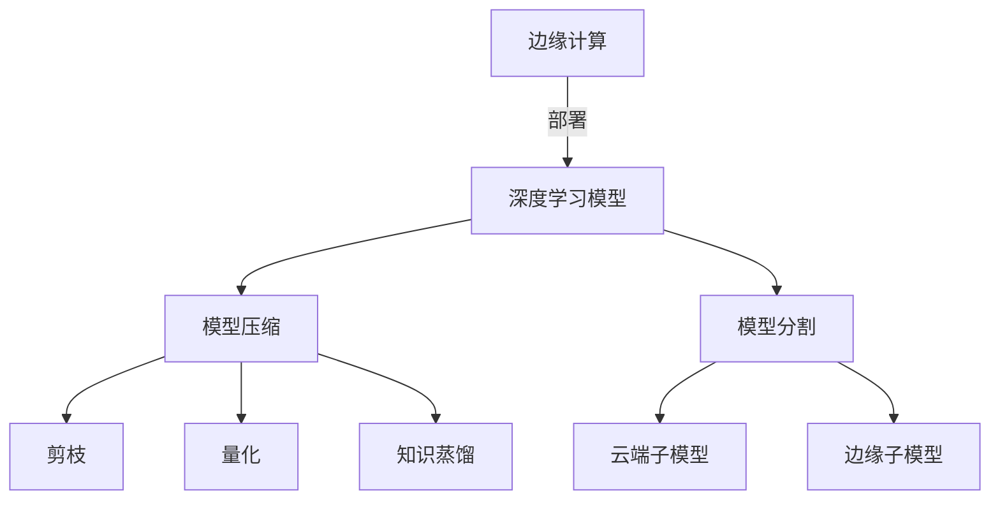

# 一切皆是映射：深度学习在边缘计算中的实现

## 1. 背景介绍

### 1.1 问题的由来

随着物联网(IoT)设备的快速普及,边缘计算(Edge Computing)作为一种新兴的计算范式,正在引领着人工智能(AI)和物联网技术的融合发展。边缘计算旨在将计算能力和数据处理过程尽可能地靠近数据源,从而减少数据传输的延迟,提高系统响应速度,并降低网络带宽压力。然而,边缘设备通常具有有限的计算资源和存储空间,这对于部署复杂的深度学习模型带来了巨大挑战。

### 1.2 研究现状

传统的深度学习模型通常需要大量的计算资源和存储空间,这使得它们很难直接部署在资源受限的边缘设备上。为了解决这个问题,研究人员提出了多种模型压缩和加速技术,如剪枝(Pruning)、量化(Quantization)和知识蒸馏(Knowledge Distillation)等。这些技术旨在减小模型的大小和计算复杂度,从而使其更适合在边缘设备上运行。

另一种流行的方法是将深度学习模型分割为多个子模型,其中一些子模型部署在云端,而另一些部署在边缘设备上。这种分布式方法可以充分利用云端的强大计算能力,同时也可以在边缘设备上执行一些轻量级的任务,从而实现低延迟和高效率的边缘计算。

### 1.3 研究意义

将深度学习引入边缘计算具有重要的理论和实际意义。从理论上讲,它有助于探索如何在资源受限的环境中高效地部署和运行深度学习模型,这对于推进人工智能技术在物联网和边缘计算领域的应用具有重要价值。从实际应用的角度来看,将深度学习与边缘计算相结合,可以为众多应用场景带来巨大的好处,如实时视频分析、预测维护、智能交通等。

### 1.4 本文结构

本文将全面探讨深度学习在边缘计算中的实现。首先,我们将介绍相关的核心概念和它们之间的联系。接下来,我们将深入探讨核心算法的原理和具体操作步骤,并详细讲解相关的数学模型和公式。然后,我们将提供一个实际的项目实践,包括代码实例和详细的解释说明。此外,我们还将讨论深度学习在边缘计算中的实际应用场景,并推荐一些有用的工具和资源。最后,我们将总结未来的发展趋势和面临的挑战,并对常见问题进行解答。

## 2. 核心概念与联系

在探讨深度学习在边缘计算中的实现之前,我们需要先了解一些核心概念及它们之间的关系。

如上图所示,边缘计算(Edge Computing)是将计算能力和数据处理过程靠近数据源的一种范式。为了在资源受限的边缘设备上部署深度学习模型(Deep Learning Model),我们可以采用模型压缩(Model Compression)或模型分割(Model Partitioning)等技术。

模型压缩包括剪枝(Pruning)、量化(Quantization)和知识蒸馏(Knowledge Distillation)等方法,旨在减小模型的大小和计算复杂度。而模型分割则是将深度学习模型分割为多个子模型,其中一些部署在云端(Cloud Submodel),另一些部署在边缘设备上(Edge Submodel),从而充分利用云端的强大计算能力和边缘设备的低延迟特性。

## 3. 核心算法原理 & 具体操作步骤

### 3.1 算法原理概述

为了在资源受限的边缘设备上高效地部署深度学习模型,我们需要采用一些核心算法,如模型压缩和模型分割等。这些算法的基本原理如下:

1. **模型压缩**:
   - 剪枝(Pruning):通过删除神经网络中的冗余权重和神经元,来减小模型的大小和计算复杂度。
   - 量化(Quantization):将原本使用高精度浮点数表示的权重和激活值,转换为低精度的定点数或整数表示,从而减小模型的存储空间和计算开销。
   - 知识蒸馏(Knowledge Distillation):利用一个大型的教师模型(Teacher Model)来指导一个小型的学生模型(Student Model)的训练,使学生模型能够学习到教师模型的知识,同时保持较小的模型大小。

2. **模型分割**:
   - 将深度学习模型分割为多个子模型,其中一些部署在云端,另一些部署在边缘设备上。
   - 云端子模型负责处理计算密集型任务,如特征提取和高级语义理解等。
   - 边缘子模型则执行一些轻量级的任务,如预处理、后处理和简单的推理等,从而实现低延迟和高效率的边缘计算。

### 3.2 算法步骤详解

#### 3.2.1 模型压缩

1. **剪枝(Pruning)**:
   - 步骤1:训练一个过参数化的深度神经网络模型。
   - 步骤2:根据一定的剪枝策略(如权重的绝对值、梯度等)确定需要剪枝的权重或神经元。
   - 步骤3:将确定的权重或神经元从模型中删除,得到一个精简的模型。
   - 步骤4:对精简后的模型进行微调(Fine-tuning),以恢复模型的性能。

2. **量化(Quantization)**:
   - 步骤1:训练一个浮点数精度的深度学习模型。
   - 步骤2:确定量化策略,如线性量化、对数量化或基于聚类的量化等。
   - 步骤3:根据量化策略,将模型的权重和激活值从浮点数转换为低精度的定点数或整数表示。
   - 步骤4:使用量化后的模型进行推理,同时利用硬件加速器(如GPU或TPU)进行加速计算。

3. **知识蒸馏(Knowledge Distillation)**:
   - 步骤1:训练一个大型的教师模型(Teacher Model)。
   - 步骤2:设计一个小型的学生模型(Student Model)。
   - 步骤3:使用教师模型的输出(如softmax概率分布)作为软目标,指导学生模型的训练。
   - 步骤4:在训练过程中,除了使用硬标签(Hard Label)作为监督信号外,还引入了软目标(Soft Target)作为额外的监督信号,使学生模型能够学习到教师模型的知识。
   - 步骤5:训练完成后,部署小型的学生模型,从而实现模型压缩。

#### 3.2.2 模型分割

1. **划分子模型**:
   - 步骤1:根据计算复杂度和延迟要求,将深度学习模型划分为多个子模型。
   - 步骤2:确定每个子模型的部署位置,如云端或边缘设备。
   - 步骤3:对每个子模型进行单独的训练和优化。

2. **子模型协作**:
   - 步骤1:设计子模型之间的通信协议和数据传输机制。
   - 步骤2:在推理过程中,边缘子模型首先对输入数据进行预处理和初步推理。
   - 步骤3:将预处理后的数据传输到云端子模型,进行高级语义理解和复杂计算。
   - 步骤4:云端子模型将计算结果传回边缘子模型,进行后处理和最终输出。

3. **模型更新与同步**:
   - 步骤1:定期将云端子模型的更新传递到边缘子模型。
   - 步骤2:边缘子模型根据更新进行模型同步和微调。
   - 步骤3:收集边缘设备的数据,用于在云端对整个模型进行重新训练和优化。

### 3.3 算法优缺点

#### 3.3.1 模型压缩

**优点**:
- 减小模型的大小和计算复杂度,使其更适合部署在资源受限的边缘设备上。
- 提高推理速度和能效,降低能源消耗和延迟。
- 保持了一定的模型精度,在压缩比较小的情况下,性能下降不太明显。

**缺点**:
- 过度压缩可能会导致模型精度显著下降。
- 压缩过程可能需要大量的计算资源和时间。
- 不同的压缩技术可能需要针对不同的模型和任务进行调整和优化。

#### 3.3.2 模型分割

**优点**:
- 充分利用了云端的强大计算能力和边缘设备的低延迟特性。
- 可以根据任务需求灵活地分配计算资源。
- 提高了系统的可扩展性和容错性。

**缺点**:
- 需要设计复杂的通信协议和数据传输机制,增加了系统复杂度。
- 子模型之间的数据传输可能会引入额外的延迟和带宽开销。
- 需要定期进行模型同步和更新,增加了维护成本。

### 3.4 算法应用领域

模型压缩和模型分割技术在以下领域有广泛的应用:

- **移动设备和物联网**:在资源受限的移动设备和物联网设备上部署深度学习模型,实现实时的计算机视觉、语音识别等任务。
- **自动驾驶和智能交通**:在车载设备上部署深度学习模型,实现实时的物体检测、路径规划等任务,提高自动驾驶的安全性和效率。
- **工业自动化和预测维护**:在工业设备上部署深度学习模型,实现实时的故障诊断、质量检测等任务,提高生产效率和产品质量。
- **智能家居和智能城市**:在家用设备和城市基础设施上部署深度学习模型,实现智能家居控制、交通监控等任务,提高生活质量和城市运营效率。

## 4. 数学模型和公式 & 详细讲解 & 举例说明

### 4.1 数学模型构建

在深度学习中,我们通常使用神经网络作为数学模型。神经网络是一种由多层神经元组成的非线性函数近似器,能够从数据中学习复杂的映射关系。

一个典型的神经网络可以表示为:

$$
\hat{y} = f(x; \theta) = f_L \circ f_{L-1} \circ \dots \circ f_1(x)
$$

其中:
- $x$ 是输入数据
- $\hat{y}$ 是模型的输出
- $\theta$ 是模型的可学习参数(权重和偏置)
- $f_l$ 是第 $l$ 层的非线性变换函数,通常包括线性变换(如全连接层或卷积层)和非线性激活函数(如ReLU、Sigmoid等)

在训练过程中,我们通过优化一个损失函数(Loss Function)来学习模型参数 $\theta$,使得模型的输出 $\hat{y}$ 尽可能接近真实标签 $y$。常用的损失函数包括均方误差(MSE)、交叉熵(Cross-Entropy)等。

对于分类任务,我们通常使用 Softmax 函数将神经网络的输出转换为概率分布:

$$
p(y=c|x) = \frac{e^{z_c}}{\sum_{k=1}^C e^{z_k}}
$$

其中:
- $C$ 是类别数
- $z_c$ 是神经网络对于第 $c$ 类的输出
- $p(y=c|x)$ 是输入 $x$ 属于第 $c$ 类的概率

在推理阶段,我们选择概率最大的类别作为模型的输出:

$$
\hat{y} = \arg\max_c p(y=c|x)
$$

### 4.2 公式推导过程

在模型压缩中,我们经常使用知识蒸馏(Knowledge Distillation)技术来指导小型学生模型的训练。知识蒸