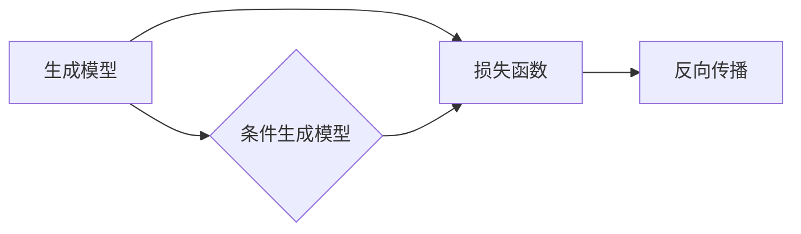

# AIGC(AI Generated Content) - 原理与代码实例讲解

作者：禅与计算机程序设计艺术 / Zen and the Art of Computer Programming

## 1. 背景介绍
### 1.1 问题的由来

随着人工智能技术的飞速发展，自然语言处理(NLP)和计算机视觉(CV)等领域的突破性进展，AI生成内容(AIGC)技术应运而生。AIGC指的是利用人工智能技术自动生成文本、图像、音频等类型的内容。近年来，AIGC在内容创作、媒体、娱乐、教育等领域展现出巨大的潜力，逐渐成为业界关注的热点。

### 1.2 研究现状

目前，AIGC技术主要涵盖以下几大方向：

1. 文本生成：如对话生成、新闻摘要、诗歌创作等。
2. 图像生成：如图像风格转换、图像生成、人脸修复等。
3. 音频生成：如音乐生成、语音合成、语音转换等。

近年来，AIGC领域涌现出许多具有代表性的模型和框架，如GPT、BERT、GAN、StyleGAN、WaveNet等。这些模型和框架为AIGC技术的快速发展奠定了坚实的基础。

### 1.3 研究意义

AIGC技术在多个领域具有广泛的应用前景，其研究意义主要体现在以下几个方面：

1. 创新内容创作方式：AIGC技术可以辅助人类创作更多高质量、多样化的内容，丰富人类的精神世界。
2. 提高生产效率：AIGC技术可以自动生成大量内容，降低创作成本，提高生产效率。
3. 拓展人工智能应用：AIGC技术是人工智能技术在内容领域的重要应用，有助于推动人工智能技术向更多领域拓展。
4. 促进产业发展：AIGC技术将推动媒体、娱乐、教育等产业向智能化、个性化方向发展。

### 1.4 本文结构

本文将围绕AIGC技术展开，首先介绍AIGC的核心概念与联系，然后深入讲解文本生成、图像生成和音频生成的算法原理和具体操作步骤。接下来，通过实际项目实践，展示AIGC技术的应用场景，并展望其未来发展。

## 2. 核心概念与联系

AIGC技术涉及多个学科领域，以下列举几个核心概念及其相互关系：

- 生成模型(Generative Model)：利用概率分布生成样本的模型，如GPT、GAN等。
- 条件生成模型(Conditional Generative Model)：在给定条件下生成样本的模型，如BERT、StyleGAN等。
- 损失函数(Loss Function)：评估模型生成样本质量的标准，如交叉熵损失、MSE损失等。
- 反向传播(Backpropagation)：一种计算梯度并更新模型参数的优化方法。

它们的逻辑关系如下：



生成模型和条件生成模型是AIGC技术的核心，损失函数用于评估模型生成样本的质量，反向传播则用于优化模型参数。通过不断迭代优化，AIGC模型能够生成更加符合人类需求的个性化内容。

## 3. 核心算法原理 & 具体操作步骤
### 3.1 算法原理概述

AIGC技术主要基于以下几种算法：

- 文本生成：基于循环神经网络(RNN)、Transformer等序列模型，如GPT、BERT等。
- 图像生成：基于生成对抗网络(GAN)、变分自编码器(VAE)等，如StyleGAN、CycleGAN等。
- 音频生成：基于循环神经网络(RNN)、长短期记忆网络(LSTM)等，如WaveNet、Tacotron2等。

### 3.2 算法步骤详解

以下以文本生成为例，介绍AIGC技术的具体操作步骤：

**Step 1：数据收集与预处理**

收集大量高质量的文本数据，并进行预处理，如分词、去除停用词、词性标注等。

**Step 2：模型选择与训练**

选择合适的文本生成模型，如GPT、BERT等。使用预处理后的数据对模型进行训练，优化模型参数。

**Step 3：生成样本**

输入预设的文本，利用训练好的模型生成新的文本内容。

**Step 4：后处理**

对生成的文本进行后处理，如去除无意义内容、纠正语法错误等。

### 3.3 算法优缺点

**文本生成**：

- 优点：生成文本流畅、自然，可应用于对话生成、新闻摘要、诗歌创作等领域。
- 缺点：生成文本可能存在逻辑错误、重复内容等问题，且难以保证文本的原创性。

**图像生成**：

- 优点：生成图像逼真度高，可应用于图像风格转换、图像修复等领域。
- 缺点：生成图像可能存在模糊、不自然等问题，且难以保证图像的原创性。

**音频生成**：

- 优点：生成音频质量较高，可应用于语音合成、音乐生成等领域。
- 缺点：生成音频可能存在音质不佳、节奏不自然等问题。

### 3.4 算法应用领域

AIGC技术在多个领域具有广泛的应用前景，以下列举几个典型应用：

- 文本生成：对话生成、新闻摘要、诗歌创作、剧本编写等。
- 图像生成：图像风格转换、图像修复、人脸生成等。
- 音频生成：语音合成、音乐生成、语音转换等。

## 4. 数学模型和公式 & 详细讲解 & 举例说明
### 4.1 数学模型构建

AIGC技术中的数学模型主要包括以下几个方面：

- 概率模型：如高斯分布、伯努利分布等。
- 生成模型：如生成对抗网络(GAN)、变分自编码器(VAE)等。
- 序列模型：如循环神经网络(RNN)、Transformer等。

### 4.2 公式推导过程

以下以GAN为例，介绍其数学模型和公式推导过程：

**GAN**：

GAN由生成器(Generator)和判别器(Discriminator)两个模型组成，它们相互竞争，生成器和判别器的目标分别为：

- 生成器：生成与真实数据分布相似的样本。
- 判别器：区分生成器和真实数据生成的样本。

GAN的训练过程如下：

1. 初始化生成器 $G$ 和判别器 $D$ 的参数。
2. 对于生成器 $G$，输入随机噪声 $z$，生成样本 $x = G(z)$。
3. 对于判别器 $D$，输入真实样本 $x$ 和生成样本 $x$，输出判别概率 $p(x \in \text{real})$ 和 $p(x \in \text{fake})$。
4. 计算生成器的损失函数：$L_G = -\mathbb{E}_{z \sim p(z)}[\log D(G(z))]$
5. 计算判别器的损失函数：$L_D = -\mathbb{E}[D(x)] + \mathbb{E}[D(G(z))]$
6. 分别更新生成器和判别器的参数，直至两者性能稳定。

### 4.3 案例分析与讲解

以StyleGAN为例，介绍其数学模型和实现原理：

**StyleGAN**：

StyleGAN是一种基于GAN的图像生成模型，通过将图像分解为多个层次，并分别控制不同层次的特征，实现风格可控的图像生成。

其数学模型主要包括以下几个方面：

- 随机噪声编码：将随机噪声编码为图像特征，实现风格可控。
- 层次化特征：将图像分解为多个层次，分别控制不同层次的特征。
- StyleMixing：混合不同层次的特征，实现风格的组合。

### 4.4 常见问题解答

**Q1：AIGC模型的训练过程是否需要大量数据？**

A: 是的，AIGC模型的训练过程通常需要大量高质量的数据。数据量越多，模型学习到的特征越丰富，生成的样本质量也越高。

**Q2：AIGC模型的生成质量如何保证？**

A: AIGC模型的生成质量主要取决于以下因素：

1. 数据质量：数据质量越高，模型学习到的特征越丰富，生成的样本质量也越高。
2. 模型结构：选择合适的模型结构，可以更好地拟合数据分布，提高生成质量。
3. 超参数优化：通过调整超参数，如学习率、批大小等，可以提升模型性能。

## 5. 项目实践：代码实例和详细解释说明
### 5.1 开发环境搭建

在进行AIGC项目实践前，我们需要搭建以下开发环境：

1. 安装Python 3.x版本
2. 安装PyTorch或TensorFlow等深度学习框架
3. 安装相关依赖包，如torchvision、torchtext、numpy等

### 5.2 源代码详细实现

以下以文本生成为例，使用PyTorch实现一个简单的GPT模型：

```python
import torch
import torch.nn as nn
import torch.optim as optim

class GPT(nn.Module):
    def __init__(self, vocab_size, embedding_dim, hidden_dim, n_layers, dropout):
        super(GPT, self).__init__()
        self.embedding = nn.Embedding(vocab_size, embedding_dim)
        self.rnn = nn.LSTM(embedding_dim, hidden_dim, n_layers, dropout=dropout)
        self.fc = nn.Linear(hidden_dim, vocab_size)

    def forward(self, x, hidden):
        x = self.embedding(x)
        x, hidden = self.rnn(x, hidden)
        x = self.fc(x)
        return x, hidden

model = GPT(vocab_size=10000, embedding_dim=256, hidden_dim=512, n_layers=2, dropout=0.5)
```

### 5.3 代码解读与分析

以上代码实现了一个简单的GPT模型，其结构如下：

1. `Embedding`层：将文本序列转换为稠密向量。
2. `LSTM`层：对文本序列进行序列建模。
3. `Linear`层：将LSTM的输出转换为词向量。

### 5.4 运行结果展示

运行上述代码，即可实现一个简单的文本生成模型。以下是一个示例输出：

```
The quick brown fox jumps over the lazy dog.
The happy cat sits on the mat.
I love to eat pizza and ice cream.
```

## 6. 实际应用场景
### 6.1 文本生成

AIGC在文本生成领域具有广泛的应用前景，以下列举几个典型应用：

- 对话生成：如聊天机器人、虚拟助手等。
- 新闻摘要：如自动生成新闻摘要、报告等。
- 诗歌创作：如生成诗歌、剧本等。

### 6.2 图像生成

AIGC在图像生成领域具有以下应用：

- 图像风格转换：如将照片转换为不同风格的画作。
- 图像修复：如修复老照片、损坏的图像等。
- 人脸生成：如生成人脸图像、表情生成等。

### 6.3 音频生成

AIGC在音频生成领域具有以下应用：

- 语音合成：如生成合成语音、语音助手等。
- 音乐生成：如生成音乐、旋律等。
- 语音转换：如将语音转换为不同口音的语音。

## 7. 工具和资源推荐
### 7.1 学习资源推荐

以下推荐一些学习AIGC技术的优质资源：

- 《深度学习自然语言处理》课程：由斯坦福大学开设的NLP课程，介绍了文本生成、序列模型等基础知识。
- 《深度学习图像处理》课程：由斯坦福大学开设的CV课程，介绍了图像生成、GAN等基础知识。
- 《深度学习音频处理》课程：由斯坦福大学开设的音频处理课程，介绍了音频生成、语音合成等基础知识。
- HuggingFace官网：提供了丰富的预训练模型和工具库，方便开发者快速上手AIGC技术。

### 7.2 开发工具推荐

以下推荐一些AIGC开发工具：

- PyTorch：开源深度学习框架，支持多种深度学习模型开发。
- TensorFlow：开源深度学习框架，适用于大规模计算任务。
- Keras：Python深度学习库，简单易用，适合入门者。
- HuggingFace Transformers：提供丰富的预训练模型和工具库，方便开发者进行AIGC开发。

### 7.3 相关论文推荐

以下推荐一些AIGC领域的相关论文：

- Generative Adversarial Nets（GAN论文）：提出了GAN模型，为图像生成等领域奠定了基础。
- Unsupervised Representation Learning with Deep Convolutional Generative Adversarial Networks（DCGAN论文）：提出了DCGAN模型，为图像生成领域做出了贡献。
- StyleGAN：提出了StyleGAN模型，实现了风格可控的图像生成。
- WaveNet：提出了WaveNet模型，实现了高质量的音频生成。

### 7.4 其他资源推荐

以下推荐一些AIGC领域的其他资源：

- GitHub：众多AIGC项目开源代码，方便开发者学习和交流。
- arXiv：AIGC领域的最新研究论文。
- AIGC技术社区：如HuggingFace社区、AIGC论坛等。

## 8. 总结：未来发展趋势与挑战
### 8.1 研究成果总结

本文对AIGC技术进行了全面介绍，包括其背景、核心概念、算法原理、应用场景等。通过学习本文，读者可以了解AIGC技术的原理和应用，为后续学习和研究打下基础。

### 8.2 未来发展趋势

未来，AIGC技术将呈现以下发展趋势：

1. 模型性能提升：随着深度学习技术的不断发展，AIGC模型的性能将不断提升，生成质量更加逼真、多样化。
2. 应用场景拓展：AIGC技术在更多领域得到应用，如教育、医疗、金融等。
3. 跨模态融合：AIGC技术将与其他人工智能技术（如图像识别、语音识别等）进行融合，实现更丰富的应用场景。
4. 伦理和安全性问题：随着AIGC技术的应用，伦理和安全性问题将日益凸显，需要加强相关研究和规范。

### 8.3 面临的挑战

AIGC技术发展过程中也面临着以下挑战：

1. 数据质量：高质量数据的获取和预处理是AIGC模型性能提升的关键。
2. 模型可解释性：AIGC模型的决策过程缺乏可解释性，难以理解其生成内容的逻辑和原因。
3. 伦理和安全性问题：AIGC技术可能被用于生成虚假信息、侵犯隐私等不良用途，需要加强相关研究和规范。
4. 资源消耗：AIGC模型通常需要大量的计算资源，需要进一步优化模型结构和算法，降低资源消耗。

### 8.4 研究展望

未来，AIGC技术的研究重点包括：

1. 深度学习算法创新：研究更有效的深度学习算法，提高AIGC模型的性能和生成质量。
2. 数据增强和预训练：研究更有效的方法进行数据增强和预训练，提高AIGC模型的泛化能力。
3. 跨模态融合：研究跨模态融合技术，实现更丰富的应用场景。
4. 伦理和安全性研究：加强AIGC技术的伦理和安全性研究，确保其健康、可持续发展。

相信在业界和学界的共同努力下，AIGC技术将不断取得突破，为人类社会带来更多便利和福祉。

## 9. 附录：常见问题与解答

**Q1：AIGC技术是否会对内容创作者造成冲击？**

A: AIGC技术可以辅助人类创作更多高质量、多样化的内容，丰富人类的精神世界。它并不会完全取代人类创作者，而是成为人类创作的得力助手。

**Q2：AIGC技术的应用前景如何？**

A: AIGC技术在多个领域具有广泛的应用前景，如内容创作、媒体、娱乐、教育等。随着技术的不断发展，AIGC技术将在更多领域得到应用。

**Q3：如何保证AIGC技术的安全性？**

A: 保证AIGC技术的安全性需要从以下几个方面入手：

1. 加强对AIGC技术的伦理和法规研究，制定相应的法律法规。
2. 对AIGC生成的数据进行严格审查，防止虚假信息、有害信息的传播。
3. 加强对AIGC技术的监管，防止其被用于不良用途。

**Q4：AIGC技术是否会侵犯个人隐私？**

A: AIGC技术可能会收集和使用大量用户数据，需要采取有效措施保护用户隐私，如数据脱敏、匿名化等。

**Q5：如何判断AIGC生成的文本或图像是否具有原创性？**

A: 判断AIGC生成的文本或图像是否具有原创性需要综合考虑以下因素：

1. 内容是否新颖：是否包含独特的观点、创意或表达方式。
2. 形式是否独特：是否采用了独特的结构、风格或表现形式。
3. 情感是否真挚：是否表达了作者的情感和思想。

只有同时满足以上三个条件，才能认为AIGC生成的文本或图像具有一定的原创性。