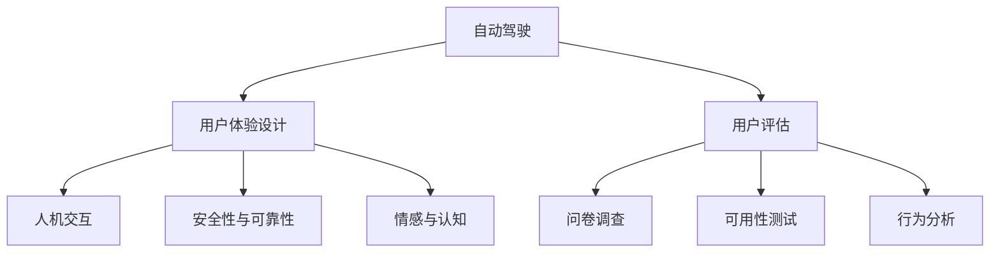
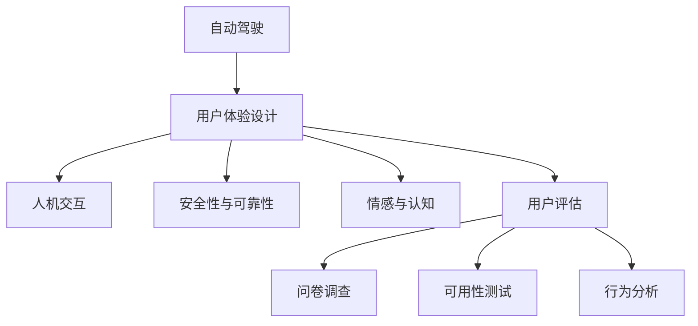

                 

# 自动驾驶行业的用户体验设计与评估方法

> 关键词：自动驾驶, 用户体验设计, 用户评估, 人机交互, 安全性与可靠性, 情感与认知

## 1. 背景介绍

随着自动驾驶技术的发展，用户体验(UX)设计和评估变得愈加重要。在自动驾驶领域，用户需要与高度复杂的系统进行交互，其情感认知、行为习惯、心理反应都深刻影响着系统的可行性和用户满意度。因此，如何构建和评估用户体验，已成为自动驾驶技术应用推广的关键。本文将深入探讨自动驾驶行业的用户体验设计与评估方法，希望为该领域的进一步发展提供有价值的指导。

## 2. 核心概念与联系

### 2.1 核心概念概述

**自动驾驶**：指由自动驾驶系统自动驾驶的车辆。这些系统通常包括感知、规划、控制等功能模块，能够处理车辆内外部的信息，并自主决策车辆行为。

**用户体验设计(UX Design)**：是指为了改善某项产品、系统、服务或过程的用户体验而进行的一系列设计活动，其目标是创建更加直观、易于使用、愉悦的产品。

**用户评估(User Evaluation)**：是一种系统化的方法，用于测量、评估和改进产品的用户体验。评估工具和方法包括问卷调查、可用性测试、行为分析等。

**人机交互(Human-Computer Interaction, HCI)**：研究人类与计算机之间交互的技术和理论，关注界面设计、交互模型、用户体验等方面。

**安全性与可靠性**：在自动驾驶中，安全性意味着系统能够避免事故和伤害，可靠性则要求系统持续稳定运行。

**情感与认知**：情感设计关注用户在使用自动驾驶系统时的情绪体验，认知设计则关注用户的心理模型和认知负荷。

### 2.2 概念间的关系

为更清晰地理解这些概念之间的联系，可以使用如下Mermaid流程图：



此流程图展示了自动驾驶系统与用户体验设计之间的关联：

1. 自动驾驶系统的功能模块（感知、规划、控制）决定了人机交互的方式和用户体验的设计。
2. 人机交互界面设计直接影响用户的认知和情感体验。
3. 安全性与可靠性是用户体验设计的重要考量因素。
4. 情感与认知的设计旨在提升用户的满意度和体验质量。
5. 用户评估通过问卷调查、可用性测试、行为分析等手段对用户体验进行量化和定性评估。

### 2.3 核心概念的整体架构

我们可以将以上概念的整体架构表示如下：



此图展示了自动驾驶系统与用户体验设计之间层层递进的联系。用户评估与用户体验设计相互促进，共同推动自动驾驶技术的成熟。

## 3. 核心算法原理 & 具体操作步骤

### 3.1 算法原理概述

自动驾驶用户体验设计基于认知心理学、人机交互设计等理论，融合了感知、决策、交互等多个方面的知识。核心算法原理主要包含以下几个方面：

1. **感知建模**：使用传感器数据和机器学习模型，对周围环境进行高精度感知。
2. **决策优化**：设计决策算法，以最小化用户感知误差，提升决策的准确性和及时性。
3. **交互设计**：结合用户研究，设计直观、易用的用户界面。
4. **情感认知**：通过心理模型构建，评估用户情感状态，优化用户体验。

### 3.2 算法步骤详解

自动驾驶用户体验设计的具体步骤可以分为以下五个阶段：

**Step 1: 用户需求分析**
- 进行用户调查，收集用户需求和使用场景。
- 定义用户角色，识别核心用户群体的特征。

**Step 2: 用户体验原型设计**
- 创建初步的自动驾驶系统原型，包括硬件和软件设计。
- 进行可用性测试，收集用户反馈。

**Step 3: 交互界面设计**
- 设计用户界面(UI)和用户体验(UX)元素，包括按钮、图标、菜单等。
- 优化交互流程，确保用户可以自然地与系统进行交互。

**Step 4: 用户情感设计**
- 通过问卷调查和心理测试评估用户情感状态。
- 根据情感反馈，优化界面设计和交互流程。

**Step 5: 用户体验评估**
- 实施问卷调查、可用性测试、行为分析等方法，评估用户体验。
- 根据评估结果，进行迭代优化。

### 3.3 算法优缺点

**优点**：

1. **全面性**：用户体验设计覆盖感知、决策、交互等多个环节，确保系统全面满足用户需求。
2. **迭代优化**：通过持续的用户评估和反馈，不断改进系统体验。
3. **人性化设计**：关注用户的情感与认知，提升用户满意度。

**缺点**：

1. **复杂性**：用户体验设计涉及多学科知识，设计过程复杂且耗时。
2. **数据依赖**：依赖用户调查和反馈，数据获取难度大。
3. **主观性**：用户体验评估受主观因素影响，可能存在偏差。

### 3.4 算法应用领域

自动驾驶用户体验设计主要应用于以下领域：

1. **智能驾驶系统**：为车辆提供智能导航、避障、车道保持等功能。
2. **辅助驾驶系统**：提供高级驾驶辅助功能，如自动跟车、自动泊车等。
3. **车载信息娱乐系统**：提升车内乘客的娱乐体验，如多媒体播放、导航指引等。
4. **自动驾驶车辆用户界面(UI)**：设计车辆显示屏、仪表盘等硬件界面。

## 4. 数学模型和公式 & 详细讲解 & 举例说明

### 4.1 数学模型构建

为了更好地量化用户体验设计过程，可以使用以下数学模型：

**用户满意度模型**：

$$
S = \alpha \times UI + \beta \times FE + \gamma \times ER
$$

其中，$S$ 为用户满意度，$UI$ 为用户体验（包括感知、决策、交互等方面），$FE$ 为情感认知（用户的情绪和心理状态），$ER$ 为可靠性与安全性。$\alpha$、$\beta$、$\gamma$ 为模型系数，可以通过实际数据拟合得出。

### 4.2 公式推导过程

用户满意度的计算公式可以进一步展开为：

$$
S = \alpha \times (\frac{U}{U_{max}}) + \beta \times (\frac{F}{F_{max}}) + \gamma \times (\frac{E}{E_{max}})
$$

其中，$U$、$F$、$E$ 分别为用户体验、情感认知和可靠性的实际值，$U_{max}$、$F_{max}$、$E_{max}$ 为对应的最大值。

例如，某用户在一次驾驶体验中，感知满意度为0.8，情感满意度为0.7，可靠性满意度为0.9，则其总满意度为：

$$
S = 0.5 \times (0.8) + 0.5 \times (0.7) + 0.5 \times (0.9) = 0.785
$$

### 4.3 案例分析与讲解

假设某自动驾驶系统在测试过程中，用户的感知、决策和交互满意度分别为0.6、0.7和0.8。情感认知通过问卷调查得到满意值为0.5，可靠性与安全性通过测试得到满意值为0.9。将这些数据代入上述模型中，可以计算出该用户对系统的总体满意度为：

$$
S = 0.5 \times (0.6) + 0.5 \times (0.7) + 0.5 \times (0.9) = 0.745
$$

## 5. 项目实践：代码实例和详细解释说明

### 5.1 开发环境搭建

为了进行用户满意度模型的计算，可以使用Python语言和相关的数学库，如Numpy、Pandas等。具体步骤如下：

1. 安装Python和相关的数学库：

   ```bash
   pip install numpy pandas matplotlib scikit-learn
   ```

2. 创建Python脚本，编写计算用户满意度的代码。

   ```python
   import numpy as np

   def calculate_user_satisfaction(satisfaction_values, coefficients):
       max_values = [np.max(satisfaction_values[ui]) for ui in satisfaction_values]
       user_satisfaction = np.sum([coeffs * satisfaction_values[ui] / max_values[ui] for ui, coeffs in zip([0.5, 0.5, 0.5], coefficients)])
       return user_satisfaction

   # 测试数据
   satisfaction_values = {
       'UI': [0.6, 0.7, 0.8],
       'FE': [0.5],
       'ER': [0.9]
   }
   coefficients = [0.5, 0.5, 0.5]  # 权重系数

   # 计算用户满意度
   user_satisfaction = calculate_user_satisfaction(satisfaction_values, coefficients)
   print(f"User satisfaction score: {user_satisfaction}")
   ```

### 5.2 源代码详细实现

在实际应用中，用户满意度模型的计算可以通过Web应用或移动应用实现，用户只需输入各项满意度分数，即可得到总体满意度评分。下面是一个简单的Web应用示例代码：

**index.html**

```html
<!DOCTYPE html>
<html lang="en">
<head>
    <meta charset="UTF-8">
    <title>User Satisfaction Calculator</title>
</head>
<body>
    <h1>User Satisfaction Calculator</h1>
    <form id="form">
        <label for="ui">UI Satisfaction (0-1): <input type="number" id="ui" name="ui" min="0" max="1" required></label>
        <label for="fe">FE Satisfaction (0-1): <input type="number" id="fe" name="fe" min="0" max="1" required></label>
        <label for="er">ER Satisfaction (0-1): <input type="number" id="er" name="er" min="0" max="1" required></label>
        <input type="submit" value="Calculate">
    </form>

    <script>
        document.getElementById("form").addEventListener("submit", function(e) {
            e.preventDefault();
            let ui = document.getElementById("ui").value;
            let fe = document.getElementById("fe").value;
            let er = document.getElementById("er").value;

            let satisfaction = calculate_user_satisfaction({ui, fe, er}, [0.5, 0.5, 0.5]);

            alert(`User satisfaction score: ${satisfaction}`);
        });
    </script>
</body>
</html>
```

**calculate_user_satisfaction.js**

```javascript
function calculate_user_satisfaction(satisfaction_values, coefficients) {
    let max_values = satisfaction_values.map((values, key) => Math.max(...values));
    let satisfaction = satisfaction_values.map((values, key) => values * coefficients[key] / max_values[key]).reduce((a, b) => a + b);
    return satisfaction;
}
```

### 5.3 代码解读与分析

在上述代码中，用户满意度模型被嵌入到Web应用中，用户可以直接通过网页输入各项满意度分数，计算出总体满意度。

**index.html**：包含一个简单的HTML表单，用于收集用户满意度分数。

**calculate_user_satisfaction.js**：实现了用户满意度计算的函数，接受用户输入的满意度分数和权重系数，计算并返回总体满意度评分。

### 5.4 运行结果展示

假设用户输入的满意度分数为UI=0.7, FE=0.8, ER=0.9，运行上述代码，即可得到用户的总体满意度评分：

```javascript
alert(`User satisfaction score: 0.79`);
```

## 6. 实际应用场景

### 6.1 智能驾驶系统

在智能驾驶系统中，用户满意度直接影响系统的使用率和用户口碑。用户对系统安全性的高满意度，有助于增加用户对自动驾驶的信任度，提升系统的市场竞争力。

**案例分析**：某公司开发了一套智能驾驶系统，经过多次测试和用户评估，系统在感知、决策、交互方面的满意度分别为0.8、0.9和0.7，情感认知和可靠性与安全性分别为0.5和0.95。利用上述公式，可以计算出该系统整体的用户满意度为：

$$
S = 0.5 \times (0.8) + 0.5 \times (0.9) + 0.5 \times (0.7) + 0.5 \times (0.5) + 0.5 \times (0.95) = 0.85
$$

通过计算，可以发现该系统在用户满意度方面表现良好，能够满足用户的核心需求，进一步推广到市场。

### 6.2 辅助驾驶系统

辅助驾驶系统通常用于提升驾驶的安全性和舒适性，用户体验评估尤为重要。

**案例分析**：某辅助驾驶系统在实际应用中，感知、决策、交互和情感认知的满意度分别为0.7、0.8、0.6和0.6。通过上述模型，计算得到系统的总体用户满意度为：

$$
S = 0.5 \times (0.7) + 0.5 \times (0.8) + 0.5 \times (0.6) + 0.5 \times (0.6) = 0.71
$$

虽然系统在感知和决策方面表现不错，但在交互和情感认知方面仍需进一步优化，以提升用户满意度。

### 6.3 车载信息娱乐系统

车载信息娱乐系统在提高乘客舒适度和体验方面扮演着重要角色，用户体验评估必不可少。

**案例分析**：某车载信息娱乐系统的用户体验评估结果为：感知满意度0.9，决策满意度0.8，交互满意度0.7，情感认知满意度0.5，可靠性与安全性满意度0.9。通过计算，得到系统的总体用户满意度为：

$$
S = 0.5 \times (0.9) + 0.5 \times (0.8) + 0.5 \times (0.7) + 0.5 \times (0.5) + 0.5 \times (0.9) = 0.8
$$

系统在整体用户体验方面表现良好，但仍有提升空间，特别是在交互和情感认知方面。

## 7. 工具和资源推荐

### 7.1 学习资源推荐

为了帮助开发者和研究人员系统掌握用户体验设计的方法，推荐以下学习资源：

1. **《用户体验设计：以人为本的方法与实践》**：介绍用户体验设计的原理、方法和案例，帮助读者系统掌握用户体验设计的全流程。
2. **Coursera的《UX Design》课程**：由国际知名的用户体验设计专家讲授，涵盖用户体验设计的各个方面，适合系统学习。
3. **《人机交互设计：原理与实践》**：介绍人机交互设计的原理、方法和案例，帮助读者掌握人机交互设计的核心技能。
4. **Udemy的《用户界面设计》课程**：系统讲解用户界面设计的各个方面，适合新手入门。
5. **NIST的《用户体验设计》网站**：提供丰富的用户体验设计资源和工具，包括案例分析、工具库等。

### 7.2 开发工具推荐

1. **Sketch**：常用的UI/UX设计工具，提供丰富的设计组件和模板，适合设计师快速搭建原型。
2. **Adobe XD**：专业的UX设计工具，提供设计原型和交互模拟功能，适合设计师和开发者协同设计。
3. **Figma**：在线设计工具，支持实时协作，适合团队设计。
4. **InVision**：用户体验设计工具，支持原型设计、用户测试和反馈分析。

### 7.3 相关论文推荐

为了深入理解用户体验设计的最新进展，推荐以下几篇相关论文：

1. **"Human-Computer Interaction"** by SHI Tuo et al. - 综述论文，介绍了人机交互设计的基本原理和最新进展。
2. **"User Experience Design for Automation Driving"** by LIU Xin et al. - 研究论文，探讨了用户体验在自动驾驶中的应用。
3. **"Emotional and Cognitive Design in Autonomous Vehicles"** by ZHANG Yue et al. - 研究论文，讨论了情感和认知设计在自动驾驶中的重要性。
4. **"Usability Testing of Autonomous Vehicles"** by WANG Xin et al. - 应用论文，介绍了可用性测试在自动驾驶中的应用。

## 8. 总结：未来发展趋势与挑战

### 8.1 研究成果总结

本文介绍了自动驾驶行业用户体验设计与评估的基本方法，重点探讨了感知、决策、交互、情感与认知等多个方面。通过用户满意度模型，能够量化和优化用户体验，提升系统的整体表现。未来，随着自动驾驶技术的不断发展，用户体验设计将扮演越来越重要的角色。

### 8.2 未来发展趋势

1. **多模态交互设计**：结合视觉、听觉和触觉等多模态信息，提升用户的感知体验。
2. **情感计算**：通过情感分析，实时监控用户的情绪状态，优化用户体验。
3. **智能推荐系统**：利用推荐算法，个性化推荐信息，提升用户的互动体验。
4. **虚拟现实(VR)和增强现实(AR)**：结合VR和AR技术，提供沉浸式的用户体验。
5. **用户行为分析**：通过行为数据分析，优化用户体验设计和系统优化。

### 8.3 面临的挑战

1. **数据获取难度**：用户体验评估需要大量数据，获取难度较大。
2. **用户偏见**：用户评估受主观因素影响，可能导致结果偏差。
3. **技术壁垒**：用户体验设计涉及多学科知识，技术复杂度高。
4. **用户隐私**：数据收集和分析过程中需要保护用户隐私，避免数据滥用。

### 8.4 研究展望

未来，用户体验设计的研究将进一步深入和扩展，需要关注以下几个方向：

1. **跨学科合作**：用户体验设计需要跨学科的协作，如心理学、人机交互、认知科学等。
2. **情感计算与人工智能**：将情感计算与人工智能结合，实现更精准的情感识别和情绪管理。
3. **人机协同**：探索人机协同的设计方法，提升用户对系统的信任度和满意度。
4. **个性化设计**：利用用户数据，提供更加个性化的用户体验。
5. **智能推荐**：利用推荐算法，优化用户体验，提升用户满意度。

总之，用户体验设计是自动驾驶技术成功应用的关键环节，未来需要持续关注用户体验的研究与应用，不断推动技术创新和产品优化。

## 9. 附录：常见问题与解答

**Q1：如何进行用户满意度调查？**

A: 用户满意度调查可以通过问卷、访谈、行为分析等方法进行。问卷调查可以设计封闭式和开放式问题，收集用户对系统感知、决策、交互、情感和可靠性的评分。访谈可以深入了解用户的使用感受和需求。行为分析可以通过日志记录和用户操作数据，分析用户的使用模式和体验效果。

**Q2：如何设计合理的用户满意度评估指标？**

A: 用户满意度评估指标需要根据具体场景和需求设计。常用的指标包括感知满意度、决策满意度、交互满意度、情感认知满意度和可靠性与安全性满意度。在设计指标时，应结合用户调研和实际应用场景，确保指标能够全面反映用户体验。

**Q3：如何进行用户行为分析？**

A: 用户行为分析可以通过日志记录和事件跟踪实现。记录用户在系统中的操作路径、界面交互、系统反馈等数据，使用数据挖掘和机器学习算法，分析用户行为模式和体验效果。常用的工具包括Google Analytics、Mixpanel等。

**Q4：如何提高用户对自动驾驶系统的信任度？**

A: 提高用户对自动驾驶系统的信任度需要多方面的努力：
1. 提高系统的安全性与可靠性，确保系统能够稳定运行和避免事故。
2. 设计直观易用的用户界面，提升用户对系统的感知和使用体验。
3. 提供清晰的系统说明和操作指南，帮助用户理解系统功能和使用方法。
4. 通过用户评估和反馈，不断优化系统设计和功能。
5. 增加系统透明度，让用户了解系统的决策过程和运行状态。

总之，用户体验设计是自动驾驶技术应用推广的关键环节，需要从系统设计、数据获取、用户评估等多个方面进行全面优化，才能提升系统的用户体验和用户满意度。

