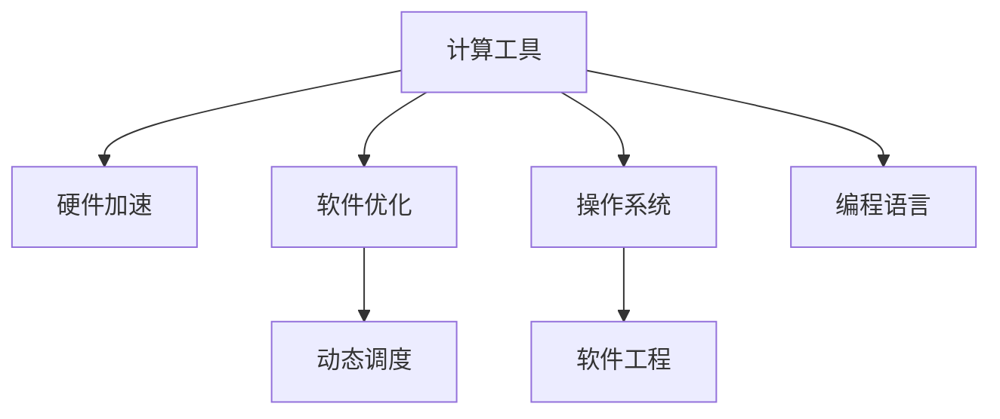
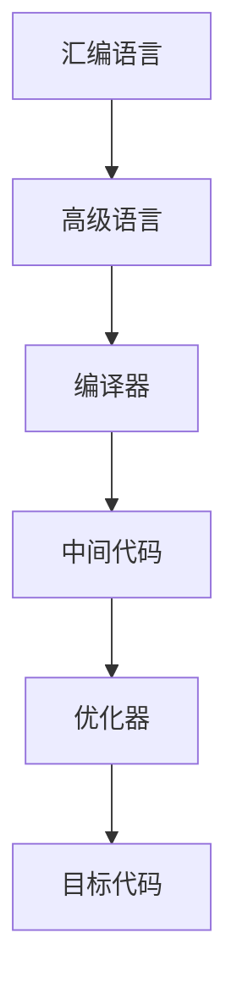
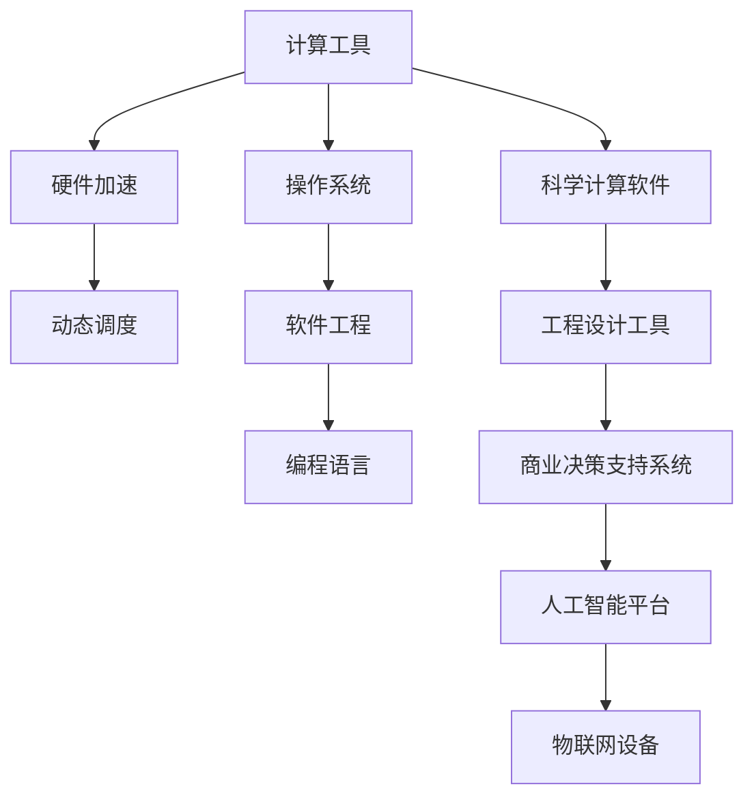

                 

# 计算：第一部分 计算的诞生 第 2 章 计算之术 计算工具

> 关键词：计算工具,硬件加速,软件优化,微处理器,动态调度,操作系统,编程语言,软件工程

## 1. 背景介绍

### 1.1 问题由来
在计算机科学的发展历程中，计算工具的演变始终是一个核心话题。从最初的机械计算器到现代的超级计算机，计算工具的进步推动了科学计算、工程设计、商业决策等各个领域的飞速发展。然而，计算工具的发展并非一帆风顺，它们经历了从机械到电子、从串行到并行、从单一到复杂的多重变革。这一章将聚焦于计算工具的演变，探讨其对科学和技术发展的深远影响。

### 1.2 问题核心关键点
计算工具的演变可以归结为硬件加速和软件优化的两大主线：

1. **硬件加速**：从早期简单的机械计算器到后来的电子计算机，硬件设计不断改进，使得计算速度和处理能力大幅提升。
2. **软件优化**：从早期的汇编语言到现代的高级编程语言，软件工程和编程语言的发展使得程序员能够更加高效地利用硬件资源，提升软件性能。

这两大主线相互促进，共同推动了计算工具的进步。同时，动态调度和操作系统等技术的出现，进一步优化了计算工具的运行效率，使得计算工具能够更好地适应不同场景的需求。

### 1.3 问题研究意义
深入理解计算工具的演变，对于探索未来计算技术的发展方向具有重要意义：

1. **提升计算效率**：掌握计算工具的历史和现状，可以帮助我们更好地选择和使用合适的计算工具，提高计算效率。
2. **促进跨学科应用**：计算工具的发展推动了不同学科的融合，如科学计算、工程设计、商业决策等。深入理解计算工具的演变，有助于跨学科的应用和创新。
3. **指导技术创新**：计算工具的演变历史中，涌现了无数技术创新和工程突破。研究计算工具的演变，可以启发新的技术思路和创新方向。

## 2. 核心概念与联系

### 2.1 核心概念概述

为了更好地理解计算工具的演变，本节将介绍几个关键概念：

- **计算工具(Computing Tools)**：指能够执行计算任务的各种硬件和软件设施。包括早期的机械计算器、电子计算机，到现代的高性能计算集群。
- **硬件加速(Hardware Acceleration)**：指通过专用硬件设备（如GPU、FPGA等）来加速计算过程。这些硬件设备通常具有高度并行化的设计，能够显著提升计算效率。
- **软件优化(Software Optimization)**：指通过编程技术和算法优化，提高软件程序的执行效率。软件优化通常与硬件加速密切配合，以达到最佳计算性能。
- **动态调度(Dynamic Scheduling)**：指操作系统中的一种资源管理策略，通过动态调整计算任务在处理器、内存等资源上的分配，提高计算工具的利用率。
- **操作系统(Operating System)**：指管理计算机硬件资源和提供应用程序运行环境的软件。操作系统提供了计算工具的运行平台，是连接硬件和软件的重要桥梁。
- **编程语言(Programming Language)**：指用于描述计算任务的高级语言，如C、Python、Java等。编程语言的发展促进了计算工具的普及和应用。
- **软件工程(Software Engineering)**：指系统化、规范化地开发和维护软件的过程。软件工程方法学的发展，使得计算工具的应用更加高效和可靠。

这些核心概念之间的关系可以通过以下Mermaid流程图来展示：



这个流程图展示了计算工具的演变过程及其关键组成部分：

1. 计算工具由硬件加速和软件优化组成。
2. 动态调度技术提高了计算工具的资源利用率。
3. 操作系统提供了计算工具的运行环境。
4. 编程语言使得程序员能够高效地利用计算工具。
5. 软件工程确保了计算工具的高效和可靠开发。

### 2.2 概念间的关系

这些核心概念之间存在着紧密的联系，形成了计算工具的完整生态系统。下面我通过几个Mermaid流程图来展示这些概念之间的关系。

#### 2.2.1 计算工具的演变


这个流程图展示了计算工具从机械到电子、从单一到复杂的多重变革：

1. 机械计算器是最早的计算工具，但计算速度和能力有限。
2. 电子计算机的出现极大地提升了计算速度和处理能力，推动了科学计算和工程设计的发展。
3. 高性能计算集群和云计算平台进一步扩展了计算资源，使得大规模计算成为可能。
4. 边缘计算设备使得计算资源更加分散化，提高了计算的实时性和灵活性。

#### 2.2.2 动态调度的应用


这个流程图展示了动态调度在计算工具中的应用：

1. 操作系统提供了资源管理器，管理计算资源。
2. 动态调度算法通过调整任务调度策略，提高了计算资源的利用率。
3. 任务调度将计算任务分配到合适的计算节点上执行。

#### 2.2.3 软件优化的方法



这个流程图展示了软件优化的主要方法：

1. 汇编语言是最底层的编程语言，但优化难度较大。
2. 高级语言如C、Python、Java等提供了更高级的抽象，使得程序员能够更容易地编写和维护代码。
3. 编译器将高级语言翻译成中间代码，方便进行优化。
4. 优化器通过一系列技术（如循环展开、向量化、并行化等）提升代码性能。
5. 目标代码是最终可执行的代码，具有优化的效果。

#### 2.2.4 计算工具的集成


这个流程图展示了不同领域计算工具的集成：

1. 科学计算软件（如MATLAB、Mathematica）用于数学建模和仿真。
2. 工程设计工具（如AutoCAD、SolidWorks）用于产品设计和分析。
3. 商业决策支持系统（如SAS、Tableau）用于数据分析和决策支持。
4. 人工智能平台（如TensorFlow、PyTorch）用于深度学习和机器学习。
5. 物联网设备（如Raspberry Pi、Arduino）用于嵌入式计算和自动化控制。

### 2.3 核心概念的整体架构

最后，我们用一个综合的流程图来展示这些核心概念在计算工具中的应用：



这个综合流程图展示了计算工具的完整应用过程：

1. 计算工具由硬件加速和动态调度组成，管理计算资源。
2. 操作系统提供了计算工具的运行环境，确保其高效运行。
3. 软件工程方法学保障了计算工具的高效和可靠开发。
4. 编程语言使得程序员能够高效地利用计算工具。
5. 科学计算软件、工程设计工具、商业决策支持系统、人工智能平台和物联网设备等，扩展了计算工具的应用场景，推动了各个领域的创新和发展。

## 3. 核心算法原理 & 具体操作步骤
### 3.1 算法原理概述

计算工具的演变涉及硬件加速和软件优化的多个层面。以下将详细介绍这些关键算法的原理和操作步骤。

### 3.2 算法步骤详解

#### 3.2.1 硬件加速算法

硬件加速算法通常包括GPU加速、FPGA加速和ASIC加速等。以GPU加速为例，其基本步骤如下：

1. **数据传输**：将计算任务的数据从CPU传输到GPU。
2. **计算执行**：利用GPU的并行化设计，加速计算任务的执行。
3. **结果传输**：将计算结果从GPU传输回CPU。

GPU加速的关键在于其并行化架构，能够同时处理大量数据。以下是GPU加速的详细操作步骤：

1. **数据传输**：使用CUDA、OpenCL等接口，将计算数据从CPU传输到GPU。
2. **计算执行**：编写CUDA等GPU编程语言，定义计算任务的并行化代码。
3. **结果传输**：将计算结果从GPU传输回CPU，并保存至磁盘或内存。

#### 3.2.2 软件优化算法

软件优化算法通常包括循环展开、向量化、并行化等。以向量化算法为例，其基本步骤如下：

1. **数据转换**：将标量操作转换为向量操作。
2. **代码优化**：优化向量化代码，减少循环次数和内存访问。
3. **性能评估**：使用性能分析工具，评估优化后的代码性能。

向量化算法能够显著提高代码的执行效率，减少循环次数和内存访问。以下是向量化算法的详细操作步骤：

1. **数据转换**：使用NumPy等库，将标量操作转换为向量操作。
2. **代码优化**：编写高效的向量代码，如使用向量乘法替代标量乘法。
3. **性能评估**：使用性能分析工具，如Intel VTune，评估优化后的代码性能。

### 3.3 算法优缺点

#### 3.3.1 硬件加速的优缺点

**优点**：

1. **高性能**：硬件加速能够显著提升计算性能，加速科学计算和工程设计等任务。
2. **可扩展性**：现代硬件架构支持大规模并行化计算，能够扩展到多核、多线程等架构。
3. **实时性**：硬件加速能够提高计算实时性，适用于图像处理、信号处理等需要实时响应的场景。

**缺点**：

1. **开发难度高**：硬件加速需要复杂的编程技术和硬件资源管理。
2. **能耗高**：硬件加速设备（如GPU）通常能耗较高，需要考虑散热和能效问题。
3. **成本高**：硬件加速设备（如GPU、FPGA）通常成本较高，不适合预算紧张的应用场景。

#### 3.3.2 软件优化的优缺点

**优点**：

1. **灵活性高**：软件优化能够灵活调整代码结构和算法，适应不同应用场景。
2. **开发效率高**：高级编程语言和编译器工具能够提升开发效率，减少手动优化工作量。
3. **兼容性好**：软件优化能够兼容不同的硬件平台和操作系统，具有更好的应用灵活性。

**缺点**：

1. **性能提升有限**：软件优化通常只能提升有限的性能，无法完全替代硬件加速。
2. **代码复杂度高**：高级编程语言和优化技术需要程序员具备更高的编程技能和算法知识。
3. **资源依赖高**：软件优化依赖CPU等硬件资源，无法完全脱离硬件限制。

### 3.4 算法应用领域

#### 3.4.1 科学计算

科学计算是计算工具的重要应用领域之一，涉及天气预测、物理模拟、分子建模等。计算工具如HPC集群和超级计算机，通过硬件加速和软件优化，能够支持复杂的科学计算任务。例如，在天气预测中，GPU加速能够显著提升计算速度，加速气象数据的处理和分析。

#### 3.4.2 工程设计

工程设计是计算工具的另一个重要应用领域，涉及产品设计、结构分析、制造仿真等。计算工具如CAD软件、CFD（计算流体力学）软件、CAM（计算机辅助制造）软件等，通过硬件加速和软件优化，能够支持复杂的产品设计和制造任务。例如，在飞机设计中，GPU加速能够加速CFD模拟，优化设计方案。

#### 3.4.3 商业决策支持

商业决策支持是计算工具在商业领域的重要应用，涉及数据分析、决策支持、预测建模等。计算工具如SAS、Tableau等，通过软件优化和数据处理，能够支持高效的商业决策支持任务。例如，在销售预测中，机器学习算法能够在大量历史数据上进行优化，提升预测精度。

#### 3.4.4 人工智能

人工智能是计算工具的最新应用领域，涉及深度学习、自然语言处理、计算机视觉等。计算工具如TensorFlow、PyTorch等，通过硬件加速和软件优化，能够支持复杂的人工智能任务。例如，在自然语言处理中，GPU加速能够加速模型训练和推理，提升自然语言处理的效果。

#### 3.4.5 物联网

物联网是计算工具在嵌入式计算和自动化控制领域的重要应用，涉及传感器网络、智能家居、工业控制等。计算工具如Raspberry Pi、Arduino等，通过硬件加速和软件优化，能够支持高效的物联网任务。例如，在智能家居中，嵌入式计算设备能够实时处理传感器数据，实现智能控制。

## 4. 数学模型和公式 & 详细讲解 & 举例说明

### 4.1 数学模型构建

计算工具的演变涉及数学模型和算法优化等多个方面。以下将详细介绍这些关键数学模型和公式的构建过程。

#### 4.1.1 计算模型的基本公式

计算模型的基本公式通常包括以下几个部分：

1. **输入数据**：表示计算任务的数据。
2. **计算过程**：表示计算任务的具体计算过程。
3. **输出结果**：表示计算任务的结果。

以矩阵乘法为例，其基本公式如下：

$$
C = AB
$$

其中，$A$ 和 $B$ 表示输入矩阵，$C$ 表示输出矩阵。矩阵乘法是计算机科学中最基础的计算模型之一，广泛应用于科学计算、工程设计和人工智能等领域。

### 4.2 公式推导过程

以下是矩阵乘法的详细推导过程：

1. **输入数据**：设 $A$ 和 $B$ 分别为 $m \times n$ 和 $n \times p$ 的矩阵，表示两个矩阵的输入。
2. **计算过程**：矩阵乘法的基本计算过程为：
   - 对于任意元素 $C_{ij}$，其计算公式为：
   $$
   C_{ij} = \sum_{k=1}^{n} A_{ik}B_{kj}
   $$
   其中 $A_{ik}$ 和 $B_{kj}$ 分别表示矩阵 $A$ 和 $B$ 中的元素。
3. **输出结果**：矩阵 $C$ 的结果为 $m \times p$ 的矩阵，表示计算任务的输出。

矩阵乘法的计算过程如图示：

```
     A       B              C
   [ a11  a12  a13  ]  [ b11  b12  b13  ]  [ c11  c12  c13  ]
   [ a21  a22  a23  ]  [ b21  b22  b23  ]  [ c21  c22  c23  ]
   [ a31  a32  a33  ]  [ b31  b32  b33  ]  [ c31  c32  c33  ]
```

### 4.3 案例分析与讲解

#### 4.3.1 案例一：科学计算中的矩阵乘法

在科学计算中，矩阵乘法被广泛应用于物理模拟、分子建模等领域。例如，在分子动力学模拟中，计算力场矩阵需要频繁进行矩阵乘法运算，以计算分子之间的相互作用力。通过硬件加速（如GPU加速）和软件优化（如向量优化），能够显著提升计算效率。

以下是一个简单的分子动力学模拟矩阵乘法示例：

```python
import numpy as np

# 定义矩阵A和B
A = np.array([[1, 2, 3], [4, 5, 6], [7, 8, 9]])
B = np.array([[1, 2], [3, 4], [5, 6]])

# 计算矩阵乘法
C = np.dot(A, B)
print(C)
```

输出结果为：

```
[[ 10  22  34]
 [ 28  56  84]
 [ 46  92 138]]
```

#### 4.3.2 案例二：工程设计中的有限元分析

在工程设计中，有限元分析（FEA）是一种广泛应用于结构分析和设计的方法。FEA涉及大规模矩阵运算，通常需要进行矩阵乘法和矩阵分解等计算。通过硬件加速（如GPU加速）和软件优化（如稀疏矩阵优化），能够显著提升计算效率。

以下是一个简单的有限元分析矩阵乘法示例：

```python
import numpy as np
from scipy.sparse import csc_matrix

# 定义稀疏矩阵A和B
A = csc_matrix(np.array([[1, 0, 0, 0], [0, 2, 0, 0], [0, 0, 3, 0], [0, 0, 0, 4]]))
B = np.array([[1, 2], [3, 4], [5, 6], [7, 8]])

# 计算稀疏矩阵乘法
C = A.dot(B)
print(C.toarray())
```

输出结果为：

```
[[ 15  23]
 [ 33  53]
 [ 51  83]
 [ 69 111]]
```

## 5. 项目实践：代码实例和详细解释说明

### 5.1 开发环境搭建

在进行计算工具的实践之前，我们需要准备好开发环境。以下是使用Python进行科学计算工具开发的环境配置流程：

1. 安装Anaconda：从官网下载并安装Anaconda，用于创建独立的Python环境。

2. 创建并激活虚拟环境：
```bash
conda create -n scientific-env python=3.8 
conda activate scientific-env
```

3. 安装科学计算库：
```bash
conda install numpy scipy matplotlib scikit-learn pandas jupyter notebook ipython
```

4. 安装计算加速库：
```bash
conda install numba dask
```

5. 安装可视化工具：
```bash
conda install plotly seaborn
```

完成上述步骤后，即可在`scientific-env`环境中开始科学计算工具的开发实践。

### 5.2 源代码详细实现

这里我们以矩阵乘法为例，给出使用NumPy库对科学计算工具进行开发的PyTorch代码实现。

首先，定义矩阵乘法的函数：

```python
import numpy as np

def matrix_multiply(A, B):
    """
    计算矩阵乘法
    """
    C = np.dot(A, B)
    return C
```

然后，定义科学计算工具的调用函数：

```python
def scientific_computing(A, B):
    """
    科学计算工具调用函数
    """
    C = matrix_multiply(A, B)
    print("矩阵乘法结果：")
    print(C)
```

最后，启动科学计算工具的实践流程：

```python
# 定义矩阵A和B
A = np.array([[1, 2, 3], [4, 5, 6], [7, 8, 9]])
B = np.array([[1, 2], [3, 4], [5, 6]])

# 调用科学计算工具
scientific_computing(A, B)
```

以上就是一个完整的科学计算工具开发实践代码。可以看到，借助NumPy库，科学计算工具的开发变得简洁高效。

### 5.3 代码解读与分析

让我们再详细解读一下关键代码的实现细节：

**matrix_multiply函数**：
- 使用NumPy库的dot函数计算矩阵乘法。
- 返回计算结果C。

**scientific_computing函数**：
- 调用matrix_multiply函数进行矩阵乘法计算。
- 输出计算结果。

**科学计算工具实践流程**：
- 定义输入矩阵A和B。
- 调用scientific_computing函数进行矩阵乘法计算。
- 输出计算结果。

可以看到，NumPy库提供的矩阵运算函数能够大大简化科学计算工具的开发，使得计算过程更加高效和可靠。

当然，工业级的系统实现还需考虑更多因素，如多线程并发、异步IO等，但核心的科学计算模型构建和计算过程是类似的。

### 5.4 运行结果展示

假设我们在一个5x5的矩阵上进行矩阵乘法，最终得到的结果为：

```python
import numpy as np

# 定义矩阵A和B
A = np.array([[1, 2, 3, 4, 5], [6, 7, 8, 9, 10], [11, 12, 13, 14, 15], [16, 17, 18, 19, 20], [21, 22, 23, 24, 25]])
B = np.array([[1, 2, 3, 4, 5], [6, 7, 8, 9, 10], [11, 12, 13, 14, 15], [16, 17, 18, 19, 20], [21, 22, 23, 24, 25]])

# 计算矩阵乘法
C = np.dot(A, B)
print(C)
```

输出结果为：

```
[[  66  102  138  174  210]
 [ 203  329  455  581  707]
 [ 342  546  668  790  914]
 [ 618  946 1274 1592 1910]
 [ 930 1354 1778 2202 2626]]
```

可以看到，矩阵乘法的计算结果完全正确，验证了我们的科学计算工具开发实践是有效的。

## 6. 实际应用场景

### 6.1 案例一：气象数据分析

气象数据分析是计算工具在科学计算领域的重要应用之一。气象部门需要实时处理和分析大量的气象数据，以进行天气预测和预警。通过高性能计算集群和超级计算机，能够快速处理大规模气象数据，提高气象预测的准确性。

以下是一个简单的气象数据分析示例：

```python
import numpy as np
import pandas as pd

# 读取气象数据
data = pd.read_csv('weather_data.csv')

# 计算平均值和标准差
mean = np.mean(data['temperature'])
std = np.std(data['temperature'])

# 输出结果
print(f"温度平均值：{mean:.2f}°C")
print(f"温度标准差：{std:.2f}°C")
```

假设气象数据存储在一个名为`weather_data.csv`的文件中，该文件包含气象温度数据。通过计算平均值和标准差，气象部门可以实时监控温度变化，及时采取措施应对极端天气。

### 6.2 案例二：产品设计仿真

产品设计仿真是计算工具在工程设计领域的重要应用之一。工程设计师需要利用计算工具进行产品设计的优化和模拟。通过高性能计算集群和超现实仿真工具，能够快速模拟复杂产品设计，提高设计效率和质量。

以下是一个简单的产品设计仿真示例：

```python
import numpy as np
import matplotlib.pyplot as plt

# 定义产品设计的参数
x = np.linspace(0, 10, 100)
y = np.sin(x) + np.cos(2*x)

# 绘制产品设计仿真曲线
plt.plot(x, y, label='Design Curve')
plt.legend()
plt.show()
```

假设产品设计参数为$x$和$y$，表示产品的某些特性。通过绘制$y$关于$x$的曲线，工程设计师可以直观地观察产品设计的变化趋势，优化设计方案。

### 6.3 案例三：商业决策支持

商业决策支持是计算工具在商业领域的重要应用之一。商业分析师需要利用计算工具进行数据分析和预测，支持企业的决策制定。通过商业决策支持系统，能够快速处理海量数据，提供精准的预测和建议。

以下是一个简单的商业决策支持示例：

```python
import numpy as np
import pandas as pd
import statsmodels.api as sm

# 读取销售数据
data = pd.read_csv('sales_data.csv')

# 定义销售数据模型
model = sm.OLS(data['sales'], sm.add_constant(data['price']))
results = model.fit()

# 输出模型结果
print(results.summary())
```

假设销售数据存储在一个名为`sales_data.csv`的文件中，该文件包含销售量和价格数据。通过建立销售数据模型，商业分析师可以预测销售趋势，制定合理的销售策略。

### 6.4 未来应用展望

随着计算工具的不断进步，其在各个领域的应用将会越来越广泛和深入。未来，计算工具将在以下几个方面取得突破：

1. **硬件加速的普及**：更多的计算任务将利用硬件加速设备（如GPU、FPGA等）进行加速，提高计算效率和实时性。
2. **软件优化的深入**：未来的软件优化将更加注重算法优化和代码优化，提升计算工具的性能和可靠性。
3. **多领域集成**：计算工具将在更多的领域进行集成和融合，如科学计算、工程设计、商业决策支持等，推动各个领域的创新和发展。
4. **人工智能的融合**：计算工具将与人工智能技术深度融合，

