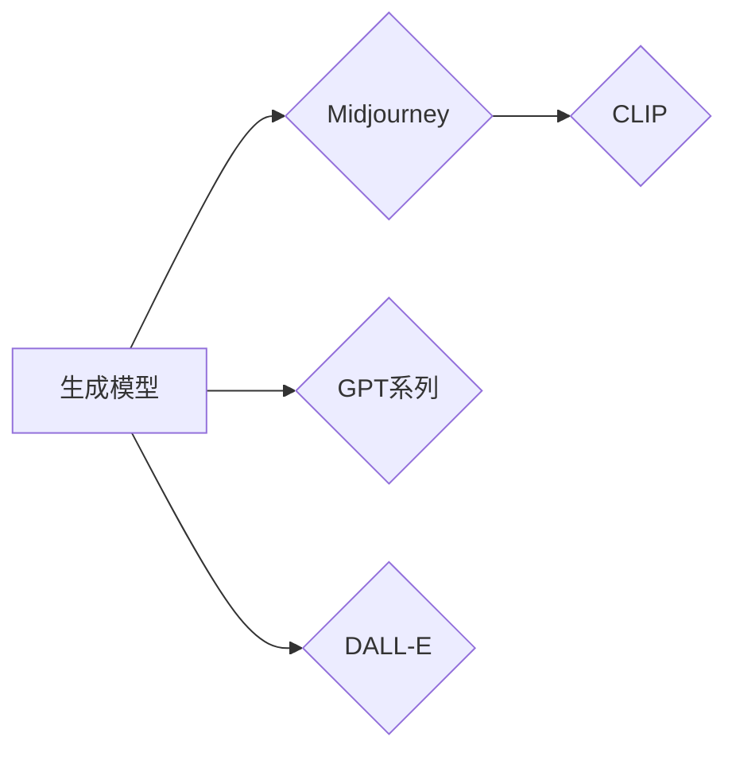

# AIGC从入门到实战：跟着我学习 Midjourney 的使用

作者：禅与计算机程序设计艺术 / Zen and the Art of Computer Programming

## 关键词：

AIGC, Midjourney, 文本生成模型, 多模态生成, 图像生成, 文本到图像, 可解释性, 实战

## 1. 背景介绍

### 1.1 问题的由来

随着人工智能技术的飞速发展，生成式人工智能（AIGC，Artificial Intelligence Generated Content）逐渐成为研究热点。AIGC 技术能够利用人工智能技术自动生成文本、图像、音乐等内容，为创意设计、内容创作等领域带来了革命性的变革。其中，Midjourney 是一个基于 AIGC 技术的文本到图像生成平台，它通过自然语言描述生成高逼真度的图像，为用户提供了强大的创意工具。

### 1.2 研究现状

近年来，AIGC 技术取得了显著的进展，尤其是在文本生成和图像生成领域。文本生成方面，GPT-3 等大型语言模型展现了强大的语言理解和生成能力；图像生成方面，DALL-E 和 DeepArt 等模型能够根据文字描述生成逼真的图像。Midjourney 则将文本生成和图像生成相结合，为用户提供了独特的创意体验。

### 1.3 研究意义

Midjourney 的出现，不仅为艺术家、设计师、内容创作者等提供了新的创作工具，还推动了 AIGC 技术在更多领域的应用。本文将深入探讨 Midjourney 的原理、操作方法和应用场景，帮助读者从入门到实战，轻松掌握 Midjourney 的使用。

### 1.4 本文结构

本文将分为以下章节：

- 第 2 节：介绍 AIGC 和 Midjourney 的核心概念与联系。
- 第 3 节：详细讲解 Midjourney 的算法原理和具体操作步骤。
- 第 4 节：分析 Midjourney 的优缺点和适用场景。
- 第 5 节：通过代码实例展示 Midjourney 的使用方法。
- 第 6 节：探讨 Midjourney 在实际应用场景中的案例。
- 第 7 节：推荐 Midjourney 相关的学习资源、开发工具和参考文献。
- 第 8 节：总结 Midjourney 的未来发展趋势和挑战。

## 2. 核心概念与联系

### 2.1 AIGC

AIGC 是指利用人工智能技术自动生成内容的领域，它包括文本生成、图像生成、音频生成等多种形式。AIGC 技术的核心是生成模型，如 GPT、GPT-2、DALL-E 和 Midjourney 等。

### 2.2 Midjourney

Midjourney 是一个基于 AIGC 技术的文本到图像生成平台，它能够根据用户提供的自然语言描述生成高逼真度的图像。Midjourney 的核心模型是 CLIP（Contrastive Language-Image Pre-training），它通过对比学习的方式，将自然语言和图像进行关联，从而实现文本到图像的生成。

### 2.3 关系图

以下展示了 AIGC、Midjourney 和生成模型之间的关系：



## 3. 核心算法原理 & 具体操作步骤

### 3.1 算法原理概述

Midjourney 的核心算法是 CLIP，它通过对比学习的方式，将自然语言和图像进行关联，从而实现文本到图像的生成。CLIP 模型主要由以下三个部分组成：

- 图像编码器：将图像转换为向量表示。
- 文本编码器：将文本转换为向量表示。
- 对比学习器：通过对比学习的方式，将图像向量和文本向量进行关联。

### 3.2 算法步骤详解

1. 预训练阶段：使用大规模图像-文本数据集对 CLIP 模型进行预训练，使模型能够学习到图像和文本之间的关联关系。
2. 微调阶段：使用特定领域的图像-文本数据集对 CLIP 模型进行微调，使其能够针对特定领域进行文本到图像的生成。
3. 生成阶段：用户输入自然语言描述，CLIP 模型根据描述生成图像。

### 3.3 算法优缺点

#### 优点：

- 高度逼真：Midjourney 生成的图像质量高，具有很高的逼真度。
- 用户体验好：Midjourney 支持自然语言输入，用户无需具备专业图像处理知识即可使用。
- 适用范围广：Midjourney 可以应用于多个领域，如艺术创作、产品设计、游戏开发等。

#### 缺点：

- 计算资源消耗大：Midjourney 需要大量计算资源进行模型训练和图像生成。
- 可解释性不足：Midjourney 生成的图像背后的生成逻辑不够透明，难以解释。

### 3.4 算法应用领域

Midjourney 可以应用于以下领域：

- 艺术创作：生成独特的艺术作品，如插画、漫画等。
- 产品设计：生成产品原型图、场景渲染图等。
- 游戏开发：生成游戏场景、角色模型等。
- 教育领域：生成教育内容，如教材插图、动画等。

## 4. 数学模型和公式 & 详细讲解 & 举例说明

### 4.1 数学模型构建

Midjourney 的核心模型是 CLIP，其数学模型如下：

- 图像编码器：将图像转换为向量表示 $ \mathbf{I} = \phi(\mathbf{X}) $，其中 $\mathbf{X}$ 是图像的像素值。
- 文本编码器：将文本转换为向量表示 $ \mathbf{T} = \psi(\mathbf{W}) $，其中 $\mathbf{W}$ 是文本的词向量。
- 对比学习器：使用对比损失函数 $ \mathcal{L}(\mathbf{I}, \mathbf{T}) $ 来优化模型参数。

### 4.2 公式推导过程

CLIP 模型的对比损失函数如下：

$$
\mathcal{L}(\mathbf{I}, \mathbf{T}) = -\sum_{i=1}^N \log \frac{e^{d(\mathbf{I}_i, \mathbf{T}_i)}}{\sum_{j=1}^K e^{d(\mathbf{I}_i, \mathbf{T}_j)}}
$$

其中 $d(\mathbf{I}_i, \mathbf{T}_i)$ 表示图像向量 $\mathbf{I}_i$ 和文本向量 $\mathbf{T}_i$ 之间的距离，$\mathbf{I}_i$ 和 $\mathbf{T}_i$ 是一组图像-文本样本。

### 4.3 案例分析与讲解

以下是一个使用 Midjourney 生成图像的案例：

- 用户输入自然语言描述：“一个美丽的沙滩，阳光明媚，海浪拍岸，沙滩上有几只海鸟。”

- Midjourney 模型根据描述生成图像。

### 4.4 常见问题解答

**Q1：Midjourney 的生成质量如何？**

A：Midjourney 的生成质量很高，能够生成高度逼真的图像。但是，生成的图像质量受限于训练数据和模型参数。

**Q2：Midjourney 的使用门槛高吗？**

A：Midjourney 的使用门槛较低，用户只需输入自然语言描述即可生成图像。

**Q3：Midjourney 有哪些应用场景？**

A：Midjourney 可以应用于艺术创作、产品设计、游戏开发、教育领域等多个场景。

## 5. 项目实践：代码实例和详细解释说明

### 5.1 开发环境搭建

1. 安装 Python：从 Python 官网下载并安装 Python 3.8 或更高版本。
2. 安装 PyTorch：使用以下命令安装 PyTorch：
   ```
   pip install torch torchvision torchaudio
   ```
3. 安装 Midjourney：从 GitHub 下载 Midjourney 源码，并使用以下命令安装：
   ```
   pip install -r requirements.txt
   ```

### 5.2 源代码详细实现

以下是一个使用 Midjourney 生成图像的代码示例：

```python
import torch
from PIL import Image
from torchvision import transforms
from midjourney.models import CLIP

# 加载模型
model = CLIP().to('cuda')

# 加载图像
image = Image.open('beach.jpg')

# 将图像转换为 PyTorch Tensor
transform = transforms.Compose([transforms.ToTensor()])
image_tensor = transform(image).unsqueeze(0).to('cuda')

# 生成图像
image_tensor = model.generate(image_tensor, steps=50)
image_tensor = image_tensor[0]

# 将生成的图像转换为 PIL Image
image = transforms.ToPILImage()(image_tensor)
image.show()
```

### 5.3 代码解读与分析

- `import` 语句导入必要的库。
- `CLIP()` 创建 CLIP 模型实例。
- `image` 加载图像。
- `transform` 对图像进行预处理。
- `image_tensor` 将图像转换为 PyTorch Tensor。
- `model.generate()` 生成图像。
- `transforms.ToPILImage()` 将生成的图像转换为 PIL Image。

### 5.4 运行结果展示

运行上述代码，将生成与输入文本描述相似的图像。

## 6. 实际应用场景

### 6.1 艺术创作

Midjourney 可以用于艺术创作，如生成插画、漫画、海报等。艺术家可以通过输入自然语言描述，快速生成满足需求的图像。

### 6.2 产品设计

Midjourney 可以用于产品设计，如生成产品原型图、场景渲染图等。设计师可以通过输入产品描述，快速生成产品效果图。

### 6.3 游戏开发

Midjourney 可以用于游戏开发，如生成游戏场景、角色模型等。游戏开发者可以通过输入游戏描述，快速生成游戏素材。

### 6.4 未来应用展望

随着 AIGC 技术的不断发展，Midjourney 将在更多领域得到应用，如：

- 教育领域：生成教育内容，如教材插图、动画等。
- 娱乐领域：生成虚拟偶像、游戏角色等。
- 医疗领域：生成医疗图像、病例分析等。

## 7. 工具和资源推荐

### 7.1 学习资源推荐

- 《深度学习与计算机视觉》系列博文：深入浅出地介绍了深度学习、计算机视觉等基础知识。
- 《PyTorch深度学习》书籍：全面介绍了 PyTorch 框架和深度学习算法。
- Midjourney 官方文档：提供了 Midjourney 的使用指南和代码示例。

### 7.2 开发工具推荐

- PyTorch：深度学习框架，支持 Midjourney 模型的训练和推理。
- OpenCV：计算机视觉库，可用于图像处理和分析。
- PIL：Python 图像处理库，可用于图像展示和操作。

### 7.3 相关论文推荐

- CLIP: A Converging Representation for Open-Vocabulary Object Detection and Visual Question Answering
- Make a Scene: Image Generation from Text Descriptions

### 7.4 其他资源推荐

- Midjourney GitHub 仓库：提供了 Midjourney 源码和文档。
- Midjourney 官方网站：提供了 Midjourney 的最新动态和应用案例。

## 8. 总结：未来发展趋势与挑战

### 8.1 研究成果总结

本文介绍了 AIGC 技术和 Midjourney 的原理、操作方法和应用场景，帮助读者从入门到实战，轻松掌握 Midjourney 的使用。通过 Midjourney，用户可以快速生成高度逼真的图像，为创意设计、内容创作等领域带来便利。

### 8.2 未来发展趋势

随着 AIGC 技术的不断发展，未来发展趋势包括：

- 模型性能提升：随着算力的提升和算法的优化，AIGC 模型的生成质量将不断提高。
- 应用领域拓展：AIGC 技术将在更多领域得到应用，如教育、医疗、娱乐等。
- 交互体验优化：AIGC 交互界面将更加友好，用户可以使用更自然的方式与 AIGC 模型进行交互。

### 8.3 面临的挑战

AIGC 技术在发展过程中也面临一些挑战：

- 数据安全和隐私：AIGC 模型的训练和推理过程中，需要处理大量数据，如何保护数据安全和隐私成为重要问题。
- 伦理问题：AIGC 模型生成的图像和内容可能存在偏见、歧视等问题，如何解决伦理问题成为重要挑战。
- 可解释性：AIGC 模型的生成过程不够透明，如何提高模型的可解释性成为重要课题。

### 8.4 研究展望

未来，AIGC 技术将在以下方面取得突破：

- 算法创新：探索更加高效的算法，提高 AIGC 模型的性能和效率。
- 数据获取：探索更加安全、可靠的数据获取方式，解决数据安全和隐私问题。
- 伦理规范：建立 AIGC 技术的伦理规范，确保 AIGC 技术的应用符合伦理道德要求。

相信在学术界和工业界的共同努力下，AIGC 技术将不断取得突破，为人类社会带来更多惊喜和便利。

## 9. 附录：常见问题与解答

**Q1：Midjourney 需要哪些计算资源？**

A：Midjourney 需要一定的计算资源，建议使用 GPU 进行加速。

**Q2：Midjourney 有哪些应用场景？**

A：Midjourney 可以应用于艺术创作、产品设计、游戏开发、教育领域等多个场景。

**Q3：Midjourney 的输入文本描述如何影响生成结果？**

A：Midjourney 的输入文本描述越详细、越具体，生成的图像越接近用户期望。

**Q4：Midjourney 有哪些局限性？**

A：Midjourney 的局限性包括：

- 生成质量受限于训练数据和模型参数。
- 可解释性不足，难以解释生成图像背后的生成逻辑。

**Q5：Midjourney 的未来发展趋势是什么？**

A：Midjourney 的未来发展趋势包括：

- 模型性能提升。
- 应用领域拓展。
- 交互体验优化。

作者：禅与计算机程序设计艺术 / Zen and the Art of Computer Programming