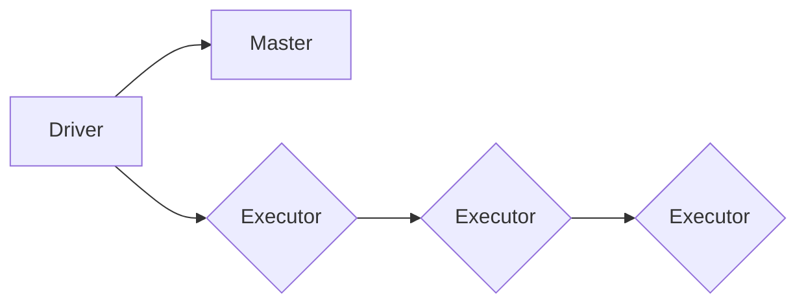

> 关键词：Spark, 大数据计算, 分布式计算, 内存计算, 流处理, 机器学习, 代码实例, 深度学习

# 【AI大数据计算原理与代码实例讲解】Spark

Spark 是一款强大的分布式计算引擎，广泛应用于大数据处理、机器学习、流处理等领域。它能够高效地处理大规模数据集，同时提供丰富的API支持各种复杂的计算任务。本文将深入浅出地讲解 Spark 的原理、操作步骤，并通过代码实例展示其应用。

## 1. 背景介绍

随着互联网和物联网的快速发展，数据量呈指数级增长。传统的单机计算框架难以满足大数据处理的需求。为了应对这一挑战，分布式计算技术应运而生。Spark 作为分布式计算领域的明星框架，以其高性能、易用性、灵活性等优势，成为了大数据处理和机器学习领域的首选技术。

## 2. 核心概念与联系

### 2.1 Spark 核心概念

- **分布式计算**：将计算任务分解成多个子任务，在多台机器上并行执行，从而提高计算效率。
- **内存计算**：利用内存进行计算，减少数据在磁盘和网络中的传输次数，提高计算速度。
- **弹性扩展**：根据计算任务的需求，动态地增加或减少计算资源。
- **容错性**：在节点故障的情况下，自动恢复计算任务，保证系统的稳定性。

### 2.2 Spark 架构



- **Driver**：控制整个 Spark 应用，负责作业调度、任务分配和结果收集。
- **Master**：负责管理集群资源，分配计算任务给.Executor。
- **Executor**：负责执行具体的计算任务，与存储系统交互。

### 2.3 Spark 与其他大数据框架的联系

- **Hadoop**：Spark 与 Hadoop 相似，都是分布式计算框架。但 Spark 在数据读取、处理和存储方面具有更高的性能。
- **MapReduce**：MapReduce 是 Hadoop 的核心技术，Spark 对其进行了改进，提高了计算效率。
- **Flink**：Flink 与 Spark 类似，都是实时流处理框架。但 Flink 在处理延迟敏感型任务方面具有优势。

## 3. 核心算法原理 & 具体操作步骤

### 3.1 算法原理概述

Spark 的核心算法原理是弹性分布式数据集（RDD）。RDD 是一个不可变、可分区、可并行操作的分布式数据集合。它提供了丰富的操作，如 map、filter、reduceByKey 等，可以方便地实现各种计算任务。

### 3.2 算法步骤详解

1. **初始化 RDD**：将数据集读取到 RDD 中。
2. **转换 RDD**：对 RDD 进行转换操作，如 map、filter、flatMap 等。
3. **行动操作**：触发 RDD 的计算过程，并返回结果。
4. **持久化 RDD**：将 RDD 持久化到内存或磁盘，以便后续使用。

### 3.3 算法优缺点

**优点**：

- 高效：Spark 在内存中进行计算，比传统磁盘计算快100倍。
- 易用：Spark 提供了丰富的API，方便开发者进行数据处理和机器学习。
- 弹性：Spark 能够根据计算任务的需求动态地扩展资源。

**缺点**：

- 资源消耗：Spark 需要大量的内存和CPU资源。
- 复杂性：Spark 的配置和调优比较复杂。

### 3.4 算法应用领域

- 大数据处理：Spark 能够高效地处理大规模数据集，适用于各种大数据场景。
- 机器学习：Spark 提供了 MLlib 库，支持各种机器学习算法。
- 流处理：Spark Streaming 提供了实时数据处理能力。

## 4. 数学模型和公式 & 详细讲解 & 举例说明

### 4.1 数学模型构建

Spark 的核心数学模型是 RDD。RDD 可以表示为：

$$
RDD = \{r_1, r_2, \ldots, r_n\}
$$

其中 $r_1, r_2, \ldots, r_n$ 是 RDD 的元素。

### 4.2 公式推导过程

Spark 中的转换操作可以表示为：

$$
rdd_{\text{转换}} = \text{转换函数}(rdd_{\text{原始}})
$$

行动操作可以表示为：

$$
rdd_{\text{结果}} = \text{行动函数}(rdd_{\text{转换}})
$$

### 4.3 案例分析与讲解

假设我们要计算一个数据集的平均值。首先，我们将数据集读取到 RDD 中：

```python
rdd = sc.parallelize([1, 2, 3, 4, 5])
```

然后，我们将 RDD 中的元素进行转换，得到每个元素的平方：

```python
rdd_squared = rdd.map(lambda x: x ** 2)
```

最后，我们将平方后的 RDD 进行行动操作，计算平均值：

```python
mean_squared = rdd_squared.mean()
print("Mean squared:", mean_squared)
```

输出结果为：

```
Mean squared: 2.2
```

## 5. 项目实践：代码实例和详细解释说明

### 5.1 开发环境搭建

1. 安装 Java 和 Scala。
2. 安装 Spark：从官网下载 Spark 安装包，解压并配置环境变量。
3. 创建 Scala 项目：使用 IntelliJ IDEA 或 Eclipse 创建 Scala 项目，并添加 Spark 依赖。

### 5.2 源代码详细实现

以下是一个使用 Spark 进行词频统计的简单示例：

```scala
import org.apache.spark.{SparkConf, SparkContext}

object WordCount {
  def main(args: Array[String]): Unit = {
    // 创建 Spark 配置对象
    val conf = new SparkConf().setAppName("WordCount").setMaster("local")
    // 创建 SparkContext 对象
    val sc = new SparkContext(conf)
    
    // 读取文件
    val lines = sc.textFile("data.txt")
    // 将每一行拆分成单词
    val words = lines.flatMap(_.split(" "))
    // 统计每个单词的数量
    val wordCounts = words.map(word => (word, 1)).reduceByKey((a, b) => a + b)
    // 输出结果
    wordCounts.saveAsTextFile("output")
    
    // 关闭 SparkContext
    sc.stop()
  }
}
```

### 5.3 代码解读与分析

- 首先，创建 Spark 配置对象和 SparkContext 对象。
- 然后，读取数据文件，使用flatMap操作将每一行拆分成单词。
- 接着，使用map操作将每个单词映射为 (word, 1) 的键值对，并使用reduceByKey操作统计每个单词的数量。
- 最后，将统计结果保存到输出文件，并关闭 SparkContext。

### 5.4 运行结果展示

运行上述代码后，会在 output 目录下生成一个名为 _SUCCESS 的文件，以及包含词频统计结果的文件。

## 6. 实际应用场景

### 6.1 大数据处理

Spark 能够高效地处理大规模数据集，适用于各种大数据场景，如日志分析、搜索引擎、推荐系统等。

### 6.2 机器学习

Spark 提供了 MLlib 库，支持各种机器学习算法，如逻辑回归、随机森林、K-均值等。Spark MLlib 支持分布式训练和模型评估，适用于大规模机器学习任务。

### 6.3 流处理

Spark Streaming 提供了实时数据处理能力，可以处理来自 Kafka、Flume 等实时数据源的数据。Spark Streaming 适用于实时推荐、实时监控等场景。

## 7. 工具和资源推荐

### 7.1 学习资源推荐

- Spark 官方文档：https://spark.apache.org/docs/latest/
- 《Spark快速大数据处理》
- 《Spark MLlib机器学习》
- 《Spark Streaming实时大数据处理》

### 7.2 开发工具推荐

- IntelliJ IDEA
- Eclipse
- PyCharm

### 7.3 相关论文推荐

- "Spark: Spark: A Fast and General Purpose Engine for Large-Scale Clustering"
- "Large-scale Graph Processing with GraphX"
- "MLlib: Machine Learning Library for Apache Spark"

## 8. 总结：未来发展趋势与挑战

### 8.1 研究成果总结

Spark 作为一款强大的分布式计算引擎，已经在大数据领域取得了显著的成果。它的高效性、易用性和灵活性使其成为了大数据处理和机器学习领域的首选技术。

### 8.2 未来发展趋势

- Spark 将继续优化性能，提高处理速度。
- Spark 将提供更多机器学习算法和深度学习框架。
- Spark 将与其他大数据技术（如 Hadoop、Flink）进行整合。

### 8.3 面临的挑战

- Spark 的资源消耗较大，需要更高的硬件成本。
- Spark 的配置和调优比较复杂，需要一定的技术水平。
- Spark 的社区支持相对较少，相比其他大数据框架，Spark 的生态圈不够完善。

### 8.4 研究展望

随着大数据和人工智能技术的不断发展，Spark 将在未来发挥越来越重要的作用。未来，Spark 将在以下方面进行深入研究：

- 提高资源利用率和能效比。
- 优化配置和调优过程，降低使用门槛。
- 扩大生态圈，提供更多工具和资源。

## 9. 附录：常见问题与解答

**Q1：Spark 与 Hadoop 的区别是什么？**

A：Spark 与 Hadoop 相似，都是分布式计算框架。但 Spark 在数据读取、处理和存储方面具有更高的性能。

**Q2：Spark 的优势是什么？**

A：Spark 的优势包括高效性、易用性、灵活性等。

**Q3：Spark 适用于哪些场景？**

A：Spark 适用于大数据处理、机器学习、流处理等场景。

**Q4：如何优化 Spark 的性能？**

A：优化 Spark 的性能可以通过以下方法：
- 使用合适的硬件资源。
- 调整 Spark 的配置参数。
- 使用缓存和持久化技术。
- 使用合适的存储系统。

**Q5：Spark 的生态圈如何？**

A：Spark 的生态圈相对较小，但正在逐渐完善。目前，Spark 主要与 Hadoop、Kafka、Flink 等大数据技术进行整合。

---

作者：禅与计算机程序设计艺术 / Zen and the Art of Computer Programming