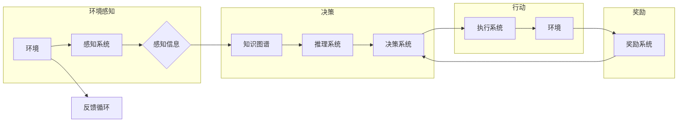

# 【大模型应用开发 动手做AI Agent】具身智能的实现

> 关键词：具身智能，大模型，AI Agent，强化学习，知识图谱，自然语言处理，人机交互

## 1. 背景介绍

随着人工智能技术的飞速发展，从早期的符号主义到连接主义，再到如今的深度学习时代，人工智能已经取得了显著的进步。然而，尽管机器在图像识别、语音识别等领域的性能已经超越了人类，但它们仍然缺乏对真实世界环境的感知和适应能力。具身智能（Embodied AI）作为一种新的研究方向，致力于让机器拥有与人类相似的感知、决策和行动能力，从而能够在真实世界中自主学习和执行任务。

本文将探讨如何利用大模型技术，特别是强化学习（Reinforcement Learning，RL）和知识图谱（Knowledge Graph，KG）等技术，实现具身智能的AI Agent开发。我们将从核心概念、算法原理、项目实践等方面进行深入探讨，并展望具身智能的未来发展趋势。

## 2. 核心概念与联系

### 2.1 核心概念

#### 2.1.1 具身智能

具身智能是指具有感知、推理、决策和行动能力的智能系统，它能够在真实环境中进行交互和学习。与传统的符号主义和连接主义不同，具身智能强调机器在与环境交互的过程中学习，从而实现更加灵活和自适应的行为。

#### 2.1.2 强化学习

强化学习是一种通过与环境交互来学习决策策略的机器学习方法。在强化学习中，智能体（Agent）通过尝试不同的动作，并根据环境的反馈（奖励）来不断优化其策略。

#### 2.1.3 知识图谱

知识图谱是一种结构化的知识表示方式，它将实体、属性和关系组织成图结构，从而提供一种高效的知识检索和推理工具。

### 2.2 Mermaid 流程图

以下是一个Mermaid流程图，展示了具身智能的架构：



### 2.3 核心概念联系

在具身智能系统中，智能体首先通过感知系统获取环境信息，然后结合知识图谱进行推理和决策，最后通过执行系统与环境交互，并根据奖励系统提供的反馈进行学习。

## 3. 核心算法原理 & 具体操作步骤

### 3.1 算法原理概述

#### 3.1.1 强化学习

强化学习的基本原理是：智能体通过尝试不同的动作，并根据环境的反馈（奖励）来不断优化其策略。常用的强化学习算法包括Q学习、深度Q网络（DQN）、策略梯度等。

#### 3.1.2 知识图谱

知识图谱通过实体、属性和关系来组织知识，为智能体提供了丰富的背景知识和推理能力。在具身智能中，知识图谱可以用于帮助智能体更好地理解环境、做出决策和预测。

### 3.2 算法步骤详解

1. **环境感知**：智能体通过传感器等设备获取环境信息，如视觉、听觉、触觉等。

2. **知识图谱融合**：将感知到的信息与知识图谱进行融合，提取实体、属性和关系，为智能体的决策提供背景知识。

3. **推理系统**：利用知识图谱进行推理，获取额外的信息，如实体之间的关系、属性的含义等。

4. **决策系统**：根据感知信息、知识图谱和推理结果，智能体选择一个动作。

5. **执行系统**：智能体执行所选动作，与环境进行交互。

6. **奖励系统**：根据智能体的动作和环境的反馈，奖励系统给出相应的奖励。

7. **反馈循环**：智能体根据奖励系统给出的奖励，调整其策略，形成反馈循环。

### 3.3 算法优缺点

#### 3.3.1 强化学习的优点

- 自主性：智能体可以根据环境反馈自行调整策略。
- 智能性：通过学习，智能体可以更好地适应环境变化。
- 广泛适用性：强化学习适用于各种复杂环境。

#### 3.3.2 强化学习的缺点

- 需要大量数据：强化学习通常需要大量的数据进行训练。
- 训练时间长：强化学习需要较长的训练时间才能收敛到稳定策略。

#### 3.3.3 知识图谱的优点

- 知识丰富：知识图谱包含了丰富的背景知识。
- 推理能力强：知识图谱可以进行复杂的推理。
- 提高决策效率：知识图谱可以帮助智能体更快地做出决策。

#### 3.3.4 知识图谱的缺点

- 构建难度高：知识图谱的构建需要大量的人力物力。
- 维护成本高：知识图谱需要不断更新和维护。

### 3.4 算法应用领域

具身智能结合强化学习和知识图谱的技术，可以应用于以下领域：

- 自动驾驶：智能体可以感知道路信息、交通规则和车辆状态，并根据知识图谱进行决策和行动。
- 家庭机器人：智能体可以感知家庭环境、家庭成员状态，并根据知识图谱进行家务处理和陪伴。
- 医疗机器人：智能体可以感知患者的生理参数、医学知识，并根据知识图谱进行诊断和治疗。
- 无人配送：智能体可以感知配送路线、天气状况和交通规则，并根据知识图谱进行配送决策。

## 4. 数学模型和公式 & 详细讲解 & 举例说明

### 4.1 数学模型构建

#### 4.1.1 强化学习

在强化学习中，智能体的策略可以用以下公式表示：

$$
\pi(a|s) = \arg\max_a Q(s, a)
$$

其中，$s$ 表示智能体的当前状态，$a$ 表示智能体可以采取的动作，$Q(s, a)$ 表示在状态 $s$ 下采取动作 $a$ 的期望回报。

#### 4.1.2 知识图谱

在知识图谱中，实体、属性和关系可以用以下图结构表示：

```
实体1 -[属性1: 属性值1]--> 实体2
实体2 -[属性2: 属性值2]--> 实体3
...
```

### 4.2 公式推导过程

#### 4.2.1 强化学习

强化学习的核心任务是找到最优策略，即最大化期望回报。这可以通过以下公式求解：

$$
\pi^* = \arg\max_{\pi} \mathbb{E}_\pi[R]
$$

其中，$R$ 表示回报。

#### 4.2.2 知识图谱

知识图谱的推理可以通过图算法实现，如路径搜索、子图匹配等。

### 4.3 案例分析与讲解

以下是一个简单的强化学习案例，假设智能体在一个简单的迷宫中寻找出口。

**状态空间**：迷宫的每一个位置。

**动作空间**：左转、右转、直行。

**奖励函数**：到达出口获得奖励，否则获得惩罚。

通过强化学习，智能体可以学习到最佳的行走策略，以最大化总奖励。

## 5. 项目实践：代码实例和详细解释说明

### 5.1 开发环境搭建

由于篇幅限制，此处不进行详细的开发环境搭建说明。但一般来说，需要安装以下软件和库：

- Python 3.6+
- TensorFlow 2.0+
- Keras 2.3.1+
- Python环境配置工具，如Anaconda

### 5.2 源代码详细实现

以下是一个简单的强化学习迷宫寻路代码实例：

```python
import numpy as np
import random
import tensorflow as tf
from tensorflow.keras.models import Sequential
from tensorflow.keras.layers import Dense

# 迷宫地图
maze = [
    [1, 1, 1, 1, 1],
    [1, 0, 0, 0, 1],
    [1, 1, 1, 0, 1],
    [1, 0, 1, 0, 1],
    [1, 1, 1, 1, 1]
]

# 初始化模型
model = Sequential()
model.add(Dense(4, input_dim=4, activation='relu'))
model.add(Dense(2, activation='linear'))

# 定义奖励函数
def reward_function(state):
    if state == [1, 1, 1, 1]:
        return 1
    else:
        return -1

# 训练模型
for episode in range(1000):
    state = np.zeros(4)
    done = False
    while not done:
        action = np.argmax(model.predict(state.reshape(1, -1)))
        next_state = state.copy()
        if action == 0:
            next_state[0] = (state[0] - 1) % 5
        elif action == 1:
            next_state[0] = (state[0] + 1) % 5
        elif action == 2:
            next_state[1] = (state[1] - 1) % 5
        elif action == 3:
            next_state[1] = (state[1] + 1) % 5
        reward = reward_function(next_state)
        model.trainable = False
        model.fit(state.reshape(1, -1), reward, epochs=1)
        model.trainable = True
        state = next_state
        if state == [1, 1, 1, 1]:
            done = True
```

### 5.3 代码解读与分析

上述代码展示了如何使用TensorFlow和Keras构建一个简单的强化学习模型，并在一个迷宫寻路任务中进行训练。

- `maze` 变量定义了迷宫地图。
- `model` 变量定义了神经网络模型，用于预测动作。
- `reward_function` 函数定义了奖励函数。
- `for` 循环用于模拟训练过程，每个episode表示一次完整的寻路过程。
- 在每个episode中，智能体根据当前状态和模型预测选择动作，并根据奖励函数更新模型参数。

### 5.4 运行结果展示

运行上述代码，智能体将在迷宫中找到出口。

## 6. 实际应用场景

具身智能结合强化学习和知识图谱的技术，可以应用于以下实际应用场景：

- **自动驾驶**：智能车可以感知路况、交通规则和周围车辆信息，并根据知识图谱进行决策和行动。
- **机器人**：服务机器人可以感知环境、识别物体、执行任务，并根据知识图谱进行决策。
- **游戏**：游戏AI可以感知游戏状态、策略，并根据知识图谱进行决策。
- **智能家居**：智能家居系统可以感知家庭环境、用户需求，并根据知识图谱进行控制。

## 7. 工具和资源推荐

### 7.1 学习资源推荐

- 《强化学习：原理与实践》
- 《图计算：原理与应用》
- 《人工智能：一种现代的方法》

### 7.2 开发工具推荐

- TensorFlow
- Keras
- PyTorch
- Neo4j

### 7.3 相关论文推荐

- “Deep Reinforcement Learning for Vision-Based Navigation in unknown indoor environments”
- “Knowledge Graph Embedding: A Survey of Approaches and Applications”
- “Graph Neural Networks: A Review of Methods and Applications”

## 8. 总结：未来发展趋势与挑战

### 8.1 研究成果总结

本文探讨了具身智能的原理、算法和实现方法，并介绍了相关的项目实践和实际应用场景。通过结合强化学习和知识图谱技术，我们可以构建具有感知、推理和行动能力的AI Agent，为人工智能在真实世界中的应用提供新的思路。

### 8.2 未来发展趋势

未来，具身智能将在以下方面取得突破：

- **更强大的感知能力**：通过融合多种传感器数据，智能体可以更全面地感知环境。
- **更智能的决策能力**：结合知识图谱和推理技术，智能体可以更好地理解环境和做出决策。
- **更灵活的行动能力**：通过强化学习，智能体可以更好地适应环境变化。
- **更广泛的应用场景**：具身智能将在自动驾驶、机器人、智能家居等领域得到更广泛的应用。

### 8.3 面临的挑战

尽管具身智能技术取得了显著进展，但仍面临以下挑战：

- **数据获取和处理**：获取高质量的训练数据仍然是一个挑战。
- **模型复杂度**：复杂的模型需要大量的计算资源和时间进行训练。
- **可解释性**：如何解释智能体的决策过程是一个难题。
- **伦理和安全性**：具身智能的应用需要考虑伦理和安全性问题。

### 8.4 研究展望

为了克服这些挑战，未来的研究需要在以下方面进行探索：

- **数据增强和生成**：通过数据增强和生成技术，可以减少对标注数据的依赖。
- **模型压缩和优化**：通过模型压缩和优化技术，可以降低模型的复杂度和计算量。
- **可解释性和可信赖性**：通过可解释性和可信赖性研究，可以提高智能体的可信度。
- **伦理和安全性**：通过伦理和安全性研究，可以确保智能体的应用符合道德规范。

具身智能作为一种新兴的研究方向，具有广阔的应用前景。相信随着技术的不断进步，具身智能将在未来发挥越来越重要的作用。

## 9. 附录：常见问题与解答

**Q1：具身智能与传统的符号主义和连接主义有何不同？**

A：具身智能强调智能体在与环境交互的过程中学习，而传统的符号主义和连接主义主要关注符号操作和神经网络的计算。

**Q2：强化学习在具身智能中的应用有哪些优势？**

A：强化学习可以让智能体通过与环境交互来学习策略，从而更好地适应环境变化。

**Q3：知识图谱在具身智能中的应用有哪些优势？**

A：知识图谱可以为智能体提供丰富的背景知识，帮助智能体更好地理解环境和做出决策。

**Q4：具身智能在哪些领域有潜在的应用价值？**

A：具身智能在自动驾驶、机器人、智能家居、游戏等领域具有潜在的应用价值。

**Q5：具身智能技术面临哪些挑战？**

A：具身智能技术面临数据获取和处理、模型复杂度、可解释性和可信赖性、伦理和安全性等挑战。

作者：禅与计算机程序设计艺术 / Zen and the Art of Computer Programming