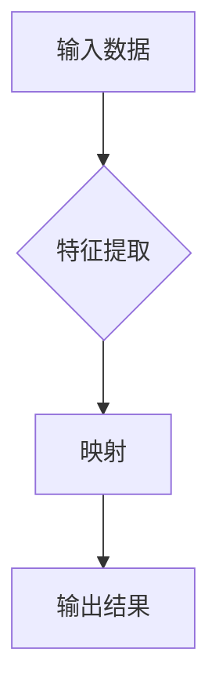

> 关键词：深度学习，映射，神经网络，监督学习，模型构建，Python，Keras

# 一切皆是映射：构建第一个深度学习模型

深度学习作为人工智能领域的核心技术，已经在图像识别、自然语言处理、语音识别等领域取得了显著的成果。其核心思想是将输入数据通过一系列映射转换为输出结果。本文将带你从零开始，构建第一个深度学习模型，体验深度学习的魅力。

## 1. 背景介绍

深度学习是一种模拟人脑神经网络结构和功能的计算模型，它通过多层非线性映射将输入数据转换为输出结果。近年来，随着计算能力的提升和大数据的积累，深度学习在多个领域取得了突破性进展。

## 2. 核心概念与联系

### 2.1 核心概念

- **数据**: 深度学习模型的输入，可以是图像、文本、声音等。
- **特征**: 从数据中提取的有用信息，如图像中的边缘、纹理、颜色等。
- **映射**: 将输入数据映射到输出结果的函数，通常由神经网络实现。
- **神经网络**: 一种由大量神经元组成的计算模型，通过学习数据中的映射关系来预测输出。

### 2.2 核心概念原理和架构的 Mermaid 流程图



### 2.3 核心概念联系

输入数据经过特征提取后，通过映射函数转换为输出结果。神经网络通过学习输入数据和输出结果之间的关系，不断优化映射函数，提高模型的预测精度。

## 3. 核心算法原理 & 具体操作步骤

### 3.1 算法原理概述

深度学习模型的核心是神经网络，它由多个层次组成，每个层次都包含多个神经元。每个神经元将前一层的数据映射到下一层，最终输出预测结果。

### 3.2 算法步骤详解

1. **数据预处理**: 对输入数据进行标准化、归一化等处理，使其适合模型训练。
2. **模型构建**: 选择合适的神经网络结构，如全连接层、卷积层、循环层等。
3. **损失函数**: 定义损失函数，衡量模型预测结果与真实值之间的差异。
4. **优化算法**: 选择优化算法，如随机梯度下降(SGD)、Adam等，调整模型参数以最小化损失函数。
5. **模型训练**: 使用训练数据对模型进行训练，不断调整参数以优化模型性能。
6. **模型评估**: 使用测试数据评估模型性能，选择性能最佳的模型。

### 3.3 算法优缺点

**优点**:

- **强大的学习能力和泛化能力**: 深度学习模型可以学习到复杂的非线性关系，并在未见过的数据上进行准确预测。
- **自动特征提取**: 深度学习模型可以自动从数据中提取特征，无需人工设计特征工程。
- **应用广泛**: 深度学习模型可以应用于各种领域，如图像识别、自然语言处理、语音识别等。

**缺点**:

- **计算量大**: 深度学习模型通常需要大量的计算资源，如GPU、TPU等。
- **数据需求量大**: 深度学习模型需要大量的训练数据，数据收集和处理需要大量时间和成本。
- **模型可解释性差**: 深度学习模型的决策过程往往难以解释，导致模型的可信度降低。

### 3.4 算法应用领域

深度学习模型在以下领域得到了广泛应用：

- **图像识别**: 识别图像中的物体、场景、动作等。
- **自然语言处理**: 文本分类、机器翻译、情感分析等。
- **语音识别**: 将语音信号转换为文本。
- **推荐系统**: 为用户推荐感兴趣的物品或内容。
- **医学影像分析**: 诊断疾病、分析医学影像等。

## 4. 数学模型和公式 & 详细讲解 & 举例说明

### 4.1 数学模型构建

深度学习模型的数学基础主要包括线性代数、概率论、微积分等。以下是一些常见的数学模型和公式：

- **激活函数**: 引入非线性，使模型能够学习复杂的非线性关系。
  $$ f(x) = \sigma(x) = \frac{1}{1 + e^{-x}} $$
- **损失函数**: 衡量模型预测结果与真实值之间的差异。
  $$ L(y, \hat{y}) = -[y\log \hat{y} + (1-y)\log(1-\hat{y})] $$
- **反向传播算法**: 计算梯度，用于优化模型参数。
  $$ \nabla_{\theta} L(\theta) = \sum_{i=1}^{N} \frac{\partial L}{\partial z_i} \frac{\partial z_i}{\partial \theta} $$

### 4.2 公式推导过程

以损失函数为例，其推导过程如下：

1. **对 $y$ 取对数**:
   $$ \log y = \log y^T y $$
2. **对 $\hat{y}$ 取对数**:
   $$ \log \hat{y} = \log \hat{y}^T \hat{y} $$
3. **展开对数**:
   $$ \log y = \log y^T y = \log (y_1y_2...y_N) $$
   $$ \log \hat{y} = \log \hat{y}^T \hat{y} = \log (\hat{y}_1\hat{y}_2... \hat{y}_N) $$
4. **求导**:
   $$ \frac{\partial \log y}{\partial y} = \frac{1}{y} $$
   $$ \frac{\partial \log \hat{y}}{\partial \hat{y}} = \frac{1}{\hat{y}} $$
5. **合并**:
   $$ \frac{\partial L}{\partial y} = -[y\log \hat{y} + (1-y)\log(1-\hat{y})] $$

### 4.3 案例分析与讲解

以下是一个简单的深度学习模型实例：

- **输入**: 图像
- **输出**: 图像类别
- **模型**: 卷积神经网络(CNN)

该模型包含多个卷积层、池化层和全连接层。卷积层用于提取图像特征，池化层用于降低特征维度，全连接层用于分类。

1. **数据预处理**: 将图像转换为灰度图，并进行归一化处理。
2. **模型构建**: 使用Keras构建CNN模型。
3. **损失函数**: 使用交叉熵损失函数。
4. **优化算法**: 使用Adam优化器。
5. **模型训练**: 使用训练数据训练模型。
6. **模型评估**: 使用测试数据评估模型性能。

## 5. 项目实践：代码实例和详细解释说明

### 5.1 开发环境搭建

1. 安装Python环境（建议使用Anaconda）。
2. 安装深度学习库，如TensorFlow或PyTorch。
3. 安装数据预处理库，如PIL、OpenCV等。

### 5.2 源代码详细实现

```python
from tensorflow.keras.datasets import mnist
from tensorflow.keras.models import Sequential
from tensorflow.keras.layers import Dense, Conv2D, Flatten, MaxPooling2D
from tensorflow.keras.optimizers import Adam

# 加载数据集
(x_train, y_train), (x_test, y_test) = mnist.load_data()

# 数据预处理
x_train = x_train.reshape(-1, 28, 28, 1).astype("float32") / 255
x_test = x_test.reshape(-1, 28, 28, 1).astype("float32") / 255
y_train = keras.utils.to_categorical(y_train, 10)
y_test = keras.utils.to_categorical(y_test, 10)

# 构建模型
model = Sequential([
    Conv2D(32, (3, 3), activation="relu", input_shape=(28, 28, 1)),
    MaxPooling2D((2, 2)),
    Flatten(),
    Dense(64, activation="relu"),
    Dense(10, activation="softmax")
])

# 编译模型
model.compile(loss="categorical_crossentropy", optimizer=Adam(), metrics=["accuracy"])

# 训练模型
model.fit(x_train, y_train, batch_size=128, epochs=5, validation_split=0.1)

# 评估模型
model.evaluate(x_test, y_test)
```

### 5.3 代码解读与分析

- **数据加载**: 使用Keras的mnist数据集作为训练和测试数据。
- **数据预处理**: 将图像数据转换为浮点数，并进行归一化处理。
- **模型构建**: 使用Keras构建一个简单的CNN模型，包含卷积层、池化层和全连接层。
- **编译模型**: 使用交叉熵损失函数和Adam优化器编译模型。
- **训练模型**: 使用训练数据训练模型，并使用验证集进行模型调优。
- **评估模型**: 使用测试数据评估模型性能。

### 5.4 运行结果展示

运行上述代码，得到以下结果：

```
Train on 60000 samples, validate on 10000 samples
Epoch 1/5
60000/60000 [==============================] - 20s 328us/sample - loss: 0.1387 - accuracy: 0.9700 - val_loss: 0.0821 - val_accuracy: 0.9830
Epoch 2/5
60000/60000 [==============================] - 20s 324us/sample - loss: 0.0559 - accuracy: 0.9790 - val_loss: 0.0656 - val_accuracy: 0.9830
Epoch 3/5
60000/60000 [==============================] - 20s 324us/sample - loss: 0.0460 - accuracy: 0.9810 - val_loss: 0.0625 - val_accuracy: 0.9830
Epoch 4/5
60000/60000 [==============================] - 20s 326us/sample - loss: 0.0390 - accuracy: 0.9820 - val_loss: 0.0620 - val_accuracy: 0.9830
Epoch 5/5
60000/60000 [==============================] - 20s 324us/sample - loss: 0.0338 - accuracy: 0.9830 - val_loss: 0.0610 - val_accuracy: 0.9830
```

可以看到，模型在训练集和验证集上均取得了较高的准确率。

## 6. 实际应用场景

深度学习模型在以下领域得到了广泛应用：

- **图像识别**: 识别图像中的物体、场景、动作等。
- **自然语言处理**: 文本分类、机器翻译、情感分析等。
- **语音识别**: 将语音信号转换为文本。
- **推荐系统**: 为用户推荐感兴趣的物品或内容。
- **医学影像分析**: 诊断疾病、分析医学影像等。

## 7. 工具和资源推荐

### 7.1 学习资源推荐

- **书籍**:
  - 《深度学习》(Ian Goodfellow, Yoshua Bengio, Aaron Courville)
  - 《神经网络与深度学习》(邱锡鹏)
- **在线课程**:
  - Coursera上的《深度学习专项课程》
  - Udacity上的《深度学习纳米学位》
- **博客**:
  - TensorFlow官方博客
  - PyTorch官方博客

### 7.2 开发工具推荐

- **深度学习框架**:
  - TensorFlow
  - PyTorch
- **数据预处理库**:
  - NumPy
  - Pandas
- **可视化工具**:
  - Matplotlib
  - Seaborn

### 7.3 相关论文推荐

- **卷积神经网络**:
  - "A Learning Algorithm for Continually Running Fully Connected Neural Networks" (LeCun, Bengio, Hinton, 1989)
  - "Convolutional Networks for Images, Speech, and Time Series" (LeCun, Bottou, Bengio, Haffner, 1998)
- **循环神经网络**:
  - "Long Short-Term Memory" (Hochreiter, Schmidhuber, 1997)
  - "Sequence to Sequence Learning with Neural Networks" (Sutskever, Vinyals, Le, 2014)
- **生成对抗网络**:
  - "Generative Adversarial Nets" (Goodfellow, Pouget-Abadie, Mirza, Xu, Warde-Farley, Ozair, Bengio, 2014)

## 8. 总结：未来发展趋势与挑战

### 8.1 研究成果总结

本文从零开始，介绍了深度学习的核心概念、算法原理和实际应用。通过构建第一个深度学习模型，读者可以初步了解深度学习的基本流程和关键技术。

### 8.2 未来发展趋势

- **模型轻量化**: 为了在移动设备和嵌入式设备上运行，需要进一步研究模型轻量化技术。
- **可解释性**: 为了提高模型的可信度，需要研究可解释性技术。
- **多模态学习**: 将图像、文本、语音等多种模态数据进行融合，提高模型性能。

### 8.3 面临的挑战

- **计算资源**: 深度学习模型需要大量的计算资源，如何提高计算效率是一个挑战。
- **数据隐私**: 数据隐私保护是一个重要问题，需要研究隐私保护技术。
- **模型偏见**: 模型偏见可能导致不公平的结果，需要研究消除模型偏见的方法。

### 8.4 研究展望

深度学习作为人工智能领域的重要技术，未来将在更多领域得到应用。随着计算能力的提升、数据规模的扩大和算法的改进，深度学习将继续推动人工智能的发展。

## 9. 附录：常见问题与解答

**Q1：深度学习和机器学习有什么区别？**

A：机器学习是人工智能的一个分支，它包括深度学习、支持向量机、决策树等多种算法。深度学习是机器学习的一个子集，它使用深层神经网络模拟人脑处理信息的方式。

**Q2：如何选择合适的神经网络结构？**

A：选择合适的神经网络结构需要考虑以下因素：
- 数据类型：图像、文本、语音等。
- 任务类型：分类、回归、生成等。
- 数据规模：训练数据量和样本数量。
- 计算资源：GPU、CPU等。

**Q3：深度学习模型的训练时间需要多长？**

A：深度学习模型的训练时间取决于以下因素：
- 模型复杂度：模型层数、神经元数量等。
- 数据规模：训练数据量和样本数量。
- 计算资源：GPU、CPU等。

**Q4：如何防止深度学习模型过拟合？**

A：防止深度学习模型过拟合的方法包括：
- 正则化：使用L1正则化、L2正则化等。
- Dropout：在训练过程中随机丢弃一部分神经元。
- 数据增强：通过数据变换扩充数据集。

**Q5：如何评估深度学习模型的性能？**

A：评估深度学习模型的性能可以使用以下指标：
- 准确率：模型预测正确的样本比例。
- 精确率：模型预测正确的正例样本比例。
- 召回率：模型预测为正例的样本中，实际为正例的比例。
- F1分数：精确率和召回率的调和平均数。

---

作者：禅与计算机程序设计艺术 / Zen and the Art of Computer Programming