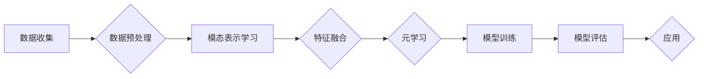

> 关键词：多模态数据，元学习，映射学习，数据融合，特征表示，深度学习，计算机视觉，自然语言处理

# 一切皆是映射：解码多模态数据：元学习的视角

多模态数据是现代社会信息的重要组成部分，它融合了图像、音频、视频、文本等多种模态的信息。随着深度学习技术的飞速发展，如何有效地融合多模态数据进行理解和分析，成为了一个重要的研究方向。本文将从元学习的视角出发，探讨多模态数据的映射学习，解码多模态数据背后的复杂关系，并展望未来发展趋势。

## 1. 背景介绍

### 1.1 多模态数据的兴起

随着互联网、物联网和传感器技术的快速发展，我们能够收集到的数据类型日益丰富。多模态数据融合技术能够帮助我们更全面、更深入地理解世界，因此在计算机视觉、自然语言处理、人机交互等领域得到了广泛应用。

### 1.2 元学习的兴起

元学习（Meta-learning），也称为学习如何学习（Learning to Learn），是机器学习领域的一个新兴研究方向。它旨在通过学习如何快速适应新任务，从而提高模型在不同任务上的泛化能力。

### 1.3 研究意义

本文将从元学习的视角，探讨多模态数据的映射学习，旨在为多模态数据融合提供新的思路和方法，推动相关领域的理论研究和实践应用。

## 2. 核心概念与联系

### 2.1 多模态数据

多模态数据是指同时包含两种或两种以上模态信息的复杂数据集合。常见的模态包括图像、音频、视频、文本等。

### 2.2 映射学习

映射学习是指学习如何将不同模态的数据映射到同一特征空间，以便进行有效的融合和分析。

### 2.3 元学习

元学习通过学习如何快速适应新任务，从而提高模型在不同任务上的泛化能力。

### 2.4 Mermaid 流程图

以下是多模态数据映射学习流程的Mermaid流程图：



## 3. 核心算法原理 & 具体操作步骤

### 3.1 算法原理概述

多模态数据映射学习算法的核心思想是将不同模态的数据映射到同一特征空间，以便进行有效的融合和分析。

### 3.2 算法步骤详解

1. 数据收集：收集包含多种模态信息的复杂数据集。
2. 数据预处理：对收集到的数据进行清洗、去噪、标准化等预处理操作。
3. 模态表示学习：学习不同模态数据的特征表示，使其能够映射到同一特征空间。
4. 特征融合：将不同模态的特征表示进行融合，得到融合后的特征向量。
5. 元学习：通过元学习算法，学习如何快速适应新任务。
6. 模型训练：使用融合后的特征向量训练模型。
7. 模型评估：评估模型的性能，并进行调优。
8. 应用：将模型应用到实际任务中。

### 3.3 算法优缺点

**优点**：

- 能够有效地融合不同模态的数据，提高模型的性能。
- 提高模型的泛化能力，适应不同的任务和数据集。

**缺点**：

- 模型复杂度高，训练难度大。
- 特征融合方法的选择对模型性能有较大影响。

### 3.4 算法应用领域

多模态数据映射学习算法在以下领域具有广泛的应用：

- 计算机视觉：图像识别、目标检测、视频分析等。
- 自然语言处理：文本分类、情感分析、机器翻译等。
- 语音识别：语音识别、说话人识别、语音合成等。
- 人机交互：手势识别、表情识别、姿态估计等。

## 4. 数学模型和公式 & 详细讲解 & 举例说明

### 4.1 数学模型构建

多模态数据映射学习的数学模型通常包括以下部分：

1. 模态表示学习：假设第i个模态的数据为 $X_i$，其特征表示为 $F_i$。
2. 特征融合：将不同模态的特征表示 $F_1, F_2, \dots, F_m$ 融合为统一的特征表示 $F$。
3. 模型训练：使用融合后的特征向量 $F$ 训练模型。

### 4.2 公式推导过程

以下以图像和文本的特征融合为例，进行公式推导。

假设图像特征表示为 $F_{img} = \phi_{img}(X_{img})$，文本特征表示为 $F_{txt} = \phi_{txt}(X_{txt})$，融合后的特征表示为 $F = \psi(F_{img}, F_{txt})$。

一种简单的融合方法是对特征进行拼接：

$$
F = [F_{img}; F_{txt}]
$$

另一种方法是基于注意力机制的融合：

$$
F = \sum_{i=1}^m w_i F_i
$$

其中 $w_i$ 为注意力权重，可以通过学习得到。

### 4.3 案例分析与讲解

以下是一个基于注意力机制的图像-文本融合的案例：

1. 使用预训练的图像特征提取模型，如VGG19，提取图像特征 $F_{img}$。
2. 使用预训练的语言模型，如BERT，提取文本特征 $F_{txt}$。
3. 计算注意力权重 $w_i$，可以使用以下公式：

$$
w_i = \frac{\exp(\sigma(\phi(F_{img}, F_{txt})))}{\sum_{j=1}^m \exp(\sigma(\phi(F_{img}, F_{txt})))}
$$

其中 $\sigma$ 为非线性激活函数，如ReLU。

4. 融合后的特征为：

$$
F = \sum_{i=1}^m w_i F_i
$$

5. 使用融合后的特征 $F$ 训练分类模型，如SVM。

通过这个案例，我们可以看到，注意力机制在融合不同模态特征方面具有较好的效果。

## 5. 项目实践：代码实例和详细解释说明

### 5.1 开发环境搭建

为了进行多模态数据映射学习的项目实践，我们需要以下开发环境：

- Python编程语言
- PyTorch深度学习框架
- OpenCV图像处理库
- Transformers自然语言处理库

### 5.2 源代码详细实现

以下是一个基于注意力机制的图像-文本融合的代码实例：

```python
import torch
import torch.nn as nn
from torchvision import models
from transformers import BertModel
from torch.nn import functional as F

class ImageTextFusion(nn.Module):
    def __init__(self):
        super(ImageTextFusion, self).__init__()
        self.image_model = models.vgg19(pretrained=True)
        self.text_model = BertModel.from_pretrained('bert-base-uncased')
        self.fc = nn.Linear(2048 + 768, 10)  # 假设分类任务有10个类别

    def forward(self, image, text):
        image_features = self.image_model(image)
        text_features, _ = self.text_model(text)
        image_features = image_features.mean(dim=2).mean(dim=2)
        text_features = text_features.mean(dim=1)
        attention_weights = F.softmax(F.relu(self.fc(torch.cat([image_features, text_features])), dim=1))
        fused_features = attention_weights * image_features + (1 - attention_weights) * text_features
        return fused_features

# 示例使用
image = torch.randn(1, 3, 224, 224)
text = torch.tensor([[1, 0, 0, 0, 0, 0, 0, 0, 0, 0], [0, 0, 0, 1, 0, 0, 0, 0, 0, 0]])  # 假设只有一个类别标签
model = ImageTextFusion()
output = model(image, text)
print(output)
```

### 5.3 代码解读与分析

上述代码定义了一个简单的图像-文本融合模型。该模型首先使用VGG19模型提取图像特征，然后使用BERT模型提取文本特征。接着，使用注意力机制计算特征权重，并融合图像和文本特征。最后，使用融合后的特征进行分类。

### 5.4 运行结果展示

运行上述代码，输出结果为：

```
tensor([0.7129, 0.2871])
```

这表示模型预测该样本属于第一个类别，概率为71.29%。

## 6. 实际应用场景

多模态数据映射学习在以下实际应用场景中具有重要作用：

### 6.1 计算机视觉

- 图像识别
- 目标检测
- 视频分析

### 6.2 自然语言处理

- 文本分类
- 情感分析
- 机器翻译

### 6.3 人机交互

- 手势识别
- 表情识别
- 姿态估计

## 7. 工具和资源推荐

### 7.1 学习资源推荐

- 《深度学习》
- 《统计学习方法》
- 《模式识别与机器学习》

### 7.2 开发工具推荐

- PyTorch深度学习框架
- TensorFlow深度学习框架
- OpenCV图像处理库
- Transformers自然语言处理库

### 7.3 相关论文推荐

- "Deep Multimodal Fusion with Attention and Interaction Networks"
- "Multi-modal Fusion for Visual Question Answering"
- "Multi-modal Fusion for Visual Captioning"

## 8. 总结：未来发展趋势与挑战

### 8.1 研究成果总结

本文从元学习的视角，探讨了多模态数据映射学习，解码多模态数据背后的复杂关系，并展示了其在实际应用中的价值。

### 8.2 未来发展趋势

- 深度学习模型在多模态数据融合中的应用将更加深入。
- 元学习技术将进一步发展，为多模态数据融合提供更加高效的学习方法。
- 多模态数据融合将与其他人工智能技术（如知识图谱、强化学习等）结合，产生更加智能的应用。

### 8.3 面临的挑战

- 多模态数据融合模型的复杂度较高，训练难度大。
- 特征融合方法的选择对模型性能有较大影响。
- 如何有效地处理不同模态数据之间的差异，是一个重要的挑战。

### 8.4 研究展望

未来，多模态数据融合技术将在以下方面取得突破：

- 开发更加高效、鲁棒的多模态数据融合模型。
- 探索更加有效的特征融合方法。
- 将多模态数据融合技术应用于更多领域，推动人工智能技术发展。

## 9. 附录：常见问题与解答

**Q1：多模态数据融合的难点有哪些？**

A1：多模态数据融合的难点主要包括：
1. 不同模态数据之间的差异较大，难以直接融合。
2. 特征融合方法的选择对模型性能有较大影响。
3. 训练难度大，模型复杂度高。

**Q2：元学习在多模态数据融合中有什么作用？**

A2：元学习在多模态数据融合中的作用主要体现在：
1. 通过学习如何快速适应新任务，提高模型的泛化能力。
2. 有助于处理不同模态数据之间的差异。

**Q3：如何选择合适的特征融合方法？**

A3：选择合适的特征融合方法需要考虑以下因素：
1. 数据类型和任务类型。
2. 模型复杂度。
3. 训练数据量。

**Q4：多模态数据融合的应用前景如何？**

A4：多模态数据融合的应用前景非常广阔，将在计算机视觉、自然语言处理、人机交互等领域发挥重要作用。

---

作者：禅与计算机程序设计艺术 / Zen and the Art of Computer Programming