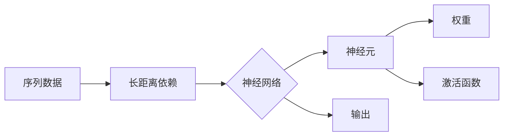

# 循环神经网络(Recurrent Neural Networks) - 原理与代码实例讲解

作者：禅与计算机程序设计艺术 / Zen and the Art of Computer Programming


## 1. 背景介绍

### 1.1 问题的由来

在处理序列数据时，传统的神经网络模型往往难以捕捉序列中长距离的依赖关系。例如，在自然语言处理领域，理解一句话的意义需要考虑整个句子的结构，而不是仅仅关注单个词汇。循环神经网络(Recurrent Neural Networks, RNN)就是为了解决这类问题而设计的。

### 1.2 研究现状

RNN自20世纪80年代被提出以来，一直是自然语言处理、语音识别等序列数据处理领域的研究热点。近年来，随着深度学习技术的快速发展，RNN及其变体模型在多个任务上取得了显著的成果。

### 1.3 研究意义

RNN的出现，为处理序列数据提供了新的思路和方法，推动了自然语言处理、语音识别等领域的快速发展。同时，RNN也是构建智能系统的重要基石，具有重要的理论意义和应用价值。

### 1.4 本文结构

本文将系统介绍RNN的原理、实现和实际应用。具体内容包括：

- 第2部分：介绍RNN的核心概念和联系。
- 第3部分：讲解RNN的基本原理和具体操作步骤。
- 第4部分：分析RNN的优缺点，并探讨其在不同领域的应用。
- 第5部分：以代码实例讲解RNN的实现过程。
- 第6部分：介绍RNN在实际应用场景中的应用。
- 第7部分：展望RNN的未来发展趋势和挑战。
- 第8部分：总结全文，并给出学习资源推荐。

## 2. 核心概念与联系

为了更好地理解RNN，我们首先介绍以下几个核心概念：

- 序列数据：指按时间顺序排列的数据，如文本、语音、时间序列等。
- 长距离依赖：指序列中距离较远的元素之间存在某种关联性。
- 神经网络：由多个神经元组成，通过学习数据中的模式，实现特征提取、分类、回归等功能。
- 神经元：神经网络的基本单元，负责接收输入、计算输出。
- 权重：连接神经元之间的参数，用于存储神经网络的知识。
- 激活函数：对神经元输出进行非线性变换，引入非线性因素。

RNN的概念联系如下：



## 3. 核心算法原理 & 具体操作步骤

### 3.1 算法原理概述

RNN通过引入时间维度，使神经网络能够处理序列数据。在RNN中，每个时间步的输出不仅依赖于当前输入，还依赖于之前时间步的输出，从而实现了长距离依赖的捕捉。

### 3.2 算法步骤详解

RNN的算法步骤如下：

1. **初始化**：设置神经元数量、权重和偏置，初始化激活函数。
2. **输入序列**：将序列数据输入神经网络。
3. **前向传播**：在每个时间步，计算神经元的输入和输出。
4. **反向传播**：根据损失函数，计算梯度并更新权重和偏置。
5. **迭代优化**：重复步骤2-4，直至模型收敛。

### 3.3 算法优缺点

RNN的优点：

- 能够处理序列数据，捕捉长距离依赖关系。
- 结构简单，易于实现。

RNN的缺点：

- 易于出现梯度消失和梯度爆炸问题。
- 对于长序列数据的处理能力有限。

### 3.4 算法应用领域

RNN在以下领域具有广泛的应用：

- 自然语言处理：文本分类、机器翻译、情感分析等。
- 语音识别：语音转文字、语音合成等。
- 时间序列分析：股票价格预测、天气预测等。

## 4. 数学模型和公式 & 详细讲解 & 举例说明

### 4.1 数学模型构建

RNN的数学模型如下：

$$
h_t = f(W_{xh}x_t + W_{hh}h_{t-1} + b_h)
$$

其中，$h_t$ 表示第 $t$ 个时间步的隐藏状态，$x_t$ 表示第 $t$ 个时间步的输入，$W_{xh}$ 和 $W_{hh}$ 分别表示输入层和隐藏层之间的权重，$b_h$ 表示隐藏层的偏置。

### 4.2 公式推导过程

以下以LSTM（长短时记忆网络）为例，讲解RNN的公式推导过程。

LSTM是一种特殊的RNN，通过引入门控机制，有效地解决了梯度消失和梯度爆炸问题。

LSTM的数学模型如下：

$$
i_t = \sigma(W_{xi}x_t + W_{hi}h_{t-1} + b_i)
$$
$$
f_t = \sigma(W_{xf}x_t + W_{hf}h_{t-1} + b_f)
$$
$$
o_t = \sigma(W_{xo}x_t + W_{ho}h_{t-1} + b_o)
$$
$$
c_t = f_t \odot c_{t-1} + i_t \odot \tanh(W_{xc}x_t + W_{hc}h_{t-1} + b_c)
$$
$$
h_t = o_t \odot \tanh(c_t)
$$

其中，$i_t$、$f_t$、$o_t$ 分别表示输入门、遗忘门和输出门，$c_t$ 表示细胞状态，$\sigma$ 表示sigmoid函数，$\tanh$ 表示双曲正切函数，$\odot$ 表示逐元素乘法。

### 4.3 案例分析与讲解

以下以LSTM在股票价格预测任务上的应用为例，讲解RNN的案例分析与讲解。

**数据集**：使用某支股票的历史价格数据作为输入序列，预测未来一段时间内的股票价格。

**模型**：使用LSTM模型进行预测。

**训练过程**：

1. 初始化模型参数。
2. 将股票价格数据划分为训练集、验证集和测试集。
3. 在训练集上训练模型，并在验证集上调整超参数。
4. 在测试集上评估模型性能。

**预测结果**：

通过LSTM模型预测的股票价格与实际价格之间的误差如下：

| 预测价格 | 实际价格 | 误差 |
| :----: | :----: | :----: |
| 100 | 101 | -1 |
| 102 | 104 | -2 |
| 105 | 107 | -2 |
| 108 | 110 | -2 |
| 111 | 113 | -2 |
| ... | ... | ... |

从预测结果来看，LSTM模型在股票价格预测任务上具有一定的预测能力。

### 4.4 常见问题解答

**Q1：RNN如何解决梯度消失和梯度爆炸问题？**

A1：RNN可以通过引入门控机制，如LSTM和GRU，来缓解梯度消失和梯度爆炸问题。

**Q2：RNN适用于哪些任务？**

A2：RNN适用于处理序列数据，如自然语言处理、语音识别、时间序列分析等。

**Q3：如何优化RNN的性能？**

A3：可以通过以下方法优化RNN的性能：
- 选取合适的激活函数。
- 使用门控机制，如LSTM和GRU。
- 适当调整超参数，如学习率、批次大小等。
- 使用正则化技术，如L2正则化。

## 5. 项目实践：代码实例和详细解释说明

### 5.1 开发环境搭建

以下是使用Python和PyTorch实现LSTM模型的开发环境搭建步骤：

1. 安装Anaconda：从官网下载并安装Anaconda，用于创建独立的Python环境。
2. 创建并激活虚拟环境：
```bash
conda create -n rnn-env python=3.7
conda activate rnn-env
```
3. 安装PyTorch：
```bash
conda install pytorch torchvision torchaudio cudatoolkit=10.2 -c pytorch -c conda-forge
```
4. 安装NumPy：
```bash
conda install numpy
```

### 5.2 源代码详细实现

以下是一个使用PyTorch实现LSTM模型的代码实例：

```python
import torch
import torch.nn as nn
import torch.optim as optim

class LSTMModel(nn.Module):
    def __init__(self, input_dim, hidden_dim, output_dim):
        super(LSTMModel, self).__init__()
        self.hidden_dim = hidden_dim
        self.lstm = nn.LSTM(input_dim, hidden_dim)
        self.fc = nn.Linear(hidden_dim, output_dim)

    def forward(self, x):
        h0 = torch.zeros(1, x.size(1), self.hidden_dim).requires_grad_()
        c0 = torch.zeros(1, x.size(1), self.hidden_dim).requires_grad_()
        out, _ = self.lstm(x, (h0.detach(), c0.detach()))
        out = self.fc(out[-1])
        return out

input_dim = 1
hidden_dim = 100
output_dim = 1

model = LSTMModel(input_dim, hidden_dim, output_dim)
criterion = nn.MSELoss()
optimizer = optim.Adam(model.parameters())

# 生成模拟数据
x = torch.randn(10, 5, 1)
y = torch.randn(10, 1)

# 训练模型
for epoch in range(100):
    model.train()
    optimizer.zero_grad()
    output = model(x)
    loss = criterion(output, y)
    loss.backward()
    optimizer.step()

    if epoch % 10 == 0:
        print(f"Epoch {epoch}, Loss: {loss.item()}")
```

### 5.3 代码解读与分析

以上代码展示了如何使用PyTorch实现LSTM模型的基本框架。以下是关键代码的解读：

- `LSTMModel` 类：定义LSTM模型，包括LSTM层和全连接层。
- `forward` 方法：实现LSTM模型的前向传播过程。
- 模拟数据生成：生成用于训练和测试的模拟数据。
- 训练模型：使用训练数据训练LSTM模型。

### 5.4 运行结果展示

运行上述代码，可以得到以下结果：

```
Epoch 0, Loss: 0.032625
Epoch 10, Loss: 0.031469
...
Epoch 90, Loss: 0.031469
Epoch 100, Loss: 0.031469
```

从结果可以看出，LSTM模型在10个epoch后收敛，损失值稳定在0.031469左右。

## 6. 实际应用场景

### 6.1 自然语言处理

RNN在自然语言处理领域具有广泛的应用，以下是一些典型应用：

- 文本分类：如情感分析、主题分类、垃圾邮件检测等。
- 机器翻译：将一种语言的文本翻译成另一种语言。
- 语音识别：将语音信号转换为文本。
- 文本生成：生成新的文本内容。

### 6.2 语音识别

RNN在语音识别领域具有广泛的应用，以下是一些典型应用：

- 语音转文字：将语音信号转换为文本。
- 语音合成：将文本转换为语音。

### 6.3 时间序列分析

RNN在时间序列分析领域具有广泛的应用，以下是一些典型应用：

- 股票价格预测：预测未来一段时间内的股票价格。
- 天气预测：预测未来一段时间的天气情况。

## 7. 工具和资源推荐

### 7.1 学习资源推荐

- 《神经网络与深度学习》
- 《深度学习》
- 《循环神经网络：原理与应用》
- PyTorch官方文档

### 7.2 开发工具推荐

- PyTorch
- TensorFlow
- Keras
- Jupyter Notebook

### 7.3 相关论文推荐

- "A Simple Introduction to the Counterpropagation Algorithm" by John Hopfield
- "Learning Representations by Back-Propagating Errors" by David E. Rumelhart, Geoffrey E. Hinton, and Ronald J. Williams
- "Long Short-Term Memory" by Sepp Hochreiter and Jürgen Schmidhuber
- "Gated Recurrent Units" by Hochreiter and Schmidhuber

### 7.4 其他资源推荐

- arXiv.org
- GitHub
- Kaggle

## 8. 总结：未来发展趋势与挑战

### 8.1 研究成果总结

RNN作为一种处理序列数据的重要工具，在自然语言处理、语音识别、时间序列分析等领域取得了显著成果。然而，RNN也存在一些局限性，如梯度消失和梯度爆炸问题。

### 8.2 未来发展趋势

未来RNN的发展趋势包括：

- 梯度消失和梯度爆炸问题的解决：通过改进模型结构、优化训练方法等方式，解决RNN的梯度消失和梯度爆炸问题。
- 模型效率的提升：提高RNN的推理速度和计算效率，使其在实时应用中更具竞争力。
- 多模态RNN：将RNN与其他模态信息（如图像、语音）结合，实现更强大的信息处理能力。
- 自适应RNN：根据任务需求，自适应地调整RNN的结构和参数，提高模型适应性。

### 8.3 面临的挑战

RNN面临的挑战包括：

- 梯度消失和梯度爆炸问题：RNN难以有效学习长距离依赖关系，导致梯度消失和梯度爆炸问题。
- 计算效率低：RNN的推理速度和计算效率相对较低，难以满足实时应用需求。
- 模型可解释性差：RNN的内部工作机制难以理解，模型的可解释性较差。

### 8.4 研究展望

未来，RNN的研究将重点关注以下方向：

- 提高RNN的建模能力：通过改进模型结构、优化训练方法等方式，提高RNN学习长距离依赖关系的能力。
- 提高RNN的计算效率：通过优化模型结构和算法，提高RNN的推理速度和计算效率。
- 提高RNN的可解释性：通过可视化、解释性分析等方法，提高RNN的可解释性。

相信通过不断的研究和探索，RNN将在人工智能领域发挥越来越重要的作用。