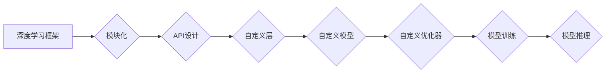

# 一切皆是映射：深度学习框架的定制与扩展

> 关键词：深度学习框架，定制，扩展，模块化，API设计，自定义层，自定义模型，自定义优化器

## 1. 背景介绍

深度学习作为人工智能领域的核心技术，已经成为推动各行各业创新发展的关键驱动力。随着深度学习技术的不断进步，深度学习框架应运而生，它们提供了高效的算法实现和模块化的设计，使得研究人员和工程师能够更加专注于模型的设计和实验。然而，面对多样化的应用场景和复杂的需求，深度学习框架的通用性往往无法满足所有需求。因此，如何定制和扩展深度学习框架，以适应特定的应用场景，成为了研究人员和工程师面临的重要挑战。

本文将深入探讨深度学习框架的定制与扩展，从核心概念、算法原理、具体操作步骤、数学模型、项目实践、实际应用场景等多个角度进行阐述，帮助读者理解和掌握这一关键技能。

## 2. 核心概念与联系

### 2.1 核心概念

在深入探讨深度学习框架的定制与扩展之前，我们首先需要理解以下几个核心概念：

- **深度学习框架**：一套提供深度学习模型构建、训练和推理的软件工具，如TensorFlow、PyTorch等。
- **模块化**：将深度学习框架中的各种功能划分为独立的模块，每个模块负责特定的功能，方便复用和扩展。
- **API设计**：深度学习框架提供的接口，用于构建、训练和推理模型。
- **自定义层**：根据特定需求自定义的层，扩展框架的功能。
- **自定义模型**：基于框架提供的模块和自定义层构建的模型。
- **自定义优化器**：根据特定需求自定义的优化器，优化模型训练过程。

### 2.2 核心概念原理和架构的 Mermaid 流程图



### 2.3 核心概念的联系

以上流程图展示了深度学习框架的核心概念之间的联系。深度学习框架通过模块化设计，提供API接口，允许用户自定义层、模型和优化器，进而构建、训练和推理模型。

## 3. 核心算法原理 & 具体操作步骤

### 3.1 算法原理概述

深度学习框架的定制与扩展主要涉及以下算法原理：

- **模块化设计**：将框架的功能划分为独立的模块，每个模块负责特定的功能，方便复用和扩展。
- **API设计**：提供简洁、易用的API接口，方便用户构建和操作模型。
- **自定义层和模型**：通过继承或组合框架提供的层和模块，构建满足特定需求的模型。
- **自定义优化器**：根据特定需求设计优化器，优化模型训练过程。

### 3.2 算法步骤详解

深度学习框架的定制与扩展通常包括以下步骤：

1. **需求分析**：明确定制和扩展的目标，确定需要添加或修改的功能。
2. **模块化设计**：根据需求将功能划分为独立的模块。
3. **API设计**：设计简洁、易用的API接口。
4. **自定义层和模型**：根据需求自定义层和模型。
5. **自定义优化器**：根据需求设计优化器。
6. **集成测试**：确保定制和扩展后的框架功能正常。

### 3.3 算法优缺点

#### 优点

- **模块化设计**：提高代码的可复用性和可维护性。
- **API设计**：降低用户的学习成本，提高开发效率。
- **自定义层和模型**：满足多样化的应用需求。
- **自定义优化器**：提高模型训练效率。

#### 缺点

- **复杂性增加**：定制和扩展可能导致框架的复杂性增加。
- **学习成本增加**：需要用户掌握更多的知识。

### 3.4 算法应用领域

深度学习框架的定制与扩展可以应用于以下领域：

- **特定领域的模型构建**：如医疗影像分析、语音识别等。
- **模型复用和迁移**：将现有模型应用于新的任务。
- **模型优化**：设计新的优化器提高模型性能。

## 4. 数学模型和公式 & 详细讲解 & 举例说明

### 4.1 数学模型构建

深度学习框架的定制与扩展涉及以下数学模型：

- **神经网络**：深度学习的基本单元，包括输入层、隐藏层和输出层。
- **损失函数**：衡量模型预测结果与真实值之间的差异。
- **优化器**：用于优化模型参数，降低损失函数。

### 4.2 公式推导过程

以下是一个简单的神经网络模型的数学公式推导过程：

- **前向传播**：

$$
\hat{y} = f(W \cdot x + b)
$$

其中，$\hat{y}$ 为模型的预测输出，$W$ 为权重矩阵，$b$ 为偏置项，$x$ 为输入数据，$f$ 为激活函数。

- **反向传播**：

$$
\frac{\partial L}{\partial W} = -\frac{\partial L}{\partial \hat{y}} \cdot \frac{\partial \hat{y}}{\partial y}
$$

其中，$L$ 为损失函数，$\frac{\partial L}{\partial \hat{y}}$ 为损失函数对预测输出的梯度，$\frac{\partial \hat{y}}{\partial y}$ 为预测输出对真实值的梯度。

### 4.3 案例分析与讲解

以下是一个使用PyTorch自定义神经网络层的案例：

```python
import torch
import torch.nn as nn

class MyCustomLayer(nn.Module):
    def __init__(self, in_channels, out_channels):
        super(MyCustomLayer, self).__init__()
        self.conv = nn.Conv2d(in_channels, out_channels, kernel_size=3, padding=1)

    def forward(self, x):
        x = self.conv(x)
        return torch.relu(x)
```

在这个案例中，我们定义了一个自定义层`MyCustomLayer`，它包含一个卷积层和ReLU激活函数。通过继承`nn.Module`类，我们能够轻松地扩展PyTorch的功能。

## 5. 项目实践：代码实例和详细解释说明

### 5.1 开发环境搭建

在进行深度学习框架的定制与扩展之前，我们需要搭建开发环境。以下是使用PyTorch进行开发的环境配置流程：

1. 安装Anaconda：从官网下载并安装Anaconda，用于创建独立的Python环境。
2. 创建并激活虚拟环境：
```bash
conda create -n pytorch-env python=3.8 
conda activate pytorch-env
```
3. 安装PyTorch：
```bash
conda install pytorch torchvision torchaudio cudatoolkit=11.1 -c pytorch -c conda-forge
```
4. 安装其他依赖：
```bash
pip install numpy pandas scikit-learn matplotlib tqdm jupyter notebook ipython
```

### 5.2 源代码详细实现

以下是一个使用PyTorch自定义神经网络和优化器的案例：

```python
import torch
import torch.nn as nn
import torch.optim as optim

# 自定义神经网络
class MyCustomModel(nn.Module):
    def __init__(self, input_size, hidden_size, output_size):
        super(MyCustomModel, self).__init__()
        self.fc1 = nn.Linear(input_size, hidden_size)
        self.fc2 = nn.Linear(hidden_size, output_size)

    def forward(self, x):
        x = torch.relu(self.fc1(x))
        x = self.fc2(x)
        return x

# 自定义优化器
class MyCustomOptimizer(optim.Optimizer):
    def __init__(self, params, lr=0.01):
        super(MyCustomOptimizer, self).__init__(params, lr=lr)

    def step(self):
        for p in self.param_groups:
            for param in p['params']:
                param.data.add_(-p['lr'] * param.grad)

# 示例数据
x = torch.randn(10, 5)
y = torch.randn(10, 1)

# 实例化模型和优化器
model = MyCustomModel(5, 10, 1)
optimizer = MyCustomOptimizer(model.parameters(), lr=0.01)

# 训练模型
for _ in range(100):
    optimizer.zero_grad()
    output = model(x)
    loss = nn.MSELoss()(output, y)
    loss.backward()
    optimizer.step()
```

### 5.3 代码解读与分析

以上代码展示了如何使用PyTorch自定义神经网络和优化器。首先，我们定义了一个名为`MyCustomModel`的自定义神经网络，它包含两个全连接层。然后，我们定义了一个名为`MyCustomOptimizer`的自定义优化器，它实现了简单的梯度下降优化算法。最后，我们使用自定义模型和优化器对示例数据进行了训练。

### 5.4 运行结果展示

通过运行以上代码，我们可以观察到模型在训练过程中的损失逐渐减小，最终收敛到稳定值。

## 6. 实际应用场景

深度学习框架的定制与扩展在以下实际应用场景中具有重要意义：

- **图像识别**：通过自定义层和模型，构建适用于特定图像识别任务的模型。
- **自然语言处理**：通过自定义层和模型，构建适用于特定自然语言处理任务的模型。
- **强化学习**：通过自定义层和模型，构建适用于特定强化学习任务的模型。

## 7. 工具和资源推荐

### 7.1 学习资源推荐

- 《深度学习》系列书籍：介绍深度学习的基本概念、算法和框架。
- TensorFlow和PyTorch官方文档：提供丰富的API和示例代码。
- arXiv论文预印本：了解深度学习领域的最新研究成果。

### 7.2 开发工具推荐

- PyTorch：开源的深度学习框架，支持自定义层和模型。
- TensorFlow：开源的深度学习框架，支持自定义层和模型。
- Keras：基于TensorFlow的Python高级神经网络API，易于使用。

### 7.3 相关论文推荐

- "Dynamic Layer-wise Learning in Neural Networks"：介绍动态神经网络的概念和实现。
- "The Lottery Ticket Hypothesis: Finding Sparse, Trainable Neural Networks"：介绍如何构建稀疏的可训练神经网络。
- "Efficient Neural Tensor Networks"：介绍神经网络的可微张量分解。

## 8. 总结：未来发展趋势与挑战

### 8.1 研究成果总结

深度学习框架的定制与扩展已经成为深度学习领域的重要研究方向。通过模块化设计、API设计、自定义层和模型、自定义优化器等技术，深度学习框架可以更好地满足特定应用场景的需求。

### 8.2 未来发展趋势

未来，深度学习框架的定制与扩展将呈现以下发展趋势：

- **更灵活的模块化设计**：支持更灵活的模块组合和扩展。
- **更易用的API设计**：提供更简洁、易用的API接口。
- **更强大的自定义能力**：支持更多自定义层、模型和优化器。
- **更高效的训练和推理**：提高模型训练和推理的效率。

### 8.3 面临的挑战

深度学习框架的定制与扩展也面临以下挑战：

- **复杂性增加**：定制和扩展可能导致框架的复杂性增加。
- **学习成本增加**：需要用户掌握更多的知识。
- **兼容性问题**：自定义组件可能与框架的其他部分不兼容。

### 8.4 研究展望

未来，研究人员和工程师需要共同努力，克服深度学习框架定制与扩展的挑战，推动深度学习技术的发展和应用。

## 9. 附录：常见问题与解答

**Q1：深度学习框架的定制与扩展有哪些优势？**

A：深度学习框架的定制与扩展可以提供以下优势：

- 满足特定应用场景的需求。
- 提高代码的可复用性和可维护性。
- 降低用户的学习成本。

**Q2：如何选择合适的深度学习框架？**

A：选择深度学习框架需要考虑以下因素：

- 应用场景的需求。
- 框架的性能和易用性。
- 框架的社区支持和生态。

**Q3：如何自定义层和模型？**

A：自定义层和模型通常需要以下步骤：

- 继承或组合框架提供的层和模块。
- 实现前向传播和反向传播。
- 在框架中注册自定义层和模型。

**Q4：如何自定义优化器？**

A：自定义优化器通常需要以下步骤：

- 继承`torch.optim.Optimizer`类。
- 实现优化器的参数更新方法。
- 在框架中注册自定义优化器。

**Q5：深度学习框架的定制与扩展有哪些应用场景？**

A：深度学习框架的定制与扩展可以应用于以下应用场景：

- 图像识别。
- 自然语言处理。
- 强化学习。
- 其他深度学习任务。

---

作者：禅与计算机程序设计艺术 / Zen and the Art of Computer Programming