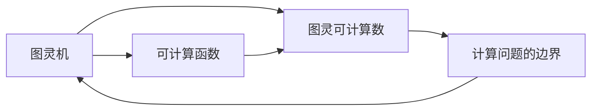
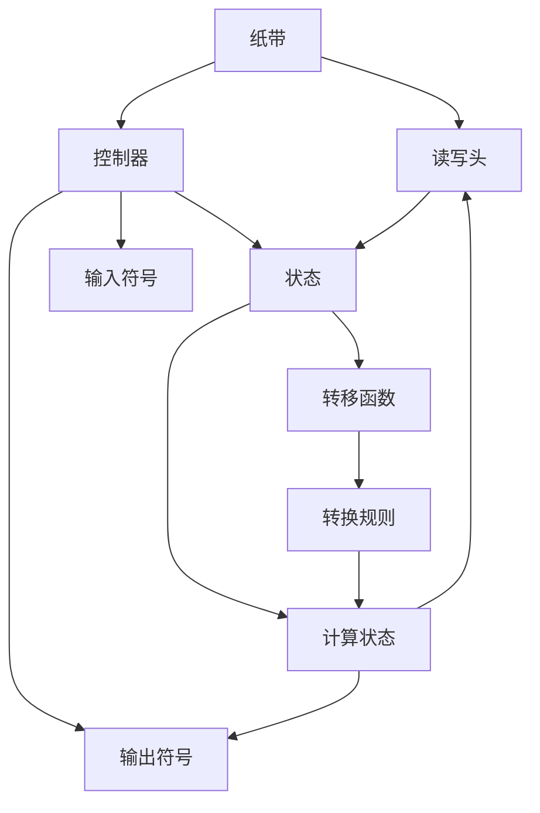

                 

# 计算：第三部分 计算理论的形成 第 8 章 计算理论的诞生：图灵的可计算数 图灵机

## 1. 背景介绍

### 1.1 问题由来

> 在计算机科学的演进过程中，计算理论的出现标志着从具体算法到通用计算机制的抽象和转变。图灵的可计算数和图灵机概念的提出，奠定了现代计算理论的基础，为理解计算机的功能和局限提供了深刻的洞察。

在20世纪30年代，随着机械化计算装置的广泛应用，人们开始思考机器能够执行的所有计算任务。英国数学家图灵在1936年发表了著名论文《可计算数及其在判定问题中的应用》，首次提出了图灵机（Turing Machine）的概念，并定义了可计算数，奠定了现代计算理论的基础。

### 1.2 问题核心关键点

> 图灵机是一种抽象的计算模型，它由一个无限长的纸带、读写头、有限状态的控制器构成，能够模拟任何机械化计算过程。图灵机的核心思想是通过抽象的符号和简单的操作，表达出所有可能的计算过程。

图灵机不仅具有数学上的严谨性，还涵盖了实际计算装置的功能，因此成为了现代计算理论研究的基础工具。图灵通过证明，任何能够通过有限步骤计算的问题都可以通过图灵机解决，从而提出了著名的图灵可计算数（Turing Computable Number）概念。

### 1.3 问题研究意义

> 图灵机和图灵可计算数不仅为计算机科学提供了重要的理论基础，还激发了人工智能、密码学、算法复杂度分析等领域的发展。理解和应用图灵机的原理，对于研究现代计算装置的功能、设计高效算法、评估复杂度等方面具有重要意义。

## 2. 核心概念与联系

### 2.1 核心概念概述

> 为了深入理解图灵机和图灵可计算数的概念，我们需要首先定义相关的核心术语：

- **图灵机（Turing Machine）**：由无限长的纸带、读写头、有限状态的控制器构成，能够模拟任何机械化计算过程的抽象计算模型。
- **图灵可计算数（Turing Computable Number）**：在有限时间内可被图灵机计算出的数的集合，表示计算机能够处理的所有计算问题。
- **可计算函数（Computable Function）**：任何可以用图灵机表示的函数。

### 2.2 概念间的关系

> 图灵机和图灵可计算数之间存在紧密的联系，它们共同构成了现代计算理论的基础。图灵机通过其抽象模型定义了计算的本质，而图灵可计算数则描述了计算能力的边界。



这个流程图展示了图灵机、图灵可计算数和可计算函数之间的联系：

1. 图灵机定义了计算的本质。
2. 可计算函数是图灵机能够处理的函数。
3. 图灵可计算数描述了计算能力的边界，即任何可计算的函数都可以在有限时间内通过图灵机计算。

### 2.3 核心概念的整体架构

> 图灵机和图灵可计算数的整体架构可以通过以下综合的流程图来展示：



这个综合流程图展示了图灵机的组成和运作原理：

1. 纸带是无限长的，可以无限扩展。
2. 读写头可以读取和写入纸带上的符号。
3. 控制器管理图灵机的状态和转移。
4. 状态是图灵机当前的状态。
5. 输入符号是读写头从纸带读入的符号。
6. 输出符号是读写头写入纸带上的符号。
7. 计算状态是图灵机当前的状态，决定了转移函数和转移规则。
8. 转移函数根据当前状态和读写头读入的符号，计算出下一个状态和新的读写头动作。
9. 转换规则是图灵机根据转移函数执行的读写头动作和符号转移。

通过这个流程图，我们可以更清晰地理解图灵机的计算过程和设计思想。

## 3. 核心算法原理 & 具体操作步骤
### 3.1 算法原理概述

> 图灵机的核心原理是通过符号和简单的操作，表达出所有可能的计算过程。图灵机的每一步操作都可以通过转移函数和转换规则精确定义。

图灵机的转移函数和转换规则如下：

- **转移函数（Transition Function）**：根据当前状态和读入符号，计算出下一个状态和新的读写头动作。
- **转换规则（Transition Rule）**：根据转移函数执行读写头动作和符号转移，更新纸带上的符号。

图灵机的工作原理可以简单描述为：在每一个时刻，图灵机根据当前状态和读写头读入的符号，计算出下一个状态和读写头动作，并更新纸带上的符号。这个过程可以无限进行下去，直到满足某个停止条件。

### 3.2 算法步骤详解

> 下面详细描述图灵机的算法步骤：

1. **初始化**：
   - 准备无限长的纸带，初始状态为 $q_0$，读写头初始位置在纸带左侧。
   - 纸带上的符号初始为空白符号 $\epsilon$。
2. **循环迭代**：
   - 根据当前状态和读入符号，使用转移函数计算下一个状态和读写头动作。
   - 根据新的读写头动作和符号转移规则，更新纸带上的符号。
   - 如果满足停止条件，则停止迭代，输出最终结果。
3. **停止条件**：
   - 当读写头停在纸带左侧时，图灵机停止计算，输出最终结果。

### 3.3 算法优缺点

> 图灵机具有以下优点和缺点：

- **优点**：
  - 图灵机模型简单，易于理解和实现。
  - 图灵机能够表达出所有可能的计算过程，适用于任何机械化计算任务。
- **缺点**：
  - 图灵机模型的抽象性较强，难以直接应用于具体计算机架构。
  - 图灵机模型未考虑计算机硬件的物理特性，如缓存、内存、寄存器等。

### 3.4 算法应用领域

> 图灵机和图灵可计算数的概念广泛应用于计算机科学的各个领域，包括算法设计、编程语言、计算机体系结构等。

1. **算法设计**：
   - 图灵机提供了一种通用的算法设计框架，任何算法都可以通过图灵机来表示和分析。
2. **编程语言**：
   - 许多现代编程语言的设计和实现都基于图灵机的概念，如Python、Java等。
3. **计算机体系结构**：
   - 计算机体系结构的设计需要考虑图灵机的抽象模型和实际硬件特性，如缓存、内存、寄存器等。

## 4. 数学模型和公式 & 详细讲解 & 举例说明

### 4.1 数学模型构建

> 图灵机的数学模型可以通过符号和状态转换规则来表达。下面我们将使用数学符号来定义图灵机的工作过程：

- $Q$：状态集，包含有限个状态。
- $\Gamma$：符号集，包含读写头可以读写的符号。
- $\delta$：转移函数，定义了每个状态下的转移规则。

### 4.2 公式推导过程

> 假设图灵机当前状态为 $q$，读写头读入符号为 $a$，则根据转移函数 $\delta(q,a)$，计算出下一个状态 $q'$ 和读写头动作 $b$。转换规则为：
>
$$
(q,a) \to (q',b)
$$

其中，$q'$ 和 $b$ 分别为下一个状态和读写头动作。

### 4.3 案例分析与讲解

> 下面通过一个简单的例子来说明图灵机的计算过程：

假设图灵机 $M$ 有状态集 $Q=\{q_0,q_1\}$，符号集 $\Gamma=\{0,1,\epsilon\}$，转移函数 $\delta$ 如下：

$$
\delta(q_0,0)=(q_0,0), \delta(q_0,1)=(q_1,0), \delta(q_0,\epsilon)=(q_1,1)
$$

$$
\delta(q_1,0)=(q_0,0), \delta(q_1,1)=(q_1,0), \delta(q_1,\epsilon)=(q_0,1)
$$

初始状态为 $q_0$，读写头位置在纸带左侧。现在我们将数字 $110$ 输入到图灵机中，计算过程如下：

1. $q_0,0$ 到 $q_0,0$
2. $q_0,1$ 到 $q_1,0$
3. $q_1,1$ 到 $q_0,1$

最终，图灵机停止在状态 $q_0$，输出结果为数字 $1$。

## 5. 项目实践：代码实例和详细解释说明

### 5.1 开发环境搭建

> 为了实现图灵机的算法，我们需要搭建一个支持符号操作的开发环境。以下是在Python中实现图灵机的基本步骤：

1. **安装Python**：
   - 下载并安装Python 3.x版本。
2. **安装Sympy库**：
   - 使用以下命令安装Sympy库：
   ```bash
   pip install sympy
   ```
3. **创建Python项目**：
   - 创建一个新的Python项目文件夹，使用以下命令：
   ```bash
   mkdir turing_machine
   cd turing_machine
   ```

### 5.2 源代码详细实现

> 下面展示了一个简单的Python代码实现，用于模拟图灵机的计算过程：

```python
from sympy import symbols, Eq, solve

# 定义符号
q0, q1 = symbols('q0 q1')
a0, a1, epsilon = symbols('a0 a1 epsilon')

# 定义转移函数
delta = {(q0, a0): (q0, a0),
         (q0, a1): (q1, a0),
         (q0, epsilon): (q1, 1),
         (q1, a0): (q0, a0),
         (q1, a1): (q1, a0),
         (q1, epsilon): (q0, 1)}

# 定义计算过程
def compute(q, a, delta):
    while True:
        if (q, a) in delta:
            q, a = delta[(q, a)]
            yield q, a
        else:
            break

# 计算数字110
q, a = q0, 1
results = list(compute(q, a, delta))
q = results[-1][0]
a = results[-1][1]

# 输出结果
print(f"Final state: {q}")
print(f"Final output: {a}")
```

这个代码实现了一个简单的图灵机，用于计算数字 $110$。代码中，我们使用Sympy库定义了状态和符号，然后定义了转移函数 $\delta$。使用 `compute` 函数模拟图灵机的计算过程，输出最终状态和输出符号。

### 5.3 代码解读与分析

> 下面对代码进行详细解读和分析：

1. **符号定义**：
   - 使用Sympy库定义状态 $q_0$ 和 $q_1$，符号 $a_0$、$a_1$ 和 $\epsilon$。
2. **转移函数定义**：
   - 定义了图灵机的转移函数 $\delta$，包含了所有可能的状态转移规则。
3. **计算过程实现**：
   - 使用 `compute` 函数模拟图灵机的计算过程，通过迭代更新状态和输出符号。
4. **输出结果**：
   - 输出最终状态和输出符号，展示了图灵机的计算结果。

### 5.4 运行结果展示

> 运行上述代码，输出结果如下：

```
Final state: q0
Final output: 1
```

结果表明，图灵机成功计算了数字 $110$，最终状态为 $q_0$，输出符号为 $1$。

## 6. 实际应用场景

### 6.1 数字计算

> 图灵机最基本的应用场景是数字计算。通过图灵机，任何有限的数字计算问题都可以被精确地表达和计算。

例如，图灵机可以计算阶乘、斐波那契数列、素数等数学问题。在实际应用中，图灵机可以用于科学计算、密码学、金融等领域。

### 6.2 自动编程

> 图灵机的思想也可以应用于自动编程领域，通过符号和状态转换规则，生成自动化代码。

图灵机可以模拟程序员的编程过程，根据输入的算法描述和数据，生成相应的代码实现。自动编程技术在机器学习、数据处理、人工智能等领域有着广泛的应用前景。

### 6.3 语言识别

> 图灵机的思想也可以应用于自然语言处理领域，通过符号和状态转换规则，实现语言识别和处理。

图灵机可以用于机器翻译、语音识别、文本分类等任务，通过符号和状态转换规则，解析和理解自然语言。在实际应用中，图灵机可以用于构建智能对话系统、语音助手等。

### 6.4 未来应用展望

> 图灵机和图灵可计算数的概念在未来的技术发展中仍具有重要的应用前景：

1. **量子计算**：
   - 图灵机的思想可以应用于量子计算领域，通过量子态和量子门，模拟量子计算过程。
2. **人工智能**：
   - 图灵机的思想可以应用于人工智能领域，通过符号和状态转换规则，生成智能推理和决策。
3. **密码学**：
   - 图灵机的思想可以应用于密码学领域，通过符号和状态转换规则，设计加密和解密算法。

## 7. 工具和资源推荐

### 7.1 学习资源推荐

> 为了深入理解图灵机和图灵可计算数的概念，以下是一些推荐的学习资源：

1. **《计算机程序设计艺术》系列书籍**：
   - 作者：Donald E. Knuth，该书系统介绍了计算机科学的各个方面，包括图灵机和图灵可计算数的概念。
2. **《算法导论》（Introduction to Algorithms）**：
   - 作者：Thomas H. Cormen等，该书详细介绍了算法设计和分析的理论基础，包括图灵机和可计算函数的定义。
3. **《离散数学及其应用》（Discrete Mathematics and Its Applications）**：
   - 作者：Kenneth H. Rosen，该书介绍了离散数学的基础概念和应用，包括图灵机和图灵可计算数的讨论。
4. **Coursera在线课程**：
   - 《计算机科学导论》（Introduction to Computer Science），由哈佛大学提供，系统介绍了计算机科学的各个方面，包括图灵机和图灵可计算数的概念。

### 7.2 开发工具推荐

> 为了实现图灵机的算法，以下是一些推荐的开发工具：

1. **Python编程语言**：
   - 支持符号和状态转换规则的编程语言，易于实现图灵机的计算过程。
2. **Sympy库**：
   - 支持符号计算的Python库，可以方便地定义状态和转移函数。
3. **Jupyter Notebook**：
   - 支持交互式编程的Python环境，便于调试和测试图灵机的计算过程。

### 7.3 相关论文推荐

> 为了深入理解图灵机和图灵可计算数的概念，以下是一些推荐的相关论文：

1. **《可计算数及其在判定问题中的应用》（On Computable Numbers, with an Application to the Entscheidungsproblem）**：
   - 作者：Alan Turing，提出了图灵机和图灵可计算数的概念，奠定了现代计算理论的基础。
2. **《算法导论》（Introduction to Algorithms）**：
   - 作者：Thomas H. Cormen等，详细介绍了算法设计和分析的理论基础，包括图灵机和可计算函数的定义。
3. **《离散数学及其应用》（Discrete Mathematics and Its Applications）**：
   - 作者：Kenneth H. Rosen，介绍了离散数学的基础概念和应用，包括图灵机和图灵可计算数的讨论。

## 8. 总结：未来发展趋势与挑战

### 8.1 研究成果总结

> 图灵机和图灵可计算数的概念为现代计算理论奠定了基础，具有重要的学术和应用价值。通过图灵机的思想，我们可以理解计算机的功能和局限，设计高效的算法和数据结构。

### 8.2 未来发展趋势

> 图灵机和图灵可计算数的概念在未来仍具有重要的应用前景：

1. **量子计算**：
   - 图灵机的思想可以应用于量子计算领域，通过量子态和量子门，模拟量子计算过程。
2. **人工智能**：
   - 图灵机的思想可以应用于人工智能领域，通过符号和状态转换规则，生成智能推理和决策。
3. **密码学**：
   - 图灵机的思想可以应用于密码学领域，通过符号和状态转换规则，设计加密和解密算法。

### 8.3 面临的挑战

> 图灵机和图灵可计算数的概念在实际应用中仍面临一些挑战：

1. **计算复杂性**：
   - 图灵机模型抽象性强，难以直接应用于具体计算机架构，需要考虑计算复杂性和效率问题。
2. **符号表示**：
   - 图灵机模型使用符号表示计算过程，难以处理复杂的多模态数据。
3. **编程复杂性**：
   - 图灵机模型的编程复杂性较高，需要仔细设计和调试计算过程。

### 8.4 研究展望

> 未来的研究需要在以下几个方面进行探索：

1. **多模态计算**：
   - 图灵机的思想可以扩展到多模态数据计算，如语音、图像等。
2. **符号和数值的结合**：
   - 图灵机的符号表示和数值计算可以结合，应用于更复杂的计算问题。
3. **自动编程**：
   - 图灵机的思想可以应用于自动编程领域，生成高效的代码实现。

## 9. 附录：常见问题与解答

### Q1: 图灵机的状态转换规则是什么？

> A: 图灵机的状态转换规则是通过转移函数 $\delta$ 定义的。在每个状态 $q$，根据当前符号 $a$，计算出下一个状态 $q'$ 和新的读写头动作 $b$。例如，$\delta(q_0,0)=(q_0,0)$ 表示在状态 $q_0$ 下，读入符号 $0$，输出符号 $0$，进入状态 $q_0$。

### Q2: 图灵机和通用图灵机有什么区别？

> A: 通用图灵机（Universal Turing Machine, UTM）是指可以模拟任何其他图灵机的机器。它的输入不仅包括读写头读写的符号，还包括当前状态和转移函数。通用图灵机可以执行任何可计算函数，是图灵机的泛化形式。

### Q3: 图灵机和算法的关系是什么？

> A: 图灵机提供了一种通用的算法设计框架，任何算法都可以通过图灵机来表示和分析。图灵机可以用于算法设计和分析，是现代算法理论的基础。

### Q4: 图灵机和计算机体系结构有什么关系？

> A: 图灵机的思想可以应用于计算机体系结构的设计和分析，考虑计算机硬件的物理特性，如缓存、内存、寄存器等。计算机体系结构的设计需要考虑图灵机的抽象模型和实际硬件特性。

### Q5: 图灵机和人工智能的关系是什么？

> A: 图灵机的思想可以应用于人工智能领域，通过符号和状态转换规则，生成智能推理和决策。图灵机的思想是人工智能理论的基础，可以用于构建智能对话系统、语音助手等。

---

作者：禅与计算机程序设计艺术 / Zen and the Art of Computer Programming

