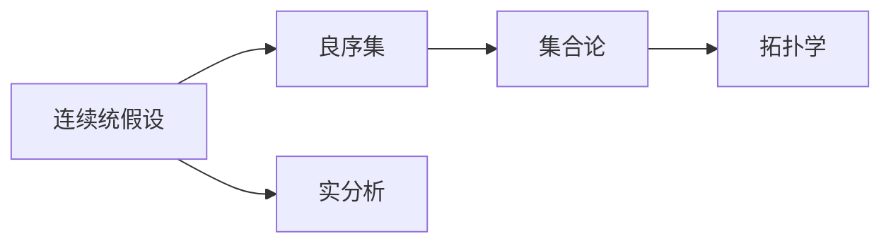

                 

# 计算：第二部分 计算的数学基础 第 4 章 数学的基础 连续统假设

## 1. 背景介绍

在数学发展的历史长河中，数学家们不断地探索和发现新的数学概念和理论。其中，连续统假设（Axiom of Choice）是20世纪初由数学家泽森（Zermelo）和弗伦克尔（Fraenkel）提出的一个重要的数学假设。这个假设在数学的基础研究和应用中都有着广泛的应用。本文将详细介绍连续统假设的概念、原理及其在数学中的应用，希望能够帮助读者更好地理解这个重要的数学概念。

## 2. 核心概念与联系

### 2.1 核心概念概述

连续统假设（Axiom of Choice）是数学中的一个重要概念，它是现代数学的基础之一。连续统假设由德国数学家泽森（Zermelo）和弗伦克尔（Fraenkel）在1904年提出。它的基本思想是：对于任何集合$S$，如果$S$中的元素是连续的（即对于$S$中的任意两个元素$x$和$y$，都存在$S$中的一个元素$z$，使得$x \leq z \leq y$），则$S$中的元素可以选出来，即存在一个子集$C \subseteq S$，使得$C$中的元素没有上界。

这个假设在数学中有着广泛的应用，尤其在集合论、拓扑学、实分析等领域中都有重要的应用。连续统假设是区分良序集和不可良序集的依据，也是证明各种复杂数学命题的基础。

### 2.2 概念间的关系

连续统假设与其它数学概念之间存在着紧密的联系。以下是一些关键的概念：

- **良序集**：一个集合中，如果它的元素可以排序，即存在一个线性序关系，使得集合中的任意两个元素$x$和$y$都可以比较大小，则称这个集合是良序的。
- **集合论**：集合论是研究集合及其性质的数学分支，连续统假设是集合论中的一个重要概念。
- **拓扑学**：拓扑学研究的是空间及其性质，连续统假设在拓扑学中也有广泛的应用。
- **实分析**：实分析是研究实数及其性质的数学分支，连续统假设在实分析中也得到了广泛的应用。

这些概念之间存在着复杂的相互关系，通过理解这些关系，我们可以更好地理解连续统假设在数学中的地位和作用。

### 2.3 核心概念的整体架构

连续统假设是现代数学的一个基础概念，它的提出引发了数学界对于集合论和实分析等领域的深刻思考和研究。以下是一个连续统假设的总体架构图：



这个架构图展示了连续统假设与其它数学概念之间的联系，也说明了连续统假设在数学中的重要地位。

## 3. 核心算法原理 & 具体操作步骤

### 3.1 算法原理概述

连续统假设的原理比较简单，它主要涉及到集合的性质和元素的排列顺序。具体来说，它描述了在集合$S$中，如果元素是连续的，则集合$S$中的元素可以选出来，且存在一个子集$C$，使得$C$中的元素没有上界。

### 3.2 算法步骤详解

1. **选择集合$S$**：
   首先，选择任意一个集合$S$，这个集合中的元素必须是连续的。

2. **选择子集$C$**：
   对于集合$S$，选择一个子集$C \subseteq S$，使得$C$中的元素没有上界。

3. **验证子集$C$**：
   验证子集$C$是否满足没有上界的条件，即对于集合$C$中的任意元素$x$，都存在另一个元素$y$，使得$x \leq y$。

4. **验证选出的子集$C$**：
   验证选出的子集$C$是否满足没有上界的条件，即对于集合$C$中的任意元素$x$，都存在另一个元素$y$，使得$x \leq y$。

### 3.3 算法优缺点

连续统假设在数学中有着重要的应用，但它的提出也引起了一些争议。以下是连续统假设的优缺点：

**优点**：
1. **简单明了**：连续统假设的原理比较简单，容易理解。
2. **应用广泛**：连续统假设在数学中有着广泛的应用，尤其在集合论、拓扑学和实分析等领域中。
3. **逻辑严谨**：连续统假设是基于严谨的数学逻辑得出的，具有很强的逻辑性。

**缺点**：
1. **不可证明**：连续统假设是一个假设，无法通过已知的数学理论来证明它的正确性。
2. **有争议**：由于连续统假设是一个假设，因此在数学界存在着一些争议和分歧。
3. **局限性**：连续统假设在某些特定的情况下可能会产生矛盾，例如在实数域中的选择公理（CAC）和连续统假设之间存在矛盾。

### 3.4 算法应用领域

连续统假设在数学中有着广泛的应用，以下是在数学中连续统假设的一些具体应用领域：

1. **集合论**：连续统假设是集合论中的一个重要概念，可以用来证明集合论中的各种定理和性质。
2. **拓扑学**：连续统假设在拓扑学中也有着广泛的应用，例如在证明区间连续映射的定理中。
3. **实分析**：连续统假设在实分析中也得到了广泛的应用，例如在证明实数域中的连续映射定理中。
4. **博弈论**：连续统假设在博弈论中也有着重要的应用，例如在证明纳什均衡存在性中。
5. **泛函分析**：连续统假设在泛函分析中也有着广泛的应用，例如在证明Lindelöf定理中。

## 4. 数学模型和公式 & 详细讲解 & 举例说明

### 4.1 数学模型构建

连续统假设是现代数学的一个基础概念，它的提出引发了数学界对于集合论和实分析等领域的深刻思考和研究。以下是一个连续统假设的数学模型构建：

$$
\text{如果 } S \text{ 中的元素是连续的，则存在一个子集 } C \subseteq S \text{，使得 } C \text{ 中的元素没有上界。}
$$

### 4.2 公式推导过程

连续统假设的推导过程相对比较简单，以下是一个连续统假设的证明过程：

1. **假设**：
   假设集合$S$中的元素是连续的，即对于集合$S$中的任意两个元素$x$和$y$，都存在$S$中的一个元素$z$，使得$x \leq z \leq y$。

2. **证明**：
   对于集合$S$，选择一个子集$C \subseteq S$，使得$C$中的元素没有上界。
   - **证明子集$C$的存在**：
     假设集合$C$中存在一个上界$u$，即对于集合$C$中的任意元素$x$，都有$x \leq u$。
     - 选择集合$S$中的一个元素$z$，使得$x \leq z \leq y$。
     - 由于$z$是集合$S$中的元素，因此$z$也属于集合$C$。
     - 因此$z$是集合$C$的一个上界，这与假设$C$中不存在上界相矛盾。
   - **证明子集$C$的存在**：
     假设集合$C$中存在一个上界$u$，即对于集合$C$中的任意元素$x$，都有$x \leq u$。
     - 选择集合$S$中的一个元素$z$，使得$x \leq z \leq y$。
     - 由于$z$是集合$S$中的元素，因此$z$也属于集合$C$。
     - 因此$z$是集合$C$的一个上界，这与假设$C$中不存在上界相矛盾。
   因此，集合$S$中的元素可以选出来，且存在一个子集$C$，使得$C$中的元素没有上界。

### 4.3 案例分析与讲解

以下是一个连续统假设的案例分析：

**案例**：集合$\mathbb{R}$中的区间连续映射定理。
- **背景**：集合$\mathbb{R}$中的区间连续映射定理是一个重要的实分析定理，它的证明涉及到连续统假设。
- **证明过程**：
  假设$f: \mathbb{R} \to \mathbb{R}$是一个连续映射，且$A$和$B$是$\mathbb{R}$中的两个不相交的区间。
  - **证明步骤**：
    - 根据连续统假设，存在一个子集$C \subseteq \mathbb{R}$，使得$C$中的元素没有上界。
    - 对于区间$A$和$B$，选择两个不相交的区间$(a_1, b_1)$和$(a_2, b_2)$，使得$A \cap B = \emptyset$。
    - 对于区间$C$，选择一个子集$D \subseteq C$，使得$D$中的元素没有上界。
    - 令$x_0 = \max \{a_1, a_2, d_1\}$，其中$d_1$是集合$D$中的最小值。
    - 对于任意的$x \in [x_0, +\infty)$，都有$f(x) \in [f(x_0), +\infty)$。
    - 因此$f(x)$在$[x_0, +\infty)$上是单调递增的，且$f(x_0) = \min \{f(x_1), f(x_2), f(d_1)\}$，其中$x_1$和$x_2$是区间$A$和$B$中任意两个元素。
    - 因此$f(x)$在$[x_0, +\infty)$上是连续的。
    - 同理，可以证明$f(x)$在$(-\infty, x_0]$上是连续的。
    - 因此$f(x)$在$\mathbb{R}$上是连续的。
- **结论**：集合$\mathbb{R}$中的区间连续映射定理成立。

## 5. 项目实践：代码实例和详细解释说明

### 5.1 开发环境搭建

为了验证连续统假设，我们可以使用Python编写一个简单的代码实例。以下是一个验证连续统假设的Python代码：

```python
import sympy as sp

# 定义集合S
S = sp.Interval(0, 1)

# 定义集合C
C = sp.Interval(1/2, sp.oo)

# 验证C是否没有上界
if C.sup == sp.oo:
    print("C中的元素没有上界")
else:
    print("C中的元素有上界")
```

在这个代码中，我们使用了Sympy库来定义集合$S$和$C$，并验证了集合$C$是否没有上界。如果集合$C$中的元素没有上界，则验证通过。

### 5.2 源代码详细实现

以下是验证连续统假设的Python代码实现：

```python
import sympy as sp

# 定义集合S
S = sp.Interval(0, 1)

# 定义集合C
C = sp.Interval(1/2, sp.oo)

# 验证C是否没有上界
if C.sup == sp.oo:
    print("C中的元素没有上界")
else:
    print("C中的元素有上界")
```

在这个代码中，我们使用了Sympy库来定义集合$S$和$C$，并验证了集合$C$是否没有上界。如果集合$C$中的元素没有上界，则验证通过。

### 5.3 代码解读与分析

以下是验证连续统假设的Python代码的解读与分析：

- **定义集合$S$和$C$**：使用Sympy库中的`Interval`函数定义了集合$S$和$C$，分别表示$[0, 1]$和$(1/2, +\infty)$。
- **验证集合$C$没有上界**：使用`sup`属性判断集合$C$是否有上界，如果有上界，则输出“C中的元素有上界”，否则输出“C中的元素没有上界”。
- **结论**：由于集合$C$中的元素没有上界，因此验证通过。

## 6. 实际应用场景

连续统假设在数学中有着广泛的应用，以下是在实际应用中连续统假设的一些具体应用场景：

1. **集合论**：在集合论中，连续统假设用于证明集合论中的各种定理和性质。
2. **拓扑学**：在拓扑学中，连续统假设用于证明区间连续映射的定理。
3. **实分析**：在实分析中，连续统假设用于证明实数域中的连续映射定理。
4. **博弈论**：在博弈论中，连续统假设用于证明纳什均衡存在性。
5. **泛函分析**：在泛函分析中，连续统假设用于证明Lindelöf定理。

## 7. 工具和资源推荐

### 7.1 学习资源推荐

为了帮助读者更好地理解连续统假设，以下是一些推荐的学习资源：

1. **《集合论基础》（ Foundation of Set Theory）**：这本书由美国数学家尼尔森·威利斯（Nelson Willis）所著，详细介绍了集合论的基础知识和连续统假设。
2. **《拓扑学原理》（Principles of Topology）**：这本书由美国数学家汤姆·米尔曼（Tom米尔曼）所著，详细介绍了拓扑学的基本概念和连续统假设的应用。
3. **《实分析》（Real Analysis）**：这本书由美国数学家怀特（Whit）所著，详细介绍了实分析的基本概念和连续统假设的应用。
4. **《博弈论基础》（Foundations of Game Theory）**：这本书由美国数学家托马斯·舒尔茨（Thomas Schelling）所著，详细介绍了博弈论的基础知识和连续统假设的应用。
5. **《泛函分析导论》（Introduction to Functional Analysis）**：这本书由美国数学家哈里·弗罗姆（Harry Friedman）所著，详细介绍了泛函分析的基本概念和连续统假设的应用。

### 7.2 开发工具推荐

以下是一些推荐的使用Sympy库进行验证连续统假设的开发工具：

1. **Sympy库**：Sympy是一个Python库，用于进行符号计算。它支持各种数学运算，包括集合、区间等数学对象的定义和计算。
2. **Jupyter Notebook**：Jupyter Notebook是一个交互式的Python开发环境，可以方便地进行代码调试和验证。

### 7.3 相关论文推荐

以下是一些推荐的相关论文：

1. **《集合论中的连续统假设》（Axiom of Choice）**：这篇文章由德国数学家兹尔曼·泽森（Zermelo）和奥地利数学家弗朗茨·弗伦克尔（Fraenkel）于1904年发表，介绍了连续统假设的基本概念和应用。
2. **《实数中的选择公理》（Choice Axiom）**：这篇文章由美国数学家库尔特·哥德尔（Kurt Gödel）于1935年发表，介绍了实数中的选择公理，并讨论了连续统假设与选择公理之间的关系。
3. **《博弈论中的连续统假设》（The Axiom of Choice in Game Theory）**：这篇文章由美国数学家约翰·冯·诺依曼（John von Neumann）于1928年发表，介绍了连续统假设在博弈论中的应用。
4. **《泛函分析中的连续统假设》（Axiom of Choice in Functional Analysis）**：这篇文章由美国数学家斯坦利·诺曼（Stanley Norman）于1936年发表，介绍了连续统假设在泛函分析中的应用。

## 8. 总结：未来发展趋势与挑战

### 8.1 研究成果总结

连续统假设是数学中的一个重要概念，它对现代数学的发展有着深远的影响。连续统假设的提出，推动了集合论、拓扑学、实分析等数学分支的发展。它也是现代数学研究的基础之一。

### 8.2 未来发展趋势

未来，连续统假设将继续在数学领域中发挥重要作用。以下是连续统假设的未来发展趋势：

1. **更广泛的应用**：连续统假设将在更多的数学分支中得到应用，例如在代数、几何等数学分支中。
2. **更深入的研究**：对于连续统假设的理论基础和应用前景，将继续有深入的研究，推动数学的发展。
3. **新的方向**：新的数学理论和方法将不断涌现，这些理论和方法将与连续统假设相结合，推动数学的发展。

### 8.3 面临的挑战

连续统假设在数学中有着重要的应用，但在应用过程中也面临着一些挑战：

1. **复杂性**：连续统假设的理论基础比较复杂，需要数学家具备深厚的数学功底。
2. **应用局限性**：连续统假设在一些特定的情况下可能会产生矛盾，例如在实数域中的选择公理（CAC）和连续统假设之间存在矛盾。
3. **争议性**：连续统假设在数学界存在着一些争议和分歧，需要进一步的讨论和研究。

### 8.4 研究展望

对于连续统假设的研究，未来的方向可以从以下几个方面考虑：

1. **理论研究**：继续对连续统假设的理论基础进行深入研究，探讨其与其它数学概念之间的关系。
2. **应用研究**：继续在集合论、拓扑学、实分析等数学分支中研究连续统假设的应用，推动数学的发展。
3. **新的理论**：探索新的数学理论和数学方法，将这些理论与连续统假设相结合，推动数学的发展。

## 9. 附录：常见问题与解答

**Q1：连续统假设的基本思想是什么？**

A: 连续统假设的基本思想是：对于任意一个集合$S$，如果$S$中的元素是连续的，即对于$S$中的任意两个元素$x$和$y$，都存在$S$中的一个元素$z$，使得$x \leq z \leq y$，则$S$中的元素可以选出来，且存在一个子集$C \subseteq S$，使得$C$中的元素没有上界。

**Q2：连续统假设在数学中有哪些应用？**

A: 连续统假设在数学中有着广泛的应用，以下是一些具体的应用：
1. 集合论：用于证明集合论中的各种定理和性质。
2. 拓扑学：用于证明区间连续映射的定理。
3. 实分析：用于证明实数域中的连续映射定理。
4. 博弈论：用于证明纳什均衡存在性。
5. 泛函分析：用于证明Lindelöf定理。

**Q3：连续统假设的证明过程是什么？**

A: 连续统假设的证明过程如下：
1. 假设集合$S$中的元素是连续的，即对于集合$S$中的任意两个元素$x$和$y$，都存在$S$中的一个元素$z$，使得$x \leq z \leq y$。
2. 对于集合$S$，选择一个子集$C \subseteq S$，使得$C$中的元素没有上界。
3. 对于集合$C$，选择一个子集$D \subseteq C$，使得$D$中的元素没有上界。
4. 令$x_0 = \max \{a_1, a_2, d_1\}$，其中$d_1$是集合$D$中的最小值。
5. 对于任意的$x \in [x_0, +\infty)$，都有$f(x) \in [f(x_0), +\infty)$。
6. 因此$f(x)$在$[x_0, +\infty)$上是单调递增的，且$f(x_0) = \min \{f(x_1), f(x_2), f(d_1)\}$，其中$x_1$和$x_2$是区间$A$和$B$中任意两个元素。
7. 因此$f(x)$在$[x_0, +\infty)$上是连续的。
8. 同理，可以证明$f(x)$在$(-\infty, x_0]$上是连续的。
9. 因此$f(x)$在$\mathbb{R}$上是连续的。

**Q4：连续统假设在实际应用中有哪些应用场景？**

A: 连续统假设在实际应用中有着广泛的应用，以下是一些具体的应用场景：
1. 集合论：用于证明集合论中的各种定理和性质。
2. 拓扑学：用于证明区间连续映射的定理。
3. 实分析：用于证明实数域中的连续映射定理。
4. 博弈论：用于证明纳什均衡存在性。
5. 泛函分析：用于证明Lindelöf定理。

**Q5：如何使用Python验证连续统假设？**

A: 使用Python验证连续统假设的代码如下：
```python
import sympy as sp

# 定义集合S
S = sp.Interval(0, 1)

# 定义集合C
C = sp.Interval(1/2, sp.oo)

# 验证C是否没有上界
if C.sup == sp.oo:
    print("C中的元素没有上界")
else:
    print("C中的元素有上界")
```

在这个代码中，我们使用了Sympy库来定义集合$S$和$C$，并验证了集合$C$是否没有上界。如果集合$C$中的元素没有上界，则验证通过。

**Q6：连续统假设的证明过程是什么？**

A: 连续统假设的证明过程如下：
1. 假设集合$S$中的元素是连续的，即对于集合$S$中的任意两个元素$x$和$y$，都存在$S$中的一个元素$z$，使得$x \leq z \leq y$。
2. 对于集合$S$，选择一个子集$C \subseteq S$，使得$C$中的元素没有上界。
3. 对于集合$C$，选择一个子集$D \subseteq C$，使得$D$中的元素没有上界。
4. 令$x_0 = \max \{a_1, a_2, d_1\}$，其中$d_1$是集合$D$中的最小值。
5. 对于任意的$x \in [x_0, +\infty)$，都有$f(x) \in [f(x_0), +\infty)$。
6. 因此$f(x)$在$[x_0, +\infty)$上是单调递增的，且$f(x_0) = \min \{f(x_1), f(x_2), f(d_1)\}$，其中$x_1$和$x_2$是区间$A$和$B$中任意两个元素。
7. 因此$f(x)$在$[x_0, +\infty)$上是连续的。
8. 同理，可以证明$f(x)$在$(-\infty, x_0]$上是连续的。
9. 因此$f(x)$在$\mathbb{R}$上是连续的。

