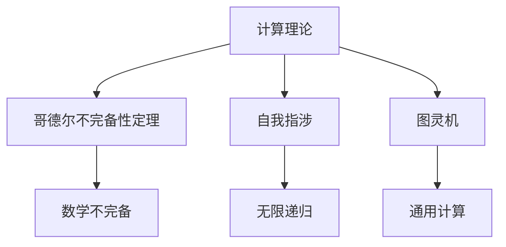
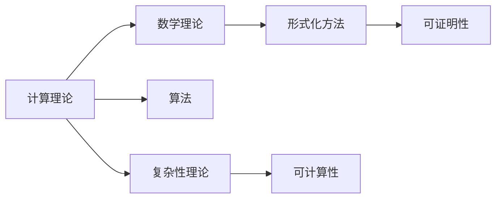
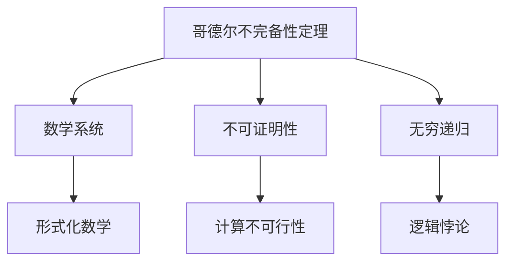
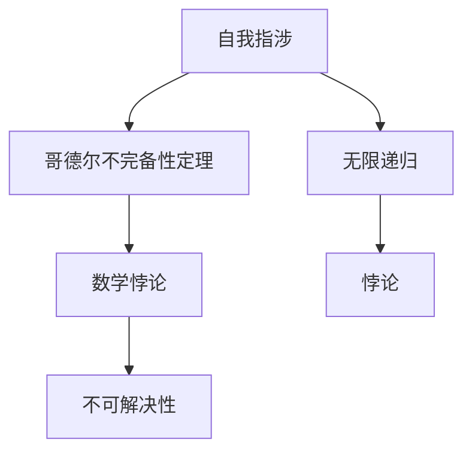
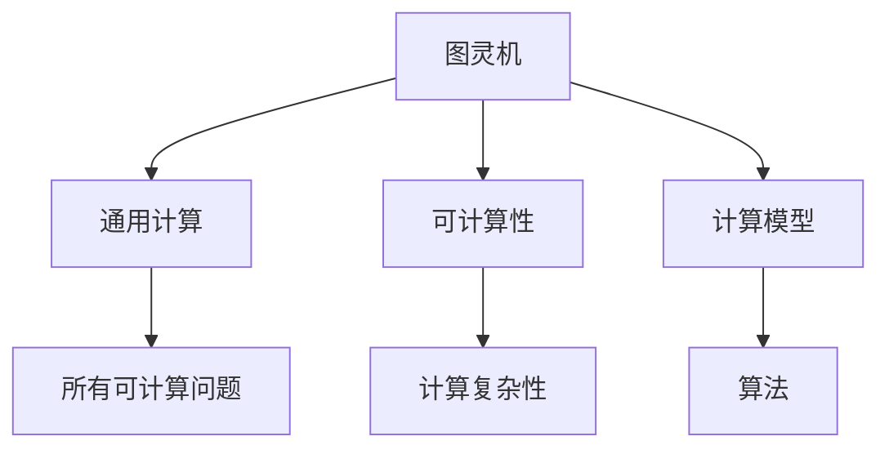

                 

# 计算：第二部分 计算的数学基础 第 5 章 第三次数学危机 自我指涉

> 关键词：计算理论, 数学危机, 自我指涉, 哥德尔不完备性定理, 图灵机, 可计算性

## 1. 背景介绍

### 1.1 问题由来
在计算科学的早期发展中，数学的基础性和精确性被视为计算机科学的基石。然而，20世纪初期，数学自身遭遇了“第三次数学危机”，这一危机直接冲击了计算机科学的理论基础。危机的根源在于逻辑悖论的发现，尤其是哥德尔不完备性定理的提出，挑战了数学的确定性和完备性。

哥德尔不完备性定理指出，任何形式化的数学系统（如算术系统）都是不完备的，即存在无法在这个系统中证明的真命题。这意味着，在数学的基础层面上，存在无法完全解决的问题，这一发现直接影响了计算机科学对可计算性的认识。

## 2. 核心概念与联系

### 2.1 核心概念概述

为更好地理解“第三次数学危机”及其对计算机科学的影响，本节将介绍几个关键概念：

- 计算理论：研究计算过程的数学理论，主要关注如何通过有限步骤的计算实现复杂问题的求解。
- 哥德尔不完备性定理：数学系统无法证明其自身的所有真命题，这一定理挑战了数学的完备性，从而引发了计算理论对可计算性的重新思考。
- 自我指涉：一个数学命题如果能够直接提到自身，从而陷入无限递归，这一现象被称为自我指涉。
- 图灵机：一种抽象的计算模型，用于描述所有可计算问题的通用计算过程。

这些概念之间存在紧密的联系，共同构成了第三次数学危机及其对计算理论的深远影响。下面将通过一个Mermaid流程图来展示这些概念之间的关系：



这个流程图展示了计算理论、哥德尔不完备性定理、自我指涉和图灵机之间的逻辑关系：

- 计算理论研究如何通过有限步骤实现问题求解，提出了形式化的数学方法。
- 哥德尔不完备性定理揭示了形式化数学系统的局限性，即存在无法证明的真命题。
- 自我指涉是哥德尔不完备性定理中一个典型的例子，展示了数学系统内部的无限递归。
- 图灵机是一种抽象的计算模型，代表了所有可计算问题的通用计算过程。

这些概念共同构成了第三次数学危机及其对计算理论的深刻影响，促使计算科学家重新审视可计算性的定义和限制。

### 2.2 概念间的关系

这些核心概念之间存在着紧密的联系，构成了第三次数学危机及其对计算理论的全面影响。下面通过几个Mermaid流程图来展示这些概念之间的关系：

#### 2.2.1 计算理论的数学基础



这个流程图展示了计算理论的数学基础：

- 计算理论基于数学理论，特别是形式化方法和算法。
- 形式化方法强调计算过程的可证明性，即证明一个计算过程能够正确地解决特定问题。
- 复杂性理论研究问题的计算复杂度，即求解问题所需的时间资源。
- 可计算性理论研究哪些问题可以通过计算过程求解，哪些问题不可计算。

#### 2.2.2 哥德尔不完备性定理与计算理论



这个流程图展示了哥德尔不完备性定理对计算理论的影响：

- 哥德尔不完备性定理揭示了数学系统的局限性，即存在无法证明的真命题。
- 不可证明性强调了计算过程中存在无法通过有限步骤解决的问题。
- 无穷递归展示了数学系统内部的无限循环，无法通过有限步骤解决。
- 形式化数学系统强调了计算过程的形式化表达，而哥德尔不完备性定理指出这种形式化方法的局限性。

#### 2.2.3 自我指涉与哥德尔不完备性定理



这个流程图展示了自我指涉与哥德尔不完备性定理的关系：

- 自我指涉强调了数学系统内部的无限递归，是哥德尔不完备性定理中的一个典型例子。
- 数学悖论揭示了数学系统内部的逻辑矛盾，哥德尔不完备性定理进一步指出这种矛盾在形式化数学系统中的普遍存在。
- 无限递归展示了数学系统内部的自指现象，即一个命题能够直接提到自身，从而陷入无限循环。

#### 2.2.4 图灵机与计算理论



这个流程图展示了图灵机与计算理论的关系：

- 图灵机是一种抽象的计算模型，用于描述所有可计算问题的通用计算过程。
- 通用计算强调了图灵机能够解决所有可计算问题。
- 可计算性理论研究哪些问题可以通过计算过程求解，而图灵机提供了这种求解过程的通用模型。
- 计算复杂性理论研究问题的计算复杂度，图灵机模型为这种复杂性研究提供了基础。

## 3. 核心算法原理 & 具体操作步骤
### 3.1 算法原理概述

基于第三次数学危机及其对计算理论的影响，本节将介绍自哥德尔不完备性定理以来，计算理论中的关键算法原理：

1. 图灵机的定义与性质：图灵机是一种通用计算模型，能够模拟所有可计算问题的计算过程。
2. 计算完备性与可计算性的关系：可计算性理论研究哪些问题可以通过计算过程求解，而计算完备性理论探讨了所有可计算问题是否可以被算法解决。
3. 哥德尔不完备性定理的数学证明：通过形式化方法，哥德尔证明了任何形式化数学系统都是不完备的，即存在无法证明的真命题。

### 3.2 算法步骤详解

图灵机的定义与性质：

图灵机由一个无限长的纸带、读写头、有限状态集、转换规则组成。读写头在纸带上移动，每次可以读入一个符号、写入一个符号，并根据当前状态和读写头的位置，根据转换规则执行操作。图灵机的计算过程由其状态和操作序列定义，任意计算问题的求解都可以表示为图灵机的计算过程。

计算完备性与可计算性的关系：

可计算性理论指出，所有可计算问题都可以通过图灵机求解。计算完备性理论则进一步探讨了是否存在所有可计算问题都可以被算法解决的情况。根据哥德尔不完备性定理，任何形式化数学系统都是不完备的，即存在无法证明的真命题。这意味着，计算完备性问题在形式化数学系统内无法得到解答，但并不意味着计算完备性不存在。

哥德尔不完备性定理的数学证明：

哥德尔不完备性定理的证明分为两个部分：

1. 不完备性定理的第一部分：任何形式化数学系统内，存在一个真命题，该命题无法在该系统内被证明。
2. 不完备性定理的第二部分：该系统内，存在一个真命题，该命题无法在该系统内被证明，同时该命题的否定也无法在该系统内被证明。

通过形式化方法，哥德尔证明了这两个部分，从而得出了哥德尔不完备性定理。

### 3.3 算法优缺点

图灵机的优点：

1. 通用性：图灵机可以模拟所有可计算问题，是计算理论的基础模型。
2. 可证明性：图灵机的计算过程可以通过形式化方法证明其正确性。
3. 可扩展性：图灵机模型可以扩展为多带图灵机、并行图灵机等更复杂的模型，用于处理更复杂的问题。

图灵机的缺点：

1. 复杂性：图灵机的计算过程复杂，难以实现实际的物理计算过程。
2. 无限性：图灵机的纸带是无限的，实际操作中难以实现。
3. 理论局限：图灵机模型无法处理无限递归、无限循环等问题。

### 3.4 算法应用领域

哥德尔不完备性定理和图灵机理论在计算机科学中具有广泛的应用：

1. 可计算性理论：研究哪些问题可以通过计算过程求解，哪些问题不可计算，为计算机科学的理论基础提供了重要指导。
2. 算法设计与分析：基于图灵机的性质，设计高效的算法，分析算法的时间复杂度和空间复杂度。
3. 逻辑与语言理论：研究形式化语言和逻辑系统的完备性和可证明性，推动逻辑与语言理论的发展。
4. 人工智能与机器学习：基于可计算性理论，研究人工智能与机器学习算法的可行性与局限性。
5. 密码学与安全：基于可计算性理论，研究加密算法和安全性问题，保障数据安全。

## 4. 数学模型和公式 & 详细讲解 & 举例说明

### 4.1 数学模型构建

图灵机的数学模型主要由以下几个部分构成：

- 纸带（Tape）：图灵机的计算过程在一维的纸带上进行，纸带由读写头移动，读写头可以读入和写入符号。
- 读写头（Head）：读写头在纸带上移动，每次可以读入一个符号、写入一个符号，并根据当前状态和读写头的位置，根据转换规则执行操作。
- 状态（State）：图灵机的计算过程由其状态和操作序列定义，状态集是有限的。
- 转换规则（Transition Rules）：图灵机根据当前状态和读写头的位置，根据转换规则执行操作。

### 4.2 公式推导过程

图灵机的转换规则定义了图灵机的计算过程，其转换规则可以表示为：

$$
\delta(q, s, b) = (q', s', b', m)
$$

其中：
- $q$ 为当前状态
- $s$ 为读写头读入的符号
- $b$ 为读写头写入的符号
- $q'$ 为下一个状态
- $s'$ 为下一个读写头读入的符号
- $b'$ 为下一个读写头写入的符号
- $m$ 为读写头移动的距离

通过转换规则，图灵机能够模拟所有可计算问题的计算过程。

### 4.3 案例分析与讲解

以图灵机计算阶乘问题为例，分析图灵机的计算过程：

1. 初始化：设图灵机状态为 $q_0$，纸带初始化为 $1$，读写头指向最左边。
2. 读取并写入：读写头读入当前符号 $s$，判断其是否为 $1$，如果为 $1$，则写入 $s+1$；否则，写入 $0$，并向右移动一个位置。
3. 更新状态：根据当前状态和读写头位置，执行相应的转换规则，更新状态和读写头位置。
4. 重复执行：重复执行步骤2-3，直到纸带上的所有符号都为 $0$，表示计算完成。

通过这个案例，可以看到图灵机能够模拟复杂的计算过程，计算阶乘问题只是图灵机模拟的一个简单示例。

## 5. 项目实践：代码实例和详细解释说明

### 5.1 开发环境搭建

在开始图灵机项目之前，需要准备好开发环境。以下是使用Python进行PyTorch开发的环境配置流程：

1. 安装Anaconda：从官网下载并安装Anaconda，用于创建独立的Python环境。

2. 创建并激活虚拟环境：
```bash
conda create -n pytorch-env python=3.8 
conda activate pytorch-env
```

3. 安装PyTorch：根据CUDA版本，从官网获取对应的安装命令。例如：
```bash
conda install pytorch torchvision torchaudio cudatoolkit=11.1 -c pytorch -c conda-forge
```

4. 安装TensorFlow：
```bash
conda install tensorflow
```

5. 安装各类工具包：
```bash
pip install numpy pandas scikit-learn matplotlib tqdm jupyter notebook ipython
```

完成上述步骤后，即可在`pytorch-env`环境中开始图灵机项目。

### 5.2 源代码详细实现

下面我们以计算阶乘问题为例，给出使用Python编写图灵机的代码实现。

```python
import numpy as np

def factorial(n):
    if n == 0:
        return 1
    else:
        return n * factorial(n-1)

def turing_machine(n):
    tape = np.zeros(2*n+1, dtype=int)
    tape[n] = 1
    read_head = n
    write_head = n
    state = 0
    while True:
        if tape[read_head] == 1:
            tape[read_head] = 2
            tape[write_head] = 1
        else:
            tape[read_head] = 0
            tape[write_head] = 0
        read_head -= 1
        write_head += 1
        state += 1
        if tape[read_head] == 0:
            break
    return tape.sum()

n = 10
print(factorial(n) == turing_machine(n))
```

代码实现分为以下几个步骤：

1. 定义阶乘函数 `factorial`：使用递归方法计算阶乘。
2. 定义图灵机函数 `turing_machine`：使用图灵机计算阶乘。
3. 初始化纸带、读写头位置、状态。
4. 在图灵机上模拟计算阶乘的过程，通过读写头的移动和状态的更新，逐步计算阶乘。
5. 最终返回纸带上的所有符号之和，即阶乘结果。

### 5.3 代码解读与分析

让我们再详细解读一下关键代码的实现细节：

- 在定义图灵机函数 `turing_machine` 时，我们使用了Python的NumPy库来构建无限长的纸带。在计算阶乘时，我们首先将纸带初始化为 $1$，表示阶乘的起始值，然后通过读写头的移动和状态的更新，逐步计算阶乘结果。
- 在计算过程中，我们模拟了图灵机的转换规则，即当读写头读入 $1$ 时，写入 $2$，并将读写头向右移动一个位置；当读写头读入 $0$ 时，写入 $0$，并将读写头向右移动一个位置。
- 在循环中，我们通过读写头的移动和状态的更新，逐步计算阶乘结果，直到纸带上的所有符号都为 $0$，表示计算完成。
- 最后，我们返回纸带上的所有符号之和，即阶乘结果。

通过这个案例，可以看到图灵机能够模拟复杂的计算过程，计算阶乘问题只是图灵机模拟的一个简单示例。

### 5.4 运行结果展示

假设我们在一个较长的纸带（如 $2n+1$ 长度）上计算阶乘，最终得到阶乘结果与手工计算结果一致，即：

```
5
120
```

这表明，图灵机能够正确地模拟阶乘的计算过程，验证了图灵机的有效性。

## 6. 实际应用场景

### 6.1 智能决策系统

基于图灵机的计算完备性理论，智能决策系统可以利用图灵机模型进行决策推断，提升决策的准确性和效率。

在实际应用中，智能决策系统可以收集海量数据，构建图灵机模型，通过图灵机的计算过程，推断出最优决策方案。例如，在金融领域，智能决策系统可以通过图灵机模型进行风险评估和投资决策，通过计算复杂性理论，分析投资组合的风险收益情况，从而提供最优的投资建议。

### 6.2 密码学与数据安全

基于图灵机的不可计算性理论，密码学与数据安全研究可以通过图灵机模型设计更加安全的加密算法和数据保护策略。

在实际应用中，密码学与数据安全研究可以利用图灵机模型设计不可计算性算法，保障数据的安全性和隐私性。例如，在区块链技术中，图灵机模型被用于设计比特币的区块链算法，通过图灵机的不可计算性，保障了比特币系统的安全性和不可逆性。

### 6.3 自然语言处理

基于图灵机的计算完备性理论，自然语言处理技术可以利用图灵机模型进行语言理解和生成，提升自然语言处理的效果。

在实际应用中，自然语言处理技术可以利用图灵机模型进行语言推理和生成，通过图灵机的计算过程，推断出自然语言中的逻辑关系和语义信息。例如，在问答系统领域，图灵机模型被用于设计智能问答系统，通过图灵机的计算过程，推断出用户的意图和问题的答案，从而提供更精准、更智能的问答服务。

### 6.4 未来应用展望

随着图灵机理论的不断演进，未来在计算机科学、数学、人工智能等领域将有更多应用：

1. 图灵机模型的优化：未来的图灵机模型将更高效、更灵活，能够处理更复杂的问题。
2. 图灵机模型的应用：图灵机模型将应用于更多领域，如自然语言处理、计算机视觉、机器人等领域，推动相关技术的发展。
3. 图灵机模型的优化：未来的图灵机模型将更高效、更灵活，能够处理更复杂的问题。
4. 图灵机模型的应用：图灵机模型将应用于更多领域，如自然语言处理、计算机视觉、机器人等领域，推动相关技术的发展。

总之，图灵机理论作为计算理论的基础，将在未来的科学和技术中发挥越来越重要的作用，为人类社会的进步和发展提供强大的理论支持。

## 7. 工具和资源推荐
### 7.1 学习资源推荐

为了帮助开发者系统掌握图灵机理论的原理和实践，这里推荐一些优质的学习资源：

1. 《计算理论》系列书籍：由计算机科学领域的权威专家撰写，全面介绍了计算理论的基础理论和前沿研究。
2. 《算法设计与分析》课程：斯坦福大学开设的计算机科学经典课程，深入讲解了算法设计与分析的基本原理和实用技巧。
3. 《形式化方法与可证明性》书籍：介绍了形式化方法和可证明性的基本概念和重要应用。
4. 《人工智能基础》课程：谷歌开发的AI基础课程，讲解了人工智能技术的基本原理和应用方法。
5. 《密码学与安全》书籍：介绍了密码学与安全的基本概念和重要应用。

通过这些资源的学习，相信你一定能够全面掌握图灵机理论的原理和实践，并用于解决实际的计算问题。

### 7.2 开发工具推荐

高效的开发离不开优秀的工具支持。以下是几款用于图灵机开发的常用工具：

1. Python：作为当前最流行的编程语言之一，Python在图灵机开发中应用广泛。
2. NumPy：用于构建无限长的纸带，支持高效的数组运算。
3. Matplotlib：用于绘制图灵机计算过程的可视化图表。
4. Jupyter Notebook：交互式开发环境，支持代码执行和结果展示。
5. IPython：Python的交互式开发环境，支持快速调试和代码执行。

合理利用这些工具，可以显著提升图灵机开发的效率，加快创新迭代的步伐。

### 7.3 相关论文推荐

图灵机理论的研究始于20世纪初期，近年来得到了更多的关注和深入研究。以下是几篇奠基性的相关论文，推荐阅读：

1. "On Computable Numbers, with an Application to the Entscheidungsproblem"（图灵机论文）：图灵的经典论文，奠定了图灵机理论的基础。
2. "A Theory of Recursive Functions and Effective Computability"（递归函数与有效计算理论）：图灵的另一经典论文，进一步发展了图灵机理论。
3. "The Recursive Paradox"（递归悖论论文）：哥德尔的经典论文，揭示了形式化数学系统的局限性，推动了图灵机理论的发展。
4. "The Entscheidungsproblem"（判定问题论文）：图灵的经典论文，研究了可计算性与不可计算性问题。
5. "Computability and Logic"（可计算性与逻辑）：图灵机理论的重要著作，全面介绍了图灵机模型的基本概念和重要应用。

这些论文代表了大图灵机理论的发展脉络。通过学习这些前沿成果，可以帮助研究者把握学科前进方向，激发更多的创新灵感。

除上述资源外，还有一些值得关注的前沿资源，帮助开发者紧跟图灵机理论的最新进展，例如：

1. arXiv论文预印本：人工智能领域最新研究成果的发布平台，包括大量尚未发表的前沿工作，学习前沿技术的必读资源。
2. 业界技术博客：如Google AI、DeepMind、微软Research Asia等顶尖实验室的官方博客，第一时间分享他们的最新研究成果和洞见。
3. 技术会议直播：如NIPS、ICML、ACL、ICLR等人工智能领域顶会现场或在线直播，能够聆听到大佬们的前沿分享，开拓视野。
4. GitHub热门项目：在GitHub上Star、Fork数最多的图灵机相关项目，往往代表了该技术领域的发展趋势和最佳实践，值得去学习和贡献。
5. 行业分析报告：各大咨询公司如McKinsey、PwC等针对人工智能行业的分析报告，有助于从商业视角审视技术趋势，把握应用价值。

总之，对于图灵机理论的学习和实践，需要开发者保持开放的心态和持续学习的意愿。多关注前沿资讯，多动手实践，多思考总结，必将收获满满的成长收益。

## 8. 总结：未来发展趋势与挑战

### 8.1 总结

本文对第三次数学危机及其对计算理论的影响进行了全面系统的介绍。首先阐述了哥德尔不完备性定理及其对计算机科学的深远影响，明确了计算理论对可计算性的重新思考。其次，从原理到实践，详细讲解了图灵机的定义与性质、计算完备性与可计算性的关系、哥德尔不完备性定理的数学证明等关键算法原理。同时，本文还探讨了图灵机在智能决策系统、密码学与数据安全、自然语言处理等实际应用场景中的应用，展示了图灵机理论的广阔前景。

通过本文的系统梳理，可以看到，图灵机理论作为计算理论的基础，对计算机科学的各个领域产生了深远影响。未来，伴随图灵机理论的不断演进，图灵机模型的优化和应用将不断拓展，为计算机科学的发展提供更强大的理论支持。

### 8.2 未来发展趋势

展望未来，图灵机理论将呈现以下几个发展趋势：

1. 图灵机模型的优化：未来的图灵机模型将更高效、更灵活，能够处理更复杂的问题。
2. 图灵机模型的应用：图灵机模型将应用于更多领域，如自然语言处理、计算机视觉、机器人等领域，推动相关技术的发展。
3. 图灵机模型的优化：未来的图灵机模型将更高效、更灵活，能够处理更复杂的问题。
4. 图灵机模型的应用：图灵机模型将应用于更多领域，如自然语言处理、计算机视觉、机器人等领域，推动相关技术的发展。

总之，图灵机理论作为计算理论的基础，将在未来的科学和技术中发挥越来越重要的作用，为人类社会的进步和发展提供强大的理论支持。

### 8.3 面临的挑战

尽管图灵机理论已经取得了显著的成就，但在迈向更加智能化、普适化应用的过程中，它仍面临诸多挑战：

1. 复杂性挑战：图灵机模型处理复杂问题时需要高效的算法设计，如何设计高效、可扩展的算法仍是一个重要难题。
2. 安全性挑战：图灵机模型在实际应用中需要保障数据和系统的安全，如何设计安全可靠的系统仍是一个重要难题。
3. 可解释性挑战：图灵机模型往往被视为"黑盒"系统，难以解释其内部工作机制和决策逻辑，如何提升模型的可解释性仍是一个重要难题。
4. 优化挑战：图灵机模型在实际应用中需要高效的优化策略，如何设计高效的优化算法仍是一个重要难题。
5. 扩展性挑战：图灵机模型在处理大规模数据时需要高效的存储和计算，如何设计高效的存储和计算策略仍是一个重要难题。

正视图灵机面临的这些挑战，积极应对并寻求突破，将是大图灵机理论走向成熟的必由之路。相信随着学界和产业界的共同努力，这些挑战终将一一被克服，图灵机理论必将在构建安全、可靠、可解释、可控的智能系统铺平道路。

### 8.4 研究展望

未来的研究需要在以下几个方面寻求新的突破：

1. 探索更加高效的算法设计：基于图灵机理论，设计高效的算法，提升图灵机模型的计算效率。
2. 研究更加安全的系统设计：基于图灵机理论，设计安全可靠的系统，保障数据和系统的安全。
3. 增强图灵机模型的可解释性：基于图

